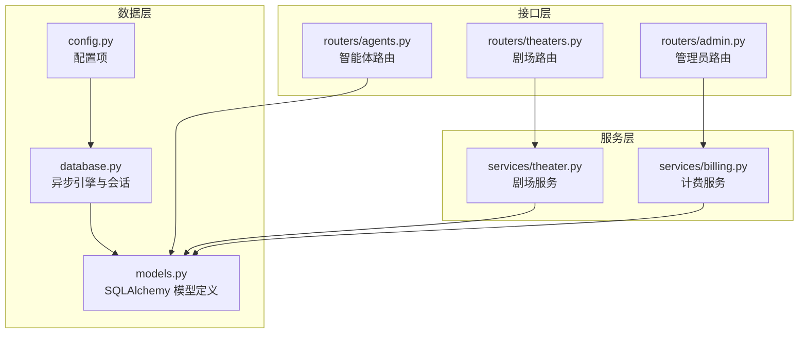
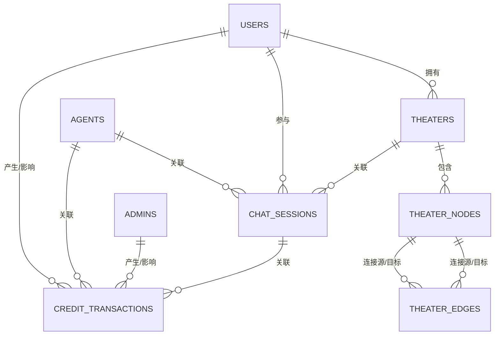
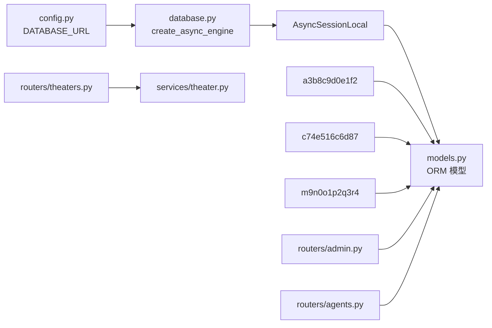

# 数据模型设计

<cite>
**本文档引用的文件**
- [models.py](file://backend/models.py)
- [schemas.py](file://backend/schemas.py)
- [database.py](file://backend/database.py)
- [config.py](file://backend/config.py)
- [migrations/versions/a3b8c9d0e1f2_convert_ids_to_uuid.py](file://backend/migrations/versions/a3b8c9d0e1f2_convert_ids_to_uuid.py)
- [migrations/versions/c74e516c6d87_add_credit_billing_system.py](file://backend/migrations/versions/c74e516c6d87_add_credit_billing_system.py)
- [migrations/versions/m9n0o1p2q3r4_add_theater_system.py](file://backend/migrations/versions/m9n0o1p2q3r4_add_theater_system.py)
- [routers/theaters.py](file://backend/routers/theaters.py)
- [routers/admin.py](file://backend/routers/admin.py)
- [routers/agents.py](file://backend/routers/agents.py)
- [services/theater.py](file://backend/services/theater.py)
- [services/billing.py](file://backend/services/billing.py)
</cite>

## 目录
1. [简介](#简介)
2. [项目结构](#项目结构)
3. [核心组件](#核心组件)
4. [架构概览](#架构概览)
5. [详细组件分析](#详细组件分析)
6. [依赖分析](#依赖分析)
7. [性能考虑](#性能考虑)
8. [故障排除指南](#故障排除指南)
9. [结论](#结论)
10. [附录](#附录)

## 简介
本文件为 Infinite Game 数据模型设计的详细技术文档，聚焦于核心实体模型 User、Admin、Theater、TheaterNode、Agent、CreditTransaction 等关键实体的字段定义、数据类型、约束条件、实体关系映射以及 JSON 字段的使用场景。文档还涵盖复合主键与外键设计原则、业务逻辑约束、典型使用示例与 ORM 操作方法，并提供字段级注释说明与最佳实践建议。

## 项目结构
Infinite Game 后端采用 FastAPI + SQLAlchemy Async 异步 ORM 架构，数据模型集中定义在 models.py 中，配合 Alembic 迁移管理数据库演进。路由层通过 routers/* 提供 REST API，服务层通过 services/* 实现业务逻辑封装。

**图表来源**
- [database.py:1-31](file://backend/database.py#L1-L31)
- [models.py:1-447](file://backend/models.py#L1-L447)
- [services/theater.py:1-285](file://backend/services/theater.py#L1-L285)
- [services/billing.py:1-388](file://backend/services/billing.py#L1-L388)
- [routers/theaters.py:1-110](file://backend/routers/theaters.py#L1-L110)
- [routers/admin.py:1-501](file://backend/routers/admin.py#L1-L501)
- [routers/agents.py:1-151](file://backend/routers/agents.py#L1-L151)

**章节来源**
- [database.py:1-31](file://backend/database.py#L1-L31)
- [config.py:1-43](file://backend/config.py#L1-L43)

## 核心组件
本节概述核心数据模型及其职责边界：
- User：前端用户主体，包含认证凭据、订阅状态、统计指标与积分余额
- Admin：后台管理员主体，具备权限等级与积分余额
- Theater：用户创建的创意项目容器，承载画布视图与设置
- TheaterNode：画布节点，描述节点类型、位置、尺寸、层级与业务数据
- TheaterEdge：节点间的连接关系，支持样式与动画属性
- Agent：智能体配置，包含提供商、模型、参数、定价与多模态能力
- CreditTransaction：积分交易流水，记录余额变化与明细

**章节来源**
- [models.py:10-447](file://backend/models.py#L10-L447)

## 架构概览
下图展示核心模型之间的关系映射，包括一对一、一对多、多对多关系的实现方式与外键约束。

**图表来源**
- [models.py:35-281](file://backend/models.py#L35-L281)

## 详细组件分析

### User 模型
- 主键：String(36)，UUID，默认生成并建立索引
- 关键字段：
  - 认证：email（唯一）、password_hash
  - 社交登录：google_id、github_id（唯一）
  - 状态：is_active、is_balance_frozen
  - 订阅：subscription_plan_id（外键）、subscription_status、subscription_start_at、subscription_end_at
  - 统计：total_input_tokens、total_output_tokens、total_input_chars、total_output_chars
  - 资产：credits（Float，默认0.0，非空）
  - 登录信息：register_ip、last_login_at、last_login_ip
  - 时间戳：created_at、updated_at
- 约束与索引：
  - email 唯一且索引
  - google_id、github_id 唯一且索引
  - role 字段已废弃，保留向后兼容
- JSON 字段：无
- 典型使用场景：
  - 注册/登录校验
  - 订阅状态管理
  - 积分余额查询与冻结状态检查
- ORM 操作要点：
  - 使用异步会话进行 CRUD
  - 注意 is_balance_frozen 的并发保护

**章节来源**
- [models.py:35-73](file://backend/models.py#L35-L73)

### Admin 模型
- 主键：String(36)，UUID，默认生成并建立索引
- 关键字段：
  - 认证：email（唯一）、password_hash
  - 基本信息：nickname、permission_level（admin/super_admin）
  - 统计：total_input_tokens、total_output_tokens、total_input_chars、total_output_chars
  - 资产：credits（Float，默认0.0，非空）
  - 登录信息：last_login_at、last_login_ip
  - 时间戳：created_at、updated_at
- 约束与索引：
  - email 唯一且索引
- JSON 字段：无
- 典型使用场景：
  - 管理员登录与权限校验
  - 积分调整与审计
- ORM 操作要点：
  - 与 CreditTransaction 的 admin_id 外键关联

**章节来源**
- [models.py:10-33](file://backend/models.py#L10-L33)

### Theater 模型
- 主键：String(36)，UUID，默认生成并建立索引
- 关键字段：
  - 关联：user_id（外键 users.id，索引）
  - 元信息：title（默认“未命名剧场”）、description、thumbnail_url
  - 状态：status（draft/published/archived，索引）
  - 画布：canvas_viewport（JSON，默认dict）
  - 设置：settings（JSON，默认dict）
  - 统计：node_count（默认0）
  - 时间戳：created_at、updated_at
- 约束与索引：
  - user_id 外键约束，ondelete 未显式声明（默认 RESTRICT）
  - status 建有索引
- JSON 字段：
  - canvas_viewport：包含 {x, y, zoom}
  - settings：剧场级别扩展配置
- 典型使用场景：
  - 剧场创建、更新、列表与详情
  - 画布状态保存与复制
- ORM 操作要点：
  - TheaterNode 与 TheaterEdge 通过 theater_id 外键级联删除

**章节来源**
- [models.py:75-91](file://backend/models.py#L75-L91)

### TheaterNode 模型
- 主键：String(36)，UUID，默认生成并建立索引
- 关键字段：
  - 关联：theater_id（外键 theaters.id，CASCADE），created_by_agent_id（外键 agents.id）
  - 几何：node_type（script/character/storyboard/video）、position_x/y、width/height、z_index
  - 数据：data（JSON，默认dict）
  - 时间戳：created_at、updated_at
- 约束与索引：
  - theater_id 外键，ondelete=CASCADE
  - node_type 枚举值限定
- JSON 字段：
  - data：节点业务数据（如 title、content、imageUrl 等）
- 典型使用场景：
  - 画布节点的创建、更新、删除与查询
  - 与 TheaterEdge 的源/目标节点关联
- ORM 操作要点：
  - 与 Theater 的级联删除保证数据一致性

**章节来源**
- [models.py:93-112](file://backend/models.py#L93-L112)

### TheaterEdge 模型
- 主键：String(36)，UUID，默认生成并建立索引
- 关键字段：
  - 关联：theater_id（外键 theaters.id，CASCADE）、source_node_id、target_node_id（外键 theater_nodes.id，CASCADE）
  - 连接：source_handle、target_handle
  - 属性：edge_type（默认 custom）、animated（默认 True）
  - 样式：style（JSON，默认dict）
  - 时间戳：created_at
- 约束与索引：
  - theater_id、source_node_id、target_node_id 外键，CASCADE
- JSON 字段：
  - style：边样式配置
- 典型使用场景：
  - 画布节点连接关系的维护
- ORM 操作要点：
  - 与 TheaterNode 的双向外键保证完整性

**章节来源**
- [models.py:114-129](file://backend/models.py#L114-L129)

### Agent 模型
- 主键：String(36)，UUID，默认生成并建立索引
- 关键字段：
  - 基本：name（唯一，索引）、description
  - 提供商：provider_id（外键 llm_providers.id）、model
  - 类型：agent_type（text/image/multimodal/video，默认 text）
  - 参数：temperature（默认0.7）、context_window（默认4096）
  - 系统提示：system_prompt
  - 工具：tools（JSON，默认[]）
  - 思维模式：thinking_mode（默认False）
  - 计费：input_credit_per_1m、output_credit_per_1m、image_output_credit_per_1m、search_credit_per_query
  - 视频计费：video_input_image_credit、video_input_second_credit、video_output_480p_credit、video_output_720p_credit
  - 协作：is_leader（默认False）、coordination_modes（JSON，默认[]）、member_agent_ids（JSON，默认[]）、max_subtasks（默认10）、enable_auto_review（默认True）
  - 配置：gemini_config（JSON，默认dict）、xai_image_config（JSON，默认dict）、image_credit_per_image（默认0.0）
  - 统一图像配置：image_config（JSON，默认dict）
  - 可控节点类型：target_node_types（JSON，默认[]）
  - 时间戳：created_at、updated_at
- 约束与索引：
  - name 唯一且索引
  - agent_type、node_type 等枚举值约束
- JSON 字段：
  - tools、coordination_modes、member_agent_ids、gemini_config、xai_image_config、image_config、target_node_types
- 典型使用场景：
  - 智能体创建、更新、查询与协作配置
  - 计费参数用于积分计算
- ORM 操作要点：
  - 与 LLMProvider 的 provider_id 外键关联
  - 与 TheaterNode 的 created_by_agent_id 可选关联

**章节来源**
- [models.py:196-260](file://backend/models.py#L196-L260)

### CreditTransaction 模型
- 主键：String(36)，UUID，默认生成
- 关键字段：
  - 关联：user_id（外键 users.id，可空，索引）、admin_id（外键 admins.id，可空，索引）、agent_id（外键 agents.id，可空）、session_id（外键 chat_sessions.id，可空）
  - 交易：transaction_type（deduction/recharge/admin_adjust）、amount（负数=扣费，正数=充值）
  - 余额：balance_before、balance_after
  - 统计：input_tokens、output_tokens
  - 扩展：metadata_json（JSON，默认{}）、description（可空）
  - 时间戳：created_at
- 约束与索引：
  - user_id、admin_id、agent_id、session_id 外键（可空）
  - user_id 建有索引
- JSON 字段：
  - metadata_json：费率快照等扩展信息
- 典型使用场景：
  - 积分充值、消费、管理员调整与退款
  - 审计与报表
- ORM 操作要点：
  - 与 User、Admin、Agent、ChatSession 的多对一关联
  - 事务原子性保障

**章节来源**
- [models.py:261-281](file://backend/models.py#L261-L281)

### 关系映射与约束设计
- 复合主键：本项目主要使用 UUID 字符串作为主键，未见复合主键设计
- 外键约束：
  - Theater.user_id → Users.id（未显式声明 ondelete，默认 RESTRICT）
  - TheaterNode.theater_id → Theaters.id（CASCADE）
  - TheaterNode.created_by_agent_id → Agents.id
  - TheaterEdge.theater_id → Theaters.id（CASCADE）
  - TheaterEdge.source_node_id → TheaterNodes.id（CASCADE）
  - TheaterEdge.target_node_id → TheaterNodes.id（CASCADE）
  - CreditTransaction.user_id → Users.id（可空）
  - CreditTransaction.admin_id → Admins.id（可空）
  - CreditTransaction.agent_id → Agents.id（可空）
  - CreditTransaction.session_id → ChatSessions.id（可空）
- 业务逻辑约束：
  - User.credits 非负；Admin.credits 非负
  - User.is_balance_frozen 控制消费
  - Theater.status 枚举值限定
  - Agent.target_node_types 限定于 ["script", "character", "storyboard", "video"]

**章节来源**
- [models.py:75-281](file://backend/models.py#L75-L281)

### JSON 字段使用场景与设计
- Theater.canvas_viewport：存储画布视口坐标与缩放
- Theater.settings：剧场级别扩展配置
- TheaterNode.data：节点业务数据（标题、内容、图片地址等）
- TheaterEdge.style：边样式配置
- Agent.gemini_config、xai_image_config、image_config：供应商特定配置
- Agent.image_config：统一图像生成配置（供应商无关）
- PromptTemplate.output_schema、variables_schema：模板输出与变量定义
- SubscriptionPlan.features：套餐特性列表
- CreditTransaction.metadata_json：费率快照与审计信息
- 设计原则：
  - 保持向后兼容，提供默认值（空字典/空列表）
  - 通过 Pydantic 模型进行字段校验与序列化
  - 避免过度嵌套，必要时拆分为独立表

**章节来源**
- [models.py:85-86](file://backend/models.py#L85-L86)
- [models.py:99-105](file://backend/models.py#L99-L105)
- [models.py:118-126](file://backend/models.py#L118-L126)
- [models.py:238-246](file://backend/models.py#L238-L246)
- [models.py:352-357](file://backend/models.py#L352-L357)
- [models.py:383](file://backend/models.py#L383)
- [models.py:277](file://backend/models.py#L277)

### 典型使用示例与 ORM 操作方法
- 创建剧场（TheaterService）：
  - 通过 TheaterService.create_theater(user_id, data) 创建剧场
  - 通过 TheaterService.save_canvas(theater_id, user_id, data) 全量同步节点与边
- 管理员操作（AdminRouter）：
  - 调整用户积分：POST /api/admin/users/{user_id}/credits/adjust
  - 获取积分历史：GET /api/admin/users/{user_id}/credits/history
  - 设置订阅：PUT /api/admin/users/{user_id}/subscription
- 计费流程（BillingService）：
  - 检查余额：check_balance_sufficient(user_id, estimated_cost, session)
  - 扣费：deduct_credits_atomic(user_id, cost, session, metadata, type)
  - 退款：refund_credits_atomic(user_id, amount, session, metadata, description)
- 智能体管理（AgentRouter）：
  - 创建智能体：POST /api/agents（需管理员权限）
  - 列表与查询：GET /api/agents

**章节来源**
- [services/theater.py:17-31](file://backend/services/theater.py#L17-L31)
- [services/theater.py:108-228](file://backend/services/theater.py#L108-L228)
- [routers/admin.py:141-187](file://backend/routers/admin.py#L141-L187)
- [routers/admin.py:190-214](file://backend/routers/admin.py#L190-L214)
- [routers/admin.py:220-279](file://backend/routers/admin.py#L220-L279)
- [services/billing.py:45-84](file://backend/services/billing.py#L45-L84)
- [services/billing.py:178-308](file://backend/services/billing.py#L178-L308)
- [services/billing.py:86-176](file://backend/services/billing.py#L86-L176)
- [routers/agents.py:16-64](file://backend/routers/agents.py#L16-L64)

## 依赖分析
- 数据库连接：
  - database.py 使用 asyncpg/aiosqlite 引擎，SQLite 默认路径为项目根目录下的 infinite_theater.db
  - 连接池配置：pool_pre_ping、pool_size、max_overflow
- 迁移演进：
  - a3b8c9d0e1f2：将玩家、提供商、智能体 ID 转换为 UUID
  - c74e516c6d87：新增积分交易系统与费率字段
  - m9n0o1p2q3r4：新增剧场系统，移除故事章节遗留字段
- 路由与服务：
  - theaters.py 依赖 TheaterService
  - admin.py 依赖 CreditTransaction、User、Admin、SubscriptionPlan、ChatSession
  - agents.py 依赖 Agent、LLMProvider

**图表来源**
- [config.py:15](file://backend/config.py#L15)
- [database.py:8-23](file://backend/database.py#L8-L23)
- [migrations/versions/a3b8c9d0e1f2_convert_ids_to_uuid.py:22-335](file://backend/migrations/versions/a3b8c9d0e1f2_convert_ids_to_uuid.py#L22-L335)
- [migrations/versions/c74e516c6d87_add_credit_billing_system.py:21-67](file://backend/migrations/versions/c74e516c6d87_add_credit_billing_system.py#L21-L67)
- [migrations/versions/m9n0o1p2q3r4_add_theater_system.py:21-107](file://backend/migrations/versions/m9n0o1p2q3r4_add_theater_system.py#L21-L107)

**章节来源**
- [config.py:15](file://backend/config.py#L15)
- [database.py:8-23](file://backend/database.py#L8-L23)
- [migrations/versions/a3b8c9d0e1f2_convert_ids_to_uuid.py:22-335](file://backend/migrations/versions/a3b8c9d0e1f2_convert_ids_to_uuid.py#L22-L335)
- [migrations/versions/c74e516c6d87_add_credit_billing_system.py:21-67](file://backend/migrations/versions/c74e516c6d87_add_credit_billing_system.py#L21-L67)
- [migrations/versions/m9n0o1p2q3r4_add_theater_system.py:21-107](file://backend/migrations/versions/m9n0o1p2q3r4_add_theater_system.py#L21-L107)

## 性能考虑
- 索引策略：
  - 在高频过滤字段上建立索引：users.email、users.google_id、users.github_id、theaters.user_id、theater_nodes.theater_id、credit_transactions.user_id
- 查询优化：
  - TheaterService 使用集合运算（差集、交集）进行节点/边的批量同步，减少多次往返
  - 分页查询与排序（按 updated_at、created_at 降序）降低结果集大小
- 并发与原子性：
  - BillingService 使用 UPDATE ... WHERE ... 原子更新余额，结合冻结状态检查
  - 通过 synchronize_session="fetch" 精确控制会话同步
- 存储与序列化：
  - JSON 字段使用默认值与 Pydantic 校验，避免空值带来的解析开销

[本节为通用指导，无需具体文件来源]

## 故障排除指南
- 余额不足：
  - 检查 User.is_balance_frozen 与 User.credits
  - 使用 check_balance_sufficient 进行预检
- 扣费失败：
  - 核对原子更新条件（余额充足、未冻结）
  - 查看 CreditTransaction 记录的 balance_before/balance_after
- 管理员操作：
  - 确认权限等级（admin/super_admin）
  - 避免自我删除
- 剧场同步：
  - 确保节点/边 ID 一致性，使用集合运算进行差异对比
  - 检查 CASCADE 删除是否正确触发

**章节来源**
- [services/billing.py:45-84](file://backend/services/billing.py#L45-L84)
- [services/billing.py:178-308](file://backend/services/billing.py#L178-L308)
- [routers/admin.py:396-415](file://backend/routers/admin.py#L396-L415)
- [services/theater.py:108-228](file://backend/services/theater.py#L108-L228)

## 结论
Infinite Game 的数据模型围绕用户、剧场与智能体展开，通过清晰的外键约束与 JSON 字段设计实现了灵活的业务扩展。UUID 主键提升了分布式部署的可移植性，异步 ORM 与原子计费保障了高并发场景下的数据一致性。建议在后续迭代中：
- 为 Theater.user_id 显式声明 ondelete=CASCADE
- 对 JSON 字段引入更严格的模式校验
- 增加审计日志表以追踪 CreditTransaction 的变更轨迹

[本节为总结性内容，无需具体文件来源]

## 附录
- 字段级注释与最佳实践：
  - 认证字段：email 唯一性、password_hash 加密存储
  - 订阅字段：subscription_status 枚举值校验
  - 计费字段：使用浮点数表示积分，注意精度与四舍五入策略
  - JSON 字段：提供默认值，避免空值；必要时拆分为独立表
  - 外键字段：明确 ondelete 行为，防止悬挂数据
- 典型 API 路径：
  - 剧场：POST /api/theaters、GET /api/theaters、PUT /api/theaters/{id}、DELETE /api/theaters/{id}
  - 管理员：POST /api/admin/users/{user_id}/credits/adjust、GET /api/admin/users/{user_id}/credits/history
  - 智能体：POST /api/agents、GET /api/agents、PUT /api/agents/{id}

[本节为补充信息，无需具体文件来源]