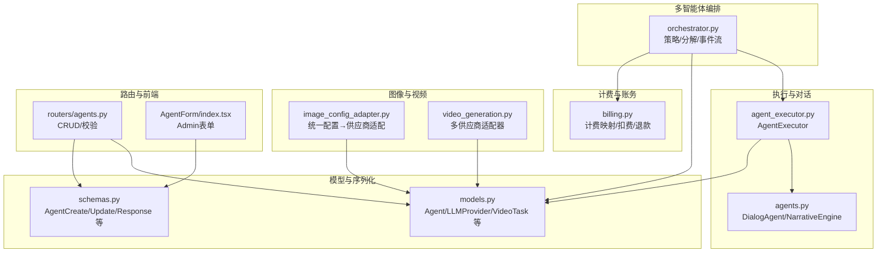
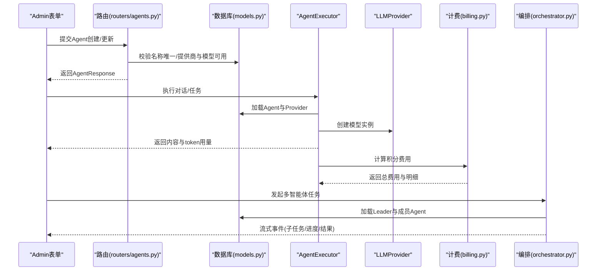
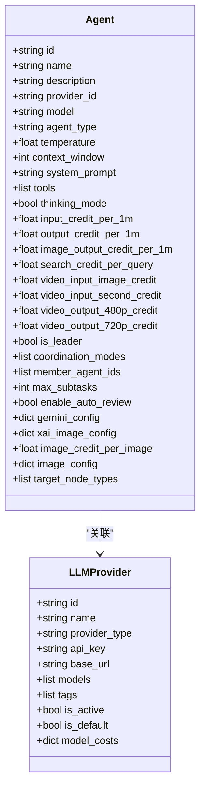
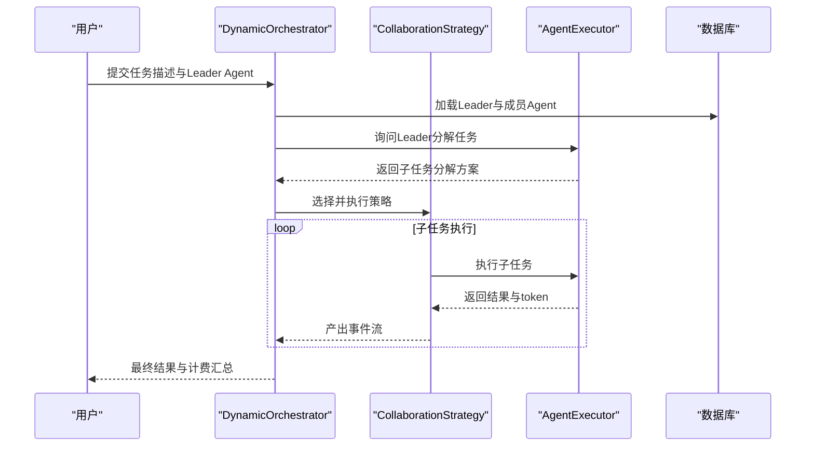
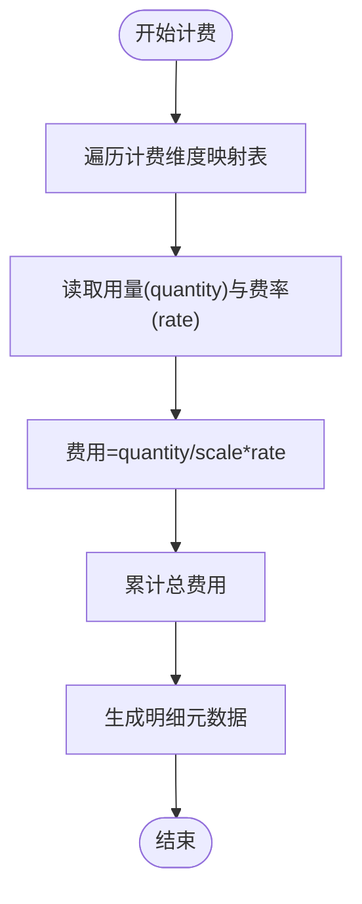
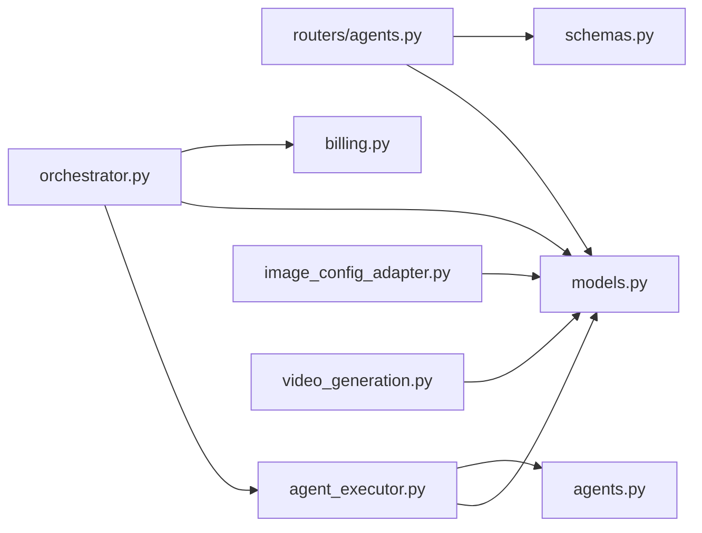

# AI智能体模型

<cite>
**本文引用的文件**
- [models.py](file://backend/models.py)
- [schemas.py](file://backend/schemas.py)
- [agents.py](file://backend/agents.py)
- [agent_executor.py](file://backend/services/agent_executor.py)
- [billing.py](file://backend/services/billing.py)
- [orchestrator.py](file://backend/services/orchestrator.py)
- [image_config_adapter.py](file://backend/services/image_config_adapter.py)
- [video_generation.py](file://backend/services/video_generation.py)
- [routers/agents.py](file://backend/routers/agents.py)
- [admin/src/components/admin/agents/AgentForm/index.tsx](file://backend/admin/src/components/admin/agents/AgentForm/index.tsx)
- [migrations/versions/e1f2a3b4c5d6_add_gemini_config.py](file://backend/migrations/versions/e1f2a3b4c5d6_add_gemini_config.py)
- [migrations/versions/a1b2c3d4e5f6_add_xai_image_config_to_agents.py](file://backend/migrations/versions/a1b2c3d4e5f6_add_xai_image_config_to_agents.py)
</cite>

## 目录
1. [简介](#简介)
2. [项目结构](#项目结构)
3. [核心组件](#核心组件)
4. [架构总览](#架构总览)
5. [详细组件分析](#详细组件分析)
6. [依赖分析](#依赖分析)
7. [性能考虑](#性能考虑)
8. [故障排查指南](#故障排查指南)
9. [结论](#结论)
10. [附录](#附录)

## 简介
本文件面向Infinite Game的AI智能体模型，系统化梳理Agent实体的配置体系、智能体类型与参数、工具与思维模式、多智能体编排、计费与定价、Gemini与xAI的特定配置、统一图像配置系统以及目标节点类型控制。同时提供典型使用场景与ORM操作示例，帮助开发者与运营人员快速理解并正确使用智能体模型。

## 项目结构
后端采用分层设计：模型层（SQLAlchemy）、序列化层（Pydantic）、服务层（业务逻辑）、路由层（FastAPI接口），前端Admin侧提供可视化配置表单。关键文件分布如下：
- 模型与序列化：models.py、schemas.py
- 执行与对话：agents.py、agent_executor.py
- 计费与账务：billing.py
- 多智能体编排：orchestrator.py
- 图像配置适配：image_config_adapter.py
- 视频生成：video_generation.py
- 路由与权限：routers/agents.py
- Admin表单：admin/src/components/admin/agents/AgentForm/index.tsx
- 数据迁移：migrations/versions/*_add_gemini_config.py、*_add_xai_image_config_to_agents.py

图表来源
- [models.py:196-252](file://backend/models.py#L196-L252)
- [schemas.py:239-350](file://backend/schemas.py#L239-L350)
- [agents.py:40-175](file://backend/agents.py#L40-L175)
- [agent_executor.py:63-277](file://backend/services/agent_executor.py#L63-L277)
- [billing.py:12-388](file://backend/services/billing.py#L12-L388)
- [orchestrator.py:560-800](file://backend/services/orchestrator.py#L560-L800)
- [image_config_adapter.py:115-163](file://backend/services/image_config_adapter.py#L115-L163)
- [video_generation.py:54-160](file://backend/services/video_generation.py#L54-L160)
- [routers/agents.py:16-151](file://backend/routers/agents.py#L16-L151)
- [admin/src/components/admin/agents/AgentForm/index.tsx:72-382](file://backend/admin/src/components/admin/agents/AgentForm/index.tsx#L72-L382)

章节来源
- [models.py:196-252](file://backend/models.py#L196-L252)
- [schemas.py:239-350](file://backend/schemas.py#L239-L350)
- [routers/agents.py:16-151](file://backend/routers/agents.py#L16-L151)

## 核心组件
- Agent实体：包含名称唯一性、描述、LLM提供商关联、模型选择、智能体类型、参数（温度、上下文窗口、系统提示词）、工具、思维模式、计费费率、多智能体编排配置、Gemini与xAI图像配置、统一图像配置、目标节点类型控制等。
- LLMProvider实体：提供者名称唯一、类型、API密钥、基础URL、可用模型列表、标签、激活状态、默认状态、模型费率等。
- Agent执行器：封装对话代理与模型创建，支持非流式与流式执行，自动提取token用量。
- 计费系统：基于维度映射表进行多维计费（输入、文本输出、图像输出、搜索、图像生成、视频输入/输出），支持原子扣费与退款。
- 多智能体编排：策略注册表（Pipeline/Plan/Discussion），动态任务分解，事件流输出，支持并行/串行执行与自动复审。
- 图像配置适配：统一配置→Gemini/xF配置的映射表驱动转换，保证供应商无关的配置体验。
- 视频生成：多供应商适配器（xAI/MiniMax/Gemini），统一入口与轮询。

章节来源
- [models.py:196-252](file://backend/models.py#L196-L252)
- [schemas.py:239-350](file://backend/schemas.py#L239-L350)
- [agent_executor.py:63-277](file://backend/services/agent_executor.py#L63-L277)
- [billing.py:12-388](file://backend/services/billing.py#L12-L388)
- [orchestrator.py:62-110](file://backend/services/orchestrator.py#L62-L110)
- [image_config_adapter.py:115-163](file://backend/services/image_config_adapter.py#L115-L163)
- [video_generation.py:54-160](file://backend/services/video_generation.py#L54-L160)

## 架构总览
下图展示智能体从创建、配置到执行、计费与编排的整体流程。

图表来源
- [routers/agents.py:16-151](file://backend/routers/agents.py#L16-L151)
- [models.py:196-252](file://backend/models.py#L196-L252)
- [agent_executor.py:74-208](file://backend/services/agent_executor.py#L74-L208)
- [billing.py:310-388](file://backend/services/billing.py#L310-L388)
- [orchestrator.py:570-673](file://backend/services/orchestrator.py#L570-L673)

## 详细组件分析

### Agent实体与配置系统
- 基础配置
  - 名称唯一性：数据库唯一索引约束，路由层在创建/更新时再次校验。
  - 描述信息：字符串长度限制。
  - LLM提供商关联：外键指向LLMProvider；模型需在提供商模型列表中。
  - 智能体类型：text、image、multimodal、video。
- 参数设置
  - 温度系数：0.0~1.0范围。
  - 上下文窗口：最小4096，最大262144。
  - 系统提示词：文本字段。
- 工具与思维模式
  - 工具：启用后加载技能工具包。
  - 思维模式：影响Gemini思考等级（向后兼容）。
- 计费定价
  - 文本输入/输出：按每1M tokens计费。
  - 图像输出：按每1M tokens计费。
  - 搜索：每次查询计费。
  - 图像生成：按张计费（xAI）。
  - 视频：按输入图片/秒与输出质量（480p/720p）计费。
- 多智能体编排
  - 领导者配置：是否为领导者、协作模式（pipeline/plan/discussion）、成员Agent集合、最大子任务数、自动复审。
- Gemini与xAI配置
  - Gemini：思考等级、媒体分辨率、图片生成开关与配置、Google搜索开关。
  - xAI：图片生成开关与配置（比例、分辨率、批量数、响应格式）。
- 统一图像配置
  - 供应商无关的图片生成配置：比例、质量（standard/hd/ultra）、批量数、输出格式。
  - 优先级：统一配置 > 传统Gemini/xF配置。
- 目标节点类型控制
  - 控制智能体可创建/编辑的画布节点类型集合（script、character、storyboard、video）。

章节来源
- [models.py:196-252](file://backend/models.py#L196-L252)
- [schemas.py:239-350](file://backend/schemas.py#L239-L350)
- [routers/agents.py:16-151](file://backend/routers/agents.py#L16-L151)
- [admin/src/components/admin/agents/AgentForm/index.tsx:72-382](file://backend/admin/src/components/admin/agents/AgentForm/index.tsx#L72-L382)

#### 类关系图（代码级）

图表来源
- [models.py:196-252](file://backend/models.py#L196-L252)
- [models.py:146-170](file://backend/models.py#L146-L170)

### 智能体类型与参数
- 类型分类
  - text：纯文本生成。
  - image：图像生成（结合工具或统一图像配置）。
  - multimodal：多模态（对话中可携带图片等）。
  - video：视频生成（结合视频任务与供应商适配器）。
- 参数要点
  - 温度：控制创造性与稳定性。
  - 上下文窗口：影响上下文长度与成本。
  - 系统提示词：决定Agent行为与风格。
- 工具与思维模式
  - 工具：启用后加载技能工具包，增强Agent能力。
  - 思维模式：影响Gemini思考等级（向后兼容）。

章节来源
- [models.py:196-252](file://backend/models.py#L196-L252)
- [schemas.py:239-350](file://backend/schemas.py#L239-L350)

### 工具配置系统
- 工具启用：通过Agent的tools字段控制。
- 技能加载：运行时同步技能目录，按需注册。
- MCP客户端：支持动态注册MCP客户端，实现外部工具接入。

章节来源
- [agents.py:85-113](file://backend/agents.py#L85-L113)
- [agents.py:70-84](file://backend/agents.py#L70-L84)

### 思维模式与Gemini配置
- 思维模式：当开启时，优先使用Gemini配置中的思考等级；否则根据思维模式推断。
- Gemini配置项：思考等级、媒体分辨率、图片生成开关与配置、Google搜索开关。
- 迁移兼容：历史数据中thinking_mode为True的记录会迁移至Gemini配置的思考等级。

章节来源
- [models.py:254-258](file://backend/models.py#L254-L258)
- [migrations/versions/e1f2a3b4c5d6_add_gemini_config.py:26-35](file://backend/migrations/versions/e1f2a3b4c5d6_add_gemini_config.py#L26-L35)

### xAI图像生成配置
- 配置项：图片生成开关、比例、分辨率、批量数、响应格式。
- 计费：按张计费，费率来自Agent配置。
- 适配：统一配置可转换为xAI配置，优先级高于传统配置。

章节来源
- [schemas.py:199-215](file://backend/schemas.py#L199-L215)
- [migrations/versions/a1b2c3d4e5f6_add_xai_image_config_to_agents.py:22-26](file://backend/migrations/versions/a1b2c3d4e5f6_add_xai_image_config_to_agents.py#L22-L26)
- [image_config_adapter.py:79-103](file://backend/services/image_config_adapter.py#L79-L103)

### 统一图像配置系统
- 统一配置：比例、质量、批量数、输出格式。
- 适配器：将统一配置转换为Gemini/xF供应商特定格式。
- 优先级：统一配置 > 传统Gemini/xF配置。

章节来源
- [schemas.py:220-234](file://backend/schemas.py#L220-L234)
- [image_config_adapter.py:115-163](file://backend/services/image_config_adapter.py#L115-L163)

### 目标节点类型控制
- 控制智能体可创建/编辑的画布节点类型集合。
- 前端表单对节点类型进行校验，仅允许预定义集合。

章节来源
- [schemas.py:275-281](file://backend/schemas.py#L275-L281)
- [models.py:248-249](file://backend/models.py#L248-L249)

### 多智能体编排（领导者配置、协调模式、成员代理管理）
- 领导者配置：是否为领导者、协作模式、成员Agent集合、最大子任务数、自动复审。
- 协调模式：pipeline（流水线）、plan（计划，支持依赖）、discussion（讨论）。
- 成员管理：通过成员Agent ID集合限定可编排的成员。
- 动态分解：领导者根据任务描述与成员信息生成子任务分解方案。
- 事件流：支持子任务创建、执行、完成、失败等事件的Server-Sent Events输出。

图表来源
- [orchestrator.py:560-800](file://backend/services/orchestrator.py#L560-L800)
- [agent_executor.py:74-208](file://backend/services/agent_executor.py#L74-L208)

章节来源
- [orchestrator.py:62-110](file://backend/services/orchestrator.py#L62-L110)
- [orchestrator.py:560-800](file://backend/services/orchestrator.py#L560-L800)

### 计费定价模型
- 文本计费：输入/输出分别按每1M tokens计费。
- 图像输出：按每1M tokens计费。
- 搜索：每次查询计费。
- 图像生成：按张计费（xAI）。
- 视频计费：输入图片/秒与输出质量（480p/720p）计费，费率来自提供商模型费率字典。
- 原子扣费：并发安全，失败时抛出余额不足或冻结异常。
- 退款：原子增加余额并记录交易。

图表来源
- [billing.py:12-31](file://backend/services/billing.py#L12-L31)
- [billing.py:310-351](file://backend/services/billing.py#L310-L351)
- [billing.py:353-388](file://backend/services/billing.py#L353-L388)

章节来源
- [billing.py:12-388](file://backend/services/billing.py#L12-L388)

### 视频生成与供应商适配
- 供应商适配器：xAI、MiniMax、Gemini（Veo）。
- 统一入口：submit_video_task/poll_video_task。
- 结果兼容：通过属性别名保持向后兼容。

章节来源
- [video_generation.py:54-160](file://backend/services/video_generation.py#L54-L160)

## 依赖分析
- 组件耦合
  - AgentExecutor依赖Agent与LLMProvider模型创建与对话执行。
  - Orchestrator依赖AgentExecutor与计费模块，负责任务分解与事件流。
  - ImageConfigAdapter依赖Agent配置，将统一配置转换为供应商特定格式。
  - Router层对Agent与LLMProvider进行CRUD与校验。
- 外部依赖
  - Agentscope：对话代理与模型封装。
  - FastAPI：路由与权限控制。
  - SQLAlchemy：ORM与事务。

图表来源
- [routers/agents.py:16-151](file://backend/routers/agents.py#L16-L151)
- [agent_executor.py:63-277](file://backend/services/agent_executor.py#L63-L277)
- [orchestrator.py:560-800](file://backend/services/orchestrator.py#L560-L800)
- [image_config_adapter.py:115-163](file://backend/services/image_config_adapter.py#L115-L163)
- [video_generation.py:54-160](file://backend/services/video_generation.py#L54-L160)

章节来源
- [routers/agents.py:16-151](file://backend/routers/agents.py#L16-L151)
- [agent_executor.py:63-277](file://backend/services/agent_executor.py#L63-L277)
- [orchestrator.py:560-800](file://backend/services/orchestrator.py#L560-L800)
- [image_config_adapter.py:115-163](file://backend/services/image_config_adapter.py#L115-L163)
- [video_generation.py:54-160](file://backend/services/video_generation.py#L54-L160)

## 性能考虑
- 缓存与复用
  - AgentExecutor缓存模型与对话代理实例，减少重复创建开销。
- 并发与原子性
  - 计费扣费使用UPDATE...WHERE...原子更新，避免竞态。
- 流式输出
  - 编排与对话均支持流式输出，降低首屏延迟。
- 供应商适配
  - 适配器与映射表驱动避免分支判断，提升解析效率。

章节来源
- [agent_executor.py:273-277](file://backend/services/agent_executor.py#L273-L277)
- [billing.py:214-224](file://backend/services/billing.py#L214-L224)

## 故障排查指南
- 余额不足/冻结
  - 现象：扣费失败。
  - 排查：确认用户余额、冻结状态；查看异常类型。
- Provider不可用
  - 现象：找不到Provider或模型不在可用列表。
  - 排查：核对Provider状态、模型列表与Agent模型配置。
- Agent名称冲突
  - 现象：创建/更新时报名称已存在。
  - 排查：修改名称或删除同名Agent。
- 编排失败
  - 现象：子任务执行异常或策略执行中断。
  - 排查：查看事件流中的错误事件，定位具体子任务与Agent。

章节来源
- [billing.py:45-84](file://backend/services/billing.py#L45-L84)
- [routers/agents.py:16-151](file://backend/routers/agents.py#L16-L151)
- [orchestrator.py:660-673](file://backend/services/orchestrator.py#L660-L673)

## 结论
Infinite Game的AI智能体模型通过清晰的实体与序列化定义、完善的执行与计费机制、灵活的多智能体编排策略以及统一的图像配置适配，实现了从基础配置到高级协作的全链路能力。配合Admin表单与路由层的严格校验，能够有效保障系统的稳定性与可维护性。

## 附录

### 典型使用场景与ORM操作示例
- 智能体创建
  - 路由层校验名称唯一、Provider与模型可用，写入Agent表。
  - ORM：查询Agent与LLMProvider，插入Agent记录。
- 配置更新
  - 路由层校验名称变更唯一性与Provider/模型有效性，更新Agent记录。
- 多智能体协作
  - 编排器加载Leader与成员Agent，动态分解任务，按策略执行并产出事件流。
  - ORM：创建TaskExecution与SubTask记录，更新token与费用统计。
- 计费与退款
  - 计费：按维度映射表计算总费用与明细。
  - 扣费：原子更新余额并记录交易。
  - 退款：原子增加余额并记录交易。

章节来源
- [routers/agents.py:16-151](file://backend/routers/agents.py#L16-L151)
- [orchestrator.py:560-800](file://backend/services/orchestrator.py#L560-L800)
- [billing.py:178-308](file://backend/services/billing.py#L178-L308)