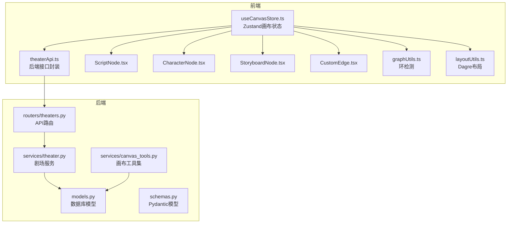
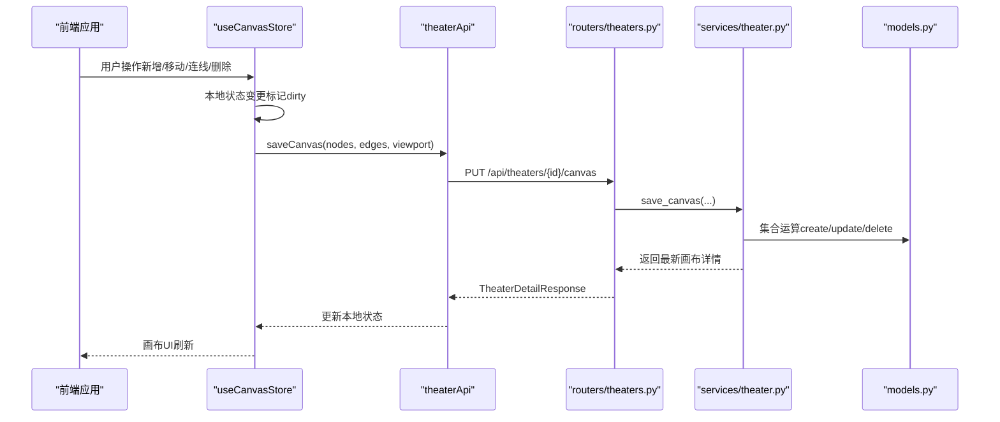
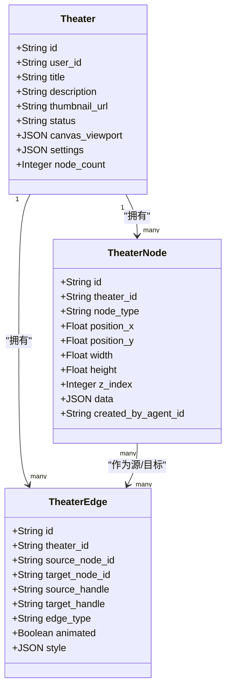
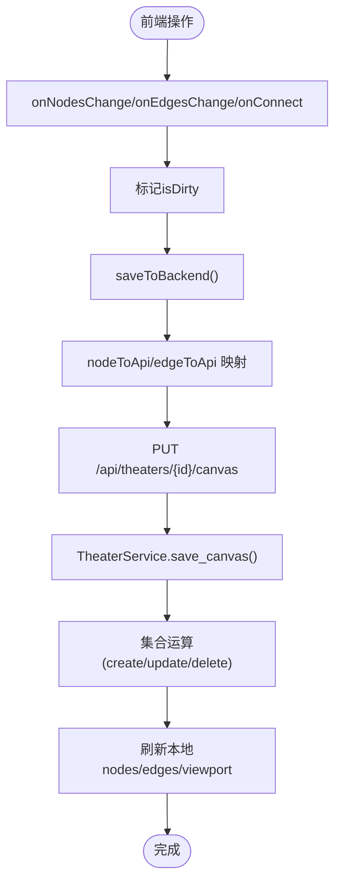
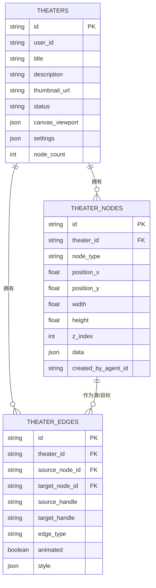

# 剧场和节点模型

<cite>
**本文引用的文件**
- [models.py](file://backend/models.py)
- [m9n0o1p2q3r4_add_theater_system.py](file://backend/migrations/versions/m9n0o1p2q3r4_add_theater_system.py)
- [theater.py](file://backend/services/theater.py)
- [theaters.py](file://backend/routers/theaters.py)
- [schemas.py](file://backend/schemas.py)
- [canvas_tools.py](file://backend/services/canvas_tools.py)
- [useCanvasStore.ts](file://frontend/src/store/useCanvasStore.ts)
- [theaterApi.ts](file://frontend/src/lib/theaterApi.ts)
- [ScriptNode.tsx](file://frontend/src/components/canvas/ScriptNode.tsx)
- [CharacterNode.tsx](file://frontend/src/components/canvas/CharacterNode.tsx)
- [StoryboardNode.tsx](file://frontend/src/components/canvas/StoryboardNode.tsx)
- [CustomEdge.tsx](file://frontend/src/components/canvas/CustomEdge.tsx)
- [graphUtils.ts](file://frontend/src/lib/graphUtils.ts)
- [layoutUtils.ts](file://frontend/src/lib/layoutUtils.ts)
</cite>

## 目录
1. [简介](#简介)
2. [项目结构](#项目结构)
3. [核心组件](#核心组件)
4. [架构总览](#架构总览)
5. [详细组件分析](#详细组件分析)
6. [依赖关系分析](#依赖关系分析)
7. [性能考虑](#性能考虑)
8. [故障排查指南](#故障排查指南)
9. [结论](#结论)
10. [附录](#附录)

## 简介
本文件面向Infinite Game的“剧场”与“画布节点/边”模型，系统化阐述以下内容：
- Theater实体的画布项目管理能力：标题、描述、缩略图、状态、画布视口、设置、节点计数等字段设计与用途。
- TheaterNode实体的画布节点系统：节点类型分类（script、character、storyboard、video）、位置坐标、尺寸属性、z-index层级管理、节点数据存储与业务字段。
- TheaterEdge实体的节点连接关系：源/目标节点外键关联、连接样式配置、动画效果等。
- 级联删除策略对节点与边的影响。
- 画布操作的典型使用场景与ORM示例路径（后端）。
- 画布数据结构的最佳实践与性能优化建议。

## 项目结构
Infinite Game采用前后端分离架构：
- 后端（Python/SQLAlchemy/FastAPI）负责数据持久化与业务逻辑，模型定义于models.py，迁移脚本位于migrations/versions，服务层封装了剧场、节点、边的CRUD与同步逻辑。
- 前端（React + Zustand + React Flow）负责画布交互、节点渲染、连线绘制与与后端的同步。

**图表来源**
- [models.py:75-130](file://backend/models.py#L75-L130)
- [theater.py:13-285](file://backend/services/theater.py#L13-L285)
- [theaters.py:1-110](file://backend/routers/theaters.py#L1-L110)
- [schemas.py:693-800](file://backend/schemas.py#L693-L800)
- [canvas_tools.py:1-590](file://backend/services/canvas_tools.py#L1-L590)
- [useCanvasStore.ts:1-540](file://frontend/src/store/useCanvasStore.ts#L1-L540)
- [theaterApi.ts:1-159](file://frontend/src/lib/theaterApi.ts#L1-L159)
- [ScriptNode.tsx:1-351](file://frontend/src/components/canvas/ScriptNode.tsx#L1-L351)
- [CharacterNode.tsx:1-692](file://frontend/src/components/canvas/CharacterNode.tsx#L1-L692)
- [StoryboardNode.tsx:1-318](file://frontend/src/components/canvas/StoryboardNode.tsx#L1-L318)
- [CustomEdge.tsx:1-92](file://frontend/src/components/canvas/CustomEdge.tsx#L1-L92)
- [graphUtils.ts:1-39](file://frontend/src/lib/graphUtils.ts#L1-L39)
- [layoutUtils.ts:1-127](file://frontend/src/lib/layoutUtils.ts#L1-L127)

**章节来源**
- [models.py:75-130](file://backend/models.py#L75-L130)
- [m9n0o1p2q3r4_add_theater_system.py:21-78](file://backend/migrations/versions/m9n0o1p2q3r4_add_theater_system.py#L21-L78)
- [theater.py:13-285](file://backend/services/theater.py#L13-L285)
- [theaters.py:1-110](file://backend/routers/theaters.py#L1-L110)
- [schemas.py:693-800](file://backend/schemas.py#L693-L800)
- [canvas_tools.py:1-590](file://backend/services/canvas_tools.py#L1-L590)
- [useCanvasStore.ts:1-540](file://frontend/src/store/useCanvasStore.ts#L1-L540)
- [theaterApi.ts:1-159](file://frontend/src/lib/theaterApi.ts#L1-L159)
- [ScriptNode.tsx:1-351](file://frontend/src/components/canvas/ScriptNode.tsx#L1-L351)
- [CharacterNode.tsx:1-692](file://frontend/src/components/canvas/CharacterNode.tsx#L1-L692)
- [StoryboardNode.tsx:1-318](file://frontend/src/components/canvas/StoryboardNode.tsx#L1-L318)
- [CustomEdge.tsx:1-92](file://frontend/src/components/canvas/CustomEdge.tsx#L1-L92)
- [graphUtils.ts:1-39](file://frontend/src/lib/graphUtils.ts#L1-L39)
- [layoutUtils.ts:1-127](file://frontend/src/lib/layoutUtils.ts#L1-L127)

## 核心组件
- Theater（剧场）
  - 字段：用户ID、标题、描述、缩略图URL、状态、画布视口、设置、节点计数、时间戳。
  - 作用：承载一个用户的创意项目，作为画布节点与边的容器。
- TheaterNode（画布节点）
  - 字段：所属剧场、节点类型（script、character、storyboard、video）、位置坐标、尺寸、z-index、节点数据JSON、创建者Agent（可选）。
  - 作用：承载具体业务内容（文本、图片、分镜、视频）及其可视化属性。
- TheaterEdge（画布边）
  - 字段：所属剧场、源/目标节点、连接句柄、边类型、动画标志、样式JSON。
  - 作用：表达节点间的依赖/流程关系，支持样式与动画配置。

**章节来源**
- [models.py:75-130](file://backend/models.py#L75-L130)
- [m9n0o1p2q3r4_add_theater_system.py:21-78](file://backend/migrations/versions/m9n0o1p2q3r4_add_theater_system.py#L21-L78)
- [schemas.py:693-800](file://backend/schemas.py#L693-L800)

## 架构总览
后端通过FastAPI路由暴露REST接口，服务层封装数据库事务与集合运算，模型层定义实体与外键约束；前端通过Zustand维护本地画布状态，与后端进行全量同步（saveCanvas），并在UI层面提供节点/边的增删改查与布局能力。

**图表来源**
- [useCanvasStore.ts:478-510](file://frontend/src/store/useCanvasStore.ts#L478-L510)
- [theaterApi.ts:141-150](file://frontend/src/lib/theaterApi.ts#L141-L150)
- [theaters.py:84-99](file://backend/routers/theaters.py#L84-L99)
- [theater.py:108-229](file://backend/services/theater.py#L108-L229)
- [models.py:75-130](file://backend/models.py#L75-L130)

## 详细组件分析

### Theater（剧场）实体
- 字段设计要点
  - 标题/描述/缩略图：用于项目概览与分享。
  - 状态：draft/published/archived，便于权限与可见性控制。
  - 画布视口：记录当前缩放与平移，便于恢复用户视角。
  - 设置：剧场级别的扩展配置（JSON）。
  - 节点计数：用于快速统计与分页排序。
- 业务价值
  - 作为画布的根容器，所有节点与边均属于某个Theater。
  - 提供元信息与展示入口，支持复制与删除。

**章节来源**
- [models.py:75-91](file://backend/models.py#L75-L91)
- [schemas.py:764-782](file://backend/schemas.py#L764-L782)

### TheaterNode（画布节点）实体
- 节点类型分类
  - script：文本节点，承载剧本/文案内容。
  - character：角色/图片节点，承载头像/设定图等。
  - storyboard：分镜/多维表格节点，承载镜头与数据透视。
  - video：视频节点，承载短片/动画素材。
- 位置与尺寸
  - position_x/position_y：节点左上角坐标。
  - width/height：节点尺寸，支持动态估算（如文本节点）。
  - z_index：层级管理，决定节点叠放顺序。
- 数据存储
  - data：JSON字段，存放各节点类型的业务字段（如文本的title/content/tags、图片的name/description/imageUrl/fitMode、分镜的shotNumber/description/duration/pivotConfig、视频的name/description/videoUrl/fitMode）。
- 外键与归属
  - theater_id：指向Theater.id，ondelete=CASCADE。
  - created_by_agent_id：可选，记录由哪个Agent创建的节点（用于审计与溯源）。

**图表来源**
- [models.py:75-130](file://backend/models.py#L75-L130)

**章节来源**
- [models.py:93-112](file://backend/models.py#L93-L112)
- [schemas.py:695-734](file://backend/schemas.py#L695-L734)

### TheaterEdge（画布边）实体
- 外键关联
  - theater_id：指向Theater.id，ondelete=CASCADE。
  - source_node_id/target_node_id：指向TheaterNode.id，ondelete=CASCADE，确保节点删除时边自动清理。
- 连接样式与动画
  - edge_type：边类型（默认custom）。
  - animated：是否启用动画。
  - style：边样式JSON（颜色、线宽、曲线等）。
- 句柄与方向
  - source_handle/target_handle：连接点标识，支持左右两侧接入。

**章节来源**
- [models.py:114-129](file://backend/models.py#L114-L129)
- [schemas.py:736-762](file://backend/schemas.py#L736-L762)

### 级联删除策略
- 当删除Theater时，由于外键约束设置了ondelete=CASCADE，其下的所有TheaterNode与TheaterEdge将被自动删除。
- 当删除TheaterNode时，由于边的外键也设置了ondelete=CASCADE，与该节点相关的所有边也会被自动删除。
- 这种策略保证了数据一致性，避免悬挂引用。

**章节来源**
- [m9n0o1p2q3r4_add_theater_system.py:52-67](file://backend/migrations/versions/m9n0o1p2q3r4_add_theater_system.py#L52-L67)
- [canvas_tools.py:504-522](file://backend/services/canvas_tools.py#L504-L522)

### 画布操作典型使用场景与ORM示例
以下示例均提供“代码片段路径”，请在对应文件中查看实现细节。

- 创建剧场
  - 路由：POST /api/theaters
  - 服务：TheaterService.create_theater
  - ORM：插入Theater记录
  - 示例路径：
    - [routers/theaters.py:20-29](file://backend/routers/theaters.py#L20-L29)
    - [services/theater.py:17-32](file://backend/services/theater.py#L17-L32)

- 获取剧场详情（含节点与边）
  - 路由：GET /api/theaters/{id}
  - 服务：TheaterService.get_theater_detail
  - ORM：分别查询TheaterNode与TheaterEdge
  - 示例路径：
    - [routers/theaters.py:44-57](file://backend/routers/theaters.py#L44-L57)
    - [services/theater.py:46-60](file://backend/services/theater.py#L46-L60)

- 更新剧场元信息
  - 路由：PUT /api/theaters/{id}
  - 服务：TheaterService.update_theater
  - ORM：按需更新字段
  - 示例路径：
    - [routers/theaters.py:60-69](file://backend/routers/theaters.py#L60-L69)
    - [services/theater.py:91-101](file://backend/services/theater.py#L91-L101)

- 删除剧场（级联删除）
  - 路由：DELETE /api/theaters/{id}
  - 服务：TheaterService.delete_theater
  - ORM：删除Theater，自动级联删除节点与边
  - 示例路径：
    - [routers/theaters.py:72-81](file://backend/routers/theaters.py#L72-L81)
    - [services/theater.py:103-106](file://backend/services/theater.py#L103-L106)

- 保存画布状态（全量同步）
  - 路由：PUT /api/theaters/{id}/canvas
  - 服务：TheaterService.save_canvas
  - ORM：集合运算（create/update/delete）节点与边，并更新Theater.node_count与canvas_viewport
  - 示例路径：
    - [routers/theaters.py:84-99](file://backend/routers/theaters.py#L84-L99)
    - [services/theater.py:108-229](file://backend/services/theater.py#L108-L229)

- 复制剧场（含所有节点与边）
  - 路由：POST /api/theaters/{id}/duplicate
  - 服务：TheaterService.duplicate_theater
  - ORM：复制Theater、遍历节点与边并重映射source/target
  - 示例路径：
    - [routers/theaters.py:101-110](file://backend/routers/theaters.py#L101-L110)
    - [services/theater.py:230-284](file://backend/services/theater.py#L230-L284)

- 通过画布工具集进行节点CRUD（Agent侧）
  - 工具定义：build_canvas_tool_defs
  - 执行器：list_canvas_nodes/get_canvas_node/create_canvas_node/update_canvas_node/delete_canvas_node
  - ORM：查询/插入/更新/删除TheaterNode；删除节点时级联删除边
  - 示例路径：
    - [services/canvas_tools.py:126-260](file://backend/services/canvas_tools.py#L126-L260)
    - [services/canvas_tools.py:315-522](file://backend/services/canvas_tools.py#L315-L522)

**章节来源**
- [theaters.py:1-110](file://backend/routers/theaters.py#L1-L110)
- [theater.py:13-285](file://backend/services/theater.py#L13-L285)
- [canvas_tools.py:1-590](file://backend/services/canvas_tools.py#L1-L590)

### 前端画布与后端同步
- 前端状态管理
  - useCanvasStore：维护nodes/edges/viewport/脏状态/历史快照，提供onNodesChange/onEdgesChange/onConnect/addNode/deleteNode/deleteEdge/updateNodeData/updateNodeDimensions/saveToBackend/loadTheater/syncTheater等方法。
  - 映射函数：nodeToApi/apiToNode、edgeToApi/apiToEdge，确保前后端数据结构一致。
- 后端接口
  - theaterApi：封装REST调用，包括create/list/get/update/delete/saveCanvas/duplicate。
- UI组件
  - ScriptNode/CharacterNode/StoryboardNode：各自节点的渲染与编辑行为。
  - CustomEdge：贝塞尔曲线连线与悬停删除按钮。
- 图算法
  - graphUtils：环检测，阻止循环依赖。
  - layoutUtils：基于Dagre的自动布局，区分连通与孤立节点。

**图表来源**
- [useCanvasStore.ts:209-254](file://frontend/src/store/useCanvasStore.ts#L209-L254)
- [useCanvasStore.ts:478-510](file://frontend/src/store/useCanvasStore.ts#L478-L510)
- [theaterApi.ts:141-150](file://frontend/src/lib/theaterApi.ts#L141-L150)
- [theater.py:108-229](file://backend/services/theater.py#L108-L229)

**章节来源**
- [useCanvasStore.ts:1-540](file://frontend/src/store/useCanvasStore.ts#L1-L540)
- [theaterApi.ts:1-159](file://frontend/src/lib/theaterApi.ts#L1-L159)
- [ScriptNode.tsx:1-351](file://frontend/src/components/canvas/ScriptNode.tsx#L1-L351)
- [CharacterNode.tsx:1-692](file://frontend/src/components/canvas/CharacterNode.tsx#L1-L692)
- [StoryboardNode.tsx:1-318](file://frontend/src/components/canvas/StoryboardNode.tsx#L1-L318)
- [CustomEdge.tsx:1-92](file://frontend/src/components/canvas/CustomEdge.tsx#L1-L92)
- [graphUtils.ts:1-39](file://frontend/src/lib/graphUtils.ts#L1-L39)
- [layoutUtils.ts:1-127](file://frontend/src/lib/layoutUtils.ts#L1-L127)

## 依赖关系分析
- 外键与级联
  - TheaterNode.theater_id → Theater.id (ondelete=CASCADE)
  - TheaterEdge.theater_id → Theater.id (ondelete=CASCADE)
  - TheaterEdge.source_node_id → TheaterNode.id (ondelete=CASCADE)
  - TheaterEdge.target_node_id → TheaterNode.id (ondelete=CASCADE)
- 业务耦合
  - 前端节点类型与后端schema中的NODE_TYPES保持一致，确保Agent工具集与UI渲染协同。
  - 画布工具集对节点类型进行校验与迁移（如legacy script/character到text/image），保证向前兼容。

**图表来源**
- [models.py:75-130](file://backend/models.py#L75-L130)
- [m9n0o1p2q3r4_add_theater_system.py:21-78](file://backend/migrations/versions/m9n0o1p2q3r4_add_theater_system.py#L21-L78)

**章节来源**
- [models.py:75-130](file://backend/models.py#L75-L130)
- [schemas.py:6-8](file://backend/schemas.py#L6-L8)

## 性能考虑
- 后端
  - save_canvas采用集合运算（create/update/delete）批量处理，减少多次往返与锁竞争。
  - 使用JSON字段存储节点数据，避免冗余列与复杂JOIN；但需注意查询过滤与索引策略。
  - 级联删除确保一致性，但大规模删除可能触发触发器/外键检查开销，建议在批量删除前评估影响。
- 前端
  - useCanvasStore对节点/边变更进行轻量标记（isDirty），仅在必要时触发保存。
  - 历史快照上限（MAX_HISTORY）控制内存占用，避免过长历史导致回退卡顿。
  - DAG布局（Dagre）适合中等规模图；超大规模图建议分批布局或采用虚拟化渲染。
  - 环检测（hasCycle）在连接时阻断循环，避免UI死循环与计算爆炸。

[本节为通用指导，无需特定文件引用]

## 故障排查指南
- 无法保存画布
  - 检查saveToBackend是否处于isSaving状态；确认后端路由与服务实现正常。
  - 查看映射函数（nodeToApi/edgeToApi）是否正确转换字段。
  - 参考路径：
    - [useCanvasStore.ts:478-510](file://frontend/src/store/useCanvasStore.ts#L478-L510)
    - [theaterApi.ts:141-150](file://frontend/src/lib/theaterApi.ts#L141-L150)
- 连接报错或循环
  - 确认graphUtils.hasCycle逻辑是否拦截了非法连接。
  - 参考路径：
    - [graphUtils.ts:4-38](file://frontend/src/lib/graphUtils.ts#L4-L38)
- 删除节点后残留边
  - 确认后端迁移脚本与模型定义的ondelete=CASCADE是否生效。
  - 参考路径：
    - [m9n0o1p2q3r4_add_theater_system.py:52-67](file://backend/migrations/versions/m9n0o1p2q3r4_add_theater_system.py#L52-L67)
    - [canvas_tools.py:504-522](file://backend/services/canvas_tools.py#L504-L522)
- 节点类型不匹配
  - Agent工具集会校验target_node_types，若类型不在允许列表将拒绝执行。
  - 参考路径：
    - [canvas_tools.py:126-260](file://backend/services/canvas_tools.py#L126-L260)
    - [schemas.py:275-282](file://backend/schemas.py#L275-L282)

**章节来源**
- [useCanvasStore.ts:478-510](file://frontend/src/store/useCanvasStore.ts#L478-L510)
- [theaterApi.ts:141-150](file://frontend/src/lib/theaterApi.ts#L141-L150)
- [graphUtils.ts:4-38](file://frontend/src/lib/graphUtils.ts#L4-L38)
- [m9n0o1p2q3r4_add_theater_system.py:52-67](file://backend/migrations/versions/m9n0o1p2q3r4_add_theater_system.py#L52-L67)
- [canvas_tools.py:126-260](file://backend/services/canvas_tools.py#L126-L260)
- [schemas.py:275-282](file://backend/schemas.py#L275-L282)

## 结论
Infinite Game的剧场与画布模型通过清晰的实体边界、严格的外键与级联策略、以及前后端一致的数据映射，实现了从项目管理到节点/边编辑的完整闭环。后端服务层采用集合运算与全量同步保障一致性，前端通过Zustand与React Flow提供流畅的交互体验。遵循本文最佳实践与性能建议，可在保证数据安全的同时获得良好的用户体验。

[本节为总结，无需特定文件引用]

## 附录
- 节点类型与数据字段建议
  - script：title、content（Markdown）、tags
  - character：name、description、imageUrl、fitMode
  - storyboard：shotNumber、description、duration、pivotConfig
  - video：name、description、videoUrl、fitMode
- 最佳实践
  - 保持节点数据JSON结构稳定，避免频繁破坏性变更。
  - 对大体量节点/边采用分页加载与增量同步策略。
  - 在Agent工具集中严格校验节点类型与字段，防止越权操作。
  - 使用z_index进行层级控制，避免视觉冲突。

[本节为通用指导，无需特定文件引用]