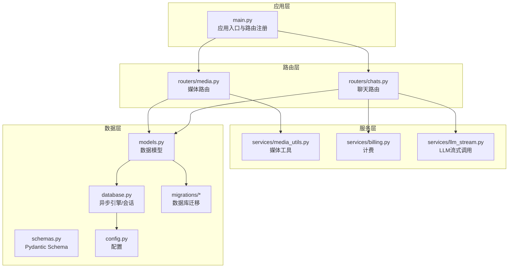
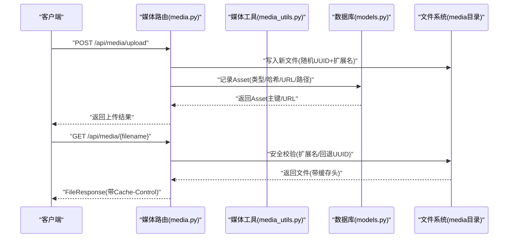
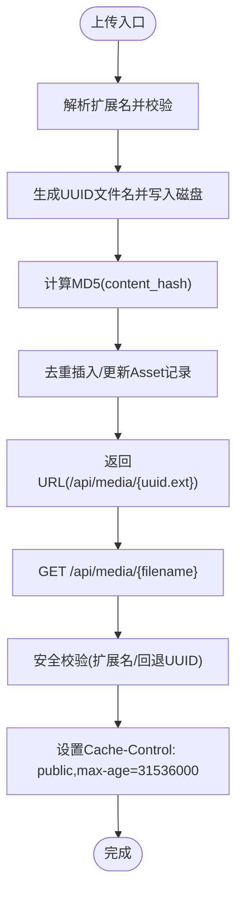
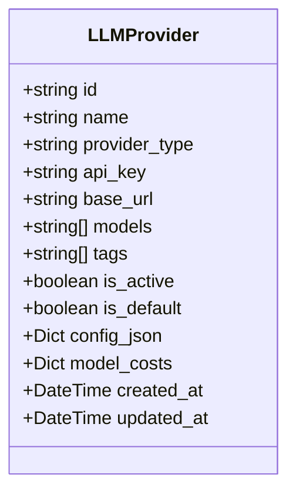
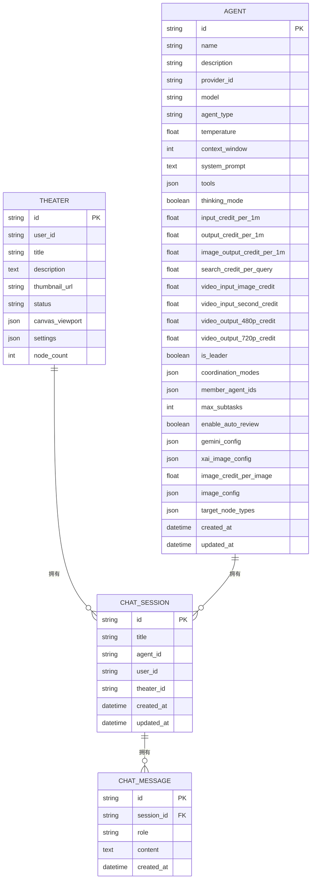
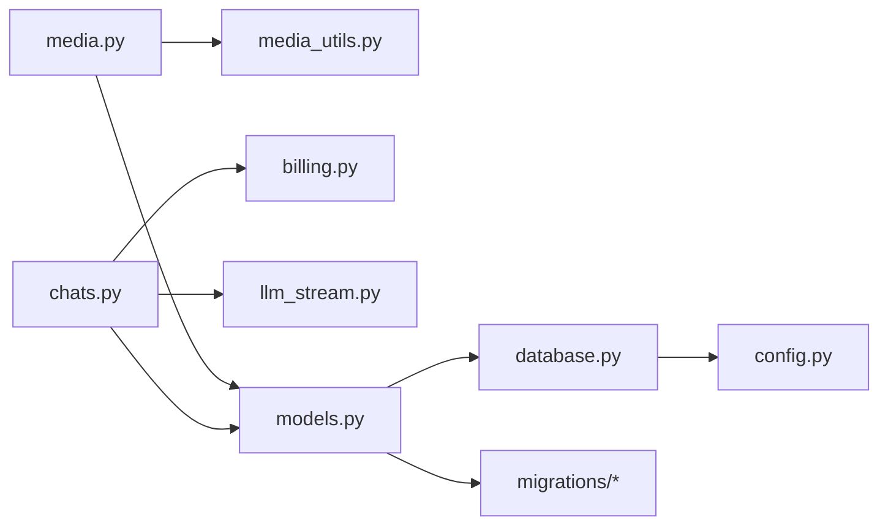

# 媒体资产和聊天模型

<cite>
**本文引用的文件**
- [models.py](file://backend/models.py)
- [schemas.py](file://backend/schemas.py)
- [media.py](file://backend/routers/media.py)
- [chats.py](file://backend/routers/chats.py)
- [media_utils.py](file://backend/services/media_utils.py)
- [billing.py](file://backend/services/billing.py)
- [llm_stream.py](file://backend/services/llm_stream.py)
- [database.py](file://backend/database.py)
- [config.py](file://backend/config.py)
- [main.py](file://backend/main.py)
- [14746eaf1c81_initial.py](file://backend/migrations/versions/14746eaf1c81_initial.py)
</cite>

## 目录
1. [简介](#简介)
2. [项目结构](#项目结构)
3. [核心组件](#核心组件)
4. [架构总览](#架构总览)
5. [详细组件分析](#详细组件分析)
6. [依赖分析](#依赖分析)
7. [性能考量](#性能考量)
8. [故障排查指南](#故障排查指南)
9. [结论](#结论)
10. [附录](#附录)

## 简介
本文件面向Infinite Game后端的媒体资产与聊天模型能力，围绕以下目标展开：
- 媒体资产：文件类型分类、内容去重（MD5哈希）、URL存储、缓存管理与安全访问
- AI服务提供商：提供商类型、API密钥、基础URL、模型列表、标签分类、激活状态、成本配置
- 对话系统：会话与消息实体、角色分类（user、assistant、system）、与智能体和剧场的关联关系、级联删除策略
- 使用场景：媒体上传、AI对话、消息历史查询的ORM操作示例
- 安全与性能：媒体文件管理的安全考虑与性能优化建议

## 项目结构
后端采用FastAPI + SQLAlchemy异步ORM + Alembic迁移的架构，核心模块如下：
- 数据模型与Schema：models.py、schemas.py
- 路由层：routers下的媒体与聊天路由
- 服务层：媒体工具、计费、LLM流式调用等
- 数据库与配置：database.py、config.py、migrations
- 应用入口：main.py

图表来源
- [main.py:110-152](file://backend/main.py#L110-L152)
- [media.py:24](file://backend/routers/media.py#L24)
- [chats.py:93-97](file://backend/routers/chats.py#L93-L97)
- [media_utils.py:8](file://backend/services/media_utils.py#L8)
- [billing.py:12](file://backend/services/billing.py#L12)
- [llm_stream.py:58](file://backend/services/llm_stream.py#L58)
- [models.py:131-194](file://backend/models.py#L131-L194)
- [schemas.py:124-162](file://backend/schemas.py#L124-L162)
- [database.py:6-23](file://backend/database.py#L6-L23)
- [config.py:7-42](file://backend/config.py#L7-L42)
- [14746eaf1c81_initial.py:21-52](file://backend/migrations/versions/14746eaf1c81_initial.py#L21-L52)

章节来源
- [main.py:110-152](file://backend/main.py#L110-L152)
- [database.py:6-23](file://backend/database.py#L6-L23)
- [config.py:7-42](file://backend/config.py#L7-L42)

## 核心组件
- 媒体资产（Asset）：负责媒体文件的去重、URL存储与缓存管理
- AI服务提供商（LLMProvider）：统一管理不同供应商的API密钥、基础URL、模型列表、标签、激活状态与成本配置
- 对话系统（ChatSession、ChatMessage）：会话与消息实体，支持角色分类与与智能体、剧场的关联
- 计费（billing.py）：映射表驱动的多维度计费与原子扣费
- 媒体工具（media_utils.py）：内联图片保存、远程URL下载、媒体目录管理
- LLM流式调用（llm_stream.py）：注册表模式的供应商适配与流式响应聚合

章节来源
- [models.py:131-194](file://backend/models.py#L131-L194)
- [schemas.py:124-162](file://backend/schemas.py#L124-L162)
- [billing.py:12-30](file://backend/services/billing.py#L12-L30)
- [media_utils.py:20-50](file://backend/services/media_utils.py#L20-L50)
- [llm_stream.py:58-74](file://backend/services/llm_stream.py#L58-L74)

## 架构总览
媒体与聊天两大能力通过路由层与服务层解耦，数据模型统一由SQLAlchemy管理，迁移脚本保证数据库演进。

图表来源
- [media.py:83-106](file://backend/routers/media.py#L83-L106)
- [media.py:54-81](file://backend/routers/media.py#L54-L81)
- [media_utils.py:20-28](file://backend/services/media_utils.py#L20-L28)
- [models.py:131-144](file://backend/models.py#L131-L144)

## 详细组件分析

### 媒体资产管理（Asset）
- 文件类型分类：通过扩展名映射决定MIME类型，支持图片、视频等常见类型
- 内容去重机制：以content_hash（MD5）作为唯一标识，避免重复存储
- URL存储与缓存：保存URL与文件路径；提供静态文件服务并设置长期缓存头
- 安全访问：严格校验文件名格式，支持UUID回退查找，防止目录穿越

图表来源
- [media.py:83-106](file://backend/routers/media.py#L83-L106)
- [media.py:54-81](file://backend/routers/media.py#L54-L81)
- [media_utils.py:20-28](file://backend/services/media_utils.py#L20-L28)
- [models.py:131-144](file://backend/models.py#L131-L144)

章节来源
- [media.py:28-51](file://backend/routers/media.py#L28-L51)
- [media.py:54-81](file://backend/routers/media.py#L54-L81)
- [media.py:83-106](file://backend/routers/media.py#L83-L106)
- [media_utils.py:20-50](file://backend/services/media_utils.py#L20-L50)
- [models.py:131-144](file://backend/models.py#L131-L144)

### AI服务提供商管理（LLMProvider）
- 提供商类型与配置：provider_type、base_url、api_key、models、tags、is_active/is_default
- 成本配置：model_costs按模型维度配置，支持多维计费
- Schema约束：Pydantic模型确保字段合法性与默认值

图表来源
- [models.py:146-170](file://backend/models.py#L146-L170)
- [schemas.py:126-162](file://backend/schemas.py#L126-L162)

章节来源
- [models.py:146-170](file://backend/models.py#L146-L170)
- [schemas.py:126-162](file://backend/schemas.py#L126-L162)

### 对话系统（ChatSession 与 ChatMessage）
- 会话管理：ChatSession包含标题、关联智能体与剧场，支持用户或管理员维度
- 消息存储：ChatMessage支持角色分类（user、assistant、system），内容序列化存储
- 关联关系：会话与消息、会话与剧场、消息与会话外键关联
- 级联删除策略：模型中未显式声明级联删除，需谨慎处理删除顺序

图表来源
- [models.py:172-194](file://backend/models.py#L172-L194)
- [models.py:75-91](file://backend/models.py#L75-L91)
- [models.py:196-253](file://backend/models.py#L196-L253)

章节来源
- [models.py:172-194](file://backend/models.py#L172-L194)
- [models.py:75-91](file://backend/models.py#L75-L91)
- [models.py:196-253](file://backend/models.py#L196-L253)

### 级联删除策略与影响
- 当前模型未显式声明级联删除，删除会话时不会自动删除消息
- 路由层提供了清空会话消息的接口，但未提供删除会话本身的级联删除
- 建议：若需要强一致性，可在模型中添加级联删除策略，或在业务层先删除消息再删除会话

章节来源
- [chats.py:765-787](file://backend/routers/chats.py#L765-L787)
- [models.py:172-194](file://backend/models.py#L172-L194)

### 典型使用场景与ORM操作示例
- 媒体上传
  - 路由：POST /api/media/upload
  - 服务：保存文件、计算哈希、写入Asset
  - 参考：[media.py:83-106](file://backend/routers/media.py#L83-L106)，[media_utils.py:20-28](file://backend/services/media_utils.py#L20-L28)
- AI对话
  - 路由：POST /api/chats/{session_id}/messages
  - 服务：构建消息历史、调用LLM流式接口、工具调用循环、计费与保存助手消息
  - 参考：[chats.py:202-258](file://backend/routers/chats.py#L202-L258)，[llm_stream.py:58-74](file://backend/services/llm_stream.py#L58-L74)
- 消息历史查询
  - 路由：GET /api/chats/{session_id}/messages
  - 服务：按时间升序返回消息，反序列化多模态内容
  - 参考：[chats.py:160-199](file://backend/routers/chats.py#L160-L199)

章节来源
- [media.py:83-106](file://backend/routers/media.py#L83-L106)
- [media_utils.py:20-28](file://backend/services/media_utils.py#L20-L28)
- [chats.py:202-258](file://backend/routers/chats.py#L202-L258)
- [llm_stream.py:58-74](file://backend/services/llm_stream.py#L58-L74)
- [chats.py:160-199](file://backend/routers/chats.py#L160-L199)

## 依赖分析
- 路由到服务：媒体路由依赖媒体工具；聊天路由依赖计费与LLM流式调用
- 数据模型：Asset、LLMProvider、ChatSession、ChatMessage、Agent等
- 数据库：异步引擎与会话管理，SQLite/PostgreSQL支持
- 配置：数据库URL、Redis、JWT、默认模型等

图表来源
- [media.py:18-21](file://backend/routers/media.py#L18-L21)
- [chats.py:12-25](file://backend/routers/chats.py#L12-L25)
- [models.py:131-194](file://backend/models.py#L131-L194)
- [database.py:6-23](file://backend/database.py#L6-L23)
- [config.py:7-42](file://backend/config.py#L7-L42)
- [14746eaf1c81_initial.py:21-52](file://backend/migrations/versions/14746eaf1c81_initial.py#L21-L52)

章节来源
- [media.py:18-21](file://backend/routers/media.py#L18-L21)
- [chats.py:12-25](file://backend/routers/chats.py#L12-L25)
- [models.py:131-194](file://backend/models.py#L131-L194)
- [database.py:6-23](file://backend/database.py#L6-L23)
- [config.py:7-42](file://backend/config.py#L7-L42)
- [14746eaf1c81_initial.py:21-52](file://backend/migrations/versions/14746eaf1c81_initial.py#L21-L52)

## 性能考量
- 数据库连接池：异步引擎配置连接池与预检，提升并发稳定性
- 缓存策略：媒体文件提供长期缓存头，降低带宽与服务器压力
- 流式响应：LLM调用采用流式返回，减少等待时间
- 原子计费：计费采用UPDATE ... WHERE条件确保并发安全，避免竞态

章节来源
- [database.py:6-23](file://backend/database.py#L6-L23)
- [media.py:63-78](file://backend/routers/media.py#L63-L78)
- [llm_stream.py:79-146](file://backend/services/llm_stream.py#L79-L146)
- [billing.py:214-288](file://backend/services/billing.py#L214-L288)

## 故障排查指南
- 媒体上传失败
  - 检查文件扩展名是否受支持、磁盘写入权限、媒体目录是否存在
  - 参考：[media.py:86-105](file://backend/routers/media.py#L86-L105)，[main.py:104-106](file://backend/main.py#L104-L106)
- 媒体访问404或400
  - 校验文件名格式（UUID或带扩展名）、扩展名是否在允许列表、回退查找是否命中
  - 参考：[media.py:54-81](file://backend/routers/media.py#L54-L81)
- 会话消息查询为空
  - 确认会话存在且归属当前用户，消息按创建时间升序排列
  - 参考：[chats.py:160-199](file://backend/routers/chats.py#L160-L199)
- 对话生成失败或未计费
  - 检查智能体与供应商可用性、工具调用循环、生成成功后再保存消息与计费
  - 参考：[chats.py:442-763](file://backend/routers/chats.py#L442-L763)，[billing.py:310-350](file://backend/services/billing.py#L310-L350)

章节来源
- [media.py:54-81](file://backend/routers/media.py#L54-L81)
- [media.py:86-105](file://backend/routers/media.py#L86-L105)
- [main.py:104-106](file://backend/main.py#L104-L106)
- [chats.py:160-199](file://backend/routers/chats.py#L160-L199)
- [chats.py:442-763](file://backend/routers/chats.py#L442-L763)
- [billing.py:310-350](file://backend/services/billing.py#L310-L350)

## 结论
本文档梳理了Infinite Game后端在媒体资产与聊天模型方面的设计与实现要点，重点覆盖了媒体去重与安全访问、AI提供商配置与计费、对话系统的实体关系与级联策略，并给出了典型使用场景的ORM操作路径与安全、性能建议。后续可在模型层面补充级联删除策略，并持续完善媒体与计费的监控与审计。

## 附录
- 数据库初始化与迁移
  - 应用启动时尝试连接数据库并运行迁移，支持SQLite与PostgreSQL
  - 参考：[main.py:49-108](file://backend/main.py#L49-L108)，[14746eaf1c81_initial.py:21-52](file://backend/migrations/versions/14746eaf1c81_initial.py#L21-L52)
- 默认配置
  - 数据库URL、Redis、JWT、默认模型等
  - 参考：[config.py:7-42](file://backend/config.py#L7-L42)