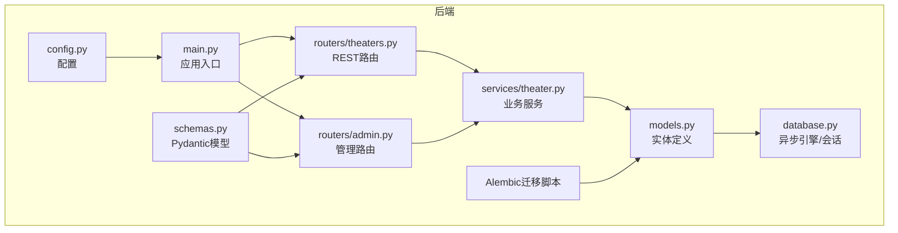
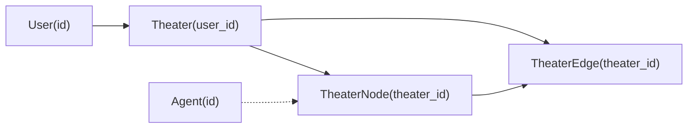

# 核心实体模型

<cite>
**本文引用的文件**
- [models.py](file://backend/models.py)
- [database.py](file://backend/database.py)
- [schemas.py](file://backend/schemas.py)
- [migrations/versions/a3b8c9d0e1f2_convert_ids_to_uuid.py](file://backend/migrations/versions/a3b8c9d0e1f2_convert_ids_to_uuid.py)
- [migrations/versions/m9n0o1p2q3r4_add_theater_system.py](file://backend/migrations/versions/m9n0o1p2q3r4_add_theater_system.py)
- [routers/theaters.py](file://backend/routers/theaters.py)
- [services/theater.py](file://backend/services/theater.py)
- [routers/admin.py](file://backend/routers/admin.py)
- [config.py](file://backend/config.py)
- [main.py](file://backend/main.py)
</cite>

## 目录
1. [简介](#简介)
2. [项目结构](#项目结构)
3. [核心组件](#核心组件)
4. [架构总览](#架构总览)
5. [详细组件分析](#详细组件分析)
6. [依赖分析](#依赖分析)
7. [性能考虑](#性能考虑)
8. [故障排查指南](#故障排查指南)
9. [结论](#结论)
10. [附录](#附录)

## 简介
本文件面向Infinite Game后端核心实体模型，聚焦于User、Admin、Theater、TheaterNode、Agent等关键实体，系统性阐述其字段定义、数据类型、约束条件、业务含义与设计权衡；解释UUID主键设计的原因与优势；梳理实体间外键关系与级联删除策略；给出典型使用场景与ORM操作示例，并提供字段级注释说明与最佳实践建议。文档同时结合数据库迁移脚本与路由/服务层实现，确保理论与实践一致。

## 项目结构
后端采用FastAPI + SQLAlchemy Async + Alembic迁移的架构：
- 模型层：定义实体与字段约束，位于models.py
- 数据库层：异步引擎与会话管理，位于database.py
- 路由层：对外暴露REST接口，位于routers/*
- 服务层：封装业务逻辑，位于services/*
- 配置层：环境变量与运行参数，位于config.py
- 迁移层：版本化数据库演进，位于migrations/versions/*

图表来源
- [main.py:138-152](file://backend/main.py#L138-L152)
- [routers/theaters.py:14-17](file://backend/routers/theaters.py#L14-L17)
- [routers/admin.py:19-23](file://backend/routers/admin.py#L19-L23)
- [services/theater.py:13-16](file://backend/services/theater.py#L13-L16)
- [database.py:25-31](file://backend/database.py#L25-L31)
- [models.py:10-447](file://backend/models.py#L10-L447)
- [schemas.py:1-800](file://backend/schemas.py#L1-L800)
- [config.py:7-43](file://backend/config.py#L7-L43)

章节来源
- [main.py:138-152](file://backend/main.py#L138-L152)
- [config.py:7-43](file://backend/config.py#L7-L43)

## 核心组件
本节对核心实体进行字段级解析与约束说明，涵盖User、Admin、Theater、TheaterNode、Agent及其关键关系。

- User（前端用户）
  - 主键：String(36)，UUID字符串，唯一索引
  - 标识字段：email（唯一索引）、nickname、password_hash
  - 社交登录：google_id（唯一索引）、github_id（唯一索引）
  - 状态与角色：role（已废弃，保留兼容）、is_active、is_balance_frozen
  - 订阅：subscription_plan_id（外键到subscription_plans.id）、subscription_status、subscription_start_at、subscription_end_at
  - 统计与积分：total_input_tokens、total_output_tokens、total_input_chars、total_output_chars、credits（非负）
  - 登录与注册：register_ip、last_login_at、last_login_ip
  - 时间戳：created_at（服务器默认）、updated_at（更新触发）

- Admin（管理员）
  - 主键：String(36)，UUID字符串，唯一索引
  - 标识字段：email（唯一索引）、nickname、password_hash
  - 权限：permission_level（admin | super_admin）
  - 统计与积分：total_input_tokens、total_output_tokens、total_input_chars、total_output_chars、credits（非负）
  - 登录：last_login_at、last_login_ip
  - 时间戳：created_at、updated_at

- Theater（剧场）
  - 主键：String(36)，UUID字符串，唯一索引
  - 外键：user_id（users.id，非空，索引）
  - 元信息：title（默认“未命名剧场”）、description、thumbnail_url
  - 状态：status（draft | published | archived，索引）
  - 画布视图：canvas_viewport（JSON，默认空字典）
  - 设置：settings（JSON，默认空字典）
  - 节点计数：node_count
  - 时间戳：created_at、updated_at

- TheaterNode（剧场节点）
  - 主键：String(36)，UUID字符串，唯一索引
  - 外键：theater_id（theaters.id，ondelete=CASCADE，非空，索引）
  - 类型：node_type（script | character | storyboard | video）
  - 位置与尺寸：position_x、position_y、width、height
  - 层级：z_index
  - 数据：data（JSON，默认空字典）
  - 关联：created_by_agent_id（agents.id，可空）
  - 时间戳：created_at、updated_at

- TheaterEdge（剧场边）
  - 主键：String(36)，UUID字符串，唯一索引
  - 外键：theater_id（theaters.id，ondelete=CASCADE，非空，索引）
  - 端点：source_node_id（theater_nodes.id，ondelete=CASCADE，非空）、target_node_id（同上，非空）
  - 连接属性：source_handle、target_handle、edge_type（默认custom）、animated（默认true）、style（JSON，默认空字典）
  - 时间戳：created_at

- Agent（智能体）
  - 主键：String(36)，UUID字符串，唯一索引
  - 基本信息：name（唯一索引）、description
  - 提供商：provider_id（llm_providers.id）、model
  - 类型：agent_type（text | image | multimodal | video，默认text）
  - 参数：temperature（0~1）、context_window（4096~262144）
  - 系统提示：system_prompt
  - 工具：tools（JSON，默认空数组）
  - 思维模式：thinking_mode（布尔）
  - 计费：input_credit_per_1m、output_credit_per_1m、image_output_credit_per_1m、search_credit_per_query
  - 视频计费：video_input_image_credit、video_input_second_credit、video_output_480p_credit、video_output_720p_credit
  - 协作：is_leader（布尔）、coordination_modes（JSON，默认空数组）、member_agent_ids（JSON，默认空数组）、max_subtasks、enable_auto_review
  - 配置：gemini_config（JSON，默认空字典）、xai_image_config（JSON，默认空字典）、image_credit_per_image
  - 统一图像配置：image_config（JSON，默认空字典）
  - 可控节点类型：target_node_types（JSON，默认空数组）
  - 时间戳：created_at、updated_at

章节来源
- [models.py:35-253](file://backend/models.py#L35-L253)

## 架构总览
下图展示核心实体在数据库中的关系与约束，以及与路由/服务层的交互。

```mermaid
erDiagram
USERS {
string id PK
string email UK
string nickname
string password_hash
string google_id UK
string github_id UK
string role
boolean is_active
boolean is_balance_frozen
string subscription_plan_id FK
string subscription_status
timestamp subscription_start_at
timestamp subscription_end_at
bigint total_input_tokens
bigint total_output_tokens
bigint total_input_chars
bigint total_output_chars
float credits
string register_ip
timestamp last_login_at
timestamp last_login_ip
timestamp created_at
timestamp updated_at
}
ADMINS {
string id PK
string email UK
string nickname
string password_hash
boolean is_active
string permission_level
bigint total_input_tokens
bigint total_output_tokens
bigint total_input_chars
bigint total_output_chars
float credits
timestamp last_login_at
timestamp last_login_ip
timestamp created_at
timestamp updated_at
}
THEATERS {
string id PK
string user_id FK
string title
text description
string thumbnail_url
string status
json canvas_viewport
json settings
int node_count
timestamp created_at
timestamp updated_at
}
THEATER_NODES {
string id PK
string theater_id FK
string node_type
float position_x
float position_y
float width
float height
int z_index
json data
string created_by_agent_id FK
timestamp created_at
timestamp updated_at
}
THEATER_EDGES {
string id PK
string theater_id FK
string source_node_id FK
string target_node_id FK
string source_handle
string target_handle
string edge_type
boolean animated
json style
timestamp created_at
}
AGENTS {
string id PK
string name UK
string description
string provider_id FK
string model
string agent_type
float temperature
int context_window
text system_prompt
json tools
boolean thinking_mode
float input_credit_per_1m
float output_credit_per_1m
float image_output_credit_per_1m
float search_credit_per_query
float video_input_image_credit
float video_input_second_credit
float video_output_480p_credit
float video_output_720p_credit
boolean is_leader
json coordination_modes
json member_agent_ids
int max_subtasks
boolean enable_auto_review
json gemini_config
json xai_image_config
float image_credit_per_image
json image_config
json target_node_types
timestamp created_at
timestamp updated_at
}
USERS ||--o{ THEATERS : "拥有"
THEATERS ||--o{ THEATER_NODES : "包含"
THEATERS ||--o{ THEATER_EDGES : "包含"
THEATER_NODES ||--o{ THEATER_EDGES : "连接"
AGENTS ||--o{ THEATER_NODES : "创建"
```

图表来源
- [models.py:35-253](file://backend/models.py#L35-L253)

## 详细组件分析

### User 实体
- 设计要点
  - 使用UUID作为主键，避免序列号泄露与碰撞风险，便于分布式部署与跨库合并
  - email与第三方社交ID均设唯一索引，保证身份唯一性
  - 订阅字段与统计字段分离，便于独立扩展与审计
  - is_balance_frozen用于资金冻结控制，credits非负约束保障账面安全
- 约束与校验
  - email唯一且非空；nickname长度限制；password_hash非空
  - 订阅状态枚举值受路由/服务层约束
- 典型使用场景
  - 注册/登录：验证邮箱与密码哈希
  - 订阅购买：更新subscription_*字段并联动积分发放
  - 剧场创作：通过user_id关联到Theater
- ORM操作示例（路径）
  - 创建用户：[models.py:35-73](file://backend/models.py#L35-L73)
  - 查询用户：[routers/admin.py:86-114](file://backend/routers/admin.py#L86-L114)
  - 删除用户（级联）：[routers/admin.py:116-136](file://backend/routers/admin.py#L116-L136)
- 最佳实践
  - 密码必须哈希存储，禁止明文
  - 定期清理无效会话与过期订阅
  - 对email与第三方ID建立唯一索引，避免重复

章节来源
- [models.py:35-73](file://backend/models.py#L35-L73)
- [routers/admin.py:86-136](file://backend/routers/admin.py#L86-L136)

### Admin 实体
- 设计要点
  - 与User分离，权限等级区分admin与super_admin
  - 统计字段与User一致，便于统一审计积分规则
- 约束与校验
  - email唯一；permission_level枚举；is_active布尔
- 典型使用场景
  - 管理员登录与权限校验
  - 用户与剧场管理、积分调整、订阅发放
- ORM操作示例（路径）
  - 管理员创建：[routers/admin.py:322-344](file://backend/routers/admin.py#L322-L344)
  - 管理员更新：[routers/admin.py:362-393](file://backend/routers/admin.py#L362-L393)
  - 管理员删除：[routers/admin.py:396-415](file://backend/routers/admin.py#L396-L415)
- 最佳实践
  - 禁止删除自身账户
  - 所有敏感操作记录交易流水

章节来源
- [models.py:10-33](file://backend/models.py#L10-L33)
- [routers/admin.py:322-415](file://backend/routers/admin.py#L322-L415)

### Theater 实体
- 设计要点
  - 与User一对一关系，承载用户创意项目
  - canvas_viewport与settings为扩展字段，支持动态配置
  - node_count用于快速统计节点规模
- 约束与校验
  - status枚举；title默认值；JSON字段默认空字典
- 典型使用场景
  - 创建/更新剧场元信息
  - 列表分页与按状态筛选
  - 删除剧场（级联删除节点与边）
- ORM操作示例（路径）
  - 创建剧场：[services/theater.py:17-31](file://backend/services/theater.py#L17-L31)
  - 获取详情（含节点/边）：[services/theater.py:46-60](file://backend/services/theater.py#L46-L60)
  - 删除剧场（级联）：[services/theater.py:103-106](file://backend/services/theater.py#L103-L106)
  - 路由入口：[routers/theaters.py:20-81](file://backend/routers/theaters.py#L20-L81)
- 最佳实践
  - 严格校验user_id归属
  - 保存画布时使用集合运算进行增删改同步

章节来源
- [models.py:75-91](file://backend/models.py#L75-L91)
- [services/theater.py:17-106](file://backend/services/theater.py#L17-L106)
- [routers/theaters.py:20-81](file://backend/routers/theaters.py#L20-L81)

### TheaterNode 实体
- 设计要点
  - 与Theater一对多，支持多种节点类型（script、character、storyboard、video）
  - data字段承载业务数据，支持灵活扩展
  - created_by_agent_id可选，用于追踪节点创建来源
- 约束与校验
  - theater_id外键，ondelete=CASCADE；node_type枚举
- 典型使用场景
  - 画布节点的创建、更新、删除
  - 与TheaterEdge配合形成图结构
- ORM操作示例（路径）
  - 保存画布（节点同步）：[services/theater.py:108-228](file://backend/services/theater.py#L108-L228)
  - 节点创建/更新Schema：[schemas.py:695-734](file://backend/schemas.py#L695-L734)
- 最佳实践
  - 节点坐标与尺寸应与画布视图保持一致
  - 节点类型需与目标Agent能力匹配

章节来源
- [models.py:93-112](file://backend/models.py#L93-L112)
- [services/theater.py:108-228](file://backend/services/theater.py#L108-L228)
- [schemas.py:695-734](file://backend/schemas.py#L695-L734)

### TheaterEdge 实体
- 设计要点
  - 连接两个TheaterNode，支持自定义样式与动画
  - 边的生命周期随所属Theater同步删除
- 约束与校验
  - source_node_id与target_node_id均非空；ondelete=CASCADE
- 典型使用场景
  - 画布连线的创建、更新、删除
  - 动态渲染边样式与动画效果
- ORM操作示例（路径）
  - 保存画布（边同步）：[services/theater.py:168-218](file://backend/services/theater.py#L168-L218)
  - 边创建/更新Schema：[schemas.py:736-762](file://backend/schemas.py#L736-L762)
- 最佳实践
  - 边的source_handle与target_handle需与节点UI一致
  - 避免循环依赖导致渲染异常

章节来源
- [models.py:114-129](file://backend/models.py#L114-L129)
- [services/theater.py:168-218](file://backend/services/theater.py#L168-L218)
- [schemas.py:736-762](file://backend/schemas.py#L736-L762)

### Agent 实体
- 设计要点
  - 与LLM提供商解耦，支持多供应商与多模型
  - 丰富的计费字段，覆盖文本、图像、视频与搜索
  - 多智能体协作配置（leader、成员、协调模式）
  - 统一图像生成配置（供应商无关），优先级高于具体提供商配置
- 约束与校验
  - name唯一；agent_type枚举；temperature与context_window范围校验
  - 计费字段非负
- 典型使用场景
  - 创建/更新智能体配置
  - 多智能体编排与任务执行
  - 画布节点创建溯源（created_by_agent_id）
- ORM操作示例（路径）
  - 智能体Schema：[schemas.py:239-350](file://backend/schemas.py#L239-L350)
  - 智能体模型：[models.py:196-253](file://backend/models.py#L196-L253)
- 最佳实践
  - 为不同Agent类型配置合适的计费策略
  - 使用统一图像配置提升跨供应商一致性

章节来源
- [models.py:196-253](file://backend/models.py#L196-L253)
- [schemas.py:239-350](file://backend/schemas.py#L239-L350)

## 依赖分析
- 外键关系与级联策略
  - User → Theater：一对多，删除用户时级联删除其剧场（见管理路由）
  - Theater → TheaterNode：一对多，ondelete=CASCADE
  - Theater → TheaterEdge：一对多，ondelete=CASCADE
  - TheaterNode → TheaterEdge：双向一对多，ondelete=CASCADE
  - Agent → TheaterNode：可选关联，记录节点创建来源
- 迁移脚本支撑
  - UUID主键转换：将players、llm_providers、agents等表的主键从整型转为UUID
  - 剧场系统上线：新增theaters、theater_nodes、theater_edges三表，并清理旧故事章节相关字段
- 路由/服务层契约
  - 剧场路由提供创建、查询、更新、删除与画布保存接口
  - 管理路由提供用户与剧场管理、积分调整、订阅发放等接口

图表来源
- [models.py:75-129](file://backend/models.py#L75-L129)
- [routers/theaters.py:20-81](file://backend/routers/theaters.py#L20-L81)
- [routers/admin.py:116-136](file://backend/routers/admin.py#L116-L136)

章节来源
- [models.py:75-129](file://backend/models.py#L75-L129)
- [migrations/versions/a3b8c9d0e1f2_convert_ids_to_uuid.py:22-229](file://backend/migrations/versions/a3b8c9d0e1f2_convert_ids_to_uuid.py#L22-L229)
- [migrations/versions/m9n0o1p2q3r4_add_theater_system.py:21-78](file://backend/migrations/versions/m9n0o1p2q3r4_add_theater_system.py#L21-L78)
- [routers/theaters.py:20-81](file://backend/routers/theaters.py#L20-L81)
- [routers/admin.py:116-136](file://backend/routers/admin.py#L116-L136)

## 性能考虑
- UUID主键
  - 优点：全局唯一、无序列号泄露、适合分布式部署
  - 注意：索引维护成本略高，建议对常用查询字段建立复合索引
- 异步数据库
  - 使用SQLAlchemy Async Engine与AsyncSession，降低I/O阻塞
  - 连接池配置：pool_pre_ping、pool_size、max_overflow，提升稳定性
- 批量操作
  - 画布保存采用集合运算（增删改）批量处理，减少往返次数
- 查询优化
  - 对user_id、theater_id、status等高频过滤字段建立索引
  - 分页查询使用count与offset/limit，避免全表扫描

章节来源
- [database.py:8-23](file://backend/database.py#L8-L23)
- [services/theater.py:108-228](file://backend/services/theater.py#L108-L228)

## 故障排查指南
- 数据库连接失败
  - 检查DATABASE_URL与RUN_MIGRATIONS配置
  - 应用启动时自动重试并尝试清理残留临时表后重试迁移
- 迁移异常
  - 查看Alembic升级日志，确认SQLite残留临时表并清理
- 权限与认证
  - 管理员操作需通过require_admin中间件校验
  - 用户剧场操作需校验归属关系
- 剧场删除
  - 删除剧场将级联删除节点与边，注意备份与审计

章节来源
- [main.py:49-108](file://backend/main.py#L49-L108)
- [routers/theaters.py:72-81](file://backend/routers/theaters.py#L72-L81)
- [routers/admin.py:116-136](file://backend/routers/admin.py#L116-L136)

## 结论
本实体模型以UUID为主键，结合异步数据库与清晰的外键关系，支撑了用户创作、智能体协作与剧场可视化等核心业务。通过迁移脚本与路由/服务层的协同，实现了稳定的演进与可维护性。建议在生产环境中强化索引策略、监控与审计，持续优化画布同步与计费策略。

## 附录
- UUID主键设计说明
  - 选择原因：全局唯一、无序列号泄露、便于分布式部署与跨库合并
  - 迁移证据：UUID转换脚本将旧整型ID映射为UUID并重建表结构
- 级联删除策略
  - 用户删除：级联删除CreditTransaction、ChatSession、Theater
  - 剧场删除：级联删除TheaterNode、TheaterEdge
- 典型ORM操作路径
  - 用户管理：[routers/admin.py:53-136](file://backend/routers/admin.py#L53-L136)
  - 剧场管理：[routers/theaters.py:20-110](file://backend/routers/theaters.py#L20-L110)
  - 画布保存：[services/theater.py:108-228](file://backend/services/theater.py#L108-L228)