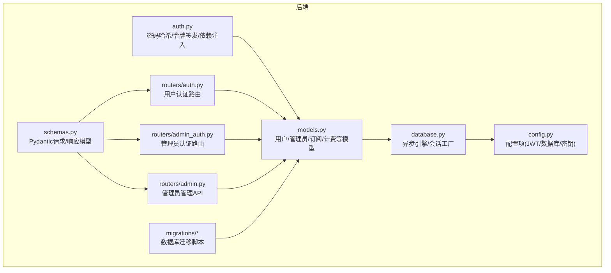
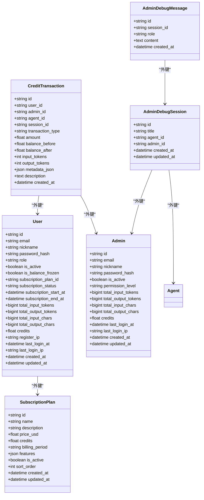
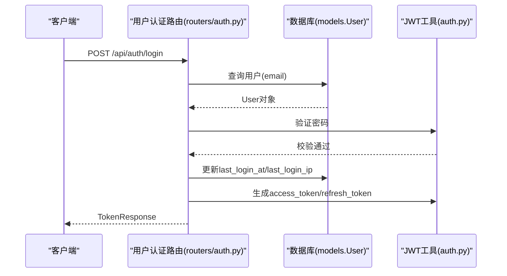
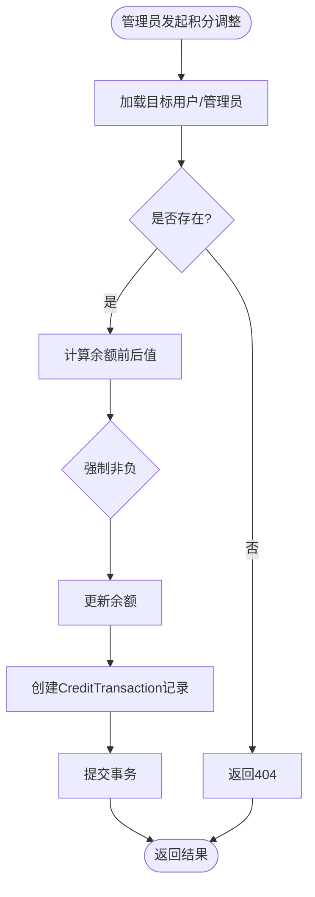
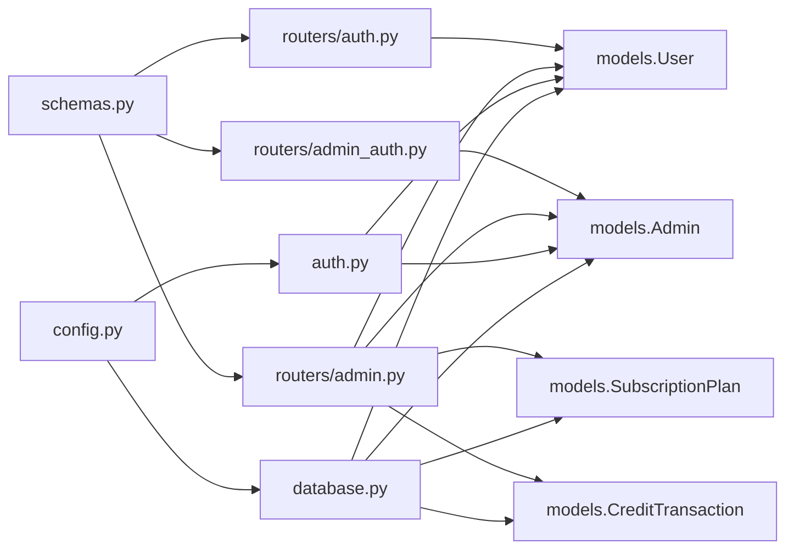

# 用户和管理员模型

<cite>
**本文引用的文件**
- [models.py](file://backend/models.py)
- [auth.py](file://backend/auth.py)
- [schemas.py](file://backend/schemas.py)
- [database.py](file://backend/database.py)
- [config.py](file://backend/config.py)
- [routers/auth.py](file://backend/routers/auth.py)
- [routers/admin_auth.py](file://backend/routers/admin_auth.py)
- [routers/admin.py](file://backend/routers/admin.py)
- [admin/src/app/admin/admins/page.tsx](file://backend/admin/src/app/admin/admins/page.tsx)
- [migrations/versions/i5j6k7l8m9n0_split_user_admin_tables.py](file://backend/migrations/versions/i5j6k7l8m9n0_split_user_admin_tables.py)
- [migrations/versions/4d66cc052bfb_add_admin_debug_sessions.py](file://backend/migrations/versions/4d66cc052bfb_add_admin_debug_sessions.py)
- [migrations/versions/5f5b1c3da653_add_user_balance_frozen_status.py](file://backend/migrations/versions/5f5b1c3da653_add_user_balance_frozen_status.py)
- [migrations/versions/a3b8c9d0e1f2_convert_ids_to_uuid.py](file://backend/migrations/versions/a3b8c9d0e1f2_convert_ids_to_uuid.py)
</cite>

## 目录
1. [简介](#简介)
2. [项目结构](#项目结构)
3. [核心组件](#核心组件)
4. [架构总览](#架构总览)
5. [详细组件分析](#详细组件分析)
6. [依赖关系分析](#依赖关系分析)
7. [性能考量](#性能考量)
8. [故障排查指南](#故障排查指南)
9. [结论](#结论)
10. [附录](#附录)

## 简介
本文件面向Infinite Game的用户与管理员模型，系统化阐述User与Admin实体的设计原理与实现细节，涵盖：
- UUID主键设计与迁移策略
- 邮箱唯一性约束与OAuth预留字段
- 密码哈希存储与JWT令牌体系
- 用户角色系统、订阅状态管理、积分余额控制与操作统计字段
- 管理员权限分级、调试会话功能与与用户系统的分离设计
- 典型ORM操作示例与安全最佳实践

## 项目结构
后端采用FastAPI + SQLAlchemy Async + Alembic进行数据库版本管理，用户与管理员模型分别位于models.py中，并通过独立的认证路由与管理API提供服务。

图表来源
- [models.py:1-447](file://backend/models.py#L1-L447)
- [auth.py:1-229](file://backend/auth.py#L1-L229)
- [schemas.py:1-859](file://backend/schemas.py#L1-L859)
- [database.py:1-31](file://backend/database.py#L1-L31)
- [config.py:1-43](file://backend/config.py#L1-L43)
- [routers/auth.py:1-136](file://backend/routers/auth.py#L1-L136)
- [routers/admin_auth.py:1-136](file://backend/routers/admin_auth.py#L1-L136)
- [routers/admin.py:1-501](file://backend/routers/admin.py#L1-L501)

章节来源
- [models.py:1-447](file://backend/models.py#L1-L447)
- [database.py:1-31](file://backend/database.py#L1-L31)
- [config.py:1-43](file://backend/config.py#L1-L43)

## 核心组件
- User模型：前端用户实体，包含邮箱唯一、昵称、密码哈希、社交登录预留字段、角色废弃字段、激活状态、资金冻结、订阅计划与时间范围、操作统计、积分余额、注册与登录IP及时间戳等。
- Admin模型：管理员实体，与User表分离，包含邮箱唯一、昵称、密码哈希、激活状态、权限等级（admin/super_admin）、操作统计、积分余额、登录时间与IP等。
- 认证与授权：bcrypt密码哈希、JWT访问/刷新令牌、用户与管理员双路径依赖注入、通用主体选择器与行级隔离辅助函数。
- 订阅与计费：SubscriptionPlan套餐模型与CreditTransaction积分交易流水模型，支撑用户订阅状态与积分变动审计。
- 管理员调试会话：AdminDebugSession与AdminDebugMessage，与普通用户会话完全隔离，便于排障。

章节来源
- [models.py:10-33](file://backend/models.py#L10-L33)
- [models.py:35-73](file://backend/models.py#L35-L73)
- [models.py:369-389](file://backend/models.py#L369-L389)
- [models.py:261-281](file://backend/models.py#L261-L281)
- [models.py:424-447](file://backend/models.py#L424-L447)
- [auth.py:19-25](file://backend/auth.py#L19-L25)
- [auth.py:30-63](file://backend/auth.py#L30-L63)
- [auth.py:119-157](file://backend/auth.py#L119-L157)
- [auth.py:162-211](file://backend/auth.py#L162-L211)

## 架构总览
用户与管理员模型在数据库层面完全分离，认证与管理API各自独立，确保职责清晰与安全边界明确。

图表来源
- [models.py:35-73](file://backend/models.py#L35-L73)
- [models.py:10-33](file://backend/models.py#L10-L33)
- [models.py:369-389](file://backend/models.py#L369-L389)
- [models.py:261-281](file://backend/models.py#L261-L281)
- [models.py:424-447](file://backend/models.py#L424-L447)

## 详细组件分析

### User实体设计与字段注释
- 主键与索引：id为String(36)主键，使用UUID字符串形式并建立索引，提升查询效率。
- 唯一约束：email唯一，防止重复注册。
- 社交登录预留：google_id、github_id唯一，便于后续OAuth集成。
- 角色字段：role为“user”，已废弃，保留向后兼容。
- 激活与冻结：is_active控制账户启用；is_balance_frozen用于资金冻结。
- 订阅系统：subscription_plan_id外键关联SubscriptionPlan；subscription_status枚举值(inactive/active/expired)；subscription_start_at/subscription_end_at记录周期。
- 操作统计：total_input_tokens、total_output_tokens、total_input_chars、total_output_chars累计用量。
- 积分余额：credits为浮点余额，初始0.0，支持充值与消费。
- 登录与注册：register_ip、last_login_at、last_login_ip记录来源与时间。
- 时间戳：created_at、updated_at自动维护。

章节来源
- [models.py:35-73](file://backend/models.py#L35-L73)

### Admin实体设计与权限体系
- 主键与索引：id为String(36)主键，email唯一，权限等级permission_level枚举(admin/super_admin)。
- 激活状态：is_active控制管理员启用。
- 操作统计：与User一致的输入/输出token与字符统计，便于调试积分规则。
- 积分余额：credits用于管理员自身额度管理。
- 登录信息：last_login_at、last_login_ip记录登录行为。
- 时间戳：created_at、updated_at自动维护。

章节来源
- [models.py:10-33](file://backend/models.py#L10-L33)

### 安全机制与认证流程
- 密码哈希：bcrypt，轮数12，保证抗暴力破解能力。
- JWT令牌：
  - 访问令牌：包含sub、role、subject_type、type(access)、exp等声明。
  - 刷新令牌：包含sub、subject_type、type(refresh)、exp等声明。
- 用户与管理员双路径：
  - 用户：subject_type为"user"，payload中role为"user"。
  - 管理员：subject_type为"admin"，payload中role为"admin"。
- 依赖注入：
  - get_current_user/get_current_active_user：校验访问令牌并确保用户激活。
  - get_current_admin/get_current_active_admin：校验管理员令牌并确保管理员激活。
  - require_admin：管理员权限验证装饰器。
  - get_current_user_or_admin：通用主体解析，支持管理员访问用户端点。

图表来源
- [routers/auth.py:63-99](file://backend/routers/auth.py#L63-L99)
- [auth.py:19-25](file://backend/auth.py#L19-L25)
- [auth.py:30-63](file://backend/auth.py#L30-L63)
- [models.py:35-73](file://backend/models.py#L35-L73)

章节来源
- [auth.py:19-25](file://backend/auth.py#L19-L25)
- [auth.py:30-63](file://backend/auth.py#L30-L63)
- [auth.py:83-114](file://backend/auth.py#L83-L114)
- [auth.py:119-157](file://backend/auth.py#L119-L157)
- [auth.py:162-211](file://backend/auth.py#L162-L211)
- [routers/auth.py:63-99](file://backend/routers/auth.py#L63-L99)

### 订阅与积分系统
- SubscriptionPlan：套餐模型，包含名称、描述、价格、积分数、计费周期、特性列表、排序等。
- CreditTransaction：积分交易流水，支持deduction/recharge/admin_adjust三类，记录余额前后值、token用量、元数据与描述。
- 管理员操作：
  - 手动调整用户积分：adjust_user_credits，防负数余额，记录交易。
  - 手动调整管理员积分：adjust_admin_credits。
  - 分配/取消订阅：assign_user_subscription/cancel_user_subscription，支持自动发放积分并记录交易。

图表来源
- [routers/admin.py:141-187](file://backend/routers/admin.py#L141-L187)
- [routers/admin.py:421-464](file://backend/routers/admin.py#L421-L464)
- [models.py:261-281](file://backend/models.py#L261-L281)

章节来源
- [models.py:369-389](file://backend/models.py#L369-L389)
- [models.py:261-281](file://backend/models.py#L261-L281)
- [routers/admin.py:141-187](file://backend/routers/admin.py#L141-L187)
- [routers/admin.py:421-464](file://backend/routers/admin.py#L421-L464)

### 管理员权限分级与UI交互
- 权限等级：admin/super_admin，前端页面通过PERMISSION_LEVELS映射显示与选择。
- 管理员管理：创建、更新、删除、列表、详情、积分调整等API。
- 前端页面：admin/src/app/admin/admins/page.tsx提供创建、编辑、删除、积分调整对话框与表格展示。

章节来源
- [models.py:10-33](file://backend/models.py#L10-L33)
- [routers/admin.py:307-416](file://backend/routers/admin.py#L307-L416)
- [admin/src/app/admin/admins/page.tsx:62-66](file://backend/admin/src/app/admin/admins/page.tsx#L62-L66)
- [admin/src/app/admin/admins/page.tsx:307-310](file://backend/admin/src/app/admin/admins/page.tsx#L307-L310)

### 管理员调试会话与与用户系统的分离
- AdminDebugSession/AdminDebugMessage：与普通用户会话完全隔离，便于管理员排障。
- 与User/Admin表分离设计：用户与管理员登录、权限、积分、订阅等均独立管理，降低耦合风险。

章节来源
- [models.py:424-447](file://backend/models.py#L424-L447)
- [migrations/versions/4d66cc052bfb_add_admin_debug_sessions.py:21-52](file://backend/migrations/versions/4d66cc052bfb_add_admin_debug_sessions.py#L21-L52)

### UUID主键设计与迁移策略
- 主键统一：用户、管理员、会话、消息、资产、智能体、剧场、边等实体均采用String(36)UUID主键，提升安全性与可移植性。
- 迁移脚本：a3b8c9d0e1f2将历史整数ID转换为UUID，i5j6k7l8m9n0拆分用户与管理员表并引入订阅字段，5f5b1c3da653增加资金冻结字段。

章节来源
- [models.py:10-33](file://backend/models.py#L10-L33)
- [models.py:35-73](file://backend/models.py#L35-L73)
- [migrations/versions/a3b8c9d0e1f2_convert_ids_to_uuid.py:22-335](file://backend/migrations/versions/a3b8c9d0e1f2_convert_ids_to_uuid.py#L22-L335)
- [migrations/versions/i5j6k7l8m9n0_split_user_admin_tables.py:21-97](file://backend/migrations/versions/i5j6k7l8m9n0_split_user_admin_tables.py#L21-L97)
- [migrations/versions/5f5b1c3da653_add_user_balance_frozen_status.py:21-44](file://backend/migrations/versions/5f5b1c3da653_add_user_balance_frozen_status.py#L21-L44)

## 依赖关系分析
- 模块内聚：models.py集中定义User/Admin/Subscription/Credit等核心实体；auth.py封装密码与JWT；routers/auth.py与routers/admin_auth.py分别提供用户与管理员认证端点；routers/admin.py提供管理端API。
- 外部依赖：bcrypt用于密码哈希；jose用于JWT编解码；SQLAlchemy Async用于ORM；Alembic用于迁移。
- 依赖链路：路由层依赖认证模块与数据库会话；认证模块依赖配置与模型；模型依赖数据库基类与配置。

图表来源
- [routers/auth.py:1-136](file://backend/routers/auth.py#L1-L136)
- [routers/admin_auth.py:1-136](file://backend/routers/admin_auth.py#L1-L136)
- [routers/admin.py:1-501](file://backend/routers/admin.py#L1-L501)
- [auth.py:1-229](file://backend/auth.py#L1-L229)
- [schemas.py:1-859](file://backend/schemas.py#L1-L859)
- [database.py:1-31](file://backend/database.py#L1-L31)
- [config.py:1-43](file://backend/config.py#L1-L43)
- [models.py:10-33](file://backend/models.py#L10-L33)
- [models.py:35-73](file://backend/models.py#L35-L73)
- [models.py:369-389](file://backend/models.py#L369-L389)
- [models.py:261-281](file://backend/models.py#L261-L281)

章节来源
- [routers/auth.py:1-136](file://backend/routers/auth.py#L1-L136)
- [routers/admin_auth.py:1-136](file://backend/routers/admin_auth.py#L1-L136)
- [routers/admin.py:1-501](file://backend/routers/admin.py#L1-L501)
- [auth.py:1-229](file://backend/auth.py#L1-L229)
- [schemas.py:1-859](file://backend/schemas.py#L1-L859)
- [database.py:1-31](file://backend/database.py#L1-L31)
- [config.py:1-43](file://backend/config.py#L1-L43)
- [models.py:10-33](file://backend/models.py#L10-L33)
- [models.py:35-73](file://backend/models.py#L35-L73)
- [models.py:369-389](file://backend/models.py#L369-L389)
- [models.py:261-281](file://backend/models.py#L261-L281)

## 性能考量
- 异步ORM：使用SQLAlchemy Async Engine与AsyncSession，提升并发性能。
- 连接池：pool_pre_ping、pool_size、max_overflow参数优化连接复用与健康检查。
- 索引：UUID主键与常用查询字段（email、id、created_at等）建立索引，加速查询。
- 令牌过期：ACCESS_TOKEN_EXPIRE_MINUTES与REFRESH_TOKEN_EXPIRE_DAYS合理配置，平衡安全与体验。
- 事务边界：管理员积分调整与订阅变更采用单事务提交，保证一致性。

章节来源
- [database.py:8-23](file://backend/database.py#L8-L23)
- [config.py:26-31](file://backend/config.py#L26-L31)
- [models.py:10-33](file://backend/models.py#L10-L33)
- [models.py:35-73](file://backend/models.py#L35-L73)

## 故障排查指南
- 登录失败
  - 用户：邮箱不存在或密码错误、账户被禁用。
  - 管理员：邮箱不存在或密码错误、账户被禁用。
- 令牌无效
  - 访问令牌过期或类型不符；刷新令牌类型不符或管理员不存在/禁用。
- 权限不足
  - 管理员接口需携带管理员令牌，subject_type必须为"admin"。
- 积分异常
  - 管理员调整后余额应非负；检查CreditTransaction记录与描述字段。
- 订阅问题
  - 确认SubscriptionPlan存在且有效；分配时start_at/end_at正确。

章节来源
- [routers/auth.py:70-99](file://backend/routers/auth.py#L70-L99)
- [routers/admin_auth.py:47-90](file://backend/routers/admin_auth.py#L47-L90)
- [auth.py:65-75](file://backend/auth.py#L65-L75)
- [auth.py:109-157](file://backend/auth.py#L109-L157)
- [routers/admin.py:141-187](file://backend/routers/admin.py#L141-L187)
- [routers/admin.py:220-280](file://backend/routers/admin.py#L220-L280)

## 结论
Infinite Game的用户与管理员模型通过UUID主键、邮箱唯一约束、bcrypt密码哈希与JWT令牌体系，构建了安全可靠的认证基础。用户与管理员在数据库与API层面完全分离，辅以订阅与积分系统、调试会话与操作统计，形成完整的业务闭环。配合异步ORM与合理的迁移策略，系统具备良好的可维护性与扩展性。

## 附录

### 典型ORM操作示例（步骤说明）
- 用户注册
  - 路由：POST /api/auth/register
  - 流程：校验邮箱唯一 -> 哈希密码 -> 写入User -> 返回UserResponse
  - 参考：[routers/auth.py:36-61](file://backend/routers/auth.py#L36-L61)，[auth.py:19-25](file://backend/auth.py#L19-L25)，[models.py:35-73](file://backend/models.py#L35-L73)
- 用户登录
  - 路由：POST /api/auth/login
  - 流程：查询用户 -> 验证密码 -> 更新登录信息 -> 生成JWT -> 返回TokenResponse
  - 参考：[routers/auth.py:63-99](file://backend/routers/auth.py#L63-L99)，[auth.py:23-25](file://backend/auth.py#L23-L25)，[auth.py:30-63](file://backend/auth.py#L30-L63)
- 管理员登录
  - 路由：POST /api/admin/auth/login
  - 流程：查询Admin -> 验证密码 -> 更新登录信息 -> 生成JWT(subject_type=admin) -> 返回AdminTokenResponse
  - 参考：[routers/admin_auth.py:36-90](file://backend/routers/admin_auth.py#L36-L90)，[auth.py:119-157](file://backend/auth.py#L119-L157)
- 权限检查
  - 路由装饰器：require_admin，确保当前主体为管理员且激活
  - 参考：[auth.py:154-157](file://backend/auth.py#L154-L157)
- 积分充值（管理员）
  - 路由：POST /api/admin/users/{user_id}/credits/adjust
  - 流程：校验用户存在 -> 计算余额 -> 更新User.credits -> 写入CreditTransaction -> 提交事务
  - 参考：[routers/admin.py:141-187](file://backend/routers/admin.py#L141-L187)，[models.py:261-281](file://backend/models.py#L261-L281)
- 订阅分配（管理员）
  - 路由：PUT /api/admin/users/{user_id}/subscription
  - 流程：校验用户与套餐 -> 设置订阅状态与周期 -> 可选自动发放积分 -> 记录交易
  - 参考：[routers/admin.py:220-280](file://backend/routers/admin.py#L220-L280)，[models.py:369-389](file://backend/models.py#L369-L389)，[models.py:261-281](file://backend/models.py#L261-L281)

### 字段级别注释清单
- User
  - id/email/nickname/password_hash：主键/唯一/昵称/密码哈希
  - google_id/github_id：社交登录预留
  - role：废弃字段，保留兼容
  - is_active/is_balance_frozen：账户与资金状态
  - subscription_plan_id/subscription_status/subscription_start_at/subscription_end_at：订阅生命周期
  - total_input_tokens/total_output_tokens/total_input_chars/total_output_chars：用量统计
  - credits：积分余额
  - register_ip/last_login_at/last_login_ip：注册与登录信息
  - created_at/updated_at：时间戳
- Admin
  - id/email/nickname/password_hash：主键/唯一/昵称/密码哈希
  - is_active/permission_level：账户与权限
  - total_input_tokens/total_output_tokens/total_input_chars/total_output_chars：用量统计
  - credits：积分余额
  - last_login_at/last_login_ip：登录信息
  - created_at/updated_at：时间戳
- SubscriptionPlan
  - id/name/description/price_usd/credits/billing_period/features/is_active/sort_order：套餐配置
  - created_at/updated_at：时间戳
- CreditTransaction
  - id/user_id/admin_id/agent_id/session_id：关联实体
  - transaction_type/amount/balance_before/balance_after：交易类型与余额
  - input_tokens/output_tokens/metadata_json/description：用量与元数据
  - created_at：时间戳
- AdminDebugSession/AdminDebugMessage
  - 与管理员调试会话与消息相关字段，与普通用户会话隔离

章节来源
- [models.py:10-33](file://backend/models.py#L10-L33)
- [models.py:35-73](file://backend/models.py#L35-L73)
- [models.py:369-389](file://backend/models.py#L369-L389)
- [models.py:261-281](file://backend/models.py#L261-L281)
- [models.py:424-447](file://backend/models.py#L424-L447)

### 安全最佳实践建议
- 密钥管理：JWT_SECRET_KEY务必在生产环境使用强随机密钥，定期轮换。
- 传输安全：HTTPS/TLS，避免明文传输敏感信息。
- 令牌策略：短有效期访问令牌+长有效期刷新令牌，最小权限原则。
- 输入校验：Pydantic模型严格校验，避免SQL注入与越权访问。
- 审计日志：登录尝试与关键操作（积分调整、订阅变更）记录日志。
- 数据库安全：连接池参数与只读权限配置，避免过度权限。
- 迁移安全：迁移脚本幂等与回滚策略，生产前充分测试。

章节来源
- [config.py:26-31](file://backend/config.py#L26-L31)
- [auth.py:19-25](file://backend/auth.py#L19-L25)
- [routers/auth.py:43-49](file://backend/routers/auth.py#L43-L49)
- [routers/admin_auth.py:47-79](file://backend/routers/admin_auth.py#L47-L79)
- [routers/admin.py:141-187](file://backend/routers/admin.py#L141-L187)