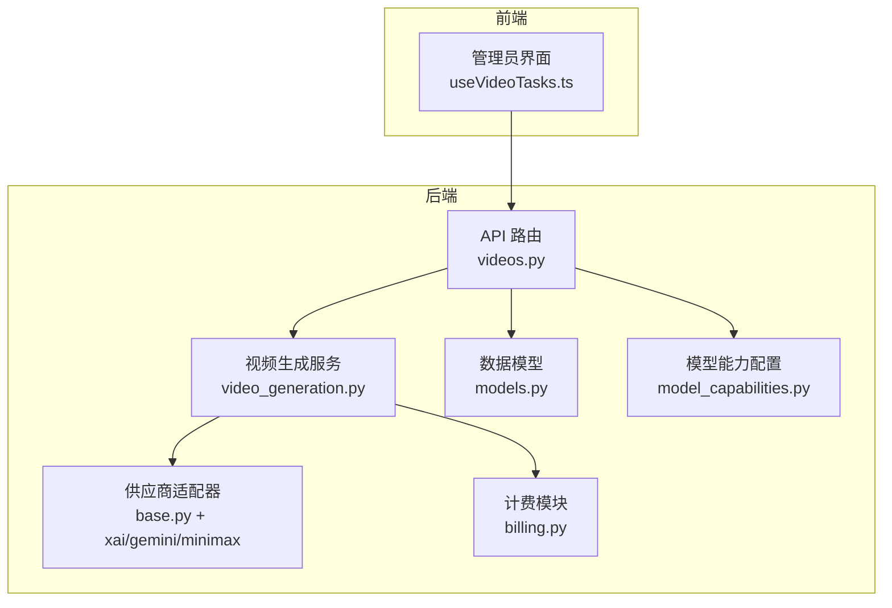
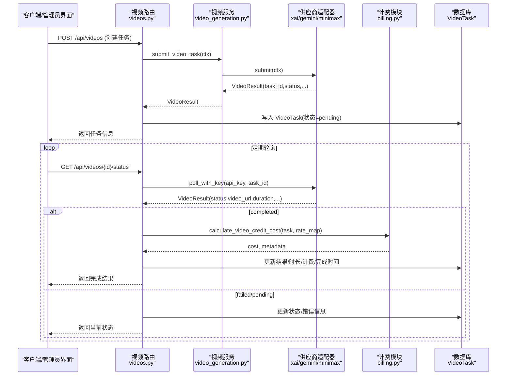
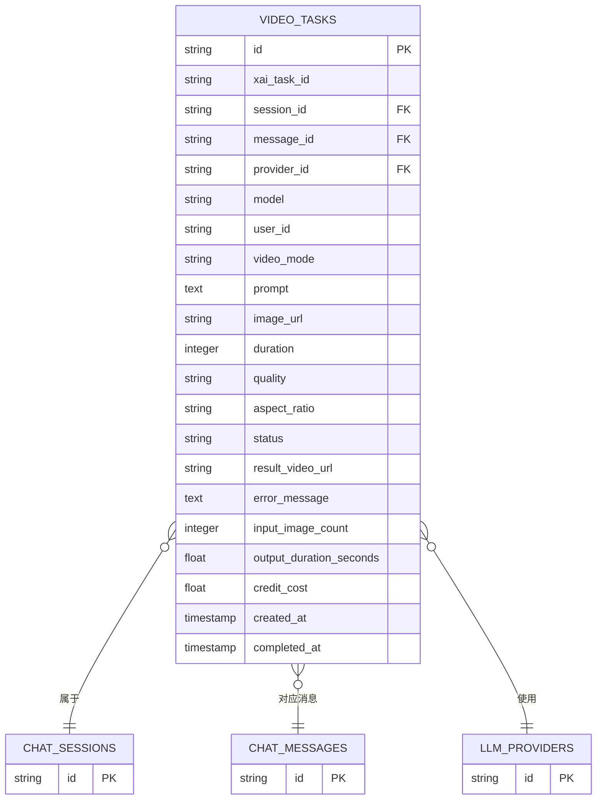
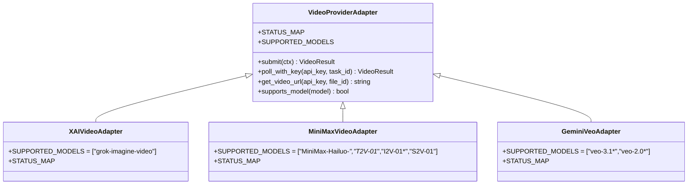
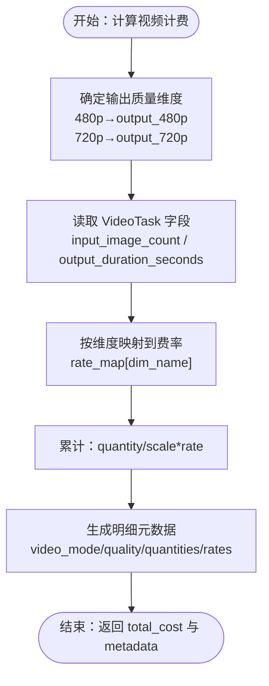
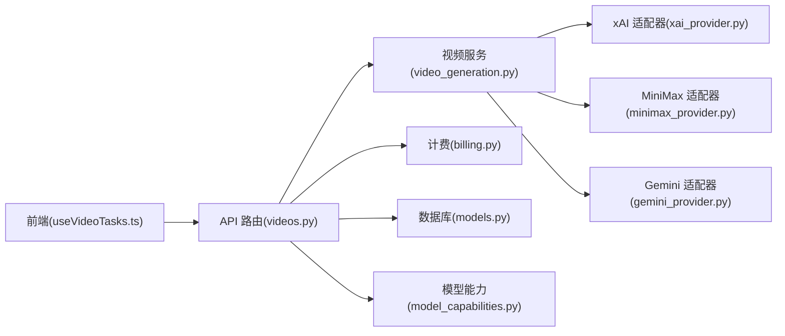

# 视频任务模型

<cite>
**本文引用的文件**
- [models.py](file://backend/models.py)
- [schemas.py](file://backend/schemas.py)
- [videos.py](file://backend/routers/videos.py)
- [video_generation.py](file://backend/services/video_generation.py)
- [base.py](file://backend/services/video_providers/base.py)
- [xai_provider.py](file://backend/services/video_providers/xai_provider.py)
- [gemini_provider.py](file://backend/services/video_providers/gemini_provider.py)
- [minimax_provider.py](file://backend/services/video_providers/minimax_provider.py)
- [model_capabilities.py](file://backend/services/video_providers/model_capabilities.py)
- [billing.py](file://backend/services/billing.py)
- [7459f2d26782_add_video_tasks_and_video_agent_fields.py](file://backend/migrations/versions/7459f2d26782_add_video_tasks_and_video_agent_fields.py)
- [video.ts](file://backend/admin/src/types/video.ts)
- [useVideoTasks.ts](file://backend/admin/src/hooks/useVideoTasks.ts)
</cite>

## 目录
1. [简介](#简介)
2. [项目结构](#项目结构)
3. [核心组件](#核心组件)
4. [架构总览](#架构总览)
5. [详细组件分析](#详细组件分析)
6. [依赖关系分析](#依赖关系分析)
7. [性能考虑](#性能考虑)
8. [故障排查指南](#故障排查指南)
9. [结论](#结论)
10. [附录](#附录)

## 简介
本文档面向 Infinite Game 的视频任务模型，系统化阐述 VideoTask 异步视频生成任务系统的设计与实现，涵盖任务 ID 关联、会话与消息关联、AI 供应商集成、模型选择、参数配置、状态管理、结果存储、错误处理、计费计算、典型 ORM 使用场景以及异步任务处理的性能优化与监控建议。

## 项目结构
视频任务模型围绕后端数据库模型、API 路由、服务层适配器与计费模块协同工作，形成“请求—提交—轮询—落库—计费—结果”的闭环流程。前端通过 SWR 实现活跃任务的自动轮询刷新。

图表来源
- [videos.py:1-343](file://backend/routers/videos.py#L1-L343)
- [video_generation.py:1-160](file://backend/services/video_generation.py#L1-L160)
- [base.py:1-114](file://backend/services/video_providers/base.py#L1-L114)
- [billing.py:1-388](file://backend/services/billing.py#L1-L388)
- [models.py:391-422](file://backend/models.py#L391-L422)
- [model_capabilities.py:1-223](file://backend/services/video_providers/model_capabilities.py#L1-L223)

章节来源
- [videos.py:1-343](file://backend/routers/videos.py#L1-L343)
- [models.py:391-422](file://backend/models.py#L391-L422)

## 核心组件
- VideoTask 数据模型：持久化异步视频生成任务，包含任务 ID 关联、会话/消息关联、AI 供应商与模型、生成参数、状态与计费字段。
- VideoContext/VideoResult：供应商无关的请求/响应上下文，屏蔽不同供应商差异。
- 供应商适配器：xAI、MiniMax、Gemini（Veo）三类适配器，统一 submit/poll 接口。
- 计费模块：基于映射表驱动的视频计费，支持输入图片数量、输出时长、质量维度。
- API 路由：提供任务创建、状态查询、会话关联查询、模型能力查询、删除等接口。
- 前端钩子：自动轮询活跃任务，提升用户体验。

章节来源
- [models.py:391-422](file://backend/models.py#L391-L422)
- [base.py:15-47](file://backend/services/video_providers/base.py#L15-L47)
- [video_generation.py:44-160](file://backend/services/video_generation.py#L44-L160)
- [billing.py:22-387](file://backend/services/billing.py#L22-L387)
- [videos.py:26-297](file://backend/routers/videos.py#L26-L297)
- [useVideoTasks.ts:1-73](file://backend/admin/src/hooks/useVideoTasks.ts#L1-L73)

## 架构总览
视频任务系统采用“路由—服务—适配器—计费—存储”分层设计，通过统一的 VideoContext/VideoResult 抽象屏蔽供应商差异；状态轮询与计费在完成后原子性落库，保证一致性与可观测性。

图表来源
- [videos.py:74-232](file://backend/routers/videos.py#L74-L232)
- [video_generation.py:84-124](file://backend/services/video_generation.py#L84-L124)
- [xai_provider.py:47-164](file://backend/services/video_providers/xai_provider.py#L47-L164)
- [gemini_provider.py:80-222](file://backend/services/video_providers/gemini_provider.py#L80-L222)
- [minimax_provider.py:90-286](file://backend/services/video_providers/minimax_provider.py#L90-L286)
- [billing.py:353-387](file://backend/services/billing.py#L353-L387)

## 详细组件分析

### VideoTask 实体与关联
- 关键字段
  - 任务标识：id、xai_task_id（外部供应商任务 ID）
  - 关联：session_id（会话）、message_id（消息）、provider_id（AI 供应商）、model、user_id
  - 生成参数：video_mode（text_to_video/image_to_video/edit）、prompt、image_url、last_frame_image、duration、quality、aspect_ratio、mode
  - 状态与结果：status（pending/processing/completed/failed）、result_video_url、error_message
  - 计费：input_image_count、output_duration_seconds、credit_cost
  - 时间戳：created_at、completed_at
- 关系
  - 一对一：ChatSession（外键 session_id）
  - 一对一：ChatMessage（外键 message_id）
  - 多对一：LLMProvider（外键 provider_id）

图表来源
- [models.py:391-422](file://backend/models.py#L391-L422)
- [7459f2d26782_add_video_tasks_and_video_agent_fields.py:29-55](file://backend/migrations/versions/7459f2d26782_add_video_tasks_and_video_agent_fields.py#L29-L55)

章节来源
- [models.py:391-422](file://backend/models.py#L391-L422)
- [7459f2d26782_add_video_tasks_and_video_agent_fields.py:21-84](file://backend/migrations/versions/7459f2d26782_add_video_tasks_and_video_agent_fields.py#L21-L84)

### 生成参数与模型选择
- 生成模式
  - text_to_video：纯文本生成
  - image_to_video：以图片为起始帧生成
  - edit：编辑已有视频（部分供应商支持）
- 提示词与输入
  - prompt：必填，长度限制见请求模式
  - image_url/last_frame_image：首帧/尾帧图片（供应商与模型支持度不同）
- 时长与质量
  - duration：1-15 秒（具体受模型支持范围限制）
  - quality：480p/720p/768p/1080p（供应商支持度不同）
- 宽高比与风格
  - aspect_ratio：16:9/9:16/1:1 等
  - mode：保留字段，兼容前端
- 模型能力查询
  - 提供按模型名查询能力的接口，返回支持的模式、时长、分辨率、首尾帧支持等

章节来源
- [schemas.py:629-690](file://backend/schemas.py#L629-L690)
- [model_capabilities.py:22-223](file://backend/services/video_providers/model_capabilities.py#L22-L223)
- [videos.py:251-259](file://backend/routers/videos.py#L251-L259)

### 供应商适配器与集成
- 统一接口
  - submit(ctx)：提交任务
  - poll_with_key(api_key, task_id)：带密钥轮询
  - get_video_url(api_key, file_id)：部分供应商需要二次拉取下载地址
- 状态映射
  - 各适配器维护 STATUS_MAP，将供应商原始状态映射为内部状态
- 典型差异
  - xAI：支持 text_to_video、image_to_video、edit；轮询返回视频 URL
  - Gemini（Veo）：支持首尾帧与更高分辨率；完成时返回 operation_name，需额外下载
  - MiniMax：支持多种模型族，部分模型要求首帧图片或尾帧图片；完成时返回 file_id，需二次拉取下载地址

图表来源
- [base.py:49-114](file://backend/services/video_providers/base.py#L49-L114)
- [xai_provider.py:22-46](file://backend/services/video_providers/xai_provider.py#L22-L46)
- [minimax_provider.py:30-44](file://backend/services/video_providers/minimax_provider.py#L30-L44)
- [gemini_provider.py:31-39](file://backend/services/video_providers/gemini_provider.py#L31-L39)

章节来源
- [video_generation.py:44-160](file://backend/services/video_generation.py#L44-L160)
- [xai_provider.py:22-164](file://backend/services/video_providers/xai_provider.py#L22-L164)
- [minimax_provider.py:30-318](file://backend/services/video_providers/minimax_provider.py#L30-L318)
- [gemini_provider.py:31-276](file://backend/services/video_providers/gemini_provider.py#L31-L276)

### 状态管理与结果存储
- 状态流转
  - pending → processing → completed 或 failed
  - 超时保护：pending 且持续报错超过 5 分钟判定失败
- 结果落库
  - completed：下载视频、写入 result_video_url、output_duration_seconds、completed_at
  - failed：写入 error_message
- 会话与消息
  - 成功完成后在关联会话中插入一条包含任务结果的消息（便于前端展示）

章节来源
- [videos.py:163-232](file://backend/routers/videos.py#L163-L232)
- [base.py:36-47](file://backend/services/video_providers/base.py#L36-L47)

### 计费计算逻辑
- 计费维度
  - video_input_image：每张输入图片
  - video_input_second：每秒输入视频（edit 模式）
  - video_output_480p/video_output_720p：按输出质量对应的每秒计费
- 计费来源
  - 从 LLMProvider.model_costs[model] 读取各维度费率
  - 质量映射：480p→video_output_480p，720p→video_output_720p
- 扣费流程
  - 计算总费用与明细
  - 原子扣费，记录 CreditTransaction

图表来源
- [billing.py:353-387](file://backend/services/billing.py#L353-L387)

章节来源
- [billing.py:22-387](file://backend/services/billing.py#L22-L387)
- [videos.py:188-224](file://backend/routers/videos.py#L188-L224)

### 典型使用场景与 ORM 示例
- 创建任务
  - 路由：POST /api/videos
  - 步骤：校验供应商与模型→合并配置→推断供应商类型→提交供应商→创建 VideoTask 记录
- 查询任务状态
  - 路由：GET /api/videos/{id}/status
  - 步骤：若为终态直接返回→否则轮询供应商→更新状态/结果/计费→返回
- 获取会话视频任务
  - 路由：GET /api/videos/session/{session_id}
  - 步骤：按 session_id 查询 VideoTask 列表
- 删除任务
  - 路由：DELETE /api/videos/{id}
  - 步骤：仅允许删除终态任务→删除本地文件→删除关联消息→删除任务记录

章节来源
- [videos.py:74-297](file://backend/routers/videos.py#L74-L297)

### 前端集成与轮询策略
- 前端钩子 useVideoTasks
  - 自动筛选活跃任务（pending/processing），每 5 秒轮询一次
  - 并发调用 /videos/{id}/status，驱动后端轮询并写入数据库
- 模型能力展示
  - 前端类型定义包含模式、分辨率、宽高比等标签映射

章节来源
- [useVideoTasks.ts:1-73](file://backend/admin/src/hooks/useVideoTasks.ts#L1-L73)
- [video.ts:1-54](file://backend/admin/src/types/video.ts#L1-L54)

## 依赖关系分析
- 路由依赖服务层（video_generation），服务层依赖适配器层，适配器层依赖供应商 API
- 路由依赖计费模块进行费用计算与原子扣费
- 路由依赖数据库模型进行任务状态与结果持久化
- 前端通过 SWR 与后端交互，实现活跃任务的自动轮询

图表来源
- [videos.py:1-343](file://backend/routers/videos.py#L1-L343)
- [video_generation.py:1-160](file://backend/services/video_generation.py#L1-L160)
- [xai_provider.py:1-164](file://backend/services/video_providers/xai_provider.py#L1-L164)
- [minimax_provider.py:1-318](file://backend/services/video_providers/minimax_provider.py#L1-L318)
- [gemini_provider.py:1-276](file://backend/services/video_providers/gemini_provider.py#L1-L276)
- [billing.py:1-388](file://backend/services/billing.py#L1-L388)
- [models.py:1-447](file://backend/models.py#L1-L447)
- [model_capabilities.py:1-223](file://backend/services/video_providers/model_capabilities.py#L1-L223)

章节来源
- [videos.py:1-343](file://backend/routers/videos.py#L1-L343)
- [video_generation.py:1-160](file://backend/services/video_generation.py#L1-L160)

## 性能考虑
- 轮询频率控制
  - 前端仅对活跃任务进行轮询，避免对已完成任务的无效请求
  - 后端对 pending 且错误持续超过 5 分钟的任务进行超时判定，防止长时间占用资源
- 并发与幂等
  - 前端并发调用 /videos/{id}/status，后端应保证幂等与状态一致性
- I/O 优化
  - 下载视频时复用头部（如 x-goog-api-key），减少重复鉴权开销
- 数据库索引
  - VideoTask 的 user_id、status、xai_task_id 等字段已建立索引，有利于查询与过滤

章节来源
- [useVideoTasks.ts:34-48](file://backend/admin/src/hooks/useVideoTasks.ts#L34-L48)
- [videos.py:179-182](file://backend/routers/videos.py#L179-L182)
- [7459f2d26782_add_video_tasks_and_video_agent_fields.py:56-60](file://backend/migrations/versions/7459f2d26782_add_video_tasks_and_video_agent_fields.py#L56-L60)

## 故障排查指南
- 常见错误与定位
  - 供应商提交失败：查看适配器日志与返回错误码，确认 API Key、模型名与参数合法性
  - 轮询状态 pending 且报错：检查网络连通性与供应商限流；超过 5 分钟自动判定失败
  - 内容审核拒绝：xAI 适配器在 moderation 失败时将状态转为 failed，并记录错误
  - 余额不足：计费模块抛出 InsufficientCreditsError，需充值或调整用量
- 排查步骤
  - 查看 VideoTask.status 与 error_message
  - 检查 LLMProvider.model_costs 与费率配置
  - 核对输入图片数量、输出时长与质量设置
  - 确认会话消息是否正确插入

章节来源
- [xai_provider.py:139-157](file://backend/services/video_providers/xai_provider.py#L139-L157)
- [videos.py:179-224](file://backend/routers/videos.py#L179-L224)
- [billing.py:37-43](file://backend/services/billing.py#L37-L43)

## 结论
VideoTask 模型通过统一的上下文抽象与适配器层，实现了多供应商视频生成的标准化接入；结合完善的计费与状态管理，保障了异步任务的可靠性与可审计性。前端的自动轮询策略进一步提升了用户体验。建议在生产环境中强化重试与熔断、完善监控告警，并持续维护供应商能力配置表以适配新模型。

## 附录
- 供应商能力概览（节选）
  - xAI：支持 text_to_video、image_to_video、edit；时长 1-15 秒；分辨率 480p/720p
  - MiniMax：多模型族，部分模型要求首帧/尾帧；时长 6/10 秒；分辨率 512p/720p/768p/1080p
  - Gemini（Veo）：支持首尾帧与更高分辨率；时长 4/6/8 秒；分辨率 720p/1080p/4k

章节来源
- [model_capabilities.py:22-223](file://backend/services/video_providers/model_capabilities.py#L22-L223)