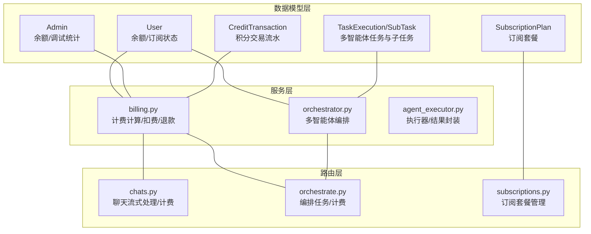
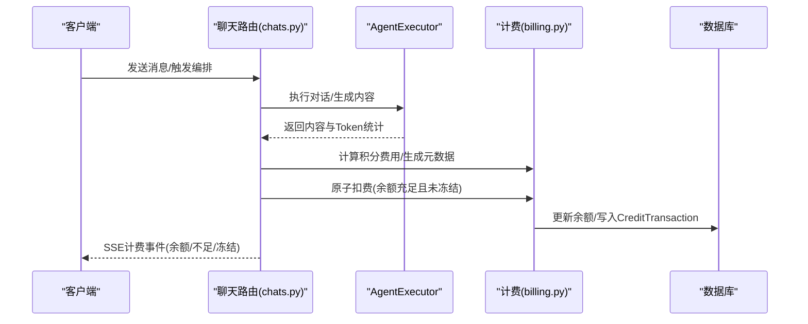
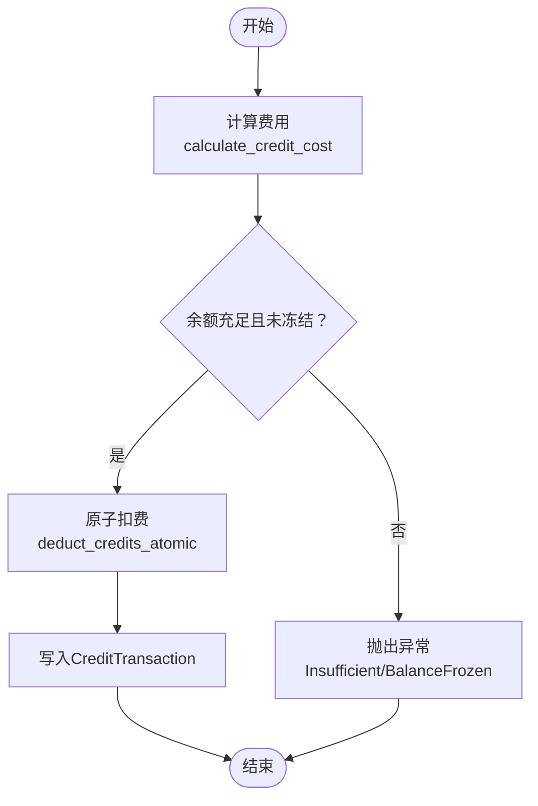
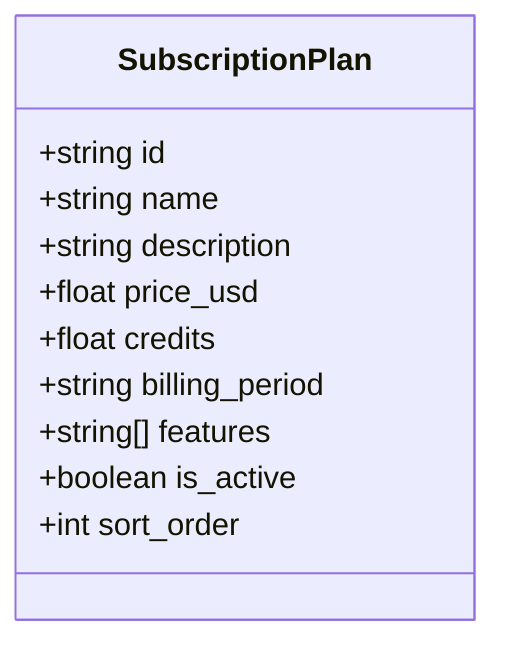
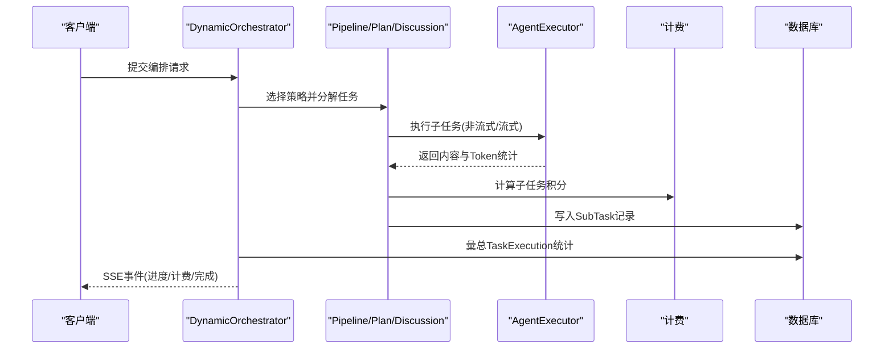
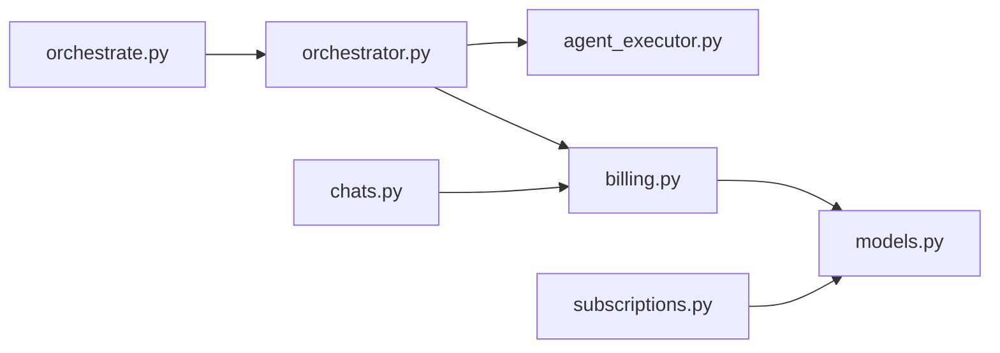

# 计费和订阅模型

<cite>
**本文引用的文件**
- [models.py](file://backend/models.py)
- [billing.py](file://backend/services/billing.py)
- [orchestrator.py](file://backend/services/orchestrator.py)
- [agent_executor.py](file://backend/services/agent_executor.py)
- [schemas.py](file://backend/schemas.py)
- [chats.py](file://backend/routers/chats.py)
- [orchestrate.py](file://backend/routers/orchestrate.py)
- [subscriptions.py](file://backend/routers/subscriptions.py)
- [c74e516c6d87_add_credit_billing_system.py](file://backend/migrations/versions/c74e516c6d87_add_credit_billing_system.py)
- [h4i5j6k7l8m9_add_model_costs_and_subscriptions.py](file://backend/migrations/versions/h4i5j6k7l8m9_add_model_costs_and_subscriptions.py)
- [admin.py](file://backend/routers/admin.py)
- [page.tsx](file://backend/admin/src/app/admin/users/[id]/credits/page.tsx)
</cite>

## 目录
1. [简介](#简介)
2. [项目结构](#项目结构)
3. [核心组件](#核心组件)
4. [架构总览](#架构总览)
5. [详细组件分析](#详细组件分析)
6. [依赖分析](#依赖分析)
7. [性能考虑](#性能考虑)
8. [故障排查指南](#故障排查指南)
9. [结论](#结论)
10. [附录](#附录)

## 简介
本文件面向 Infinite Game 的计费与订阅模型，系统性阐述以下内容：
- CreditTransaction 实体的积分交易系统：交易类型（扣费、充值、管理员调整）、金额计算、余额变更记录、Token 消耗统计、元数据存储。
- SubscriptionPlan 实体的订阅套餐管理：套餐名称、描述、价格设置、积分数量、计费周期、功能列表、激活状态、排序展示。
- 多智能体任务执行与子任务系统：任务编排、状态管理、Token 消耗统计、积分计算、执行元数据。
- 完整性约束、事务处理与错误处理机制。
- 典型使用场景的 ORM 操作示例与最佳实践（计费准确性与审计日志）。

## 项目结构
计费与订阅模型由后端服务层、数据模型层、路由层与迁移脚本共同构成，关键模块如下：
- 数据模型层：定义 User、Admin、CreditTransaction、TaskExecution、SubTask、SubscriptionPlan 等实体及其字段。
- 服务层：提供计费计算与扣费、退款、多智能体编排与计费集成。
- 路由层：暴露聊天与编排接口，集成计费校验与扣费逻辑；提供订阅套餐管理接口。
- 迁移脚本：创建计费与订阅相关表结构及索引。

图表来源
- [models.py](file://backend/models.py)
- [billing.py](file://backend/services/billing.py)
- [orchestrator.py](file://backend/services/orchestrator.py)
- [agent_executor.py](file://backend/services/agent_executor.py)
- [chats.py](file://backend/routers/chats.py)
- [orchestrate.py](file://backend/routers/orchestrate.py)
- [subscriptions.py](file://backend/routers/subscriptions.py)

章节来源
- [models.py](file://backend/models.py)
- [billing.py](file://backend/services/billing.py)
- [orchestrator.py](file://backend/services/orchestrator.py)
- [agent_executor.py](file://backend/services/agent_executor.py)
- [chats.py](file://backend/routers/chats.py)
- [orchestrate.py](file://backend/routers/orchestrate.py)
- [subscriptions.py](file://backend/routers/subscriptions.py)

## 核心组件
- CreditTransaction：记录积分流水，包含交易类型、金额、余额前后值、Token 统计、元数据与描述。
- SubscriptionPlan：订阅套餐配置，包含价格、积分、周期、特性列表、激活状态与排序。
- TaskExecution/SubTask：多智能体任务执行与子任务，记录输入输出 Token、积分消耗与执行元数据。
- 计费服务：映射表驱动的计费计算、原子扣费/退款、余额冻结与不足检查。
- 路由集成：聊天与编排接口在执行过程中进行计费校验与扣费，并通过 SSE 流式反馈计费状态。

章节来源
- [models.py](file://backend/models.py)
- [billing.py](file://backend/services/billing.py)
- [schemas.py](file://backend/schemas.py)
- [chats.py](file://backend/routers/chats.py)
- [orchestrate.py](file://backend/routers/orchestrate.py)

## 架构总览
下图展示了计费与订阅在系统中的交互关系与数据流向：

图表来源
- [chats.py](file://backend/routers/chats.py)
- [agent_executor.py](file://backend/services/agent_executor.py)
- [billing.py](file://backend/services/billing.py)

## 详细组件分析

### CreditTransaction 实体与积分交易系统
- 交易类型
  - deduction：扣费（amount 为负）。
  - recharge：充值（amount 为正）。
  - admin_adjust：管理员调整（amount 可正可负）。
- 金额与余额
  - amount：本次变动金额（正为收入，负为支出）。
  - balance_before/balance_after：变动前/后余额，用于审计与对账。
- Token 统计
  - input_tokens/output_tokens：记录本次调用的输入/输出 Token 数，便于溯源与计费。
- 元数据存储
  - metadata_json：存储计费快照（如 agent 名称、模型、各维度用量与费率），用于复杂计费场景的审计。
- 关键流程
  - 计费计算：billing.calculate_credit_cost 基于 Agent 费率与 Token 统计计算总费用与明细。
  - 原子扣费：billing.deduct_credits_atomic 使用 UPDATE ... WHERE ... 并发安全地扣费，失败时抛出余额不足或冻结异常。
  - 退款：billing.refund_credits_atomic 原子增加余额并记录交易。
  - 聊天与编排：chats 路由在生成内容后计算费用并尝试扣费，失败时通过 SSE 报告不足或冻结。

图表来源
- [billing.py](file://backend/services/billing.py)
- [chats.py](file://backend/routers/chats.py)

章节来源
- [models.py](file://backend/models.py)
- [billing.py](file://backend/services/billing.py)
- [schemas.py](file://backend/schemas.py)
- [chats.py](file://backend/routers/chats.py)

### SubscriptionPlan 实体与订阅套餐管理
- 字段说明
  - name/description：套餐名称与描述。
  - price_usd：价格（USD）。
  - credits：包含积分数。
  - billing_period：计费周期（monthly/yearly/lifetime）。
  - features：特性列表。
  - is_active：激活状态。
  - sort_order：排序展示。
- 管理接口
  - 创建/更新/删除/查询：subscriptions 路由提供 REST 接口，支持按 sort_order 与创建时间排序。
- 管理员操作
  - admin 路由支持为用户设置订阅计划、起止时间，并可选自动发放套餐积分，同时记录 CreditTransaction。

图表来源
- [models.py](file://backend/models.py)
- [subscriptions.py](file://backend/routers/subscriptions.py)
- [h4i5j6k7l8m9_add_model_costs_and_subscriptions.py](file://backend/migrations/versions/h4i5j6k7l8m9_add_model_costs_and_subscriptions.py)

章节来源
- [models.py](file://backend/models.py)
- [schemas.py](file://backend/schemas.py)
- [subscriptions.py](file://backend/routers/subscriptions.py)
- [admin.py](file://backend/routers/admin.py)

### 多智能体任务执行与子任务系统
- 任务执行
  - TaskExecution：记录领导智能体、用户、会话、任务描述、协作模式、状态、结果与累计 Token/积分。
  - SubTask：记录子任务描述、顺序、状态、输入输出数据、Token 与积分消耗、重试次数与错误信息。
- 编排策略
  - Pipeline/Plan/Discussion：三种协作策略，支持串行/并行与依赖图，动态产出子任务。
- 计费集成
  - 在子任务完成后，基于 ExecutionResult 计算积分费用并写入 SubTask.credit_cost。
  - 编排完成后汇总 TaskExecution.total_input_tokens、total_output_tokens、total_credit_cost。
- 路由集成
  - orchestrate 路由提供 SSE 流式进度，包含计费状态与最终结果。

图表来源
- [orchestrator.py](file://backend/services/orchestrator.py)
- [agent_executor.py](file://backend/services/agent_executor.py)
- [billing.py](file://backend/services/billing.py)
- [orchestrate.py](file://backend/routers/orchestrate.py)

章节来源
- [models.py](file://backend/models.py)
- [orchestrator.py](file://backend/services/orchestrator.py)
- [agent_executor.py](file://backend/services/agent_executor.py)
- [schemas.py](file://backend/schemas.py)
- [orchestrate.py](file://backend/routers/orchestrate.py)

### 计费系统完整性约束、事务处理与错误处理
- 完整性约束
  - 用户与管理员余额字段 credits 默认值与非空约束。
  - CreditTransaction 外键关联 user/admin/agent/session。
  - 订阅计划唯一索引（name）与索引（id/name）。
- 事务处理
  - 原子扣费/退款：UPDATE ... WHERE ... 并结合同步会话，确保并发安全。
  - 扣费失败时保持一致性：余额不足或冻结时抛出异常，不写入交易记录。
- 错误处理
  - InsufficientCreditsError：余额不足。
  - BalanceFrozenError：余额被冻结。
  - 聊天与编排路由在异常时通过 SSE 报告 insufficient/frozen，并记录日志。

章节来源
- [models.py](file://backend/models.py)
- [billing.py](file://backend/services/billing.py)
- [c74e516c6d87_add_credit_billing_system.py](file://backend/migrations/versions/c74e516c6d87_add_credit_billing_system.py)
- [h4i5j6k7l8m9_add_model_costs_and_subscriptions.py](file://backend/migrations/versions/h4i5j6k7l8m9_add_model_costs_and_subscriptions.py)
- [chats.py](file://backend/routers/chats.py)
- [orchestrate.py](file://backend/routers/orchestrate.py)

### 典型使用场景与ORM操作示例
以下为常见场景的 ORM 操作要点（以路径与行号标注代替代码片段）：
- 积分充值（管理员）
  - 设置用户余额并记录交易：[admin.py:240-279](file://backend/routers/admin.py#L240-L279)
  - 退款接口（原子增加余额并记录）：[billing.py:86-176](file://backend/services/billing.py#L86-L176)
- 订阅购买（管理员）
  - 创建订阅计划：[subscriptions.py:21-37](file://backend/routers/subscriptions.py#L21-L37)
  - 设置用户订阅并可选发放积分：[admin.py:240-279](file://backend/routers/admin.py#L240-L279)
- 任务执行计费（用户）
  - 编排任务并流式返回进度与计费状态：[orchestrate.py:26-71](file://backend/routers/orchestrate.py#L26-L71)
  - 子任务完成后计算积分并写入：[orchestrator.py:128-161](file://backend/services/orchestrator.py#L128-L161)
- 聊天计费（用户）
  - 计算费用并尝试原子扣费：[chats.py:704-728](file://backend/routers/chats.py#L704-L728)

章节来源
- [admin.py](file://backend/routers/admin.py)
- [billing.py](file://backend/services/billing.py)
- [subscriptions.py](file://backend/routers/subscriptions.py)
- [orchestrate.py](file://backend/routers/orchestrate.py)
- [orchestrator.py](file://backend/services/orchestrator.py)
- [chats.py](file://backend/routers/chats.py)

### 计费准确性保证与审计日志最佳实践
- 准确性保证
  - 使用映射表驱动的计费计算，避免分支判断导致的误差。
  - 原子扣费/退款，确保并发安全与一致性。
  - 记录 input_tokens/output_tokens 与 metadata_json，便于回溯与审计。
- 审计日志
  - CreditTransaction 作为唯一事实来源，记录交易类型、金额、余额前后值、Token 统计与描述。
  - 管理端页面展示交易历史，支持按类型筛选与余额核对：[page.tsx:30-119](file://backend/admin/src/app/admin/users/[id]/credits/page.tsx#L30-L119)

章节来源
- [billing.py](file://backend/services/billing.py)
- [models.py](file://backend/models.py)
- [page.tsx](file://backend/admin/src/app/admin/users/[id]/credits/page.tsx)

## 依赖分析
- 模块耦合
  - billing 与 models：依赖 User/Admin/CreditTransaction。
  - orchestrator 与 billing/agent_executor：依赖计费计算与执行结果封装。
  - chats/orchestrate 与 billing：在执行后进行计费与扣费。
- 外部依赖
  - SQLAlchemy 异步会话与更新语句。
  - SSE 流式事件推送。

图表来源
- [billing.py](file://backend/services/billing.py)
- [models.py](file://backend/models.py)
- [orchestrator.py](file://backend/services/orchestrator.py)
- [agent_executor.py](file://backend/services/agent_executor.py)
- [chats.py](file://backend/routers/chats.py)
- [orchestrate.py](file://backend/routers/orchestrate.py)
- [subscriptions.py](file://backend/routers/subscriptions.py)

章节来源
- [billing.py](file://backend/services/billing.py)
- [orchestrator.py](file://backend/services/orchestrator.py)
- [agent_executor.py](file://backend/services/agent_executor.py)
- [chats.py](file://backend/routers/chats.py)
- [orchestrate.py](file://backend/routers/orchestrate.py)
- [subscriptions.py](file://backend/routers/subscriptions.py)

## 性能考虑
- 计费计算
  - 映射表驱动减少条件分支，提升可维护性与性能稳定性。
- 数据访问
  - 原子更新与同步会话，避免重复查询与竞态。
- 流式处理
  - SSE 事件与异步生成器降低前端等待时间，提升用户体验。
- 索引与约束
  - 订阅计划与交易记录建立必要索引，提升查询效率。

## 故障排查指南
- 余额不足
  - 现象：SSE 报告 insufficient。
  - 处理：引导用户充值或检查冻结状态。
- 余额冻结
  - 现象：SSE 报告 frozen。
  - 处理：检查 is_balance_frozen 字段与管理员操作。
- 计费异常
  - 现象：编排或聊天中断。
  - 处理：查看日志与 CreditTransaction 记录，确认扣费是否发生。

章节来源
- [billing.py](file://backend/services/billing.py)
- [chats.py](file://backend/routers/chats.py)
- [orchestrate.py](file://backend/routers/orchestrate.py)

## 结论
Infinite Game 的计费与订阅模型通过清晰的数据模型、严谨的服务层计费逻辑与完善的路由集成，实现了高可用、可审计的积分与订阅管理体系。映射表驱动的计费计算与原子事务保障了计费准确性，SSE 流式反馈提升了用户体验。建议在生产环境中持续监控 CreditTransaction 与订阅计划的使用情况，并定期审计计费元数据以确保长期稳定运行。

## 附录
- 迁移脚本
  - 计费系统初始化：[c74e516c6d87_add_credit_billing_system.py:21-67](file://backend/migrations/versions/c74e516c6d87_add_credit_billing_system.py#L21-L67)
  - 订阅计划表创建：[h4i5j6k7l8m9_add_model_costs_and_subscriptions.py:21-54](file://backend/migrations/versions/h4i5j6k7l8m9_add_model_costs_and_subscriptions.py#L21-L54)