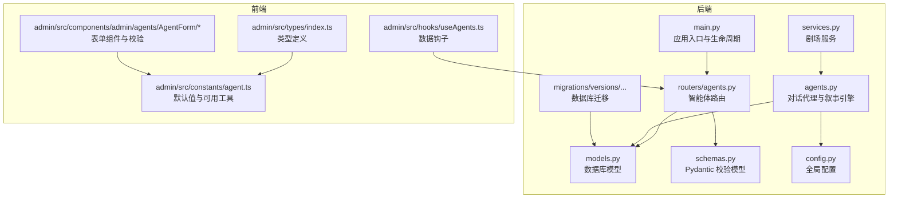
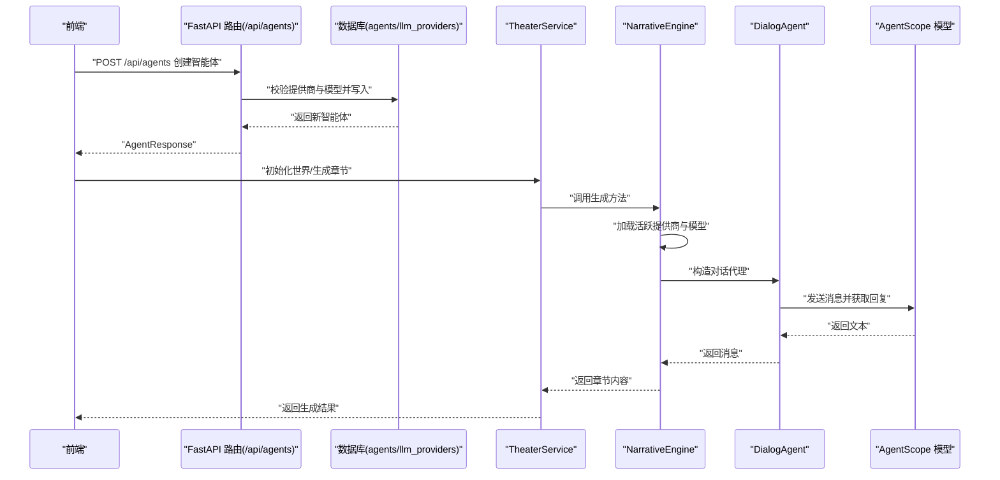
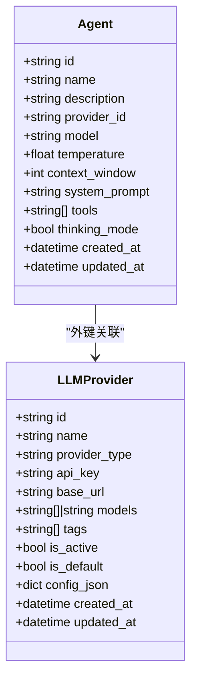
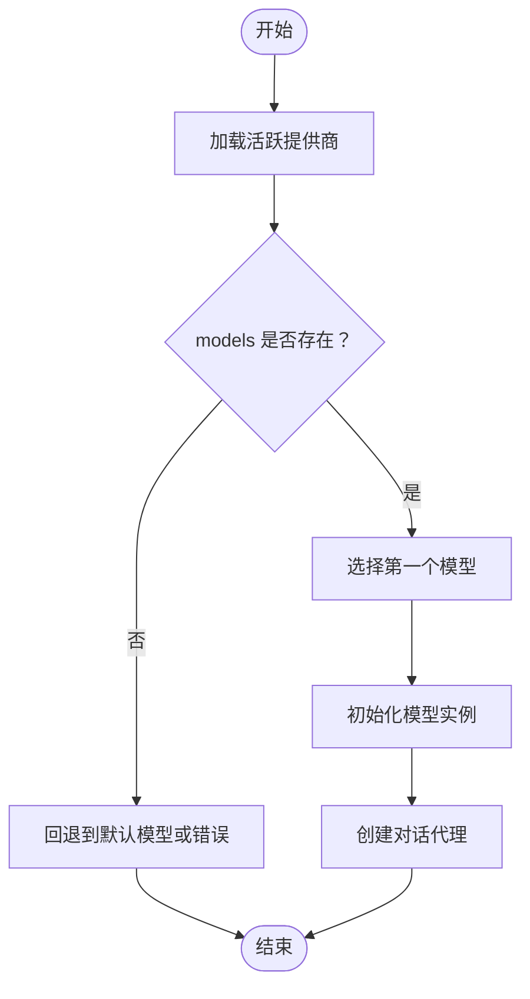
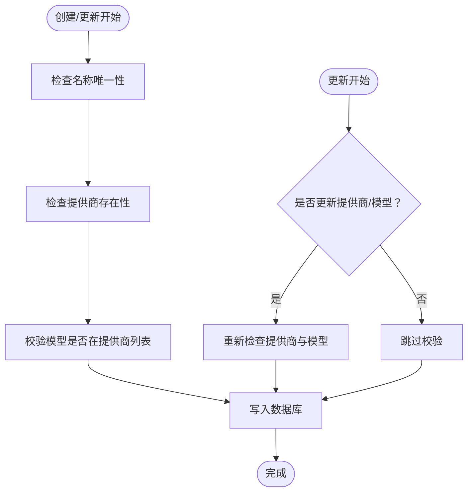
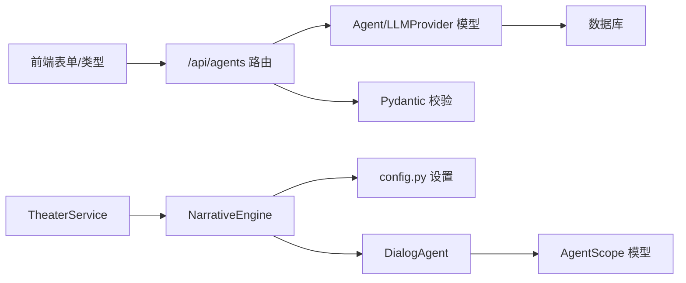

# 智能体模型

<cite>
**本文引用的文件**
- [backend/models.py](file://backend/models.py)
- [backend/schemas.py](file://backend/schemas.py)
- [backend/agents.py](file://backend/agents.py)
- [backend/services.py](file://backend/services.py)
- [backend/routers/agents.py](file://backend/routers/agents.py)
- [backend/main.py](file://backend/main.py)
- [backend/config.py](file://backend/config.py)
- [backend/migrations/versions/82e927e1cf80_add_agent_model.py](file://backend/migrations/versions/82e927e1cf80_add_agent_model.py)
- [backend/admin/src/constants/agent.ts](file://backend/admin/src/constants/agent.ts)
- [backend/admin/src/hooks/useAgents.ts](file://backend/admin/src/hooks/useAgents.ts)
- [backend/admin/src/types/index.ts](file://backend/admin/src/types/index.ts)
- [backend/admin/src/components/admin/agents/AgentForm/schema.ts](file://backend/admin/src/components/admin/agents/AgentForm/schema.ts)
- [backend/admin/src/components/admin/agents/AgentForm/Parameters.tsx](file://backend/admin/src/components/admin/agents/AgentForm/Parameters.tsx)
- [backend/admin/src/components/admin/agents/AgentForm/Tools.tsx](file://backend/admin/src/components/admin/agents/AgentForm/Tools.tsx)
</cite>

## 目录
1. [简介](#简介)
2. [项目结构](#项目结构)
3. [核心组件](#核心组件)
4. [架构总览](#架构总览)
5. [详细组件分析](#详细组件分析)
6. [依赖关系分析](#依赖关系分析)
7. [性能考量](#性能考量)
8. [故障排查指南](#故障排查指南)
9. [结论](#结论)
10. [附录](#附录)

## 简介
本文件面向“智能体数据模型”的设计与实现，围绕 Agent 类的字段定义、智能体配置参数、与大模型提供商的关联关系与模型选择机制、温度参数与上下文窗口对行为的影响、工具集启用机制、思维模式实现原理、系统提示词定制化与高级参数管理，以及智能体的创建、更新与版本管理策略进行全面说明。文档同时结合后端数据库模型、Pydantic 校验层、FastAPI 路由层、AgentScope 对话代理与叙事引擎，以及前端表单与类型定义，提供从概念到代码级的完整视图。

## 项目结构
本项目采用前后端分离架构，后端使用 Python/SQLAlchemy/FastAPI，前端使用 React + TypeScript。智能体模型位于后端，通过数据库迁移脚本创建；前端提供智能体配置表单与列表展示。

图表来源
- [backend/models.py](file://backend/models.py#L100-L122)
- [backend/schemas.py](file://backend/schemas.py#L43-L74)
- [backend/agents.py](file://backend/agents.py#L11-L196)
- [backend/services.py](file://backend/services.py#L8-L66)
- [backend/routers/agents.py](file://backend/routers/agents.py#L1-L141)
- [backend/main.py](file://backend/main.py#L30-L103)
- [backend/config.py](file://backend/config.py#L7-L34)
- [backend/migrations/versions/82e927e1cf80_add_agent_model.py](file://backend/migrations/versions/82e927e1cf80_add_agent_model.py#L21-L43)
- [backend/admin/src/types/index.ts](file://backend/admin/src/types/index.ts#L1-L25)
- [backend/admin/src/constants/agent.ts](file://backend/admin/src/constants/agent.ts#L1-L20)
- [backend/admin/src/components/admin/agents/AgentForm/schema.ts](file://backend/admin/src/components/admin/agents/AgentForm/schema.ts#L1-L24)
- [backend/admin/src/hooks/useAgents.ts](file://backend/admin/src/hooks/useAgents.ts#L1-L52)

章节来源
- [backend/models.py](file://backend/models.py#L100-L122)
- [backend/schemas.py](file://backend/schemas.py#L43-L74)
- [backend/agents.py](file://backend/agents.py#L11-L196)
- [backend/routers/agents.py](file://backend/routers/agents.py#L1-L141)
- [backend/main.py](file://backend/main.py#L30-L103)
- [backend/config.py](file://backend/config.py#L7-L34)
- [backend/migrations/versions/82e927e1cf80_add_agent_model.py](file://backend/migrations/versions/82e927e1cf80_add_agent_model.py#L21-L43)
- [backend/admin/src/types/index.ts](file://backend/admin/src/types/index.ts#L1-L25)
- [backend/admin/src/constants/agent.ts](file://backend/admin/src/constants/agent.ts#L1-L20)
- [backend/admin/src/components/admin/agents/AgentForm/schema.ts](file://backend/admin/src/components/admin/agents/AgentForm/schema.ts#L1-L24)
- [backend/admin/src/hooks/useAgents.ts](file://backend/admin/src/hooks/useAgents.ts#L1-L52)

## 核心组件
- 数据模型（Agent）
  - 字段：标识、名称、描述、提供商关联、模型名、温度、上下文窗口、系统提示词、工具集、思维模式、时间戳。
  - 约束：名称唯一索引；温度范围 0~1；上下文窗口范围 4096~256000；工具集为字符串数组。
- Pydantic 校验模型（AgentBase/AgentCreate/AgentUpdate/AgentResponse）
  - 定义请求与响应的数据结构与约束，确保输入输出一致。
- 路由层（/api/agents）
  - 提供创建、查询、更新、删除智能体接口，并在创建/更新时校验提供商与模型可用性。
- 对话代理与叙事引擎（DialogAgent/NarrativeEngine）
  - 将智能体配置映射到 AgentScope 的模型实例，按角色组织消息，支持多智能体协作生成故事内容。
- 剧场服务（TheaterService）
  - 使用叙事引擎生成世界观与章节内容，保存至数据库。
- 前端类型与表单
  - 定义智能体类型、默认值、可用工具、表单校验规则与交互组件。

章节来源
- [backend/models.py](file://backend/models.py#L100-L122)
- [backend/schemas.py](file://backend/schemas.py#L43-L74)
- [backend/routers/agents.py](file://backend/routers/agents.py#L15-L55)
- [backend/agents.py](file://backend/agents.py#L11-L196)
- [backend/services.py](file://backend/services.py#L8-L66)
- [backend/admin/src/types/index.ts](file://backend/admin/src/types/index.ts#L1-L25)
- [backend/admin/src/constants/agent.ts](file://backend/admin/src/constants/agent.ts#L1-L20)
- [backend/admin/src/components/admin/agents/AgentForm/schema.ts](file://backend/admin/src/components/admin/agents/AgentForm/schema.ts#L1-L24)

## 架构总览
下图展示了智能体从创建到运行的关键流程：前端提交配置 → 后端校验与持久化 → 叙事引擎加载配置 → 代理调用大模型 → 返回结果并存储。

图表来源
- [backend/routers/agents.py](file://backend/routers/agents.py#L15-L55)
- [backend/models.py](file://backend/models.py#L100-L122)
- [backend/services.py](file://backend/services.py#L19-L59)
- [backend/agents.py](file://backend/agents.py#L49-L191)

## 详细组件分析

### Agent 数据模型与字段定义
- 关键字段与含义
  - id/name/description：唯一标识、名称与描述。
  - provider_id/model：关联 LLMProvider 并指定具体模型名。
  - temperature：采样温度，影响输出随机性与创造性。
  - context_window：上下文窗口大小（Token），限制输入长度。
  - system_prompt：系统提示词，决定智能体角色与行为准则。
  - tools：启用的工具集合（字符串数组）。
  - thinking_mode：是否启用思维模式（如链式思考）。
  - created_at/updated_at：记录创建与更新时间。
- 约束与默认值
  - 名称唯一；温度 0~1；上下文窗口 4096~256000；工具为空数组；思维模式默认关闭。
- 版本与迁移
  - 迁移脚本创建 agents 表并建立 name 唯一索引，确保命名一致性。

图表来源
- [backend/models.py](file://backend/models.py#L58-L79)
- [backend/models.py](file://backend/models.py#L100-L122)

章节来源
- [backend/models.py](file://backend/models.py#L100-L122)
- [backend/migrations/versions/82e927e1cf80_add_agent_model.py](file://backend/migrations/versions/82e927e1cf80_add_agent_model.py#L21-L43)

### 智能体配置参数与校验
- Pydantic 层定义
  - AgentBase：必填字段（名称、描述、提供商、模型、系统提示词）与可选字段（温度、上下文窗口、工具、思维模式）。
  - AgentCreate/AgentUpdate：分别用于创建与更新场景，支持部分字段更新。
  - AgentResponse：从 ORM 属性序列化为响应对象。
- 前端默认值与可用工具
  - 默认值：温度 0.7、上下文窗口 4096、思维模式关闭、工具为空。
  - 可用工具：网络搜索、代码解释器、图像生成、知识库。
- 表单校验
  - 名称长度、描述长度、模型选择、工具启用时必须至少选择一项等。

章节来源
- [backend/schemas.py](file://backend/schemas.py#L43-L74)
- [backend/admin/src/constants/agent.ts](file://backend/admin/src/constants/agent.ts#L1-L20)
- [backend/admin/src/components/admin/agents/AgentForm/schema.ts](file://backend/admin/src/components/admin/agents/AgentForm/schema.ts#L1-L24)
- [backend/admin/src/types/index.ts](file://backend/admin/src/types/index.ts#L1-L25)

### 与大模型提供商的关联与模型选择机制
- 关联关系
  - Agent 通过 provider_id 外键关联 LLMProvider；每个提供商定义 provider_type、base_url、api_key、models 列表等。
- 模型选择
  - 后端在创建/更新智能体时，会校验所选模型是否在提供商的 models 列表中（支持 JSON 数组或字符串格式）。
  - 叙事引擎启动时优先加载“活跃且默认优先”的提供商，自动选择第一个可用模型。
- 大模型类型
  - 支持 DashScope 与 OpenAI 类型；根据 provider_type 决定实例化 DashScopeChatModel 或 OpenAIChatModel。

图表来源
- [backend/routers/agents.py](file://backend/routers/agents.py#L22-L50)
- [backend/agents.py](file://backend/agents.py#L49-L99)

章节来源
- [backend/routers/agents.py](file://backend/routers/agents.py#L22-L50)
- [backend/agents.py](file://backend/agents.py#L49-L99)
- [backend/models.py](file://backend/models.py#L58-L79)

### 温度参数（temperature）与上下文窗口（context_window）对行为的影响
- 温度（temperature）
  - 控制输出随机性：越低越保守、越稳定；越高越发散、越有创造性。
  - 前端提供滑块与数值输入联动，范围 0~1，默认 0.7。
- 上下文窗口（context_window）
  - 影响可输入的 Token 上限，过大可能增加延迟与成本，过小可能导致信息截断。
  - 前端限制范围 4096~256000，默认 4096；展示单位为千 Tokens。
- 在对话代理中的体现
  - DialogAgent 将系统提示词与历史消息组装为消息列表，交由模型处理；上下文窗口影响消息裁剪策略（由底层模型或封装处理）。

章节来源
- [backend/admin/src/components/admin/agents/AgentForm/Parameters.tsx](file://backend/admin/src/components/admin/agents/AgentForm/Parameters.tsx#L87-L131)
- [backend/admin/src/constants/agent.ts](file://backend/admin/src/constants/agent.ts#L8-L19)
- [backend/schemas.py](file://backend/schemas.py#L48-L49)
- [backend/agents.py](file://backend/agents.py#L19-L41)

### 工具集（tools）启用机制
- 启用开关与工具列表
  - tools_enabled 开关控制是否启用工具；启用时 tools 必须非空。
  - 可用工具包括：网络搜索、代码解释器、图像生成、知识库。
- 前端交互
  - 复选框勾选多个工具；禁用时隐藏工具列表。
- 后端存储
  - tools 以字符串数组形式存储于 Agent 表；前端表单校验保证启用时至少选择一项。

章节来源
- [backend/admin/src/components/admin/agents/AgentForm/Tools.tsx](file://backend/admin/src/components/admin/agents/AgentForm/Tools.tsx#L19-L99)
- [backend/admin/src/constants/agent.ts](file://backend/admin/src/constants/agent.ts#L1-L6)
- [backend/admin/src/components/admin/agents/AgentForm/schema.ts](file://backend/admin/src/components/admin/agents/AgentForm/schema.ts#L14-L22)
- [backend/models.py](file://backend/models.py#L117-L117)

### 思维模式（thinking_mode）实现原理
- 功能说明
  - 开启后，模型在回答前进行思考过程（如链式思考），提升推理与一致性。
- 前端展示
  - 开关按钮，显示“开启/关闭”状态与说明文字。
- 实现位置
  - 字段存在于 Agent 模型与前端表单；具体推理链由底层模型或 AgentScope 的对话代理实现细节决定。

章节来源
- [backend/admin/src/components/admin/agents/AgentForm/Parameters.tsx](file://backend/admin/src/components/admin/agents/AgentForm/Parameters.tsx#L20-L49)
- [backend/models.py](file://backend/models.py#L118-L118)
- [backend/schemas.py](file://backend/schemas.py#L52-L52)

### 系统提示词（system_prompt）定制化与高级参数管理
- 定制化
  - system_prompt 作为智能体角色与行为准则的核心，可在创建/更新时设置。
  - 前端限制最大长度，避免过长导致上下文溢出。
- 高级参数
  - temperature/context_window/tools/thinking_mode 等均属于高级参数，通过表单与校验共同保障配置质量。
- 存储与使用
  - 保存于 Agent 表；对话代理在每次回复前注入系统提示词，形成统一的上下文框架。

章节来源
- [backend/schemas.py](file://backend/schemas.py#L43-L52)
- [backend/admin/src/components/admin/agents/AgentForm/schema.ts](file://backend/admin/src/components/admin/agents/AgentForm/schema.ts#L8-L13)
- [backend/agents.py](file://backend/agents.py#L19-L41)

### 智能体创建、更新与版本管理策略
- 创建流程
  - 校验名称唯一性；验证提供商存在；校验模型在提供商模型列表内；写入数据库并返回响应。
- 更新流程
  - 允许部分字段更新；若更新名称需保持唯一；若更新提供商或模型，需再次校验可用性。
- 版本管理
  - 数据库迁移脚本定义了 agents 表结构与索引；后续可通过新增列或扩展字段的方式演进。
  - 建议在新增字段时同步更新 Pydantic 校验层与前端表单，确保向后兼容与一致性。

图表来源
- [backend/routers/agents.py](file://backend/routers/agents.py#L15-L55)
- [backend/routers/agents.py](file://backend/routers/agents.py#L81-L126)

章节来源
- [backend/routers/agents.py](file://backend/routers/agents.py#L15-L55)
- [backend/routers/agents.py](file://backend/routers/agents.py#L81-L126)
- [backend/migrations/versions/82e927e1cf80_add_agent_model.py](file://backend/migrations/versions/82e927e1cf80_add_agent_model.py#L21-L43)

## 依赖关系分析
- 组件耦合
  - 路由层依赖模型与校验层；服务层依赖叙事引擎；叙事引擎依赖配置与模型封装；前端依赖类型与常量。
- 外部依赖
  - AgentScope：提供对话代理与模型封装；OpenAI/DashScope 模型实例化。
  - SQLAlchemy：ORM 映射与数据库操作。
  - FastAPI：路由与中间件；CORS、生命周期管理。
- 循环依赖
  - 当前结构未见循环导入；各模块职责清晰。

图表来源
- [backend/routers/agents.py](file://backend/routers/agents.py#L1-L141)
- [backend/models.py](file://backend/models.py#L100-L122)
- [backend/schemas.py](file://backend/schemas.py#L43-L74)
- [backend/services.py](file://backend/services.py#L8-L66)
- [backend/agents.py](file://backend/agents.py#L101-L129)
- [backend/config.py](file://backend/config.py#L7-L34)

章节来源
- [backend/routers/agents.py](file://backend/routers/agents.py#L1-L141)
- [backend/models.py](file://backend/models.py#L100-L122)
- [backend/schemas.py](file://backend/schemas.py#L43-L74)
- [backend/services.py](file://backend/services.py#L8-L66)
- [backend/agents.py](file://backend/agents.py#L101-L129)
- [backend/config.py](file://backend/config.py#L7-L34)

## 性能考量
- 温度与上下文窗口
  - 更高的温度与更大的上下文窗口通常带来更高的计算开销与延迟；建议根据场景权衡。
- 消息组织与内存
  - DialogAgent 维护记忆列表，建议在长对话中定期清理或分段处理，避免内存膨胀。
- 初始化与懒加载
  - 叙事引擎支持懒加载，首次使用时才从数据库加载配置，减少启动时延。
- 批处理与并发
  - 章节生成可放入后台任务队列，避免阻塞主请求线程。

## 故障排查指南
- 无法初始化叙事引擎
  - 现象：返回错误提示或章节生成失败。
  - 排查：确认数据库中存在“活跃提供商”，或检查环境变量中的 API Key 与模型配置。
- 智能体创建失败
  - 现象：提示提供商不存在或模型不可用。
  - 排查：核对 provider_id 与模型是否在提供商 models 列表中；注意 models 可能为 JSON 字符串或数组。
- WebSocket 通信异常
  - 现象：客户端无法接收消息或连接中断。
  - 排查：查看后端日志与 CORS 配置；确认允许的源地址已正确设置。

章节来源
- [backend/agents.py](file://backend/agents.py#L49-L99)
- [backend/routers/agents.py](file://backend/routers/agents.py#L22-L50)
- [backend/main.py](file://backend/main.py#L85-L91)

## 结论
本智能体数据模型以清晰的字段定义与严格的校验机制为基础，结合大模型提供商的灵活选择与 AgentScope 的对话封装，实现了可配置、可扩展的智能体体系。通过前端表单与路由层的协同，用户可以便捷地创建与管理智能体；通过迁移脚本与版本演进策略，系统具备良好的可维护性。建议在生产环境中进一步完善工具权限控制、上下文裁剪策略与可观测性指标，以提升稳定性与可运维性。

## 附录
- 关键路径参考
  - 模型定义：[backend/models.py](file://backend/models.py#L100-L122)
  - 校验模型：[backend/schemas.py](file://backend/schemas.py#L43-L74)
  - 路由接口：[backend/routers/agents.py](file://backend/routers/agents.py#L15-L55)
  - 对话代理与引擎：[backend/agents.py](file://backend/agents.py#L11-L196)
  - 剧场服务：[backend/services.py](file://backend/services.py#L8-L66)
  - 应用入口与生命周期：[backend/main.py](file://backend/main.py#L45-L81)
  - 配置：[backend/config.py](file://backend/config.py#L7-L34)
  - 迁移脚本：[backend/migrations/versions/82e927e1cf80_add_agent_model.py](file://backend/migrations/versions/82e927e1cf80_add_agent_model.py#L21-L43)
  - 前端类型与常量：[backend/admin/src/types/index.ts](file://backend/admin/src/types/index.ts#L1-L25), [backend/admin/src/constants/agent.ts](file://backend/admin/src/constants/agent.ts#L1-L20)
  - 前端表单与校验：[backend/admin/src/components/admin/agents/AgentForm/schema.ts](file://backend/admin/src/components/admin/agents/AgentForm/schema.ts#L1-L24), [backend/admin/src/components/admin/agents/AgentForm/Parameters.tsx](file://backend/admin/src/components/admin/agents/AgentForm/Parameters.tsx#L1-L136), [backend/admin/src/components/admin/agents/AgentForm/Tools.tsx](file://backend/admin/src/components/admin/agents/AgentForm/Tools.tsx#L1-L100)
  - 前端钩子：[backend/admin/src/hooks/useAgents.ts](file://backend/admin/src/hooks/useAgents.ts#L1-L52)