# 玩家数据模型

<cite>
**本文档引用的文件**
- [backend/models.py](file://backend/models.py)
- [backend/schemas.py](file://backend/schemas.py)
- [backend/database.py](file://backend/database.py)
- [backend/services.py](file://backend/services.py)
- [backend/main.py](file://backend/main.py)
- [backend/agents.py](file://backend/agents.py)
- [backend/routers/chats.py](file://backend/routers/chats.py)
- [backend/config.py](file://backend/config.py)
- [backend/migrations/versions/a3b8c9d0e1f2_convert_ids_to_uuid.py](file://backend/migrations/versions/a3b8c9d0e1f2_convert_ids_to_uuid.py)
- [backend/manage_db.py](file://backend/manage_db.py)
- [frontend/src/hooks/useSocket.ts](file://frontend/src/hooks/useSocket.ts)
</cite>

## 目录
1. [简介](#简介)
2. [项目结构](#项目结构)
3. [核心组件](#核心组件)
4. [架构概览](#架构概览)
5. [详细组件分析](#详细组件分析)
6. [依赖关系分析](#依赖关系分析)
7. [性能考虑](#性能考虑)
8. [故障排除指南](#故障排除指南)
9. [结论](#结论)

## 简介

本文件详细阐述了无限叙事游戏项目的玩家数据模型设计与实现。该模型采用基于 SQLAlchemy 的异步 ORM 架构，支持 UUID 主键、JSON 格式的状态存储以及灵活的关系管理。文档重点解释 Player 类的字段定义、数据类型和约束规则，深入分析玩家状态字段（current_chapter）、个性档案（personality_profile）和物品清单（inventory）的设计理念，并详细说明 NPC 关系管理系统（relationships）的数据结构和操作方法。

## 项目结构

该项目采用前后端分离架构，后端使用 FastAPI 和 SQLAlchemy 异步 ORM，前端使用 React 和 WebSocket 实时通信。核心数据模型位于 backend/models.py 文件中，通过 Alembic 进行数据库迁移管理。

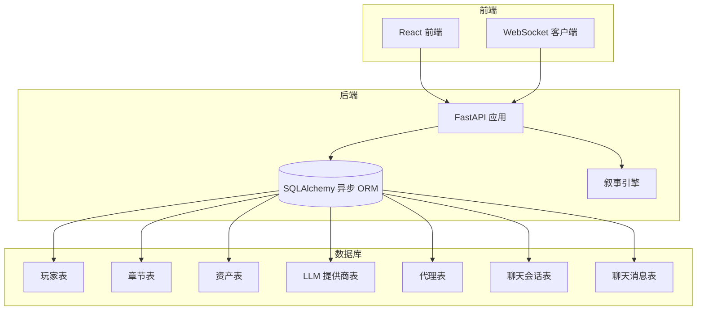

**图表来源**
- [backend/main.py](file://backend/main.py#L83-L98)
- [backend/models.py](file://backend/models.py#L9-L56)

**章节来源**
- [backend/main.py](file://backend/main.py#L1-L173)
- [backend/models.py](file://backend/models.py#L1-L122)

## 核心组件

### Player 类设计

Player 类是整个玩家数据模型的核心，采用 UUID 作为主键，支持完整的 CRUD 操作和状态管理。

#### 字段定义与数据类型

| 字段名 | 数据类型 | 约束条件 | 默认值 | 描述 |
|--------|----------|----------|--------|------|
| id | String(36) | 主键, 唯一, 索引 | 自动生成 | UUID 主键 |
| username | String | 唯一, 索引 | 无 | 玩家用户名 |
| created_at | DateTime | 服务器默认时间 | 当前时间 | 创建时间戳 |
| current_chapter | Integer | 无 | 1 | 当前章节编号 |
| personality_profile | JSON | 无 | {} | 个性特征分析 |
| inventory | JSON | 无 | [] | 物品清单 |
| relationships | JSON | 无 | {} | NPC 关系映射 |

#### 约束规则

1. **唯一性约束**
   - username 字段具有唯一性约束
   - id 字段为主键约束

2. **索引策略**
   - 所有主要字段都建立了索引以优化查询性能
   - UUID 字段使用字符串索引而非二进制索引

3. **默认值策略**
   - 使用工厂函数生成 UUID
   - 章节号默认为 1
   - JSON 字段使用空结构体作为默认值

**章节来源**
- [backend/models.py](file://backend/models.py#L9-L23)
- [backend/migrations/versions/a3b8c9d0e1f2_convert_ids_to_uuid.py](file://backend/migrations/versions/a3b8c9d0e1f2_convert_ids_to_uuid.py#L78-L91)

## 架构概览

系统采用分层架构设计，各组件职责明确，通过清晰的接口进行交互。

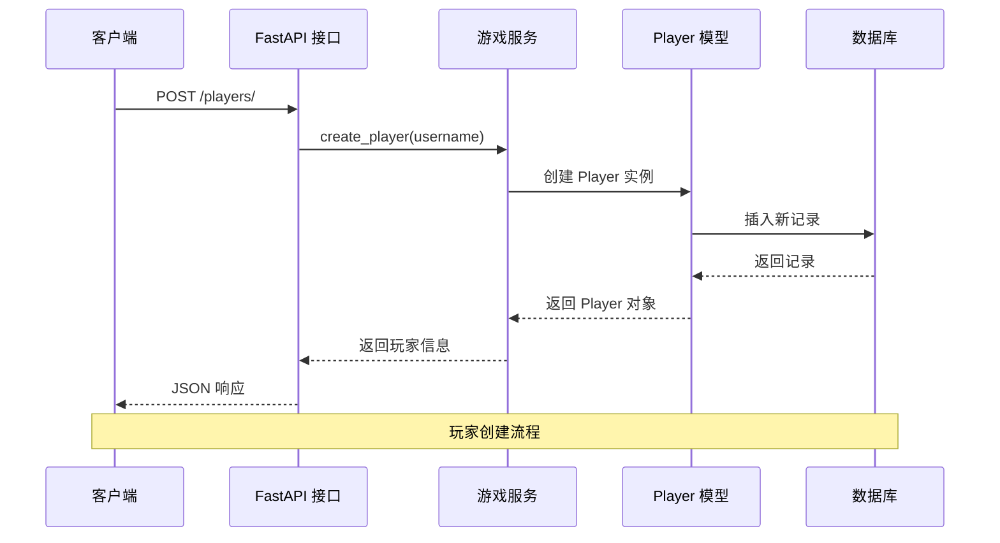

**图表来源**
- [backend/main.py](file://backend/main.py#L138-L146)
- [backend/services.py](file://backend/services.py#L12-L17)

**章节来源**
- [backend/services.py](file://backend/services.py#L8-L66)
- [backend/main.py](file://backend/main.py#L138-L146)

## 详细组件分析

### 玩家状态管理系统

#### current_chapter 字段设计

current_chapter 字段用于跟踪玩家当前所在的故事章节，采用整数类型确保数值比较的准确性。

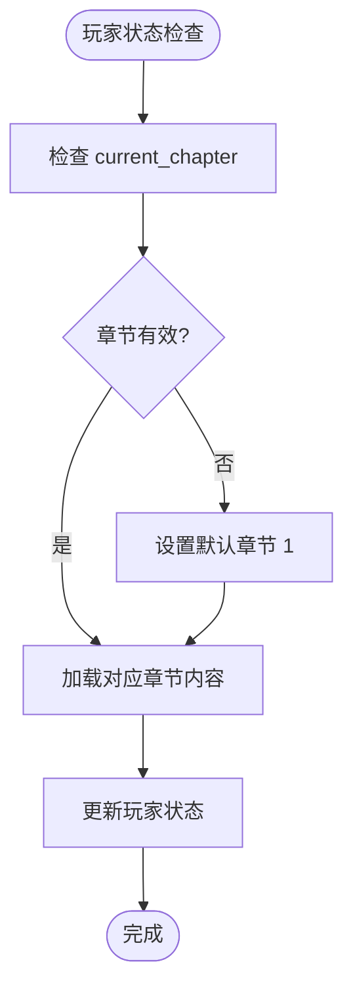

**图表来源**
- [backend/models.py](file://backend/models.py#L17-L17)

#### personality_profile 数据结构

personality_profile 采用 JSON 格式存储玩家的个性特征分析，支持动态扩展。

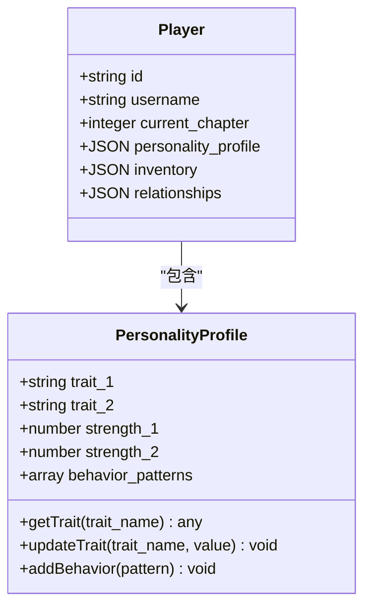

**图表来源**
- [backend/models.py](file://backend/models.py#L18-L18)

#### inventory 系统设计

inventory 字段使用数组格式存储玩家拥有的物品清单，支持动态添加和移除物品。

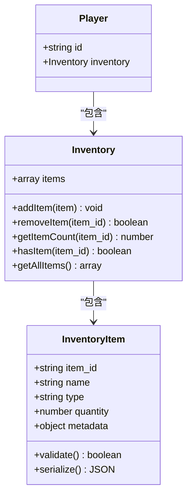

**图表来源**
- [backend/models.py](file://backend/models.py#L19-L19)

### NPC 关系管理系统

relationships 字段采用嵌套 JSON 结构管理玩家与 NPC 的复杂关系。

#### 数据结构设计

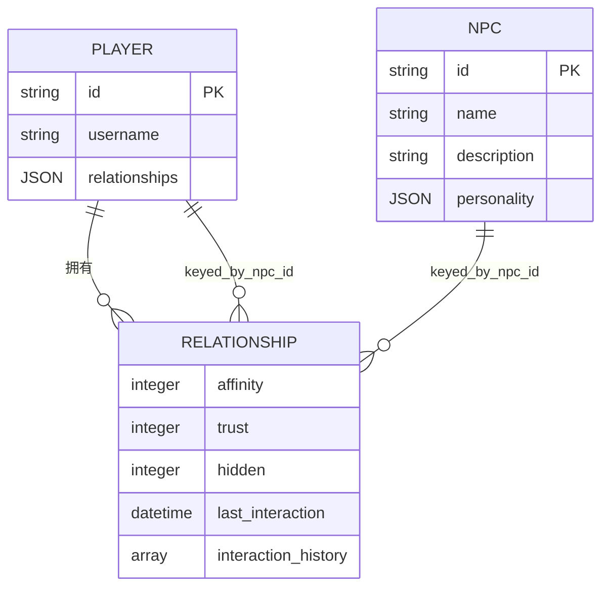

**图表来源**
- [backend/models.py](file://backend/models.py#L21-L22)

#### 关系操作方法

系统提供了多种关系管理操作：

1. **关系建立**：通过添加新的 NPC ID 到 relationships 字典
2. **关系更新**：调整亲和度、信任度和隐藏值
3. **关系查询**：根据 NPC ID 获取特定关系状态
4. **关系分析**：计算整体关系趋势和影响

### UUID 主键生成机制

系统采用 UUID v4 作为所有实体的主键，确保分布式环境下的唯一性。

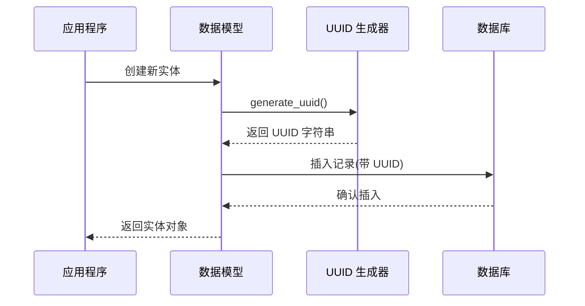

**图表来源**
- [backend/models.py](file://backend/models.py#L6-L7)
- [backend/migrations/versions/a3b8c9d0e1f2_convert_ids_to_uuid.py](file://backend/migrations/versions/a3b8c9d0e1f2_convert_ids_to_uuid.py#L33-L33)

#### 唯一性约束

- 所有 UUID 字段都具有唯一性约束
- username 字段具有唯一性约束
- 外键关系通过 UUID 进行关联

#### 索引策略

系统为所有重要字段建立了索引以优化查询性能：

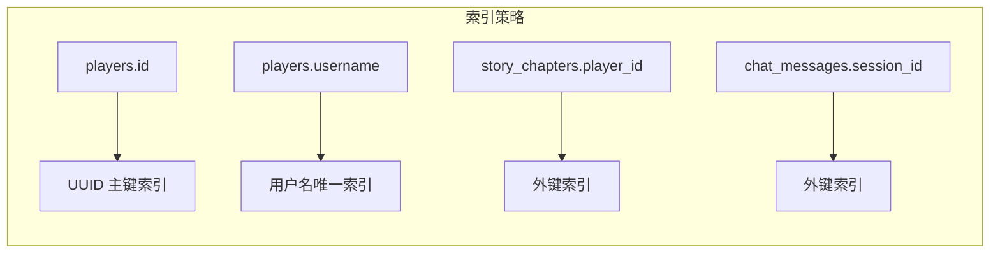

**图表来源**
- [backend/migrations/versions/a3b8c9d0e1f2_convert_ids_to_uuid.py](file://backend/migrations/versions/a3b8c9d0e1f2_convert_ids_to_uuid.py#L88-L90)
- [backend/migrations/versions/a3b8c9d0e1f2_convert_ids_to_uuid.py](file://backend/migrations/versions/a3b8c9d0e1f2_convert_ids_to_uuid.py#L145-L147)

### 增删改查操作示例

#### 创建玩家

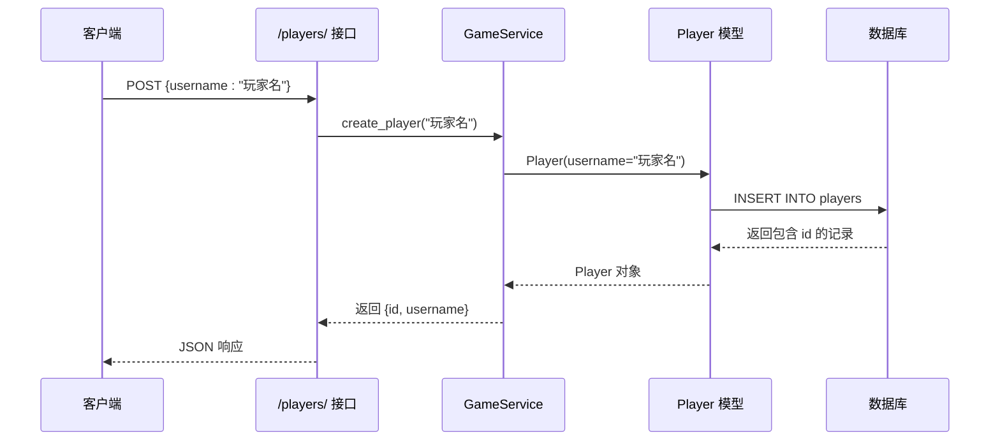

**图表来源**
- [backend/main.py](file://backend/main.py#L138-L146)
- [backend/services.py](file://backend/services.py#L12-L17)

#### 查询玩家

系统支持多种查询方式：

1. **按 ID 查询**：通过 UUID 精确匹配
2. **按用户名查询**：通过唯一用户名查找
3. **列表查询**：支持分页和过滤

#### 更新玩家状态

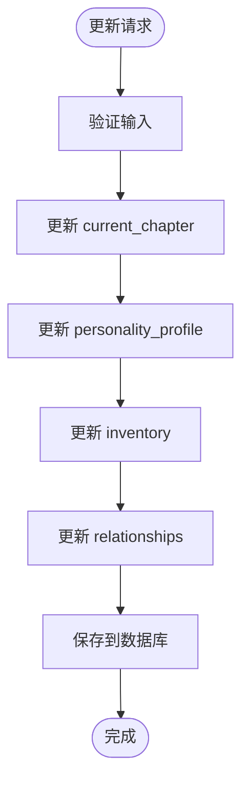

**图表来源**
- [backend/services.py](file://backend/services.py#L61-L65)

#### 删除玩家

删除操作遵循级联删除策略，确保数据完整性：

1. 删除玩家的所有章节记录
2. 删除相关的聊天会话和消息
3. 清理代理和提供商关联

### 业务逻辑实现

#### 叙事引擎集成

系统集成了强大的叙事引擎，支持动态故事生成和 NPC 关系管理。

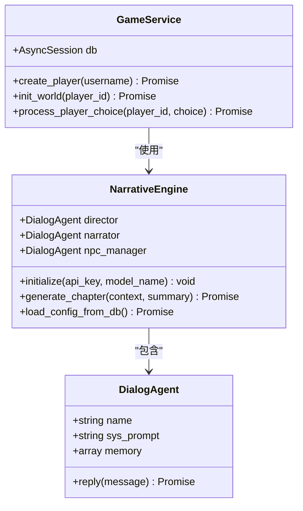

**图表来源**
- [backend/agents.py](file://backend/agents.py#L43-L196)
- [backend/services.py](file://backend/services.py#L8-L66)

#### 实时通信支持

前端通过 WebSocket 与后端建立实时连接，支持游戏过程中的即时交互。

**章节来源**
- [frontend/src/hooks/useSocket.ts](file://frontend/src/hooks/useSocket.ts#L3-L42)

## 依赖关系分析

系统采用模块化设计，各组件之间通过清晰的接口进行交互。

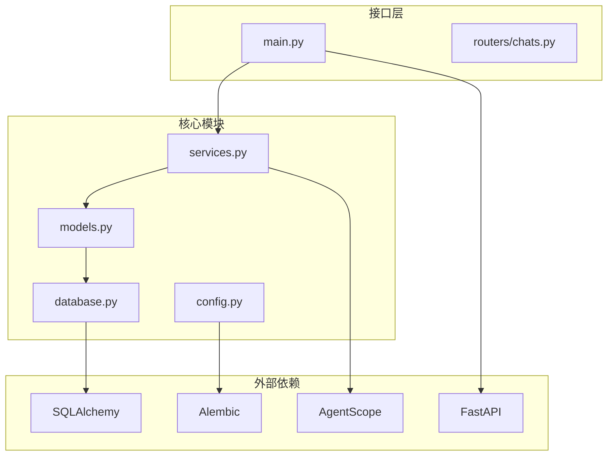

**图表来源**
- [backend/main.py](file://backend/main.py#L37-L42)
- [backend/models.py](file://backend/models.py#L1-L4)

### 数据验证规则

系统实现了多层次的数据验证机制：

1. **数据库层面**
   - 唯一性约束防止重复数据
   - 外键约束确保引用完整性
   - 类型约束保证数据一致性

2. **应用层面**
   - Pydantic 模型验证请求参数
   - 业务逻辑验证确保数据合理性
   - 异常处理机制捕获和处理错误

3. **前端层面**
   - 表单验证防止无效输入
   - 实时反馈改善用户体验

### 安全考虑事项

1. **API 安全**
   - CORS 配置限制跨域访问
   - WebSocket 连接验证
   - 请求频率限制

2. **数据安全**
   - 敏感信息加密存储
   - 访问权限控制
   - 数据备份和恢复

3. **系统安全**
   - 输入验证和清理
   - 错误信息脱敏
   - 日志审计

**章节来源**
- [backend/main.py](file://backend/main.py#L85-L91)
- [backend/config.py](file://backend/config.py#L18-L29)

## 性能考虑

### 数据库优化

1. **索引策略**
   - 为常用查询字段建立索引
   - 使用复合索引优化复杂查询
   - 定期分析查询执行计划

2. **连接池管理**
   - 异步连接池提高并发性能
   - 连接超时和重连机制
   - 连接池大小调优

3. **查询优化**
   - 分页查询避免大数据量传输
   - 条件查询使用索引字段
   - 预加载关联数据减少 N+1 查询

### 缓存策略

1. **内存缓存**
   - 热点数据缓存
   - 缓存失效策略
   - 缓存一致性保证

2. **数据库缓存**
   - 查询结果缓存
   - 结果集分页缓存
   - 缓存预热机制

### 异步处理

系统广泛采用异步编程模式：

1. **异步数据库操作**
   - 非阻塞 I/O 提高吞吐量
   - 连接池异步管理
   - 事务异步处理

2. **异步任务队列**
   - 背景任务处理
   - 任务优先级管理
   - 任务重试机制

## 故障排除指南

### 常见问题诊断

1. **数据库连接问题**
   - 检查连接字符串配置
   - 验证数据库服务状态
   - 查看连接池配置

2. **UUID 生成问题**
   - 验证 UUID 生成器状态
   - 检查数据库约束冲突
   - 确认迁移脚本执行

3. **WebSocket 连接问题**
   - 检查网络连接状态
   - 验证端点路径正确性
   - 查看浏览器开发者工具

### 调试技巧

1. **日志分析**
   - 启用详细日志级别
   - 分析请求响应时间
   - 监控异常堆栈信息

2. **性能监控**
   - 监控数据库查询性能
   - 分析 API 响应时间
   - 跟踪内存使用情况

3. **数据验证**
   - 验证数据完整性
   - 检查约束冲突
   - 确认数据一致性

**章节来源**
- [backend/main.py](file://backend/main.py#L14-L28)
- [backend/database.py](file://backend/database.py#L8-L23)

## 结论

本玩家数据模型设计充分考虑了无限叙事游戏的特殊需求，采用了现代化的技术栈和最佳实践。通过 UUID 主键、JSON 格式存储和灵活的关系管理，系统能够支持复杂的叙事场景和动态的游戏体验。

关键优势包括：

1. **可扩展性**：JSON 字段支持动态扩展，适应不断变化的游戏需求
2. **性能优化**：异步架构和索引策略确保高并发场景下的响应速度
3. **数据完整性**：多层次约束和验证机制保证数据质量
4. **安全性**：完善的访问控制和数据保护措施
5. **可维护性**：模块化设计和清晰的接口便于后续开发和维护

该模型为构建高质量的无限叙事游戏奠定了坚实的基础，能够支持复杂的故事情节发展和丰富的玩家互动体验。