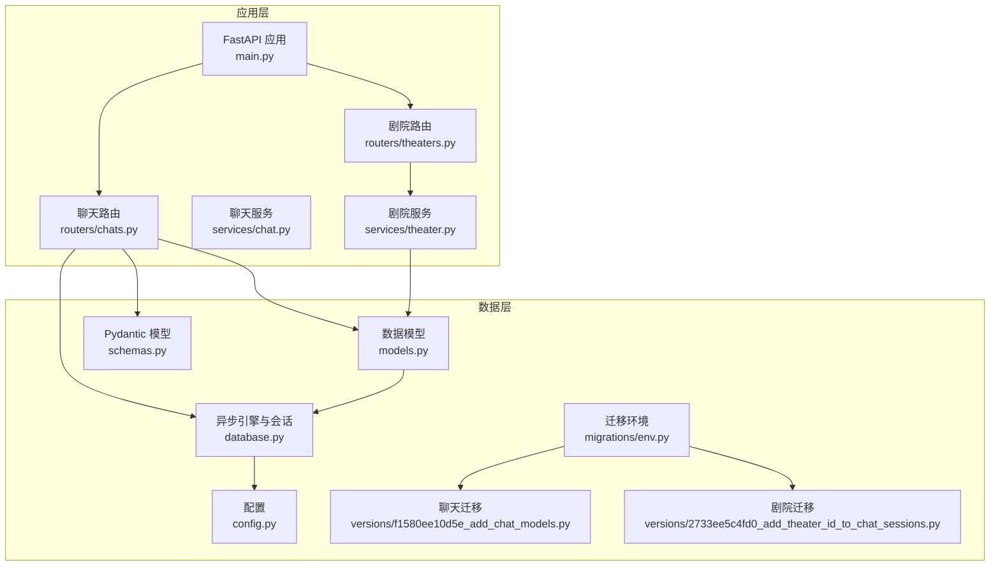
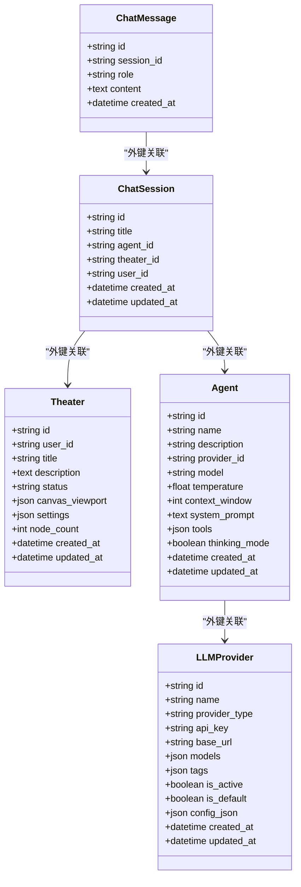
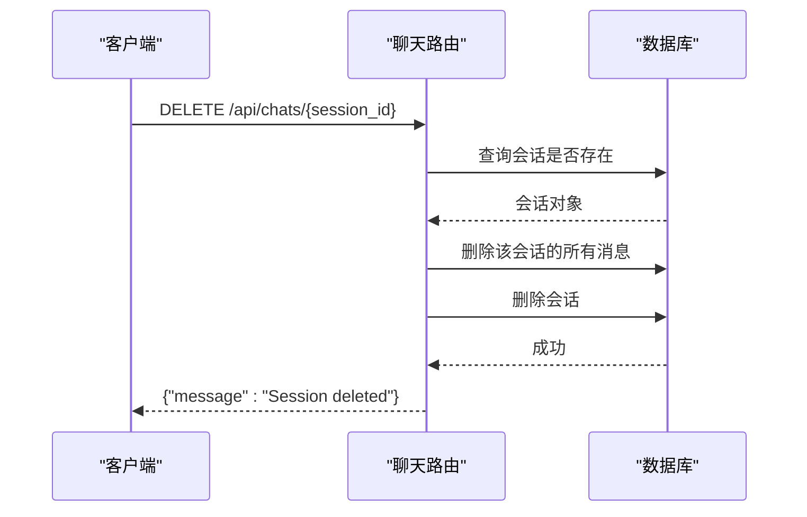
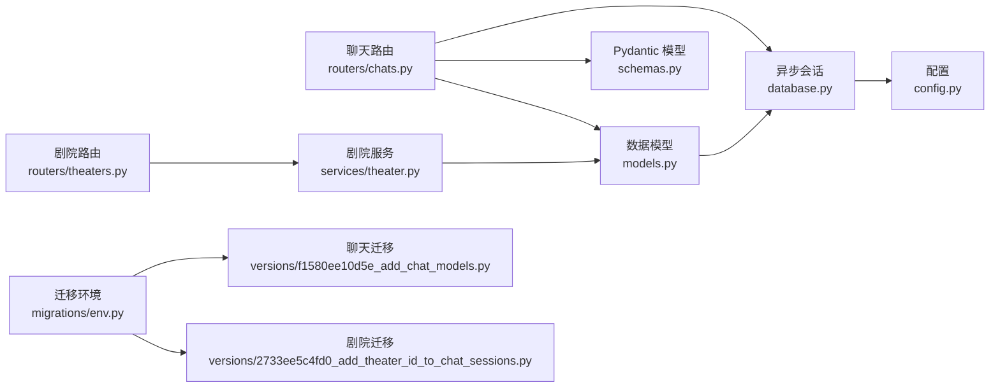

# 聊天系统数据模型

<cite>
**本文引用的文件**
- [models.py](file://backend/models.py)
- [schemas.py](file://backend/schemas.py)
- [routers/chats.py](file://backend/routers/chats.py)
- [routers/theaters.py](file://backend/routers/theaters.py)
- [services/theater.py](file://backend/services/theater.py)
- [database.py](file://backend/database.py)
- [config.py](file://backend/config.py)
- [migrations/versions/f1580ee10d5e_add_chat_models.py](file://backend/migrations/versions/f1580ee10d5e_add_chat_models.py)
- [migrations/versions/2733ee5c4fd0_add_theater_id_to_chat_sessions.py](file://backend/migrations/versions/2733ee5c4fd0_add_theater_id_to_chat_sessions.py)
- [migrations/env.py](file://backend/migrations/env.py)
- [main.py](file://backend/main.py)
- [tasks.py](file://backend/tasks.py)
</cite>

## 更新摘要
**变更内容**
- 新增剧院关联功能：在chat_sessions表中添加theater_id字段
- 增强API层一致性：支持剧院化的聊天会话管理
- 更新数据模型和路由：实现剧院与聊天会话的关联关系
- 完善剧院系统集成：支持画布工具和剧院上下文的聊天功能

## 目录
1. [简介](#简介)
2. [项目结构](#项目结构)
3. [核心组件](#核心组件)
4. [架构总览](#架构总览)
5. [详细组件分析](#详细组件分析)
6. [剧院化聊天功能](#剧院化聊天功能)
7. [依赖分析](#依赖分析)
8. [性能考虑](#性能考虑)
9. [故障排查指南](#故障排查指南)
10. [结论](#结论)
11. [附录](#附录)

## 简介
本文件聚焦聊天系统数据模型，系统性梳理 ChatSession 与 ChatMessage 的关联关系、数据流转与持久化策略，并对会话标题管理、代理关联、时间戳记录机制进行深入说明；同时解释消息角色（role）的分类体系与内容存储策略，明确会话与代理的外键关联及消息的级联删除机制；最后给出聊天历史的持久化存储、检索优化与隐私保护建议，并提供扩展性设计与多用户并发访问的解决方案。

**更新** 新增剧院化聊天功能，支持将聊天会话与剧院（Theater）关联，实现画布工具集成和剧院上下文的智能体协作。

## 项目结构
后端采用 FastAPI + SQLAlchemy Async 异步 ORM 架构，数据库迁移使用 Alembic。聊天相关的核心文件包括：
- 数据模型：backend/models.py
- Pydantic 模型：backend/schemas.py
- 聊天路由接口：backend/routers/chats.py
- 剧院路由接口：backend/routers/theaters.py
- 剧院服务：backend/services/theater.py
- 数据库引擎与会话：backend/database.py
- 配置：backend/config.py
- 迁移脚本：backend/migrations/versions/f1580ee10d5e_add_chat_models.py 和 backend/migrations/versions/2733ee5c4fd0_add_theater_id_to_chat_sessions.py
- Alembic 环境：backend/migrations/env.py
- 应用入口与生命周期：backend/main.py
- 后台任务（章节生成等）：backend/tasks.py

**图表来源**
- [main.py:83-97](file://backend/main.py#L83-L97)
- [routers/chats.py:1-20](file://backend/routers/chats.py#L1-L20)
- [routers/theaters.py:1-20](file://backend/routers/theaters.py#L1-L20)
- [models.py:80-122](file://backend/models.py#L80-L122)
- [schemas.py:75-102](file://backend/schemas.py#L75-L102)
- [database.py:1-31](file://backend/database.py#L1-L31)
- [config.py:1-34](file://backend/config.py#L1-L34)
- [migrations/env.py:12-32](file://backend/migrations/env.py#L12-L32)
- [migrations/versions/f1580ee10d5e_add_chat_models.py:21-48](file://backend/migrations/versions/f1580ee10d5e_add_chat_models.py#L21-L48)
- [migrations/versions/2733ee5c4fd0_add_theater_id_to_chat_sessions.py:21-39](file://backend/migrations/versions/2733ee5c4fd0_add_theater_id_to_chat_sessions.py#L21-L39)

**章节来源**
- [main.py:83-97](file://backend/main.py#L83-L97)
- [routers/chats.py:1-20](file://backend/routers/chats.py#L1-L20)
- [routers/theaters.py:1-20](file://backend/routers/theaters.py#L1-L20)
- [models.py:80-122](file://backend/models.py#L80-L122)
- [schemas.py:75-102](file://backend/schemas.py#L75-L102)
- [database.py:1-31](file://backend/database.py#L1-L31)
- [config.py:1-34](file://backend/config.py#L1-L34)
- [migrations/env.py:12-32](file://backend/migrations/env.py#L12-L32)
- [migrations/versions/f1580ee10d5e_add_chat_models.py:21-48](file://backend/migrations/versions/f1580ee10d5e_add_chat_models.py#L21-L48)
- [migrations/versions/2733ee5c4fd0_add_theater_id_to_chat_sessions.py:21-39](file://backend/migrations/versions/2733ee5c4fd0_add_theater_id_to_chat_sessions.py#L21-L39)

## 核心组件
- ChatSession：代表一次对话会话，包含标题、所属代理、所属剧院、创建与更新时间戳。
- ChatMessage：代表单条消息，包含角色（user/assistant/system）、内容与创建时间戳。
- Theater：代表用户创建的创意项目，包含剧院基本信息和画布状态。
- Agent：代理实体，关联 LLMProvider 并携带模型参数（温度、上下文窗口、system_prompt 等）。
- LLMProvider：提供方实体，定义可用模型列表、标签与启用状态等。
- Pydantic 模型：用于请求/响应的数据校验与序列化。

**章节来源**
- [models.py:80-122](file://backend/models.py#L80-L122)
- [models.py:75-91](file://backend/models.py#L75-L91)
- [schemas.py:75-102](file://backend/schemas.py#L75-L102)
- [schemas.py:302-340](file://backend/schemas.py#L302-L340)

## 架构总览
聊天系统围绕"会话-消息-剧院-代理-提供方"五元组展开，数据通过异步 ORM 在 FastAPI 路由中被读写，迁移脚本确保数据库结构演进一致。新增的剧院关联功能使得聊天会话可以与具体的创意项目绑定，支持画布工具和剧院上下文的智能体协作。

**图表来源**
- [models.py:80-122](file://backend/models.py#L80-L122)
- [models.py:172-183](file://backend/models.py#L172-L183)
- [models.py:75-91](file://backend/models.py#L75-L91)

## 详细组件分析

### 1) 数据模型与表结构
- ChatSession
  - 主键：UUID id
  - 字段：title（默认"New Chat"）、agent_id（外键到 agents.id）、theater_id（外键到 theaters.id，可为空）、user_id（用户或管理员ID）
  - 时间戳：created_at（服务器默认值）、updated_at（更新时自动刷新）
- ChatMessage
  - 主键：UUID id
  - 字段：session_id（外键到 chat_sessions.id）、role（user/assistant/system）、content（文本）
  - 时间戳：created_at（服务器默认值）
- Theater
  - 主键：UUID id
  - 字段：user_id（外键到 users.id）、title、description、status、canvas_viewport、settings、node_count
  - 时间戳：created_at、updated_at
- 外键约束
  - chat_sessions(agent_id) → agents(id)
  - chat_sessions(theater_id) → theaters(id)
  - chat_messages(session_id) → chat_sessions(id)
- 索引
  - chat_sessions(id)、chat_sessions(theater_id)
  - chat_messages(id)、chat_messages(session_id)

**章节来源**
- [models.py:172-183](file://backend/models.py#L172-L183)
- [models.py:185-194](file://backend/models.py#L185-L194)
- [models.py:75-91](file://backend/models.py#L75-L91)
- [migrations/versions/f1580ee10d5e_add_chat_models.py:23-46](file://backend/migrations/versions/f1580ee10d5e_add_chat_models.py#L23-L46)
- [migrations/versions/2733ee5c4fd0_add_theater_id_to_chat_sessions.py:21-39](file://backend/migrations/versions/2733ee5c4fd0_add_theater_id_to_chat_sessions.py#L21-L39)

### 2) 会话标题管理
- 默认标题：新建会话时若未指定标题，默认值为"New Chat"
- 更新策略：发送消息流程中，会在保存助手回复后显式更新会话的 updated_at 字段，从而反映最新交互时间

**章节来源**
- [models.py](file://backend/models.py#L176)
- [routers/chats.py:246-252](file://backend/routers/chats.py#L246-L252)

### 3) 代理关联与上下文准备
- 会话与代理：ChatSession.agent_id 外键指向 Agent.id
- 会话与剧院：ChatSession.theater_id 外键指向 Theater.id，支持剧院上下文
- 上下文准备：发送消息前，从数据库加载 Agent 及其 LLMProvider，拼装历史消息（含可选 system_prompt），并按角色过滤/回退为合法角色
- 角色合法性：若历史中出现非标准角色，则回退为"user"

**章节来源**
- [models.py:177-179](file://backend/models.py#L177-L179)
- [routers/chats.py:84-109](file://backend/routers/chats.py#L84-L109)
- [routers/chats.py:123-127](file://backend/routers/chats.py#L123-L127)

### 4) 时间戳记录机制
- 创建与更新
  - ChatSession：created_at（服务器默认）、updated_at（更新时自动）
  - ChatMessage：created_at（服务器默认）
- 会话更新：发送消息流程在保存助手回复后，显式刷新会话 updated_at，确保会话列表按最近活动排序

**章节来源**
- [models.py:181-182](file://backend/models.py#L181-L182)
- [models.py](file://backend/models.py#L193)
- [routers/chats.py:246-252](file://backend/routers/chats.py#L246-L252)

### 5) 消息角色（role）分类体系与内容存储
- 角色分类：user、assistant、system
- 存储策略：content 使用 Text 类型，支持长文本；历史消息按 created_at 升序排列，便于流式输出与上下文拼接
- 安全与健壮性：当历史中出现非法角色时，回退为"user"，避免上游调用错误

**章节来源**
- [models.py](file://backend/models.py#L190)
- [routers/chats.py:123-127](file://backend/routers/chats.py#L123-L127)
- [routers/chats.py:63-70](file://backend/routers/chats.py#L63-L70)

### 6) 外键关联与消息级联删除机制
- 外键关系
  - chat_sessions(agent_id) → agents(id)
  - chat_sessions(theater_id) → theaters(id)
  - chat_messages(session_id) → chat_sessions(id)
- 级联删除
  - 数据库层面未配置级联删除
  - 删除会话时，路由中显式先删除该会话下的所有消息，再删除会话本身，确保数据一致性

**图表来源**
- [routers/chats.py:715-733](file://backend/routers/chats.py#L715-L733)

**章节来源**
- [routers/chats.py:727-733](file://backend/routers/chats.py#L727-L733)

### 7) 聊天历史的持久化存储与检索优化
- 持久化存储
  - 用户消息与助手消息均以 ChatMessage 形式落库，包含完整角色与内容
- 检索优化
  - 历史查询按 created_at 升序，保证对话顺序
  - chat_messages(session_id) 建有索引，提升按会话检索效率
- 上下文窗口控制
  - Agent.context_window 用于限制有效上下文长度，结合实际实现可控制历史截断策略

**章节来源**
- [routers/chats.py:99-104](file://backend/routers/chats.py#L99-L104)
- [routers/chats.py:63-70](file://backend/routers/chats.py#L63-L70)
- [migrations/versions/f1580ee10d5e_add_chat_models.py:44-46](file://backend/migrations/versions/f1580ee10d5e_add_chat_models.py#L44-L46)
- [models.py](file://backend/models.py#L195)

### 8) 隐私保护措施
- 敏感字段
  - LLMProvider.api_key 当前为明文存储，建议在生产环境中引入加密存储或密钥管理服务
- 内容最小化
  - 历史消息仅存储必要字段，避免冗余敏感信息
- 传输安全
  - 建议在网关层启用 TLS，确保 API 传输安全

**章节来源**
- [models.py](file://backend/models.py#L65)
- [routers/chats.py:145-209](file://backend/routers/chats.py#L145-L209)

### 9) 扩展性设计与多用户并发访问
- 扩展性
  - 新增角色：可在 ChatMessage.role 中扩展更多角色类型，并在历史拼装时增加映射规则
  - 新增字段：如消息标记、来源渠道等，可在 ChatMessage 表追加列并同步迁移
  - 多代理：通过 Agent 与 LLMProvider 解耦，支持多提供方与多模型并行
  - 剧院扩展：新增的剧院关联为未来的创意项目管理提供基础
- 并发访问
  - 异步 ORM：基于 SQLAlchemy Async，适合高并发 I/O 密集场景
  - 连接池：SQLite/PostgreSQL 均配置了连接池参数，提升并发稳定性
  - 流式响应：后端以 StreamingResponse 实时推送，前端以流式方式接收，降低延迟

**章节来源**
- [database.py:8-23](file://backend/database.py#L8-L23)
- [routers/chats.py:112-258](file://backend/routers/chats.py#L112-L258)

## 剧院化聊天功能

### 1) 剧院关联机制
- 剧院ID字段：ChatSession.theater_id 为可选字段，允许空值，表示普通聊天会话
- 外键约束：chat_sessions.theater_id → theaters.id，支持空值关联
- 索引优化：为 theater_id 建立索引，提升剧院查询性能

**章节来源**
- [models.py](file://backend/models.py#L179)
- [migrations/versions/2733ee5c4fd0_add_theater_id_to_chat_sessions.py:23-26](file://backend/migrations/versions/2733ee5c4fd0_add_theater_id_to_chat_sessions.py#L23-L26)

### 2) API层集成
- 会话创建：支持在创建会话时指定 theater_id 参数
- 会话查询：支持按 theater_id 过滤会话列表
- 聊天上下文：消息发送时可传入 theater_id，启用画布工具和剧院上下文

**章节来源**
- [routers/chats.py:87-107](file://backend/routers/chats.py#L87-L107)
- [routers/chats.py:110-130](file://backend/routers/chats.py#L110-L130)
- [routers/chats.py:189-238](file://backend/routers/chats.py#L189-L238)

### 3) 剧院服务集成
- 剧院API：提供剧院的创建、查询、更新、删除和画布保存功能
- 权限控制：剧院操作需要当前用户的权限验证
- 级联删除：删除剧院时会级联删除所有相关节点和边

**章节来源**
- [routers/theaters.py:20-110](file://backend/routers/theaters.py#L20-L110)
- [services/theater.py:17-102](file://backend/services/theater.py#L17-L102)

### 4) 画布工具支持
- 工具集成：当 theater_id 存在且智能体配置了目标节点类型时，启用画布工具
- 实时更新：画布工具执行后会发送 canvas_updated 事件通知前端刷新
- 上下文感知：智能体可以根据剧院上下文调整行为和输出

**章节来源**
- [routers/chats.py:491-494](file://backend/routers/chats.py#L491-L494)
- [routers/chats.py:590-594](file://backend/routers/chats.py#L590-L594)

## 依赖分析
- 组件耦合
  - 路由层依赖模型层与数据库会话
  - 模型层依赖 SQLAlchemy 异步引擎
  - 迁移脚本与 Alembic 环境共同维护结构演进
  - 剧院服务依赖剧院模型和数据库会话
- 外部依赖
  - OpenAI/DashScope 提供方类型在路由中识别并调用，需确保对应 SDK 已安装

**图表来源**
- [routers/chats.py:1-20](file://backend/routers/chats.py#L1-L20)
- [routers/theaters.py:1-20](file://backend/routers/theaters.py#L1-L20)
- [models.py:1-10](file://backend/models.py#L1-L10)
- [schemas.py:1-10](file://backend/schemas.py#L1-L10)
- [database.py:1-31](file://backend/database.py#L1-L31)
- [config.py:1-34](file://backend/config.py#L1-L34)
- [migrations/env.py:12-32](file://backend/migrations/env.py#L12-L32)
- [migrations/versions/f1580ee10d5e_add_chat_models.py:21-48](file://backend/migrations/versions/f1580ee10d5e_add_chat_models.py#L21-L48)
- [migrations/versions/2733ee5c4fd0_add_theater_id_to_chat_sessions.py:21-39](file://backend/migrations/versions/2733ee5c4fd0_add_theater_id_to_chat_sessions.py#L21-L39)

**章节来源**
- [routers/chats.py:1-20](file://backend/routers/chats.py#L1-L20)
- [routers/theaters.py:1-20](file://backend/routers/theaters.py#L1-L20)
- [models.py:1-10](file://backend/models.py#L1-L10)
- [schemas.py:1-10](file://backend/schemas.py#L1-L10)
- [database.py:1-31](file://backend/database.py#L1-L31)
- [config.py:1-34](file://backend/config.py#L1-L34)
- [migrations/env.py:12-32](file://backend/migrations/env.py#L12-L32)
- [migrations/versions/f1580ee10d5e_add_chat_models.py:21-48](file://backend/migrations/versions/f1580ee10d5e_add_chat_models.py#L21-L48)
- [migrations/versions/2733ee5c4fd0_add_theater_id_to_chat_sessions.py:21-39](file://backend/migrations/versions/2733ee5c4fd0_add_theater_id_to_chat_sessions.py#L21-L39)

## 性能考虑
- I/O 密集优化
  - 使用异步 ORM 与连接池，避免阻塞
- 查询优化
  - chat_messages(session_id) 建有索引，按时间升序查询历史
  - 新增的 theater_id 索引优化剧院查询
- 上下文控制
  - 结合 Agent.context_window 控制历史长度，避免超出上下文窗口导致的性能与成本问题
- 流式输出
  - 后端边生成边输出，前端实时渲染，降低等待时间
- 剧院查询优化
  - 支持按剧院ID过滤会话，减少不必要的数据扫描

**章节来源**
- [database.py:8-23](file://backend/database.py#L8-L23)
- [migrations/versions/f1580ee10d5e_add_chat_models.py:44-46](file://backend/migrations/versions/f1580ee10d5e_add_chat_models.py#L44-L46)
- [migrations/versions/2733ee5c4fd0_add_theater_id_to_chat_sessions.py:24-26](file://backend/migrations/versions/2733ee5c4fd0_add_theater_id_to_chat_sessions.py#L24-L26)
- [routers/chats.py:129-131](file://backend/routers/chats.py#L129-L131)

## 故障排查指南
- 会话不存在
  - 现象：创建/获取/删除会话时返回 404
  - 排查：确认 session_id 是否正确，以及会话是否已被删除
- 代理不可用
  - 现象：发送消息时报错"Agent provider is not available"
  - 排查：检查 Agent.provider_id 对应的 LLMProvider.is_active 状态
- 角色异常
  - 现象：历史消息角色非法导致回退为"user"
  - 排查：检查历史消息 role 字段，确保只使用 user/assistant/system
- 删除失败
  - 现象：删除会话后仍有残留消息
  - 排查：确认路由中已先删除消息再删除会话
- 剧院关联问题
  - 现象：会话无法关联到剧院或剧院查询异常
  - 排查：确认 theater_id 格式正确（UUID），剧院存在且属于当前用户

**章节来源**
- [routers/chats.py:27-28](file://backend/routers/chats.py#L27-L28)
- [routers/chats.py:81-82](file://backend/routers/chats.py#L81-L82)
- [routers/chats.py:109-110](file://backend/routers/chats.py#L109-L110)
- [routers/chats.py:125-127](file://backend/routers/chats.py#L125-L127)
- [routers/chats.py:267-274](file://backend/routers/chats.py#L267-L274)
- [routers/theaters.py:33-41](file://backend/routers/theaters.py#L33-L41)

## 结论
本聊天系统以简洁清晰的数据模型支撑完整的会话与消息生命周期：会话标题默认化、代理参数驱动上下文、严格的角色与时间戳管理、完善的删除与索引策略。新增的剧院关联功能进一步增强了系统的扩展性，支持创意项目的剧院化管理和画布工具集成。配合异步 ORM 与流式响应，系统具备良好的并发性能与可扩展性。建议在生产环境中强化密钥与敏感信息的加密存储，并根据业务增长持续优化上下文截断与缓存策略。

## 附录
- 数据库初始化与迁移
  - 应用启动时执行 Alembic 升级至最新版本，确保表结构与外键约束生效
  - 新增的剧院迁移脚本确保 chat_sessions 表具有 theater_id 字段
- 后台任务
  - 章节预生成与资源生成等任务可作为扩展点，与聊天历史解耦运行
- 剧院系统
  - 剧院服务提供完整的 CRUD 操作和画布管理功能
  - 支持剧院级别的权限控制和数据隔离

**章节来源**
- [main.py:45-81](file://backend/main.py#L45-L81)
- [migrations/env.py:74-98](file://backend/migrations/env.py#L74-L98)
- [tasks.py:7-55](file://backend/tasks.py#L7-L55)
- [services/theater.py:17-31](file://backend/services/theater.py#L17-L31)