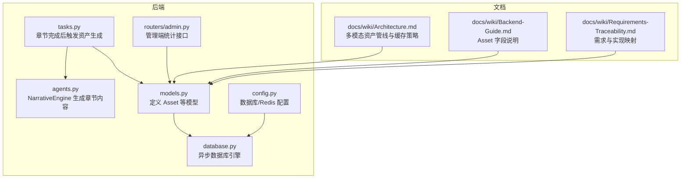
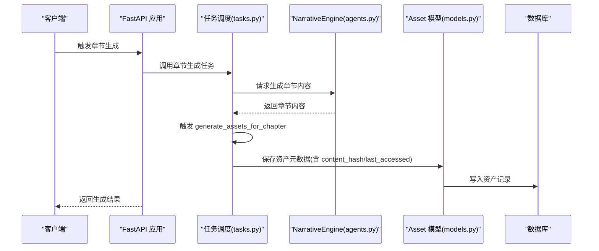
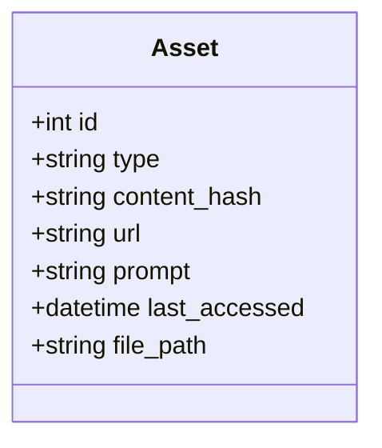
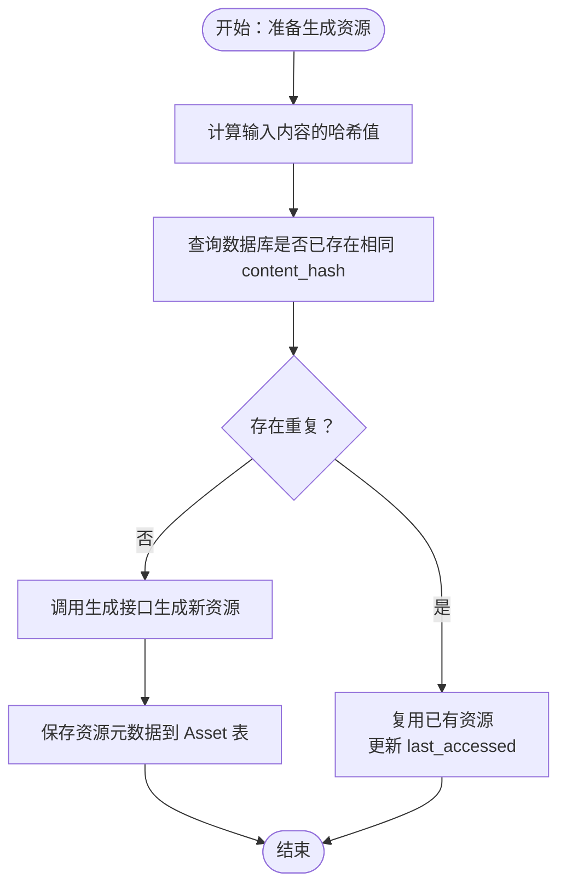
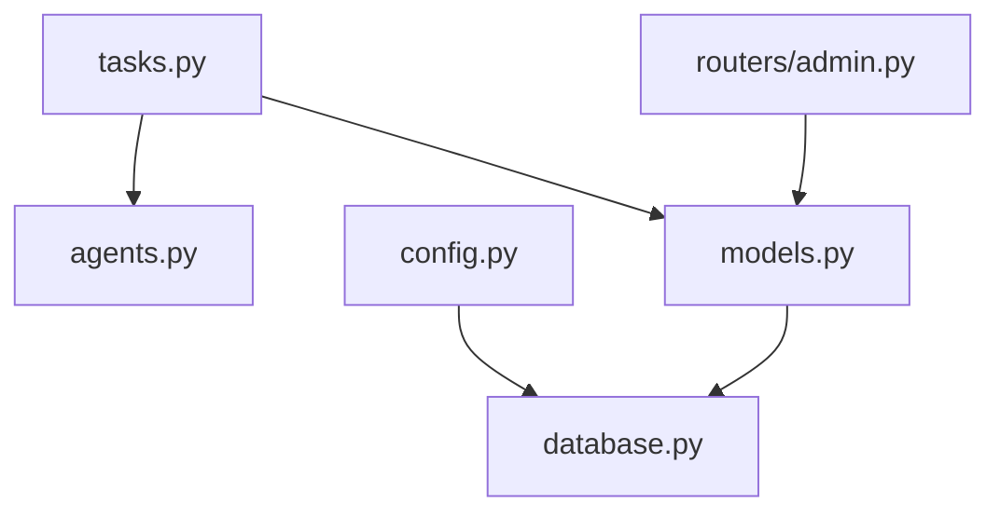

# 资源资产管理模型

<cite>
**本文档引用的文件**
- [backend/models.py](file://backend/models.py)
- [backend/schemas.py](file://backend/schemas.py)
- [backend/tas
ks.py](file://backend/tasks.py)
- [backend/agents.py](file://backend/agents.py)
- [backend/main.py](file://backend/main.py)
- [backend/config.py](file://backend/config.py)
- [backend/database.py](file://backend/database.py)
- [backend/routers/admin.py](file://backend/routers/admin.py)
- [docs/wiki/Architecture.md](file://docs/wiki/Architecture.md)
- [docs/wiki/Backend-Guide.md](file://docs/wiki/Backend-Guide.md)
- [docs/wiki/Requirements-Traceability.md](file://docs/wiki/Requirements-Traceability.md)
</cite>

## 目录
1. [简介](#简介)
2. [项目结构](#项目结构)
3. [核心组件](#核心组件)
4. [架构总览](#架构总览)
5. [详细组件分析](#详细组件分析)
6. [依赖关系分析](#依赖关系分析)
7. [性能考量](#性能考量)
8. [故障排查指南](#故障排查指南)
9. [结论](#结论)
10. [附录](#附录)

## 简介
本文件围绕资源资产管理模型进行系统化文档化，重点阐释 Asset 类的字段定义、多模态资源类型支持、内容哈希去重机制与 MD5 应用、不同资源类型的存储策略与 URL 管理、缓存管理字段 last_accessed 的设计意图、文件路径 file_path 的作用，以及资源的生命周期管理、访问统计与清理策略。同时提供资源上传、下载与缓存优化的最佳实践建议。

## 项目结构
资源资产管理模型位于后端模型层，配合任务调度、AI 引擎与前端管理界面共同构成完整的多模态资产流水线。关键文件与职责如下：
- 模型层：定义 Asset 表结构及字段语义
- 任务层：触发章节内容生成后的资产生成流程
- 引擎层：NarrativeEngine 负责章节内容生成，为资产生成提供上下文
- 配置层：数据库与 Redis 连接配置
- 路由层：管理端统计接口展示资产数量等信息
- 文档层：架构与后端指南明确了资产去重与缓存策略

**图表来源**
- [backend/models.py](file://backend/models.py#L45-L56)
- [backend/tasks.py](file://backend/tasks.py#L57-L61)
- [backend/agents.py](file://backend/agents.py#L154-L191)
- [backend/config.py](file://backend/config.py#L18-L19)
- [backend/database.py](file://backend/database.py#L1-L31)
- [backend/routers/admin.py](file://backend/routers/admin.py#L16-L31)
- [docs/wiki/Architecture.md](file://docs/wiki/Architecture.md#L46-L53)
- [docs/wiki/Backend-Guide.md](file://docs/wiki/Backend-Guide.md#L66-L72)
- [docs/wiki/Requirements-Traceability.md](file://docs/wiki/Requirements-Traceability.md#L14-L21)

**章节来源**
- [backend/models.py](file://backend/models.py#L45-L56)
- [backend/tasks.py](file://backend/tasks.py#L57-L61)
- [backend/agents.py](file://backend/agents.py#L154-L191)
- [backend/config.py](file://backend/config.py#L18-L19)
- [backend/database.py](file://backend/database.py#L1-L31)
- [backend/routers/admin.py](file://backend/routers/admin.py#L16-L31)
- [docs/wiki/Architecture.md](file://docs/wiki/Architecture.md#L46-L53)
- [docs/wiki/Backend-Guide.md](file://docs/wiki/Backend-Guide.md#L66-L72)
- [docs/wiki/Requirements-Traceability.md](file://docs/wiki/Requirements-Traceability.md#L14-L21)

## 核心组件
- Asset 模型：承载多模态资源的元数据与缓存管理字段
- 任务调度：章节生成完成后触发资产生成流程
- 引擎：NarrativeEngine 为资产生成提供内容上下文
- 配置：数据库与 Redis 连接配置
- 路由：管理端统计接口展示资产数量

**章节来源**
- [backend/models.py](file://backend/models.py#L45-L56)
- [backend/tasks.py](file://backend/tasks.py#L57-L61)
- [backend/agents.py](file://backend/agents.py#L154-L191)
- [backend/config.py](file://backend/config.py#L18-L19)
- [backend/routers/admin.py](file://backend/routers/admin.py#L16-L31)

## 架构总览
多模态资产管线分为“内容生成—资产生成—存储与缓存”三个阶段。章节内容由 NarrativeEngine 生成，随后触发 generate_assets_for_chapter 完成图像/音频/语音等资源的生成与入库；Asset 表通过 content_hash 实现内容去重，通过 last_accessed 支持 LRU 缓存清理策略。

**图表来源**
- [backend/main.py](file://backend/main.py#L147-L155)
- [backend/tasks.py](file://backend/tasks.py#L7-L56)
- [backend/agents.py](file://backend/agents.py#L154-L191)
- [backend/models.py](file://backend/models.py#L45-L56)

**章节来源**
- [backend/main.py](file://backend/main.py#L147-L155)
- [backend/tasks.py](file://backend/tasks.py#L7-L56)
- [backend/agents.py](file://backend/agents.py#L154-L191)
- [backend/models.py](file://backend/models.py#L45-L56)

## 详细组件分析

### Asset 类字段定义与多模态资源类型支持
- 字段概览
  - id：自增主键
  - type：资源类型，支持 image、audio、voice
  - content_hash：内容哈希（用于去重），建立索引以加速重复检测
  - url：资源访问链接
  - prompt：生成该资源的提示词
  - last_accessed：最后访问时间，用于缓存淘汰与访问统计
  - file_path：本地文件路径，便于直接读取或离线缓存

- 设计要点
  - 多模态类型统一存储：通过 type 字段区分资源形态，便于后续按类型处理与渲染
  - 去重优先：content_hash 作为唯一性判断依据，避免重复生成与存储
  - 访问统计：last_accessed 记录访问时间，结合缓存策略实现 LRU 清理
  - 文件路径：file_path 为可选字段，便于本地缓存与离线场景

**图表来源**
- [backend/models.py](file://backend/models.py#L45-L56)

**章节来源**
- [backend/models.py](file://backend/models.py#L45-L56)
- [docs/wiki/Backend-Guide.md](file://docs/wiki/Backend-Guide.md#L66-L72)

### 内容哈希（content_hash）去重机制与 MD5 算法应用
- 去重流程
  - 在生成资源前计算输入内容/提示词/参数的哈希值，写入 content_hash
  - 查询是否存在相同 content_hash 的记录，若存在则复用已有资源，避免重复生成
  - 通过数据库索引提升查询效率

- MD5 应用
  - MD5 作为常用哈希算法，具备固定长度与快速计算的特点，适合用于内容去重
  - 注意：在高并发场景下应确保哈希计算与查询的原子性，避免竞态条件导致的重复生成

**图表来源**
- [backend/models.py](file://backend/models.py#L45-L56)

**章节来源**
- [backend/models.py](file://backend/models.py#L45-L56)
- [docs/wiki/Architecture.md](file://docs/wiki/Architecture.md#L46-L53)

### 不同类型资源（image、audio、voice）的存储策略与 URL 管理
- 存储策略
  - 图像（image）：可采用 CDN 或对象存储（如 S3/MinIO），以 content_hash 作为文件名或对象键，确保去重与一致性
  - 音频（audio）：可按章节/场景分类存储，结合 content_hash 避免重复
  - 语音（voice）：可采用 TTS 生成后直接落盘或云端存储，同样以 content_hash 命名
- URL 管理
  - url 字段指向可访问的资源地址，支持本地静态服务或 CDN 分发
  - file_path 字段用于本地缓存或离线场景，便于快速读取

**章节来源**
- [backend/models.py](file://backend/models.py#L45-L56)
- [docs/wiki/Architecture.md](file://docs/wiki/Architecture.md#L46-L53)

### 缓存管理字段（last_accessed）与文件路径（file_path）设计考虑
- last_accessed
  - 用途：记录资源最后一次被访问的时间，用于 LRU 缓存淘汰策略
  - 更新策略：每次资源被读取或使用时更新该字段
  - 清理策略：定期扫描最久未访问的资源，结合磁盘空间阈值进行删除
- file_path
  - 用途：指向本地文件系统中的资源路径，便于离线访问与快速读取
  - 设计：与 url 并行维护，优先从本地缓存命中，否则回源到远端存储

**章节来源**
- [backend/models.py](file://backend/models.py#L54-L56)
- [docs/wiki/Backend-Guide.md](file://docs/wiki/Backend-Guide.md#L71-L72)

### 资源生命周期管理、访问统计与清理策略
- 生命周期
  - 创建：生成资源后写入 Asset 表，设置 content_hash、url、prompt、last_accessed、file_path
  - 使用：读取资源时更新 last_accessed
  - 清理：基于 LRU 策略定期清理长时间未访问的资源
- 访问统计
  - 可通过管理端统计接口获取资产总数，结合业务侧埋点统计各类型资源的访问次数
- 清理策略
  - 基于 last_accessed 排序，删除超过阈值未访问的资源
  - 删除前检查 file_path 与 url 的可用性，确保不会误删正在使用的资源

**章节来源**
- [backend/routers/admin.py](file://backend/routers/admin.py#L16-L31)
- [docs/wiki/Architecture.md](file://docs/wiki/Architecture.md#L46-L53)

### 资源上传、下载与缓存优化最佳实践
- 上传
  - 生成前先计算 content_hash 并查询去重，避免重复生成
  - 上传成功后写入 Asset 表，设置 url 与 file_path
- 下载
  - 优先从本地缓存（file_path）读取，未命中再回源到 url
  - 对热点资源建立预热策略，降低首次访问延迟
- 缓存优化
  - 利用 Redis 缓存热点资源元数据，减少数据库压力
  - 结合 CDN 加速静态资源分发，降低带宽成本
  - 对高频访问的资源设置较短的缓存失效时间，平衡新鲜度与性能

**章节来源**
- [docs/wiki/Architecture.md](file://docs/wiki/Architecture.md#L46-L53)
- [docs/wiki/Requirements-Traceability.md](file://docs/wiki/Requirements-Traceability.md#L14-L21)

## 依赖关系分析
- 模块耦合
  - tasks.py 依赖 agents.py 的章节内容生成能力
  - models.py 为所有业务模块提供数据模型基础
  - config.py 与 database.py 提供基础设施配置
  - routers/admin.py 依赖 models.py 进行统计查询
- 外部依赖
  - Redis：用于任务队列、会话状态与资产缓存
  - PostgreSQL：持久化存储玩家、章节与资产元数据

**图表来源**
- [backend/tasks.py](file://backend/tasks.py#L1-L6)
- [backend/agents.py](file://backend/agents.py#L1-L10)
- [backend/models.py](file://backend/models.py#L1-L10)
- [backend/routers/admin.py](file://backend/routers/admin.py#L1-L14)
- [backend/config.py](file://backend/config.py#L1-L34)
- [backend/database.py](file://backend/database.py#L1-L31)

**章节来源**
- [backend/tasks.py](file://backend/tasks.py#L1-L6)
- [backend/agents.py](file://backend/agents.py#L1-L10)
- [backend/models.py](file://backend/models.py#L1-L10)
- [backend/routers/admin.py](file://backend/routers/admin.py#L1-L14)
- [backend/config.py](file://backend/config.py#L1-L34)
- [backend/database.py](file://backend/database.py#L1-L31)

## 性能考量
- 哈希计算与索引
  - content_hash 建立索引，显著提升去重查询性能
  - 建议在高并发场景下对哈希计算加锁或使用原子操作，避免重复生成
- 缓存策略
  - Redis 缓存热点资源元数据，降低数据库压力
  - LRU 清理策略需结合磁盘空间与访问频率动态调整
- I/O 优化
  - 本地缓存优先策略减少网络请求
  - CDN 与对象存储结合，提升静态资源分发效率

## 故障排查指南
- 常见问题
  - 重复生成：检查 content_hash 计算逻辑与数据库索引是否生效
  - 缓存未命中：确认 Redis 与本地缓存同步状态
  - URL 无法访问：核对存储服务状态与权限配置
- 排查步骤
  - 查看管理端统计接口返回的资产数量，确认入库正常
  - 检查 last_accessed 更新情况，验证缓存策略执行
  - 核对 file_path 与 url 的一致性，避免路径错误导致的读取失败

**章节来源**
- [backend/routers/admin.py](file://backend/routers/admin.py#L16-L31)
- [backend/models.py](file://backend/models.py#L54-L56)

## 结论
Asset 模型通过 content_hash 去重与 last_accessed 缓存管理，为多模态资源提供了高效、可扩展的管理方案。结合章节生成与任务调度，形成从内容到资产的完整流水线。建议在实际部署中完善哈希计算的原子性、强化缓存与清理策略，并持续监控访问统计以优化资源分发与存储成本。

## 附录
- 相关文档
  - 架构与技术栈选型：明确多模态资产管线与缓存策略
  - 后端指南：Asset 字段的详细说明
  - 需求追踪：资产缓存池与生成管线的需求映射

**章节来源**
- [docs/wiki/Architecture.md](file://docs/wiki/Architecture.md#L46-L62)
- [docs/wiki/Backend-Guide.md](file://docs/wiki/Backend-Guide.md#L66-L81)
- [docs/wiki/Requirements-Traceability.md](file://docs/wiki/Requirements-Traceability.md#L14-L28)