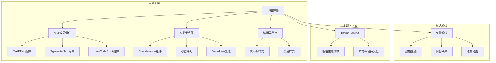
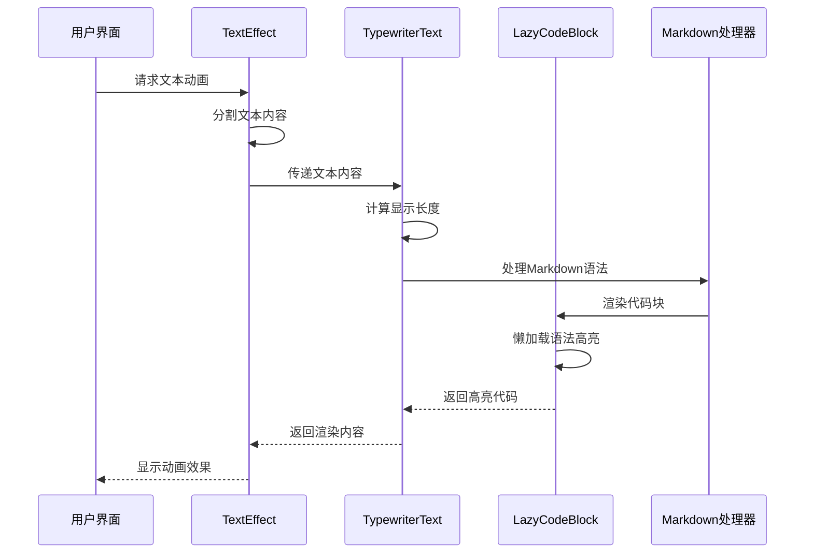
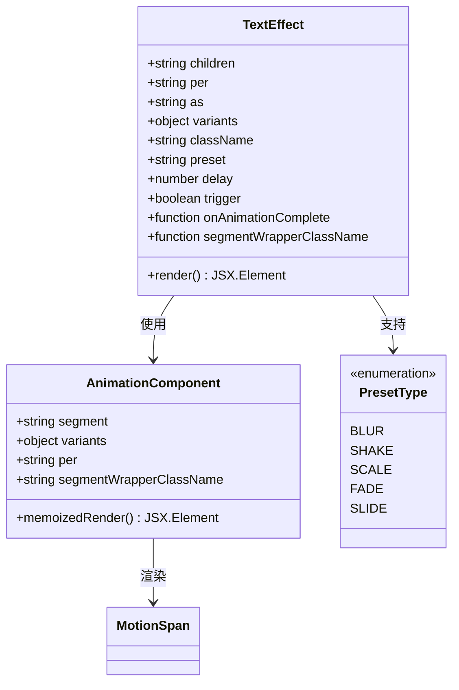
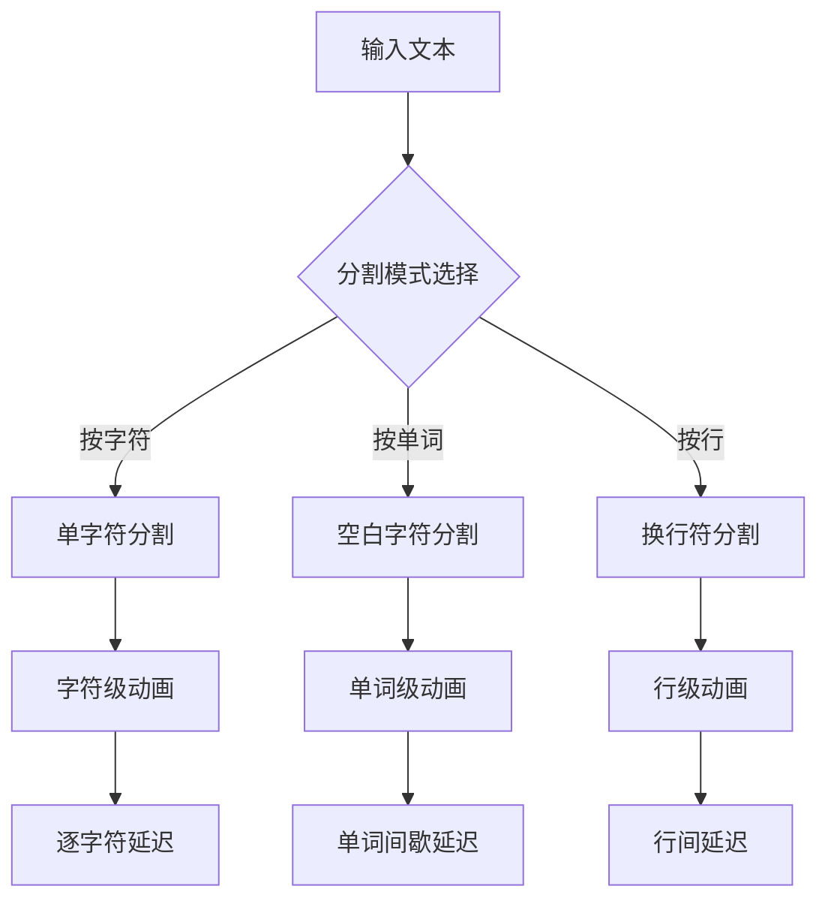
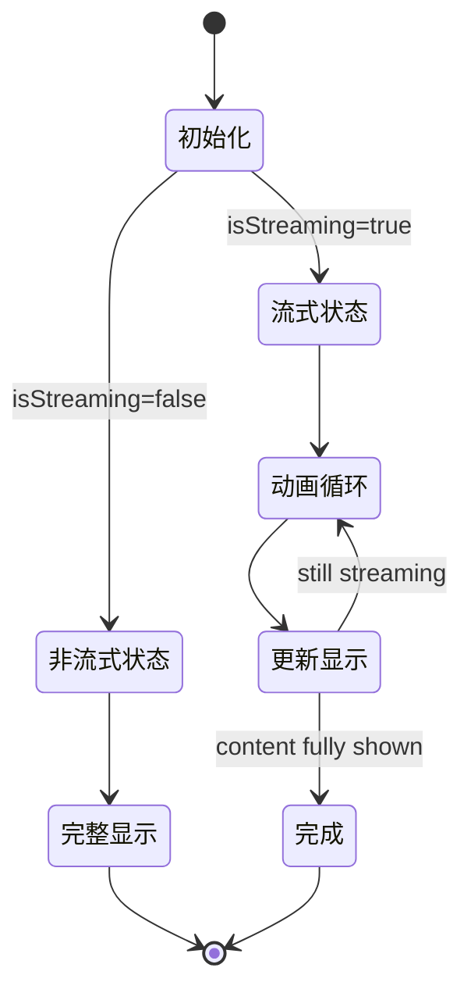
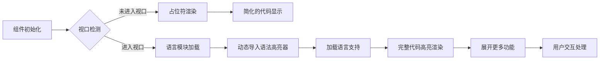
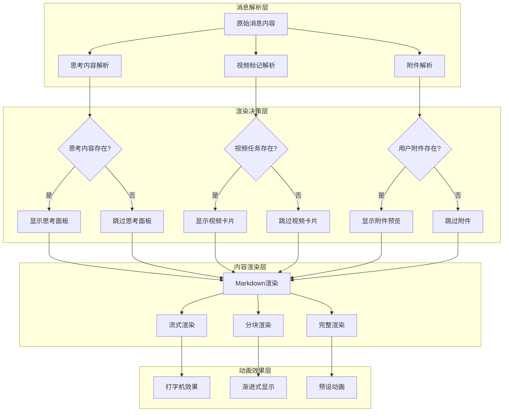
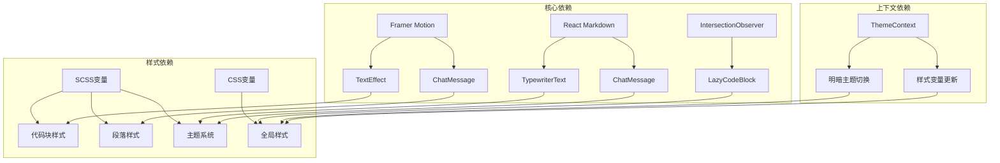

# 文字生成渲染效果指南

<cite>
**本文档引用的文件**
- [text-effect.tsx](file://frontend/src/components/ui/text-effect.tsx)
- [TypewriterText.tsx](file://frontend/src/components/ai-assistant/TypewriterText.tsx)
- [LazyCodeBlock.tsx](file://frontend/src/components/ai-assistant/LazyCodeBlock.tsx)
- [ChatMessage.tsx](file://frontend/src/components/ai-assistant/ChatMessage.tsx)
- [code-block-node.scss](file://frontend/src/components/tiptap-node/code-block-node/code-block-node.scss)
- [paragraph-node.scss](file://frontend/src/components/tiptap-node/paragraph-node/paragraph-node.scss)
- [_variables.scss](file://frontend/src/styles/_variables.scss)
- [ThemeContext.tsx](file://frontend/src/context/ThemeContext.tsx)
</cite>

## 目录
1. [简介](#简介)
2. [项目结构](#项目结构)
3. [核心组件](#核心组件)
4. [架构概览](#架构概览)
5. [详细组件分析](#详细组件分析)
6. [依赖关系分析](#依赖关系分析)
7. [性能考虑](#性能考虑)
8. [故障排除指南](#故障排除指南)
9. [结论](#结论)

## 简介

本指南专注于该代码库中的文字生成渲染效果实现，涵盖了从基础文本效果到复杂交互体验的完整技术栈。项目采用现代化的前端架构，结合Framer Motion动画库、React Markdown处理、以及自定义主题系统，为用户提供流畅的文字生成和渲染体验。

该系统的核心优势在于其模块化的组件设计、高性能的渲染机制，以及丰富的视觉效果选项。通过精心设计的动画序列、智能的文本分割策略，以及响应式的主题适配，实现了从简单的静态文本到复杂的动态内容展示的全方位支持。

## 项目结构

项目采用前后端分离的架构设计，重点关注前端的文本渲染和动画效果实现：

**图表来源**
- [text-effect.tsx:1-225](file://frontend/src/components/ui/text-effect.tsx#L1-L225)
- [ChatMessage.tsx:1-471](file://frontend/src/components/ai-assistant/ChatMessage.tsx#L1-L471)

**章节来源**
- [text-effect.tsx:1-225](file://frontend/src/components/ui/text-effect.tsx#L1-L225)
- [ChatMessage.tsx:1-471](file://frontend/src/components/ai-assistant/ChatMessage.tsx#L1-L471)

## 核心组件

### 文本效果组件体系

系统提供了多层次的文本效果组件，每个组件都针对特定的使用场景进行了优化：

#### TextEffect组件
- **功能特性**：支持多种预设动画效果（模糊、抖动、缩放、淡入、滑动）
- **分割策略**：按字符、单词或行进行智能分割
- **动画控制**：可配置延迟时间、触发条件和完成回调
- **无障碍支持**：提供适当的ARIA标签和语义化结构

#### TypewriterText组件
- **打字机效果**：模拟真实打字机的字符逐个显示过程
- **性能优化**：使用requestAnimationFrame和ref优化渲染性能
- **Markdown支持**：内置React Markdown处理，支持代码块、链接等元素
- **流式渲染**：支持实时数据流的动态显示

#### LazyCodeBlock组件
- **懒加载机制**：按需加载语法高亮器和语言支持模块
- **视口检测**：使用IntersectionObserver优化首屏加载
- **代码高亮**：支持多种编程语言的语法高亮显示
- **交互功能**：提供展开更多代码的交互体验

**章节来源**
- [text-effect.tsx:152-225](file://frontend/src/components/ui/text-effect.tsx#L152-L225)
- [TypewriterText.tsx:45-128](file://frontend/src/components/ai-assistant/TypewriterText.tsx#L45-L128)
- [LazyCodeBlock.tsx:50-166](file://frontend/src/components/ai-assistant/LazyCodeBlock.tsx#L50-L166)

## 架构概览

系统采用分层架构设计，确保各组件间的松耦合和高内聚：

**图表来源**
- [text-effect.tsx:164-182](file://frontend/src/components/ui/text-effect.tsx#L164-L182)
- [TypewriterText.tsx:73-93](file://frontend/src/components/ai-assistant/TypewriterText.tsx#L73-L93)
- [LazyCodeBlock.tsx:98-104](file://frontend/src/components/ai-assistant/LazyCodeBlock.tsx#L98-L104)

## 详细组件分析

### TextEffect组件深度解析

TextEffect组件是整个文本渲染系统的核心，提供了灵活的动画控制和多样化的视觉效果：

**图表来源**
- [text-effect.tsx:14-28](file://frontend/src/components/ui/text-effect.tsx#L14-L28)
- [text-effect.tsx:103-150](file://frontend/src/components/ui/text-effect.tsx#L103-L150)

#### 动画预设系统

组件内置了五种预设动画效果，每种都有独特的视觉特征：

| 预设类型 | 动画特性 | 适用场景 |
|---------|----------|----------|
| blur | 模糊渐变到清晰 | 引人注目的标题展示 |
| shake | 水平抖动效果 | 强调重要信息 |
| scale | 缩放变换 | 轻盈的过渡效果 |
| fade | 透明度变化 | 平静的页面切换 |
| slide | 位置移动 | 流畅的导航指示 |

#### 文本分割策略

组件支持三种分割模式，针对不同内容类型提供最优的动画效果：

**图表来源**
- [text-effect.tsx:164-172](file://frontend/src/components/ui/text-effect.tsx#L164-L172)

**章节来源**
- [text-effect.tsx:1-225](file://frontend/src/components/ui/text-effect.tsx#L1-L225)

### TypewriterText组件实现

TypewriterText组件专门处理打字机效果的实现，采用了高级的性能优化策略：

**图表来源**
- [TypewriterText.tsx:62-101](file://frontend/src/components/ai-assistant/TypewriterText.tsx#L62-L101)

#### 性能优化机制

组件通过以下机制确保最佳性能：

1. **Ref优化**：使用ref存储可变状态，避免不必要的重渲染
2. **RAF循环**：基于requestAnimationFrame的高效动画循环
3. **智能节流**：根据剩余字符数量调整渲染频率
4. **内存管理**：正确清理动画帧请求

#### Markdown处理集成

组件与React Markdown深度集成，支持丰富的文本格式：

- **内联代码**：使用简洁的样式设计
- **代码块**：提供完整的语法高亮支持
- **表格**：自动应用响应式表格样式
- **链接**：统一的链接样式和交互

**章节来源**
- [TypewriterText.tsx:1-128](file://frontend/src/components/ai-assistant/TypewriterText.tsx#L1-L128)

### LazyCodeBlock组件架构

LazyCodeBlock组件实现了代码块的高性能懒加载机制：

**图表来源**
- [LazyCodeBlock.tsx:67-92](file://frontend/src/components/ai-assistant/LazyCodeBlock.tsx#L67-L92)

#### 懒加载策略

组件采用多层懒加载策略：

1. **视口检测**：使用IntersectionObserver等待元素进入可视区域
2. **按需加载**：仅在需要时加载相应的语言支持模块
2. **动态导入**：使用React.lazy实现代码分割
3. **缓存机制**：避免重复加载已加载的语言模块

#### 用户体验优化

- **加载指示**：提供占位符和加载状态反馈
- **性能优先**：默认限制显示行数，支持手动展开
- **错误处理**：优雅处理语言加载失败的情况
- **交互反馈**：提供展开/收起的视觉反馈

**章节来源**
- [LazyCodeBlock.tsx:1-166](file://frontend/src/components/ai-assistant/LazyCodeBlock.tsx#L1-L166)

### ChatMessage组件综合分析

ChatMessage组件作为AI助手的核心渲染组件，集成了所有文本效果功能：

**图表来源**
- [ChatMessage.tsx:278-471](file://frontend/src/components/ai-assistant/ChatMessage.tsx#L278-L471)

#### 内容解析机制

组件实现了多层内容解析，确保不同类型的内容得到正确的处理：

1. **思考内容解析**：识别<think>标签内的思考过程
2. **视频标记解析**：处理视频生成任务的状态标记
3. **附件解析**：提取用户上传的媒体文件信息

#### 渲染策略选择

根据内容特性和状态选择最优的渲染策略：

- **流式渲染**：适用于实时生成的内容
- **分块渲染**：处理大量内容的渐进式显示
- **完整渲染**：标准的Markdown内容渲染

**章节来源**
- [ChatMessage.tsx:1-471](file://frontend/src/components/ai-assistant/ChatMessage.tsx#L1-L471)

## 依赖关系分析

系统组件间的依赖关系体现了清晰的层次结构：

**图表来源**
- [text-effect.tsx:1-10](file://frontend/src/components/ui/text-effect.tsx#L1-L10)
- [code-block-node.scss:1-55](file://frontend/src/components/tiptap-node/code-block-node/code-block-node.scss#L1-L55)
- [paragraph-node.scss:1-274](file://frontend/src/components/tiptap-node/paragraph-node/paragraph-node.scss#L1-L274)

**章节来源**
- [ThemeContext.tsx:1-75](file://frontend/src/context/ThemeContext.tsx#L1-L75)
- [_variables.scss:1-297](file://frontend/src/styles/_variables.scss#L1-L297)

## 性能考虑

系统在多个层面实现了性能优化：

### 渲染性能优化

1. **组件记忆化**：使用React.memo避免不必要的重新渲染
2. **懒加载策略**：按需加载大型依赖模块
3. **虚拟滚动**：对于长列表内容使用分块渲染
4. **动画优化**：使用transform属性而非改变布局属性

### 内存管理

1. **资源清理**：正确清理定时器和动画帧请求
2. **事件监听器**：在组件卸载时移除监听器
3. **缓存策略**：合理使用缓存避免重复计算

### 网络优化

1. **代码分割**：将大模块拆分为独立的代码块
2. **CDN利用**：外部依赖通过CDN加载
3. **压缩策略**：生产环境启用代码压缩和Tree Shaking

## 故障排除指南

### 常见问题及解决方案

#### 文本动画不生效

**症状**：TextEffect组件无法显示预期的动画效果

**可能原因**：
1. Trigger属性设置为false
2. 预设类型参数错误
3. 子组件未正确传递动画属性

**解决方案**：
- 检查trigger属性的值
- 验证preset参数的有效性
- 确保子组件正确继承动画属性

#### 打字机效果卡顿

**症状**：TypewriterText组件渲染过程中出现卡顿

**可能原因**：
1. 大量DOM操作导致的性能问题
2. 频繁的状态更新
3. 不必要的重渲染

**解决方案**：
- 使用React.memo包装子组件
- 优化状态更新逻辑
- 减少不必要的重新计算

#### 代码高亮加载失败

**症状**：LazyCodeBlock组件无法正确显示语法高亮

**可能原因**：
1. 语言模块加载失败
2. 语法高亮器初始化异常
3. 视口检测失效

**解决方案**：
- 检查网络连接和CDN可用性
- 验证语言模块的正确性
- 确认IntersectionObserver支持

**章节来源**
- [text-effect.tsx:200-223](file://frontend/src/components/ui/text-effect.tsx#L200-L223)
- [TypewriterText.tsx:98-101](file://frontend/src/components/ai-assistant/TypewriterText.tsx#L98-L101)
- [LazyCodeBlock.tsx:32-38](file://frontend/src/components/ai-assistant/LazyCodeBlock.tsx#L32-L38)

## 结论

该文字生成渲染系统展现了现代前端开发的最佳实践，通过精心设计的组件架构、高效的性能优化策略，以及丰富的视觉效果选项，为用户提供了卓越的文字处理体验。

系统的成功关键在于：

1. **模块化设计**：清晰的组件职责划分和接口定义
2. **性能优先**：从架构层面考虑性能影响
3. **用户体验**：注重细节的交互设计和反馈机制
4. **可维护性**：良好的代码组织和文档支持

未来可以考虑的方向包括：进一步优化大型内容的渲染性能、增强主题系统的灵活性、扩展更多的动画效果选项，以及提升组件的可访问性支持。