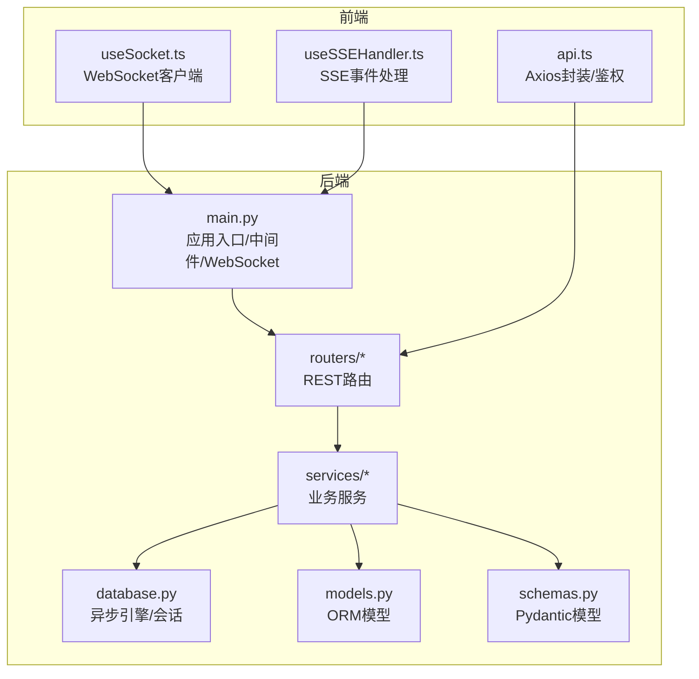
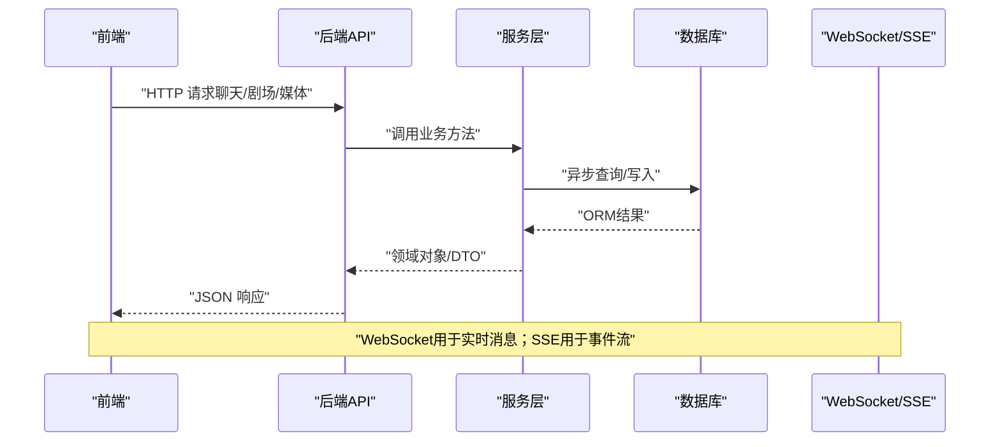
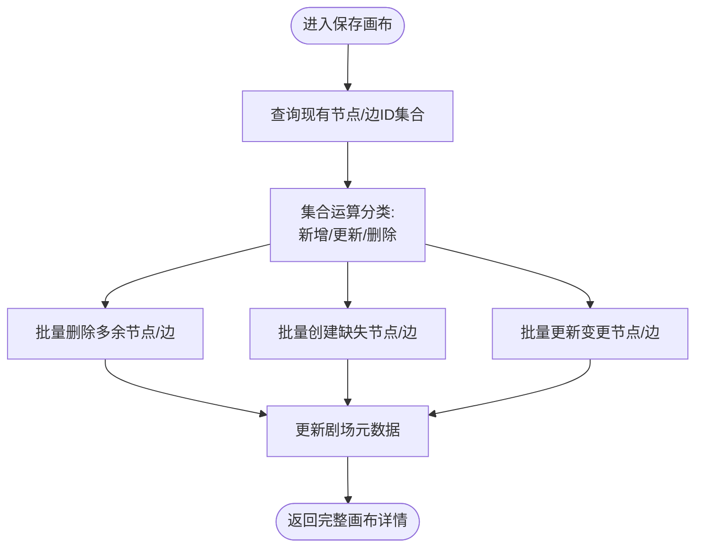
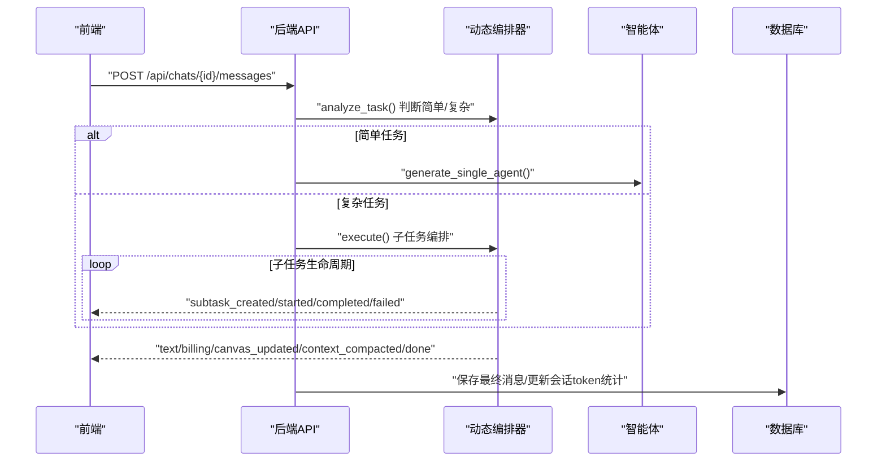
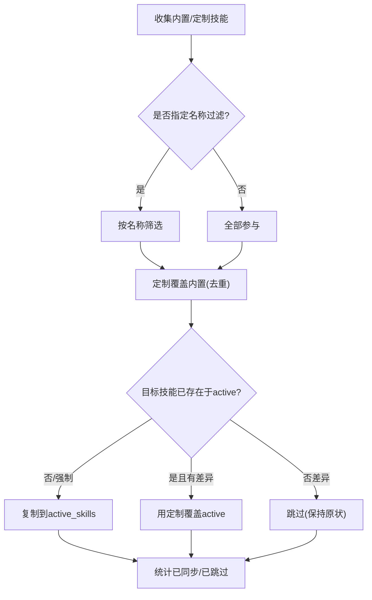
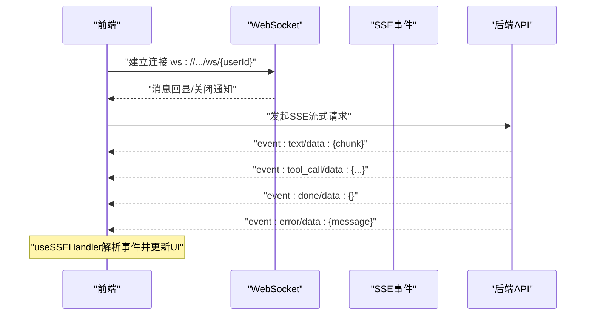
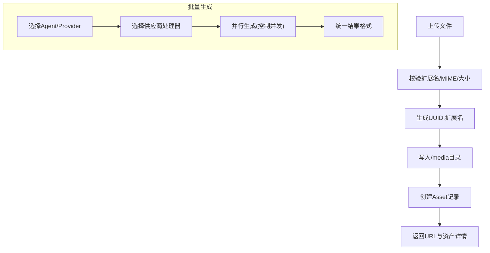
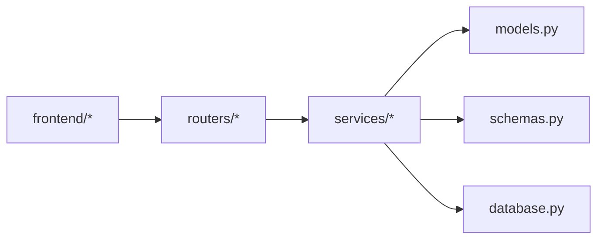

# 核心功能模块

<cite>
**本文档引用的文件**
- [backend/main.py](file://backend/main.py)
- [backend/models.py](file://backend/models.py)
- [backend/schemas.py](file://backend/schemas.py)
- [backend/config.py](file://backend/config.py)
- [backend/database.py](file://backend/database.py)
- [backend/routers/theaters.py](file://backend/routers/theaters.py)
- [backend/services/theater.py](file://backend/services/theater.py)
- [backend/routers/agents.py](file://backend/routers/agents.py)
- [backend/services/chat_multi_agent.py](file://backend/services/chat_multi_agent.py)
- [backend/skills_manager.py](file://backend/skills_manager.py)
- [backend/routers/media.py](file://backend/routers/media.py)
- [backend/services/media_utils.py](file://backend/services/media_utils.py)
- [frontend/src/hooks/useSocket.ts](file://frontend/src/hooks/useSocket.ts)
- [frontend/src/components/ai-assistant/hooks/useSSEHandler.ts](file://frontend/src/components/ai-assistant/hooks/useSSEHandler.ts)
- [frontend/src/lib/api.ts](file://frontend/src/lib/api.ts)
</cite>

## 目录
1. [简介](#简介)
2. [项目结构](#项目结构)
3. [核心组件](#核心组件)
4. [架构总览](#架构总览)
5. [详细组件分析](#详细组件分析)
6. [依赖分析](#依赖分析)
7. [性能考虑](#性能考虑)
8. [故障排查指南](#故障排查指南)
9. [结论](#结论)
10. [附录](#附录)

## 简介
本文件面向KunFlix核心功能模块，系统化梳理以下五大系统：剧院管理系统、AI代理系统、技能系统、实时通信系统、资源管理系统。文档从架构设计、数据流、业务逻辑、模块协作、配置项与使用模式等维度进行深入解析，并提供可视化图示帮助不同层次读者快速理解与落地实践。

## 项目结构
后端采用FastAPI + SQLAlchemy异步ORM，前端基于Next.js + React Hooks，模块化清晰、职责边界明确：
- 后端核心：入口、数据库、模型与Schema、路由层、服务层、工具与提供商
- 前端核心：WebSocket Hook、SSE事件处理Hook、API封装与鉴权

图表来源
- [backend/main.py:110-175](file://backend/main.py#L110-L175)
- [backend/database.py:1-45](file://backend/database.py#L1-L45)
- [backend/models.py:1-503](file://backend/models.py#L1-L503)
- [backend/schemas.py:1-931](file://backend/schemas.py#L1-L931)
- [frontend/src/hooks/useSocket.ts:1-42](file://frontend/src/hooks/useSocket.ts#L1-L42)
- [frontend/src/components/ai-assistant/hooks/useSSEHandler.ts:1-391](file://frontend/src/components/ai-assistant/hooks/useSSEHandler.ts#L1-L391)
- [frontend/src/lib/api.ts:1-84](file://frontend/src/lib/api.ts#L1-L84)

章节来源
- [backend/main.py:110-175](file://backend/main.py#L110-L175)
- [backend/database.py:1-45](file://backend/database.py#L1-L45)
- [backend/models.py:1-503](file://backend/models.py#L1-L503)
- [backend/schemas.py:1-931](file://backend/schemas.py#L1-L931)
- [frontend/src/hooks/useSocket.ts:1-42](file://frontend/src/hooks/useSocket.ts#L1-L42)
- [frontend/src/components/ai-assistant/hooks/useSSEHandler.ts:1-391](file://frontend/src/components/ai-assistant/hooks/useSSEHandler.ts#L1-L391)
- [frontend/src/lib/api.ts:1-84](file://frontend/src/lib/api.ts#L1-L84)

## 核心组件
- 剧院管理系统：提供剧场、节点、边的CRUD与全量画布同步，支持复制剧场、节点/边集合运算与视口同步
- AI代理系统：多智能体编排、任务分析与路由、计费与上下文压缩、SSE事件流驱动前端交互
- 技能系统：内置/定制/激活技能的目录结构与同步机制，支持技能文件树与脚本引用
- 实时通信系统：WebSocket连接与SSE事件流，前端通过Hook解析事件并驱动UI状态
- 资源管理系统：媒体文件上传、资产库CRUD、文件存储策略与批量图片生成

章节来源
- [backend/routers/theaters.py:1-110](file://backend/routers/theaters.py#L1-L110)
- [backend/services/theater.py:1-285](file://backend/services/theater.py#L1-L285)
- [backend/services/chat_multi_agent.py:1-190](file://backend/services/chat_multi_agent.py#L1-L190)
- [backend/skills_manager.py:1-408](file://backend/skills_manager.py#L1-L408)
- [backend/routers/media.py:1-444](file://backend/routers/media.py#L1-L444)
- [backend/services/media_utils.py:1-79](file://backend/services/media_utils.py#L1-L79)

## 架构总览
后端通过FastAPI路由组织REST接口，服务层封装业务逻辑，数据库层使用SQLAlchemy异步ORM；前端通过Axios与后端交互，WebSocket用于双向通信，SSE用于事件流推送。

图表来源
- [backend/main.py:161-171](file://backend/main.py#L161-L171)
- [frontend/src/hooks/useSocket.ts:1-42](file://frontend/src/hooks/useSocket.ts#L1-L42)
- [frontend/src/components/ai-assistant/hooks/useSSEHandler.ts:1-391](file://frontend/src/components/ai-assistant/hooks/useSSEHandler.ts#L1-L391)

## 详细组件分析

### 剧院管理系统
- 功能要点
  - 剧场CRUD：创建、列表、详情、更新、删除
  - 画布节点管理：节点类型、位置、尺寸、z-index、业务数据
  - 边连接系统：源/目标节点、句柄、样式、动画
  - 全量画布同步：集合运算区分新增/更新/删除，批量持久化
  - 复制剧场：深拷贝节点与边，保持拓扑关系
- 数据模型与路由
  - 模型：Theater、TheaterNode、TheaterEdge
  - 路由：/api/theaters、/api/theaters/{id}/canvas、/api/theaters/{id}/duplicate
- 处理流程
  - 保存画布时，先查询现有ID集合，再对传入集合做差集运算，分别执行删除、创建、更新
  - 更新剧场元数据（如node_count、canvas_viewport）

图表来源
- [backend/services/theater.py:108-228](file://backend/services/theater.py#L108-L228)
- [backend/routers/theaters.py:84-98](file://backend/routers/theaters.py#L84-L98)

章节来源
- [backend/routers/theaters.py:1-110](file://backend/routers/theaters.py#L1-L110)
- [backend/services/theater.py:1-285](file://backend/services/theater.py#L1-L285)
- [backend/models.py:75-130](file://backend/models.py#L75-L130)

### AI代理系统
- 多智能体协作
  - 任务分析：区分简单/复杂任务，简单走单智能体直通，复杂走动态编排
  - 动态编排：子任务创建、启动、完成、失败事件，支持自动评审与迭代
  - 计费与上下文压缩：累计token用量、摘要旧消息、SSE推送计费与上下文使用
- 事件流与前端交互
  - 文本流、技能调用、工具调用、视频任务、多智能体步骤、计费、画布更新、上下文压缩、完成/错误
  - 前端SSE解析器维护轮次状态、工具/技能/视频任务列表、多智能体步骤树

图表来源
- [backend/services/chat_multi_agent.py:22-190](file://backend/services/chat_multi_agent.py#L22-L190)
- [frontend/src/components/ai-assistant/hooks/useSSEHandler.ts:67-391](file://frontend/src/components/ai-assistant/hooks/useSSEHandler.ts#L67-L391)

章节来源
- [backend/routers/agents.py:1-151](file://backend/routers/agents.py#L1-L151)
- [backend/services/chat_multi_agent.py:1-190](file://backend/services/chat_multi_agent.py#L1-L190)
- [frontend/src/components/ai-assistant/hooks/useSSEHandler.ts:1-391](file://frontend/src/components/ai-assistant/hooks/useSSEHandler.ts#L1-L391)

### 技能系统
- 目录结构
  - builtin_skills：内置技能（只读）
  - customized_skills：定制技能（可增删改）
  - active_skills：激活技能（运行时生效）
- 能力与流程
  - 同步：支持强制覆盖、差异检测、按名称过滤
  - 列表：内置/定制/激活三类技能合并去重（定制优先）
  - 启用/禁用：将技能复制到active_skills或删除
  - 创建/删除：在customized_skills中增删技能，内置不可删除
  - 文件加载：安全路径前缀校验与防路径穿越

图表来源
- [backend/skills_manager.py:180-225](file://backend/skills_manager.py#L180-L225)
- [backend/skills_manager.py:263-408](file://backend/skills_manager.py#L263-L408)

章节来源
- [backend/skills_manager.py:1-408](file://backend/skills_manager.py#L1-L408)

### 实时通信系统
- WebSocket
  - 后端提供/ws/{user_id}，前端useSocket建立连接、发送/接收消息
- SSE事件流
  - 后端通过SSE事件推送文本、技能/工具调用、视频任务、多智能体步骤、计费、画布更新、上下文压缩、完成/错误
  - 前端useSSEHandler解析事件，维护轮次状态与UI反馈
- 鉴权与请求重试
  - 前端Axios拦截器自动附加Authorization头，401时刷新令牌并重试

图表来源
- [backend/main.py:161-171](file://backend/main.py#L161-L171)
- [frontend/src/hooks/useSocket.ts:1-42](file://frontend/src/hooks/useSocket.ts#L1-L42)
- [frontend/src/components/ai-assistant/hooks/useSSEHandler.ts:1-391](file://frontend/src/components/ai-assistant/hooks/useSSEHandler.ts#L1-L391)

章节来源
- [backend/main.py:161-171](file://backend/main.py#L161-L171)
- [frontend/src/hooks/useSocket.ts:1-42](file://frontend/src/hooks/useSocket.ts#L1-L42)
- [frontend/src/components/ai-assistant/hooks/useSSEHandler.ts:1-391](file://frontend/src/components/ai-assistant/hooks/useSSEHandler.ts#L1-L391)
- [frontend/src/lib/api.ts:1-84](file://frontend/src/lib/api.ts#L1-L84)

### 资源管理系统
- 媒体文件上传
  - 限制：按类型设定最大上传大小，校验扩展名与MIME
  - 存储：UUID.扩展名命名，保存至/media目录，记录Asset元数据
- 资产库管理
  - 列表：分页、按类型筛选
  - 更新：重命名与替换文件（删除旧文件）
  - 删除：硬删除（数据库记录+文件系统）
- 文件服务
  - 提供/{filename}安全访问，支持带扩展名与纯UUID回退
- 批量图片生成
  - 支持Gemini与xAI供应商，按并发度并行生成，返回统一结果结构

图表来源
- [backend/routers/media.py:95-148](file://backend/routers/media.py#L95-L148)
- [backend/routers/media.py:155-265](file://backend/routers/media.py#L155-L265)
- [backend/routers/media.py:272-299](file://backend/routers/media.py#L272-L299)
- [backend/routers/media.py:301-443](file://backend/routers/media.py#L301-L443)
- [backend/services/media_utils.py:20-79](file://backend/services/media_utils.py#L20-L79)

章节来源
- [backend/routers/media.py:1-444](file://backend/routers/media.py#L1-L444)
- [backend/services/media_utils.py:1-79](file://backend/services/media_utils.py#L1-L79)

## 依赖分析
- 模块耦合
  - 路由层依赖服务层；服务层依赖数据库与模型；Schema作为数据契约贯穿各层
  - 剧院服务与媒体服务均依赖数据库会话；AI代理服务依赖编排器与工具链
- 外部依赖
  - FastAPI、SQLAlchemy异步、httpx、Pydantic、Redis（配置项）
- 循环依赖
  - 当前结构未见循环导入；若引入跨模块引用需谨慎

图表来源
- [backend/routers/theaters.py:1-110](file://backend/routers/theaters.py#L1-L110)
- [backend/services/theater.py:1-285](file://backend/services/theater.py#L1-L285)
- [backend/models.py:1-503](file://backend/models.py#L1-L503)
- [backend/schemas.py:1-931](file://backend/schemas.py#L1-L931)
- [backend/database.py:1-45](file://backend/database.py#L1-L45)

章节来源
- [backend/routers/theaters.py:1-110](file://backend/routers/theaters.py#L1-L110)
- [backend/services/theater.py:1-285](file://backend/services/theater.py#L1-L285)
- [backend/models.py:1-503](file://backend/models.py#L1-L503)
- [backend/schemas.py:1-931](file://backend/schemas.py#L1-L931)
- [backend/database.py:1-45](file://backend/database.py#L1-L45)

## 性能考虑
- 数据库
  - 异步引擎与连接池配置，SQLite启用WAL模式降低锁冲突
  - 分页查询与索引字段（如user_id、theater_id）提升查询效率
- 事件流
  - SSE事件按需过滤高频chunk与text事件，避免前端渲染压力
  - 多智能体编排限制最大子任务数与迭代次数
- 文件上传
  - 严格大小限制与MIME白名单，避免异常文件占用存储
  - 并发批量生成时控制最大并发，防止供应商限流

## 故障排查指南
- WebSocket
  - 检查后端WebSocket路由与前端连接地址；确认用户ID有效
- SSE
  - 查看事件解析器是否正确识别event/data行；关注error事件与done事件
- 剧院画布
  - 若节点/边不同步，检查集合运算逻辑与ID一致性；确认canvas_viewport与node_count更新
- 媒体上传
  - 校验扩展名与大小限制；确认/media目录权限；查看文件是否存在与可访问
- 鉴权
  - 401时检查刷新令牌流程与请求重试队列；确认Authorization头是否附加

章节来源
- [backend/main.py:161-171](file://backend/main.py#L161-L171)
- [frontend/src/components/ai-assistant/hooks/useSSEHandler.ts:375-391](file://frontend/src/components/ai-assistant/hooks/useSSEHandler.ts#L375-L391)
- [backend/services/theater.py:108-228](file://backend/services/theater.py#L108-L228)
- [backend/routers/media.py:95-148](file://backend/routers/media.py#L95-L148)
- [frontend/src/lib/api.ts:31-81](file://frontend/src/lib/api.ts#L31-L81)

## 结论
KunFlix核心模块围绕“剧场-代理-技能-通信-资源”五线并行：剧场提供创作载体，代理负责内容生成与协作，技能拓展工具能力，通信保障实时性，资源承载多媒体资产。通过清晰的分层与事件驱动，系统在易用性与可扩展性之间取得平衡。建议在生产环境启用迁移、完善监控与告警，并持续优化并发与缓存策略。

## 附录
- 配置项概览（来自配置文件）
  - 数据库：DATABASE_URL（SQLite/PostgreSQL）
  - 缓存：REDIS_URL
  - AI模型：OPENAI_API_KEY、CLAUDE_API_KEY、GEMINI_API_KEY
  - JWT：JWT_SECRET_KEY、JWT_ALGORITHM、ACCESS_TOKEN_EXPIRE_MINUTES、REFRESH_TOKEN_EXPIRE_DAYS
  - 系统：RUN_MIGRATIONS

章节来源
- [backend/config.py:1-43](file://backend/config.py#L1-L43)