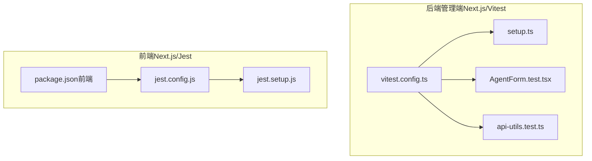
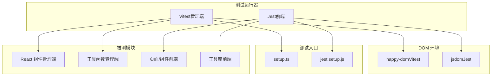
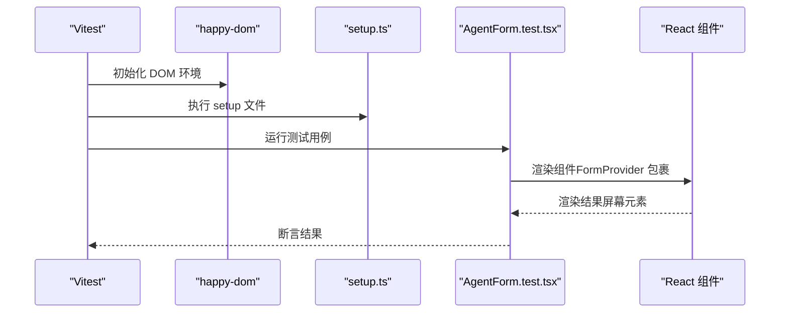
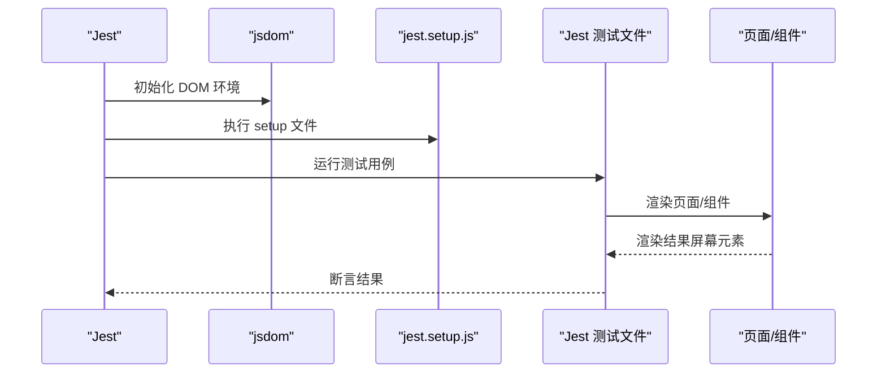
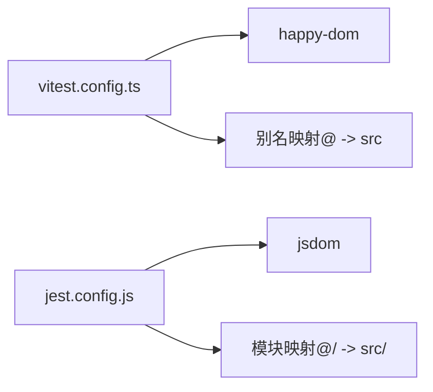

# 测试策略

<cite>
**本文引用的文件**
- [vitest.config.ts](file://backend/admin/vitest.config.ts)
- [setup.ts](file://backend/admin/src/tests/setup.ts)
- [AgentForm.test.tsx](file://backend/admin/src/tests/unit/AgentForm.test.tsx)
- [api-utils.test.ts](file://backend/admin/src/tests/unit/api-utils.test.ts)
- [jest.config.js](file://frontend/jest.config.js)
- [jest.setup.js](file://frontend/jest.setup.js)
- [package.json（前端）](file://frontend/package.json)
- [package.json（管理端）](file://backend/admin/package.json)
</cite>

## 目录
1. [引言](#引言)
2. [项目结构](#项目结构)
3. [核心组件](#核心组件)
4. [架构总览](#架构总览)
5. [详细组件分析](#详细组件分析)
6. [依赖分析](#依赖分析)
7. [性能考虑](#性能考虑)
8. [故障排查指南](#故障排查指南)
9. [结论](#结论)
10. [附录](#附录)

## 引言
本测试策略文档面向 KunFlix 项目的全栈测试体系，覆盖单元测试、集成测试与前端测试策略，明确测试环境配置、测试数据管理与 Mock 策略，并针对 AI 代理、API 接口、数据库与 UI 组件给出可操作的方法论与最佳实践。同时提供测试用例编写指南、覆盖率目标、持续集成配置建议、性能与压力测试实施思路、调试技巧以及测试报告与质量度量指标。

## 项目结构
- 后端管理端采用 Vite + Vitest + happy-dom 的前端测试栈，使用 React 组件测试与工具函数测试。
- 前端采用 Next.js + Jest + jsdom 的测试栈，覆盖页面、组件、工具库与状态存储等模块。
- 两套测试框架分别在各自工程内独立运行，便于隔离与并行执行。

图表来源
- [vitest.config.ts:1-16](file://backend/admin/vitest.config.ts#L1-L16)
- [setup.ts:1-2](file://backend/admin/src/tests/setup.ts#L1-L2)
- [AgentForm.test.tsx:1-55](file://backend/admin/src/tests/unit/AgentForm.test.tsx#L1-L55)
- [api-utils.test.ts:1-22](file://backend/admin/src/tests/unit/api-utils.test.ts#L1-L22)
- [jest.config.js:1-20](file://frontend/jest.config.js#L1-L20)
- [jest.setup.js:1-3](file://frontend/jest.setup.js#L1-L3)
- [package.json（前端）:1-94](file://frontend/package.json#L1-L94)

章节来源
- [vitest.config.ts:1-16](file://backend/admin/vitest.config.ts#L1-L16)
- [setup.ts:1-2](file://backend/admin/src/tests/setup.ts#L1-L2)
- [AgentForm.test.tsx:1-55](file://backend/admin/src/tests/unit/AgentForm.test.tsx#L1-L55)
- [api-utils.test.ts:1-22](file://backend/admin/src/tests/unit/api-utils.test.ts#L1-L22)
- [jest.config.js:1-20](file://frontend/jest.config.js#L1-L20)
- [jest.setup.js:1-3](file://frontend/jest.setup.js#L1-L3)
- [package.json（前端）:1-94](file://frontend/package.json#L1-L94)

## 核心组件
- 单元测试框架
  - 后端管理端：Vitest + happy-dom，支持 React 组件渲染与工具函数测试。
  - 前端：Jest + jsdom，支持页面、组件与工具函数测试。
- 集成测试方案
  - 基于现有路由与服务层，通过模拟外部依赖与数据库连接进行集成验证。
- 前端测试策略
  - 页面与组件测试、工具库测试、状态存储测试；结合快照测试与交互行为断言。
- 测试环境配置
  - Vitest 使用 happy-dom 作为 DOM 环境，设置全局别名与 setup 文件。
  - Jest 使用 jsdom，配置模块映射与测试环境。
- 测试数据管理与 Mock 策略
  - 使用 Vitest 提供的 Mock 工具对浏览器 API（如 matchMedia）与第三方库进行替换。
  - 对外部服务（如 LLM 提供商、媒体服务）采用接口层 Mock，避免真实调用。
- 覆盖率与报告
  - 建议在 CI 中启用覆盖率收集与报告生成，结合代码质量门禁。

章节来源
- [vitest.config.ts:1-16](file://backend/admin/vitest.config.ts#L1-L16)
- [setup.ts:1-2](file://backend/admin/src/tests/setup.ts#L1-L2)
- [AgentForm.test.tsx:1-55](file://backend/admin/src/tests/unit/AgentForm.test.tsx#L1-L55)
- [api-utils.test.ts:1-22](file://backend/admin/src/tests/unit/api-utils.test.ts#L1-L22)
- [jest.config.js:1-20](file://frontend/jest.config.js#L1-L20)
- [jest.setup.js:1-3](file://frontend/jest.setup.js#L1-L3)
- [package.json（前端）:1-94](file://frontend/package.json#L1-L94)

## 架构总览
下图展示测试栈与关键组件的关系，包括测试运行器、DOM 环境、测试入口与被测模块。

图表来源
- [vitest.config.ts:1-16](file://backend/admin/vitest.config.ts#L1-L16)
- [setup.ts:1-2](file://backend/admin/src/tests/setup.ts#L1-L2)
- [jest.config.js:1-20](file://frontend/jest.config.js#L1-L20)
- [jest.setup.js:1-3](file://frontend/jest.setup.js#L1-L3)

## 详细组件分析

### 后端管理端测试（Vitest + happy-dom）
- 测试运行器与环境
  - 使用 Vitest 并配置 happy-dom 作为测试 DOM 环境，启用全局断言与别名映射。
  - 通过 setup 文件注入测试辅助库，确保测试一致性。
- 组件测试示例
  - React 表单组件测试：通过 FormProvider 包裹，渲染表单并断言可见性与交互元素。
  - 使用 Mock 替换浏览器 API（如 matchMedia），保证在无头环境中稳定运行。
- 工具函数测试示例
  - 对字符串解析逻辑进行多分支断言，覆盖数组、JSON 字符串与异常输入场景。
- Mock 策略
  - 对浏览器特性与第三方库进行最小化替换，保持被测函数的纯函数特性。
  - 对外部服务接口采用接口层 Mock，避免真实网络调用。

图表来源
- [vitest.config.ts:1-16](file://backend/admin/vitest.config.ts#L1-L16)
- [setup.ts:1-2](file://backend/admin/src/tests/setup.ts#L1-L2)
- [AgentForm.test.tsx:1-55](file://backend/admin/src/tests/unit/AgentForm.test.tsx#L1-L55)

章节来源
- [vitest.config.ts:1-16](file://backend/admin/vitest.config.ts#L1-L16)
- [setup.ts:1-2](file://backend/admin/src/tests/setup.ts#L1-L2)
- [AgentForm.test.tsx:1-55](file://backend/admin/src/tests/unit/AgentForm.test.tsx#L1-L55)
- [api-utils.test.ts:1-22](file://backend/admin/src/tests/unit/api-utils.test.ts#L1-L22)

### 前端测试（Jest + jsdom）
- 测试运行器与环境
  - 使用 Jest 并配置 jsdom 作为测试 DOM 环境，支持 Next.js 应用测试。
  - 通过模块映射将 @/ 前缀指向 src 目录，简化导入路径。
- 测试类型
  - 页面与组件测试：断言渲染内容、交互行为与状态变化。
  - 工具库测试：对业务工具函数进行纯函数断言。
  - 快照测试：对复杂组件输出进行快照比对，防止 UI 回退。
- Mock 策略
  - 对浏览器特性与第三方库进行最小化替换。
  - 对网络请求与外部服务采用接口层 Mock，确保测试可重复性。

图表来源
- [jest.config.js:1-20](file://frontend/jest.config.js#L1-L20)
- [jest.setup.js:1-3](file://frontend/jest.setup.js#L1-L3)

章节来源
- [jest.config.js:1-20](file://frontend/jest.config.js#L1-L20)
- [jest.setup.js:1-3](file://frontend/jest.setup.js#L1-L3)
- [package.json（前端）:1-94](file://frontend/package.json#L1-L94)

### AI 代理测试
- 单元测试
  - 对代理参数校验、提示词模板处理、工具调用序列进行断言。
  - 使用 Mock 模拟 LLM 提供商响应与工具执行日志。
- 集成测试
  - 在受控环境中触发代理执行流程，断言会话状态、消息链与计费统计。
  - 对多代理协作场景进行时序断言与并发控制验证。
- 性能与稳定性
  - 通过超时与重试策略保障长耗时推理的稳定性。
  - 对流式输出进行分片断言与完整性校验。

### API 接口测试
- 单元测试
  - 对路由处理器的输入解析、权限校验与错误码返回进行断言。
- 集成测试
  - 使用测试数据库快照或内存数据库，验证请求-响应链路与副作用。
  - 对鉴权中间件与限流策略进行端到端验证。
- Mock 策略
  - 对外部服务（支付、媒体、第三方 LLM）采用接口层 Mock，避免真实依赖。

### 数据库测试
- 单元测试
  - 对数据访问层（DAO）与查询构建器进行断言。
- 集成测试
  - 使用迁移脚本初始化测试数据库，验证事务、约束与索引。
  - 对批量写入与复杂查询进行性能与正确性验证。

### UI 组件测试
- 单元测试
  - 对原子组件与复合组件进行渲染与交互断言。
  - 结合快照测试防止 UI 回退。
- 端到端测试（建议）
  - 使用 Playwright 或 Cypress 进行端到端验证，覆盖关键用户路径。

## 依赖分析
- 测试框架与环境
  - 管理端：Vitest + happy-dom，React 组件测试与工具函数测试。
  - 前端：Jest + jsdom，页面、组件与工具库测试。
- 模块映射与别名
  - Vitest 与 Jest 分别配置了模块别名，确保测试中导入路径一致。
- 外部依赖
  - 对浏览器 API、第三方库与外部服务进行 Mock，降低测试脆弱性。

图表来源
- [vitest.config.ts:1-16](file://backend/admin/vitest.config.ts#L1-L16)
- [jest.config.js:1-20](file://frontend/jest.config.js#L1-L20)

章节来源
- [vitest.config.ts:1-16](file://backend/admin/vitest.config.ts#L1-L16)
- [jest.config.js:1-20](file://frontend/jest.config.js#L1-L20)

## 性能考虑
- 单元测试性能
  - 使用 Mock 减少 IO 与网络调用，优先断言纯函数与边界条件。
- 集成测试性能
  - 使用内存数据库或测试专用实例，缩短初始化时间。
- 前端测试性能
  - 合理拆分测试文件，避免一次性加载过多组件。
- 性能回归
  - 在 CI 中引入性能基线与阈值告警，监控关键路径耗时。

## 故障排查指南
- 常见问题
  - 浏览器 API 缺失：在 Vitest 中对 matchMedia 等 API 进行 Mock。
  - 模块导入失败：检查别名映射与路径配置，确保与实际工程一致。
  - DOM 环境不兼容：确认使用 happy-dom 或 jsdom，并在 setup 文件中统一注入。
- 调试技巧
  - 使用断点与日志定位问题，逐步缩小范围。
  - 将复杂组件拆分为更小的单元测试，提升可维护性。
- 解决方案
  - 对 Mock 层进行版本化管理，避免因外部变更导致测试失效。
  - 在 CI 中增加失败重试与详细日志，便于问题复现。

## 结论
通过在管理端采用 Vitest + happy-dom、在前端采用 Jest + jsdom 的双栈测试策略，结合完善的 Mock 与数据管理机制，KunFlix 可以建立稳定、可扩展且高覆盖率的测试体系。建议在 CI 中引入覆盖率与性能基线，持续优化测试用例与执行效率，确保产品质量与交付速度。

## 附录
- 测试用例编写指南
  - 针对每个功能模块至少覆盖正常路径、边界条件与异常路径。
  - 对 UI 组件使用快照测试与交互断言相结合的方式。
- 覆盖率要求
  - 建议语句覆盖率与分支覆盖率不低于 80%，关键路径不低于 90%。
- 持续集成配置
  - 在 CI 中分别执行管理端与前端测试，合并覆盖率报告并设置质量门禁。
- 测试报告与质量度量
  - 生成 HTML 与 LCOV 报告，结合缺陷密度、测试执行时长与失败率进行质量评估。