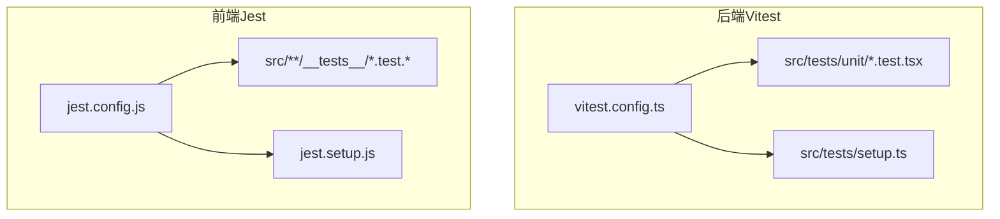
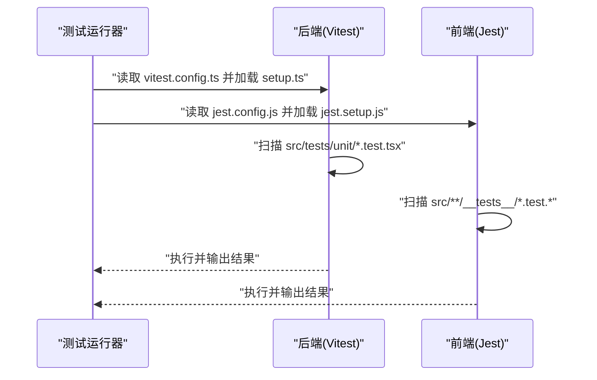
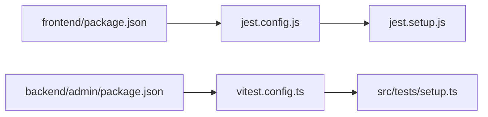

# 单元测试

<cite>
**本文引用的文件**
- [vitest.config.ts](file://backend/admin/vitest.config.ts)
- [setup.ts](file://backend/admin/src/tests/setup.ts)
- [AgentForm.test.tsx](file://backend/admin/src/tests/unit/AgentForm.test.tsx)
- [api-utils.test.ts](file://backend/admin/src/tests/unit/api-utils.test.ts)
- [jest.config.js](file://frontend/jest.config.js)
- [jest.setup.js](file://frontend/jest.setup.js)
- [package.json（前端）](file://frontend/package.json)
- [useCanvasStore.test.ts](file://frontend/src/store/__tests__/useCanvasStore.test.ts)
- [CharacterNode.test.tsx](file://frontend/src/components/canvas/__tests__/CharacterNode.test.tsx)
- [api.test.ts](file://frontend/src/lib/api.test.ts)
- [page.test.tsx](file://frontend/src/app/theater/[id]/__tests__/page.test.tsx)
- [axios.ts（后端）](file://backend/admin/src/lib/axios.ts)
- [auth.py（后端）](file://backend/auth.py)
- [admin_auth.py（后端）](file://backend/routers/admin_auth.py)
- [package.json（后端）](file://backend/admin/package.json)
</cite>

## 目录
1. [简介](#简介)
2. [项目结构](#项目结构)
3. [核心组件](#核心组件)
4. [架构总览](#架构总览)
5. [详细组件分析](#详细组件分析)
6. [依赖分析](#依赖分析)
7. [性能考虑](#性能考虑)
8. [故障排查指南](#故障排查指南)
9. [结论](#结论)
10. [附录](#附录)

## 简介
本文件面向 Infinite Game 项目的单元测试体系，系统性说明后端 Vitest 与前端 Jest 的配置与使用方法，覆盖测试文件命名约定、Mock 策略、异步测试处理、覆盖率与报告生成、测试数据准备、环境配置以及断言最佳实践，并通过具体测试用例示例讲解智能体执行器相关逻辑、画布组件与认证流程的测试思路。

## 项目结构
- 后端采用 Vitest + happy-dom 进行组件与工具函数测试，配置位于 admin 子项目根目录。
- 前端采用 Jest + jsdom 进行组件、Hook 与 API 客户端测试，配置位于前端根目录。
- 测试文件按功能模块组织：后端在 src/tests 下按 unit 分类；前端在各功能目录下以 __tests__ 组织。

图表来源
- [vitest.config.ts:1-16](file://backend/admin/vitest.config.ts#L1-L16)
- [setup.ts:1-2](file://backend/admin/src/tests/setup.ts#L1-L2)
- [jest.config.js:1-20](file://frontend/jest.config.js#L1-L20)
- [jest.setup.js:1-3](file://frontend/jest.setup.js#L1-L3)

章节来源
- [vitest.config.ts:1-16](file://backend/admin/vitest.config.ts#L1-L16)
- [jest.config.js:1-20](file://frontend/jest.config.js#L1-L20)

## 核心组件
- 后端 Vitest 配置要点
  - 环境：happy-dom
  - 全局：启用 globals
  - 别名：@ 指向 src
  - 设置文件：src/tests/setup.ts
- 前端 Jest 配置要点
  - 环境：jest-environment-jsdom
  - 模块名映射：@/xxx -> src/xxx
  - 设置文件：jest.setup.js（引入 @testing-library/jest-dom）

章节来源
- [vitest.config.ts:1-16](file://backend/admin/vitest.config.ts#L1-L16)
- [jest.config.js:1-20](file://frontend/jest.config.js#L1-L20)
- [jest.setup.js:1-3](file://frontend/jest.setup.js#L1-L3)

## 架构总览
下图展示了前后端测试运行时的关键交互：测试框架加载配置与设置文件，按命名约定定位测试文件，执行被测代码并通过 Mock 与断言完成验证。

图表来源
- [vitest.config.ts:1-16](file://backend/admin/vitest.config.ts#L1-L16)
- [jest.config.js:1-20](file://frontend/jest.config.js#L1-L20)
- [setup.ts:1-2](file://backend/admin/src/tests/setup.ts#L1-L2)
- [jest.setup.js:1-3](file://frontend/jest.setup.js#L1-L3)

## 详细组件分析

### 后端：Vitest 配置与通用测试实践
- 环境与别名
  - 使用 happy-dom 提供 DOM 能力，适合组件与工具函数测试。
  - 通过别名 @ 映射到 src，便于导入被测模块。
- 设置文件
  - 在 setup.ts 引入 @testing-library/jest-dom，统一断言风格。
- 测试文件命名约定
  - 后端采用 src/tests/unit/<Name>.test.tsx 或 .test.ts，便于按功能分组。
- Mock 策略
  - 使用 vi.fn()/vi.mock() 进行函数与模块 Mock。
  - 对浏览器全局如 window.matchMedia、URL.createObjectURL 等进行适配。
- 异步测试
  - 使用 async/await 与 Promise 断言，确保异步行为被正确等待。
- 示例参考
  - 工具函数测试：[api-utils.test.ts:1-22](file://backend/admin/src/tests/unit/api-utils.test.ts#L1-L22)
  - 组件表单测试：[AgentForm.test.tsx:1-55](file://backend/admin/src/tests/unit/AgentForm.test.tsx#L1-L55)

章节来源
- [vitest.config.ts:1-16](file://backend/admin/vitest.config.ts#L1-L16)
- [setup.ts:1-2](file://backend/admin/src/tests/setup.ts#L1-L2)
- [AgentForm.test.tsx:1-55](file://backend/admin/src/tests/unit/AgentForm.test.tsx#L1-L55)
- [api-utils.test.ts:1-22](file://backend/admin/src/tests/unit/api-utils.test.ts#L1-L22)

### 前端：Jest 配置与组件/Hook/API 测试
- 配置要点
  - 环境：jsdom，支持 DOM API。
  - 模块名映射：@/xxx -> src/xxx，便于相对路径导入。
  - 设置文件：jest.setup.js 引入 @testing-library/jest-dom。
- 测试文件命名约定
  - 组件测试：src/components/**/__tests__/*.test.tsx
  - Hook 测试：src/store/__tests__/use*.test.ts
  - API 客户端测试：src/lib/__tests__/api.test.ts
- Mock 策略
  - jest.mock 用于替换外部依赖（如 store、第三方库、导航钩子等）。
  - 对全局对象（如 ResizeObserver、XMLHttpRequest、localStorage、window）进行适配。
- 异步测试
  - 使用 fake timers 控制时间推进，结合 act/Promise.resolve 刷新微任务队列。
- 示例参考
  - Canvas Store 自动保存与防抖：[useCanvasStore.test.ts:1-124](file://frontend/src/store/__tests__/useCanvasStore.test.ts#L1-L124)
  - 画布节点组件测试（上传、删除、复制、边柄渲染）：[CharacterNode.test.tsx:1-182](file://frontend/src/components/canvas/__tests__/CharacterNode.test.tsx#L1-L182)
  - API 拦截器（请求头附加与 401 处理）：[api.test.ts:1-57](file://frontend/src/lib/api.test.ts#L1-L57)
  - 剧场编辑页集成测试（页面渲染、依赖 Mock）：[page.test.tsx:1-98](file://frontend/src/app/theater/[id]/__tests__/page.test.tsx#L1-L98)

章节来源
- [jest.config.js:1-20](file://frontend/jest.config.js#L1-L20)
- [jest.setup.js:1-3](file://frontend/jest.setup.js#L1-L3)
- [useCanvasStore.test.ts:1-124](file://frontend/src/store/__tests__/useCanvasStore.test.ts#L1-L124)
- [CharacterNode.test.tsx:1-182](file://frontend/src/components/canvas/__tests__/CharacterNode.test.tsx#L1-L182)
- [api.test.ts:1-57](file://frontend/src/lib/api.test.ts#L1-L57)
- [page.test.tsx:1-98](file://frontend/src/app/theater/[id]/__tests__/page.test.tsx#L1-L98)

### 智能体执行器相关测试思路
- 后端服务层（agent_executor.py）与工具（base_tools.py、skill_tools.py、canvas_tools.py）可作为工具函数进行单元测试：
  - 输入参数校验与返回值断言。
  - 错误分支与异常抛出场景。
  - 与数据库/外部服务交互时使用 vi.mock 或测试替身。
- 前端画布组件（如 ScriptNode、CharacterNode、StoryboardNode、VideoNode）可围绕以下方面测试：
  - 用户交互事件（拖拽、点击、输入）触发的状态变更。
  - 与 Zustand Store 的联动（updateNodeData/addNode/deleteNode）。
  - 边连接手柄、缩放控制、快捷键等 UI 行为。
- 参考示例：
  - 后端工具函数测试：[api-utils.test.ts:1-22](file://backend/admin/src/tests/unit/api-utils.test.ts#L1-L22)
  - 画布节点组件测试：[CharacterNode.test.tsx:1-182](file://frontend/src/components/canvas/__tests__/CharacterNode.test.tsx#L1-L182)

章节来源
- [api-utils.test.ts:1-22](file://backend/admin/src/tests/unit/api-utils.test.ts#L1-L22)
- [CharacterNode.test.tsx:1-182](file://frontend/src/components/canvas/__tests__/CharacterNode.test.tsx#L1-L182)

### 画布组件测试示例
- 测试目标
  - 渲染状态（空态、加载态、错误态）。
  - 文件上传成功/失败路径（含进度与错误提示）。
  - 删除与复制节点的行为。
  - 边连接手柄与触发区域的可见性。
- 关键 Mock
  - Zustand Store：jest.mock('@/store/useCanvasStore')。
  - 第三方库：@xyflow/react、uuid。
  - 浏览器全局：ResizeObserver、URL.createObjectURL/ revokeObjectURL。
- 断言建议
  - 使用 @testing-library 的 getByRole/getByText 等语义化选择器。
  - 对副作用（调用次数、参数匹配）使用 .toHaveBeenCalledWith。

章节来源
- [CharacterNode.test.tsx:1-182](file://frontend/src/components/canvas/__tests__/CharacterNode.test.tsx#L1-L182)

### 认证逻辑测试示例
- 后端认证（FastAPI）
  - 管理员登录路由与权限依赖：[admin_auth.py:1-51](file://backend/routers/admin_auth.py#L1-L51)
  - 当前管理员获取与激活校验：[auth.py:119-156](file://backend/auth.py#L119-L156)
- 前端 API 客户端拦截器
  - 请求头附加 Bearer Token：[api.test.ts:9-19](file://frontend/src/lib/api.test.ts#L9-L19)
  - 401 无刷新令牌时清理本地存储：[api.test.ts:39-54](file://frontend/src/lib/api.test.ts#L39-L54)
  - 后端 Axios 封装中的刷新队列与重试逻辑：[axios.ts（后端）:52-80](file://backend/admin/src/lib/axios.ts#L52-L80)

章节来源
- [admin_auth.py:1-51](file://backend/routers/admin_auth.py#L1-L51)
- [auth.py:119-156](file://backend/auth.py#L119-L156)
- [api.test.ts:1-57](file://frontend/src/lib/api.test.ts#L1-L57)
- [axios.ts（后端）:52-80](file://backend/admin/src/lib/axios.ts#L52-L80)

### 测试覆盖率与报告生成
- 前端覆盖率
  - 仓库包含 coverage 目录与 lcov 报告产物，表明已生成 HTML 与 LCOV 报告。
  - 可通过 npm 脚本触发测试并生成覆盖率（需在本地或 CI 中配置）。
- 后端覆盖率
  - 未在当前仓库发现覆盖率生成脚本或配置文件，建议在 vitest.config.ts 中添加 coverage 字段以启用覆盖率统计与报告生成。

章节来源
- [package.json（前端）:10-11](file://frontend/package.json#L10-L11)
- [vitest.config.ts:1-16](file://backend/admin/vitest.config.ts#L1-L16)

### 测试数据准备与环境配置最佳实践
- 数据准备
  - 使用最小化、可重复的数据集，避免外部依赖。
  - 对外部接口使用 Mock，确保测试稳定。
- 环境配置
  - 前端：确保 jsdom 支持 ResizeObserver、URL API、XMLHttpRequest 等。
  - 后端：happy-dom 提供基础 DOM 能力，必要时手动注入 polyfill。
- 断言最佳实践
  - 优先使用语义化选择器与行为断言，而非实现细节。
  - 对异步逻辑使用 fake timers 与微任务刷新，保证断言时机正确。

## 依赖分析
- 前端测试依赖
  - Jest、jsdom、@testing-library/react、@testing-library/jest-dom、ts-jest。
- 后端测试依赖
  - Vitest、happy-dom、@testing-library/react（用于 TSX 组件测试）。
- Mock 与别名
  - 前端通过 moduleNameMapper 将 @ 映射到 src。
  - 后端通过 alias 将 @ 映射到 src。

图表来源
- [package.json（前端）:1-92](file://frontend/package.json#L1-L92)
- [jest.config.js:1-20](file://frontend/jest.config.js#L1-L20)
- [jest.setup.js:1-3](file://frontend/jest.setup.js#L1-L3)
- [package.json（后端）:1-73](file://backend/admin/package.json#L1-L73)
- [vitest.config.ts:1-16](file://backend/admin/vitest.config.ts#L1-L16)
- [setup.ts:1-2](file://backend/admin/src/tests/setup.ts#L1-L2)

章节来源
- [package.json（前端）:1-92](file://frontend/package.json#L1-L92)
- [package.json（后端）:1-73](file://backend/admin/package.json#L1-L73)

## 性能考虑
- 使用 fake timers 控制时间推进，减少真实等待时间。
- 对高频操作（如连续节点添加）进行批量断言，避免冗余等待。
- 将昂贵的外部调用（网络、文件系统）全部 Mock，确保测试快速稳定。

## 故障排查指南
- 常见问题
  - jsdom 缺失全局对象：如 ResizeObserver、URL API、XMLHttpRequest，需在测试中手动 Mock。
  - 401 无刷新令牌导致重定向：前端拦截器会清理本地存储，需在测试中捕获或模拟跳转。
  - 时间相关逻辑不稳定：使用 jest.useFakeTimers 与 advanceTimersByTime 控制。
- 排查步骤
  - 确认 jest.config.js 与 vitest.config.ts 的环境与设置文件加载正常。
  - 检查 moduleNameMapper 与 alias 是否指向正确的源码路径。
  - 对 Mock 的模块与函数进行调用次数与参数断言，定位问题范围。

章节来源
- [useCanvasStore.test.ts:1-124](file://frontend/src/store/__tests__/useCanvasStore.test.ts#L1-L124)
- [api.test.ts:1-57](file://frontend/src/lib/api.test.ts#L1-L57)
- [axios.ts（后端）:52-80](file://backend/admin/src/lib/axios.ts#L52-L80)

## 结论
本项目在前后端分别采用 Vitest 与 Jest，配合 jsdom/happy-dom 提供的 DOM 能力，实现了对组件、Hook、工具函数与 API 客户端的全面单元测试。通过规范的命名约定、Mock 策略与异步处理，测试具备良好的稳定性与可维护性。建议后续在后端补充覆盖率配置，完善 CI 中的覆盖率报告与阈值检查。

## 附录
- 测试脚本
  - 前端：test、test:watch（package.json 中定义）
  - 后端：可通过 Vitest CLI 运行（默认读取 vitest.config.ts）
- 建议的覆盖率配置（后端）
  - 在 vitest.config.ts 中添加 coverage 字段，启用 HTML/LCOV 报告，设定阈值以保障质量。