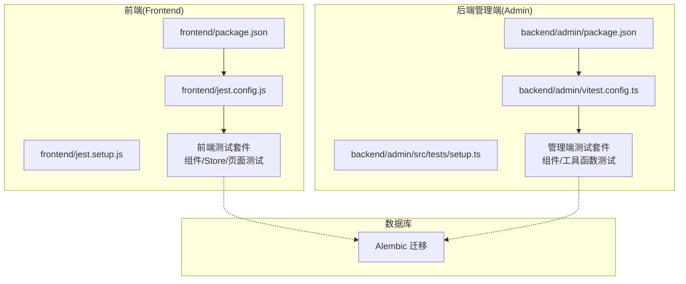
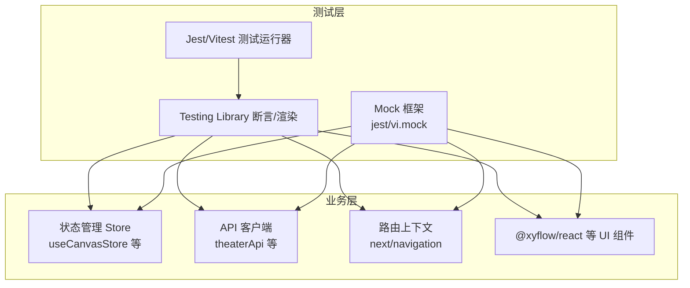
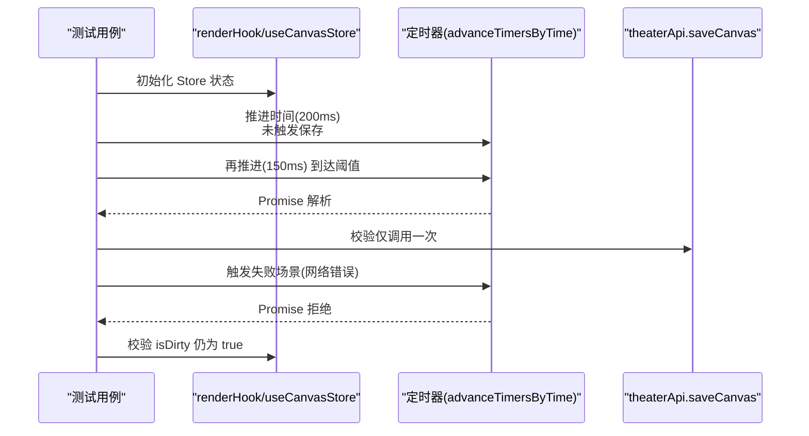
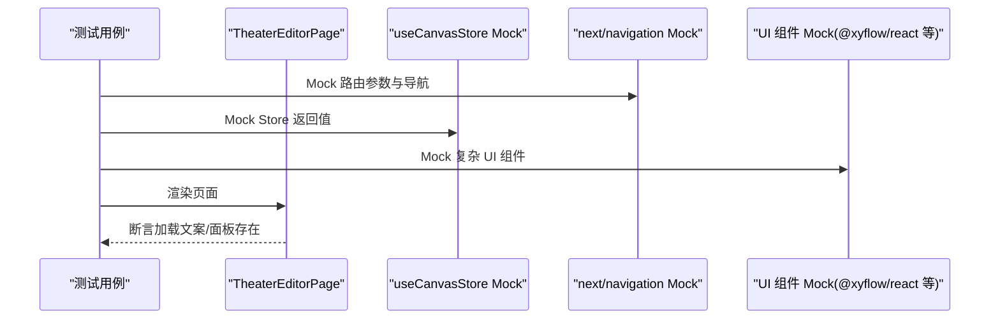
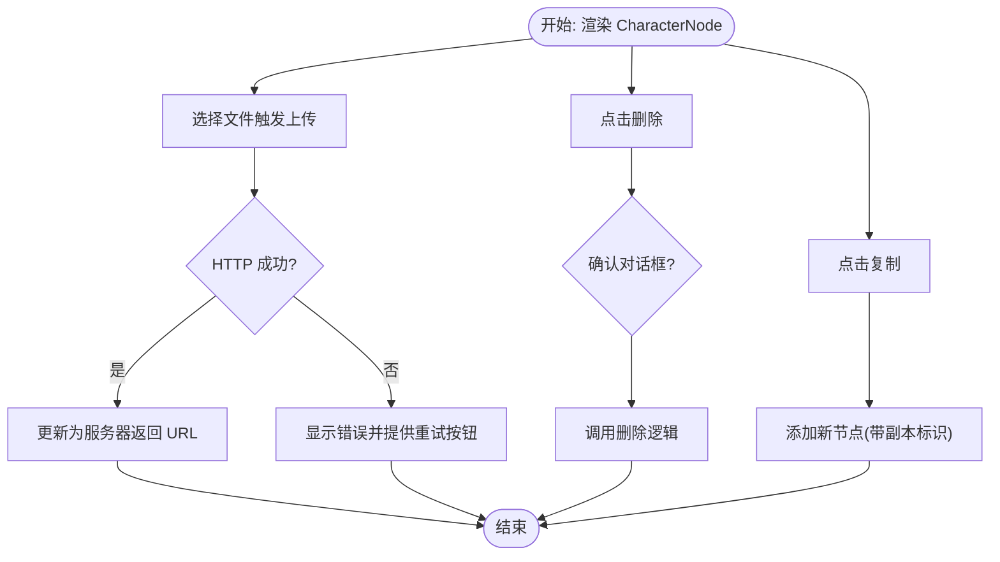
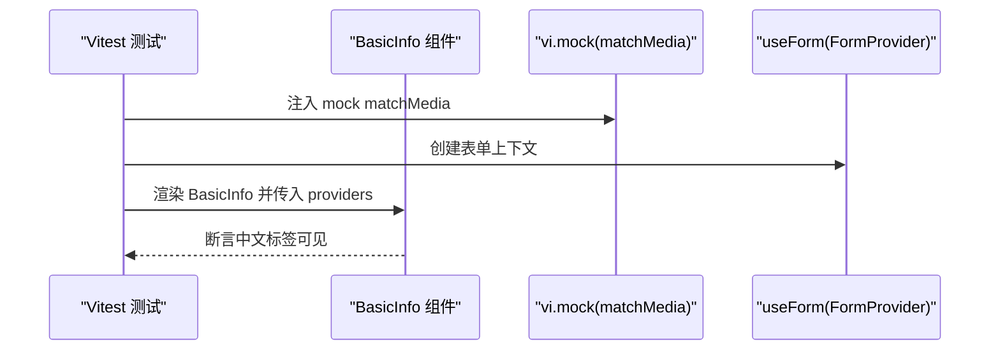
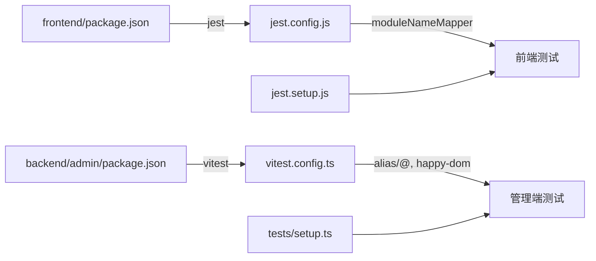

# 测试策略

<cite>
**本文引用的文件**
- [frontend/package.json](file://frontend/package.json)
- [frontend/jest.config.js](file://frontend/jest.config.js)
- [frontend/jest.setup.js](file://frontend/jest.setup.js)
- [frontend/src/store/__tests__/useCanvasStore.test.ts](file://frontend/src/store/__tests__/useCanvasStore.test.ts)
- [frontend/src/app/theater/[id]/__tests__/page.test.tsx](file://frontend/src/app/theater/[id]/__tests__/page.test.tsx)
- [frontend/src/components/canvas/__tests__/CharacterNode.test.tsx](file://frontend/src/components/canvas/__tests__/CharacterNode.test.tsx)
- [backend/admin/package.json](file://backend/admin/package.json)
- [backend/admin/vitest.config.ts](file://backend/admin/vitest.config.ts)
- [backend/admin/src/tests/setup.ts](file://backend/admin/src/tests/setup.ts)
- [backend/admin/src/tests/unit/AgentForm.test.tsx](file://backend/admin/src/tests/unit/AgentForm.test.tsx)
- [backend/admin/src/tests/unit/api-utils.test.ts](file://backend/admin/src/tests/unit/api-utils.test.ts)
</cite>

## 目录
1. [引言](#引言)
2. [项目结构](#项目结构)
3. [核心组件](#核心组件)
4. [架构总览](#架构总览)
5. [详细组件分析](#详细组件分析)
6. [依赖分析](#依赖分析)
7. [性能考量](#性能考量)
8. [故障排查指南](#故障排查指南)
9. [结论](#结论)
10. [附录](#附录)

## 引言
本测试策略文档面向 Infinite Game 项目的前端与后端（管理端）测试体系，目标是建立覆盖单元测试、集成测试与端到端测试的完整方案，并针对 AI 服务与异步场景给出专项建议。文档涵盖测试框架选择与配置、测试设计原则（含覆盖率、Mock 策略、异步处理）、集成测试实施方案（端到端、API、数据库）、AI 服务测试的特殊考虑（模拟响应、数据准备、性能测试）、测试自动化流程（CI/CD 集成、报告生成、质量门禁），以及测试最佳实践（数据管理、环境隔离、维护策略）。

## 项目结构
Infinite Game 采用前后端分离架构：
- 前端：Next.js 应用，使用 Jest + Testing Library 进行单元与组件测试。
- 后端管理端（Admin Dashboard）：Next.js 应用，使用 Vitest + happy-dom 进行单元与组件测试。
- 数据库：通过 Alembic 迁移管理，支持本地开发与 CI 环境的数据库初始化。
- AI 服务：由外部 LLM 提供商与内部工具链构成，测试中需进行响应模拟与性能评估。

图表来源
- [frontend/package.json:1-92](file://frontend/package.json#L1-L92)
- [frontend/jest.config.js:1-20](file://frontend/jest.config.js#L1-L20)
- [backend/admin/package.json:1-73](file://backend/admin/package.json#L1-L73)
- [backend/admin/vitest.config.ts:1-16](file://backend/admin/vitest.config.ts#L1-L16)

章节来源
- [frontend/package.json:1-92](file://frontend/package.json#L1-L92)
- [backend/admin/package.json:1-73](file://backend/admin/package.json#L1-L73)

## 核心组件
- 前端测试框架与配置
  - Jest：用于 DOM 环境下的组件与页面测试，配置了模块别名、JSDOM 环境与测试入口。
  - Testing Library：提供 DOM 断言与交互模拟能力。
- 后端管理端测试框架与配置
  - Vitest：用于快速的单元测试，配合 happy-dom 模拟浏览器环境。
  - React 插件：在管理端 Next.js 中启用 React 组件测试。
- 测试工具与辅助
  - 前端：Jest + @testing-library/react/jest-dom；后端：Vitest + @testing-library/react。
  - Mock 策略：对第三方库（如 @xyflow/react、uuid、ResizeObserver）、API 层（如 theaterApi）与路由上下文进行模块级或全局级 Mock。

章节来源
- [frontend/jest.config.js:1-20](file://frontend/jest.config.js#L1-L20)
- [frontend/jest.setup.js:1-3](file://frontend/jest.setup.js#L1-L3)
- [backend/admin/vitest.config.ts:1-16](file://backend/admin/vitest.config.ts#L1-L16)
- [backend/admin/src/tests/setup.ts:1-2](file://backend/admin/src/tests/setup.ts#L1-L2)

## 架构总览
下图展示了测试层与业务层的交互关系，以及 Mock 与外部依赖的注入方式：

图表来源
- [frontend/src/store/__tests__/useCanvasStore.test.ts:1-124](file://frontend/src/store/__tests__/useCanvasStore.test.ts#L1-L124)
- [frontend/src/app/theater/[id]/__tests__/page.test.tsx:1-98](file://frontend/src/app/theater/[id]/__tests__/page.test.tsx#L1-L98)
- [frontend/src/components/canvas/__tests__/CharacterNode.test.tsx:1-182](file://frontend/src/components/canvas/__tests__/CharacterNode.test.tsx#L1-L182)

## 详细组件分析

### 前端测试：Canvas Store 自动保存与异步行为
该测试关注自动保存的防抖逻辑、失败重试与大规模节点编辑的稳定性。

图表来源
- [frontend/src/store/__tests__/useCanvasStore.test.ts:13-104](file://frontend/src/store/__tests__/useCanvasStore.test.ts#L13-L104)

章节来源
- [frontend/src/store/__tests__/useCanvasStore.test.ts:1-124](file://frontend/src/store/__tests__/useCanvasStore.test.ts#L1-L124)

### 前端测试：剧院编辑页面集成测试
该测试验证页面在加载态、UI 渲染与依赖 Mock 的情况下是否正确呈现。

图表来源
- [frontend/src/app/theater/[id]/__tests__/page.test.tsx:55-97](file://frontend/src/app/theater/[id]/__tests__/page.test.tsx#L55-L97)

章节来源
- [frontend/src/app/theater/[id]/__tests__/page.test.tsx:1-98](file://frontend/src/app/theater/[id]/__tests__/page.test.tsx#L1-L98)

### 前端测试：角色节点组件测试
该测试覆盖上传成功/失败、删除、复制、连接句柄渲染等多分支逻辑。

图表来源
- [frontend/src/components/canvas/__tests__/CharacterNode.test.tsx:79-161](file://frontend/src/components/canvas/__tests__/CharacterNode.test.tsx#L79-L161)

章节来源
- [frontend/src/components/canvas/__tests__/CharacterNode.test.tsx:1-182](file://frontend/src/components/canvas/__tests__/CharacterNode.test.tsx#L1-L182)

### 后端管理端测试：表单组件与工具函数
- 表单组件测试：通过 FormProvider 包裹并在测试中注入 useForm，验证渲染文本与字段可见性。
- 工具函数测试：对字符串/数组解析逻辑进行边界条件覆盖。

图表来源
- [backend/admin/src/tests/unit/AgentForm.test.tsx:38-54](file://backend/admin/src/tests/unit/AgentForm.test.tsx#L38-L54)

章节来源
- [backend/admin/src/tests/unit/AgentForm.test.tsx:1-55](file://backend/admin/src/tests/unit/AgentForm.test.tsx#L1-L55)
- [backend/admin/src/tests/unit/api-utils.test.ts:1-22](file://backend/admin/src/tests/unit/api-utils.test.ts#L1-L22)

## 依赖分析
- 前端依赖关系
  - Jest 作为测试运行器，结合 @testing-library/react/jest-dom 提供 DOM 断言。
  - 模块别名 @/* 映射至 src，便于统一导入路径。
- 后端管理端依赖关系
  - Vitest 作为测试运行器，happy-dom 提供浏览器环境模拟。
  - React 插件与别名配置确保组件测试可用。
- 共同依赖
  - Mock 策略广泛应用于第三方 UI 库、路由上下文与 API 客户端，保证测试可重复性与隔离性。

图表来源
- [frontend/package.json:1-92](file://frontend/package.json#L1-L92)
- [frontend/jest.config.js:1-20](file://frontend/jest.config.js#L1-L20)
- [backend/admin/package.json:1-73](file://backend/admin/package.json#L1-L73)
- [backend/admin/vitest.config.ts:1-16](file://backend/admin/vitest.config.ts#L1-L16)

章节来源
- [frontend/package.json:1-92](file://frontend/package.json#L1-L92)
- [backend/admin/package.json:1-73](file://backend/admin/package.json#L1-L73)

## 性能考量
- 异步与定时器
  - 使用 jest.advanceTimersByTime 控制定时器推进，验证防抖与节流逻辑。
  - 对微任务/宏任务进行 Promise.resolve 刷新，确保异步流程稳定。
- 大规模操作
  - 在 Canvas Store 测试中模拟 200 个节点的连续编辑，验证无数据丢失与状态一致性。
- UI 组件复杂度
  - 对 @xyflow/react 等重型组件进行最小化 Mock，避免真实渲染带来的性能开销。

章节来源
- [frontend/src/store/__tests__/useCanvasStore.test.ts:29-83](file://frontend/src/store/__tests__/useCanvasStore.test.ts#L29-L83)
- [frontend/src/components/canvas/__tests__/CharacterNode.test.tsx:108-136](file://frontend/src/components/canvas/__tests__/CharacterNode.test.tsx#L108-L136)

## 故障排查指南
- 常见问题
  - ResizeObserver 未定义：在测试入口中注入全局实现以避免组件渲染报错。
  - matchMedia 未定义：在 Vitest 测试中为 window.matchMedia 提供 Mock。
  - 第三方组件无法渲染：对 @xyflow/react、uuid 等进行模块级 Mock。
  - 路由上下文缺失：对 next/navigation 进行函数级 Mock。
- 排查步骤
  - 确认测试环境配置（JSDOM/happy-dom）与模块别名映射。
  - 检查 Mock 的作用域与时机，避免在 beforeEach 之后被意外重置。
  - 对异步流程增加显式 Promise 刷新与定时器推进。

章节来源
- [frontend/src/app/theater/[id]/__tests__/page.test.tsx:48-53](file://frontend/src/app/theater/[id]/__tests__/page.test.tsx#L48-L53)
- [backend/admin/src/tests/unit/AgentForm.test.tsx:7-20](file://backend/admin/src/tests/unit/AgentForm.test.tsx#L7-L20)
- [frontend/src/components/canvas/__tests__/CharacterNode.test.tsx:12-15](file://frontend/src/components/canvas/__tests__/CharacterNode.test.tsx#L12-L15)

## 结论
本测试策略基于现有 Jest 与 Vitest 配置，结合 Testing Library 的断言能力，形成了覆盖前端组件、状态管理与后端工具函数的测试体系。通过合理的 Mock 策略与异步处理，能够在不依赖真实后端与数据库的情况下，稳定地验证功能与边界条件。后续可在 CI/CD 中引入覆盖率统计与质量门禁，并扩展端到端测试与数据库集成测试，以进一步提升质量保障水平。

## 附录

### 单元测试框架与配置
- 前端（Jest）
  - 运行命令：test/test:watch
  - 环境：JSDOM
  - 模块别名：@/*
  - 设置文件：jest.setup.js
- 后端管理端（Vitest）
  - 运行命令：Vitest 默认脚本
  - 环境：happy-dom
  - 模块别名：@/*
  - 设置文件：tests/setup.ts

章节来源
- [frontend/package.json:5-12](file://frontend/package.json#L5-L12)
- [frontend/jest.config.js:10-16](file://frontend/jest.config.js#L10-L16)
- [frontend/jest.setup.js:1-3](file://frontend/jest.setup.js#L1-L3)
- [backend/admin/package.json:5-10](file://backend/admin/package.json#L5-L10)
- [backend/admin/vitest.config.ts:7-14](file://backend/admin/vitest.config.ts#L7-L14)
- [backend/admin/src/tests/setup.ts:1-2](file://backend/admin/src/tests/setup.ts#L1-L2)

### 测试用例设计原则
- 覆盖率要求
  - 建议：语句覆盖率 ≥ 80%，分支覆盖率 ≥ 70%，函数覆盖率 ≥ 80%，行覆盖率 ≥ 80%。
- Mock 策略
  - 优先使用模块级 Mock，减少真实依赖。
  - 对第三方库（如 @xyflow/react、uuid）与全局对象（如 ResizeObserver、matchMedia）进行集中 Mock。
- 异步测试处理
  - 使用 fake timers 与 Promise 刷新，确保异步流程稳定可控。
  - 对上传/保存等耗时操作进行超时与重试逻辑验证。

章节来源
- [frontend/src/store/__tests__/useCanvasStore.test.ts:14-27](file://frontend/src/store/__tests__/useCanvasStore.test.ts#L14-L27)
- [frontend/src/components/canvas/__tests__/CharacterNode.test.tsx:80-108](file://frontend/src/components/canvas/__tests__/CharacterNode.test.tsx#L80-L108)

### 集成测试实施方案
- 端到端测试
  - 建议：引入 Playwright/Cypress，在本地或容器化环境中启动 Next.js 开发服务器，执行用户故事级流程。
- API 测试
  - 建议：对后端管理端的 Next.js API 路由进行独立测试，使用 supertest 或直接调用 handler。
- 数据库测试
  - 建议：在 CI 中使用临时数据库实例，迁移后执行测试，结束后清理数据。

[本节为概念性指导，无需代码来源]

### AI 服务测试的特殊考虑
- 模拟 AI 响应
  - 使用 Mock 将 LLM/工具调用替换为可控响应，覆盖正常、错误与超时场景。
- 测试数据准备
  - 准备典型提示模板与节点数据，确保不同模型与能力组合可被覆盖。
- 性能测试
  - 对长对话与批量生成场景进行吞吐与延迟评估，结合定时器与并发控制。

[本节为概念性指导，无需代码来源]

### 测试自动化流程
- CI/CD 集成
  - 在流水线中分别执行前端与后端测试，收集覆盖率报告。
- 测试报告生成
  - Jest：默认 HTML 报告；Vitest：HTML/JSON 报告。
- 质量门禁
  - 设定最低覆盖率阈值与失败即停策略，确保主干分支质量。

[本节为概念性指导，无需代码来源]

### 测试最佳实践
- 测试数据管理
  - 使用固定 ID 与快照（如 UUID Mock）保证可重复性。
- 测试环境隔离
  - 使用独立的测试数据库与存储桶，避免污染生产数据。
- 测试维护策略
  - 对频繁变更的 UI 组件采用快照测试与最小化 Mock，降低维护成本。

[本节为概念性指导，无需代码来源]