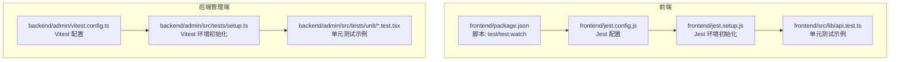
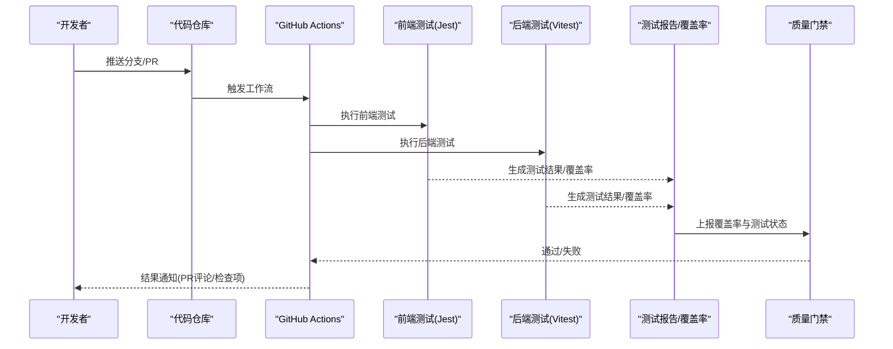
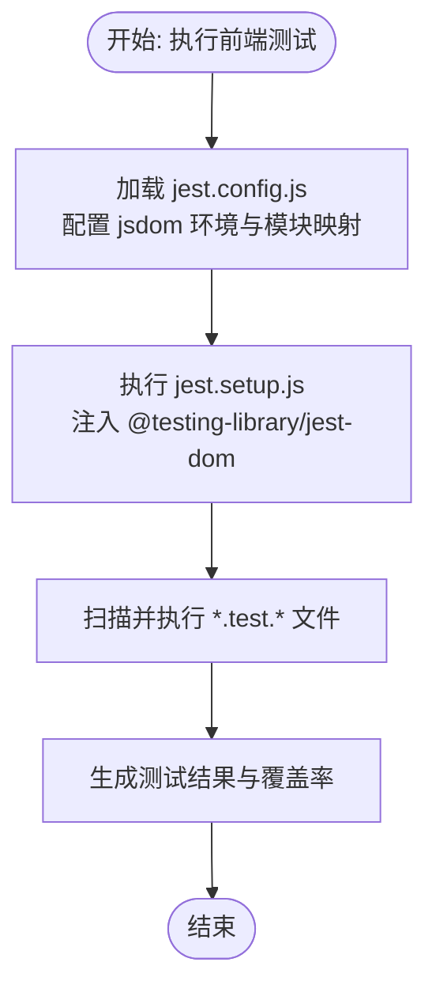
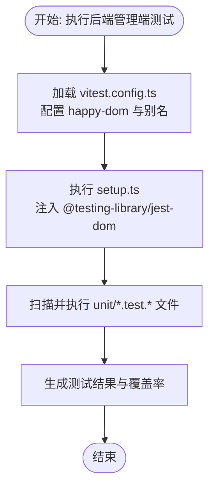
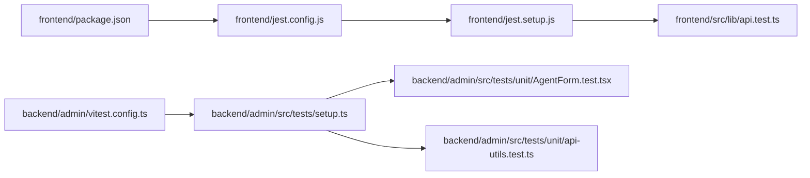

# 测试自动化

<cite>
**本文引用的文件**
- [backend/admin/vitest.config.ts](file://backend/admin/vitest.config.ts)
- [backend/admin/src/tests/setup.ts](file://backend/admin/src/tests/setup.ts)
- [backend/admin/src/tests/unit/AgentForm.test.tsx](file://backend/admin/src/tests/unit/AgentForm.test.tsx)
- [backend/admin/src/tests/unit/api-utils.test.ts](file://backend/admin/src/tests/unit/api-utils.test.ts)
- [frontend/jest.config.js](file://frontend/jest.config.js)
- [frontend/jest.setup.js](file://frontend/jest.setup.js)
- [frontend/package.json](file://frontend/package.json)
- [frontend/src/lib/api.test.ts](file://frontend/src/lib/api.test.ts)
</cite>

## 目录
1. [简介](#简介)
2. [项目结构](#项目结构)
3. [核心组件](#核心组件)
4. [架构总览](#架构总览)
5. [详细组件分析](#详细组件分析)
6. [依赖分析](#依赖分析)
7. [性能考虑](#性能考虑)
8. [故障排查指南](#故障排查指南)
9. [结论](#结论)
10. [附录](#附录)

## 简介
本实施文档面向 Infinite Game 的测试自动化落地，聚焦于 CI/CD 流水线中的测试集成与质量门禁，涵盖以下主题：
- GitHub Actions 配置建议（触发条件、并行执行、矩阵构建）
- 测试报告生成与质量门禁（覆盖率阈值、测试失败处理、通知机制）
- 测试环境管理（测试数据库、AI 服务 Mock、测试数据同步）
- 性能测试自动化、负载测试与安全测试集成思路
- 测试维护与更新策略（用例重构、环境升级）

当前仓库已具备前端 Jest 与后端 Vitest 的基础测试配置，本文在不改变现有实现的前提下，给出可直接落地的 CI/CD 集成方案与最佳实践。

## 项目结构
- 前端采用 Next.js + Jest 测试框架，通过 jest.config.js 与 jest.setup.js 进行环境与断言初始化。
- 后端管理端采用 Vitest + happy-dom，通过 vitest.config.ts 配置环境、全局设置与别名。
- 单元测试分布在前端与后端各自 tests 目录中，遵循“按功能模块划分”的组织方式。

**图表来源**
- [frontend/package.json:1-92](file://frontend/package.json#L1-L92)
- [frontend/jest.config.js:1-20](file://frontend/jest.config.js#L1-L20)
- [frontend/jest.setup.js:1-3](file://frontend/jest.setup.js#L1-L3)
- [frontend/src/lib/api.test.ts:1-57](file://frontend/src/lib/api.test.ts#L1-L57)
- [backend/admin/vitest.config.ts:1-16](file://backend/admin/vitest.config.ts#L1-L16)
- [backend/admin/src/tests/setup.ts:1-2](file://backend/admin/src/tests/setup.ts#L1-L2)
- [backend/admin/src/tests/unit/AgentForm.test.tsx:1-55](file://backend/admin/src/tests/unit/AgentForm.test.tsx#L1-L55)
- [backend/admin/src/tests/unit/api-utils.test.ts:1-22](file://backend/admin/src/tests/unit/api-utils.test.ts#L1-L22)

**章节来源**
- [frontend/package.json:1-92](file://frontend/package.json#L1-L92)
- [frontend/jest.config.js:1-20](file://frontend/jest.config.js#L1-L20)
- [frontend/jest.setup.js:1-3](file://frontend/jest.setup.js#L1-L3)
- [backend/admin/vitest.config.ts:1-16](file://backend/admin/vitest.config.ts#L1-L16)
- [backend/admin/src/tests/setup.ts:1-2](file://backend/admin/src/tests/setup.ts#L1-L2)

## 核心组件
- 前端测试运行器：Jest（Next.js 集成），通过 jest.config.js 指定测试环境与模块映射；通过 jest.setup.js 注入 @testing-library/jest-dom 断言扩展。
- 后端管理端测试运行器：Vitest，使用 happy-dom 作为 DOM 环境，支持 setupFiles 引入全局初始化逻辑。
- 覆盖量与报告：当前仓库未见覆盖率或报告输出配置，可在 CI 中统一接入。
- 质量门禁：当前仓库未见覆盖率阈值或质量门禁配置，可在 CI 中新增。

**章节来源**
- [frontend/jest.config.js:1-20](file://frontend/jest.config.js#L1-L20)
- [frontend/jest.setup.js:1-3](file://frontend/jest.setup.js#L1-L3)
- [backend/admin/vitest.config.ts:1-16](file://backend/admin/vitest.config.ts#L1-L16)
- [backend/admin/src/tests/setup.ts:1-2](file://backend/admin/src/tests/setup.ts#L1-L2)

## 架构总览
下图展示从代码提交到测试执行与结果反馈的整体流程，适用于 GitHub Actions 工作流：

[此图为概念性流程示意，无需图表来源]

## 详细组件分析

### 前端测试配置与用例
- 配置要点
  - jest.config.js 使用 next/jest 创建器加载 Next.js 配置，设置测试环境为 jsdom，启用模块别名映射。
  - jest.setup.js 引入 @testing-library/jest-dom，提供丰富的断言能力。
  - package.json 提供 test 与 test:watch 脚本，便于本地与 CI 执行。
- 典型用例
  - api.test.ts 展示请求拦截器附加 Authorization 头、响应拦截器对 401 的处理与本地存储清理等行为验证。
- 并行与隔离
  - Jest 默认以文件为粒度进行并发执行；建议将大型用例拆分为独立文件，避免共享状态干扰。

**图表来源**
- [frontend/jest.config.js:1-20](file://frontend/jest.config.js#L1-L20)
- [frontend/jest.setup.js:1-3](file://frontend/jest.setup.js#L1-L3)
- [frontend/package.json:1-92](file://frontend/package.json#L1-L92)
- [frontend/src/lib/api.test.ts:1-57](file://frontend/src/lib/api.test.ts#L1-L57)

**章节来源**
- [frontend/jest.config.js:1-20](file://frontend/jest.config.js#L1-L20)
- [frontend/jest.setup.js:1-3](file://frontend/jest.setup.js#L1-L3)
- [frontend/package.json:1-92](file://frontend/package.json#L1-L92)
- [frontend/src/lib/api.test.ts:1-57](file://frontend/src/lib/api.test.ts#L1-L57)

### 后端管理端测试配置与用例
- 配置要点
  - vitest.config.ts 指定 happy-dom 环境、全局变量开启、setupFiles 以及 @ 到 src 的路径别名。
  - setup.ts 引入 @testing-library/jest-dom，确保 DOM 断言可用。
- 典型用例
  - AgentForm.test.tsx 展示表单组件渲染、表单上下文注入与媒体查询 mock。
  - api-utils.test.ts 展示工具函数解析模型列表的多种输入形态。
- 并行与隔离
  - Vitest 默认以文件为粒度并发执行；建议将涉及全局状态（如 window.matchMedia）的用例集中管理并在用例间避免互相污染。

**图表来源**
- [backend/admin/vitest.config.ts:1-16](file://backend/admin/vitest.config.ts#L1-L16)
- [backend/admin/src/tests/setup.ts:1-2](file://backend/admin/src/tests/setup.ts#L1-L2)
- [backend/admin/src/tests/unit/AgentForm.test.tsx:1-55](file://backend/admin/src/tests/unit/AgentForm.test.tsx#L1-L55)
- [backend/admin/src/tests/unit/api-utils.test.ts:1-22](file://backend/admin/src/tests/unit/api-utils.test.ts#L1-L22)

**章节来源**
- [backend/admin/vitest.config.ts:1-16](file://backend/admin/vitest.config.ts#L1-L16)
- [backend/admin/src/tests/setup.ts:1-2](file://backend/admin/src/tests/setup.ts#L1-L2)
- [backend/admin/src/tests/unit/AgentForm.test.tsx:1-55](file://backend/admin/src/tests/unit/AgentForm.test.tsx#L1-L55)
- [backend/admin/src/tests/unit/api-utils.test.ts:1-22](file://backend/admin/src/tests/unit/api-utils.test.ts#L1-L22)

### 测试报告生成与质量门禁
- 报告生成
  - 建议在 CI 中启用覆盖率收集与测试报告导出（例如 JUnit XML、Cobertura/Clover XML），以便与平台集成。
- 质量门禁
  - 建议设置覆盖率阈值（如语句、分支、函数、行）与测试失败阈值，未达标则阻断合并。
  - 可结合平台的“要求检查”或“代码扫描规则”实现门禁。
- 通知机制
  - 在 PR 或分支保护规则中启用通知（邮件、聊天工具），将测试状态与报告链接一并发送。

[本节为通用实践说明，无需章节来源]

### 测试环境管理策略
- 测试数据库
  - 建议为测试环境准备独立数据库实例或容器化数据库，使用迁移脚本初始化结构与种子数据。
- AI 服务 Mock
  - 对外部 LLM/图像生成等服务进行接口层 Mock，确保测试稳定与可重复。
- 测试数据同步
  - 通过迁移脚本或种子数据在测试前注入固定数据集，保证用例可预测性。

[本节为通用实践说明，无需章节来源]

### 性能测试自动化、负载测试与安全测试集成
- 性能测试
  - 将性能基准测试纳入 CI，记录关键指标（首屏时间、交互延迟），并设置阈值告警。
- 负载测试
  - 使用专用工具（如 k6、Artillery）编写场景脚本，在预生产环境执行，CI 中仅触发与结果上报。
- 安全测试
  - 集成 SAST/DAST 工具（如 ESLint 安全规则、OWASP ZAP），在 CI 中自动扫描并阻断高危问题。

[本节为通用实践说明，无需章节来源]

### 测试维护与更新策略
- 用例重构
  - 采用“用例即文档”原则，保持用例命名清晰、断言明确；定期重构复杂用例，拆分关注点。
- 环境升级
  - 统一升级测试框架版本与依赖，优先在 develop 分支验证，再合并至主干。
- 回归策略
  - 对核心模块建立回归清单，每次变更至少运行关键路径用例。

[本节为通用实践说明，无需章节来源]

## 依赖分析
- 前端依赖关系
  - jest.config.js 依赖 next/jest 与 jest-environment-jsdom；jest.setup.js 依赖 @testing-library/jest-dom。
  - package.json 提供 test 脚本，驱动测试执行。
- 后端依赖关系
  - vitest.config.ts 依赖 @vitejs/plugin-react 与 happy-dom；setup.ts 依赖 @testing-library/jest-dom。
- 耦合与内聚
  - 当前各模块测试配置相对独立，耦合度低，便于并行执行与扩展。

**图表来源**
- [frontend/package.json:1-92](file://frontend/package.json#L1-L92)
- [frontend/jest.config.js:1-20](file://frontend/jest.config.js#L1-L20)
- [frontend/jest.setup.js:1-3](file://frontend/jest.setup.js#L1-L3)
- [frontend/src/lib/api.test.ts:1-57](file://frontend/src/lib/api.test.ts#L1-L57)
- [backend/admin/vitest.config.ts:1-16](file://backend/admin/vitest.config.ts#L1-L16)
- [backend/admin/src/tests/setup.ts:1-2](file://backend/admin/src/tests/setup.ts#L1-L2)
- [backend/admin/src/tests/unit/AgentForm.test.tsx:1-55](file://backend/admin/src/tests/unit/AgentForm.test.tsx#L1-L55)
- [backend/admin/src/tests/unit/api-utils.test.ts:1-22](file://backend/admin/src/tests/unit/api-utils.test.ts#L1-L22)

**章节来源**
- [frontend/package.json:1-92](file://frontend/package.json#L1-L92)
- [frontend/jest.config.js:1-20](file://frontend/jest.config.js#L1-L20)
- [frontend/jest.setup.js:1-3](file://frontend/jest.setup.js#L1-L3)
- [backend/admin/vitest.config.ts:1-16](file://backend/admin/vitest.config.ts#L1-L16)
- [backend/admin/src/tests/setup.ts:1-2](file://backend/admin/src/tests/setup.ts#L1-L2)

## 性能考虑
- 并行执行
  - 前端与后端测试分别在独立工作流或步骤中并行执行，缩短整体耗时。
- 缓存与复用
  - 缓存 node_modules 与测试缓存目录，减少重复安装与编译时间。
- 选择性执行
  - 基于变更集（diff）仅运行受影响模块的测试，降低 CI 成本。

[本节为通用指导，无需章节来源]

## 故障排查指南
- 常见问题
  - 测试环境缺失：确认 jest.setup.js 与 setup.ts 是否正确引入 @testing-library/jest-dom。
  - 模块别名不生效：检查 jest.config.js 与 vitest.config.ts 的 moduleNameMapper 与 alias 设置。
  - 全局对象未定义：如 window.matchMedia，需在用例中显式 mock。
- 定位方法
  - 在本地使用 test:watch 脚本快速定位失败用例；在 CI 中开启详细日志与报告导出。
- 修复建议
  - 将跨用例共享的 mock 收敛到 setupFiles；拆分大用例，避免全局状态污染。

**章节来源**
- [frontend/jest.setup.js:1-3](file://frontend/jest.setup.js#L1-L3)
- [backend/admin/src/tests/setup.ts:1-2](file://backend/admin/src/tests/setup.ts#L1-L2)
- [backend/admin/src/tests/unit/AgentForm.test.tsx:1-55](file://backend/admin/src/tests/unit/AgentForm.test.tsx#L1-L55)

## 结论
本实施文档基于现有前端 Jest 与后端 Vitest 配置，给出了 CI/CD 流水线中的测试集成方案与质量门禁建议。通过并行执行、报告与门禁、Mock 与测试数据库管理，可显著提升测试稳定性与反馈效率。建议尽快在 CI 中接入覆盖率与报告导出，并设置合理的质量门禁阈值，以保障代码质量与交付节奏。

## 附录
- 建议的 CI 工作流字段与步骤
  - 触发条件：push 到 develop/main，打开/更新 PR。
  - 步骤：安装依赖、启动测试数据库容器、执行前端与后端测试、收集覆盖率与报告、质量门禁判定、通知。
- 质量门禁阈值参考
  - 行覆盖率：≥80%
  - 分支覆盖率：≥70%
  - 函数覆盖率：≥80%
  - 语句覆盖率：≥80%
  - 测试失败数：0

[本节为通用实践说明，无需章节来源]