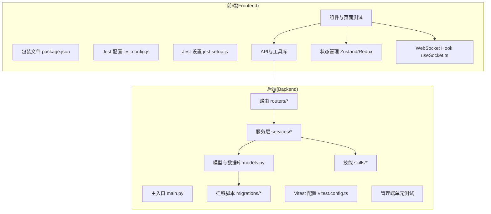
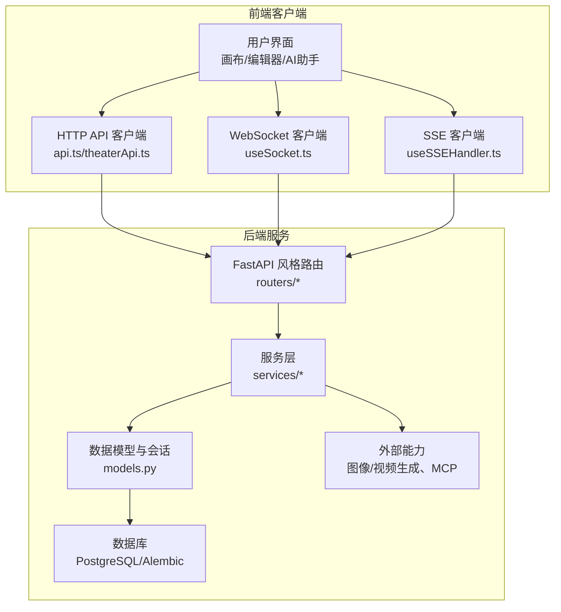
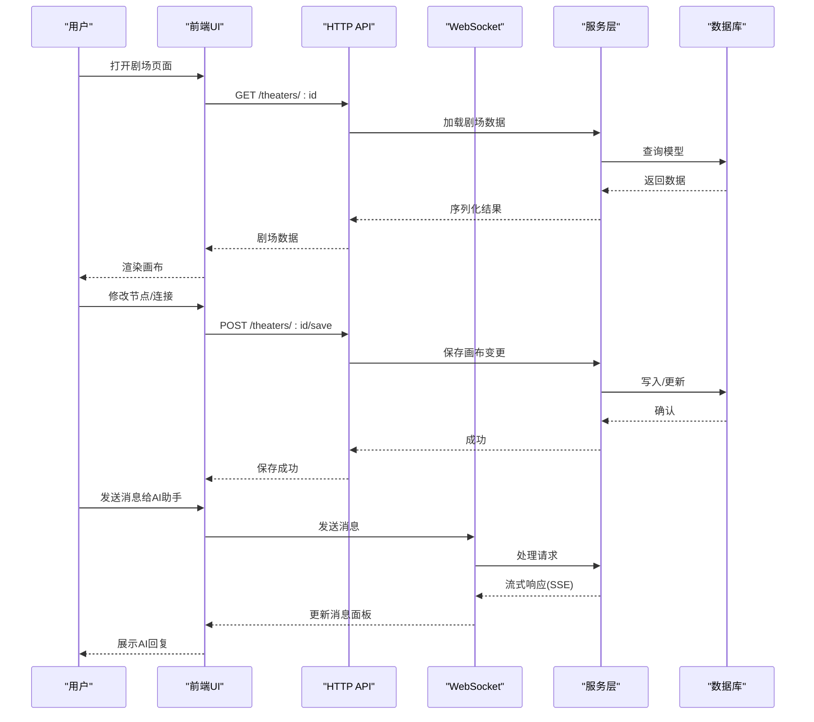
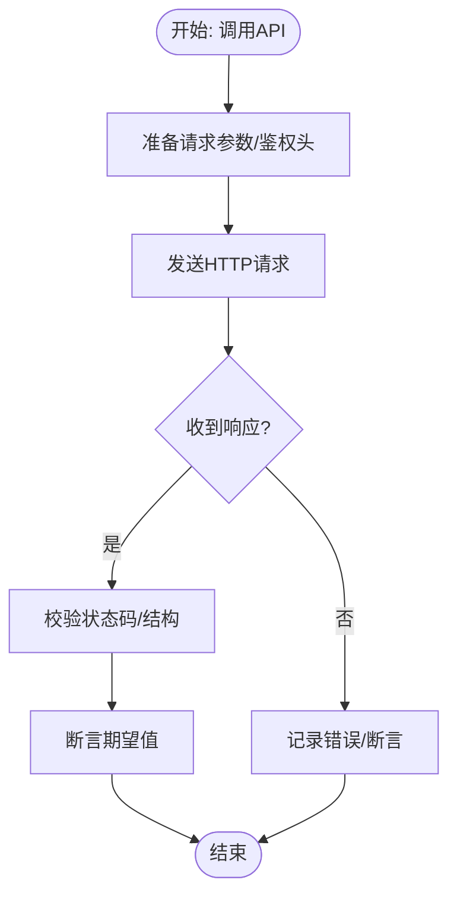
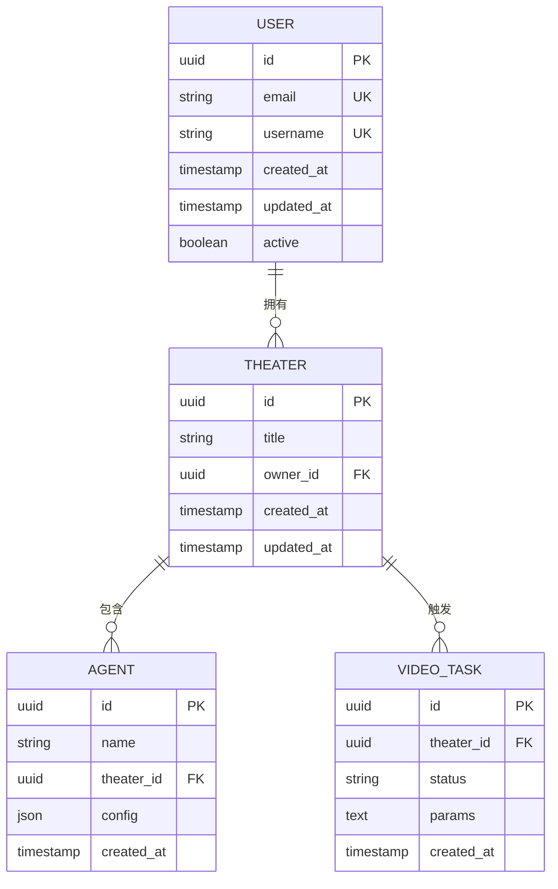
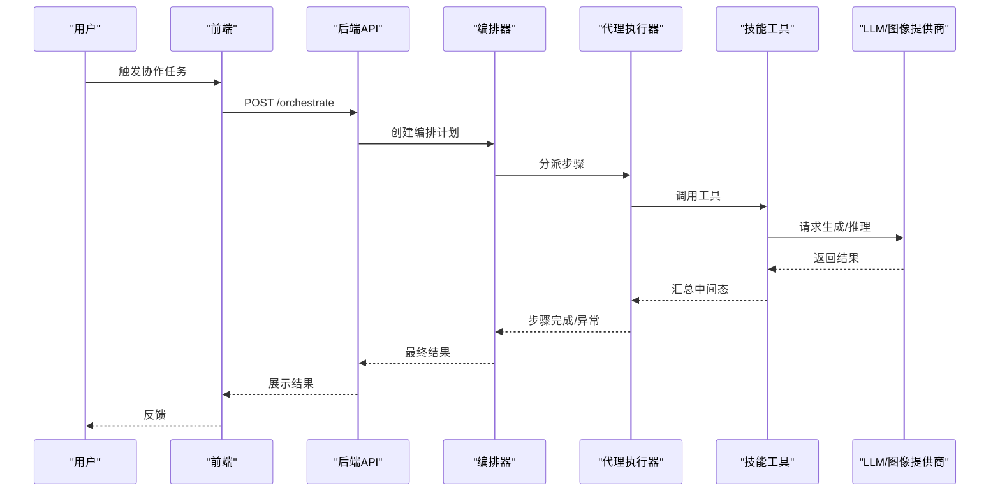
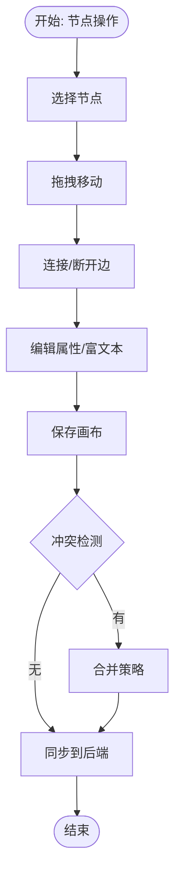
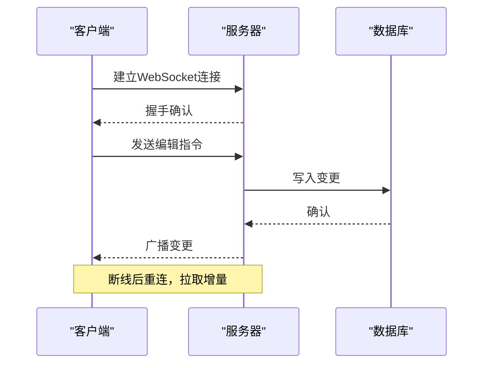
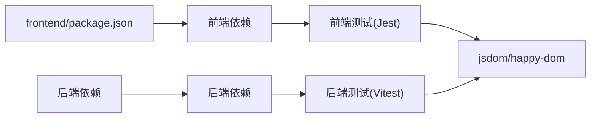

# 集成测试

<cite>
**本文引用的文件**
- [前端 jest.config.js](file://frontend/jest.config.js)
- [前端 jest.setup.js](file://frontend/jest.setup.js)
- [后端管理 vitest.config.ts](file://backend/admin/vitest.config.ts)
- [后端管理 setup.ts](file://backend/admin/src/tests/setup.ts)
- [后端管理 AgentForm.test.tsx](file://backend/admin/src/tests/unit/AgentForm.test.tsx)
- [后端管理 api-utils.test.ts](file://backend/admin/src/tests/unit/api-utils.test.ts)
- [前端 剧场页面测试 page.test.tsx](file://frontend/src/app/theater/[id]/__tests__/page.test.tsx)
- [前端 角色节点测试 CharacterNode.test.tsx](file://frontend/src/components/canvas/__tests__/CharacterNode.test.tsx)
- [前端 包装文件 package.json](file://frontend/package.json)
- [后端主入口 main.py](file://backend/main.py)
- [后端数据库 models.py](file://backend/models.py)
- [后端路由 routers/](file://backend/routers/)
- [后端服务 services/](file://backend/services/)
- [后端技能 skills/](file://backend/skills/)
- [前端画布组件 TheaterCanvas.tsx](file://frontend/src/components/TheaterCanvas.tsx)
- [前端画布组件 CharacterNode.tsx](file://frontend/src/components/canvas/CharacterNode.tsx)
- [前端画布组件 ScriptNode.tsx](file://frontend/src/components/canvas/ScriptNode.tsx)
- [前端画布组件 StoryboardNode.tsx](file://frontend/src/components/canvas/StoryboardNode.tsx)
- [前端画布组件 VideoNode.tsx](file://frontend/src/components/canvas/VideoNode.tsx)
- [前端画布组件 CustomEdge.tsx](file://frontend/src/components/canvas/CustomEdge.tsx)
- [前端画布组件 AIAssistantPanel.tsx](file://frontend/src/components/canvas/AIAssistantPanel.tsx)
- [前端画布组件 Sidebar.tsx](file://frontend/src/components/canvas/Sidebar.tsx)
- [前端画布组件 ZoomControls.tsx](file://frontend/src/components/canvas/ZoomControls.tsx)
- [前端画布组件 ScriptEditor.tsx](file://frontend/src/components/canvas/ScriptEditor.tsx)
- [前端画布组件 PivotEditor.tsx](file://frontend/src/components/canvas/pivot/PivotEditor.tsx)
- [前端画布组件 PivotTable.tsx](file://frontend/src/components/canvas/pivot/PivotTable.tsx)
- [前端画布组件 usePivotEngine.ts](file://frontend/src/components/canvas/pivot/usePivotEngine.ts)
- [前端画布组件 useCanvasStore.ts](file://frontend/src/store/useCanvasStore.ts)
- [前端画布组件 useAIAssistantStore.ts](file://frontend/src/store/useAIAssistantStore.ts)
- [前端画布组件 useSocket.ts](file://frontend/src/hooks/useSocket.ts)
- [前端画布组件 useAutoLayout.ts](file://frontend/src/app/theater/[id]/hooks/useAutoLayout.ts)
- [前端画布组件 useCanvasDragDrop.ts](file://frontend/src/app/theater/[id]/hooks/useCanvasDragDrop.ts)
- [前端画布组件 useCanvasShortcuts.ts](file://frontend/src/app/theater/[id]/hooks/useCanvasShortcuts.ts)
- [前端画布组件 useCanvasSnapping.ts](file://frontend/src/app/theater/[id]/hooks/useCanvasSnapping.ts)
- [前端画布组件 useQuickAddMenu.ts](file://frontend/src/app/theater/[id]/hooks/useQuickAddMenu.ts)
- [前端画布组件 useTheaterLoading.ts](file://frontend/src/app/theater/[id]/hooks/useTheaterLoading.ts)
- [前端画布组件 useSSEHandler.ts](file://frontend/src/components/ai-assistant/hooks/useSSEHandler.ts)
- [前端画布组件 useSessionManager.ts](file://frontend/src/components/ai-assistant/hooks/useSessionManager.ts)
- [前端画布组件 api.ts](file://frontend/src/lib/api.ts)
- [前端画布组件 theaterApi.ts](file://frontend/src/lib/theaterApi.ts)
- [前端画布组件 graphUtils.ts](file://frontend/src/lib/graphUtils.ts)
- [前端画布组件 layoutUtils.ts](file://frontend/src/lib/layoutUtils.ts)
- [前端画布组件 tiptap-utils.ts](file://frontend/src/lib/tiptap-utils.ts)
- [前端画布组件 utils.ts](file://frontend/src/lib/utils.ts)
- [后端画布桥接 services/image_canvas_bridge.py](file://backend/services/image_canvas_bridge.py)
- [后端画布工具 services/canvas_tools.py](file://backend/services/canvas_tools.py)
- [后端视频生成 services/video_generation.py](file://backend/services/video_generation.py)
- [后端视频提供商 services/video_providers/](file://backend/services/video_providers/)
- [后端代理执行 services/orchestrator.py](file://backend/services/orchestrator.py)
- [后端代理执行 services/agent_executor.py](file://backend/services/agent_executor.py)
- [后端计费 services/billing.py](file://backend/services/billing.py)
- [后端剧院系统 services/theater.py](file://backend/services/theater.py)
- [后端媒体工具 services/media_utils.py](file://backend/services/media_utils.py)
- [后端技能工具 services/skill_tools.py](file://backend/services/skill_tools.py)
- [后端批量图像生成 services/batch_image_gen.py](file://backend/services/batch_image_gen.py)
- [后端图像生成工具 services/image_gen_tools.py](file://backend/services/image_gen_tools.py)
- [后端LLM流式输出 services/llm_stream.py](file://backend/services/llm_stream.py)
- [后端MCP管理 mcp_manager/manager.py](file://backend/mcp_manager/manager.py)
- [后端技能 builtin_skills/file_reader/](file://backend/skills/builtin_skills/file_reader/)
- [后端技能 active_skills/file_reader/](file://backend/skills/active_skills/file_reader/)
- [后端技能 customized_skills/](file://backend/skills/customized_skills/)
- [后端迁移脚本 migrations/versions/](file://backend/migrations/versions/)
- [后端数据库配置 alembic.ini](file://backend/alembic.ini)
- [后端数据库管理 manage_db.py](file://backend/manage_db.py)
- [后端种子数据 seed_db.py](file://backend/seed_db.py)
- [后端技能管理 skills_manager.py](file://backend/skills_manager.py)
- [后端任务队列 tasks.py](file://backend/tasks.py)
- [后端配置 config.py](file://backend/config.py)
- [后端认证 auth.py](file://backend/auth.py)
- [后端模型 schemas.py](file://backend/schemas.py)
- [后端代理 agents.py](file://backend/agents.py)
- [后端扩展 agent_extensions.py](file://backend/agent_extensions.py)
- [后端路由 agents.py](file://backend/routers/agents.py)
- [后端路由 auth.py](file://backend/routers/auth.py)
- [后端路由 theaters.py](file://backend/routers/theaters.py)
- [后端路由 videos.py](file://backend/routers/videos.py)
- [后端路由 media.py](file://backend/routers/media.py)
- [后端路由 orchestrate.py](file://backend/routers/orchestrate.py)
- [后端路由 prompt_templates.py](file://backend/routers/prompt_templates.py)
- [后端路由 skills_api.py](file://backend/routers/skills_api.py)
- [后端路由 subscriptions.py](file://backend/routers/subscriptions.py)
- [后端路由 chats.py](file://backend/routers/chats.py)
- [后端路由 llm_config.py](file://backend/routers/llm_config.py)
- [后端路由 admin.py](file://backend/routers/admin.py)
- [后端路由 admin_auth.py](file://backend/routers/admin_auth.py)
- [后端路由 admin_debug.py](file://backend/routers/admin_debug.py)
</cite>

## 目录
1. [简介](#简介)
2. [项目结构](#项目结构)
3. [核心组件](#核心组件)
4. [架构总览](#架构总览)
5. [详细组件分析](#详细组件分析)
6. [依赖关系分析](#依赖关系分析)
7. [性能考虑](#性能考虑)
8. [故障排查指南](#故障排查指南)
9. [结论](#结论)
10. [附录](#附录)

## 简介
本文件面向Infinite Game的集成测试，提供从端到端测试实施方案到测试数据管理、测试环境配置与清理机制的完整指导。重点覆盖以下方面：
- 用户工作流测试：登录、剧场编辑、AI助手、画布节点操作、实时协作等
- API接口测试：REST接口与WebSocket/SSE的端到端验证
- 数据库交互测试：模型层、迁移脚本、计费与订阅的端到端验证
- 智能体协作系统测试：代理编排、工具调用、提示模板与MCP管理
- 画布编辑器测试：节点增删改查、连接关系、布局算法、富文本编辑
- 实时通信测试：WebSocket连接、消息收发、断线重连、并发冲突解决
- 测试场景设计：多用户协作、AI生成流程（图像/视频）、权限控制
- 异步操作与文件上传下载测试：XHR模拟、进度回调、错误处理
- 测试自动化与CI配置：Jest/Vitest配置、测试脚本、覆盖率与报告

## 项目结构
项目采用前后端分离架构，前端使用Next.js + TypeScript，后端使用Python + FastAPI风格路由与服务层。测试体系分别在前端（Jest）与后端管理界面（Vitest）中实施。

图表来源
- [前端 包装文件 package.json:1-92](file://frontend/package.json#L1-L92)
- [前端 jest.config.js:1-20](file://frontend/jest.config.js#L1-L20)
- [前端 jest.setup.js:1-3](file://frontend/jest.setup.js#L1-L3)
- [后端主入口 main.py](file://backend/main.py)
- [后端数据库 models.py](file://backend/models.py)
- [后端路由 routers/](file://backend/routers/)
- [后端服务 services/](file://backend/services/)
- [后端技能 skills/](file://backend/skills/)
- [后端管理 vitest.config.ts:1-16](file://backend/admin/vitest.config.ts#L1-L16)

章节来源
- [前端 包装文件 package.json:1-92](file://frontend/package.json#L1-L92)
- [前端 jest.config.js:1-20](file://frontend/jest.config.js#L1-L20)
- [前端 jest.setup.js:1-3](file://frontend/jest.setup.js#L1-L3)
- [后端管理 vitest.config.ts:1-16](file://backend/admin/vitest.config.ts#L1-L16)

## 核心组件
- 前端测试框架：Jest（DOM环境 jsdom），用于组件与页面级集成测试
- 后端管理测试框架：Vitest（happy-dom），用于管理端组件与工具函数测试
- 状态管理：Zustand（画布状态、AI助手状态）
- 实时通信：Socket.IO 客户端（useSocket.ts）
- 画布编辑：XYFlow 节点与边、自定义节点（角色、剧本、分镜、视频）、富文本编辑器
- 服务层：代理编排、视频生成、图像生成、计费、剧院系统、媒体工具
- 数据层：SQLAlchemy 模型、Alembic 迁移、种子数据

章节来源
- [前端 包装文件 package.json:1-92](file://frontend/package.json#L1-L92)
- [前端 jest.config.js:1-20](file://frontend/jest.config.js#L1-L20)
- [前端 jest.setup.js:1-3](file://frontend/jest.setup.js#L1-L3)
- [后端管理 vitest.config.ts:1-16](file://backend/admin/vitest.config.ts#L1-L16)

## 架构总览
下图展示集成测试的关键交互路径：前端通过API与WebSocket与后端交互，后端服务层协调数据库与外部能力（图像/视频生成、计费、代理执行）。

图表来源
- [后端主入口 main.py](file://backend/main.py)
- [后端路由 routers/](file://backend/routers/)
- [后端服务 services/](file://backend/services/)
- [后端数据库 models.py](file://backend/models.py)
- [前端画布组件 useSocket.ts](file://frontend/src/hooks/useSocket.ts)
- [前端画布组件 useSSEHandler.ts](file://frontend/src/components/ai-assistant/hooks/useSSEHandler.ts)
- [前端画布组件 api.ts](file://frontend/src/lib/api.ts)
- [前端画布组件 theaterApi.ts](file://frontend/src/lib/theaterApi.ts)

## 详细组件分析

### 用户工作流测试
目标：验证从登录到剧场编辑、AI对话、画布协作的完整流程。
- 登录与鉴权：模拟登录成功/失败、Token刷新、权限校验
- 剧场加载与保存：加载剧场、本地修改、保存到后端、版本冲突处理
- AI助手：发起会话、工具调用、SSE流式响应、错误恢复
- 画布操作：节点增删改、连接、布局、富文本编辑、缩放与导航
- 实时协作：多用户同时编辑、冲突合并、离线缓存与重放

图表来源
- [前端 剧场页面测试 page.test.tsx:1-98](file://frontend/src/app/theater/[id]/__tests__/page.test.tsx#L1-L98)
- [前端画布组件 useSocket.ts](file://frontend/src/hooks/useSocket.ts)
- [前端画布组件 useSSEHandler.ts](file://frontend/src/components/ai-assistant/hooks/useSSEHandler.ts)
- [前端画布组件 theaterApi.ts](file://frontend/src/lib/theaterApi.ts)
- [后端路由 theaters.py](file://backend/routers/theaters.py)
- [后端服务 services/theater.py](file://backend/services/theater.py)

章节来源
- [前端 剧场页面测试 page.test.tsx:1-98](file://frontend/src/app/theater/[id]/__tests__/page.test.tsx#L1-L98)
- [前端画布组件 useSocket.ts](file://frontend/src/hooks/useSocket.ts)
- [前端画布组件 useSSEHandler.ts](file://frontend/src/components/ai-assistant/hooks/useSSEHandler.ts)
- [前端画布组件 theaterApi.ts](file://frontend/src/lib/theaterApi.ts)

### API接口测试
目标：验证REST接口的请求/响应、参数校验、鉴权与业务逻辑。
- 接口范围：剧场、代理、视频、媒体、订阅、聊天、LLM配置、管理员接口
- 测试要点：状态码、响应结构、鉴权头、错误码、分页与过滤
- 工具：Jest/Vitest + 测试设置文件（DOM环境或happy-dom）

图表来源
- [前端 包装文件 package.json:1-92](file://frontend/package.json#L1-L92)
- [前端 jest.config.js:1-20](file://frontend/jest.config.js#L1-L20)
- [后端管理 vitest.config.ts:1-16](file://backend/admin/vitest.config.ts#L1-L16)

章节来源
- [前端 包装文件 package.json:1-92](file://frontend/package.json#L1-L92)
- [前端 jest.config.js:1-20](file://frontend/jest.config.js#L1-L20)
- [后端管理 vitest.config.ts:1-16](file://backend/admin/vitest.config.ts#L1-L16)

### 数据库交互测试
目标：验证模型层、迁移脚本、种子数据与事务一致性。
- 模型测试：字段类型、约束、索引、关系完整性
- 迁移测试：版本升级/回滚、数据兼容性
- 种子数据：初始化数据正确性与幂等性
- 计费与订阅：余额变更、交易记录、冻结状态

图表来源
- [后端数据库 models.py](file://backend/models.py)
- [后端迁移脚本 migrations/versions/](file://backend/migrations/versions/)
- [后端种子数据 seed_db.py](file://backend/seed_db.py)

章节来源
- [后端数据库 models.py](file://backend/models.py)
- [后端迁移脚本 migrations/versions/](file://backend/migrations/versions/)
- [后端种子数据 seed_db.py](file://backend/seed_db.py)

### 智能体协作系统测试
目标：验证代理编排、工具调用、提示模板与MCP管理。
- 代理编排：多代理协作、步骤流转、错误传播
- 工具调用：内置/自定义技能、文件读取、图像生成
- 提示模板：模板渲染、变量替换、上下文注入
- MCP管理：客户端注册、能力发现、调用链路

图表来源
- [后端服务 services/orchestrator.py](file://backend/services/orchestrator.py)
- [后端服务 services/agent_executor.py](file://backend/services/agent_executor.py)
- [后端技能工具 services/skill_tools.py](file://backend/services/skill_tools.py)
- [后端技能 builtin_skills/file_reader/](file://backend/skills/builtin_skills/file_reader/)
- [后端技能 active_skills/file_reader/](file://backend/skills/active_skills/file_reader/)
- [后端MCP管理 mcp_manager/manager.py](file://backend/mcp_manager/manager.py)

章节来源
- [后端服务 services/orchestrator.py](file://backend/services/orchestrator.py)
- [后端服务 services/agent_executor.py](file://backend/services/agent_executor.py)
- [后端技能工具 services/skill_tools.py](file://backend/services/skill_tools.py)
- [后端技能 builtin_skills/file_reader/](file://backend/skills/builtin_skills/file_reader/)
- [后端技能 active_skills/file_reader/](file://backend/skills/active_skills/file_reader/)
- [后端MCP管理 mcp_manager/manager.py](file://backend/mcp_manager/manager.py)

### 画布编辑器测试
目标：验证节点增删改查、连接关系、布局算法、富文本编辑与实时协作。
- 节点类型：角色、剧本、分镜、视频、自定义节点
- 操作流程：拖拽、选择、复制、删除、连接、对齐、自动布局
- 富文本：Tiptap编辑器、上传图片、链接、列表、标题
- 实时协作：多用户编辑、冲突检测与合并、离线缓存

图表来源
- [前端画布组件 CharacterNode.tsx](file://frontend/src/components/canvas/CharacterNode.tsx)
- [前端画布组件 ScriptNode.tsx](file://frontend/src/components/canvas/ScriptNode.tsx)
- [前端画布组件 StoryboardNode.tsx](file://frontend/src/components/canvas/StoryboardNode.tsx)
- [frontend/src/components/canvas/VideoNode.tsx](file://frontend/src/components/canvas/VideoNode.tsx)
- [前端画布组件 CustomEdge.tsx](file://frontend/src/components/canvas/CustomEdge.tsx)
- [前端画布组件 ScriptEditor.tsx](file://frontend/src/components/canvas/ScriptEditor.tsx)
- [前端画布组件 useCanvasStore.ts](file://frontend/src/store/useCanvasStore.ts)
- [前端画布组件 useAutoLayout.ts](file://frontend/src/app/theater/[id]/hooks/useAutoLayout.ts)
- [前端画布组件 useCanvasDragDrop.ts](file://frontend/src/app/theater/[id]/hooks/useCanvasDragDrop.ts)
- [前端画布组件 useCanvasShortcuts.ts](file://frontend/src/app/theater/[id]/hooks/useCanvasShortcuts.ts)
- [前端画布组件 useCanvasSnapping.ts](file://frontend/src/app/theater/[id]/hooks/useCanvasSnapping.ts)
- [前端画布组件 useQuickAddMenu.ts](file://frontend/src/app/theater/[id]/hooks/useQuickAddMenu.ts)
- [前端画布组件 useTheaterLoading.ts](file://frontend/src/app/theater/[id]/hooks/useTheaterLoading.ts)

章节来源
- [前端画布组件 CharacterNode.tsx](file://frontend/src/components/canvas/CharacterNode.tsx)
- [前端画布组件 ScriptNode.tsx](file://frontend/src/components/canvas/ScriptNode.tsx)
- [前端画布组件 StoryboardNode.tsx](file://frontend/src/components/canvas/StoryboardNode.tsx)
- [frontend/src/components/canvas/VideoNode.tsx](file://frontend/src/components/canvas/VideoNode.tsx)
- [前端画布组件 CustomEdge.tsx](file://frontend/src/components/canvas/CustomEdge.tsx)
- [前端画布组件 ScriptEditor.tsx](file://frontend/src/components/canvas/ScriptEditor.tsx)
- [前端画布组件 useCanvasStore.ts](file://frontend/src/store/useCanvasStore.ts)
- [前端画布组件 useAutoLayout.ts](file://frontend/src/app/theater/[id]/hooks/useAutoLayout.ts)
- [前端画布组件 useCanvasDragDrop.ts](file://frontend/src/app/theater/[id]/hooks/useCanvasDragDrop.ts)
- [前端画布组件 useCanvasShortcuts.ts](file://frontend/src/app/theater/[id]/hooks/useCanvasShortcuts.ts)
- [前端画布组件 useCanvasSnapping.ts](file://frontend/src/app/theater/[id]/hooks/useCanvasSnapping.ts)
- [前端画布组件 useQuickAddMenu.ts](file://frontend/src/app/theater/[id]/hooks/useQuickAddMenu.ts)
- [前端画布组件 useTheaterLoading.ts](file://frontend/src/app/theater/[id]/hooks/useTheaterLoading.ts)

### 实时通信测试
目标：验证WebSocket连接、消息收发、断线重连、并发冲突解决。
- WebSocket：连接建立、心跳、断线重连、错误处理
- SSE：事件流接收、错误恢复、超时处理
- 并发：乐观更新、冲突检测、最终一致

图表来源
- [前端画布组件 useSocket.ts](file://frontend/src/hooks/useSocket.ts)
- [前端画布组件 useSSEHandler.ts](file://frontend/src/components/ai-assistant/hooks/useSSEHandler.ts)

章节来源
- [前端画布组件 useSocket.ts](file://frontend/src/hooks/useSocket.ts)
- [前端画布组件 useSSEHandler.ts](file://frontend/src/components/ai-assistant/hooks/useSSEHandler.ts)

### 测试场景设计
- 多用户协作：模拟两个用户同时编辑同一剧场，验证冲突合并与最终一致性
- AI生成流程：图像生成（角色卡）、视频生成（分镜到视频），断言输出质量与成本
- 权限控制：未登录访问限制、剧场所有者权限、管理员后台访问
- 异步操作：保存、上传、生成任务的状态轮询与错误重试
- 文件上传下载：XHR模拟、进度回调、错误处理、预览与撤销

章节来源
- [前端 剧场页面测试 page.test.tsx:1-98](file://frontend/src/app/theater/[id]/__tests__/page.test.tsx#L1-L98)
- [前端 角色节点测试 CharacterNode.test.tsx:1-182](file://frontend/src/components/canvas/__tests__/CharacterNode.test.tsx#L1-L182)
- [后端服务 services/batch_image_gen.py](file://backend/services/batch_image_gen.py)
- [后端服务 services/video_generation.py](file://backend/services/video_generation.py)

### 测试数据管理策略
- 前端：Jest mock（全局对象、模块、组件、Hook）、本地存储模拟、UUID固定值
- 后端：Vitest happy-dom + 测试数据库（Alembic迁移）、事务隔离、种子数据
- 共享策略：使用固定时间戳、固定ID、可控随机数，确保可重复性

章节来源
- [前端 包装文件 package.json:1-92](file://frontend/package.json#L1-L92)
- [前端 jest.config.js:1-20](file://frontend/jest.config.js#L1-L20)
- [后端管理 vitest.config.ts:1-16](file://backend/admin/vitest.config.ts#L1-L16)
- [后端数据库配置 alembic.ini](file://backend/alembic.ini)
- [后端数据库管理 manage_db.py](file://backend/manage_db.py)

### 测试环境配置与清理机制
- 前端：Jest配置jsdom环境、模块别名、setupFilesAfterEnv；测试结束后清理DOM与全局对象
- 后端：Vitest配置happy-dom、globals启用、setupFiles；测试结束后清理内存与临时文件
- 数据库：迁移脚本在测试前执行，测试后回滚或重建

章节来源
- [前端 jest.config.js:1-20](file://frontend/jest.config.js#L1-L20)
- [前端 jest.setup.js:1-3](file://frontend/jest.setup.js#L1-L3)
- [后端管理 vitest.config.ts:1-16](file://backend/admin/vitest.config.ts#L1-L16)
- [后端管理 setup.ts:1-2](file://backend/admin/src/tests/setup.ts#L1-L2)
- [后端数据库配置 alembic.ini](file://backend/alembic.ini)
- [后端数据库管理 manage_db.py](file://backend/manage_db.py)

### 异步操作、WebSocket与文件上传下载测试
- 异步操作：使用waitFor、Promise模拟、定时器（setImmediate）与微任务
- WebSocket：使用Mock Socket、事件监听、断线模拟与重连逻辑
- 文件上传：XMLHttpRequest Mock、onload/onerror、进度事件、Blob URL模拟

章节来源
- [前端 角色节点测试 CharacterNode.test.tsx:1-182](file://frontend/src/components/canvas/__tests__/CharacterNode.test.tsx#L1-L182)
- [前端 包装文件 package.json:62-62](file://frontend/package.json#L62-L62)

### 测试自动化与持续集成
- 前端：Jest命令、覆盖率、报告；建议在CI中运行测试并收集覆盖率
- 后端管理：Vitest命令、happy-dom环境；建议在CI中运行单元测试
- 建议：将测试脚本加入CI流水线，配置缓存、并发与报告归档

章节来源
- [前端 包装文件 package.json:5-11](file://frontend/package.json#L5-L11)
- [后端管理 vitest.config.ts:1-16](file://backend/admin/vitest.config.ts#L1-L16)

## 依赖关系分析
- 前端依赖：Next.js、React、@testing-library、Jest、Socket.IO、Zustand、XYFlow、Tiptap
- 后端依赖：FastAPI风格路由、SQLAlchemy、Alembic、服务层模块化、技能与代理工具
- 测试依赖：Jest/Vitest、happy-dom/jsdom、Testing Library、Mock工具

图表来源
- [前端 包装文件 package.json:1-92](file://frontend/package.json#L1-L92)
- [后端管理 vitest.config.ts:1-16](file://backend/admin/vitest.config.ts#L1-L16)

章节来源
- [前端 包装文件 package.json:1-92](file://frontend/package.json#L1-L92)
- [后端管理 vitest.config.ts:1-16](file://backend/admin/vitest.config.ts#L1-L16)

## 性能考虑
- 测试并发：合理拆分测试套件，避免全局状态污染
- Mock策略：优先使用轻量Mock，减少真实网络与IO
- 数据库：使用内存数据库或测试专用实例，避免真实写入
- 覆盖率：关注关键路径与边界条件，平衡覆盖率与执行时间

## 故障排查指南
- DOM环境问题：确保setupFilesAfterEnv正确加载，jsdom版本与Jest匹配
- 模块别名：Jest/Vitest的moduleNameMapper/alias需与实际配置一致
- WebSocket/SSE：Mock事件流，检查事件顺序与错误分支
- 文件上传：确保XMLHttpRequest Mock完整，包含onload/onerror/progress
- 数据库：迁移脚本在测试前执行，确保表结构与种子数据一致

章节来源
- [前端 jest.config.js:1-20](file://frontend/jest.config.js#L1-L20)
- [前端 jest.setup.js:1-3](file://frontend/jest.setup.js#L1-L3)
- [后端管理 vitest.config.ts:1-16](file://backend/admin/vitest.config.ts#L1-L16)
- [后端管理 setup.ts:1-2](file://backend/admin/src/tests/setup.ts#L1-L2)

## 结论
通过Jest/Vitest双栈测试体系，结合Mock策略与Happy-dom/jsdom环境，Infinite Game可以实现从前端到后端、从API到数据库的全面集成测试。建议在CI中自动化执行测试，并结合覆盖率与报告，持续提升系统稳定性与可维护性。

## 附录
- 关键测试文件参考路径已在各章节中给出，便于快速定位与扩展
- 建议按模块划分测试套件，定期审查与重构测试用例