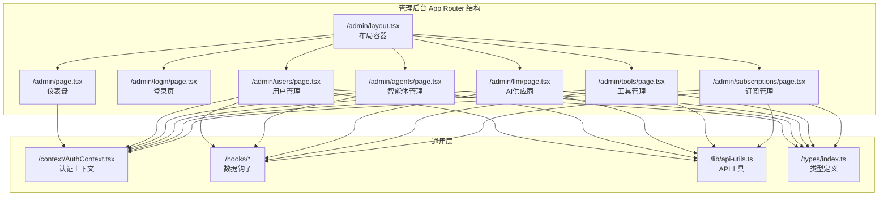
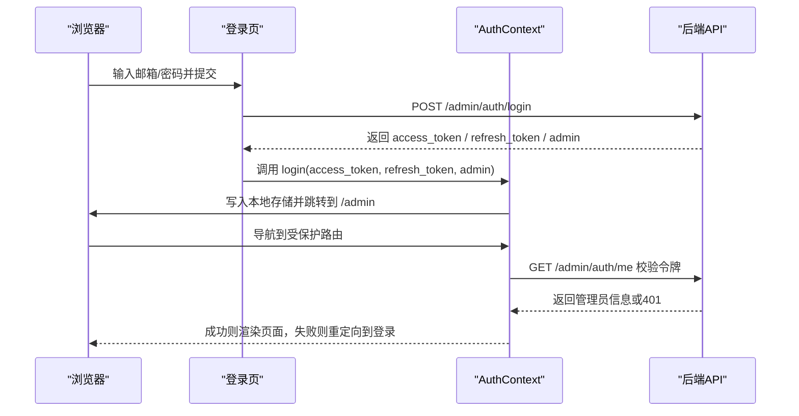
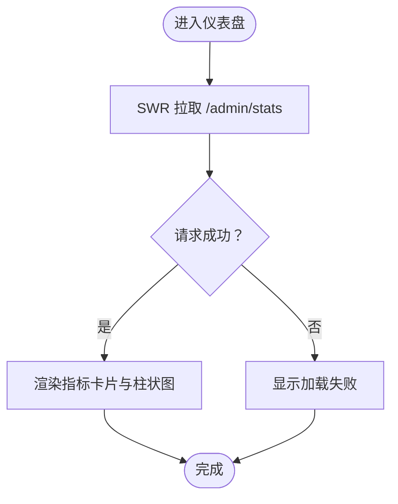
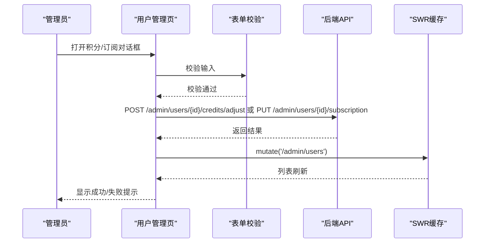
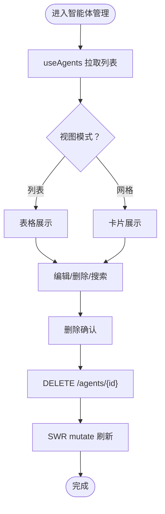
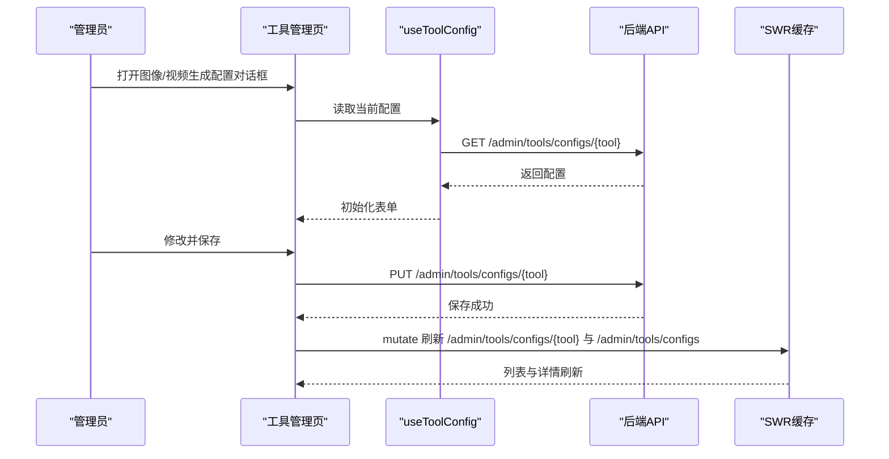
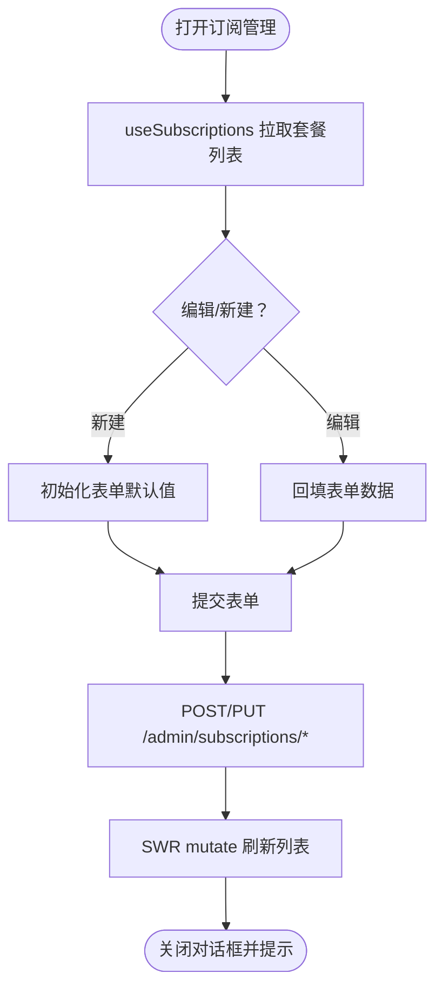
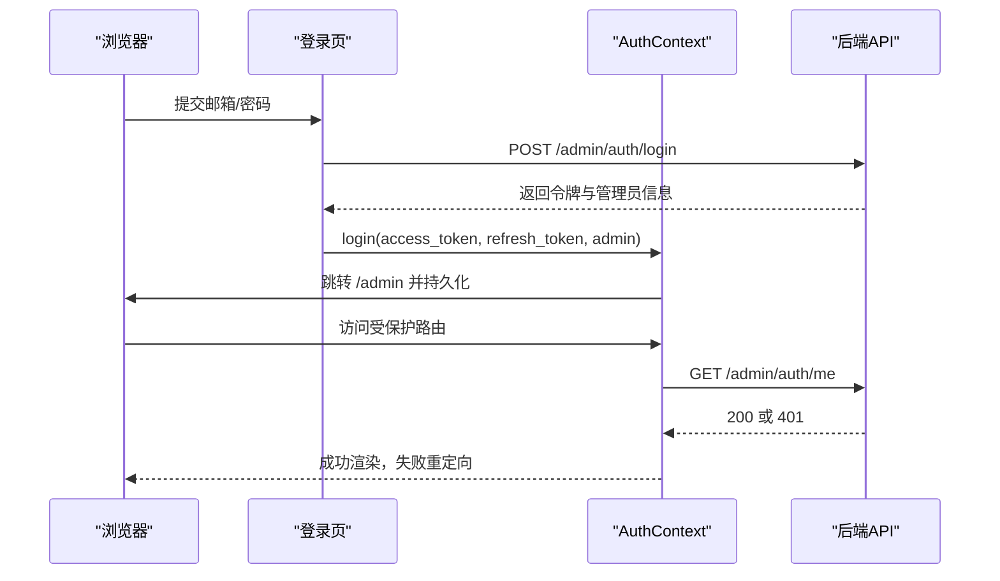
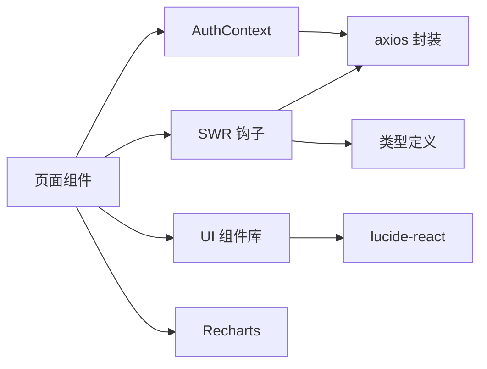

# 管理后台系统

<cite>
**本文引用的文件**
- [backend/admin/src/app/admin/page.tsx](file://backend/admin/src/app/admin/page.tsx)
- [backend/admin/src/context/AuthContext.tsx](file://backend/admin/src/context/AuthContext.tsx)
- [backend/admin/src/lib/api-utils.ts](file://backend/admin/src/lib/api-utils.ts)
- [backend/admin/src/app/admin/users/page.tsx](file://backend/admin/src/app/admin/users/page.tsx)
- [backend/admin/src/app/admin/agents/page.tsx](file://backend/admin/src/app/admin/agents/page.tsx)
- [backend/admin/src/app/admin/llm/page.tsx](file://backend/admin/src/app/admin/llm/page.tsx)
- [backend/admin/src/app/admin/tools/page.tsx](file://backend/admin/src/app/admin/tools/page.tsx)
- [backend/admin/src/app/admin/subscriptions/page.tsx](file://backend/admin/src/app/admin/subscriptions/page.tsx)
- [backend/admin/src/hooks/useAgents.ts](file://backend/admin/src/hooks/useAgents.ts)
- [backend/admin/src/hooks/useSubscriptions.ts](file://backend/admin/src/hooks/useSubscriptions.ts)
- [backend/admin/src/hooks/useToolRegistry.ts](file://backend/admin/src/hooks/useToolRegistry.ts)
- [backend/admin/src/tabs.tsx](file://backend/admin/src/tabs.tsx)
- [backend/admin/src/app/admin/login/page.tsx](file://backend/admin/src/app/admin/login/page.tsx)
- [backend/admin/src/types/index.ts](file://backend/admin/src/types/index.ts)
</cite>

## 目录
1. [简介](#简介)
2. [项目结构](#项目结构)
3. [核心组件](#核心组件)
4. [架构总览](#架构总览)
5. [详细组件分析](#详细组件分析)
6. [依赖关系分析](#依赖关系分析)
7. [性能考量](#性能考量)
8. [故障排除指南](#故障排除指南)
9. [结论](#结论)
10. [附录](#附录)

## 简介
本文件面向KunFlix管理后台系统，基于Next.js构建，提供用户管理、智能体与LLM供应商管理、工具与资源管理、订阅与计费、数据分析与监控等能力。本文档从系统架构、组件设计、路由与状态管理、安全与权限控制、审计与日志等方面进行深入解析，并给出最佳实践与故障排除建议。

## 项目结构
管理后台位于 backend/admin 子目录，采用 Next.js App Router 的 app 目录结构，前端UI组件库基于 Radix UI 和 Tailwind CSS，状态与数据流通过 SWR 实现，认证与鉴权由自定义 AuthContext 提供。

图表来源
- [backend/admin/src/app/admin/page.tsx:1-109](file://backend/admin/src/app/admin/page.tsx#L1-L109)
- [backend/admin/src/context/AuthContext.tsx:1-117](file://backend/admin/src/context/AuthContext.tsx#L1-L117)
- [backend/admin/src/lib/api-utils.ts:1-19](file://backend/admin/src/lib/api-utils.ts#L1-L19)
- [backend/admin/src/app/admin/users/page.tsx:1-450](file://backend/admin/src/app/admin/users/page.tsx#L1-L450)
- [backend/admin/src/app/admin/agents/page.tsx:1-315](file://backend/admin/src/app/admin/agents/page.tsx#L1-L315)
- [backend/admin/src/app/admin/llm/page.tsx:1-31](file://backend/admin/src/app/admin/llm/page.tsx#L1-L31)
- [backend/admin/src/app/admin/tools/page.tsx:1-419](file://backend/admin/src/app/admin/tools/page.tsx#L1-L419)
- [backend/admin/src/app/admin/subscriptions/page.tsx:1-522](file://backend/admin/src/app/admin/subscriptions/page.tsx#L1-L522)

章节来源
- [backend/admin/src/app/admin/page.tsx:1-109](file://backend/admin/src/app/admin/page.tsx#L1-L109)
- [backend/admin/src/context/AuthContext.tsx:1-117](file://backend/admin/src/context/AuthContext.tsx#L1-L117)
- [backend/admin/src/lib/api-utils.ts:1-19](file://backend/admin/src/lib/api-utils.ts#L1-L19)

## 核心组件
- 认证与会话管理：通过 AuthContext 提供登录态校验、路由守卫、本地存储令牌与用户信息。
- 数据获取与缓存：统一使用 SWR 进行数据拉取、缓存与刷新；API 工具封装 axios 请求与通用解析器。
- 页面级功能模块：用户管理、智能体管理、LLM供应商、工具与资源、订阅与计费、登录页。
- 类型系统：集中定义用户、管理员、订阅计划、工具、视频任务、LLM提供商、Agent 等类型，确保前后端契约一致。

章节来源
- [backend/admin/src/context/AuthContext.tsx:1-117](file://backend/admin/src/context/AuthContext.tsx#L1-L117)
- [backend/admin/src/lib/api-utils.ts:1-19](file://backend/admin/src/lib/api-utils.ts#L1-L19)
- [backend/admin/src/types/index.ts:1-402](file://backend/admin/src/types/index.ts#L1-L402)

## 架构总览
管理后台采用“页面驱动 + 钩子 + 类型约束”的分层架构：
- 页面层：负责展示与交互，调用表单校验、对话框、分页与搜索。
- 钩子层：封装 SWR 与 axios，提供统一的数据读写与缓存刷新。
- 类型层：定义强类型数据结构，贯穿页面、钩子与API。
- 安全层：登录页完成令牌交换并持久化；AuthContext 在客户端进行路由守卫与状态同步。

图表来源
- [backend/admin/src/app/admin/login/page.tsx:1-254](file://backend/admin/src/app/admin/login/page.tsx#L1-L254)
- [backend/admin/src/context/AuthContext.tsx:1-117](file://backend/admin/src/context/AuthContext.tsx#L1-L117)

## 详细组件分析

### 仪表盘与系统概览
- 功能：展示用户、故事、资产、供应商等关键指标的柱状图与卡片汇总。
- 数据：通过 SWR 拉取 /admin/stats，使用 Recharts 渲染。
- 交互：加载中/失败状态提示，响应式图表适配不同屏幕尺寸。

图表来源
- [backend/admin/src/app/admin/page.tsx:1-109](file://backend/admin/src/app/admin/page.tsx#L1-L109)

章节来源
- [backend/admin/src/app/admin/page.tsx:1-109](file://backend/admin/src/app/admin/page.tsx#L1-L109)

### 用户管理
- 功能覆盖：用户列表、订阅管理、积分调整、删除用户、查看积分历史。
- 表单与校验：使用 react-hook-form + zod，提供积分调整与订阅设置的表单。
- 对话框与确认：积分与订阅设置采用对话框，删除采用确认弹窗。
- 数据流：SWR 拉取用户与订阅计划，mutate 刷新列表；调用 /admin/users 与 /admin/users/{id}/credits/adjust、/admin/users/{id}/subscription 等接口。

图表来源
- [backend/admin/src/app/admin/users/page.tsx:1-450](file://backend/admin/src/app/admin/users/page.tsx#L1-L450)

章节来源
- [backend/admin/src/app/admin/users/page.tsx:1-450](file://backend/admin/src/app/admin/users/page.tsx#L1-L450)

### 智能体管理
- 功能：智能体列表/网格视图、搜索、分页、删除、编辑跳转。
- 数据：useAgents 钩子提供分页与搜索；useLLMProviders 提供供应商映射。
- 交互：支持列表/网格切换、悬浮删除按钮、点击卡片跳转详情。

图表来源
- [backend/admin/src/app/admin/agents/page.tsx:1-315](file://backend/admin/src/app/admin/agents/page.tsx#L1-L315)
- [backend/admin/src/hooks/useAgents.ts:1-52](file://backend/admin/src/hooks/useAgents.ts#L1-L52)

章节来源
- [backend/admin/src/app/admin/agents/page.tsx:1-315](file://backend/admin/src/app/admin/agents/page.tsx#L1-L315)
- [backend/admin/src/hooks/useAgents.ts:1-52](file://backend/admin/src/hooks/useAgents.ts#L1-L52)

### AI 供应商管理
- 功能：展示与管理 LLM 供应商，支持新增供应商入口。
- 页面：LLMPage 作为入口，内部渲染 ProviderList 组件（来自子目录）。

章节来源
- [backend/admin/src/app/admin/llm/page.tsx:1-31](file://backend/admin/src/app/admin/llm/page.tsx#L1-L31)

### 工具与资源管理
- 功能：查看工具注册表、全局工具配置（图像/视频生成）、工具调用统计、Agent 工具启用情况。
- 数据：useToolRegistry、useToolStats、useToolConfig、useUpdateToolConfig、useAgentToolUsage、useImageCapabilities、useVideoCapabilities。
- 交互：图像/视频生成配置对话框，保存后刷新对应缓存。

图表来源
- [backend/admin/src/app/admin/tools/page.tsx:1-419](file://backend/admin/src/app/admin/tools/page.tsx#L1-L419)
- [backend/admin/src/hooks/useToolRegistry.ts:1-67](file://backend/admin/src/hooks/useToolRegistry.ts#L1-L67)

章节来源
- [backend/admin/src/app/admin/tools/page.tsx:1-419](file://backend/admin/src/app/admin/tools/page.tsx#L1-L419)
- [backend/admin/src/hooks/useToolRegistry.ts:1-67](file://backend/admin/src/hooks/useToolRegistry.ts#L1-L67)

### 订阅与计费管理
- 功能：订阅套餐的增删改查、特性列表、排序、启用/停用、自动计算单价与利润率。
- 表单：使用 react-hook-form + zod，动态字段数组管理特性列表。
- 数据：useSubscriptions、useCreatePlan、useUpdatePlan、useDeletePlan。

图表来源
- [backend/admin/src/app/admin/subscriptions/page.tsx:1-522](file://backend/admin/src/app/admin/subscriptions/page.tsx#L1-L522)
- [backend/admin/src/hooks/useSubscriptions.ts:1-39](file://backend/admin/src/hooks/useSubscriptions.ts#L1-L39)

章节来源
- [backend/admin/src/app/admin/subscriptions/page.tsx:1-522](file://backend/admin/src/app/admin/subscriptions/page.tsx#L1-L522)
- [backend/admin/src/hooks/useSubscriptions.ts:1-39](file://backend/admin/src/hooks/useSubscriptions.ts#L1-L39)

### 登录与认证流程
- 登录页：表单校验、密码可见切换、记住邮箱、错误提示。
- 认证上下文：登录成功后写入 access_token/refresh_token/user；导航到受保护路由时校验 /admin/auth/me；失效则清理本地存储并重定向。

图表来源
- [backend/admin/src/app/admin/login/page.tsx:1-254](file://backend/admin/src/app/admin/login/page.tsx#L1-L254)
- [backend/admin/src/context/AuthContext.tsx:1-117](file://backend/admin/src/context/AuthContext.tsx#L1-L117)

章节来源
- [backend/admin/src/app/admin/login/page.tsx:1-254](file://backend/admin/src/app/admin/login/page.tsx#L1-L254)
- [backend/admin/src/context/AuthContext.tsx:1-117](file://backend/admin/src/context/AuthContext.tsx#L1-L117)

## 依赖关系分析
- 组件耦合：页面组件依赖钩子层（SWR + axios），钩子层依赖类型定义与 API 工具；认证上下文贯穿受保护路由。
- 外部依赖：SWR（数据缓存与刷新）、axios（HTTP 客户端）、lucide-react（图标）、zod/react-hook-form（表单校验）、Recharts（图表）。
- 潜在风险：若 /admin/auth/me 接口异常或令牌过期，AuthContext 将清理本地存储并重定向登录，需确保网络与后端可用性。

图表来源
- [backend/admin/src/hooks/useAgents.ts:1-52](file://backend/admin/src/hooks/useAgents.ts#L1-L52)
- [backend/admin/src/hooks/useSubscriptions.ts:1-39](file://backend/admin/src/hooks/useSubscriptions.ts#L1-L39)
- [backend/admin/src/hooks/useToolRegistry.ts:1-67](file://backend/admin/src/hooks/useToolRegistry.ts#L1-L67)
- [backend/admin/src/lib/api-utils.ts:1-19](file://backend/admin/src/lib/api-utils.ts#L1-L19)
- [backend/admin/src/types/index.ts:1-402](file://backend/admin/src/types/index.ts#L1-L402)

章节来源
- [backend/admin/src/hooks/useAgents.ts:1-52](file://backend/admin/src/hooks/useAgents.ts#L1-L52)
- [backend/admin/src/hooks/useSubscriptions.ts:1-39](file://backend/admin/src/hooks/useSubscriptions.ts#L1-L39)
- [backend/admin/src/hooks/useToolRegistry.ts:1-67](file://backend/admin/src/hooks/useToolRegistry.ts#L1-L67)
- [backend/admin/src/lib/api-utils.ts:1-19](file://backend/admin/src/lib/api-utils.ts#L1-L19)
- [backend/admin/src/types/index.ts:1-402](file://backend/admin/src/types/index.ts#L1-L402)

## 性能考量
- 数据缓存与并发：SWR 默认缓存与去重，适合高频读取场景；对工具统计使用定时刷新（30 秒）平衡实时性与性能。
- 列表渲染：智能体支持列表/网格双视图，网格模式下注意 Badge 与工具数量的截断渲染，避免过度 DOM。
- 图表渲染：Recharts 在大数据集上应限制数据点数量或采用虚拟化方案。
- 网络优化：统一 axios 封装便于接入拦截器与超时控制；对大列表分页加载，减少一次性请求体积。
- 本地存储：AuthContext 使用 localStorage 存储令牌与用户信息，注意清理过期数据与异常状态。

## 故障排除指南
- 登录失败
  - 现象：登录页出现错误提示或无法跳转。
  - 排查：检查 /admin/auth/login 返回状态码与 detail；确认邮箱/密码格式；检查网络连通性。
  - 处理：根据状态码提示修正输入或联系管理员。
- 令牌失效/过期
  - 现象：访问受保护路由被重定向至登录页。
  - 排查：检查 /admin/auth/me 是否返回 401；确认本地存储 access_token/refresh_token 是否存在。
  - 处理：重新登录以获取新令牌；如频繁失效，检查后端令牌签发与有效期配置。
- 页面空白或闪烁
  - 现象：受保护路由首次加载时短暂空白。
  - 排查：AuthContext 在 loading 期间返回空节点，防止未授权内容闪现。
  - 处理：确保网络正常，等待一次令牌校验完成。
- 表单提交失败
  - 现象：积分调整/订阅设置/套餐创建/更新失败。
  - 排查：查看 toast 错误提示与后端返回 detail；核对必填项与数值范围。
  - 处理：修正输入后重试；必要时刷新页面或重新登录。
- 工具配置不生效
  - 现象：保存配置后未见更新。
  - 排查：确认 /admin/tools/configs/{tool} PUT 成功；检查 SWR 缓存是否刷新。
  - 处理：手动点击“刷新”按钮或等待定时刷新；检查供应商与模型选择是否正确。

章节来源
- [backend/admin/src/app/admin/login/page.tsx:1-254](file://backend/admin/src/app/admin/login/page.tsx#L1-L254)
- [backend/admin/src/context/AuthContext.tsx:1-117](file://backend/admin/src/context/AuthContext.tsx#L1-L117)
- [backend/admin/src/app/admin/users/page.tsx:1-450](file://backend/admin/src/app/admin/users/page.tsx#L1-L450)
- [backend/admin/src/app/admin/subscriptions/page.tsx:1-522](file://backend/admin/src/app/admin/subscriptions/page.tsx#L1-L522)
- [backend/admin/src/app/admin/tools/page.tsx:1-419](file://backend/admin/src/app/admin/tools/page.tsx#L1-L419)

## 结论
管理后台以 Next.js App Router 为基础，结合 SWR、Zod、React Hook Form 与 Recharts，构建了清晰的页面层、钩子层与类型层。认证与路由守卫保障了受保护资源的安全访问；工具化的钩子与统一的 API 工具提升了开发效率与一致性。建议在生产环境中进一步完善网络拦截器、错误边界与审计日志，持续优化大数据量下的渲染与缓存策略。

## 附录
- 最佳实践
  - 表单：优先使用 react-hook-form + zod，配合受控组件与错误提示。
  - 数据：对高频读取使用 SWR 缓存，对实时性要求高的模块设置合理刷新间隔。
  - 安全：严格区分受保护路由，令牌过期自动清理；避免在前端存储敏感信息。
  - 可维护性：类型定义集中管理，页面组件尽量薄化逻辑，复杂交互拆分为独立组件或自定义 Hook。
- 常用路径参考
  - 仪表盘：/admin
  - 登录：/admin/login
  - 用户管理：/admin/users
  - 智能体管理：/admin/agents
  - AI 供应商：/admin/llm
  - 工具管理：/admin/tools
  - 订阅管理：/admin/subscriptions