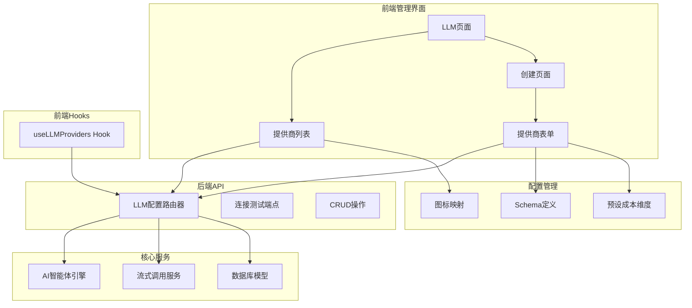
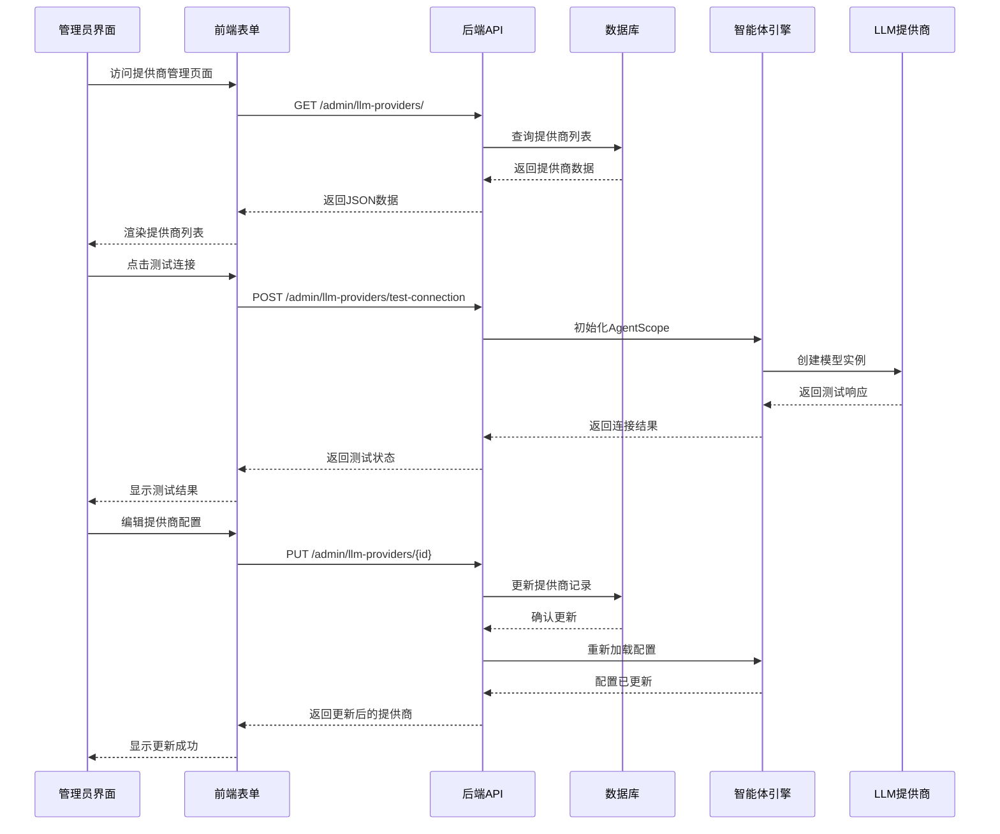
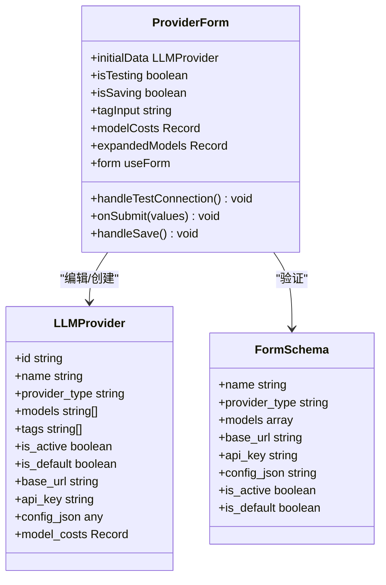
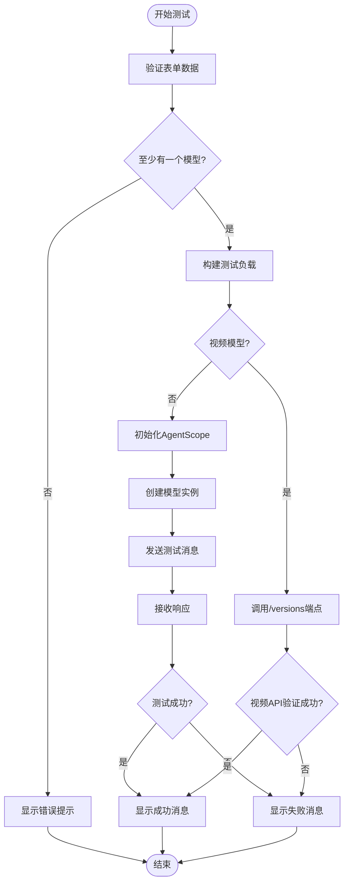
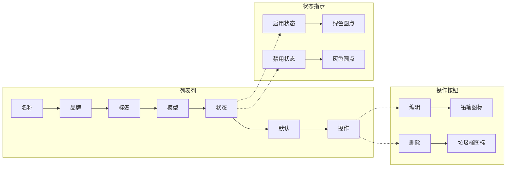
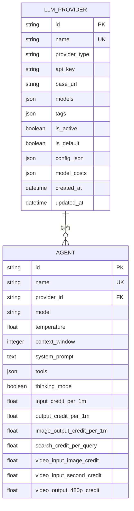
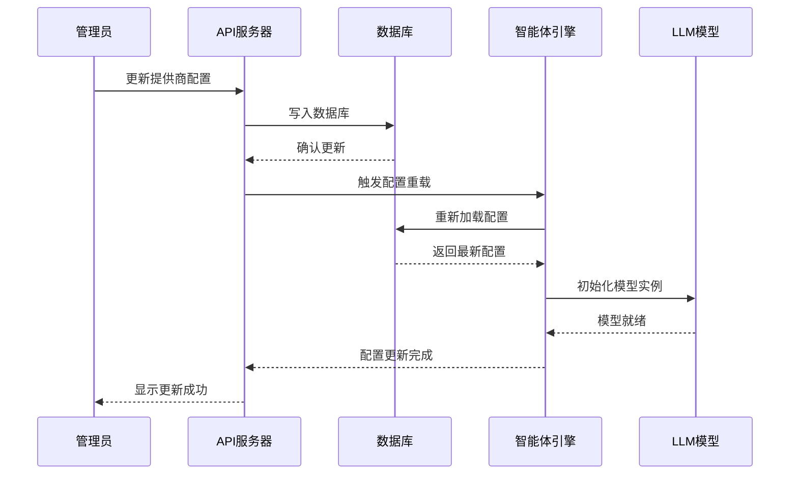
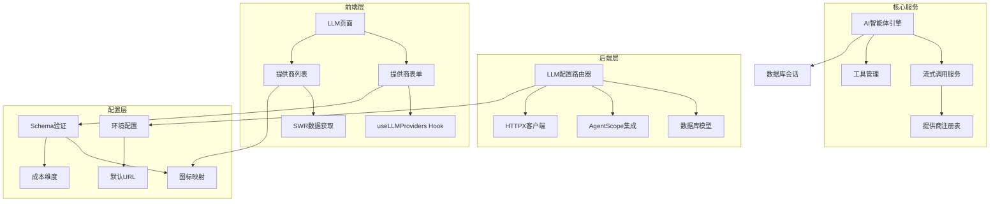
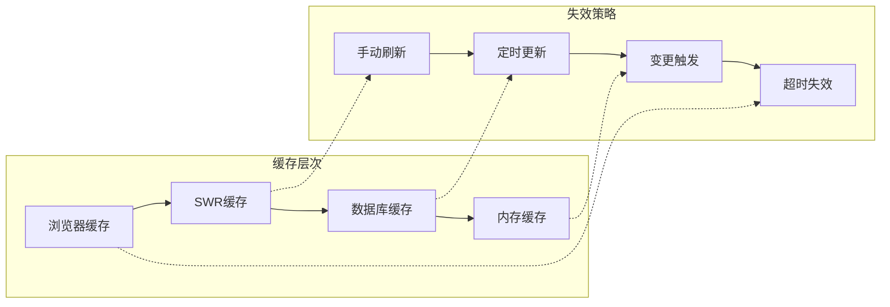

# LLM提供商管理

<cite>
**本文档引用的文件**
- [backend/admin/src/app/admin/llm/page.tsx](file://backend/admin/src/app/admin/llm/page.tsx)
- [backend/admin/src/app/admin/llm/create/page.tsx](file://backend/admin/src/app/admin/llm/create/page.tsx)
- [backend/admin/src/app/admin/llm/components/provider-form.tsx](file://backend/admin/src/app/admin/llm/components/provider-form.tsx)
- [backend/admin/src/app/admin/llm/components/provider-list.tsx](file://backend/admin/src/app/admin/llm/components/provider-list.tsx)
- [backend/admin/src/app/admin/llm/schema.ts](file://backend/admin/src/app/admin/llm/schema.ts)
- [backend/admin/src/hooks/useLLMProviders.ts](file://backend/admin/src/hooks/useLLMProviders.ts)
- [backend/routers/llm_config.py](file://backend/routers/llm_config.py)
- [backend/models.py](file://backend/models.py)
- [backend/agents.py](file://backend/agents.py)
- [backend/services/llm_stream.py](file://backend/services/llm_stream.py)
</cite>

## 目录
1. [简介](#简介)
2. [项目结构](#项目结构)
3. [核心组件](#核心组件)
4. [架构概览](#架构概览)
5. [详细组件分析](#详细组件分析)
6. [依赖关系分析](#依赖关系分析)
7. [性能考量](#性能考量)
8. [故障排除指南](#故障排除指南)
9. [结论](#结论)

## 简介

LLM提供商管理功能是Infinite Game项目中AI智能体系统的核心基础设施，负责管理各种大型语言模型提供商的配置和连接。该功能提供了完整的供应商生命周期管理，包括添加、编辑、删除、测试连接和健康检查等核心能力。

系统支持多种主流AI提供商，包括OpenAI、Azure、DashScope、Anthropic、Google Gemini、xAI等，并通过统一的接口抽象实现跨提供商的兼容性。每个提供商可以配置多个模型、成本参数、认证信息和高级配置选项。

## 项目结构

LLM提供商管理功能主要分布在以下层次：

**图表来源**
- [backend/admin/src/app/admin/llm/page.tsx:10-30](file://backend/admin/src/app/admin/llm/page.tsx#L10-L30)
- [backend/routers/llm_config.py:1-25](file://backend/routers/llm_config.py#L1-L25)

**章节来源**
- [backend/admin/src/app/admin/llm/page.tsx:1-31](file://backend/admin/src/app/admin/llm/page.tsx#L1-L31)
- [backend/admin/src/app/admin/llm/create/page.tsx:1-9](file://backend/admin/src/app/admin/llm/create/page.tsx#L1-L9)

## 核心组件

### 前端组件架构

系统采用React客户端组件架构，主要包含以下核心组件：

1. **LLM页面容器** - 主入口组件，负责导航和布局
2. **提供商列表** - 展示所有配置的AI提供商，支持CRUD操作
3. **提供商表单** - 完整的配置表单，支持连接测试
4. **自定义Hooks** - 数据获取和状态管理

### 后端API架构

后端提供RESTful API接口，采用FastAPI框架实现：

1. **连接测试端点** - 验证提供商配置的有效性
2. **CRUD操作** - 完整的提供商生命周期管理
3. **配置验证** - 基于Zod的严格数据验证
4. **智能体集成** - 与AI智能体系统的无缝对接

**章节来源**
- [backend/admin/src/app/admin/llm/components/provider-form.tsx:1-663](file://backend/admin/src/app/admin/llm/components/provider-form.tsx#L1-L663)
- [backend/admin/src/app/admin/llm/components/provider-list.tsx:1-197](file://backend/admin/src/app/admin/llm/components/provider-list.tsx#L1-L197)
- [backend/routers/llm_config.py:101-232](file://backend/routers/llm_config.py#L101-L232)

## 架构概览

系统采用分层架构设计，确保了良好的可维护性和扩展性：

**图表来源**
- [backend/routers/llm_config.py:101-136](file://backend/routers/llm_config.py#L101-L136)
- [backend/agents.py:176-387](file://backend/agents.py#L176-L387)

## 详细组件分析

### 提供商配置表单组件

提供商配置表单是系统的核心交互界面，提供了完整的配置管理能力：

#### 表单字段结构

**图表来源**
- [backend/admin/src/app/admin/llm/components/provider-form.tsx:38-67](file://backend/admin/src/app/admin/llm/components/provider-form.tsx#L38-L67)
- [backend/admin/src/app/admin/llm/schema.ts:59-95](file://backend/admin/src/app/admin/llm/schema.ts#L59-L95)

#### 连接测试机制

表单集成了强大的连接测试功能，支持多种提供商类型的验证：

**图表来源**
- [backend/admin/src/app/admin/llm/components/provider-form.tsx:74-122](file://backend/admin/src/app/admin/llm/components/provider-form.tsx#L74-L122)
- [backend/routers/llm_config.py:85-136](file://backend/routers/llm_config.py#L85-L136)

#### 成本配置管理

系统支持精细化的成本配置管理，包括预设维度和自定义参数：

**预设成本维度**：
- 输入成本 (USD/1M tokens)
- 文本输出成本 (USD/1M tokens)  
- 图片输出成本 (USD/1M tokens)
- 搜索查询成本 (USD/次)
- 视频输入图片成本 (USD/张)
- 视频输入时长成本 (USD/秒)
- 视频输出480p成本 (USD/秒)
- 视频输出720p成本 (USD/秒)

**章节来源**
- [backend/admin/src/app/admin/llm/schema.ts:4-13](file://backend/admin/src/app/admin/llm/schema.ts#L4-L13)
- [backend/admin/src/app/admin/llm/components/provider-form.tsx:394-548](file://backend/admin/src/app/admin/llm/components/provider-form.tsx#L394-L548)

### 提供商列表展示组件

提供商列表组件提供了直观的管理界面，支持批量操作和状态监控：

#### 列表展示特性

**图表来源**
- [backend/admin/src/app/admin/llm/components/provider-list.tsx:88-190](file://backend/admin/src/app/admin/llm/components/provider-list.tsx#L88-L190)

#### 数据获取和缓存

系统使用SWR库实现高效的数据获取和缓存管理：

**章节来源**
- [backend/admin/src/app/admin/llm/components/provider-list.tsx:34-54](file://backend/admin/src/app/admin/llm/components/provider-list.tsx#L34-L54)
- [backend/admin/src/hooks/useLLMProviders.ts:1-17](file://backend/admin/src/hooks/useLLMProviders.ts#L1-L17)

### 后端API服务

后端API服务提供了完整的提供商管理功能，基于FastAPI实现：

#### API端点设计

| 端点 | 方法 | 描述 | 功能 |
|------|------|------|------|
| `/admin/llm-providers/` | GET | 获取提供商列表 | 分页查询，支持排序 |
| `/admin/llm-providers/` | POST | 创建新提供商 | 验证唯一性，设置默认值 |
| `/admin/llm-providers/{id}` | GET | 获取单个提供商 | 按ID查询详情 |
| `/admin/llm-providers/{id}` | PUT | 更新提供商 | 支持部分更新 |
| `/admin/llm-providers/{id}` | DELETE | 删除提供商 | 级联删除相关数据 |
| `/admin/llm-providers/test-connection` | POST | 测试连接 | 验证配置有效性 |

#### 数据模型定义

**图表来源**
- [backend/models.py:146-170](file://backend/models.py#L146-L170)
- [backend/models.py:196-228](file://backend/models.py#L196-L228)

**章节来源**
- [backend/routers/llm_config.py:137-232](file://backend/routers/llm_config.py#L137-L232)
- [backend/models.py:146-170](file://backend/models.py#L146-L170)

### AI智能体系统集成

系统深度集成了AI智能体引擎，实现了配置的实时同步和动态加载：

#### 配置加载机制

**图表来源**
- [backend/routers/llm_config.py:159-163](file://backend/routers/llm_config.py#L159-L163)
- [backend/agents.py:182-232](file://backend/agents.py#L182-L232)

#### 流式调用支持

系统支持多种提供商的流式调用，包括OpenAI兼容、xAI、Anthropic兼容等：

**章节来源**
- [backend/agents.py:176-387](file://backend/agents.py#L176-L387)
- [backend/services/llm_stream.py:58-74](file://backend/services/llm_stream.py#L58-L74)

## 依赖关系分析

系统采用了清晰的依赖层次结构，确保了模块间的松耦合：

**图表来源**
- [backend/admin/src/app/admin/llm/schema.ts:23-56](file://backend/admin/src/app/admin/llm/schema.ts#L23-L56)
- [backend/routers/llm_config.py:26-31](file://backend/routers/llm_config.py#L26-L31)

### 关键依赖关系

1. **前端依赖**：
   - React Hook Form用于表单验证和状态管理
   - SWR用于数据获取和缓存
   - Zod用于运行时类型验证
   - Lucide React用于图标组件

2. **后端依赖**：
   - FastAPI用于Web框架
   - SQLAlchemy用于数据库ORM
   - Agentscope用于AI模型集成
   - HTTPX用于异步HTTP请求

3. **第三方集成**：
   - OpenAI兼容提供商
   - Anthropic兼容提供商
   - Google Gemini
   - DashScope/Qwen
   - Azure OpenAI

**章节来源**
- [backend/admin/src/app/admin/llm/components/provider-form.tsx:4-36](file://backend/admin/src/app/admin/llm/components/provider-form.tsx#L4-L36)
- [backend/routers/llm_config.py:1-18](file://backend/routers/llm_config.py#L1-L18)

## 性能考量

系统在设计时充分考虑了性能优化和用户体验：

### 前端性能优化

1. **懒加载和代码分割** - 使用Next.js的客户端组件实现按需加载
2. **SWR缓存策略** - 实现智能缓存和自动刷新
3. **表单状态管理** - 使用React Hook Form优化渲染性能
4. **条件渲染** - 仅在需要时渲染复杂的成本配置面板

### 后端性能优化

1. **异步处理** - 使用async/await实现非阻塞I/O操作
2. **连接池管理** - HTTPX客户端自动管理连接池
3. **数据库优化** - 使用索引和分页查询提升性能
4. **智能重载** - 仅在必要时重新初始化AI模型

### 缓存策略

## 故障排除指南

### 常见问题诊断

#### 连接测试失败

**可能原因**：
1. API密钥无效或过期
2. 基础URL配置错误
3. 网络连接问题
4. 提供商服务不可用

**解决方案**：
1. 验证API密钥格式和权限
2. 检查基础URL的正确性
3. 确认网络连通性
4. 查看提供商服务状态

#### 配置更新失败

**可能原因**：
1. 提供商名称重复
2. JSON配置格式错误
3. 数据库连接问题
4. 权限不足

**解决方案**：
1. 修改提供商名称确保唯一性
2. 使用在线JSON验证器检查格式
3. 检查数据库服务状态
4. 确认管理员权限

#### 智能体引擎初始化失败

**可能原因**：
1. 未配置活动提供商
2. 模型名称不匹配
3. 配置参数错误
4. 依赖服务不可用

**解决方案**：
1. 设置至少一个活动提供商
2. 验证模型名称存在性
3. 检查配置参数格式
4. 确认AgentScope服务可用

**章节来源**
- [backend/admin/src/app/admin/llm/components/provider-form.tsx:113-122](file://backend/admin/src/app/admin/llm/components/provider-form.tsx#L113-L122)
- [backend/routers/llm_config.py:143-146](file://backend/routers/llm_config.py#L143-L146)

### 调试工具和日志

系统提供了完善的调试和监控能力：

1. **前端调试** - 使用React DevTools和浏览器开发者工具
2. **后端日志** - 详细的异常堆栈跟踪和请求日志
3. **API测试** - Postman或curl命令行测试
4. **数据库监控** - SQL查询日志和性能分析

## 结论

LLM提供商管理功能是一个设计精良、功能完整的AI基础设施组件。它不仅提供了直观易用的管理界面，还通过深度的系统集成实现了配置的实时生效和智能体引擎的无缝对接。

### 主要优势

1. **全面的提供商支持** - 支持10+主流AI提供商
2. **灵活的成本管理** - 支持预设和自定义成本维度
3. **强大的测试功能** - 内置连接测试和健康检查
4. **实时配置同步** - 配置变更立即生效
5. **安全的权限控制** - 基于角色的访问控制

### 最佳实践建议

1. **配置管理**：
   - 始终使用HTTPS和加密存储API密钥
   - 定期轮换API密钥
   - 建立配置备份和恢复机制

2. **性能优化**：
   - 合理设置模型参数和上下文窗口
   - 使用成本监控防止意外费用
   - 定期清理不使用的提供商配置

3. **安全考虑**：
   - 实施最小权限原则
   - 定期审计访问日志
   - 建立应急响应预案

4. **运维管理**：
   - 建立监控告警机制
   - 制定灾难恢复计划
   - 定期进行安全评估

该功能为Infinite Game项目提供了坚实的AI基础设施，为后续的功能扩展和系统演进奠定了良好的基础。