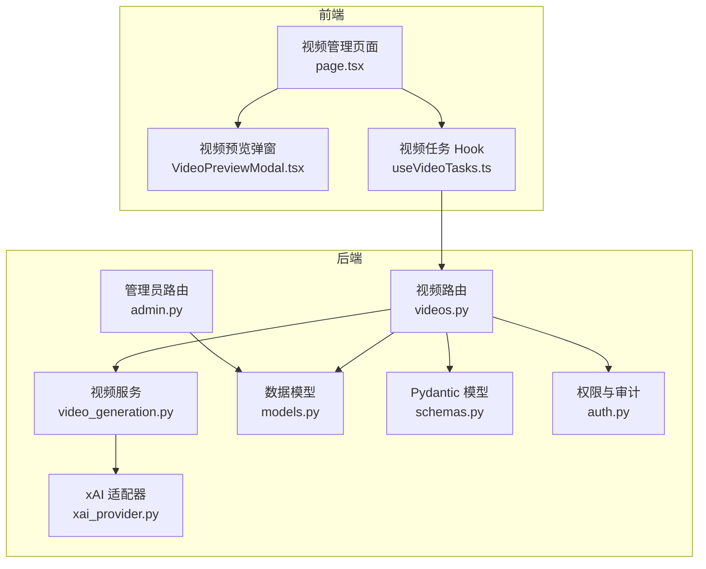
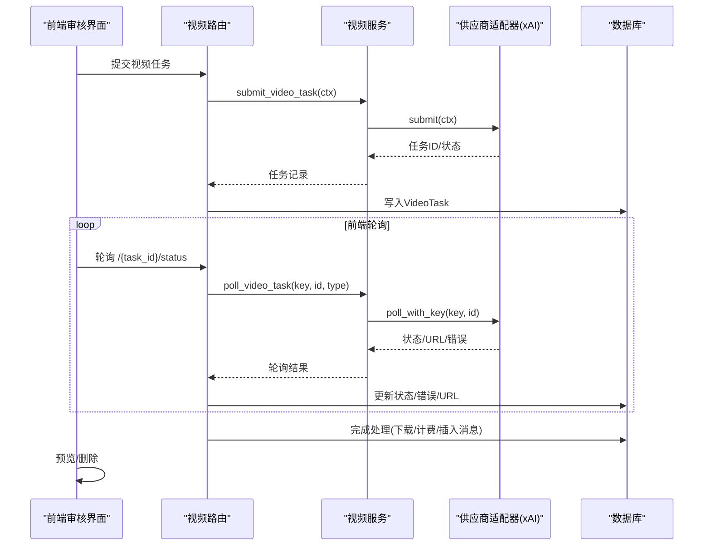
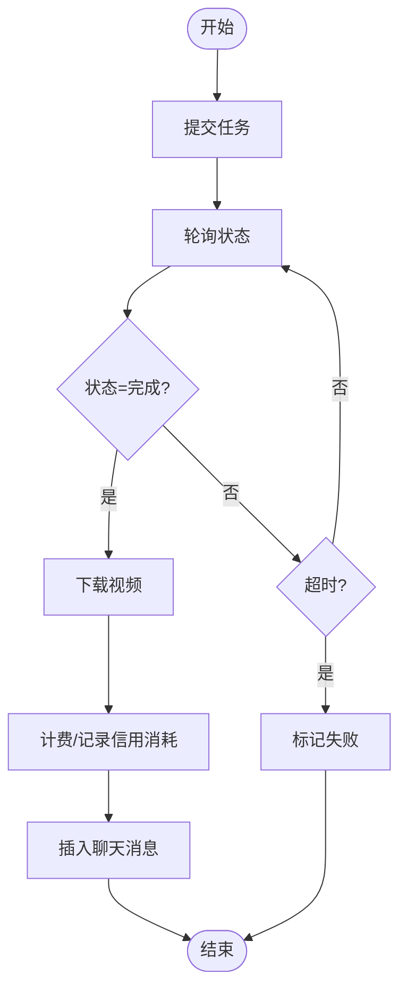
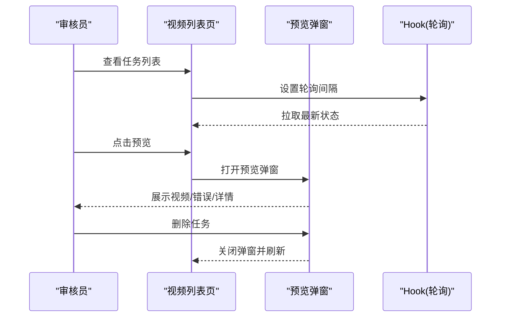
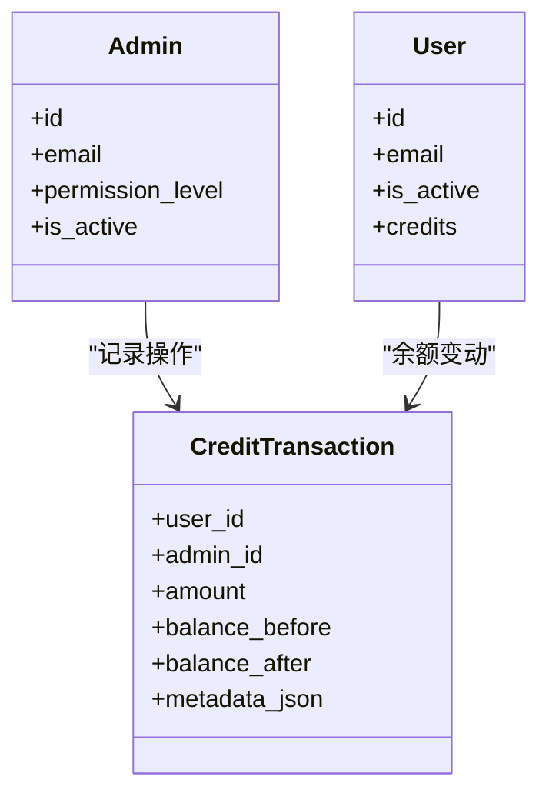
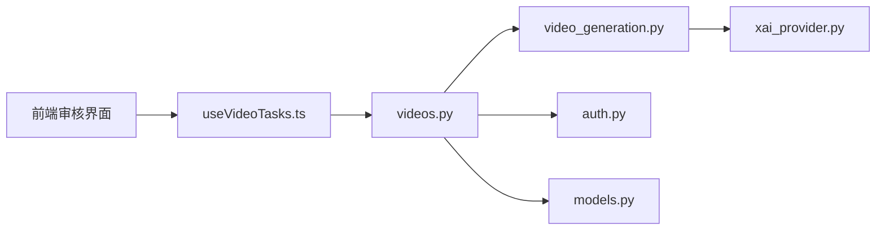

# 内容审核

<cite>
**本文引用的文件**
- [videos.py](file://backend/routers/videos.py)
- [video_generation.py](file://backend/services/video_generation.py)
- [xai_provider.py](file://backend/services/video_providers/xai_provider.py)
- [models.py](file://backend/models.py)
- [schemas.py](file://backend/schemas.py)
- [auth.py](file://backend/auth.py)
- [useVideoTasks.ts](file://backend/admin/src/hooks/useVideoTasks.ts)
- [page.tsx](file://backend/admin/src/app/admin/videos/page.tsx)
- [VideoPreviewModal.tsx](file://backend/admin/src/app/admin/videos/VideoPreviewModal.tsx)
- [admin.py](file://backend/routers/admin.py)
- [7459f2d26782_add_video_tasks_and_video_agent_fields.py](file://backend/migrations/versions/7459f2d26782_add_video_tasks_and_video_agent_fields.py)
</cite>

## 目录
1. [简介](#简介)
2. [项目结构](#项目结构)
3. [核心组件](#核心组件)
4. [架构总览](#架构总览)
5. [详细组件分析](#详细组件分析)
6. [依赖分析](#依赖分析)
7. [性能考虑](#性能考虑)
8. [故障排查指南](#故障排查指南)
9. [结论](#结论)
10. [附录](#附录)

## 简介
本文件面向内容审核与视频生成系统的使用者与维护者，系统性梳理“内容审核”的设计与实现，重点覆盖以下方面：
- 视频内容预览与质量检查流程
- 内容标记与分类（违规识别与风险评估）
- 审核决策机制（自动审核与人工复核）
- 内容下架与重新发布流程
- 审核员操作指南与决策标准
- 审核数据统计与报告能力
- 审核与用户权限、责任追溯的关系

## 项目结构
本项目采用前后端分离架构，内容审核能力主要集中在后端视频生成与审核流水线，以及前端审核管理界面两部分：
- 后端
  - 路由层：视频任务的创建、轮询、删除等接口
  - 服务层：多供应商适配、轮询与内容审核集成
  - 数据模型：视频任务、计费、聊天消息等
  - 权限与审计：JWT、管理员权限、行级隔离、交易记录
- 前端
  - 审核管理页面：视频任务列表、预览、删除
  - Hook：自动轮询、分页与过滤
  - Modal：视频预览与任务详情



**图表来源**
- [page.tsx:50-270](file://backend/admin/src/app/admin/videos/page.tsx#L50-L270)
- [VideoPreviewModal.tsx:25-122](file://backend/admin/src/app/admin/videos/VideoPreviewModal.tsx#L25-L122)
- [useVideoTasks.ts:17-57](file://backend/admin/src/hooks/useVideoTasks.ts#L17-L57)
- [videos.py:26-343](file://backend/routers/videos.py#L26-L343)
- [video_generation.py:84-160](file://backend/services/video_generation.py#L84-L160)
- [xai_provider.py:113-164](file://backend/services/video_providers/xai_provider.py#L113-L164)
- [models.py:391-422](file://backend/models.py#L391-L422)
- [schemas.py:642-691](file://backend/schemas.py#L642-L691)
- [auth.py:162-229](file://backend/auth.py#L162-L229)
- [admin.py:29-47](file://backend/routers/admin.py#L29-L47)

**章节来源**
- [page.tsx:50-270](file://backend/admin/src/app/admin/videos/page.tsx#L50-L270)
- [VideoPreviewModal.tsx:25-122](file://backend/admin/src/app/admin/videos/VideoPreviewModal.tsx#L25-L122)
- [useVideoTasks.ts:17-57](file://backend/admin/src/hooks/useVideoTasks.ts#L17-L57)
- [videos.py:26-343](file://backend/routers/videos.py#L26-L343)
- [video_generation.py:84-160](file://backend/services/video_generation.py#L84-L160)
- [xai_provider.py:113-164](file://backend/services/video_providers/xai_provider.py#L113-L164)
- [models.py:391-422](file://backend/models.py#L391-L422)
- [schemas.py:642-691](file://backend/schemas.py#L642-L691)
- [auth.py:162-229](file://backend/auth.py#L162-L229)
- [admin.py:29-47](file://backend/routers/admin.py#L29-L47)

## 核心组件
- 视频任务路由与状态管理
  - 提交任务、轮询状态、完成处理、计费、插入聊天消息、删除终态任务
- 多供应商适配与内容审核
  - 统一适配器接口；xAI 适配器内置内容审核判定
- 前端审核界面
  - 列表卡片、状态徽标、预览弹窗、分页与删除
- 权限与行级隔离
  - 管理员与用户双栈认证，管理员可查看全部数据，用户仅可见自身数据
- 数据模型与计费
  - VideoTask、LLMProvider、ChatMessage、CreditTransaction 等

**章节来源**
- [videos.py:26-343](file://backend/routers/videos.py#L26-L343)
- [video_generation.py:84-160](file://backend/services/video_generation.py#L84-L160)
- [xai_provider.py:113-164](file://backend/services/video_providers/xai_provider.py#L113-L164)
- [page.tsx:50-270](file://backend/admin/src/app/admin/videos/page.tsx#L50-L270)
- [VideoPreviewModal.tsx:25-122](file://backend/admin/src/app/admin/videos/VideoPreviewModal.tsx#L25-L122)
- [auth.py:162-229](file://backend/auth.py#L162-L229)
- [models.py:391-422](file://backend/models.py#L391-L422)

## 架构总览
内容审核贯穿“提交—轮询—审核—计费—预览—删除”的全链路，关键节点如下：
- 提交阶段：校验供应商、合并配置、推断供应商类型、创建任务记录
- 轮询阶段：根据供应商类型调用适配器轮询；SDK 层已将“内容审核拒绝”映射为失败
- 审核阶段：供应商侧内容审核（xAI 示例），若拒绝则失败并记录错误
- 完成阶段：下载视频、计算时长、计费、插入聊天消息、记录信用消耗
- 预览阶段：前端播放器预览、错误信息展示、任务详情
- 删除阶段：仅终态任务可删除，清理本地文件与关联消息



**图表来源**
- [videos.py:74-232](file://backend/routers/videos.py#L74-L232)
- [video_generation.py:84-124](file://backend/services/video_generation.py#L84-L124)
- [xai_provider.py:113-164](file://backend/services/video_providers/xai_provider.py#L113-L164)
- [useVideoTasks.ts:34-47](file://backend/admin/src/hooks/useVideoTasks.ts#L34-L47)
- [page.tsx:65-78](file://backend/admin/src/app/admin/videos/page.tsx#L65-L78)

**章节来源**
- [videos.py:74-232](file://backend/routers/videos.py#L74-L232)
- [video_generation.py:84-124](file://backend/services/video_generation.py#L84-L124)
- [xai_provider.py:113-164](file://backend/services/video_providers/xai_provider.py#L113-L164)
- [useVideoTasks.ts:34-47](file://backend/admin/src/hooks/useVideoTasks.ts#L34-L47)
- [page.tsx:65-78](file://backend/admin/src/app/admin/videos/page.tsx#L65-L78)

## 详细组件分析

### 视频任务生命周期与审核集成
- 提交流程
  - 校验供应商、合并配置、推断供应商类型、提交任务、创建任务记录
- 轮询与审核
  - 根据供应商类型调用适配器轮询；SDK 层已将“内容审核拒绝”映射为失败
  - 超时保护：pending 且错误超过 5 分钟视为失败
- 完成处理
  - 下载视频、计算时长、计费、插入聊天消息
- 删除
  - 仅终态任务可删除，清理本地文件与关联消息



**图表来源**
- [videos.py:149-232](file://backend/routers/videos.py#L149-L232)
- [xai_provider.py:139-157](file://backend/services/video_providers/xai_provider.py#L139-L157)

**章节来源**
- [videos.py:74-232](file://backend/routers/videos.py#L74-L232)
- [xai_provider.py:139-157](file://backend/services/video_providers/xai_provider.py#L139-L157)

### 前端审核界面与预览
- 视频列表卡片：状态徽标、缩略图、操作遮罩、删除按钮
- 预览弹窗：播放器、任务详情、时间信息、删除按钮
- 自动轮询：活跃任务每 5 秒刷新一次，驱动后端轮询与状态更新



**图表来源**
- [page.tsx:50-270](file://backend/admin/src/app/admin/videos/page.tsx#L50-L270)
- [VideoPreviewModal.tsx:25-122](file://backend/admin/src/app/admin/videos/VideoPreviewModal.tsx#L25-L122)
- [useVideoTasks.ts:17-57](file://backend/admin/src/hooks/useVideoTasks.ts#L17-L57)

**章节来源**
- [page.tsx:50-270](file://backend/admin/src/app/admin/videos/page.tsx#L50-L270)
- [VideoPreviewModal.tsx:25-122](file://backend/admin/src/app/admin/videos/VideoPreviewModal.tsx#L25-L122)
- [useVideoTasks.ts:17-57](file://backend/admin/src/hooks/useVideoTasks.ts#L17-L57)

### 权限与责任追溯
- 双栈认证：用户与管理员分别从不同表读取，支持通用依赖注入
- 行级隔离：管理员可查看全部数据，普通用户仅可见自身数据
- 审计与交易：CreditTransaction 记录管理员操作、余额变化、元数据



**图表来源**
- [auth.py:162-229](file://backend/auth.py#L162-L229)
- [models.py:10-33](file://backend/models.py#L10-L33)
- [models.py:35-73](file://backend/models.py#L35-L73)
- [models.py:261-281](file://backend/models.py#L261-L281)
- [admin.py:141-188](file://backend/routers/admin.py#L141-L188)

**章节来源**
- [auth.py:162-229](file://backend/auth.py#L162-L229)
- [models.py:10-33](file://backend/models.py#L10-L33)
- [models.py:35-73](file://backend/models.py#L35-L73)
- [models.py:261-281](file://backend/models.py#L261-L281)
- [admin.py:141-188](file://backend/routers/admin.py#L141-L188)

### 数据模型与审核相关字段
- VideoTask：任务状态、错误信息、结果 URL、时长、信用消耗、创建/完成时间
- LLMProvider：供应商类型、模型成本映射，用于计费
- ChatMessage：插入视频消息，便于回溯

```mermaid
erDiagram
VIDEO_TASK {
string id PK
string xai_task_id
string status
string video_mode
string prompt
integer duration
string quality
string aspect_ratio
string result_video_url
float credit_cost
text error_message
string provider_id FK
string user_id FK
datetime created_at
datetime completed_at
}
LLM_PROVIDER {
string id PK
string name
string provider_type
json model_costs
}
CHAT_MESSAGE {
string id PK
string session_id FK
string role
text content
}
VIDEO_TASK }|--|| LLM_PROVIDER : "provider_id"
VIDEO_TASK }o|--|| CHAT_MESSAGE : "message_id"
```

**图表来源**
- [models.py:391-422](file://backend/models.py#L391-L422)
- [models.py:146-170](file://backend/models.py#L146-L170)
- [models.py:185-194](file://backend/models.py#L185-L194)
- [7459f2d26782_add_video_tasks_and_video_agent_fields.py:44-55](file://backend/migrations/versions/7459f2d26782_add_video_tasks_and_video_agent_fields.py#L44-L55)

**章节来源**
- [models.py:391-422](file://backend/models.py#L391-L422)
- [models.py:146-170](file://backend/models.py#L146-L170)
- [models.py:185-194](file://backend/models.py#L185-L194)
- [7459f2d26782_add_video_tasks_and_video_agent_fields.py:44-55](file://backend/migrations/versions/7459f2d26782_add_video_tasks_and_video_agent_fields.py#L44-L55)

## 依赖分析
- 路由依赖服务层：videos.py 依赖 video_generation.py 的统一入口与轮询
- 服务层依赖适配器：video_generation.py 注册并选择适配器
- 适配器依赖供应商 API：xai_provider.py 调用 xAI REST 接口，并内置内容审核判定
- 权限依赖通用认证：auth.py 提供 get_current_user_or_admin/scoped_query
- 前端依赖 Hook：useVideoTasks.ts 驱动 SWR 与轮询



**图表来源**
- [useVideoTasks.ts:17-57](file://backend/admin/src/hooks/useVideoTasks.ts#L17-L57)
- [videos.py:26-343](file://backend/routers/videos.py#L26-L343)
- [video_generation.py:84-160](file://backend/services/video_generation.py#L84-L160)
- [xai_provider.py:113-164](file://backend/services/video_providers/xai_provider.py#L113-L164)
- [auth.py:162-229](file://backend/auth.py#L162-L229)
- [models.py:391-422](file://backend/models.py#L391-L422)

**章节来源**
- [useVideoTasks.ts:17-57](file://backend/admin/src/hooks/useVideoTasks.ts#L17-L57)
- [videos.py:26-343](file://backend/routers/videos.py#L26-L343)
- [video_generation.py:84-160](file://backend/services/video_generation.py#L84-L160)
- [xai_provider.py:113-164](file://backend/services/video_providers/xai_provider.py#L113-L164)
- [auth.py:162-229](file://backend/auth.py#L162-L229)
- [models.py:391-422](file://backend/models.py#L391-L422)

## 性能考虑
- 前端轮询策略：仅对活跃任务开启轮询，减少不必要的请求
- 后端轮询策略：SDK 层已处理“内容审核拒绝”映射为失败，避免无效轮询
- 数据库写入：完成处理时批量写入状态、URL、计费与消息，降低 IO 压力
- 前端渲染：列表卡片懒加载与预览弹窗按需打开，减少首屏压力

[本节为通用建议，无需特定文件引用]

## 故障排查指南
- 任务长时间 pending
  - 检查供应商轮询是否报错；若 pending 且错误超过 5 分钟，后端会标记失败
  - 前端会持续轮询以驱动后端更新
- 内容被审核拒绝
  - 供应商适配器会将“尊重内容审核”为否的任务标记为失败并记录错误
- 删除失败
  - 仅终态任务可删除；检查任务状态与本地文件是否存在
- 权限问题
  - 确认 JWT 中的 subject_type 与角色正确；管理员可查看全部数据

**章节来源**
- [videos.py:179-186](file://backend/routers/videos.py#L179-L186)
- [xai_provider.py:139-157](file://backend/services/video_providers/xai_provider.py#L139-L157)
- [videos.py:266-297](file://backend/routers/videos.py#L266-L297)
- [auth.py:162-229](file://backend/auth.py#L162-L229)

## 结论
本系统通过“供应商适配器 + 内容审核集成 + 前端审核界面 + 权限与审计”的组合，实现了从任务提交、轮询、审核、计费到预览与删除的闭环。内容审核在供应商层面完成，SDK 层统一映射为失败状态，前端通过自动轮询与预览弹窗提供直观的审核体验。管理员权限与行级隔离保障了数据安全与责任可追溯。

[本节为总结，无需特定文件引用]

## 附录

### 审核员操作指南与决策标准
- 登录后台，进入“视频生成”页面
- 查看任务状态卡片：排队中/生成中/已完成/失败
- 点击卡片或预览按钮打开预览弹窗
  - 已完成：播放器预览视频
  - 失败：查看错误信息
  - 未完成：等待轮询更新
- 删除终态任务：仅已完成或失败可删除，删除后视频文件与任务记录不可恢复
- 决策标准
  - 若内容审核拒绝或质量不达标，建议拒绝并记录原因
  - 若内容合规但质量不足，建议退回重做
  - 若内容合规且质量达标，建议放行并计入计费

**章节来源**
- [page.tsx:50-270](file://backend/admin/src/app/admin/videos/page.tsx#L50-L270)
- [VideoPreviewModal.tsx:25-122](file://backend/admin/src/app/admin/videos/VideoPreviewModal.tsx#L25-L122)
- [videos.py:266-297](file://backend/routers/videos.py#L266-L297)

### 审核数据统计与报告
- 管理员仪表盘可查看用户、剧场、资产、供应商等基础统计
- 用户积分历史可查看信用变动明细，便于审计与追溯
- 建议扩展：新增视频任务统计维度（按状态、模式、供应商、时间区间）

**章节来源**
- [admin.py:29-47](file://backend/routers/admin.py#L29-L47)
- [admin.py:190-214](file://backend/routers/admin.py#L190-L214)

### 内容下架与重新发布流程
- 下架：删除终态任务（已完成/失败），清理本地文件与关联消息
- 重新发布：审核员可在前端重新提交任务，或由系统自动重试（视业务策略而定）

**章节来源**
- [videos.py:266-297](file://backend/routers/videos.py#L266-L297)