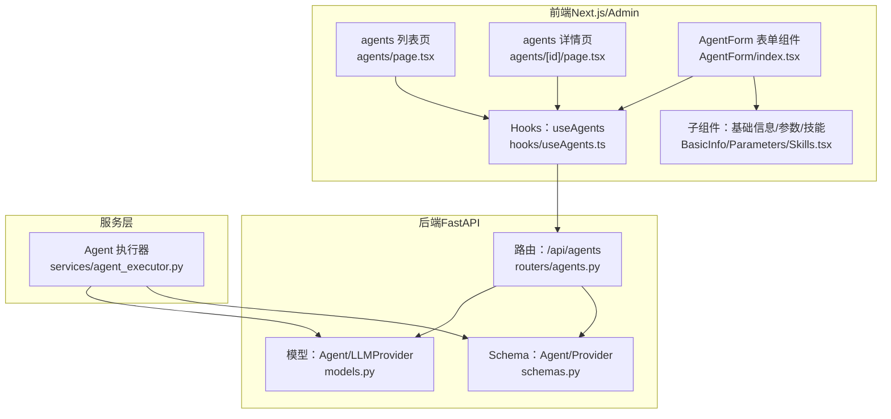
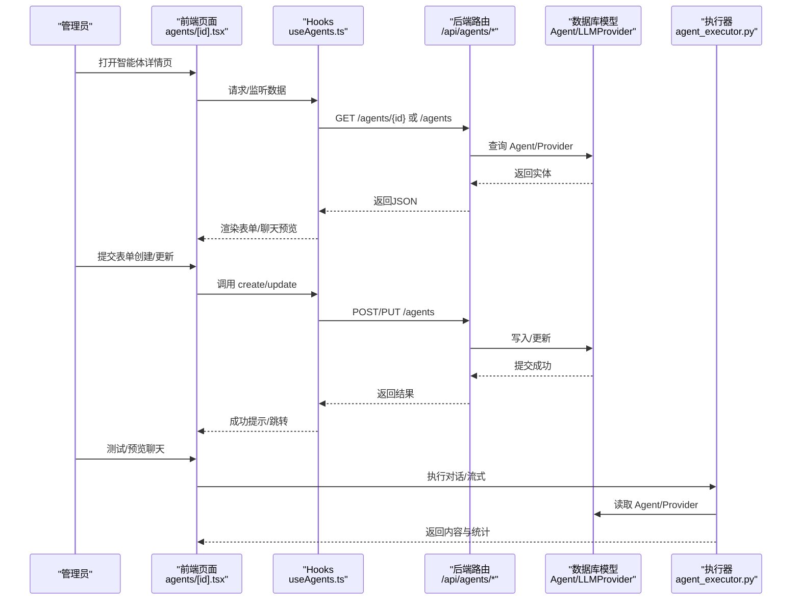
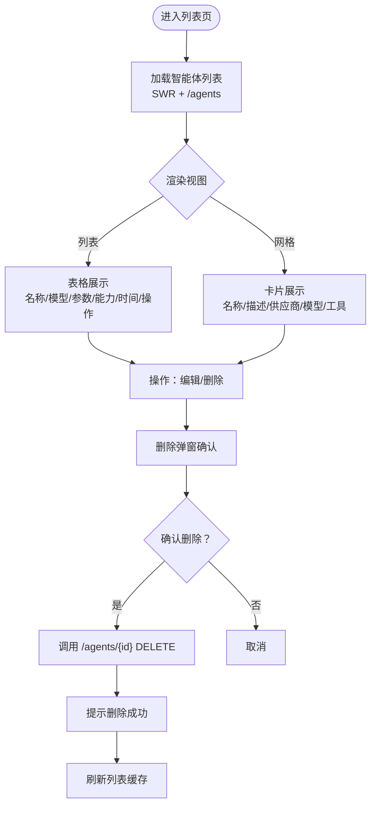
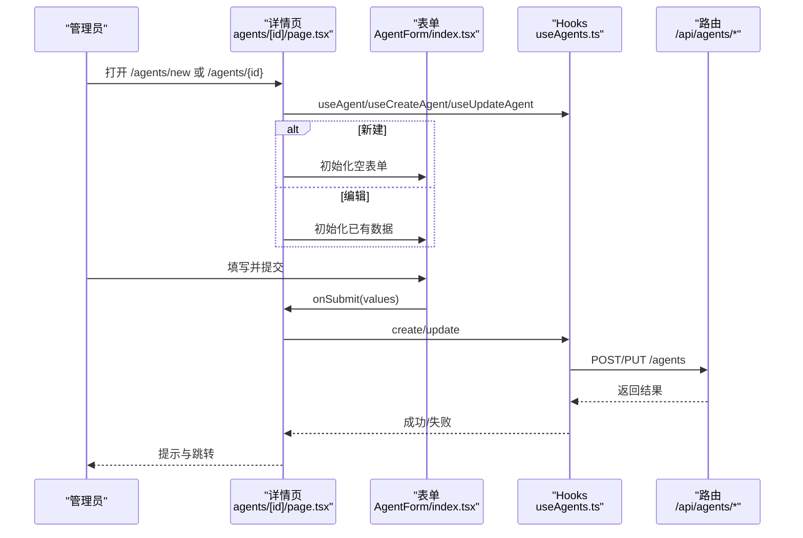
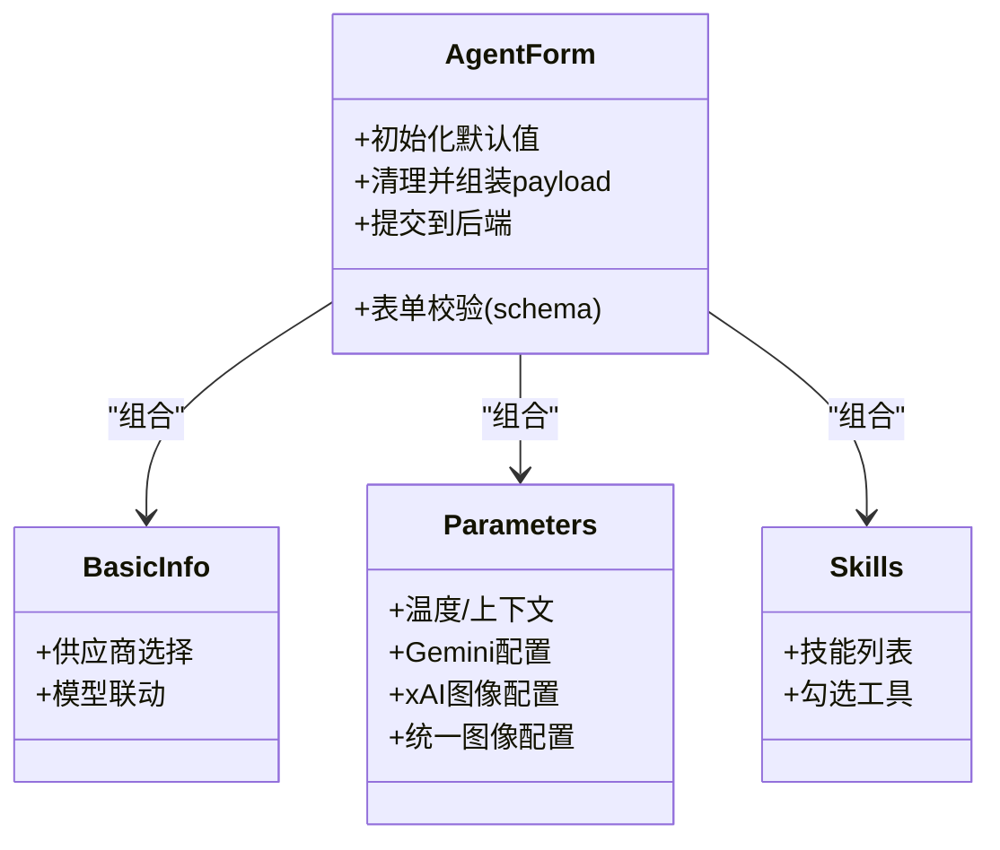
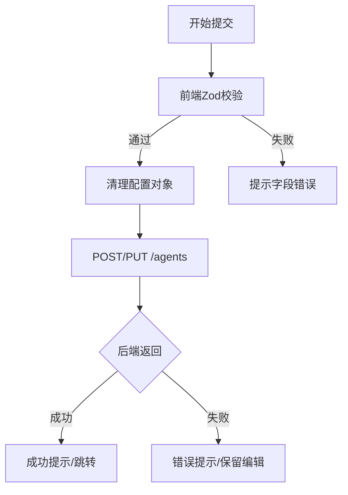
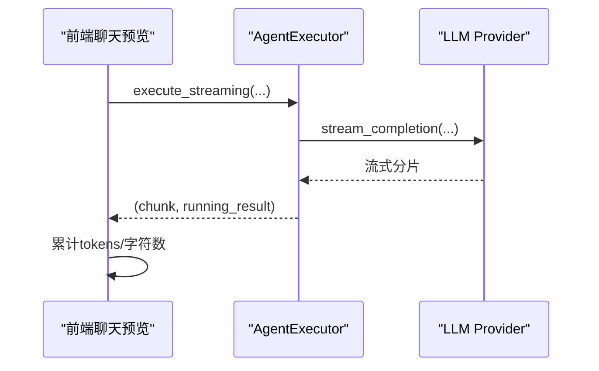
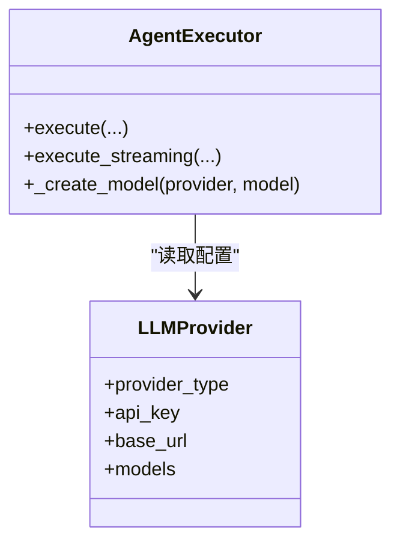
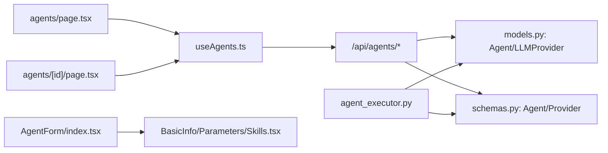

# 智能体管理

<cite>
**本文引用的文件**
- [后台智能体页面（列表）](file://backend/admin/src/app/admin/agents/page.tsx)
- [后台智能体详情页（创建/编辑）](file://backend/admin/src/app/admin/agents/[id]/page.tsx)
- [智能体表单组件（聚合）](file://backend/admin/src/components/admin/agents/AgentForm/index.tsx)
- [智能体表单Schema（校验）](file://backend/admin/src/components/admin/agents/AgentForm/schema.ts)
- [智能体表单基础信息子组件](file://backend/admin/src/components/admin/agents/AgentForm/BasicInfo.tsx)
- [智能体表单参数子组件](file://backend/admin/src/components/admin/agents/AgentForm/Parameters.tsx)
- [智能体表单技能子组件](file://backend/admin/src/components/admin/agents/AgentForm/Tools/Skills.tsx)
- [智能体Hook（SWR）](file://backend/admin/src/hooks/useAgents.ts)
- [智能体路由（FastAPI）](file://backend/routers/agents.py)
- [类型定义（Agent/Provider等）](file://backend/admin/src/types/index.ts)
- [LLM供应商路由（编辑页）](file://backend/admin/src/app/admin/llm/[id]/page.tsx)
- [Agent执行器（服务层）](file://backend/services/agent_executor.py)
- [数据库模型（Agent/Provider）](file://backend/models.py)
- [Pydantic Schema（Agent/Provider）](file://backend/schemas.py)
</cite>

## 目录
1. [简介](#简介)
2. [项目结构](#项目结构)
3. [核心组件](#核心组件)
4. [架构总览](#架构总览)
5. [详细组件分析](#详细组件分析)
6. [依赖关系分析](#依赖关系分析)
7. [性能考量](#性能考量)
8. [故障排除指南](#故障排除指南)
9. [结论](#结论)
10. [附录](#附录)

## 简介
本文件面向“智能体管理”功能，系统化梳理从界面到后端服务的完整链路，覆盖以下主题：
- 智能体列表展示与筛选
- 智能体详情查看与编辑
- 智能体状态管理（创建/更新/删除）
- 智能体配置管理（参数、模型、技能、图像/视频能力）
- 创建与编辑流程（表单校验、配置检查）
- 性能监控（使用统计、计费与成本）
- 安全与访问控制
- 与AI服务提供商的集成关系

## 项目结构
智能体管理由“后台管理前端 + 后端API + 服务层执行器 + 数据库模型”构成，采用前后端分离与模块化设计。

图表来源
- [后台智能体页面（列表）:48-315](file://backend/admin/src/app/admin/agents/page.tsx#L48-L315)
- [后台智能体详情页（创建/编辑）:19-118](file://backend/admin/src/app/admin/agents/[id]/page.tsx#L19-L118)
- [智能体表单组件（聚合）:72-382](file://backend/admin/src/components/admin/agents/AgentForm/index.tsx#L72-L382)
- [智能体Hook（SWR）:6-52](file://backend/admin/src/hooks/useAgents.ts#L6-L52)
- [智能体路由（FastAPI）:10-151](file://backend/routers/agents.py#L10-L151)
- [数据库模型（Agent/Provider）:196-200](file://backend/models.py#L196-L200)
- [Pydantic Schema（Agent/Provider）:126-162](file://backend/schemas.py#L126-L162)
- [Agent执行器（服务层）:63-287](file://backend/services/agent_executor.py#L63-L287)

章节来源
- [后台智能体页面（列表）:48-315](file://backend/admin/src/app/admin/agents/page.tsx#L48-L315)
- [后台智能体详情页（创建/编辑）:19-118](file://backend/admin/src/app/admin/agents/[id]/page.tsx#L19-L118)
- [智能体表单组件（聚合）:72-382](file://backend/admin/src/components/admin/agents/AgentForm/index.tsx#L72-L382)
- [智能体Hook（SWR）:6-52](file://backend/admin/src/hooks/useAgents.ts#L6-L52)
- [智能体路由（FastAPI）:10-151](file://backend/routers/agents.py#L10-L151)
- [数据库模型（Agent/Provider）:196-200](file://backend/models.py#L196-L200)
- [Pydantic Schema（Agent/Provider）:126-162](file://backend/schemas.py#L126-L162)
- [Agent执行器（服务层）:63-287](file://backend/services/agent_executor.py#L63-L287)

## 核心组件
- 列表页：提供分页、搜索、视图切换（列表/网格）、删除弹窗、跳转编辑。
- 详情页：创建/编辑统一入口；左侧配置表单，右侧聊天预览。
- 表单组件：拆分为基础信息、系统提示、参数、能力、节点控制、协作配置等模块。
- Hooks：封装列表、详情、增删改的网络请求与缓存。
- 后端路由：提供智能体的增删改查与搜索。
- 执行器：封装对话执行、流式输出、令牌统计与计费计算。

章节来源
- [后台智能体页面（列表）:48-315](file://backend/admin/src/app/admin/agents/page.tsx#L48-L315)
- [后台智能体详情页（创建/编辑）:19-118](file://backend/admin/src/app/admin/agents/[id]/page.tsx#L19-L118)
- [智能体表单组件（聚合）:72-382](file://backend/admin/src/components/admin/agents/AgentForm/index.tsx#L72-L382)
- [智能体Hook（SWR）:6-52](file://backend/admin/src/hooks/useAgents.ts#L6-L52)
- [智能体路由（FastAPI）:10-151](file://backend/routers/agents.py#L10-L151)
- [Agent执行器（服务层）:63-287](file://backend/services/agent_executor.py#L63-L287)

## 架构总览
智能体管理从前端表单到后端API再到服务层执行器形成闭环，同时与LLM供应商配置耦合，实现多模型、多能力的统一管理。

图表来源
- [后台智能体详情页（创建/编辑）:19-118](file://backend/admin/src/app/admin/agents/[id]/page.tsx#L19-L118)
- [智能体Hook（SWR）:6-52](file://backend/admin/src/hooks/useAgents.ts#L6-L52)
- [智能体路由（FastAPI）:16-136](file://backend/routers/agents.py#L16-L136)
- [Agent执行器（服务层）:74-208](file://backend/services/agent_executor.py#L74-L208)

## 详细组件分析

### 列表展示与筛选
- 支持关键词搜索、分页、列表/网格双视图、批量删除。
- 供应商与模型联动：根据供应商动态加载可用模型。
- 删除采用二次确认弹窗，成功后触发本地缓存刷新。

图表来源
- [后台智能体页面（列表）:48-315](file://backend/admin/src/app/admin/agents/page.tsx#L48-L315)
- [智能体Hook（SWR）:6-19](file://backend/admin/src/hooks/useAgents.ts#L6-L19)

章节来源
- [后台智能体页面（列表）:48-315](file://backend/admin/src/app/admin/agents/page.tsx#L48-L315)
- [智能体Hook（SWR）:6-19](file://backend/admin/src/hooks/useAgents.ts#L6-L19)

### 详情查看与编辑
- 新建与编辑共用同一页面与表单，通过路由参数区分。
- 左侧配置区支持两栏布局；右侧聊天预览实时展示配置效果。
- 表单提交前进行前端校验，提交后统一处理错误与成功提示。

图表来源
- [后台智能体详情页（创建/编辑）:19-118](file://backend/admin/src/app/admin/agents/[id]/page.tsx#L19-L118)
- [智能体表单组件（聚合）:224-306](file://backend/admin/src/components/admin/agents/AgentForm/index.tsx#L224-L306)
- [智能体Hook（SWR）:39-51](file://backend/admin/src/hooks/useAgents.ts#L39-L51)
- [智能体路由（FastAPI）:16-136](file://backend/routers/agents.py#L16-L136)

章节来源
- [后台智能体详情页（创建/编辑）:19-118](file://backend/admin/src/app/admin/agents/[id]/page.tsx#L19-L118)
- [智能体表单组件（聚合）:224-306](file://backend/admin/src/components/admin/agents/AgentForm/index.tsx#L224-L306)
- [智能体Hook（SWR）:39-51](file://backend/admin/src/hooks/useAgents.ts#L39-L51)
- [智能体路由（FastAPI）:16-136](file://backend/routers/agents.py#L16-L136)

### 配置管理（参数/模型/技能）
- 基础信息：名称、描述、智能体类型、供应商与模型联动。
- 参数设置：温度、上下文窗口、思考模式；按供应商类型显示专属配置（Gemini高级配置、xAI图像配置、统一图像生成配置）。
- 技能配置：拉取可用技能列表，勾选启用；与工具开关联动。
- 画布节点控制：目标节点类型白名单。
- 协作配置：Leader模式、协调方式、成员智能体集合与子任务上限。

图表来源
- [智能体表单组件（聚合）:72-382](file://backend/admin/src/components/admin/agents/AgentForm/index.tsx#L72-L382)
- [智能体表单基础信息子组件:28-181](file://backend/admin/src/components/admin/agents/AgentForm/BasicInfo.tsx#L28-L181)
- [智能体表单参数子组件:133-800](file://backend/admin/src/components/admin/agents/AgentForm/Parameters.tsx#L133-L800)
- [智能体表单技能子组件:11-79](file://backend/admin/src/components/admin/agents/AgentForm/Tools/Skills.tsx#L11-L79)

章节来源
- [智能体表单组件（聚合）:72-382](file://backend/admin/src/components/admin/agents/AgentForm/index.tsx#L72-L382)
- [智能体表单基础信息子组件:28-181](file://backend/admin/src/components/admin/agents/AgentForm/BasicInfo.tsx#L28-L181)
- [智能体表单参数子组件:133-800](file://backend/admin/src/components/admin/agents/AgentForm/Parameters.tsx#L133-L800)
- [智能体表单技能子组件:11-79](file://backend/admin/src/components/admin/agents/AgentForm/Tools/Skills.tsx#L11-L79)

### 创建与编辑流程（表单校验与配置检查）
- 前端使用Zod Schema进行强类型校验，覆盖必填、范围、枚举、互斥条件等。
- 提交前清理配置对象（仅保留有效字段），并根据工具开关决定是否包含工具列表。
- 后端严格校验：名称唯一、供应商存在、模型在供应商模型列表内、更新时的变更约束。

图表来源
- [智能体表单组件（聚合）:224-306](file://backend/admin/src/components/admin/agents/AgentForm/index.tsx#L224-L306)
- [智能体表单Schema（校验）:59-116](file://backend/admin/src/components/admin/agents/AgentForm/schema.ts#L59-L116)
- [智能体路由（FastAPI）:16-136](file://backend/routers/agents.py#L16-L136)

章节来源
- [智能体表单组件（聚合）:224-306](file://backend/admin/src/components/admin/agents/AgentForm/index.tsx#L224-L306)
- [智能体表单Schema（校验）:59-116](file://backend/admin/src/components/admin/agents/AgentForm/schema.ts#L59-L116)
- [智能体路由（FastAPI）:16-136](file://backend/routers/agents.py#L16-L136)

### 性能监控（使用统计与计费）
- 执行器记录输入/输出tokens、字符数，封装为统一结果结构。
- 计费计算：基于输入/输出tokens与单价，按千字节计费。
- 前端可在聊天预览中观察实时输出与统计信息。

图表来源
- [Agent执行器（服务层）:127-162](file://backend/services/agent_executor.py#L127-L162)

章节来源
- [Agent执行器（服务层）:127-162](file://backend/services/agent_executor.py#L127-L162)
- [Agent执行器（服务层）:279-287](file://backend/services/agent_executor.py#L279-L287)

### 安全与访问控制
- 后端路由要求管理员权限，新增/更新/删除均受保护。
- 供应商编辑页通过列表接口回退兼容，避免后端不支持单条查询的情况。
- 建议：对敏感字段（如API密钥）在前端隐藏，后端加密存储；对关键操作增加审计日志。

章节来源
- [智能体路由（FastAPI）:16-136](file://backend/routers/agents.py#L16-L136)
- [LLM供应商路由（编辑页）:14-50](file://backend/admin/src/app/admin/llm/[id]/page.tsx#L14-L50)

### 与AI服务提供商的集成
- 供应商类型映射：DashScope、Gemini、Anthropic、OpenAI兼容族、xAI等。
- 执行器根据供应商类型选择对应模型类，必要时注入base_url。
- 统一图像生成配置支持跨供应商组合（如文本模型 + 图像供应商）。

图表来源
- [Agent执行器（服务层）:245-271](file://backend/services/agent_executor.py#L245-L271)
- [数据库模型（Agent/Provider）:146-170](file://backend/models.py#L146-L170)
- [Pydantic Schema（Agent/Provider）:126-162](file://backend/schemas.py#L126-L162)

章节来源
- [Agent执行器（服务层）:245-271](file://backend/services/agent_executor.py#L245-L271)
- [数据库模型（Agent/Provider）:146-170](file://backend/models.py#L146-L170)
- [Pydantic Schema（Agent/Provider）:126-162](file://backend/schemas.py#L126-L162)

## 依赖关系分析
- 前端：页面依赖Hooks；表单依赖子组件与Schema；供应商编辑页依赖列表接口。
- 后端：路由依赖模型与Schema；执行器依赖数据库与供应商配置。
- 耦合与内聚：表单组件内聚于配置逻辑，路由内聚于CRUD与校验，执行器内聚于模型选择与计费。

图表来源
- [后台智能体页面（列表）:48-315](file://backend/admin/src/app/admin/agents/page.tsx#L48-L315)
- [后台智能体详情页（创建/编辑）:19-118](file://backend/admin/src/app/admin/agents/[id]/page.tsx#L19-L118)
- [智能体表单组件（聚合）:72-382](file://backend/admin/src/components/admin/agents/AgentForm/index.tsx#L72-L382)
- [智能体Hook（SWR）:6-52](file://backend/admin/src/hooks/useAgents.ts#L6-L52)
- [智能体路由（FastAPI）:10-151](file://backend/routers/agents.py#L10-L151)
- [Agent执行器（服务层）:63-287](file://backend/services/agent_executor.py#L63-L287)

章节来源
- [后台智能体页面（列表）:48-315](file://backend/admin/src/app/admin/agents/page.tsx#L48-L315)
- [后台智能体详情页（创建/编辑）:19-118](file://backend/admin/src/app/admin/agents/[id]/page.tsx#L19-L118)
- [智能体表单组件（聚合）:72-382](file://backend/admin/src/components/admin/agents/AgentForm/index.tsx#L72-L382)
- [智能体Hook（SWR）:6-52](file://backend/admin/src/hooks/useAgents.ts#L6-L52)
- [智能体路由（FastAPI）:10-151](file://backend/routers/agents.py#L10-L151)
- [Agent执行器（服务层）:63-287](file://backend/services/agent_executor.py#L63-L287)

## 性能考量
- 列表分页与搜索：后端按skip/limit分页，前端SWR缓存提升交互流畅度。
- 表单联动：供应商变化时仅重置模型，避免不必要的重渲染。
- 执行器缓存：对模型与Agent实例做缓存，减少重复初始化开销。
- 流式输出：服务层直接透传流式分片，降低前端等待时间。

## 故障排除指南
- 表单校验失败：前端会提示具体字段，检查必填项、数值范围与互斥条件。
- 提交失败：查看后端错误码与消息，常见原因包括名称冲突、供应商不存在、模型不在供应商列表。
- 删除失败：确认资源是否存在，检查权限与审计日志。
- 供应商编辑异常：若后端不支持单条查询，编辑页回退到列表接口匹配，确保数据一致性。
- 执行异常：检查供应商类型映射、API密钥与base_url配置，关注流式输出的异常处理。

章节来源
- [智能体表单组件（聚合）:214-222](file://backend/admin/src/components/admin/agents/AgentForm/index.tsx#L214-L222)
- [智能体路由（FastAPI）:16-136](file://backend/routers/agents.py#L16-L136)
- [LLM供应商路由（编辑页）:14-50](file://backend/admin/src/app/admin/llm/[id]/page.tsx#L14-L50)
- [Agent执行器（服务层）:127-162](file://backend/services/agent_executor.py#L127-L162)

## 结论
智能体管理功能通过清晰的前端表单与后端API协作，实现了从配置到执行的全链路闭环。其优势在于：
- 表单模块化与强校验，降低配置错误率；
- 供应商与模型解耦，便于扩展与替换；
- 执行器抽象统一，便于接入多模型与多能力；
- 计费与统计内嵌，便于运营与成本控制。

建议持续优化：
- 增加配置模板与导入导出；
- 完善审计日志与权限分级；
- 对大模型调用增加速率限制与熔断策略。

## 附录
- 类型定义涵盖Agent、LLMProvider、CreditTransaction等，便于前后端契约一致。
- 供应商编辑页兼容后端差异，保障可用性。

章节来源
- [类型定义（Agent/Provider等）:55-102](file://backend/admin/src/types/index.ts#L55-L102)
- [LLM供应商路由（编辑页）:14-50](file://backend/admin/src/app/admin/llm/[id]/page.tsx#L14-L50)