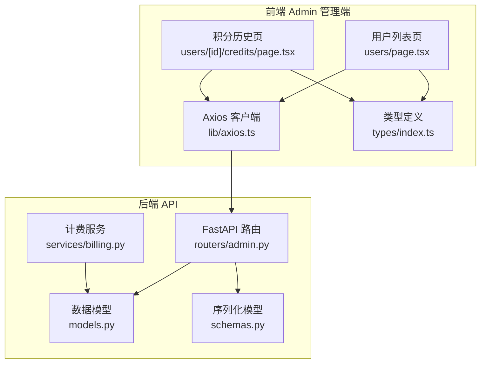
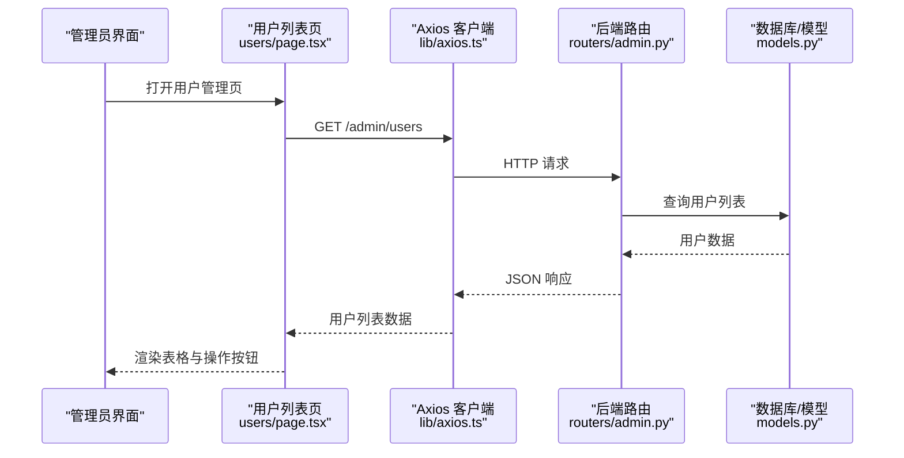
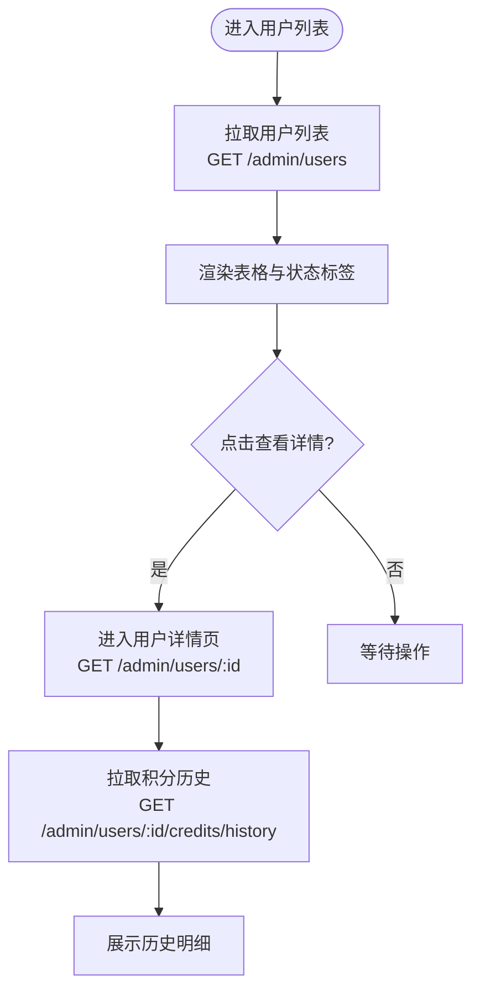
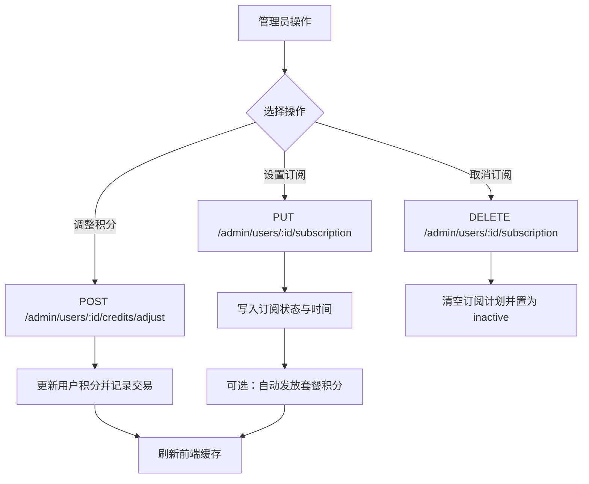
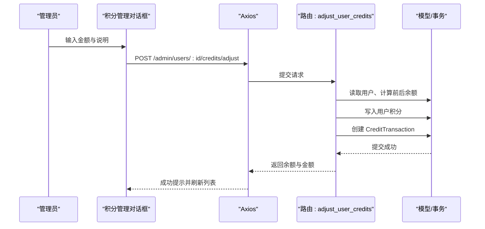
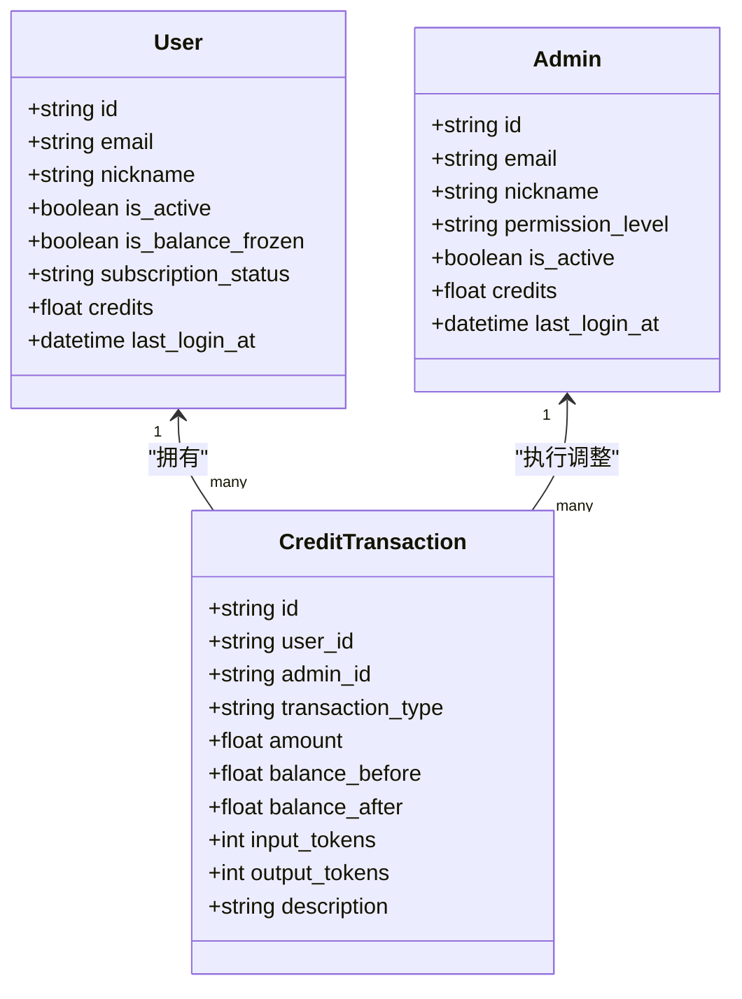
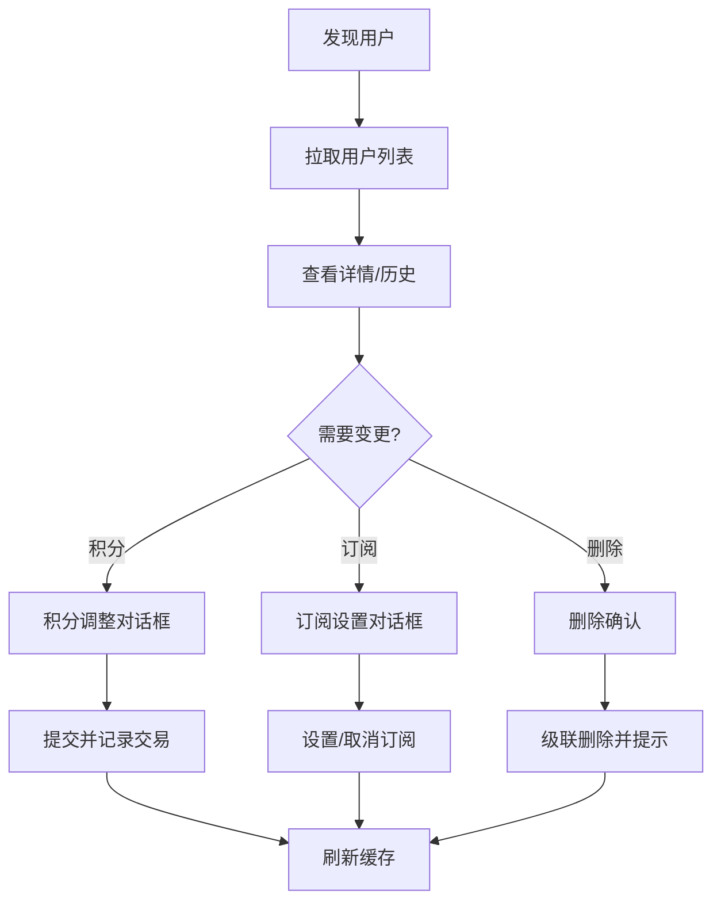
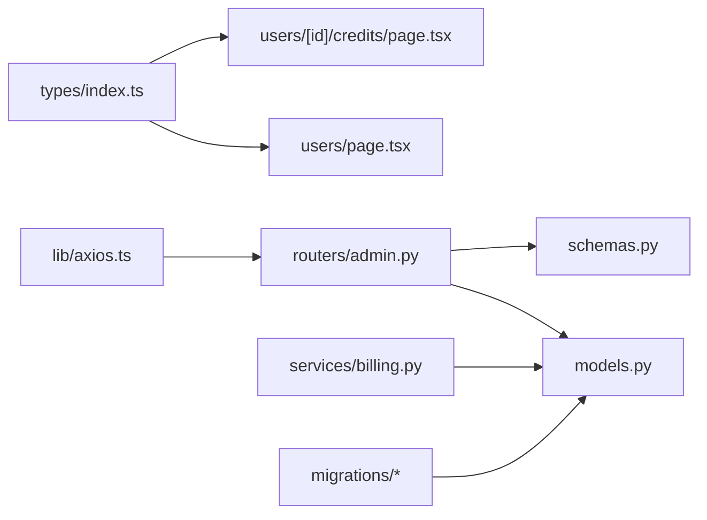

# 用户管理

<cite>
**本文引用的文件**
- [backend/admin/src/app/admin/users/page.tsx](file://backend/admin/src/app/admin/users/page.tsx)
- [backend/admin/src/app/admin/users/[id]/credits/page.tsx](file://backend/admin/src/app/admin/users/[id]/credits/page.tsx)
- [backend/models.py](file://backend/models.py)
- [backend/schemas.py](file://backend/schemas.py)
- [backend/routers/admin.py](file://backend/routers/admin.py)
- [backend/services/billing.py](file://backend/services/billing.py)
- [backend/migrations/versions/5f5b1c3da653_add_user_balance_frozen_status.py](file://backend/migrations/versions/5f5b1c3da653_add_user_balance_frozen_status.py)
- [backend/admin/src/lib/axios.ts](file://backend/admin/src/lib/axios.ts)
- [backend/admin/src/types/index.ts](file://backend/admin/src/types/index.ts)
</cite>

## 目录
1. [简介](#简介)
2. [项目结构](#项目结构)
3. [核心组件](#核心组件)
4. [架构总览](#架构总览)
5. [详细组件分析](#详细组件分析)
6. [依赖分析](#依赖分析)
7. [性能考量](#性能考量)
8. [故障排查指南](#故障排查指南)
9. [结论](#结论)
10. [附录](#附录)

## 简介
本文件面向管理员端的“用户管理”功能，系统性梳理以下能力与流程：
- 用户列表展示与基础统计
- 用户详情查看
- 用户状态管理（激活/冻结、订阅状态）
- 用户积分管理（充值、扣除、历史记录）
- 权限与角色差异（普通用户 vs 管理员）
- 搜索与筛选（前端层面的交互设计）
- 安全与隐私保护
- 与主系统的用户数据同步机制

## 项目结构
用户管理功能由前端 Next.js 页面与后端 FastAPI 路由共同组成，数据模型与序列化在后端定义，前端通过 Axios 发起请求并与 SWR 进行缓存同步。

**图表来源**
- [backend/admin/src/app/admin/users/page.tsx:1-450](file://backend/admin/src/app/admin/users/page.tsx#L1-L450)
- [backend/admin/src/app/admin/users/[id]/credits/page.tsx](file://backend/admin/src/app/admin/users/[id]/credits/page.tsx#L1-L120)
- [backend/admin/src/lib/axios.ts:1-105](file://backend/admin/src/lib/axios.ts#L1-L105)
- [backend/routers/admin.py:53-135](file://backend/routers/admin.py#L53-L135)
- [backend/models.py:35-73](file://backend/models.py#L35-L73)
- [backend/schemas.py:28-47](file://backend/schemas.py#L28-L47)
- [backend/services/billing.py:41-77](file://backend/services/billing.py#L41-L77)
- [backend/admin/src/types/index.ts:111-130](file://backend/admin/src/types/index.ts#L111-L130)

**章节来源**
- [backend/admin/src/app/admin/users/page.tsx:1-450](file://backend/admin/src/app/admin/users/page.tsx#L1-L450)
- [backend/admin/src/app/admin/users/[id]/credits/page.tsx](file://backend/admin/src/app/admin/users/[id]/credits/page.tsx#L1-L120)
- [backend/admin/src/lib/axios.ts:1-105](file://backend/admin/src/lib/axios.ts#L1-L105)
- [backend/routers/admin.py:53-135](file://backend/routers/admin.py#L53-L135)
- [backend/models.py:35-73](file://backend/models.py#L35-L73)
- [backend/schemas.py:28-47](file://backend/schemas.py#L28-L47)
- [backend/services/billing.py:41-77](file://backend/services/billing.py#L41-L77)
- [backend/admin/src/types/index.ts:111-130](file://backend/admin/src/types/index.ts#L111-L130)

## 核心组件
- 用户列表页：展示用户基础信息（邮箱、昵称、积分、订阅状态、Token 统计、最近登录），提供积分管理、订阅管理、积分历史跳转与删除入口。
- 积分历史页：展示某用户的积分变动明细（类型、金额、前后余额、Token 消耗、说明）。
- 后端路由：提供用户列表、详情、删除、积分调整、订阅设置/取消、积分历史查询等接口。
- 数据模型：定义用户、订阅计划、积分交易等实体及字段。
- 序列化模型：定义入参/出参结构，确保前后端契约一致。
- 计费服务：提供余额检查、冻结校验等通用逻辑。
- 前端类型：对用户、订阅计划、积分交易等进行 TypeScript 类型约束。

**章节来源**
- [backend/admin/src/app/admin/users/page.tsx:211-448](file://backend/admin/src/app/admin/users/page.tsx#L211-L448)
- [backend/admin/src/app/admin/users/[id]/credits/page.tsx](file://backend/admin/src/app/admin/users/[id]/credits/page.tsx#L40-L118)
- [backend/routers/admin.py:53-135](file://backend/routers/admin.py#L53-L135)
- [backend/models.py:35-73](file://backend/models.py#L35-L73)
- [backend/schemas.py:28-47](file://backend/schemas.py#L28-L47)
- [backend/services/billing.py:41-77](file://backend/services/billing.py#L41-L77)
- [backend/admin/src/types/index.ts:111-130](file://backend/admin/src/types/index.ts#L111-L130)

## 架构总览
用户管理采用“前端页面 + Axios 请求 + 后端路由 + SQLAlchemy 模型”的分层架构。前端通过 SWR 缓存用户列表与订阅计划，调用后端接口完成 CRUD 与状态变更；后端路由负责鉴权、数据校验、事务写入与返回。

**图表来源**
- [backend/admin/src/app/admin/users/page.tsx:87-89](file://backend/admin/src/app/admin/users/page.tsx#L87-L89)
- [backend/admin/src/lib/axios.ts:3-24](file://backend/admin/src/lib/axios.ts#L3-L24)
- [backend/routers/admin.py:53-83](file://backend/routers/admin.py#L53-L83)
- [backend/models.py:35-73](file://backend/models.py#L35-L73)

## 详细组件分析

### 用户列表展示与详情查看
- 列表页展示字段：邮箱、昵称、积分、订阅状态、Token 输入/输出总量、最近登录时间、操作按钮（积分、订阅、历史、删除）。
- 详情页：通过路由参数获取用户 ID，拉取用户详情与积分历史，展示历史明细与余额。
- 订阅状态映射：将 inactive/active/expired 映射为 UI 的标签样式与文案。
- 前端类型：User、SubscriptionPlan、CreditTransaction 等类型定义保证字段一致性。

**图表来源**
- [backend/admin/src/app/admin/users/page.tsx:87-113](file://backend/admin/src/app/admin/users/page.tsx#L87-L113)
- [backend/admin/src/app/admin/users/[id]/credits/page.tsx](file://backend/admin/src/app/admin/users/[id]/credits/page.tsx#L34-L38)
- [backend/routers/admin.py:53-113](file://backend/routers/admin.py#L53-L113)

**章节来源**
- [backend/admin/src/app/admin/users/page.tsx:211-291](file://backend/admin/src/app/admin/users/page.tsx#L211-L291)
- [backend/admin/src/app/admin/users/[id]/credits/page.tsx](file://backend/admin/src/app/admin/users/[id]/credits/page.tsx#L40-L118)
- [backend/routers/admin.py:86-113](file://backend/routers/admin.py#L86-L113)

### 用户状态管理（激活/冻结、订阅）
- 用户状态字段：is_active、is_balance_frozen、subscription_status、subscription_plan_id、subscription_start_at、subscription_end_at。
- 冻结机制：计费服务在检查余额时会检测 is_balance_frozen，若为真则抛出冻结异常，阻止消费。
- 订阅管理：设置订阅（active）、取消订阅（inactive），支持自动发放套餐积分并记录交易。

**图表来源**
- [backend/routers/admin.py:240-279](file://backend/routers/admin.py#L240-L279)
- [backend/routers/admin.py:282-301](file://backend/routers/admin.py#L282-L301)
- [backend/routers/admin.py:141-187](file://backend/routers/admin.py#L141-L187)
- [backend/services/billing.py:41-77](file://backend/services/billing.py#L41-L77)
- [backend/migrations/versions/5f5b1c3da653_add_user_balance_frozen_status.py:26-33](file://backend/migrations/versions/5f5b1c3da653_add_user_balance_frozen_status.py#L26-L33)

**章节来源**
- [backend/models.py:52-58](file://backend/models.py#L52-L58)
- [backend/services/billing.py:41-77](file://backend/services/billing.py#L41-L77)
- [backend/routers/admin.py:240-301](file://backend/routers/admin.py#L240-L301)
- [backend/migrations/versions/5f5b1c3da653_add_user_balance_frozen_status.py:21-43](file://backend/migrations/versions/5f5b1c3da653_add_user_balance_frozen_status.py#L21-L43)

### 用户积分管理（充值、扣除、冻结机制）
- 充值/扣除：管理员通过表单提交金额与说明，后端更新用户积分并记录交易类型（recharge 或 admin_adjust），余额不允许可为负。
- 冻结保护：当用户余额被冻结时，计费检查会拒绝消费，防止进一步扣费。
- 历史记录：积分历史页展示每笔交易的时间、类型、金额、前后余额、Token 消耗与说明。

**图表来源**
- [backend/admin/src/app/admin/users/page.tsx:148-171](file://backend/admin/src/app/admin/users/page.tsx#L148-L171)
- [backend/routers/admin.py:141-187](file://backend/routers/admin.py#L141-L187)
- [backend/models.py:261-281](file://backend/models.py#L261-L281)

**章节来源**
- [backend/admin/src/app/admin/users/page.tsx:293-345](file://backend/admin/src/app/admin/users/page.tsx#L293-L345)
- [backend/admin/src/app/admin/users/[id]/credits/page.tsx](file://backend/admin/src/app/admin/users/[id]/credits/page.tsx#L23-L28)
- [backend/routers/admin.py:141-187](file://backend/routers/admin.py#L141-L187)
- [backend/models.py:261-281](file://backend/models.py#L261-L281)

### 权限控制（普通用户与管理员）
- 用户角色：前端 User 类型仍保留 role 字段以兼容旧版本，实际业务状态由 is_active、is_balance_frozen、subscription_* 等字段决定。
- 管理员：Admin 表独立存在，拥有权限等级与积分统计，管理端路由通过 require_admin 鉴权。
- 前端拦截器：Axios 在请求头注入 Bearer Token，响应 401 时触发刷新流程，保障管理端安全访问。

**图表来源**
- [backend/admin/src/types/index.ts:111-130](file://backend/admin/src/types/index.ts#L111-L130)
- [backend/admin/src/types/index.ts:132-146](file://backend/admin/src/types/index.ts#L132-L146)
- [backend/admin/src/types/index.ts:173-187](file://backend/admin/src/types/index.ts#L173-L187)
- [backend/models.py:35-73](file://backend/models.py#L35-L73)
- [backend/models.py:261-281](file://backend/models.py#L261-L281)

**章节来源**
- [backend/admin/src/types/index.ts:111-130](file://backend/admin/src/types/index.ts#L111-L130)
- [backend/admin/src/types/index.ts:132-146](file://backend/admin/src/types/index.ts#L132-L146)
- [backend/admin/src/lib/axios.ts:12-102](file://backend/admin/src/lib/axios.ts#L12-L102)

### 搜索与筛选（前端交互）
- 用户列表页：提供邮箱/昵称等字段的快速筛选与排序（基于前端 UI 组件与状态管理）。
- 积分历史页：按时间、类型、金额、Token、说明等维度展示，便于审计与核对。
- 前端类型：明确字段类型与可空性，避免运行时错误。

**章节来源**
- [backend/admin/src/app/admin/users/page.tsx:215-291](file://backend/admin/src/app/admin/users/page.tsx#L215-L291)
- [backend/admin/src/app/admin/users/[id]/credits/page.tsx](file://backend/admin/src/app/admin/users/[id]/credits/page.tsx#L57-L116)
- [backend/admin/src/types/index.ts:111-130](file://backend/admin/src/types/index.ts#L111-L130)

### 工作流程（从用户发现到状态变更）

**图表来源**
- [backend/admin/src/app/admin/users/page.tsx:87-127](file://backend/admin/src/app/admin/users/page.tsx#L87-L127)
- [backend/admin/src/app/admin/users/page.tsx:148-209](file://backend/admin/src/app/admin/users/page.tsx#L148-L209)
- [backend/routers/admin.py:116-135](file://backend/routers/admin.py#L116-L135)

**章节来源**
- [backend/admin/src/app/admin/users/page.tsx:87-209](file://backend/admin/src/app/admin/users/page.tsx#L87-L209)
- [backend/routers/admin.py:116-135](file://backend/routers/admin.py#L116-L135)

### 数据安全与隐私保护
- 认证与授权：管理端路由通过 require_admin 鉴权；前端 Axios 注入 Bearer Token 并处理 401 刷新。
- 敏感字段：前端类型定义严格约束字段，避免误用；后端序列化模型统一返回结构，隐藏内部实现细节。
- 删除策略：删除用户时级联清理积分交易、聊天会话、剧场等关联数据，降低数据泄露风险。

**章节来源**
- [backend/admin/src/lib/axios.ts:12-102](file://backend/admin/src/lib/axios.ts#L12-L102)
- [backend/routers/admin.py:116-135](file://backend/routers/admin.py#L116-L135)
- [backend/schemas.py:28-47](file://backend/schemas.py#L28-L47)

### 与主系统的用户数据同步机制
- 前端通过 Axios 客户端统一访问后端 API，所有变更均经由后端路由落地数据库。
- 前端使用 SWR 进行缓存与增量更新，mutate('/admin/users') 等方法确保视图与后端一致。
- 计费与冻结逻辑在后端统一实现，避免前端绕过风控。

**章节来源**
- [backend/admin/src/lib/axios.ts:3-24](file://backend/admin/src/lib/axios.ts#L3-L24)
- [backend/admin/src/app/admin/users/page.tsx:87-89](file://backend/admin/src/app/admin/users/page.tsx#L87-L89)
- [backend/admin/src/app/admin/users/page.tsx:161-161](file://backend/admin/src/app/admin/users/page.tsx#L161-L161)

## 依赖分析
- 前端依赖后端 API，使用 Axios 与 SWR；类型定义来自 types/index.ts。
- 后端路由依赖 SQLAlchemy 模型与序列化模型；计费服务提供冻结与余额检查能力。
- 迁移文件确保数据库结构演进（如 is_balance_frozen 字段）。

**图表来源**
- [backend/admin/src/types/index.ts:111-130](file://backend/admin/src/types/index.ts#L111-L130)
- [backend/admin/src/app/admin/users/page.tsx:87-89](file://backend/admin/src/app/admin/users/page.tsx#L87-L89)
- [backend/admin/src/app/admin/users/[id]/credits/page.tsx](file://backend/admin/src/app/admin/users/[id]/credits/page.tsx#L34-L38)
- [backend/admin/src/lib/axios.ts:3-24](file://backend/admin/src/lib/axios.ts#L3-L24)
- [backend/routers/admin.py:53-135](file://backend/routers/admin.py#L53-L135)
- [backend/models.py:35-73](file://backend/models.py#L35-L73)
- [backend/schemas.py:28-47](file://backend/schemas.py#L28-L47)
- [backend/services/billing.py:41-77](file://backend/services/billing.py#L41-L77)
- [backend/migrations/versions/5f5b1c3da653_add_user_balance_frozen_status.py:26-33](file://backend/migrations/versions/5f5b1c3da653_add_user_balance_frozen_status.py#L26-L33)

**章节来源**
- [backend/admin/src/types/index.ts:111-130](file://backend/admin/src/types/index.ts#L111-L130)
- [backend/admin/src/lib/axios.ts:3-24](file://backend/admin/src/lib/axios.ts#L3-L24)
- [backend/routers/admin.py:53-135](file://backend/routers/admin.py#L53-L135)
- [backend/models.py:35-73](file://backend/models.py#L35-L73)
- [backend/schemas.py:28-47](file://backend/schemas.py#L28-L47)
- [backend/services/billing.py:41-77](file://backend/services/billing.py#L41-L77)
- [backend/migrations/versions/5f5b1c3da653_add_user_balance_frozen_status.py:21-43](file://backend/migrations/versions/5f5b1c3da653_add_user_balance_frozen_status.py#L21-L43)

## 性能考量
- 前端缓存：SWR 对用户列表与订阅计划进行缓存，减少重复请求。
- 分页与限制：后端路由提供 skip/limit 参数，避免一次性加载过多数据。
- 交易记录：积分历史按需分页，避免大列表渲染卡顿。
- 数据库索引：用户表与交易表具备必要索引（如 user_id、created_at），提升查询效率。

[本节为通用建议，无需特定文件引用]

## 故障排查指南
- 删除用户失败：检查用户是否存在、是否已级联删除关联数据；查看后端返回的错误详情。
- 积分调整失败：确认金额非零、说明必填；查看后端返回的错误信息。
- 订阅设置失败：检查套餐是否有效、时间范围是否合法；查看后端返回的错误信息。
- 余额不足或被冻结：计费服务会抛出冻结异常，需先解冻再进行消费。
- 401 未授权：前端拦截器会尝试刷新令牌，若失败需重新登录。

**章节来源**
- [backend/admin/src/app/admin/users/page.tsx:112-127](file://backend/admin/src/app/admin/users/page.tsx#L112-L127)
- [backend/admin/src/app/admin/users/page.tsx:148-171](file://backend/admin/src/app/admin/users/page.tsx#L148-L171)
- [backend/admin/src/app/admin/users/page.tsx:173-195](file://backend/admin/src/app/admin/users/page.tsx#L173-L195)
- [backend/services/billing.py:41-77](file://backend/services/billing.py#L41-L77)
- [backend/admin/src/lib/axios.ts:44-102](file://backend/admin/src/lib/axios.ts#L44-L102)

## 结论
用户管理功能通过清晰的前后端职责划分与严格的序列化契约，实现了用户列表、详情、状态与积分的全生命周期管理。配合冻结保护、级联删除与审计日志，既满足运营需求，又兼顾安全与合规。后续可在前端增加更丰富的筛选条件与导出能力，进一步提升管理效率。

[本节为总结性内容，无需特定文件引用]

## 附录
- 关键字段说明
  - is_active：用户是否可用
  - is_balance_frozen：余额是否被冻结
  - subscription_status：订阅状态（inactive/active/expired）
  - credits：用户积分余额
  - total_input_tokens / total_output_tokens：累计输入/输出 Token 数
- 前端类型与后端模型保持一致，避免运行时类型错误

**章节来源**
- [backend/models.py:52-68](file://backend/models.py#L52-L68)
- [backend/admin/src/types/index.ts:111-130](file://backend/admin/src/types/index.ts#L111-L130)