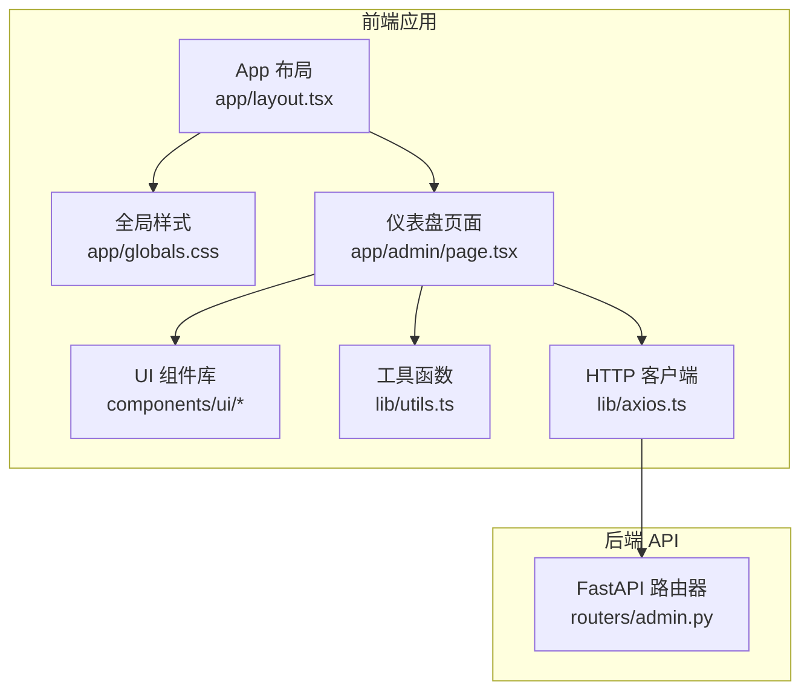
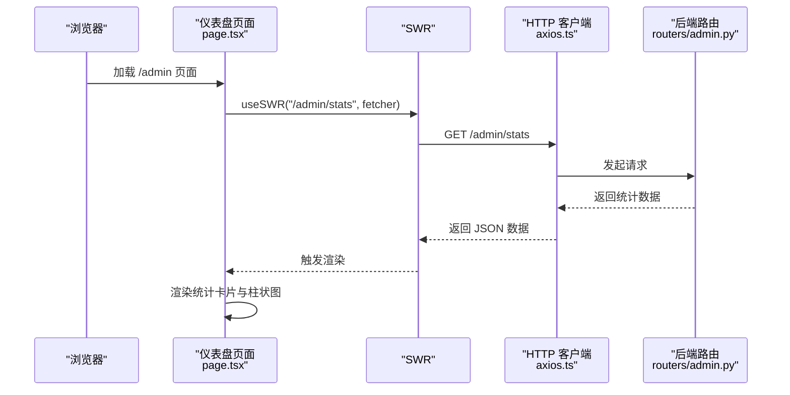
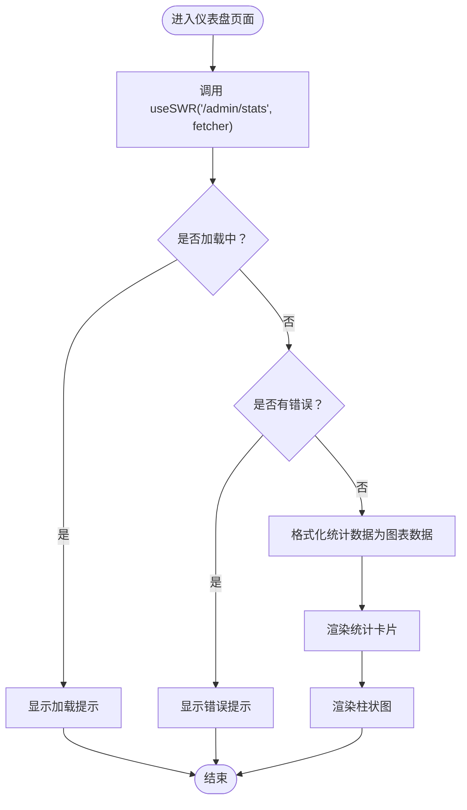
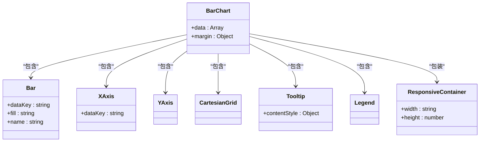
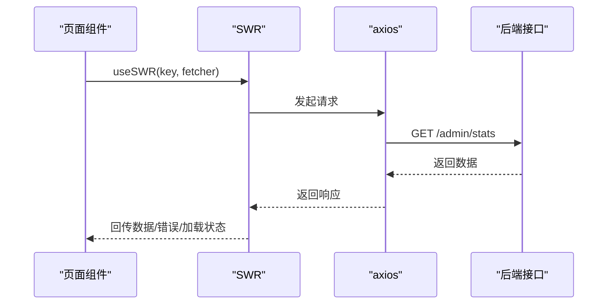
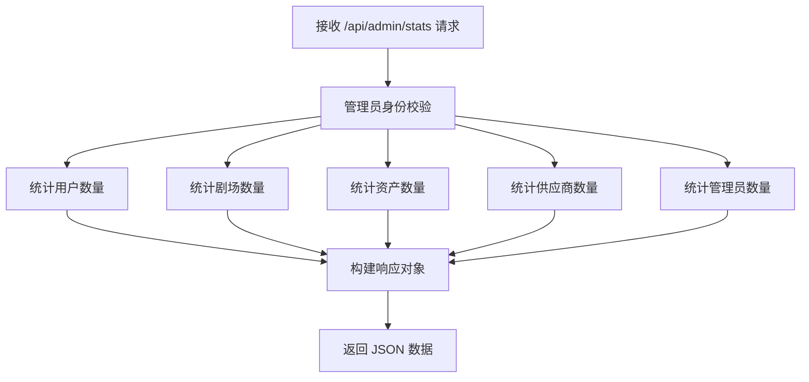
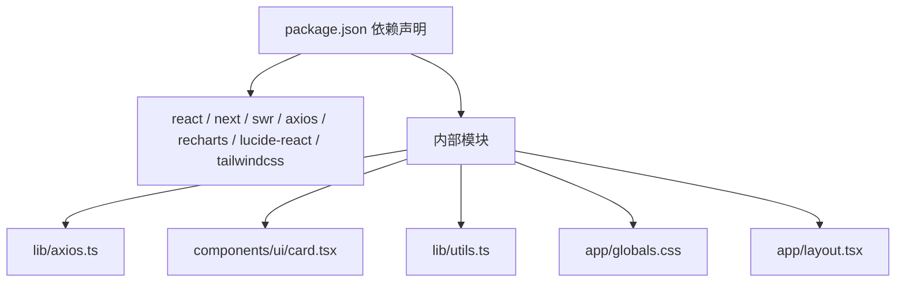

# 管理员仪表盘

<cite>
**本文档引用的文件**
- [dashboard/page.tsx](file://backend/admin/src/app/admin/page.tsx)
- [admin/layout.tsx](file://backend/admin/src/components/admin/AdminLayout.tsx)
- [axios.ts](file://backend/admin/src/lib/axios.ts)
- [admin/routers/admin.py](file://backend/routers/admin.py)
- [ui/card.tsx](file://backend/admin/src/components/ui/card.tsx)
- [utils.ts](file://backend/admin/src/lib/utils.ts)
- [app/globals.css](file://backend/admin/src/app/globals.css)
- [app/layout.tsx](file://backend/admin/src/app/layout.tsx)
- [package.json](file://backend/admin/package.json)
</cite>

## 目录
1. [简介](#简介)
2. [项目结构](#项目结构)
3. [核心组件](#核心组件)
4. [架构总览](#架构总览)
5. [详细组件分析](#详细组件分析)
6. [依赖分析](#依赖分析)
7. [性能考虑](#性能考虑)
8. [故障排除指南](#故障排除指南)
9. [结论](#结论)
10. [附录](#附录)

## 简介
本文件面向管理员仪表盘功能，系统性阐述前端仪表盘组件的设计与实现，涵盖统计卡片布局、Recharts 图表集成、SWR 数据获取机制、响应式设计与主题适配，以及后端接口的数据聚合逻辑。文档同时提供使用示例、自定义选项说明、性能优化建议与最佳实践，帮助开发者快速理解并扩展该功能。

## 项目结构
管理员仪表盘位于 Next.js 应用的后台管理前端中，采用客户端组件模式，配合 Recharts 进行可视化展示，并通过 SWR 实现数据获取与缓存。整体结构如下：

**图表来源**
- [app/layout.tsx:10-24](file://backend/admin/src/app/layout.tsx#L10-L24)
- [app/globals.css:1-129](file://backend/admin/src/app/globals.css#L1-L129)
- [dashboard/page.tsx:1-109](file://backend/admin/src/app/admin/page.tsx#L1-L109)
- [ui/card.tsx:1-80](file://backend/admin/src/components/ui/card.tsx#L1-L80)
- [utils.ts:1-7](file://backend/admin/src/lib/utils.ts#L1-L7)
- [axios.ts:1-105](file://backend/admin/src/lib/axios.ts#L1-L105)
- [admin/routers/admin.py:29-47](file://backend/routers/admin.py#L29-L47)

**章节来源**
- [app/layout.tsx:10-24](file://backend/admin/src/app/layout.tsx#L10-L24)
- [app/globals.css:1-129](file://backend/admin/src/app/globals.css#L1-L129)
- [dashboard/page.tsx:1-109](file://backend/admin/src/app/admin/page.tsx#L1-L109)
- [ui/card.tsx:1-80](file://backend/admin/src/components/ui/card.tsx#L1-L80)
- [utils.ts:1-7](file://backend/admin/src/lib/utils.ts#L1-L7)
- [axios.ts:1-105](file://backend/admin/src/lib/axios.ts#L1-L105)
- [admin/routers/admin.py:29-47](file://backend/routers/admin.py#L29-L47)

## 核心组件
- 仪表盘页面组件：负责渲染统计卡片与柱状图，使用 SWR 获取数据并处理加载与错误状态。
- 卡片组件：提供统一的卡片容器与标题、内容区域，支持响应式网格布局。
- HTTP 客户端：封装 axios，自动注入认证头与刷新令牌流程。
- 后端路由：提供 /api/admin/stats 接口，返回用户、故事、资产、供应商等关键指标。

关键实现要点：
- 使用 SWR 的 key 为 /admin/stats，fetcher 从 axios 封装的 api 对象发起请求。
- 错误与加载状态分别渲染提示文本，确保用户体验一致。
- 统计数据映射为 Recharts 所需的数组格式，包含 name 与 count 字段。
- Recharts 柱状图启用响应式容器、网格线、工具提示与图例，提升可读性。

**章节来源**
- [dashboard/page.tsx:12-109](file://backend/admin/src/app/admin/page.tsx#L12-L109)
- [ui/card.tsx:1-80](file://backend/admin/src/components/ui/card.tsx#L1-L80)
- [axios.ts:1-105](file://backend/admin/src/lib/axios.ts#L1-L105)
- [admin/routers/admin.py:29-47](file://backend/routers/admin.py#L29-L47)

## 架构总览
下图展示了从前端到后端的数据流与交互关系：

**图表来源**
- [dashboard/page.tsx:10-13](file://backend/admin/src/app/admin/page.tsx#L10-L13)
- [axios.ts:13-24](file://backend/admin/src/lib/axios.ts#L13-L24)
- [admin/routers/admin.py:29-47](file://backend/routers/admin.py#L29-L47)

## 详细组件分析

### 仪表盘页面组件
- 功能职责
  - 使用 SWR 获取 /admin/stats 并渲染四个统计卡片：用户总数、故事总数、生成资产数、AI 供应商数量。
  - 使用 Recharts 展示系统概览柱状图，数据来源于 stats。
  - 支持响应式布局，网格列在不同断点下自适应。
- 关键实现
  - SWR 配置：key 为 "/admin/stats"，fetcher 使用 axios 封装的 api.get。
  - 错误与加载：error 时显示“加载失败”，isLoading 时显示“加载中”。
  - 数据格式化：将 stats 映射为 [{ name, count }] 结构，供 Recharts 使用。
  - 图表配置：启用网格线、工具提示、图例；使用响应式容器保证在小屏设备上正常显示。
- 响应式设计
  - 统计卡片网格：md: 2 列，lg: 4 列，确保在桌面端充分利用空间。
  - 图表容器：高度固定为 300px，宽度 100%，内部使用 Recharts 的 ResponsiveContainer 自适应。

**图表来源**
- [dashboard/page.tsx:12-109](file://backend/admin/src/app/admin/page.tsx#L12-L109)

**章节来源**
- [dashboard/page.tsx:12-109](file://backend/admin/src/app/admin/page.tsx#L12-L109)

### Recharts 图表组件
- 组件选择与配置
  - 使用 BarChart、Bar、XAxis、YAxis、CartesianGrid、Tooltip、Legend、ResponsiveContainer。
  - 数据源来自格式化后的数组，包含 name 与 count 字段。
  - 工具提示样式与主题保持一致，使用 CSS 变量以适配明暗主题。
- 交互与可访问性
  - 提供图例与工具提示，便于识别各维度数据。
  - 响应式容器确保在移动端与桌面端均能良好显示。
- 自定义选项
  - 可通过修改 margin、颜色、样式属性调整图表外观。
  - 可替换为折线图或面积图以满足不同展示需求。

**图表来源**
- [dashboard/page.tsx:83-101](file://backend/admin/src/app/admin/page.tsx#L83-L101)

**章节来源**
- [dashboard/page.tsx:83-101](file://backend/admin/src/app/admin/page.tsx#L83-L101)

### SWR 数据获取机制
- 数据获取
  - key: "/admin/stats"
  - fetcher: 使用 axios 封装的 api.get，自动携带认证头。
- 缓存与重验证
  - SWR 默认具备缓存能力，可在后台切换、焦点恢复等场景自动刷新。
  - 可通过配置 revalidateOnFocus、revalidateOnReconnect、refreshInterval 等参数控制刷新行为。
- 错误处理
  - 页面层通过 error 与 isLoading 分支渲染，避免未定义数据导致的异常。
  - HTTP 层通过 axios 拦截器处理 401 与令牌刷新，减少页面级重复逻辑。
- 性能优化
  - 合理设置 revalidation 间隔，避免频繁请求。
  - 对于不常变化的数据，可考虑使用本地缓存或服务端缓存策略。

**图表来源**
- [dashboard/page.tsx:10-13](file://backend/admin/src/app/admin/page.tsx#L10-L13)
- [axios.ts:13-24](file://backend/admin/src/lib/axios.ts#L13-L24)
- [admin/routers/admin.py:29-47](file://backend/routers/admin.py#L29-L47)

**章节来源**
- [dashboard/page.tsx:10-13](file://backend/admin/src/app/admin/page.tsx#L10-L13)
- [axios.ts:13-24](file://backend/admin/src/lib/axios.ts#L13-L24)

### 后端统计接口
- 接口路径：/api/admin/stats
- 请求方法：GET
- 权限：需要管理员身份校验
- 返回字段：users、theaters、assets、providers、admins
- 实现逻辑：使用 SQLAlchemy 异步查询各实体的数量并汇总返回

**图表来源**
- [admin/routers/admin.py:29-47](file://backend/routers/admin.py#L29-L47)

**章节来源**
- [admin/routers/admin.py:29-47](file://backend/routers/admin.py#L29-L47)

### 响应式设计与主题适配
- 响应式网格
  - 统计卡片在小屏为单列，中屏两列，大屏四列，确保信息密度与可读性的平衡。
- 主题适配
  - 全局样式使用 CSS 变量，支持明暗主题切换。
  - Recharts 工具提示样式通过 CSS 变量与卡片主题保持一致。
- 辅助工具
  - 使用 cn(...) 合并类名，简化条件样式组合。
  - Tailwind CSS v4 与 v3 的兼容性样式已内置，减少迁移成本。

**章节来源**
- [dashboard/page.tsx:28-105](file://backend/admin/src/app/admin/page.tsx#L28-L105)
- [app/globals.css:1-129](file://backend/admin/src/app/globals.css#L1-L129)
- [utils.ts:1-7](file://backend/admin/src/lib/utils.ts#L1-L7)

## 依赖分析
- 外部依赖
  - react、react-dom、next：前端框架与运行时
  - swr：数据获取与缓存
  - axios：HTTP 客户端
  - recharts：图表可视化
  - lucide-react：图标库
  - tailwindcss、tailwind-merge：样式与类名合并
- 内部模块
  - axios.ts：封装请求拦截器与响应拦截器（含令牌刷新）
  - ui/card.tsx：卡片组件
  - utils.ts：类名合并工具
  - app/globals.css：主题与基础样式
  - app/layout.tsx：根布局与 Provider 包裹

**图表来源**
- [package.json:11-49](file://backend/admin/package.json#L11-L49)
- [axios.ts:1-105](file://backend/admin/src/lib/axios.ts#L1-L105)
- [ui/card.tsx:1-80](file://backend/admin/src/components/ui/card.tsx#L1-L80)
- [utils.ts:1-7](file://backend/admin/src/lib/utils.ts#L1-L7)
- [app/globals.css:1-129](file://backend/admin/src/app/globals.css#L1-L129)
- [app/layout.tsx:10-24](file://backend/admin/src/app/layout.tsx#L10-L24)

**章节来源**
- [package.json:11-49](file://backend/admin/package.json#L11-L49)
- [axios.ts:1-105](file://backend/admin/src/lib/axios.ts#L1-L105)
- [ui/card.tsx:1-80](file://backend/admin/src/components/ui/card.tsx#L1-L80)
- [utils.ts:1-7](file://backend/admin/src/lib/utils.ts#L1-L7)
- [app/globals.css:1-129](file://backend/admin/src/app/globals.css#L1-L129)
- [app/layout.tsx:10-24](file://backend/admin/src/app/layout.tsx#L10-L24)

## 性能考虑
- 数据获取
  - 合理设置 SWR 的 revalidateOnFocus 与 revalidateOnReconnect，避免不必要的网络请求。
  - 对于静态或低频变更的数据，可考虑增加本地缓存或服务端缓存。
- 图表渲染
  - 控制图表数据规模，避免一次性渲染过多数据点。
  - 使用 ResponsiveContainer 时注意容器尺寸变化带来的重绘开销。
- 样式与主题
  - CSS 变量与 Tailwind 类名合并会带来一定计算成本，建议在组件层级复用样式。
- 网络与安全
  - axios 拦截器中的令牌刷新逻辑已内置并发队列，避免重复刷新。
  - 在服务端开启必要的安全头与速率限制，防止滥用。

## 故障排除指南
- 无法加载数据
  - 检查 /admin/stats 接口是否返回 200，确认管理员身份校验是否通过。
  - 查看浏览器网络面板，确认请求是否被拦截器正确注入了认证头。
- 图表不显示
  - 确认数据格式是否为 [{ name, count }]，且 count 为数值类型。
  - 检查 ResponsiveContainer 的高度与宽度设置是否合理。
- 主题样式异常
  - 确认 app/globals.css 是否正确引入，CSS 变量是否生效。
  - 检查明暗主题切换逻辑是否正确应用到工具提示样式。
- 登录态失效
  - axios 响应拦截器会在 401 时尝试刷新令牌，若失败则跳转至登录页。
  - 检查本地存储中的 access_token 与 refresh_token 是否存在。

**章节来源**
- [dashboard/page.tsx:15-16](file://backend/admin/src/app/admin/page.tsx#L15-L16)
- [axios.ts:44-102](file://backend/admin/src/lib/axios.ts#L44-L102)
- [app/globals.css:98-118](file://backend/admin/src/app/globals.css#L98-L118)

## 结论
管理员仪表盘通过简洁的统计卡片与直观的柱状图，为管理员提供了系统的概览视图。前端采用 SWR 实现高效的数据获取与缓存，Recharts 提供灵活的可视化方案，Tailwind CSS 与主题变量确保一致的视觉体验。后端接口以异步查询聚合关键指标，保障了数据的实时性与准确性。整体架构清晰、扩展性强，适合在此基础上进一步增强交互与可视化能力。

## 附录
- 使用示例
  - 在现有页面中直接使用 /admin/stats 作为数据源，即可获得用户、故事、资产、供应商的统计信息。
  - 如需扩展指标，可在后端接口新增字段并在前端页面进行展示。
- 自定义选项
  - 统计卡片：可调整颜色、图标与标题文案，以匹配业务语义。
  - 图表：可更换为折线图、面积图或散点图，调整颜色与样式以适配品牌色。
  - 响应式：可根据业务需求调整网格列数与断点，优化不同屏幕下的信息密度。
- 最佳实践
  - 为关键指标设置合理的刷新频率，避免过度请求。
  - 对于敏感数据，确保仅在管理员权限下可见。
  - 在生产环境启用 HTTPS 与安全头，保护令牌与数据传输。