# 管理员后台系统

<cite>
**本文档引用的文件**
- [AuthContext.tsx](file://backend/admin/src/context/AuthContext.tsx)
- [admin.py](file://backend/routers/admin.py)
- [admin_auth.py](file://backend/routers/admin_auth.py)
- [admin_tools.py](file://backend/routers/admin_tools.py)
- [models.py](file://backend/models.py)
- [users/page.tsx](file://backend/admin/src/app/admin/users/page.tsx)
- [llm/page.tsx](file://backend/admin/src/app/admin/llm/page.tsx)
- [llm/components/provider-list.tsx](file://backend/admin/src/app/admin/llm/components/provider-list.tsx)
- [llm/components/provider-form.tsx](file://backend/admin/src/app/admin/llm/components/provider-form.tsx)
- [prompt-templates/page.tsx](file://backend/admin/src/app/admin/prompt-templates/page.tsx)
- [subscriptions/page.tsx](file://backend/admin/src/app/admin/subscriptions/page.tsx)
- [tools/page.tsx](file://backend/admin/src/app/admin/tools/page.tsx)
- [tools/logs/page.tsx](file://backend/admin/src/app/admin/tools/logs/page.tsx)
- [ImageGenConfigDialog.tsx](file://backend/admin/src/components/admin/tools/ImageGenConfigDialog.tsx)
- [useLLMProviders.ts](file://backend/admin/src/hooks/useLLMProviders.ts)
- [axios.ts](file://backend/admin/src/lib/axios.ts)
- [schemas.py](file://backend/schemas.py)
- [main.py](file://backend/main.py)
- [image_gen.py](file://backend/services/tool_manager/providers/image_gen.py)
- [manager.py](file://backend/services/tool_manager/manager.py)
- [image_config_adapter.py](file://backend/services/image_config_adapter.py)
- [b2c3d4e5f6g7_add_unified_image_config_to_agents.py](file://backend/migrations/versions/b2c3d4e5f6g7_add_unified_image_config_to_agents.py)
</cite>

## 更新摘要
**所做更改**
- 新增图像生成配置管理功能章节
- 新增工具管理功能章节
- 更新智能体管理章节以包含图像生成配置
- 更新系统配置管理章节以包含工具注册表
- 新增工具执行日志监控功能
- 更新数据统计与监控章节以包含工具使用统计

## 目录
1. [简介](#简介)
2. [项目结构](#项目结构)
3. [核心组件](#核心组件)
4. [架构总览](#架构总览)
5. [详细组件分析](#详细组件分析)
6. [依赖关系分析](#依赖关系分析)
7. [性能考虑](#性能考虑)
8. [故障排除指南](#故障排除指南)
9. [结论](#结论)
10. [附录](#附录)

## 简介
本文件为管理员后台系统的详细技术文档，涵盖管理员界面设计与实现、用户管理、智能体管理、内容审核、系统配置管理（LLM提供商、计费配置、提示词模板、工具管理）、数据统计与监控、权限控制、操作工作流、安全考虑以及与主系统的集成方式。文档面向开发者与运维人员，既提供代码级细节，也提供概念性架构图以帮助快速理解。

## 项目结构
管理员后台采用前后端分离架构：
- 前端：Next.js 应用，位于 `backend/admin/src`，负责管理员界面交互与状态管理
- 后端：FastAPI 应用，位于 `backend`，提供 REST API 与数据库交互
- 数据库：通过 SQLAlchemy ORM 定义模型，支持异步会话
- 集成：前端通过 Axios 发送请求至后端 API，后端路由集中注册

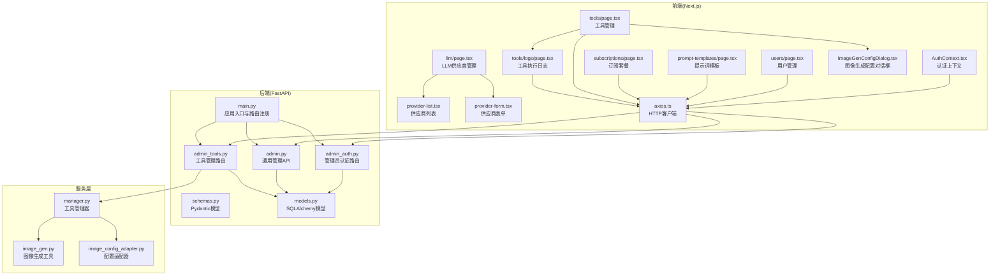

**图表来源**
- [AuthContext.tsx:1-117](file://backend/admin/src/context/AuthContext.tsx#L1-L117)
- [axios.ts:1-105](file://backend/admin/src/lib/axios.ts#L1-L105)
- [users/page.tsx:1-450](file://backend/admin/src/app/admin/users/page.tsx#L1-L450)
- [llm/page.tsx:1-31](file://backend/admin/src/app/admin/llm/page.tsx#L1-L31)
- [llm/components/provider-list.tsx:1-197](file://backend/admin/src/app/admin/llm/components/provider-list.tsx#L1-L197)
- [llm/components/provider-form.tsx:1-663](file://backend/admin/src/app/admin/llm/components/provider-form.tsx#L1-L663)
- [prompt-templates/page.tsx:1-268](file://backend/admin/src/app/admin/prompt-templates/page.tsx#L1-L268)
- [subscriptions/page.tsx:1-522](file://backend/admin/src/app/admin/subscriptions/page.tsx#L1-L522)
- [tools/page.tsx:1-342](file://backend/admin/src/app/admin/tools/page.tsx#L1-L342)
- [tools/logs/page.tsx:1-185](file://backend/admin/src/app/admin/tools/logs/page.tsx#L1-L185)
- [ImageGenConfigDialog.tsx:1-286](file://backend/admin/src/components/admin/tools/ImageGenConfigDialog.tsx#L1-L286)
- [main.py:110-152](file://backend/main.py#L110-L152)
- [admin_auth.py:1-136](file://backend/routers/admin_auth.py#L1-L136)
- [admin.py:1-501](file://backend/routers/admin.py#L1-L501)
- [admin_tools.py:1-196](file://backend/routers/admin_tools.py#L1-L196)
- [schemas.py:1-859](file://backend/schemas.py#L1-L859)
- [models.py:1-447](file://backend/models.py#L1-L447)
- [manager.py:1-108](file://backend/services/tool_manager/manager.py#L1-L108)
- [image_gen.py:1-262](file://backend/services/tool_manager/providers/image_gen.py#L1-L262)
- [image_config_adapter.py:1-182](file://backend/services/image_config_adapter.py#L1-L182)

**章节来源**
- [main.py:110-152](file://backend/main.py#L110-L152)
- [axios.ts:1-105](file://backend/admin/src/lib/axios.ts#L1-L105)

## 核心组件
- 认证与授权
  - 前端认证上下文：负责登录态持久化、路由守卫、自动刷新令牌
  - 后端认证路由：管理员登录、刷新令牌、获取当前管理员信息
- 用户管理
  - 列表、详情、删除、积分调整、订阅设置与取消
- LLM 供应商管理
  - 供应商列表、创建/编辑、删除、连接测试、模型成本配置
- 订阅套餐管理
  - 套餐 CRUD、特性列表、排序、启用/停用、利润计算
- 提示词模板管理
  - 模板 CRUD、过滤搜索、变量定义、默认模板标记
- 工具管理
  - 工具注册表、工具使用统计、执行日志、图像生成配置
- 数据统计与监控
  - 仪表盘统计（用户、剧场、资产、供应商、管理员、工具使用）

**章节来源**
- [AuthContext.tsx:1-117](file://backend/admin/src/context/AuthContext.tsx#L1-L117)
- [admin_auth.py:1-136](file://backend/routers/admin_auth.py#L1-L136)
- [admin.py:29-47](file://backend/routers/admin.py#L29-L47)
- [admin_tools.py:27-34](file://backend/routers/admin_tools.py#L27-L34)
- [users/page.tsx:1-450](file://backend/admin/src/app/admin/users/page.tsx#L1-L450)
- [llm/components/provider-list.tsx:1-197](file://backend/admin/src/app/admin/llm/components/provider-list.tsx#L1-L197)
- [llm/components/provider-form.tsx:1-663](file://backend/admin/src/app/admin/llm/components/provider-form.tsx#L1-L663)
- [subscriptions/page.tsx:1-522](file://backend/admin/src/app/admin/subscriptions/page.tsx#L1-L522)
- [prompt-templates/page.tsx:1-268](file://backend/admin/src/app/admin/prompt-templates/page.tsx#L1-L268)
- [tools/page.tsx:1-342](file://backend/admin/src/app/admin/tools/page.tsx#L1-L342)
- [tools/logs/page.tsx:1-185](file://backend/admin/src/app/admin/tools/logs/page.tsx#L1-L185)

## 架构总览
管理员后台采用"前端 Next.js + 后端 FastAPI"的双栈架构，通过 Axios 进行前后端通信。后端路由按功能模块划分，统一由应用入口注册；数据库模型通过 SQLAlchemy 定义，支持异步会话。

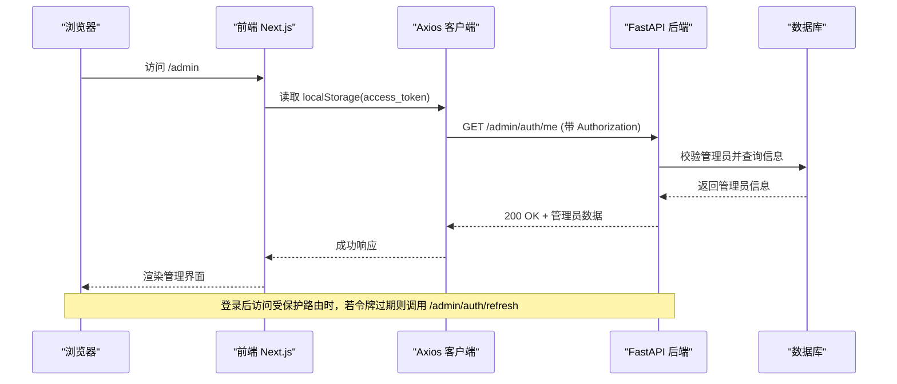

**图表来源**
- [axios.ts:44-102](file://backend/admin/src/lib/axios.ts#L44-L102)
- [admin_auth.py:130-136](file://backend/routers/admin_auth.py#L130-L136)
- [AuthContext.tsx:47-83](file://backend/admin/src/context/AuthContext.tsx#L47-L83)

**章节来源**
- [main.py:138-152](file://backend/main.py#L138-L152)
- [axios.ts:1-105](file://backend/admin/src/lib/axios.ts#L1-L105)
- [admin_auth.py:1-136](file://backend/routers/admin_auth.py#L1-L136)

## 详细组件分析

### 认证与会话管理
- 前端
  - 使用 React Context 管理管理员登录态，本地存储 access_token/refresh_token/user
  - 路由守卫：受保护路由在未登录时跳转到登录页
  - 自动刷新：拦截器在 401 时尝试刷新令牌，并重放原请求
- 后端
  - 管理员登录：校验邮箱/密码、检查账户状态、生成访问/刷新令牌并更新最近登录信息
  - 刷新令牌：验证刷新令牌类型与管理员有效性，签发新的访问令牌
  - 获取当前管理员：基于中间件获取当前激活管理员信息

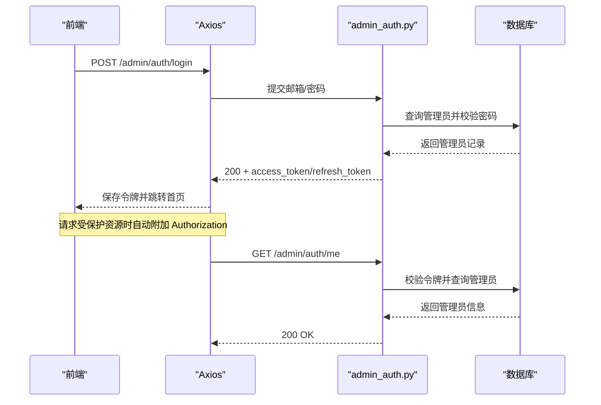

**图表来源**
- [admin_auth.py:36-90](file://backend/routers/admin_auth.py#L36-L90)
- [admin_auth.py:93-127](file://backend/routers/admin_auth.py#L93-L127)
- [admin_auth.py:130-136](file://backend/routers/admin_auth.py#L130-L136)
- [axios.ts:12-24](file://backend/admin/src/lib/axios.ts#L12-L24)
- [axios.ts:44-102](file://backend/admin/src/lib/axios.ts#L44-L102)

**章节来源**
- [AuthContext.tsx:1-117](file://backend/admin/src/context/AuthContext.tsx#L1-L117)
- [axios.ts:1-105](file://backend/admin/src/lib/axios.ts#L1-L105)
- [admin_auth.py:1-136](file://backend/routers/admin_auth.py#L1-L136)

### 用户管理
- 功能点
  - 列出用户、查看详情、删除用户（级联删除相关数据）
  - 手动调整用户积分（充值/扣除），记录交易流水
  - 设置/取消用户订阅，支持自动发放套餐积分
- 前端页面
  - 表格展示用户基本信息、积分、订阅状态、Token 统计、最后登录时间
  - 弹窗表单支持积分调整与订阅设置，包含自动发放开关与时间范围
- 安全与一致性
  - 删除用户时执行级联删除，保证数据完整性
  - 积分调整与订阅变更均写入交易记录，便于审计

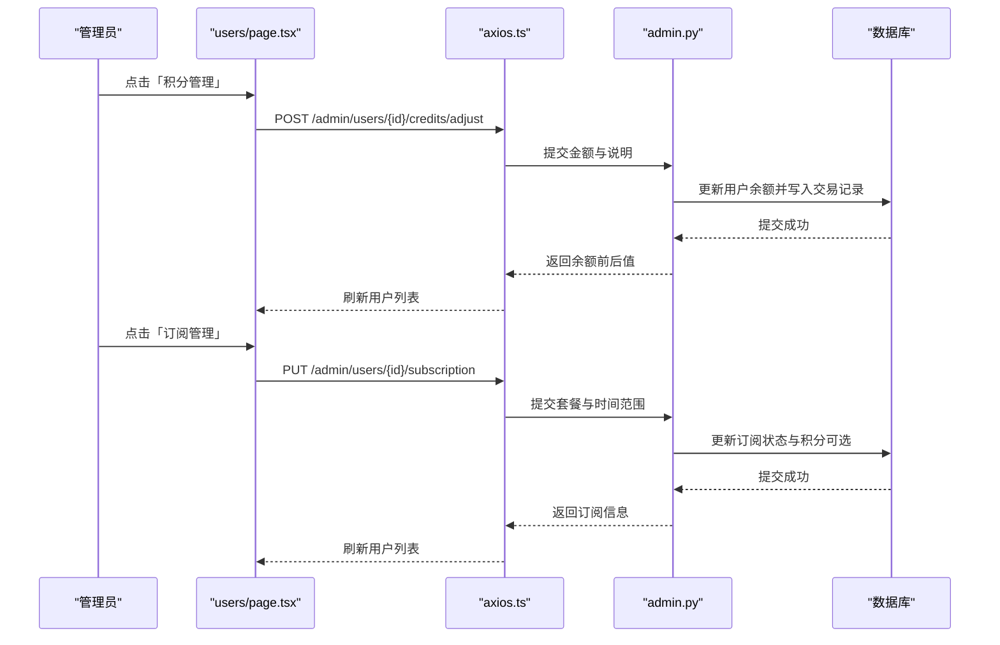

**图表来源**
- [users/page.tsx:148-209](file://backend/admin/src/app/admin/users/page.tsx#L148-L209)
- [admin.py:141-187](file://backend/routers/admin.py#L141-L187)
- [admin.py:220-279](file://backend/routers/admin.py#L220-L279)

**章节来源**
- [users/page.tsx:1-450](file://backend/admin/src/app/admin/users/page.tsx#L1-L450)
- [admin.py:53-136](file://backend/routers/admin.py#L53-L136)
- [admin.py:141-187](file://backend/routers/admin.py#L141-L187)
- [admin.py:220-301](file://backend/routers/admin.py#L220-L301)

### LLM 供应商管理
- 功能点
  - 供应商列表：显示名称、品牌、标签、模型、状态、默认标记与操作
  - 创建/编辑：配置基本信息、模型列表、成本维度、连接认证、状态开关
  - 连接测试：选择首个模型进行连通性测试
  - 删除：永久删除供应商配置
- 前端组件
  - ProviderList：表格展示与删除确认
  - ProviderForm：表单校验、模型字段数组、成本维度配置、测试连接、保存
- 后端路由
  - 供应商 CRUD、测试连接、分页与过滤查询

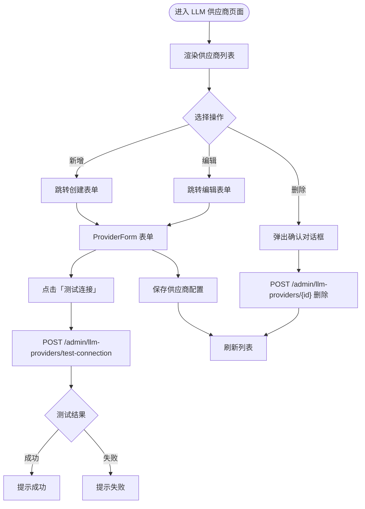

**图表来源**
- [llm/page.tsx:1-31](file://backend/admin/src/app/admin/llm/page.tsx#L1-L31)
- [llm/components/provider-list.tsx:36-54](file://backend/admin/src/app/admin/llm/components/provider-list.tsx#L36-L54)
- [llm/components/provider-form.tsx:74-122](file://backend/admin/src/app/admin/llm/components/provider-form.tsx#L74-L122)
- [llm/components/provider-form.tsx:124-176](file://backend/admin/src/app/admin/llm/components/provider-form.tsx#L124-L176)

**章节来源**
- [llm/page.tsx:1-31](file://backend/admin/src/app/admin/llm/page.tsx#L1-L31)
- [llm/components/provider-list.tsx:1-197](file://backend/admin/src/app/admin/llm/components/provider-list.tsx#L1-L197)
- [llm/components/provider-form.tsx:1-663](file://backend/admin/src/app/admin/llm/components/provider-form.tsx#L1-L663)

### 订阅套餐管理
- 功能点
  - 套餐 CRUD：名称、描述、价格、积分、计费周期、特性列表、排序、启用状态
  - 利润计算：基于 1 积分 = $0.01 的基准成本，计算单价与利润率
  - 排序与展示：支持拖拽排序与前端展示
- 前端页面
  - 表格展示套餐关键指标，包含单价、基准成本、利润率与状态
  - 对话框表单支持特性增删、自动计算指标、启用/停用切换

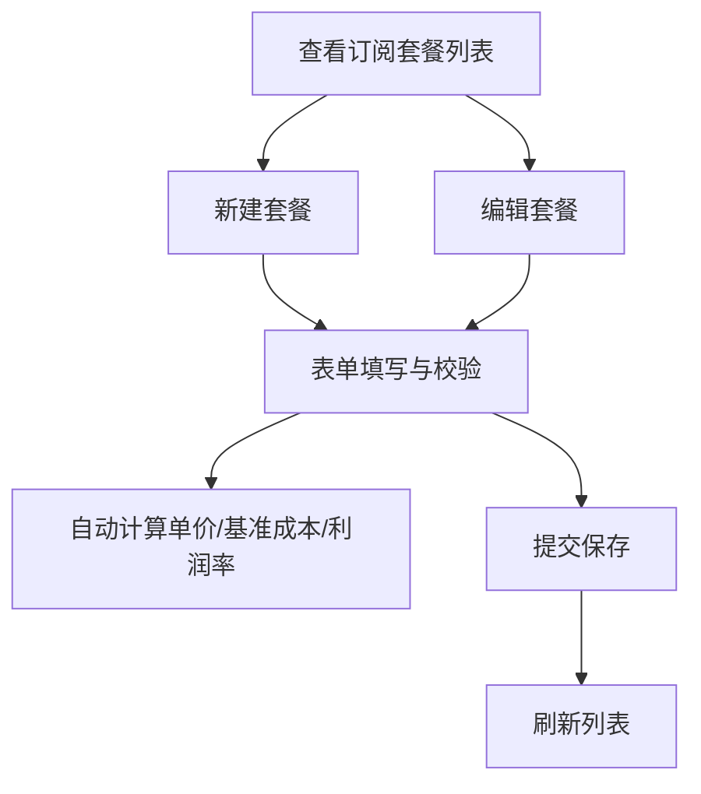

**图表来源**
- [subscriptions/page.tsx:87-189](file://backend/admin/src/app/admin/subscriptions/page.tsx#L87-L189)
- [subscriptions/page.tsx:120-124](file://backend/admin/src/app/admin/subscriptions/page.tsx#L120-L124)

**章节来源**
- [subscriptions/page.tsx:1-522](file://backend/admin/src/app/admin/subscriptions/page.tsx#L1-L522)

### 提示词模板管理
- 功能点
  - 模板 CRUD：名称、描述、模板类型、智能体类型、系统/用户提示词模板、输出格式、变量定义、默认模板标记
  - 过滤与搜索：按模板名称/描述、智能体类型、模板分类过滤
- 前端页面
  - 表格展示模板信息与状态，支持编辑与删除
  - 对话框表单支持变量定义、默认模板标记、启用状态

**章节来源**
- [prompt-templates/page.tsx:1-268](file://backend/admin/src/app/admin/prompt-templates/page.tsx#L1-L268)

### 工具管理
- 工具注册表
  - 显示所有已注册的工具 Provider 及其工具元信息
  - 支持动态构建工具定义，根据上下文条件启用相应工具
- 工具使用统计
  - 总调用次数、错误次数、错误率、平均耗时
  - 按工具名称和 Provider 分组统计
- 执行日志
  - 分页查询工具调用记录，支持多维度过滤
  - 包含工具名称、Provider、状态、耗时、来源等信息
- 图像生成配置
  - 统一的图像生成配置管理，支持多供应商
  - 智能体级别的图像生成参数配置
  - 供应商能力映射与参数适配

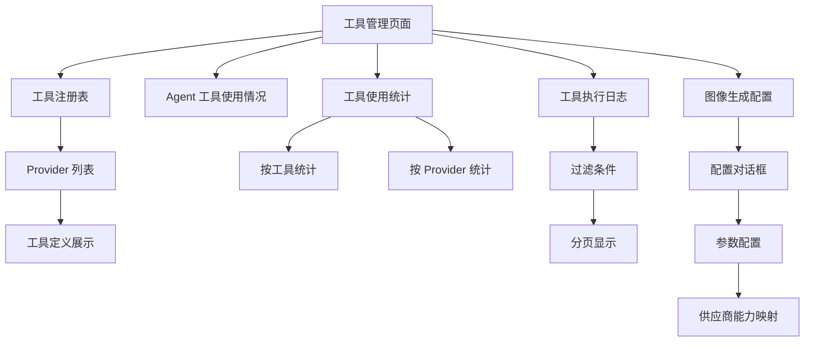

**图表来源**
- [tools/page.tsx:120-171](file://backend/admin/src/app/admin/tools/page.tsx#L120-L171)
- [tools/page.tsx:240-270](file://backend/admin/src/app/admin/tools/page.tsx#L240-L270)
- [tools/logs/page.tsx:25-105](file://backend/admin/src/app/admin/tools/logs/page.tsx#L25-L105)
- [ImageGenConfigDialog.tsx:51-132](file://backend/admin/src/components/admin/tools/ImageGenConfigDialog.tsx#L51-L132)

**章节来源**
- [tools/page.tsx:1-342](file://backend/admin/src/app/admin/tools/page.tsx#L1-L342)
- [tools/logs/page.tsx:1-185](file://backend/admin/src/app/admin/tools/logs/page.tsx#L1-L185)
- [admin_tools.py:27-34](file://backend/routers/admin_tools.py#L27-L34)
- [admin_tools.py:70-124](file://backend/routers/admin_tools.py#L70-L124)
- [admin_tools.py:131-183](file://backend/routers/admin_tools.py#L131-L183)
- [ImageGenConfigDialog.tsx:1-286](file://backend/admin/src/components/admin/tools/ImageGenConfigDialog.tsx#L1-L286)

### 图像生成配置管理
- 统一配置结构
  - `image_generation_enabled`: 图像生成启用状态
  - `image_provider_id`: 图像生成供应商 ID
  - `image_model`: 图像生成模型名称
  - `image_config`: 供应商特定配置对象
- 供应商能力适配
  - Gemini: 支持多种宽高比、画质、输出格式、批量数量
  - xAI: 支持多种宽高比、画质、批量数量（无输出格式选择）
- 参数映射
  - 画质映射：standard/hd/ultra → 不同分辨率或尺寸
  - 批量数量：Gemini 最大 8，xAI 最大 10
  - 宽高比：根据供应商支持集进行验证
- 前端配置界面
  - 动态供应商选择与模型加载
  - 实时能力展示与参数验证
  - 保存配置并更新智能体状态

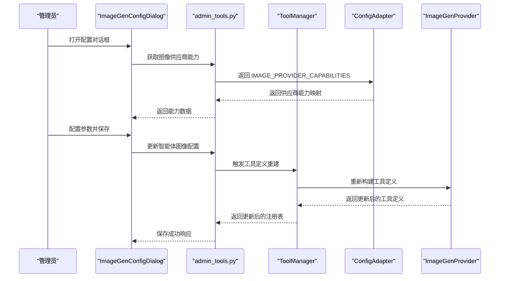

**图表来源**
- [ImageGenConfigDialog.tsx:84-132](file://backend/admin/src/components/admin/tools/ImageGenConfigDialog.tsx#L84-L132)
- [admin_tools.py:190-195](file://backend/routers/admin_tools.py#L190-L195)
- [image_config_adapter.py:51-64](file://backend/services/image_config_adapter.py#L51-L64)
- [image_gen.py:229-247](file://backend/services/tool_manager/providers/image_gen.py#L229-L247)

**章节来源**
- [ImageGenConfigDialog.tsx:1-286](file://backend/admin/src/components/admin/tools/ImageGenConfigDialog.tsx#L1-L286)
- [image_config_adapter.py:1-182](file://backend/services/image_config_adapter.py#L1-L182)
- [image_gen.py:1-262](file://backend/services/tool_manager/providers/image_gen.py#L1-L262)
- [b2c3d4e5f6g7_add_unified_image_config_to_agents.py:21-27](file://backend/migrations/versions/b2c3d4e5f6g7_add_unified_image_config_to_agents.py#L21-L27)

### 数据统计与监控
- 仪表盘统计
  - 用户总数、剧场总数、资产总数、供应商总数、管理员总数
  - 工具总调用次数、错误次数、错误率、平均耗时、注册 Provider 数
- 工具使用统计
  - 按工具名称分组的调用次数与平均耗时
  - 按 Provider 分组的调用次数
- Agent 工具配置概览
  - 每个 Agent 启用的工具能力、画布支持状态
  - 图像生成工具启用状态与配置详情
- 前端实现
  - 通过 API 获取统计数据并在页面展示
  - 实时刷新与分页加载

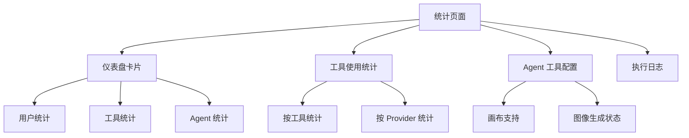

**图表来源**
- [tools/page.tsx:75-118](file://backend/admin/src/app/admin/tools/page.tsx#L75-L118)
- [tools/page.tsx:240-270](file://backend/admin/src/app/admin/tools/page.tsx#L240-L270)
- [tools/page.tsx:272-328](file://backend/admin/src/app/admin/tools/page.tsx#L272-L328)

**章节来源**
- [admin.py:29-47](file://backend/routers/admin.py#L29-L47)
- [admin_tools.py:70-124](file://backend/routers/admin_tools.py#L70-L124)
- [admin_tools.py:40-63](file://backend/routers/admin_tools.py#L40-L63)

### 权限控制系统
- 管理员角色
  - 管理员表包含邮箱、昵称、密码哈希、激活状态、权限等级、积分余额、登录统计等字段
  - 权限等级字段用于区分不同管理员级别（如 admin、super_admin）
- 访问控制
  - 后端路由使用装饰器要求管理员身份
  - 前端路由守卫与 Axios 拦截器配合实现自动刷新与登出

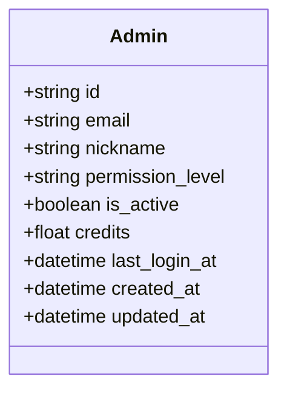

**图表来源**
- [models.py:10-33](file://backend/models.py#L10-L33)

**章节来源**
- [models.py:10-33](file://backend/models.py#L10-L33)
- [admin_auth.py:1-136](file://backend/routers/admin_auth.py#L1-L136)
- [AuthContext.tsx:1-117](file://backend/admin/src/context/AuthContext.tsx#L1-L117)

### 安全考虑
- 密码策略
  - 后端使用哈希函数存储管理员密码，登录时进行密码校验
- 会话管理
  - 前端使用 localStorage 存储令牌，Axios 拦截器自动附加 Authorization 头
  - 401 时自动刷新令牌并重放请求，失败则清空本地存储并跳转登录页
- 审计日志
  - 管理员登录尝试与成功/失败均有日志记录，便于审计
  - 工具执行日志包含详细的调用信息与错误追踪

**章节来源**
- [admin_auth.py:42-78](file://backend/routers/admin_auth.py#L42-L78)
- [axios.ts:44-102](file://backend/admin/src/lib/axios.ts#L44-L102)
- [admin_tools.py:131-183](file://backend/routers/admin_tools.py#L131-L183)

### 与主系统的集成
- 路由注册
  - 主应用入口集中注册所有路由，包括管理员认证、通用管理、智能体、聊天、订阅、提示词模板、视频、剧场、技能、工具管理等
- CORS 配置
  - 允许前端开发环境域名访问，保障跨域请求
- 数据一致性
  - 用户管理涉及积分与订阅变更，均写入交易记录，保证账目一致
  - 删除用户时执行级联删除，避免悬挂数据
  - 工具配置变更通过 ToolManager 动态更新，确保实时生效

**章节来源**
- [main.py:130-152](file://backend/main.py#L130-L152)
- [admin.py:116-136](file://backend/routers/admin.py#L116-L136)
- [admin.py:220-301](file://backend/routers/admin.py#L220-L301)
- [admin_tools.py:27-34](file://backend/routers/admin_tools.py#L27-L34)

## 依赖关系分析
- 前端依赖
  - Axios：统一 HTTP 客户端，拦截器处理认证与刷新
  - SWR：数据获取与缓存，支持列表与详情的实时刷新
  - Zod：表单校验，确保输入合法性
- 后端依赖
  - FastAPI：路由与依赖注入
  - SQLAlchemy：异步 ORM，支持复杂查询与事务
  - Pydantic：数据序列化与校验
- 服务层依赖
  - ToolManager：统一工具注册表、发现与调度
  - 配置适配器：供应商特定配置转换
  - 图像生成工具：多供应商图像生成支持

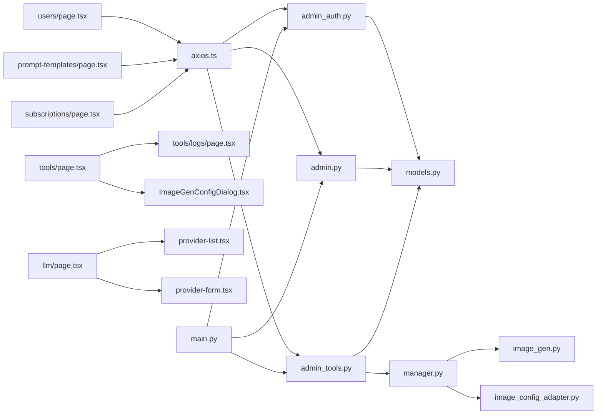

**图表来源**
- [axios.ts:1-105](file://backend/admin/src/lib/axios.ts#L1-L105)
- [users/page.tsx:1-450](file://backend/admin/src/app/admin/users/page.tsx#L1-L450)
- [llm/page.tsx:1-31](file://backend/admin/src/app/admin/llm/page.tsx#L1-L31)
- [llm/components/provider-list.tsx:1-197](file://backend/admin/src/app/admin/llm/components/provider-list.tsx#L1-L197)
- [llm/components/provider-form.tsx:1-663](file://backend/admin/src/app/admin/llm/components/provider-form.tsx#L1-L663)
- [prompt-templates/page.tsx:1-268](file://backend/admin/src/app/admin/prompt-templates/page.tsx#L1-L268)
- [subscriptions/page.tsx:1-522](file://backend/admin/src/app/admin/subscriptions/page.tsx#L1-L522)
- [tools/page.tsx:1-342](file://backend/admin/src/app/admin/tools/page.tsx#L1-L342)
- [tools/logs/page.tsx:1-185](file://backend/admin/src/app/admin/tools/logs/page.tsx#L1-L185)
- [ImageGenConfigDialog.tsx:1-286](file://backend/admin/src/components/admin/tools/ImageGenConfigDialog.tsx#L1-L286)
- [admin_auth.py:1-136](file://backend/routers/admin_auth.py#L1-L136)
- [admin.py:1-501](file://backend/routers/admin.py#L1-L501)
- [admin_tools.py:1-196](file://backend/routers/admin_tools.py#L1-L196)
- [models.py:1-447](file://backend/models.py#L1-L447)
- [main.py:138-152](file://backend/main.py#L138-L152)
- [manager.py:1-108](file://backend/services/tool_manager/manager.py#L1-L108)
- [image_gen.py:1-262](file://backend/services/tool_manager/providers/image_gen.py#L1-L262)
- [image_config_adapter.py:1-182](file://backend/services/image_config_adapter.py#L1-L182)

**章节来源**
- [axios.ts:1-105](file://backend/admin/src/lib/axios.ts#L1-L105)
- [main.py:138-152](file://backend/main.py#L138-L152)

## 性能考虑
- 前端
  - 使用 SWR 进行数据缓存与并发请求队列，减少重复请求
  - 表单校验在客户端完成，降低无效请求
  - 图像生成配置对话框使用 useMemo 优化供应商能力计算
- 后端
  - 异步数据库会话提升并发处理能力
  - 路由层使用分页参数（skip/limit）控制查询规模
  - 工具管理使用缓存的工具定义，避免重复构建
- 缓存与刷新
  - Axios 拦截器在刷新期间排队并发请求，避免重复刷新
  - ToolManager 缓存工具定义，仅在配置变更时重建

## 故障排除指南
- 登录失败
  - 检查邮箱/密码是否正确，确认管理员账户处于激活状态
  - 查看后端日志中登录尝试与失败记录
- 401 未授权
  - 确认本地存储中 access_token/refresh_token 是否存在
  - 若触发自动刷新仍失败，清除本地存储并重新登录
- 供应商测试连接失败
  - 检查 API 密钥、基础 URL 与模型名称是否正确
  - 确认网络可达性与代理设置
- 工具执行失败
  - 查看工具执行日志中的错误信息
  - 检查供应商配置与模型可用性
  - 验证智能体的工具启用状态
- 图像生成配置问题
  - 确认供应商支持的参数范围
  - 检查批量数量限制与输出格式支持
  - 验证供应商 API 密钥与权限

**章节来源**
- [admin_auth.py:50-71](file://backend/routers/admin_auth.py#L50-L71)
- [axios.ts:72-97](file://backend/admin/src/lib/axios.ts#L72-L97)
- [llm/components/provider-form.tsx:74-122](file://backend/admin/src/app/admin/llm/components/provider-form.tsx#L74-L122)
- [admin_tools.py:131-183](file://backend/routers/admin_tools.py#L131-L183)
- [image_config_adapter.py:128-145](file://backend/services/image_config_adapter.py#L128-L145)

## 结论
管理员后台系统通过清晰的前后端职责划分与完善的认证、授权、数据管理与审计机制，实现了对用户、智能体、LLM 供应商、订阅、提示词模板和工具的高效管理。新增的图像生成配置管理和工具管理功能进一步增强了系统的灵活性与可扩展性，支持多供应商统一配置与实时监控。系统具备良好的扩展性与安全性，适合在主系统中作为统一的管理入口使用。

## 附录
- 管理员操作工作流（从登录到各项管理功能）
  1) 登录：输入邮箱/密码，后端校验并通过后返回访问/刷新令牌
  2) 首页：自动获取当前管理员信息，渲染管理界面
  3) 用户管理：查看用户列表，进行积分调整与订阅设置
  4) LLM 供应商：查看/创建/编辑供应商，配置模型与成本，测试连接
  5) 订阅套餐：创建/编辑套餐，自动计算单价与利润率
  6) 提示词模板：创建/编辑模板，定义变量与输出格式
  7) 工具管理：查看工具注册表，监控工具使用统计，管理执行日志
  8) 图像生成配置：为智能体配置图像生成参数，支持多供应商统一管理
  9) 退出：清除本地存储并跳转登录页