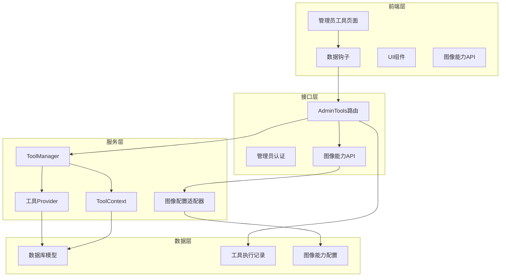
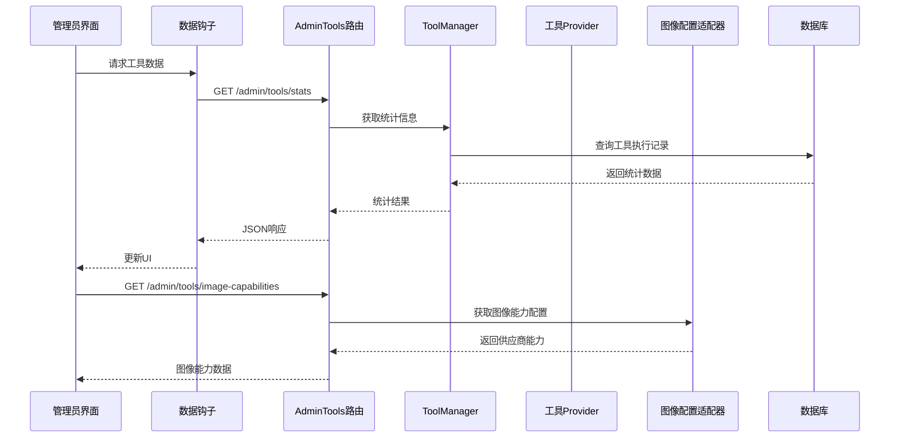
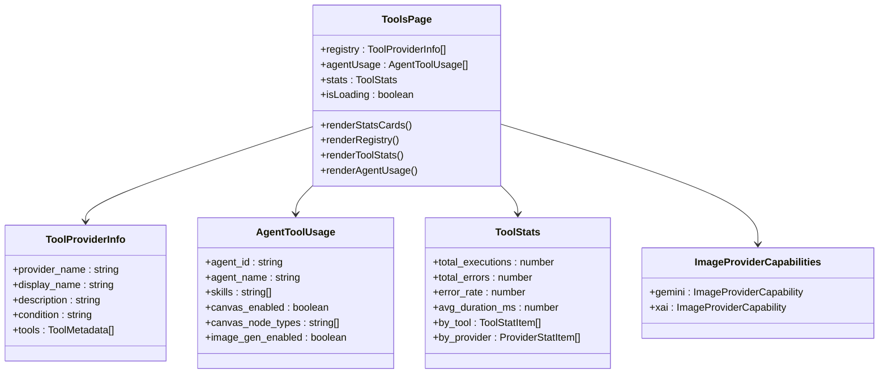
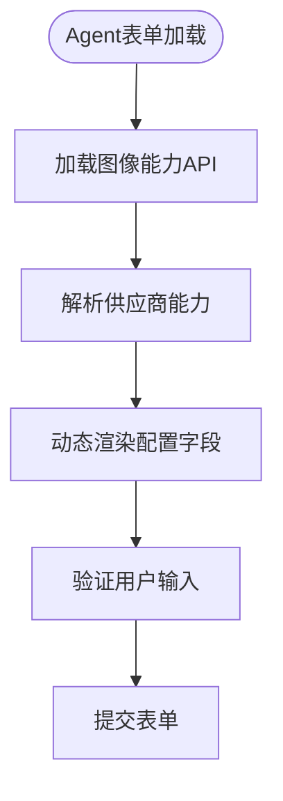
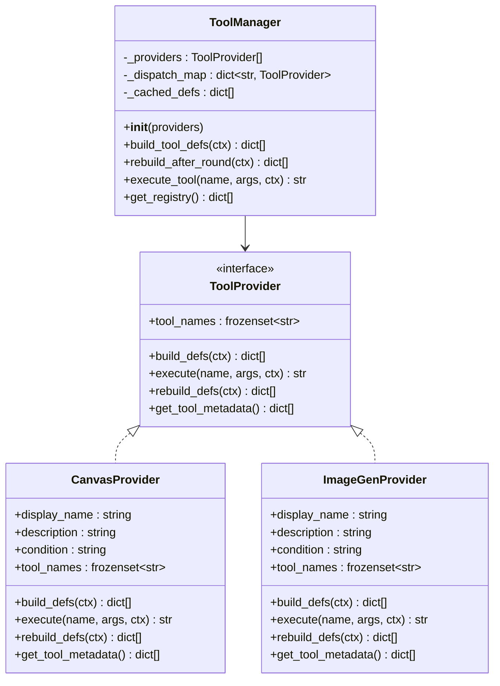
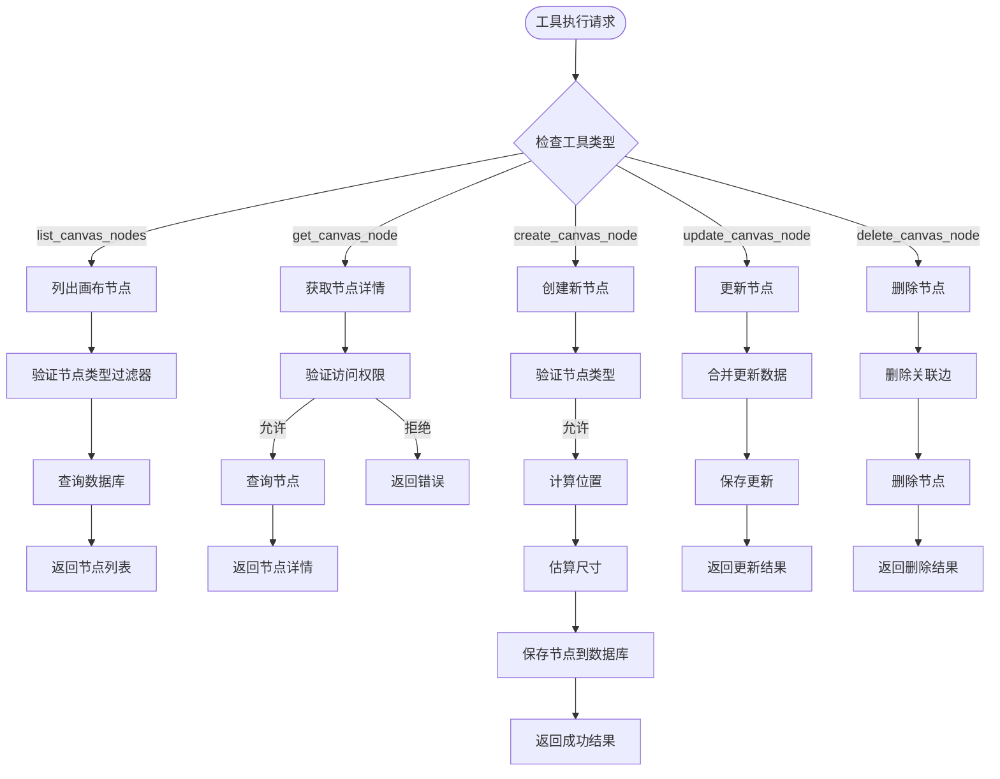
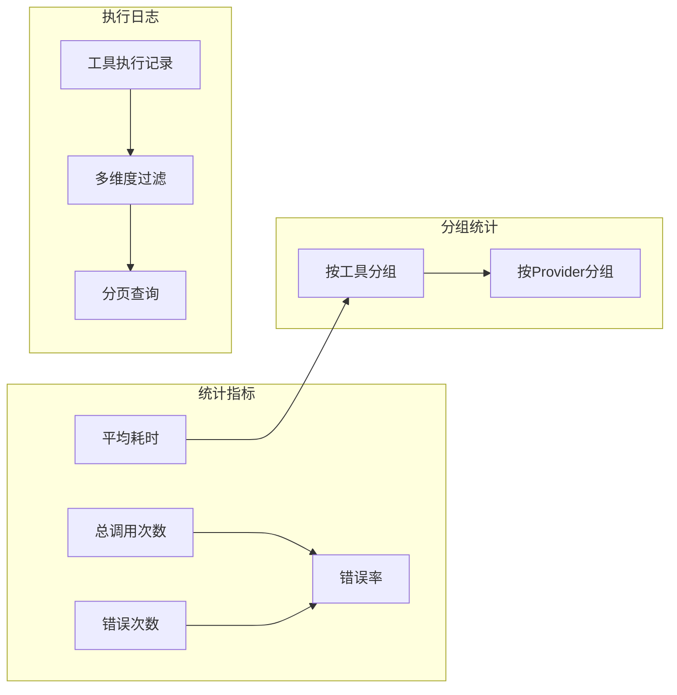
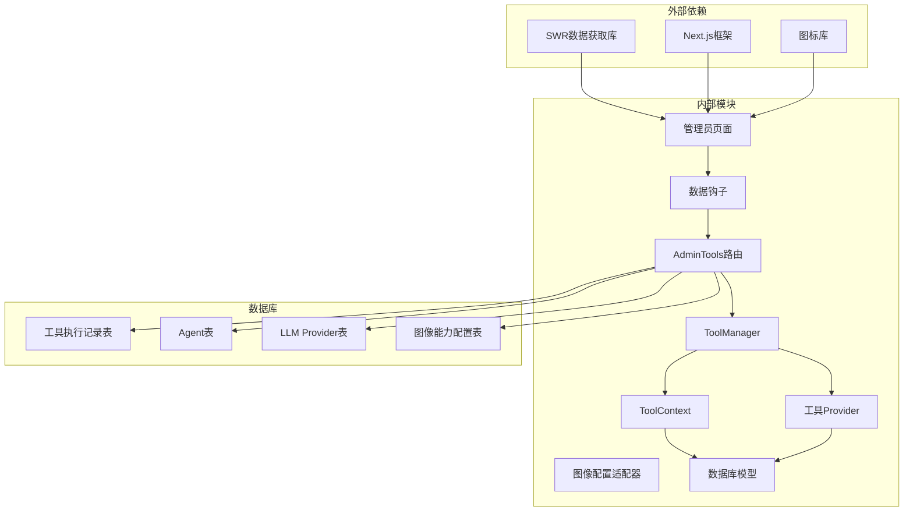

# 管理员工具管理

<cite>
**本文档引用的文件**
- [backend/admin/src/app/admin/tools/page.tsx](file://backend/admin/src/app/admin/tools/page.tsx)
- [backend/routers/admin_tools.py](file://backend/routers/admin_tools.py)
- [backend/services/tool_manager/manager.py](file://backend/services/tool_manager/manager.py)
- [backend/services/tool_manager/context.py](file://backend/services/tool_manager/context.py)
- [backend/services/tool_manager/protocol.py](file://backend/services/tool_manager/protocol.py)
- [backend/services/tool_manager/providers/__init__.py](file://backend/services/tool_manager/providers/__init__.py)
- [backend/services/tool_manager/providers/canvas.py](file://backend/services/tool_manager/providers/canvas.py)
- [backend/services/tool_manager/providers/image_gen.py](file://backend/services/tool_manager/providers/image_gen.py)
- [backend/admin/src/hooks/useToolRegistry.ts](file://backend/admin/src/hooks/useToolRegistry.ts)
- [backend/admin/src/types/index.ts](file://backend/admin/src/types/index.ts)
- [backend/services/image_config_adapter.py](file://backend/services/image_config_adapter.py)
- [backend/admin/src/components/admin/agents/AgentForm/Parameters.tsx](file://backend/admin/src/components/admin/agents/AgentForm/Parameters.tsx)
- [backend/admin/src/components/admin/agents/AgentForm/Tools/ToolCapabilities.tsx](file://backend/admin/src/components/admin/agents/AgentForm/Tools/ToolCapabilities.tsx)
- [backend/models.py](file://backend/models.py)
- [backend/schemas.py](file://backend/schemas.py)
</cite>

## 更新摘要
**变更内容**
- 新增图像供应商能力API端点 `/api/admin/tools/image-capabilities`
- 增强管理员工具管理界面以支持动态图像配置
- 前端组件重构以支持统一图像配置系统
- 新增 `useImageCapabilities` 钩子用于获取图像供应商能力
- 更新图像配置适配器以支持统一图像配置系统

## 目录
1. [简介](#简介)
2. [项目结构](#项目结构)
3. [核心组件](#核心组件)
4. [架构概览](#架构概览)
5. [详细组件分析](#详细组件分析)
6. [依赖关系分析](#依赖关系分析)
7. [性能考虑](#性能考虑)
8. [故障排除指南](#故障排除指南)
9. [结论](#结论)

## 简介

管理员工具管理系统是无限游戏平台中的核心管理功能模块，负责统一管理和监控系统中所有工具Provider的运行状态。该系统提供了完整的工具生命周期管理，包括工具注册表展示、Agent工具配置监控、执行统计分析以及详细的执行日志追踪。

**更新** 系统现已支持统一图像配置管理，通过图像供应商能力API为管理员提供动态的图像生成配置支持。系统采用分层架构设计，通过ToolManager中央协调器统一管理各种工具Provider，实现了高度模块化和可扩展的工具管理体系。

管理员可以通过直观的Web界面实时监控工具使用情况，进行故障诊断和性能优化，同时支持跨供应商的统一图像配置管理。

## 项目结构

管理员工具管理系统的整体架构分为三层：



**图表来源**
- [backend/admin/src/app/admin/tools/page.tsx:14-215](file://backend/admin/src/app/admin/tools/page.tsx#L14-L215)
- [backend/routers/admin_tools.py:16-20](file://backend/routers/admin_tools.py#L16-L20)
- [backend/services/image_config_adapter.py:48-64](file://backend/services/image_config_adapter.py#L48-L64)

**章节来源**
- [backend/admin/src/app/admin/tools/page.tsx:1-215](file://backend/admin/src/app/admin/tools/page.tsx#L1-L215)
- [backend/routers/admin_tools.py:1-196](file://backend/routers/admin_tools.py#L1-L196)

## 核心组件

管理员工具管理系统由以下核心组件构成：

### 1. 前端管理界面
- **工具管理页面**：提供工具注册表、统计信息和Agent配置的可视化展示
- **数据钩子**：封装SWR数据获取逻辑，支持实时刷新和错误处理
- **UI组件库**：基于Shadcn/ui的现代化组件系统
- **图像能力API集成**：支持动态图像配置的前端组件

### 2. 后端API接口
- **工具注册表API**：返回所有已注册的工具Provider及其工具定义
- **Agent使用情况API**：展示每个Agent启用的工具能力配置
- **统计分析API**：提供工具调用次数、错误率和性能指标
- **执行日志API**：支持分页查询和多维度过滤的工具调用记录
- **图像供应商能力API**：返回每个图像供应商支持的参数选项和能力配置

### 3. 工具管理核心
- **ToolManager**：中央协调器，管理所有工具Provider的生命周期
- **ToolProvider协议**：定义工具Provider的标准接口规范
- **ToolContext**：统一的工具执行上下文，封装环境信息
- **图像配置适配器**：统一图像配置与供应商特定配置之间的转换

**章节来源**
- [backend/admin/src/app/admin/tools/page.tsx:14-215](file://backend/admin/src/app/admin/tools/page.tsx#L14-L215)
- [backend/routers/admin_tools.py:27-196](file://backend/routers/admin_tools.py#L27-L196)
- [backend/services/tool_manager/manager.py:23-108](file://backend/services/tool_manager/manager.py#L23-L108)
- [backend/services/image_config_adapter.py:134-182](file://backend/services/image_config_adapter.py#L134-L182)

## 架构概览

系统采用分层架构设计，确保各层职责清晰、耦合度低：



**图表来源**
- [backend/admin/src/hooks/useToolRegistry.ts:5-37](file://backend/admin/src/hooks/useToolRegistry.ts#L5-L37)
- [backend/routers/admin_tools.py:27-124](file://backend/routers/admin_tools.py#L27-L124)
- [backend/services/tool_manager/manager.py:96-108](file://backend/services/tool_manager/manager.py#L96-L108)
- [backend/services/image_config_adapter.py:48-64](file://backend/services/image_config_adapter.py#L48-L64)

## 详细组件分析

### 工具管理页面组件

管理员工具页面是一个综合性的监控仪表板，包含多个功能模块：



**图表来源**
- [backend/admin/src/app/admin/tools/page.tsx:14-215](file://backend/admin/src/app/admin/tools/page.tsx#L14-L215)
- [backend/admin/src/types/index.ts:313-323](file://backend/admin/src/types/index.ts#L313-L323)

#### 统计卡片组件
页面顶部显示四个关键统计指标：
- **总调用次数**：系统工具的累计调用总数
- **错误次数**：工具执行失败的总次数
- **错误率**：错误次数占总调用次数的百分比
- **平均耗时**：工具执行的平均时间（毫秒）
- **注册Provider数量**：系统中已注册的工具Provider总数

#### 工具注册表展示
系统会列出所有已注册的工具Provider，每个Provider包含：
- 显示名称和描述
- 启用条件说明
- 支持的工具列表（以标签形式展示）

#### 工具调用统计
按工具名称分组显示调用统计：
- 工具名称（等宽字体显示）
- 调用次数（右对齐）
- 平均耗时（右对齐）

#### Agent工具配置
展示每个Agent的工具配置概览：
- **画布工具**：显示启用的节点类型数量
- **图像生成**：显示是否启用图像生成功能
- **Skills**：显示启用的技能列表

**章节来源**
- [backend/admin/src/app/admin/tools/page.tsx:44-211](file://backend/admin/src/app/admin/tools/page.tsx#L44-L211)

### 图像供应商能力API

**新增** 系统现在提供统一的图像供应商能力API，支持动态配置管理：

```mermaid
classDiagram
class ImageProviderCapabilities {
+gemini : ImageProviderCapability
+xai : ImageProviderCapability
}
class ImageProviderCapability {
+aspect_ratios : string[]
+qualities : string[]
+output_formats : string[]
+batch_count : { min : number, max : number }
}
class ImageCapabilitiesAPI {
+get_image_capabilities() ImageProviderCapabilities
}
ImageCapabilitiesAPI --> ImageProviderCapabilities
ImageProviderCapabilities --> ImageProviderCapability
```

**图表来源**
- [backend/routers/admin_tools.py:190-195](file://backend/routers/admin_tools.py#L190-L195)
- [backend/admin/src/types/index.ts:313-323](file://backend/admin/src/types/index.ts#L313-L323)

#### 能力配置结构
API返回每个图像供应商的完整能力配置：

| 供应商 | 支持的宽高比 | 支持的画质 | 支持的输出格式 | 批量生成限制 |
|--------|--------------|------------|----------------|--------------|
| Gemini | auto, 16:9, 4:3, 1:1, 3:4, 9:16 | standard, hd, ultra | png, jpeg, webp | 1-8张 |
| xAI | 1:1, 16:9, 9:16, 4:3, 3:4, 3:2, 2:3, 2:1, 1:2, 19.5:9, 9:19.5, 20:9, 9:20, auto | standard, hd | 无 | 1-10张 |

#### 前端集成
前端通过 `useImageCapabilities` 钩子获取和使用图像能力配置：



**图表来源**
- [backend/admin/src/hooks/useToolRegistry.ts:30-36](file://backend/admin/src/hooks/useToolRegistry.ts#L30-L36)
- [backend/admin/src/components/admin/agents/AgentForm/Parameters.tsx:95-109](file://backend/admin/src/components/admin/agents/AgentForm/Parameters.tsx#L95-L109)

**章节来源**
- [backend/routers/admin_tools.py:190-195](file://backend/routers/admin_tools.py#L190-L195)
- [backend/admin/src/hooks/useToolRegistry.ts:30-36](file://backend/admin/src/hooks/useToolRegistry.ts#L30-L36)
- [backend/admin/src/components/admin/agents/AgentForm/Parameters.tsx:95-109](file://backend/admin/src/components/admin/agents/AgentForm/Parameters.tsx#L95-L109)

### ToolManager核心管理器

ToolManager是系统的核心协调器，负责管理所有工具Provider：



**图表来源**
- [backend/services/tool_manager/manager.py:23-108](file://backend/services/tool_manager/manager.py#L23-L108)
- [backend/services/tool_manager/protocol.py:12-44](file://backend/services/tool_manager/protocol.py#L12-L44)
- [backend/services/tool_manager/providers/canvas.py:513-549](file://backend/services/tool_manager/providers/canvas.py#L513-L549)
- [backend/services/tool_manager/providers/image_gen.py:229-262](file://backend/services/tool_manager/providers/image_gen.py#L229-L262)

#### 工具定义构建
ToolManager通过遍历所有Provider来构建完整的工具定义列表。每个Provider负责生成特定类型的工具定义，然后合并到统一的列表中。

#### 动态调度机制
系统使用哈希映射实现O(1)时间复杂度的工具调度，通过工具名称快速定位对应的Provider。

#### 缓存策略
为了提高性能，ToolManager实现了智能缓存机制：
- 缓存构建的工具定义
- 在工具执行轮次后检查变更
- 只在必要时重建工具定义

**章节来源**
- [backend/services/tool_manager/manager.py:42-82](file://backend/services/tool_manager/manager.py#L42-L82)

### 工具Provider实现

系统目前支持两种主要的工具Provider：

#### 画布工具Provider
CanvasProvider专门处理剧场画布节点的CRUD操作：



**图表来源**
- [backend/services/tool_manager/providers/canvas.py:300-475](file://backend/services/tool_manager/providers/canvas.py#L300-L475)

#### 图像生成Provider
ImageGenProvider支持多种图像生成供应商：

| 供应商 | 支持特性 | 参数配置 |
|--------|----------|----------|
| xAI | 文本到图像生成 | aspect_ratio, resolution, n, response_format |
| Gemini | 多种输出格式 | aspect_ratio, image_size, output_format, batch_count |

**章节来源**
- [backend/services/tool_manager/providers/canvas.py:1-549](file://backend/services/tool_manager/providers/canvas.py#L1-L549)
- [backend/services/tool_manager/providers/image_gen.py:1-262](file://backend/services/tool_manager/providers/image_gen.py#L1-L262)

### 数据统计与分析

系统提供全面的工具使用统计分析功能：



**图表来源**
- [backend/routers/admin_tools.py:70-183](file://backend/routers/admin_tools.py#L70-L183)

**章节来源**
- [backend/routers/admin_tools.py:70-183](file://backend/routers/admin_tools.py#L70-L183)

## 依赖关系分析

系统采用松耦合的设计模式，各组件间通过明确的接口进行交互：



**图表来源**
- [backend/admin/src/hooks/useToolRegistry.ts:1-37](file://backend/admin/src/hooks/useToolRegistry.ts#L1-L37)
- [backend/routers/admin_tools.py:1-20](file://backend/routers/admin_tools.py#L1-L20)

### 模块间依赖关系

系统遵循单一职责原则，各模块职责明确：

- **前端模块**：负责用户界面展示和用户交互
- **路由模块**：处理HTTP请求和响应，实现业务逻辑
- **服务模块**：提供核心业务功能和工具管理
- **数据模块**：封装数据库操作和数据模型

**章节来源**
- [backend/admin/src/app/admin/tools/page.tsx:1-215](file://backend/admin/src/app/admin/tools/page.tsx#L1-L215)
- [backend/routers/admin_tools.py:1-196](file://backend/routers/admin_tools.py#L1-L196)

## 性能考虑

管理员工具管理系统在设计时充分考虑了性能优化：

### 1. 缓存策略
- **工具定义缓存**：ToolManager缓存构建的工具定义，避免重复计算
- **统计结果缓存**：使用SWR库实现客户端缓存和自动刷新
- **数据库查询优化**：使用分页查询和适当的索引
- **图像能力缓存**：前端缓存图像供应商能力配置，减少API调用

### 2. 异步处理
- **异步数据库操作**：使用SQLAlchemy异步会话减少阻塞
- **并发执行**：多个Provider并行处理工具调用
- **流式响应**：大响应数据采用流式传输
- **懒加载**：图像能力配置按需加载

### 3. 内存管理
- **惰性加载**：ToolContext实现惰性解析，只在需要时加载数据
- **对象池**：复用数据库连接和工具实例
- **垃圾回收**：及时释放不再使用的资源

## 故障排除指南

### 常见问题及解决方案

#### 1. 工具无法加载
**症状**：工具注册表显示为空或加载缓慢
**可能原因**：
- ToolManager初始化失败
- Provider注册异常
- 数据库连接问题

**解决步骤**：
1. 检查ToolManager构造函数中的Provider列表
2. 验证每个Provider的tool_names属性
3. 确认数据库连接正常

#### 2. 统计数据显示异常
**症状**：统计数字不准确或显示错误
**可能原因**：
- ToolExecution表数据异常
- SQL聚合查询错误
- 缓存数据过期

**解决步骤**：
1. 验证ToolExecution表结构
2. 检查统计查询的SQL语句
3. 清除缓存并重新加载

#### 3. API响应超时
**症状**：工具管理页面加载缓慢或超时
**可能原因**：
- 数据库查询性能问题
- 网络延迟
- 服务器资源不足

**解决步骤**：
1. 优化数据库查询索引
2. 实施分页和懒加载
3. 增加服务器资源

#### 4. 图像能力配置错误
**症状**：图像配置字段显示异常或验证失败
**可能原因**：
- 图像能力API返回数据格式错误
- 前端组件未正确处理能力配置
- 供应商类型识别错误

**解决步骤**：
1. 验证图像能力API的返回格式
2. 检查前端组件对能力配置的处理逻辑
3. 确认供应商类型映射正确

**章节来源**
- [backend/services/tool_manager/manager.py:26-37](file://backend/services/tool_manager/manager.py#L26-L37)
- [backend/routers/admin_tools.py:70-124](file://backend/routers/admin_tools.py#L70-L124)
- [backend/admin/src/components/admin/agents/AgentForm/Parameters.tsx:95-109](file://backend/admin/src/components/admin/agents/AgentForm/Parameters.tsx#L95-L109)

## 结论

管理员工具管理系统通过模块化设计和分层架构，实现了高效、可扩展的工具管理功能。系统的主要优势包括：

1. **统一管理**：通过ToolManager集中管理所有工具Provider
2. **实时监控**：提供完整的工具使用统计和执行日志
3. **灵活扩展**：基于协议的Provider设计支持新工具快速集成
4. **性能优化**：多层缓存和异步处理确保系统响应速度
5. **用户体验**：直观的Web界面和实时数据更新
6. **统一图像配置**：支持跨供应商的统一图像生成配置管理
7. **动态能力管理**：通过图像能力API提供实时的供应商能力信息

**更新** 新增的图像供应商能力API和统一图像配置系统为管理员提供了更强大的工具管理能力，支持动态配置和跨供应商的图像生成管理。该系统为无限游戏平台的工具生态系统提供了坚实的基础，支持未来功能的持续扩展和优化。通过合理的架构设计和性能优化，系统能够满足大规模工具管理的需求，为管理员提供全面的工具监控和管理能力。