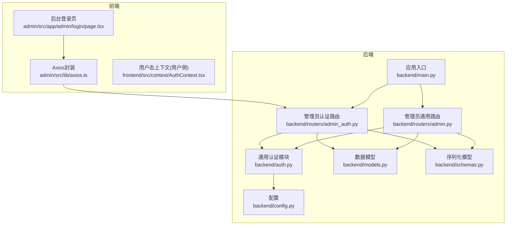
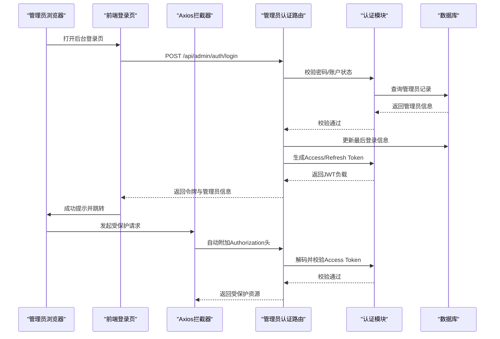
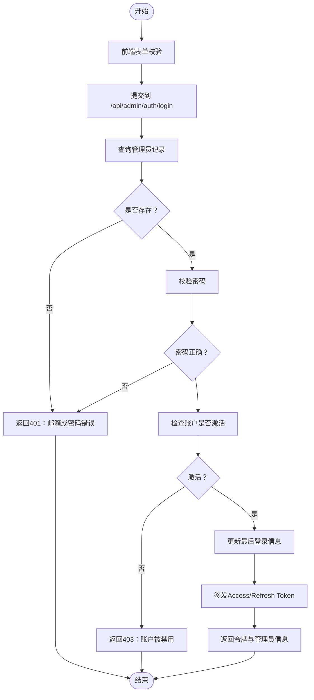
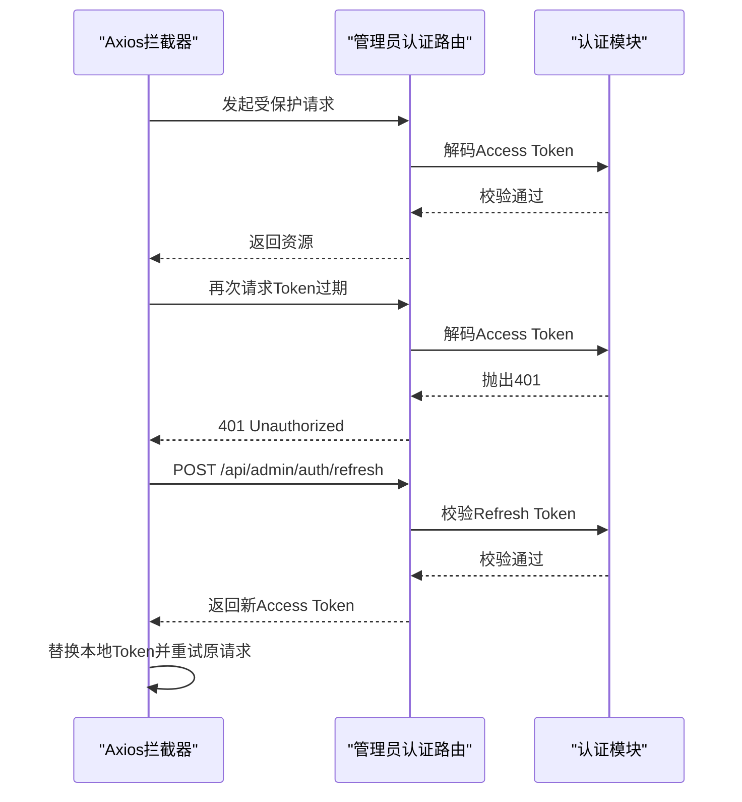
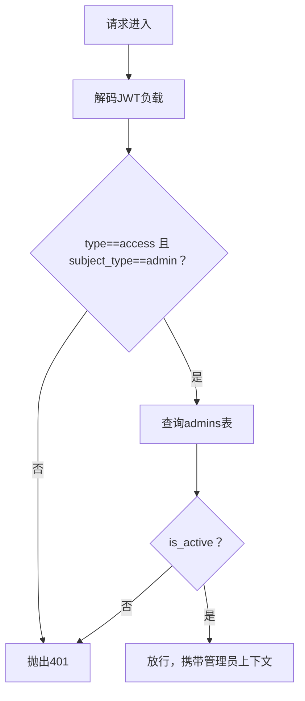
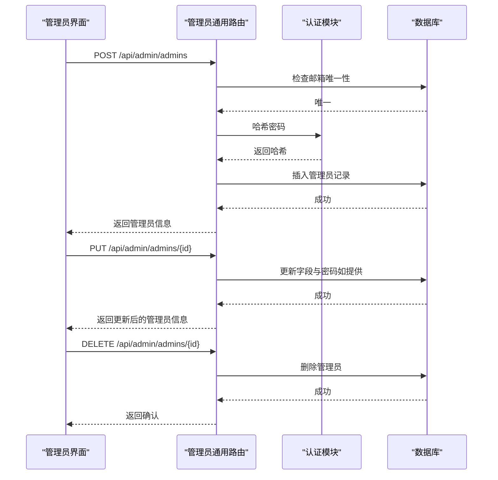
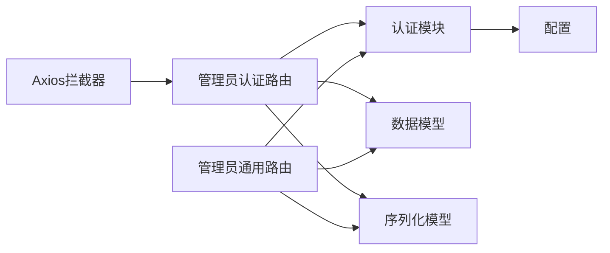

# 管理员认证

<cite>
**本文引用的文件**
- [backend/admin/src/app/admin/login/page.tsx](file://backend/admin/src/app/admin/login/page.tsx)
- [backend/routers/admin_auth.py](file://backend/routers/admin_auth.py)
- [backend/auth.py](file://backend/auth.py)
- [backend/models.py](file://backend/models.py)
- [backend/schemas.py](file://backend/schemas.py)
- [backend/config.py](file://backend/config.py)
- [backend/routers/admin.py](file://backend/routers/admin.py)
- [backend/main.py](file://backend/main.py)
- [backend/admin/src/lib/axios.ts](file://backend/admin/src/lib/axios.ts)
- [frontend/src/context/AuthContext.tsx](file://frontend/src/context/AuthContext.tsx)
</cite>

## 目录
1. [简介](#简介)
2. [项目结构](#项目结构)
3. [核心组件](#核心组件)
4. [架构总览](#架构总览)
5. [详细组件分析](#详细组件分析)
6. [依赖关系分析](#依赖关系分析)
7. [性能考量](#性能考量)
8. [故障排查指南](#故障排查指南)
9. [结论](#结论)
10. [附录](#附录)

## 简介
本文件面向“管理员认证系统”，围绕管理员登录流程、凭据验证、会话与令牌管理、权限与访问控制、安全措施、错误处理与用户体验优化、管理员账户的创建/重置/权限分配，以及与主系统认证体系的集成与数据同步进行系统化说明。文档以代码为依据，结合时序图、类图与流程图，帮助开发者与运维人员快速理解并维护该认证子系统。

## 项目结构
管理员认证相关的关键位置与职责如下：
- 前端登录页面与HTTP客户端
  - 后台管理前端登录页：负责表单校验、调用登录接口、本地持久化与错误提示
  - Axios封装：自动注入Authorization头、统一拦截401并触发刷新
- 后端路由与认证服务
  - 独立的管理员认证路由：登录、刷新、当前管理员信息
  - 通用认证模块：密码哈希/校验、JWT签发/解码、依赖注入（管理员/用户）
  - 数据模型与序列化：管理员表、登录/令牌响应等
  - 应用入口：注册路由、CORS、生命周期与中间件

**图表来源**
- [backend/main.py:138-152](file://backend/main.py#L138-L152)
- [backend/routers/admin_auth.py:29-33](file://backend/routers/admin_auth.py#L29-L33)
- [backend/routers/admin.py:19-23](file://backend/routers/admin.py#L19-L23)
- [backend/admin/src/app/admin/login/page.tsx:51-118](file://backend/admin/src/app/admin/login/page.tsx#L51-L118)
- [backend/admin/src/lib/axios.ts:1-105](file://backend/admin/src/lib/axios.ts#L1-L105)
- [backend/auth.py:1-229](file://backend/auth.py#L1-L229)
- [backend/models.py:10-33](file://backend/models.py#L10-L33)
- [backend/schemas.py:68-111](file://backend/schemas.py#L68-L111)
- [backend/config.py:26-30](file://backend/config.py#L26-L30)

**章节来源**
- [backend/main.py:138-152](file://backend/main.py#L138-L152)
- [backend/routers/admin_auth.py:29-33](file://backend/routers/admin_auth.py#L29-L33)
- [backend/routers/admin.py:19-23](file://backend/routers/admin.py#L19-L23)
- [backend/admin/src/app/admin/login/page.tsx:51-118](file://backend/admin/src/app/admin/login/page.tsx#L51-L118)
- [backend/admin/src/lib/axios.ts:1-105](file://backend/admin/src/lib/axios.ts#L1-L105)
- [backend/auth.py:1-229](file://backend/auth.py#L1-L229)
- [backend/models.py:10-33](file://backend/models.py#L10-L33)
- [backend/schemas.py:68-111](file://backend/schemas.py#L68-L111)
- [backend/config.py:26-30](file://backend/config.py#L26-L30)

## 核心组件
- 登录页面与表单校验
  - 使用表单库进行字段校验，提交后调用管理员登录接口，处理记住邮箱、成功提示与错误分支
- Axios拦截器
  - 请求头自动附加Bearer Token；响应401时排队并发请求，使用刷新接口获取新Access Token并重试
- 管理员认证路由
  - 登录：校验邮箱/密码/账户状态，更新最近登录信息，签发Access/Refresh Token
  - 刷新：校验Refresh Token类型与主体类型，重新签发Access Token
  - 当前管理员：返回当前管理员信息
- 通用认证模块
  - 密码哈希/校验（bcrypt）
  - JWT签发（Access/Refresh），解码并校验
  - 依赖注入：管理员身份解析、活跃状态校验、权限要求
- 数据模型与序列化
  - 管理员表字段、登录/令牌响应模型
- 配置
  - JWT密钥、算法、Access/Refresh过期时间

**章节来源**
- [backend/admin/src/app/admin/login/page.tsx:43-118](file://backend/admin/src/app/admin/login/page.tsx#L43-L118)
- [backend/admin/src/lib/axios.ts:12-102](file://backend/admin/src/lib/axios.ts#L12-L102)
- [backend/routers/admin_auth.py:36-91](file://backend/routers/admin_auth.py#L36-L91)
- [backend/routers/admin_auth.py:93-127](file://backend/routers/admin_auth.py#L93-L127)
- [backend/routers/admin_auth.py:130-136](file://backend/routers/admin_auth.py#L130-L136)
- [backend/auth.py:19-74](file://backend/auth.py#L19-L74)
- [backend/auth.py:119-156](file://backend/auth.py#L119-L156)
- [backend/models.py:10-33](file://backend/models.py#L10-L33)
- [backend/schemas.py:68-111](file://backend/schemas.py#L68-L111)
- [backend/config.py:26-30](file://backend/config.py#L26-L30)

## 架构总览
管理员认证采用“独立路由 + 共享认证模块”的设计，登录与刷新接口位于管理员认证路由，通用JWT与密码处理位于认证模块，模型与序列化在各自文件中定义。前端通过Axios拦截器统一处理鉴权与刷新。

**图表来源**
- [backend/admin/src/app/admin/login/page.tsx:76-118](file://backend/admin/src/app/admin/login/page.tsx#L76-L118)
- [backend/admin/src/lib/axios.ts:12-24](file://backend/admin/src/lib/axios.ts#L12-L24)
- [backend/routers/admin_auth.py:36-91](file://backend/routers/admin_auth.py#L36-L91)
- [backend/auth.py:65-74](file://backend/auth.py#L65-L74)

**章节来源**
- [backend/admin/src/app/admin/login/page.tsx:76-118](file://backend/admin/src/app/admin/login/page.tsx#L76-L118)
- [backend/admin/src/lib/axios.ts:12-24](file://backend/admin/src/lib/axios.ts#L12-L24)
- [backend/routers/admin_auth.py:36-91](file://backend/routers/admin_auth.py#L36-L91)
- [backend/auth.py:65-74](file://backend/auth.py#L65-L74)

## 详细组件分析

### 登录流程与凭据验证
- 前端
  - 表单校验：邮箱格式、密码非空
  - 提交后调用登录接口，处理记住邮箱、成功提示与错误分支（401/403/422/5xx/网络异常）
- 后端
  - 查询管理员记录，校验密码与账户状态
  - 更新最后登录IP与时间
  - 生成Access/Refresh Token并返回

**图表来源**
- [backend/admin/src/app/admin/login/page.tsx:76-118](file://backend/admin/src/app/admin/login/page.tsx#L76-L118)
- [backend/routers/admin_auth.py:47-80](file://backend/routers/admin_auth.py#L47-L80)

**章节来源**
- [backend/admin/src/app/admin/login/page.tsx:76-118](file://backend/admin/src/app/admin/login/page.tsx#L76-L118)
- [backend/routers/admin_auth.py:47-80](file://backend/routers/admin_auth.py#L47-L80)

### JWT令牌生成与验证机制
- 令牌类型与负载
  - Access Token：包含sub、role、subject_type、type(access)、exp
  - Refresh Token：包含sub、subject_type、type(refresh)、exp
- 过期时间
  - Access：分钟级（配置项）
  - Refresh：天级（配置项）
- 刷新策略
  - 响应401时，Axios拦截器读取refresh_token，调用刷新接口，替换本地access_token并重试原请求

**图表来源**
- [backend/admin/src/lib/axios.ts:44-102](file://backend/admin/src/lib/axios.ts#L44-L102)
- [backend/routers/admin_auth.py:93-127](file://backend/routers/admin_auth.py#L93-L127)
- [backend/auth.py:65-74](file://backend/auth.py#L65-L74)

**章节来源**
- [backend/admin/src/lib/axios.ts:44-102](file://backend/admin/src/lib/axios.ts#L44-L102)
- [backend/routers/admin_auth.py:93-127](file://backend/routers/admin_auth.py#L93-L127)
- [backend/auth.py:30-74](file://backend/auth.py#L30-L74)
- [backend/config.py:26-30](file://backend/config.py#L26-L30)

### 权限验证与访问控制
- 管理员依赖注入
  - 从JWT中提取sub、type(access)、subject_type(admin)，查询admins表并校验活跃状态
- 路由保护
  - 管理员通用路由均依赖require_admin，确保只有有效管理员可访问
- 与用户认证的集成
  - 通用认证模块同时支持用户与管理员两种subject_type，允许管理员访问用户端点

**图表来源**
- [backend/auth.py:119-156](file://backend/auth.py#L119-L156)
- [backend/routers/admin.py:30-47](file://backend/routers/admin.py#L30-L47)

**章节来源**
- [backend/auth.py:119-156](file://backend/auth.py#L119-L156)
- [backend/routers/admin.py:30-47](file://backend/routers/admin.py#L30-L47)

### 安全措施
- 密码加密
  - bcrypt哈希，轮数配置在认证模块中
- 防暴力破解
  - 后端对不存在的管理员与错误密码均返回401，不暴露差异信息
- 会话劫持防护
  - Access/Refresh双令牌，Access过期时间短，Refresh有效期长但仅用于签发新Access
  - Axios拦截器统一处理401并刷新，避免用户感知
- 账户状态控制
  - 登录前检查is_active，禁止禁用账户登录

**章节来源**
- [backend/auth.py:19-24](file://backend/auth.py#L19-L24)
- [backend/routers/admin_auth.py:51-71](file://backend/routers/admin_auth.py#L51-L71)
- [backend/admin/src/lib/axios.ts:44-102](file://backend/admin/src/lib/axios.ts#L44-L102)

### 管理员账户的创建、重置与权限分配
- 创建管理员
  - 校验邮箱唯一性，哈希密码后写入admins表
- 更新管理员
  - 支持昵称、权限等级、激活状态与密码更新
- 删除管理员
  - 不允许删除自身；执行删除操作
- 权限分配
  - permission_level字段用于区分admin与super_admin（模型定义）

**图表来源**
- [backend/routers/admin.py:322-344](file://backend/routers/admin.py#L322-L344)
- [backend/routers/admin.py:362-393](file://backend/routers/admin.py#L362-L393)
- [backend/routers/admin.py:396-415](file://backend/routers/admin.py#L396-L415)
- [backend/models.py:10-19](file://backend/models.py#L10-L19)

**章节来源**
- [backend/routers/admin.py:322-344](file://backend/routers/admin.py#L322-L344)
- [backend/routers/admin.py:362-393](file://backend/routers/admin.py#L362-L393)
- [backend/routers/admin.py:396-415](file://backend/routers/admin.py#L396-L415)
- [backend/models.py:10-19](file://backend/models.py#L10-L19)

### 与主系统认证体系的集成与数据同步
- 通用认证模块
  - 支持用户与管理员两种subject_type，统一从JWT解析并按表查询
- 路由保护
  - require_admin用于管理员专属端点；用户端点仍由用户认证依赖保护
- 数据一致性
  - 管理员登录成功后更新last_login_at/last_login_ip，便于审计与风控

**章节来源**
- [backend/auth.py:162-203](file://backend/auth.py#L162-L203)
- [backend/routers/admin_auth.py:75-80](file://backend/routers/admin_auth.py#L75-L80)

## 依赖关系分析
- 组件耦合
  - 管理员认证路由依赖认证模块（密码、JWT）、数据库模型与序列化
  - Axios拦截器依赖本地存储的refresh_token与后端刷新接口
- 外部依赖
  - bcrypt（密码哈希）
  - Pydantic（序列化）
  - FastAPI（路由与依赖注入）
  - SQLAlchemy（ORM）
  - Uvicorn（ASGI服务器）

**图表来源**
- [backend/admin/src/lib/axios.ts:1-105](file://backend/admin/src/lib/axios.ts#L1-L105)
- [backend/routers/admin_auth.py:18-25](file://backend/routers/admin_auth.py#L18-L25)
- [backend/routers/admin.py:8-17](file://backend/routers/admin.py#L8-L17)
- [backend/auth.py:1-12](file://backend/auth.py#L1-L12)
- [backend/config.py:26-30](file://backend/config.py#L26-L30)

**章节来源**
- [backend/admin/src/lib/axios.ts:1-105](file://backend/admin/src/lib/axios.ts#L1-L105)
- [backend/routers/admin_auth.py:18-25](file://backend/routers/admin_auth.py#L18-L25)
- [backend/routers/admin.py:8-17](file://backend/routers/admin.py#L8-L17)
- [backend/auth.py:1-12](file://backend/auth.py#L1-L12)
- [backend/config.py:26-30](file://backend/config.py#L26-L30)

## 性能考量
- 令牌过期策略
  - Access过期时间短，降低泄露风险；Refresh有效期长，减少频繁登录
- 并发请求处理
  - Axios拦截器对401并发请求进行队列化，避免重复刷新
- 数据库查询
  - 登录与刷新仅做必要字段查询，避免不必要的JOIN
- 建议
  - 在高并发场景下，建议引入Redis缓存短期访问统计与限流策略（当前未见实现）

## 故障排查指南
- 常见错误与定位
  - 401 未授权：可能是Access过期或无效；检查刷新流程与本地存储
  - 403 禁用账户：管理员被禁用，需恢复后再登录
  - 422 参数错误：前端表单校验失败或请求体格式不符
  - 5xx 服务器错误：后端异常，查看日志
- 前端
  - 登录页错误提示与网络异常处理
  - Axios拦截器401自动刷新与重试
- 后端
  - 路由日志与调试中间件可辅助定位问题

**章节来源**
- [backend/admin/src/app/admin/login/page.tsx:96-118](file://backend/admin/src/app/admin/login/page.tsx#L96-L118)
- [backend/admin/src/lib/axios.ts:44-102](file://backend/admin/src/lib/axios.ts#L44-L102)
- [backend/main.py:119-127](file://backend/main.py#L119-L127)

## 结论
该管理员认证系统通过独立路由与共享认证模块实现了清晰的职责分离，配合Axios拦截器完成统一鉴权与刷新，具备基本的安全与可用性保障。建议后续在高并发场景下补充限流与更细粒度的权限控制，并完善管理员密码重置流程与审计日志。

## 附录
- 关键配置项
  - JWT密钥与算法
  - Access/Refresh过期时间
- 数据模型要点
  - admins表包含邮箱、昵称、密码哈希、权限等级、活跃状态与登录统计字段

**章节来源**
- [backend/config.py:26-30](file://backend/config.py#L26-L30)
- [backend/models.py:10-33](file://backend/models.py#L10-L33)