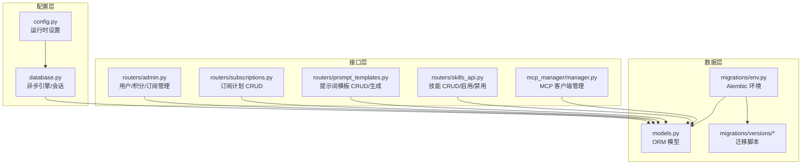
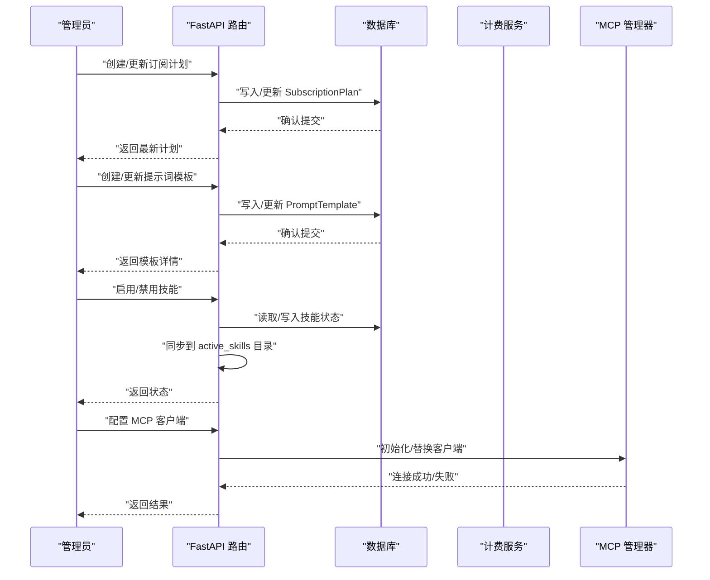
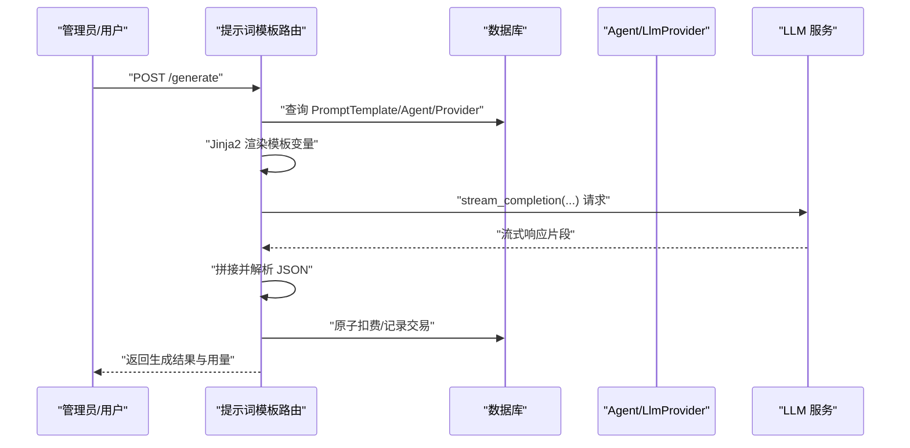
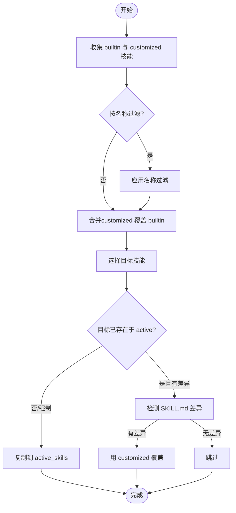
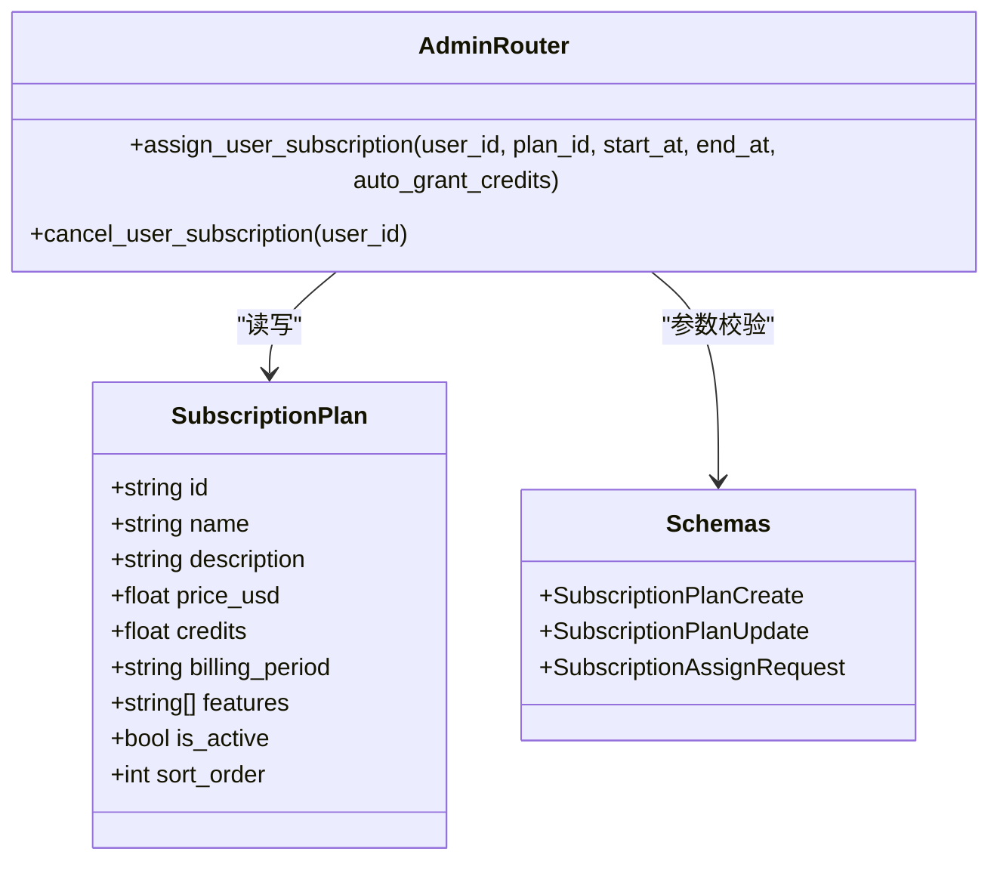
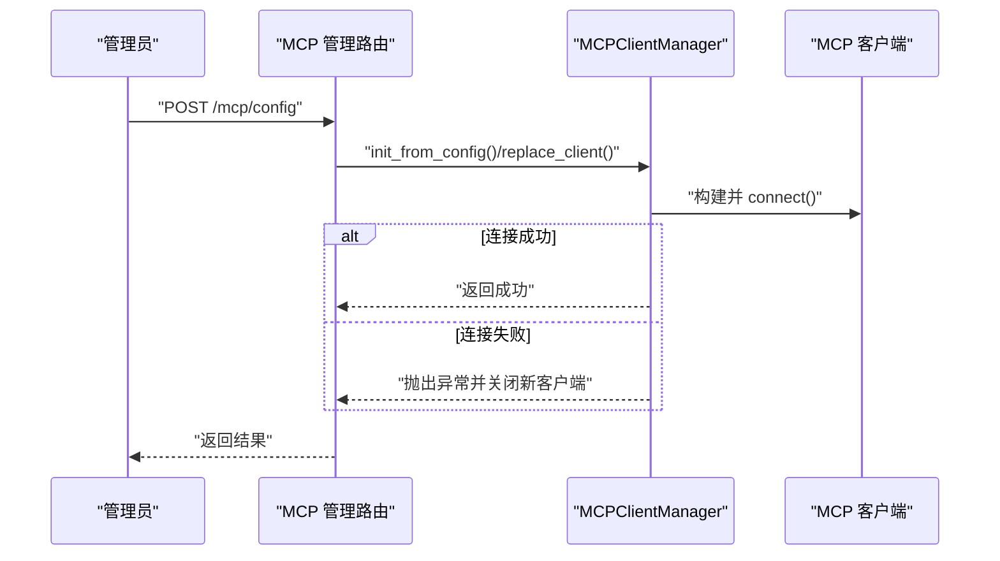
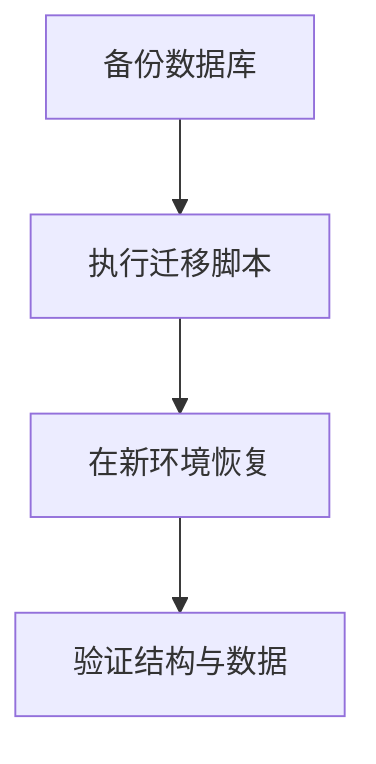
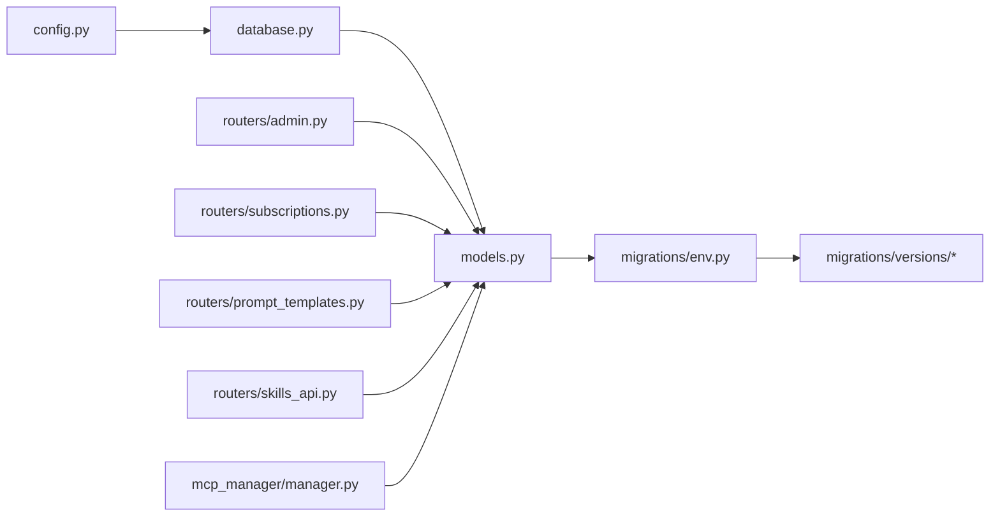

# 系统配置

<cite>
**本文引用的文件**
- [config.py](file://backend/config.py)
- [models.py](file://backend/models.py)
- [schemas.py](file://backend/schemas.py)
- [skills_manager.py](file://backend/skills_manager.py)
- [routers/admin.py](file://backend/routers/admin.py)
- [routers/prompt_templates.py](file://backend/routers/prompt_templates.py)
- [routers/skills_api.py](file://backend/routers/skills_api.py)
- [routers/subscriptions.py](file://backend/routers/subscriptions.py)
- [mcp_manager/manager.py](file://backend/mcp_manager/manager.py)
- [database.py](file://backend/database.py)
- [migrations/env.py](file://backend/migrations/env.py)
- [migrations/versions/c74e516c6d87_add_credit_billing_system.py](file://backend/migrations/versions/c74e516c6d87_add_credit_billing_system.py)
</cite>

## 目录
1. [简介](#简介)
2. [项目结构](#项目结构)
3. [核心组件](#核心组件)
4. [架构总览](#架构总览)
5. [详细组件分析](#详细组件分析)
6. [依赖关系分析](#依赖关系分析)
7. [性能考量](#性能考量)
8. [故障排查指南](#故障排查指南)
9. [结论](#结论)
10. [附录](#附录)

## 简介
本文件系统性梳理“系统配置”能力，围绕以下主题展开：
- 提示词模板管理：模板创建、编辑、默认模板切换与版本化
- 技能系统配置：内置技能、自定义技能与活动技能的同步、启用/禁用与版本控制
- 订阅计划配置：价格、功能、生效时间与管理员操作
- MCP（Model Context Protocol）配置与管理：客户端初始化、热替换与生命周期
- 备份与恢复机制：数据库迁移与配置文件策略
- 配置变更影响分析与回滚策略：原子性扣费、事务与索引
- 配置项依赖关系与约束条件：模型成本、定价与订阅联动
- 配置优化建议与性能调优：连接池、批处理与缓存

## 项目结构
后端采用 FastAPI + SQLAlchemy Async + Alembic 迁移的分层架构：
- 配置层：环境变量与运行时设置
- 数据层：SQLAlchemy 模型与迁移
- 接口层：Admin/Subscription/Prompt Templates/Skills/MCP 等路由
- 服务层：计费、流式推理、工具与技能管理
- 管理器层：MCP 客户端生命周期管理

图表来源
- [config.py:1-43](file://backend/config.py#L1-L43)
- [database.py:1-31](file://backend/database.py#L1-L31)
- [routers/admin.py:1-501](file://backend/routers/admin.py#L1-L501)
- [routers/subscriptions.py:1-119](file://backend/routers/subscriptions.py#L1-L119)
- [routers/prompt_templates.py:1-320](file://backend/routers/prompt_templates.py#L1-L320)
- [routers/skills_api.py:1-207](file://backend/routers/skills_api.py#L1-L207)
- [mcp_manager/manager.py:1-139](file://backend/mcp_manager/manager.py#L1-L139)
- [models.py:1-447](file://backend/models.py#L1-L447)
- [migrations/env.py:1-120](file://backend/migrations/env.py#L1-L120)

章节来源
- [config.py:1-43](file://backend/config.py#L1-L43)
- [database.py:1-31](file://backend/database.py#L1-L31)
- [models.py:1-447](file://backend/models.py#L1-L447)

## 核心组件
- 系统配置中心：集中于运行时设置与数据库连接池参数
- 数据模型：涵盖用户、订阅、提示词模板、技能、MCP 客户端配置等
- 路由接口：Admin 管理员后台、订阅计划、提示词模板、技能管理、MCP 管理
- 技能管理器：内置/自定义/活动目录的同步、启用/禁用与版本化
- MCP 管理器：HTTP/STDIO 传输的客户端生命周期与热替换

章节来源
- [config.py:1-43](file://backend/config.py#L1-L43)
- [models.py:332-367](file://backend/models.py#L332-L367)
- [models.py:369-389](file://backend/models.py#L369-L389)
- [models.py:146-169](file://backend/models.py#L146-L169)
- [skills_manager.py:180-226](file://backend/skills_manager.py#L180-L226)
- [mcp_manager/manager.py:28-139](file://backend/mcp_manager/manager.py#L28-L139)

## 架构总览
系统配置贯穿“配置读取—模型定义—接口暴露—持久化—迁移”的闭环。

图表来源
- [routers/subscriptions.py:21-119](file://backend/routers/subscriptions.py#L21-L119)
- [routers/prompt_templates.py:32-293](file://backend/routers/prompt_templates.py#L32-L293)
- [routers/skills_api.py:123-207](file://backend/routers/skills_api.py#L123-L207)
- [mcp_manager/manager.py:40-104](file://backend/mcp_manager/manager.py#L40-L104)

## 详细组件分析

### 提示词模板管理
- 功能要点
  - 创建/列表/详情/更新/删除
  - 默认模板按类型互斥切换
  - 通过 Jinja2 渲染变量，调用 LLM 生成并解析 JSON
  - 原子扣费与账单记录
- 关键流程

图表来源
- [routers/prompt_templates.py:157-293](file://backend/routers/prompt_templates.py#L157-L293)
- [models.py:332-367](file://backend/models.py#L332-L367)
- [models.py:196-253](file://backend/models.py#L196-L253)
- [models.py:146-169](file://backend/models.py#L146-L169)

章节来源
- [routers/prompt_templates.py:32-155](file://backend/routers/prompt_templates.py#L32-L155)
- [routers/prompt_templates.py:157-293](file://backend/routers/prompt_templates.py#L157-L293)
- [models.py:332-367](file://backend/models.py#L332-L367)

### 技能系统配置
- 目录结构
  - 内置技能：builtin_skills
  - 自定义技能：customized_skills
  - 活动技能：active_skills（运行时生效）
- 同步策略
  - customized 覆盖 builtin；支持强制同步与差异检测
  - 列表去重：以 customized 为准
- 管理能力
  - 创建/更新/删除（禁止删除内置）
  - 启用/禁用/切换状态
  - 文件加载校验（前缀与路径穿越防护）

图表来源
- [skills_manager.py:180-226](file://backend/skills_manager.py#L180-L226)
- [skills_manager.py:263-408](file://backend/skills_manager.py#L263-L408)

章节来源
- [skills_manager.py:180-226](file://backend/skills_manager.py#L180-L226)
- [skills_manager.py:263-408](file://backend/skills_manager.py#L263-L408)
- [routers/skills_api.py:123-207](file://backend/routers/skills_api.py#L123-L207)

### 订阅计划配置
- 字段与约束
  - 名称唯一、价格与积分必须大于 0、周期枚举、排序字段
- 管理接口
  - 创建/列表/详情/更新/删除
  - 管理员可为用户分配订阅并可选发放积分
- 生效时间
  - start_at/end_at 明确生效区间

图表来源
- [models.py:369-389](file://backend/models.py#L369-L389)
- [routers/admin.py:220-280](file://backend/routers/admin.py#L220-L280)
- [routers/subscriptions.py:21-119](file://backend/routers/subscriptions.py#L21-L119)
- [schemas.py:481-513](file://backend/schemas.py#L481-L513)

章节来源
- [models.py:369-389](file://backend/models.py#L369-L389)
- [routers/admin.py:220-280](file://backend/routers/admin.py#L220-L280)
- [routers/subscriptions.py:21-119](file://backend/routers/subscriptions.py#L21-L119)
- [schemas.py:481-513](file://backend/schemas.py#L481-L513)

### MCP（Model Context Protocol）配置与管理
- 配置模型
  - 支持 HTTP 与 STDIO 两种传输
  - 可动态启停与热替换
- 生命周期
  - 初始化、连接、替换、关闭
  - 双阶段锁定最小化阻塞
- 错误处理
  - 连接超时、重建失败、关闭异常均记录日志

图表来源
- [mcp_manager/manager.py:40-104](file://backend/mcp_manager/manager.py#L40-L104)
- [mcp_manager/manager.py:106-139](file://backend/mcp_manager/manager.py#L106-L139)

章节来源
- [mcp_manager/manager.py:28-139](file://backend/mcp_manager/manager.py#L28-L139)

### 系统配置的备份与恢复机制
- 数据库迁移
  - Alembic 环境加载 settings 与 models，支持离线/在线迁移
  - 运行时可清理残留临时表，保证迁移稳定性
- 迁移脚本示例
  - 积分计费系统迁移：创建交易表、Agent 新增费率字段、User 新增余额字段
- 建议
  - 备份前先执行迁移，确保结构一致
  - 使用 Alembic 的离线模式生成迁移脚本，再在目标环境执行

图表来源
- [migrations/env.py:39-120](file://backend/migrations/env.py#L39-L120)
- [migrations/versions/c74e516c6d87_add_credit_billing_system.py:21-67](file://backend/migrations/versions/c74e516c6d87_add_credit_billing_system.py#L21-L67)

章节来源
- [migrations/env.py:39-120](file://backend/migrations/env.py#L39-L120)
- [migrations/versions/c74e516c6d87_add_credit_billing_system.py:21-67](file://backend/migrations/versions/c74e516c6d87_add_credit_billing_system.py#L21-L67)

### 配置变更的影响分析与回滚策略
- 影响面
  - 提示词模板：默认模板切换影响全局默认行为
  - 技能：启用/禁用直接影响 Agent 工具集
  - 订阅：生效时间与自动发券影响用户权益
  - MCP：热替换需避免长连接中断
- 回滚策略
  - 数据库：使用 Alembic downgrades
  - 计费：原子扣费失败记录日志，余额冻结保护
  - 前端：模板/技能状态可快速切换回退

章节来源
- [routers/prompt_templates.py:44-53](file://backend/routers/prompt_templates.py#L44-L53)
- [routers/skills_api.py:190-207](file://backend/routers/skills_api.py#L190-L207)
- [routers/admin.py:246-269](file://backend/routers/admin.py#L246-L269)

### 配置项之间的依赖关系与约束条件
- 模板与 Agent/Provider
  - 模板渲染依赖 Agent 的系统提示与温度、上下文窗口
  - LLM 调用依赖 Provider 的类型、密钥与基础地址
- Agent 与计费
  - Agent 的输入/输出/图像/视频费率决定扣费
- 订阅与计费
  - 订阅生效期内的自动发券与余额变更需与交易记录一致
- MCP 与 Agent
  - MCP 客户端作为外部工具被 Agent 引用（间接依赖）

章节来源
- [models.py:332-367](file://backend/models.py#L332-L367)
- [models.py:196-253](file://backend/models.py#L196-L253)
- [models.py:146-169](file://backend/models.py#L146-L169)
- [routers/prompt_templates.py:174-244](file://backend/routers/prompt_templates.py#L174-L244)

## 依赖关系分析

图表来源
- [config.py:1-43](file://backend/config.py#L1-L43)
- [database.py:1-31](file://backend/database.py#L1-L31)
- [models.py:1-447](file://backend/models.py#L1-L447)
- [migrations/env.py:1-120](file://backend/migrations/env.py#L1-L120)
- [routers/admin.py:1-501](file://backend/routers/admin.py#L1-L501)
- [routers/subscriptions.py:1-119](file://backend/routers/subscriptions.py#L1-L119)
- [routers/prompt_templates.py:1-320](file://backend/routers/prompt_templates.py#L1-L320)
- [routers/skills_api.py:1-207](file://backend/routers/skills_api.py#L1-L207)
- [mcp_manager/manager.py:1-139](file://backend/mcp_manager/manager.py#L1-L139)

章节来源
- [config.py:1-43](file://backend/config.py#L1-L43)
- [database.py:1-31](file://backend/database.py#L1-L31)
- [models.py:1-447](file://backend/models.py#L1-L447)
- [migrations/env.py:1-120](file://backend/migrations/env.py#L1-L120)

## 性能考量
- 数据库连接池
  - 连接池大小与溢出连接数可调，SQLite 与非 SQLite 的连接参数不同
- 批处理与索引
  - 迁移脚本使用批处理方式修改表结构，降低锁竞争
- 流式生成
  - 提示词模板生成采用流式响应，减少一次性内存占用
- MCP 并发
  - 客户端连接超时控制，避免长时间阻塞

章节来源
- [database.py:8-23](file://backend/database.py#L8-L23)
- [migrations/env.py:79-87](file://backend/migrations/env.py#L79-L87)
- [routers/prompt_templates.py:224-244](file://backend/routers/prompt_templates.py#L224-L244)
- [mcp_manager/manager.py:67-74](file://backend/mcp_manager/manager.py#L67-L74)

## 故障排查指南
- 提示词模板生成失败
  - 检查模板变量渲染与 JSON 解析错误
  - 核对 Agent/Provider 可用性与模型可用性
- 技能同步异常
  - 确认 SKILL.md Frontmatter 完整
  - 检查 active/customized 目录权限与路径
- 订阅分配失败
  - 校验计划存在性与生效时间范围
  - 确认自动发券与余额更新的交易记录
- MCP 客户端连接失败
  - 检查传输参数（URL/命令/参数/环境变量）
  - 查看连接超时与重建日志

章节来源
- [routers/prompt_templates.py:214-261](file://backend/routers/prompt_templates.py#L214-L261)
- [skills_manager.py:314-352](file://backend/skills_manager.py#L314-L352)
- [routers/admin.py:234-269](file://backend/routers/admin.py#L234-L269)
- [mcp_manager/manager.py:106-139](file://backend/mcp_manager/manager.py#L106-L139)

## 结论
本系统通过“配置中心—模型—接口—持久化—迁移”的完整链路，实现了提示词模板、技能系统、订阅计划与 MCP 的可配置化与可观测性。建议在生产环境中：
- 严格遵循迁移与备份流程
- 对关键配置变更进行灰度与回滚演练
- 使用连接池与批处理提升稳定性
- 加强日志与监控，确保异常可追溯

## 附录
- 配置项清单与默认值
  - 数据库：SQLite/PostgreSQL 可选，默认 SQLite
  - Redis：本地开发默认
  - AI Key：OpenAI/Claude/Gemini 可选
  - JWT：算法与过期时间可配置
  - 生成设置：故事与图像模型默认值
- 建议的配置优化
  - 调整连接池参数以适配并发
  - 在迁移前做好结构快照
  - 对 MCP 客户端配置进行健康检查与超时设置

章节来源
- [config.py:11-37](file://backend/config.py#L11-L37)
- [database.py:8-23](file://backend/database.py#L8-L23)
- [migrations/env.py:39-64](file://backend/migrations/env.py#L39-L64)