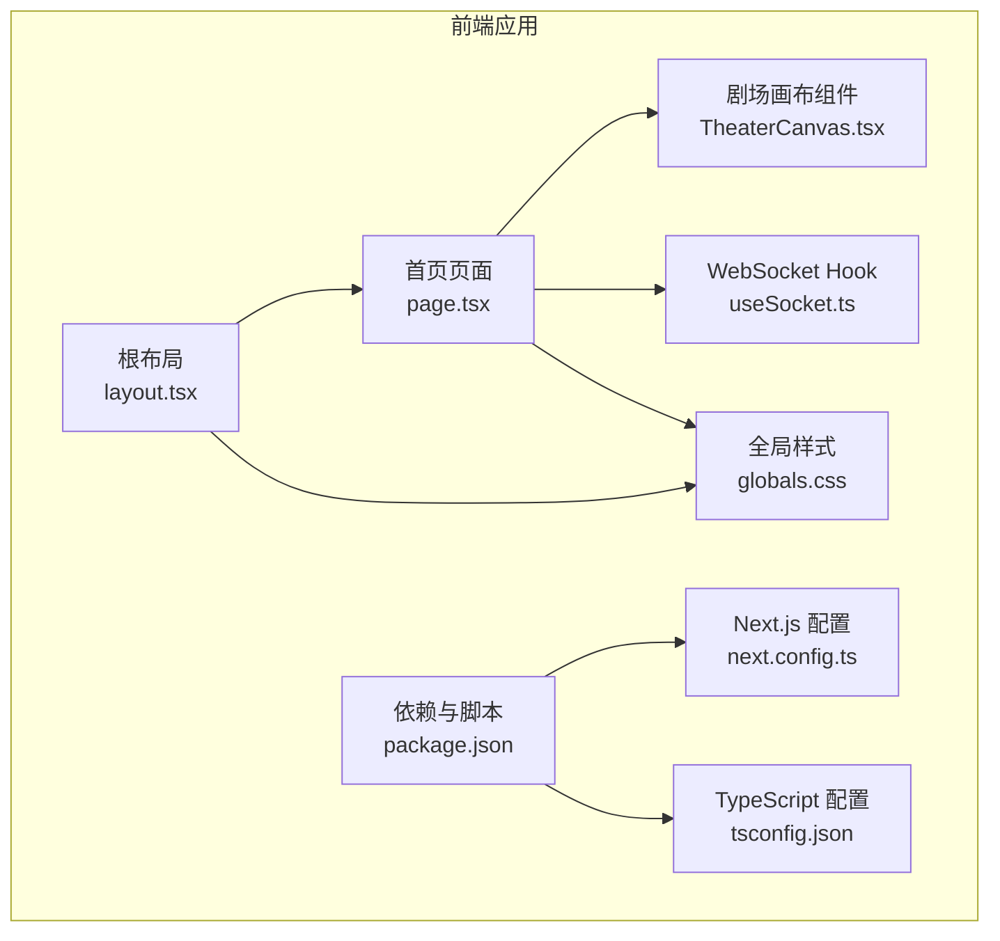
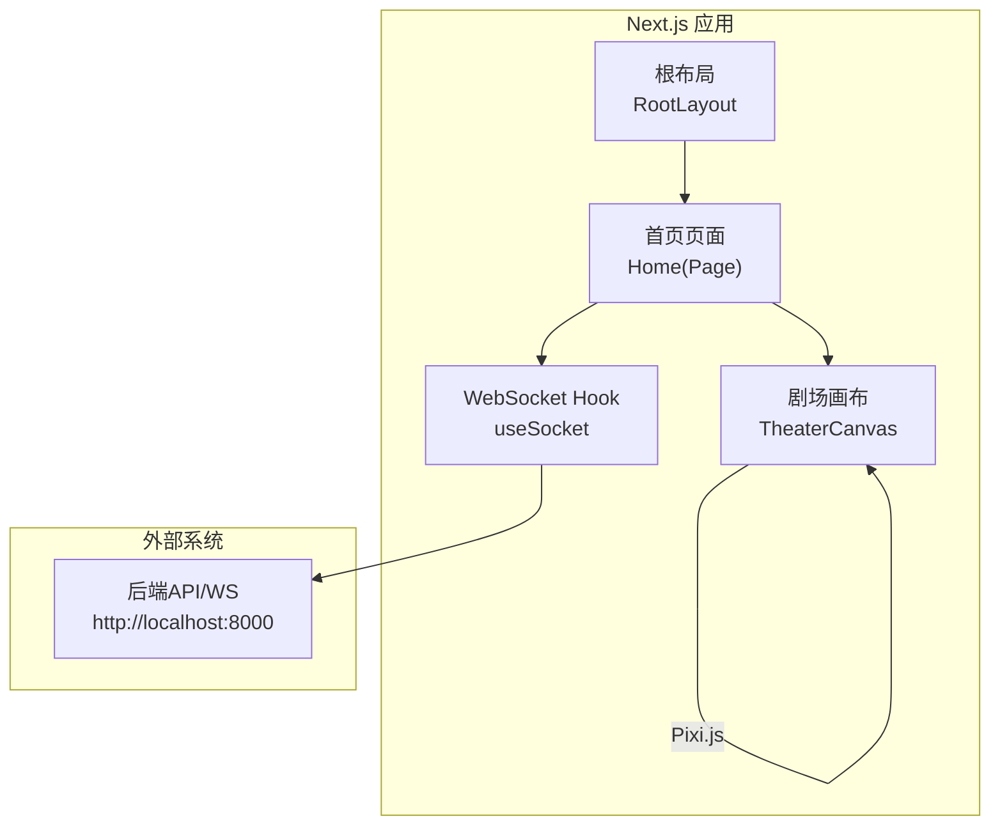
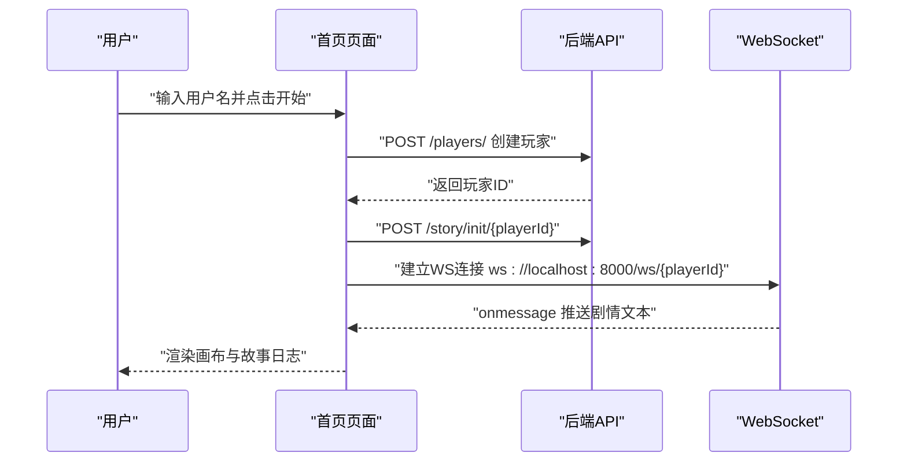
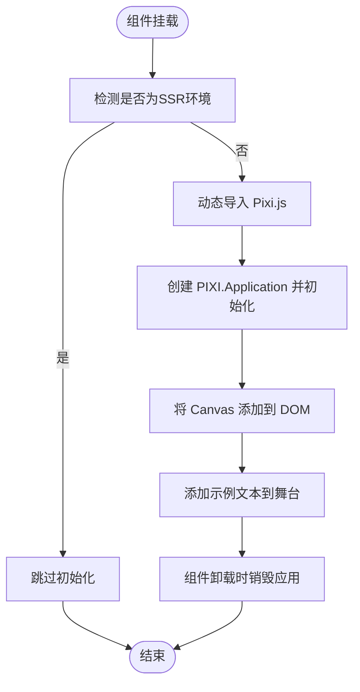
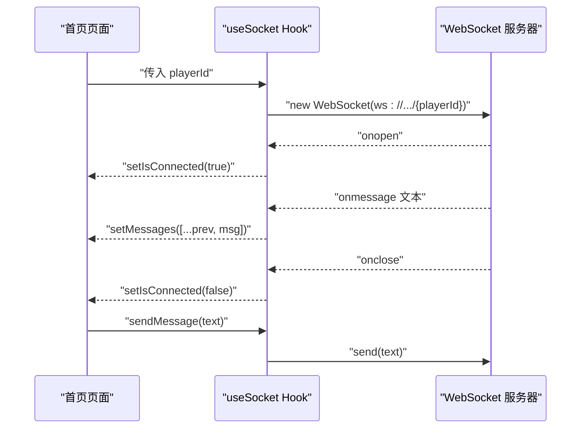
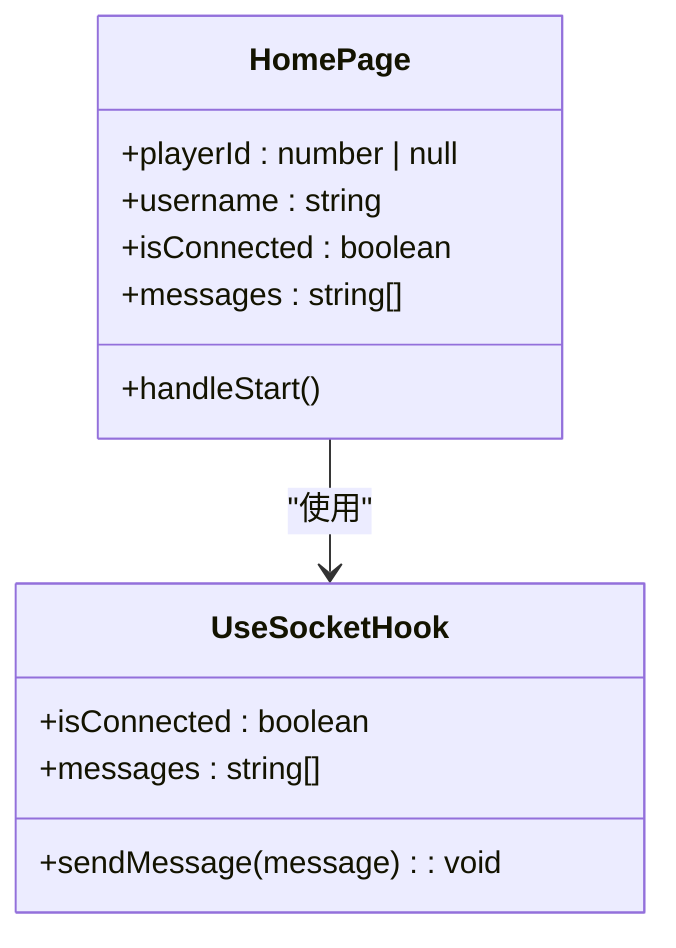
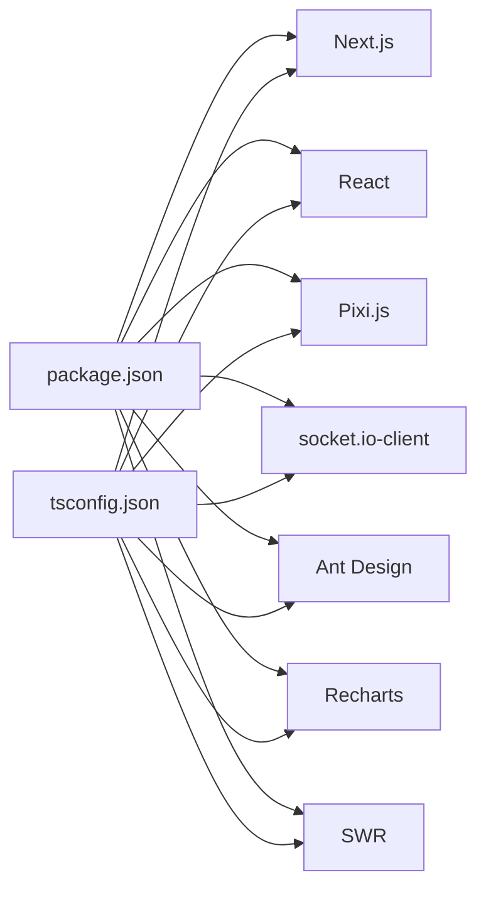

# 前端架构

<cite>
**本文引用的文件**
- [frontend/src/app/layout.tsx](file://frontend/src/app/layout.tsx)
- [frontend/src/app/page.tsx](file://frontend/src/app/page.tsx)
- [frontend/src/components/TheaterCanvas.tsx](file://frontend/src/components/TheaterCanvas.tsx)
- [frontend/src/hooks/useSocket.ts](file://frontend/src/hooks/useSocket.ts)
- [frontend/src/app/globals.css](file://frontend/src/app/globals.css)
- [frontend/next.config.ts](file://frontend/next.config.ts)
- [frontend/package.json](file://frontend/package.json)
- [frontend/tsconfig.json](file://frontend/tsconfig.json)
- [docs/wiki/Frontend-Guide.md](file://docs/wiki/Frontend-Guide.md)
</cite>

## 目录
1. [引言](#引言)
2. [项目结构](#项目结构)
3. [核心组件](#核心组件)
4. [架构总览](#架构总览)
5. [详细组件分析](#详细组件分析)
6. [依赖关系分析](#依赖关系分析)
7. [性能考虑](#性能考虑)
8. [故障排查指南](#故障排查指南)
9. [结论](#结论)
10. [附录](#附录)

## 引言
本文件面向无限剧情剧场的前端架构，聚焦于Next.js应用的App Router模式、服务端渲染与静态生成策略、组件层次结构、剧场画布渲染架构（Pixi.js集成）、WebSocket通信架构（连接管理、消息处理与状态同步）、状态管理模式与Hook设计模式、组件复用策略、响应式设计与性能优化技术，以及错误边界处理建议。文档同时提供可视化图表与分层讲解，帮助不同背景读者理解与维护该前端系统。

## 项目结构
前端采用Next.js 16 App Router组织页面与布局，核心入口位于应用根布局与首页页面；组件层包含剧场画布与自定义Hook；样式通过Tailwind CSS与全局样式文件统一；类型与包管理由TypeScript与package.json定义；配置文件涵盖Next.js与TypeScript设置。

**图表来源**
- [frontend/src/app/layout.tsx](file://frontend/src/app/layout.tsx#L1-L35)
- [frontend/src/app/page.tsx](file://frontend/src/app/page.tsx#L1-L85)
- [frontend/src/components/TheaterCanvas.tsx](file://frontend/src/components/TheaterCanvas.tsx#L1-L50)
- [frontend/src/hooks/useSocket.ts](file://frontend/src/hooks/useSocket.ts#L1-L43)
- [frontend/src/app/globals.css](file://frontend/src/app/globals.css#L1-L27)
- [frontend/next.config.ts](file://frontend/next.config.ts#L1-L8)
- [frontend/tsconfig.json](file://frontend/tsconfig.json#L1-L35)
- [frontend/package.json](file://frontend/package.json#L1-L35)

**章节来源**
- [frontend/src/app/layout.tsx](file://frontend/src/app/layout.tsx#L1-L35)
- [frontend/src/app/page.tsx](file://frontend/src/app/page.tsx#L1-L85)
- [frontend/src/app/globals.css](file://frontend/src/app/globals.css#L1-L27)
- [frontend/next.config.ts](file://frontend/next.config.ts#L1-L8)
- [frontend/tsconfig.json](file://frontend/tsconfig.json#L1-L35)
- [frontend/package.json](file://frontend/package.json#L1-L35)
- [docs/wiki/Frontend-Guide.md](file://docs/wiki/Frontend-Guide.md#L1-L69)

## 核心组件
- 根布局与字体：定义站点元数据、根HTML标签与全局字体变量，为全站提供一致的排版基础。
- 首页页面：负责玩家创建、故事初始化、WebSocket连接与消息展示，并嵌入剧场画布组件。
- 剧场画布组件：基于Pixi.js的客户端渲染容器，支持动态导入与生命周期清理。
- WebSocket Hook：封装WebSocket连接、消息收发与连接状态，便于在页面中复用。
- 全局样式：通过Tailwind与CSS变量实现深浅色主题切换与基础排版。
- 配置与依赖：Next.js与TypeScript配置定义编译与模块解析规则；package.json声明运行时依赖与脚本。

**章节来源**
- [frontend/src/app/layout.tsx](file://frontend/src/app/layout.tsx#L1-L35)
- [frontend/src/app/page.tsx](file://frontend/src/app/page.tsx#L1-L85)
- [frontend/src/components/TheaterCanvas.tsx](file://frontend/src/components/TheaterCanvas.tsx#L1-L50)
- [frontend/src/hooks/useSocket.ts](file://frontend/src/hooks/useSocket.ts#L1-L43)
- [frontend/src/app/globals.css](file://frontend/src/app/globals.css#L1-L27)
- [frontend/next.config.ts](file://frontend/next.config.ts#L1-L8)
- [frontend/tsconfig.json](file://frontend/tsconfig.json#L1-L35)
- [frontend/package.json](file://frontend/package.json#L1-L35)
- [docs/wiki/Frontend-Guide.md](file://docs/wiki/Frontend-Guide.md#L23-L69)

## 架构总览
前端采用“根布局 + 页面路由”的App Router模式，页面作为客户端组件，负责业务流程编排；组件层通过动态导入实现SSR兼容；状态通过React状态与自定义Hook管理；渲染层使用Pixi.js进行高性能2D场景绘制；通信层通过WebSocket实现实时消息同步。

**图表来源**
- [frontend/src/app/layout.tsx](file://frontend/src/app/layout.tsx#L20-L34)
- [frontend/src/app/page.tsx](file://frontend/src/app/page.tsx#L9-L84)
- [frontend/src/components/TheaterCanvas.tsx](file://frontend/src/components/TheaterCanvas.tsx#L10-L47)
- [frontend/src/hooks/useSocket.ts](file://frontend/src/hooks/useSocket.ts#L3-L42)

## 详细组件分析

### 根布局与页面路由
- 根布局负责注入字体变量与全局样式，确保页面具备一致的排版与主题基础。
- 首页页面作为客户端组件，承担用户交互、玩家创建、故事初始化、WebSocket连接与消息展示，并在需要时渲染剧场画布。

**图表来源**
- [frontend/src/app/page.tsx](file://frontend/src/app/page.tsx#L14-L35)
- [frontend/src/hooks/useSocket.ts](file://frontend/src/hooks/useSocket.ts#L8-L33)

**章节来源**
- [frontend/src/app/layout.tsx](file://frontend/src/app/layout.tsx#L15-L34)
- [frontend/src/app/page.tsx](file://frontend/src/app/page.tsx#L9-L84)

### 剧场画布渲染架构（Pixi.js）
- 客户端渲染：通过动态导入确保仅在浏览器端加载Pixi.js，避免SSR期间执行。
- 生命周期管理：在组件卸载时销毁Pixi应用实例，释放资源。
- 场景与元素：初始化应用后向舞台添加文本等元素，后续可扩展为精灵、动画与交互。

**图表来源**
- [frontend/src/components/TheaterCanvas.tsx](file://frontend/src/components/TheaterCanvas.tsx#L14-L44)

**章节来源**
- [frontend/src/components/TheaterCanvas.tsx](file://frontend/src/components/TheaterCanvas.tsx#L1-L50)

### WebSocket通信架构
- 连接管理：根据玩家ID建立WebSocket连接，监听打开、消息与关闭事件，维护连接状态。
- 消息处理：将收到的消息追加到本地状态列表，供页面展示。
- 发送接口：提供安全的发送方法，仅在连接处于OPEN状态时发送。
- 状态同步：页面通过消息列表与连接状态驱动UI反馈。

**图表来源**
- [frontend/src/hooks/useSocket.ts](file://frontend/src/hooks/useSocket.ts#L8-L39)
- [frontend/src/app/page.tsx](file://frontend/src/app/page.tsx#L12-L12)

**章节来源**
- [frontend/src/hooks/useSocket.ts](file://frontend/src/hooks/useSocket.ts#L1-L43)
- [frontend/src/app/page.tsx](file://frontend/src/app/page.tsx#L1-L85)

### 状态管理模式与Hook设计模式
- 页面状态：管理玩家ID、用户名、连接状态与消息列表。
- Hook复用：useSocket集中处理WebSocket生命周期与消息队列，页面只需关注UI与业务流程。
- 组件复用策略：TheaterCanvas通过动态导入与props传递尺寸，实现跨页面复用。

**图表来源**
- [frontend/src/app/page.tsx](file://frontend/src/app/page.tsx#L9-L35)
- [frontend/src/hooks/useSocket.ts](file://frontend/src/hooks/useSocket.ts#L3-L42)

**章节来源**
- [frontend/src/app/page.tsx](file://frontend/src/app/page.tsx#L9-L84)
- [frontend/src/hooks/useSocket.ts](file://frontend/src/hooks/useSocket.ts#L1-L43)

### 组件复用策略
- 动态导入：TheaterCanvas使用动态导入与ssr: false，确保仅在客户端渲染，提升SSR兼容性与首屏性能。
- Props驱动：通过width/height等props控制画布尺寸，便于在不同布局中复用。
- UI一致性：全局样式与Tailwind类名保证组件外观一致，减少重复样式代码。

**章节来源**
- [frontend/src/components/TheaterCanvas.tsx](file://frontend/src/components/TheaterCanvas.tsx#L7-L8)
- [frontend/src/app/globals.css](file://frontend/src/app/globals.css#L1-L27)

### 响应式设计实现
- Tailwind原子类：通过flex、gap、max-width、text-sm等类实现响应式布局与对齐。
- 深浅主题：CSS变量与@media查询实现暗色/亮色主题自动切换。
- 画布适配：TheaterCanvas通过props控制尺寸，页面容器按比例分配画布与日志区域。

**章节来源**
- [frontend/src/app/page.tsx](file://frontend/src/app/page.tsx#L38-L81)
- [frontend/src/app/globals.css](file://frontend/src/app/globals.css#L15-L26)

## 依赖关系分析
- 运行时依赖：Next.js、React、Pixi.js、socket.io-client、Ant Design、Recharts、SWR等。
- 类型与工具：TypeScript、Tailwind CSS、ESLint、Axios等。
- 编译与模块解析：TypeScript路径映射@/*至src，Bundler模块解析，严格模式与增量编译。

**图表来源**
- [frontend/package.json](file://frontend/package.json#L11-L22)
- [frontend/tsconfig.json](file://frontend/tsconfig.json#L21-L23)

**章节来源**
- [frontend/package.json](file://frontend/package.json#L1-L35)
- [frontend/tsconfig.json](file://frontend/tsconfig.json#L1-L35)

## 性能考虑
- SSR兼容与首屏优化：通过动态导入与ssr: false避免SSR期间执行客户端库；页面组件标记'use client'以启用客户端渲染。
- 资源释放：画布组件在卸载时销毁Pixi应用，防止内存泄漏与资源占用。
- 网络与渲染分离：WebSocket与画布渲染解耦，分别在Hook与组件内独立管理，降低耦合度与复杂度。
- 样式体积控制：Tailwind按需引入与CSS变量减少冗余样式，提升打包与运行效率。

**章节来源**
- [frontend/src/components/TheaterCanvas.tsx](file://frontend/src/components/TheaterCanvas.tsx#L39-L44)
- [frontend/src/app/page.tsx](file://frontend/src/app/page.tsx#L7-L7)
- [frontend/src/app/globals.css](file://frontend/src/app/globals.css#L1-L27)

## 故障排查指南
- WebSocket连接失败
  - 确认后端WS服务已在目标端口启动。
  - 检查页面是否传入有效playerId后再建立连接。
  - 查看控制台onclose回调与isConnected状态变化。
- 画布不显示
  - 确认动态导入成功且DOM节点存在。
  - 检查画布尺寸props与容器宽高是否合理。
  - 关注组件卸载时的destroy调用是否触发。
- 样式异常
  - 检查Tailwind与CSS变量是否正确加载。
  - 确认深浅主题切换逻辑与媒体查询生效。
- 开发与构建问题
  - 使用提供的脚本命令启动开发服务器。
  - 若TypeScript或Bundler报错，检查tsconfig路径映射与模块解析配置。

**章节来源**
- [frontend/src/hooks/useSocket.ts](file://frontend/src/hooks/useSocket.ts#L8-L33)
- [frontend/src/components/TheaterCanvas.tsx](file://frontend/src/components/TheaterCanvas.tsx#L14-L44)
- [frontend/src/app/globals.css](file://frontend/src/app/globals.css#L15-L26)
- [frontend/package.json](file://frontend/package.json#L5-L10)

## 结论
该前端架构以Next.js App Router为核心，结合客户端组件、动态导入与自定义Hook，实现了SSR兼容、高性能渲染与实时通信的统一。Pixi.js画布为剧场场景提供了灵活的渲染能力；WebSocket Hook抽象了连接与消息处理，提升了可维护性。通过Tailwind与CSS变量实现响应式与主题化；配合严格的TypeScript配置与依赖管理，整体架构清晰、可扩展性强，适合持续演进与团队协作。

## 附录
- 快速启动与访问
  - 确保后端API/WS已在默认端口启动。
  - 在前端根目录执行开发命令，访问本地端口查看效果。
- 参考文档
  - 前端开发指南文档提供了目录结构、核心组件与调试步骤的补充说明。

**章节来源**
- [docs/wiki/Frontend-Guide.md](file://docs/wiki/Frontend-Guide.md#L59-L69)