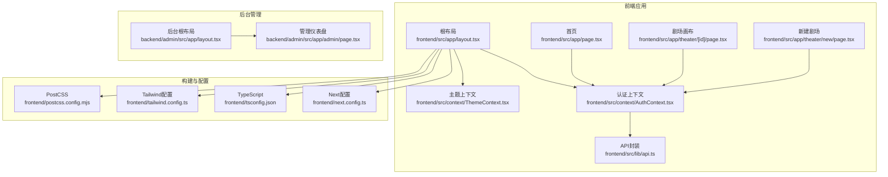
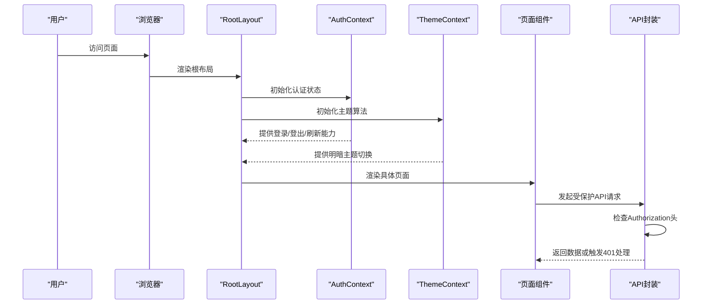
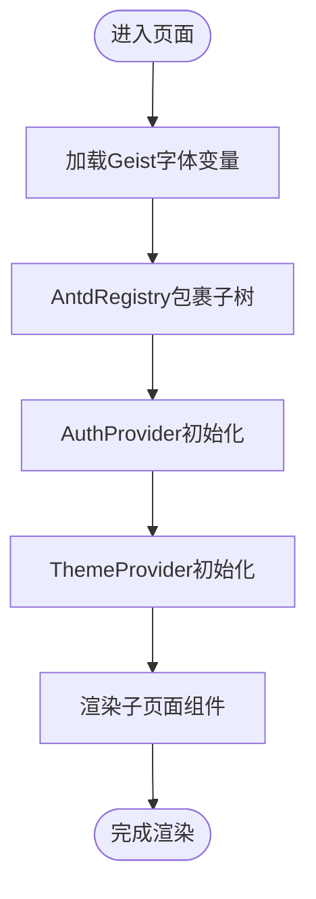
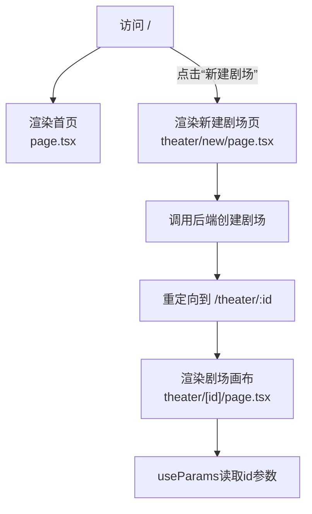
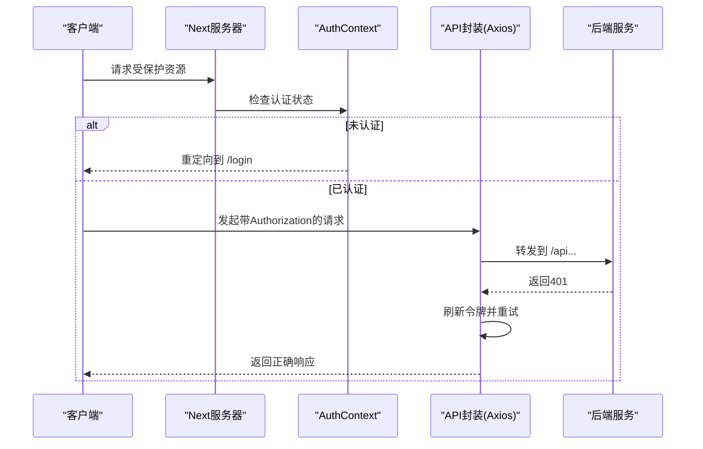
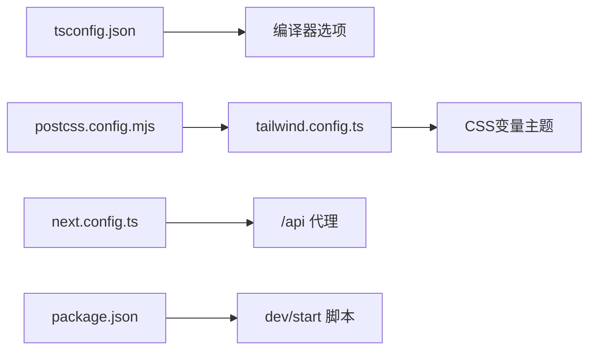
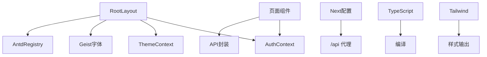

# Next.js应用结构

<cite>
**本文档引用的文件**
- [frontend/src/app/layout.tsx](file://frontend/src/app/layout.tsx)
- [frontend/src/app/page.tsx](file://frontend/src/app/page.tsx)
- [frontend/src/app/theater/[id]/page.tsx](file://frontend/src/app/theater/[id]/page.tsx)
- [frontend/src/app/theater/new/page.tsx](file://frontend/src/app/theater/new/page.tsx)
- [frontend/src/context/AuthContext.tsx](file://frontend/src/context/AuthContext.tsx)
- [frontend/src/context/ThemeContext.tsx](file://frontend/src/context/ThemeContext.tsx)
- [frontend/src/lib/api.ts](file://frontend/src/lib/api.ts)
- [frontend/next.config.ts](file://frontend/next.config.ts)
- [frontend/tsconfig.json](file://frontend/tsconfig.json)
- [frontend/tailwind.config.ts](file://frontend/tailwind.config.ts)
- [frontend/postcss.config.mjs](file://frontend/postcss.config.mjs)
- [backend/admin/src/app/layout.tsx](file://backend/admin/src/app/layout.tsx)
- [backend/admin/src/app/admin/page.tsx](file://backend/admin/src/app/admin/page.tsx)
</cite>

## 目录
1. [简介](#简介)
2. [项目结构](#项目结构)
3. [核心组件](#核心组件)
4. [架构总览](#架构总览)
5. [详细组件分析](#详细组件分析)
6. [依赖关系分析](#依赖关系分析)
7. [性能考虑](#性能考虑)
8. [故障排除指南](#故障排除指南)
9. [结论](#结论)
10. [附录](#附录)

## 简介
本文件面向KunFlix的前端Next.js应用，系统性梳理基于App Router的页面结构与路由体系，重点阐释：
- 根布局RootLayout的设计与职责边界（字体加载、Ant Design注册表、全局样式与主题/认证上下文）
- 页面路由约定、动态路由参数处理与中间件式鉴权策略
- 构建配置、TypeScript与TailwindCSS设置
- 开发服务器配置与API代理
- 实际操作指南：如何新增页面与路由

## 项目结构
前端采用Next.js App Router目录结构，页面按功能模块化组织，支持静态与动态路由、嵌套布局与共享状态上下文。

**图表来源**
- [frontend/src/app/layout.tsx:1-42](file://frontend/src/app/layout.tsx#L1-L42)
- [frontend/src/app/page.tsx:1-19](file://frontend/src/app/page.tsx#L1-L19)
- [frontend/src/app/theater/[id]/page.tsx](file://frontend/src/app/theater/[id]/page.tsx#L1-L800)
- [frontend/src/app/theater/new/page.tsx:1-40](file://frontend/src/app/theater/new/page.tsx#L1-L40)
- [frontend/src/context/AuthContext.tsx:1-207](file://frontend/src/context/AuthContext.tsx#L1-L207)
- [frontend/src/context/ThemeContext.tsx:1-75](file://frontend/src/context/ThemeContext.tsx#L1-L75)
- [frontend/src/lib/api.ts:1-84](file://frontend/src/lib/api.ts#L1-L84)
- [frontend/next.config.ts:1-21](file://frontend/next.config.ts#L1-L21)
- [frontend/tsconfig.json:1-35](file://frontend/tsconfig.json#L1-L35)
- [frontend/tailwind.config.ts:1-64](file://frontend/tailwind.config.ts#L1-L64)
- [frontend/postcss.config.mjs:1-8](file://frontend/postcss.config.mjs#L1-L8)
- [backend/admin/src/app/layout.tsx:1-25](file://backend/admin/src/app/layout.tsx#L1-L25)
- [backend/admin/src/app/admin/page.tsx:1-109](file://backend/admin/src/app/admin/page.tsx#L1-L109)

**章节来源**
- [frontend/src/app/layout.tsx:1-42](file://frontend/src/app/layout.tsx#L1-L42)
- [frontend/src/app/page.tsx:1-19](file://frontend/src/app/page.tsx#L1-L19)
- [frontend/src/app/theater/[id]/page.tsx](file://frontend/src/app/theater/[id]/page.tsx#L1-L800)
- [frontend/src/app/theater/new/page.tsx:1-40](file://frontend/src/app/theater/new/page.tsx#L1-L40)
- [frontend/next.config.ts:1-21](file://frontend/next.config.ts#L1-L21)
- [frontend/tsconfig.json:1-35](file://frontend/tsconfig.json#L1-L35)
- [frontend/tailwind.config.ts:1-64](file://frontend/tailwind.config.ts#L1-L64)
- [frontend/postcss.config.mjs:1-8](file://frontend/postcss.config.mjs#L1-L8)
- [backend/admin/src/app/layout.tsx:1-25](file://backend/admin/src/app/layout.tsx#L1-L25)
- [backend/admin/src/app/admin/page.tsx:1-109](file://backend/admin/src/app/admin/page.tsx#L1-L109)

## 核心组件
- 根布局RootLayout：统一注入字体、Ant Design注册表、全局样式与认证/主题上下文，承载所有页面。
- 认证上下文：提供登录、登出、令牌刷新与受保护路由拦截。
- 主题上下文：管理Ant Design主题与明暗切换。
- API封装：统一添加Authorization头、处理401并进行令牌刷新与重试。
- Next配置：启用大体积Server Actions、代理/api前缀到后端服务。
- TypeScript配置：严格模式、路径别名@/*、Bundler解析。
- Tailwind配置：基于CSS变量的主题色、圆角与插件。

**章节来源**
- [frontend/src/app/layout.tsx:1-42](file://frontend/src/app/layout.tsx#L1-L42)
- [frontend/src/context/AuthContext.tsx:1-207](file://frontend/src/context/AuthContext.tsx#L1-L207)
- [frontend/src/context/ThemeContext.tsx:1-75](file://frontend/src/context/ThemeContext.tsx#L1-L75)
- [frontend/src/lib/api.ts:1-84](file://frontend/src/lib/api.ts#L1-L84)
- [frontend/next.config.ts:1-21](file://frontend/next.config.ts#L1-L21)
- [frontend/tsconfig.json:1-35](file://frontend/tsconfig.json#L1-L35)
- [frontend/tailwind.config.ts:1-64](file://frontend/tailwind.config.ts#L1-L64)

## 架构总览
Next.js应用通过App Router组织页面与布局，采用“根布局+页面组件”的分层设计；认证与主题通过上下文注入到根布局之下，确保全站可用。API请求经由Axios封装，自动携带令牌并在401时尝试刷新后重试。

**图表来源**
- [frontend/src/app/layout.tsx:1-42](file://frontend/src/app/layout.tsx#L1-L42)
- [frontend/src/context/AuthContext.tsx:1-207](file://frontend/src/context/AuthContext.tsx#L1-L207)
- [frontend/src/context/ThemeContext.tsx:1-75](file://frontend/src/context/ThemeContext.tsx#L1-L75)
- [frontend/src/lib/api.ts:1-84](file://frontend/src/lib/api.ts#L1-L84)

## 详细组件分析

### 根布局RootLayout（字体、Ant Design注册表与全局样式）
- 字体加载：通过next/font/google引入Geist Sans与Geist Mono，设置CSS变量并绑定到<body>。
- Ant Design注册表：使用@ant-design/nextjs-registry包裹子树，确保服务端渲染下AntD组件正常工作。
- 全局样式：导入全局CSS，配合Tailwind类名实现主题色与排版。
- 上下文注入：AuthProvider负责认证状态与路由拦截，ThemeProvider负责AntD主题与明暗切换。

**图表来源**
- [frontend/src/app/layout.tsx:1-42](file://frontend/src/app/layout.tsx#L1-L42)

**章节来源**
- [frontend/src/app/layout.tsx:1-42](file://frontend/src/app/layout.tsx#L1-L42)

### 页面路由约定与动态路由参数
- 静态页面：如首页位于frontend/src/app/page.tsx，对应根路径/。
- 动态路由：如剧场画布页面位于frontend/src/app/theater/[id]/page.tsx，对应路径/theater/:id；通过next/navigation的useParams读取id参数。
- 新建剧场：前端在无参状态下创建剧场并重定向至/theater/:id。
- 后台管理：后台应用位于backend/admin/src/app，同样遵循App Router约定，例如/dashboard对应backend/admin/src/app/admin/page.tsx。

**图表来源**
- [frontend/src/app/page.tsx:1-19](file://frontend/src/app/page.tsx#L1-L19)
- [frontend/src/app/theater/new/page.tsx:1-40](file://frontend/src/app/theater/new/page.tsx#L1-L40)
- [frontend/src/app/theater/[id]/page.tsx](file://frontend/src/app/theater/[id]/page.tsx#L1-L800)

**章节来源**
- [frontend/src/app/page.tsx:1-19](file://frontend/src/app/page.tsx#L1-L19)
- [frontend/src/app/theater/new/page.tsx:1-40](file://frontend/src/app/theater/new/page.tsx#L1-L40)
- [frontend/src/app/theater/[id]/page.tsx](file://frontend/src/app/theater/[id]/page.tsx#L1-L800)
- [backend/admin/src/app/admin/page.tsx:1-109](file://backend/admin/src/app/admin/page.tsx#L1-L109)

### 中间件配置（鉴权与API代理）
- 鉴权拦截：在AuthContext中，当非公开路由且未登录时重定向至/login；同时提供createAuthFetch与axios拦截器实现401自动刷新与重试。
- API代理：next.config.ts将/api前缀重写到后端服务地址，便于前后端联调。
- 开发服务器：package.json脚本指定端口3666，便于多应用并行开发。

**图表来源**
- [frontend/src/context/AuthContext.tsx:1-207](file://frontend/src/context/AuthContext.tsx#L1-L207)
- [frontend/src/lib/api.ts:1-84](file://frontend/src/lib/api.ts#L1-L84)
- [frontend/next.config.ts:1-21](file://frontend/next.config.ts#L1-L21)

**章节来源**
- [frontend/src/context/AuthContext.tsx:1-207](file://frontend/src/context/AuthContext.tsx#L1-L207)
- [frontend/src/lib/api.ts:1-84](file://frontend/src/lib/api.ts#L1-L84)
- [frontend/next.config.ts:1-21](file://frontend/next.config.ts#L1-L21)
- [frontend/package.json:1-94](file://frontend/package.json#L1-L94)

### 构建配置、TypeScript与开发服务器
- Next配置：启用实验性Server Actions的大体积限制与代理客户端最大体，重写/api到后端。
- TypeScript：严格模式、路径别名@/*、Bundler解析、内置插件“next”。
- Tailwind：基于CSS变量的主题色与圆角，content扫描范围覆盖app、components、pages。
- PostCSS：集成@tailwindcss/postcss插件。
- 开发服务器：脚本dev/start分别启动开发/生产服务器，端口3666。

**图表来源**
- [frontend/tsconfig.json:1-35](file://frontend/tsconfig.json#L1-L35)
- [frontend/tailwind.config.ts:1-64](file://frontend/tailwind.config.ts#L1-L64)
- [frontend/postcss.config.mjs:1-8](file://frontend/postcss.config.mjs#L1-L8)
- [frontend/next.config.ts:1-21](file://frontend/next.config.ts#L1-L21)
- [frontend/package.json:1-94](file://frontend/package.json#L1-L94)

**章节来源**
- [frontend/tsconfig.json:1-35](file://frontend/tsconfig.json#L1-L35)
- [frontend/tailwind.config.ts:1-64](file://frontend/tailwind.config.ts#L1-L64)
- [frontend/postcss.config.mjs:1-8](file://frontend/postcss.config.mjs#L1-L8)
- [frontend/next.config.ts:1-21](file://frontend/next.config.ts#L1-L21)
- [frontend/package.json:1-94](file://frontend/package.json#L1-L94)

### 实际操作指南：创建新的页面与路由
- 新增静态页面：在frontend/src/app下创建目标路径的文件夹与page.tsx，即可自动生成路由。
- 新增动态路由：在frontend/src/app下创建[slug]/page.tsx，通过useParams读取slug参数。
- 使用上下文：在页面中导入并使用AuthContext与ThemeContext提供的能力。
- 调用API：通过frontend/src/lib/api.ts发起受保护请求，自动处理Authorization与401刷新。
- 验证路由：启动开发服务器后，在浏览器访问对应路径验证页面渲染与参数解析。

**章节来源**
- [frontend/src/app/theater/[id]/page.tsx](file://frontend/src/app/theater/[id]/page.tsx#L1-L800)
- [frontend/src/context/AuthContext.tsx:1-207](file://frontend/src/context/AuthContext.tsx#L1-L207)
- [frontend/src/lib/api.ts:1-84](file://frontend/src/lib/api.ts#L1-L84)
- [frontend/package.json:1-94](file://frontend/package.json#L1-L94)

## 依赖关系分析
- 根布局依赖字体、AntD注册表、认证与主题上下文，形成全局基础设施。
- 页面组件依赖上下文与API封装，实现业务逻辑与数据交互。
- Next配置影响路由与代理行为，TypeScript与Tailwind配置决定编译与样式输出。

**图表来源**
- [frontend/src/app/layout.tsx:1-42](file://frontend/src/app/layout.tsx#L1-L42)
- [frontend/src/context/AuthContext.tsx:1-207](file://frontend/src/context/AuthContext.tsx#L1-L207)
- [frontend/src/context/ThemeContext.tsx:1-75](file://frontend/src/context/ThemeContext.tsx#L1-L75)
- [frontend/src/lib/api.ts:1-84](file://frontend/src/lib/api.ts#L1-L84)
- [frontend/next.config.ts:1-21](file://frontend/next.config.ts#L1-L21)
- [frontend/tsconfig.json:1-35](file://frontend/tsconfig.json#L1-L35)
- [frontend/tailwind.config.ts:1-64](file://frontend/tailwind.config.ts#L1-L64)

**章节来源**
- [frontend/src/app/layout.tsx:1-42](file://frontend/src/app/layout.tsx#L1-L42)
- [frontend/src/context/AuthContext.tsx:1-207](file://frontend/src/context/AuthContext.tsx#L1-L207)
- [frontend/src/context/ThemeContext.tsx:1-75](file://frontend/src/context/ThemeContext.tsx#L1-L75)
- [frontend/src/lib/api.ts:1-84](file://frontend/src/lib/api.ts#L1-L84)
- [frontend/next.config.ts:1-21](file://frontend/next.config.ts#L1-L21)
- [frontend/tsconfig.json:1-35](file://frontend/tsconfig.json#L1-L35)
- [frontend/tailwind.config.ts:1-64](file://frontend/tailwind.config.ts#L1-L64)

## 性能考虑
- 大体积Server Actions：next.config.ts允许较大请求体，适合上传/流式场景，需结合后端限流与校验。
- 字体优化：使用next/font本地化加载，减少外部依赖与首屏阻塞。
- 样式按需：Tailwind扫描仅在必要范围内，避免生成冗余CSS。
- 令牌刷新队列：Axios拦截器与AuthContext均实现请求排队与重试，降低401抖动带来的用户体验问题。

## 故障排除指南
- 登录后仍被重定向到登录页：检查localStorage中的access_token与user是否存在，确认AuthContext初始化逻辑与PUBLIC_ROUTES配置。
- 401频繁出现：确认refresh_token存在且有效，检查/api/auth/refresh接口可达性与响应格式。
- AntD组件样式异常：确认RootLayout中已包裹AntdRegistry，且ThemeProvider已正确设置算法与语言包。
- API请求失败：检查next.config.ts的/api重写规则与后端服务连通性，确认Authorization头是否正确附加。

**章节来源**
- [frontend/src/context/AuthContext.tsx:1-207](file://frontend/src/context/AuthContext.tsx#L1-L207)
- [frontend/src/lib/api.ts:1-84](file://frontend/src/lib/api.ts#L1-L84)
- [frontend/next.config.ts:1-21](file://frontend/next.config.ts#L1-L21)
- [frontend/src/app/layout.tsx:1-42](file://frontend/src/app/layout.tsx#L1-L42)

## 结论
该Next.js应用以App Router为核心，通过根布局统一注入字体、AntD注册表与全局上下文，结合TypeScript与Tailwind实现强类型与可维护的样式体系。认证与API封装提供稳定的鉴权与数据访问机制，配合API代理与开发服务器配置，满足多应用协同开发需求。动态路由与页面约定清晰，便于扩展新的页面与功能模块。

## 附录
- 后台管理应用同样采用App Router，根布局与页面组织方式与前端一致，便于统一风格与开发体验。
- 若需新增页面，建议遵循现有目录结构与上下文使用模式，确保路由、鉴权与样式的一致性。

**章节来源**
- [backend/admin/src/app/layout.tsx:1-25](file://backend/admin/src/app/layout.tsx#L1-L25)
- [backend/admin/src/app/admin/page.tsx:1-109](file://backend/admin/src/app/admin/page.tsx#L1-L109)