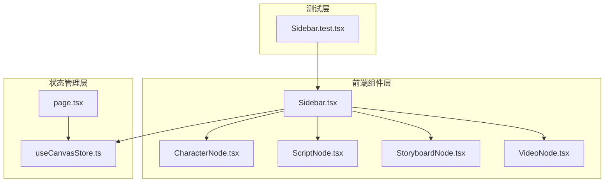
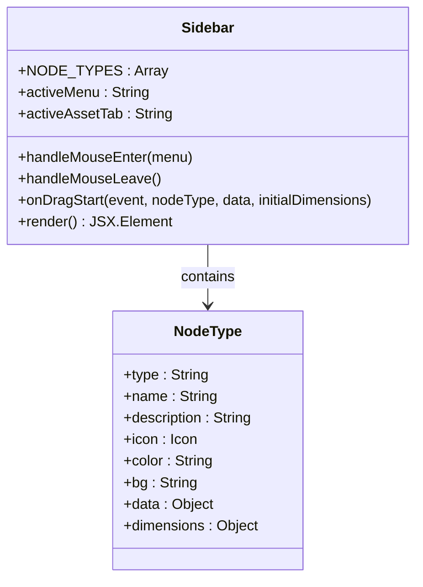
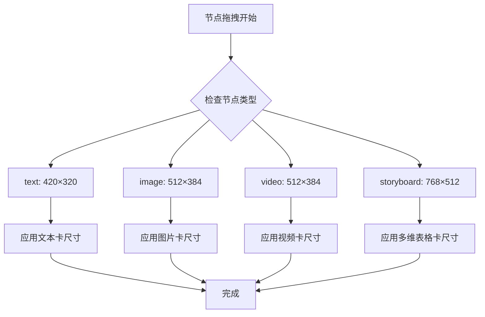
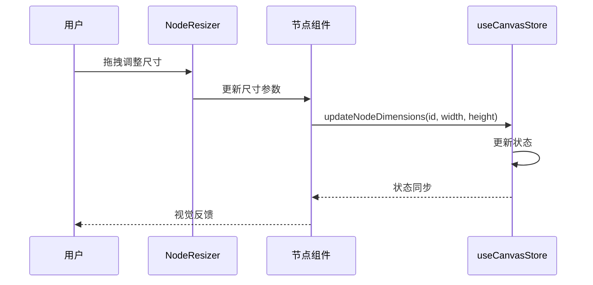
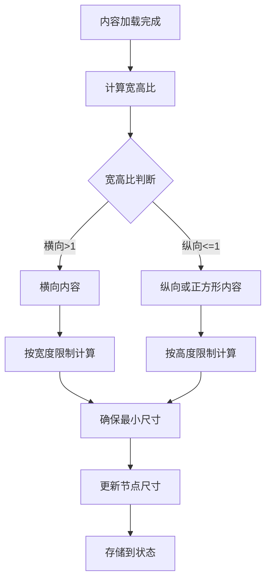
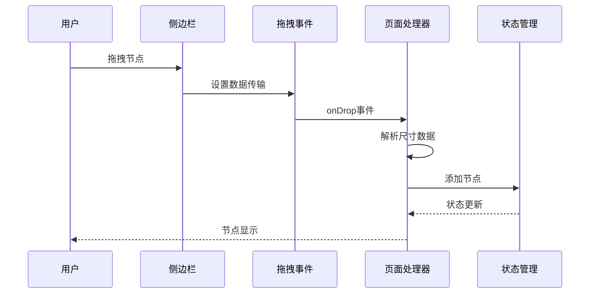

# 侧边栏节点尺寸规范

<cite>
**本文档引用的文件**
- [Sidebar.tsx](file://frontend/src/components/canvas/Sidebar.tsx)
- [CharacterNode.tsx](file://frontend/src/components/canvas/CharacterNode.tsx)
- [ScriptNode.tsx](file://frontend/src/components/canvas/ScriptNode.tsx)
- [StoryboardNode.tsx](file://frontend/src/components/canvas/StoryboardNode.tsx)
- [VideoNode.tsx](file://frontend/src/components/canvas/VideoNode.tsx)
- [useCanvasStore.ts](file://frontend/src/store/useCanvasStore.ts)
- [page.tsx](file://frontend/src/app/theater/[id]/page.tsx)
- [Sidebar.test.tsx](file://frontend/src/components/canvas/__tests__/Sidebar.test.tsx)
</cite>

## 目录
1. [简介](#简介)
2. [项目结构概览](#项目结构概览)
3. [核心组件分析](#核心组件分析)
4. [节点尺寸规范体系](#节点尺寸规范体系)
5. [尺寸约束与最小值](#尺寸约束与最小值)
6. [拖拽与默认尺寸](#拖拽与默认尺寸)
7. [响应式设计考虑](#响应式设计考虑)
8. [最佳实践指南](#最佳实践指南)
9. [故障排除](#故障排除)
10. [总结](#总结)

## 简介

本文档详细阐述了 Infinite Game 项目中侧边栏节点的尺寸规范体系，包括节点的默认尺寸、最小尺寸约束、拖拽行为以及响应式设计考虑。该规范确保了用户界面的一致性和用户体验的流畅性。

## 项目结构概览

项目采用模块化架构，侧边栏节点系统主要分布在以下文件中：

**图表来源**
- [Sidebar.tsx:1-337](file://frontend/src/components/canvas/Sidebar.tsx#L1-L337)
- [useCanvasStore.ts:1-540](file://frontend/src/store/useCanvasStore.ts#L1-L540)

## 核心组件分析

### 侧边栏组件 (Sidebar)

侧边栏作为节点库的主要入口，负责管理和展示各种类型的节点预览：

**图表来源**
- [Sidebar.tsx:9-50](file://frontend/src/components/canvas/Sidebar.tsx#L9-L50)
- [Sidebar.tsx:106-135](file://frontend/src/components/canvas/Sidebar.tsx#L106-L135)

### 节点类型定义

侧边栏定义了四种主要的节点类型及其初始尺寸：

| 节点类型 | 默认宽度 | 默认高度 | 最小宽度 | 最小高度 |
|---------|---------|---------|---------|---------|
| 文本卡 (text) | 420px | 320px | 300px | 200px |
| 图片卡 (image) | 512px | 384px | 256px | 192px |
| 视频卡 (video) | 512px | 384px | 256px | 192px |
| 多维表格卡 (storyboard) | 768px | 512px | 398px | 256px |

**章节来源**
- [Sidebar.tsx:9-50](file://frontend/src/components/canvas/Sidebar.tsx#L9-L50)

## 节点尺寸规范体系

### 1. 默认尺寸规范

每个节点类型都有明确的默认尺寸定义，这些尺寸基于内容显示需求和用户体验考虑：

**图表来源**
- [Sidebar.tsx:18-49](file://frontend/src/components/canvas/Sidebar.tsx#L18-L49)
- [page.tsx:282-286](file://frontend/src/app/theater/[id]/page.tsx#L282-L286)

### 2. 动态尺寸调整机制

节点支持动态尺寸调整，通过 NodeResizer 组件实现：

**图表来源**
- [CharacterNode.tsx:304-319](file://frontend/src/components/canvas/CharacterNode.tsx#L304-L319)
- [useCanvasStore.ts:320-329](file://frontend/src/store/useCanvasStore.ts#L320-L329)

**章节来源**
- [CharacterNode.tsx:304-319](file://frontend/src/components/canvas/CharacterNode.tsx#L304-L319)
- [ScriptNode.tsx:114-129](file://frontend/src/components/canvas/ScriptNode.tsx#L114-L129)
- [StoryboardNode.tsx:57-72](file://frontend/src/components/canvas/StoryboardNode.tsx#L57-L72)
- [VideoNode.tsx:226-241](file://frontend/src/components/canvas/VideoNode.tsx#L226-L241)

## 尺寸约束与最小值

### 最小尺寸约束

每种节点类型都设置了合理的最小尺寸，确保内容的可读性和交互的可用性：

| 节点类型 | 最小宽度 | 最小高度 | 设计考量 |
|---------|---------|---------|---------|
| 文本卡 | 300px | 200px | 保证文本编辑器可见性 |
| 图片卡 | 256px | 192px | 确保图片显示和控制按钮空间 |
| 视频卡 | 256px | 192px | 保持视频播放器和控制按钮 |
| 多维表格卡 | 398px | 256px | 提供表格编辑器空间 |

### 自动尺寸调整逻辑

节点支持根据内容自动调整尺寸：

**图表来源**
- [CharacterNode.tsx:198-230](file://frontend/src/components/canvas/CharacterNode.tsx#L198-L230)
- [VideoNode.tsx:190-222](file://frontend/src/components/canvas/VideoNode.tsx#L190-L222)

**章节来源**
- [CharacterNode.tsx:198-230](file://frontend/src/components/canvas/CharacterNode.tsx#L198-L230)
- [VideoNode.tsx:190-222](file://frontend/src/components/canvas/VideoNode.tsx#L190-L222)

## 拖拽与默认尺寸

### 拖拽流程

当从侧边栏拖拽节点到画布时，系统会执行以下流程：

**图表来源**
- [Sidebar.tsx:106-135](file://frontend/src/components/canvas/Sidebar.tsx#L106-L135)
- [page.tsx:266-313](file://frontend/src/app/theater/[id]/page.tsx#L266-L313)

### 尺寸数据传递

拖拽过程中，尺寸信息通过 dataTransfer 对象传递：

| 数据键 | 用途 | 格式 | 示例 |
|--------|------|------|------|
| application/reactflow | 节点类型标识 | String | "text", "image" |
| application/reactflow-data | 节点数据 | JSON String | 节点初始化数据 |
| application/reactflow-dimensions | 初始尺寸 | JSON String | "{width: 512, height: 384}" |

**章节来源**
- [Sidebar.tsx:106-115](file://frontend/src/components/canvas/Sidebar.tsx#L106-L115)
- [page.tsx:270-272](file://frontend/src/app/theater/[id]/page.tsx#L270-L272)

## 响应式设计考虑

### 移动端适配

侧边栏采用了现代化的迷你设计规范：

- **固定定位**: 使用 `fixed left-6 top-1/2 -translate-y-1/2` 实现居中固定布局
- **紧凑尺寸**: 主按钮采用 `w-8 h-8` 的紧凑设计
- **圆角设计**: 使用 `rounded-[8px]` 提供柔和的视觉效果
- **无阴影**: `shadow-none` 减少视觉重量

### 动画与过渡

系统实现了平滑的动画过渡效果：

- **菜单显示**: `transition-all duration-200 ease-[cubic-bezier(0.4,0,0.2,1)]`
- **透明度变化**: `transition-opacity duration-200`
- **位置变换**: `transition-transform duration-200`

**章节来源**
- [Sidebar.tsx:138-141](file://frontend/src/components/canvas/Sidebar.tsx#L138-L141)
- [Sidebar.tsx:156-161](file://frontend/src/components/canvas/Sidebar.tsx#L156-L161)

## 最佳实践指南

### 开发者指南

1. **新增节点类型时的尺寸规范**
   - 在 `NODE_TYPES` 数组中添加新的节点类型定义
   - 设置合理的默认尺寸和最小尺寸
   - 确保尺寸符合内容显示需求

2. **自定义节点尺寸调整**
   - 在节点组件中使用 `NodeResizer` 组件
   - 设置合适的 `minWidth` 和 `minHeight` 属性
   - 实现尺寸变更的状态同步

3. **拖拽行为优化**
   - 在 `onDragStart` 中正确设置尺寸数据
   - 处理拖拽预览的透明度和样式
   - 确保拖拽事件的正确传播

### 用户体验优化

1. **尺寸调整的视觉反馈**
   - 提供清晰的尺寸调整手柄
   - 实现平滑的尺寸变化动画
   - 显示当前尺寸信息

2. **响应式布局**
   - 确保在不同屏幕尺寸下的可用性
   - 优化移动端触摸交互
   - 提供适当的间距和对比度

## 故障排除

### 常见问题及解决方案

| 问题类型 | 症状 | 可能原因 | 解决方案 |
|---------|------|---------|---------|
| 尺寸异常 | 节点尺寸过小或过大 | 最小尺寸约束失效 | 检查 NodeResizer 配置 |
| 拖拽失败 | 无法从侧边栏拖拽节点 | 数据传输格式错误 | 验证 dataTransfer 设置 |
| 性能问题 | 节点调整时卡顿 | 状态更新过于频繁 | 实现节流机制 |
| 响应式问题 | 移动端显示异常 | 样式适配不当 | 检查断点和媒体查询 |

### 测试验证

系统提供了完整的测试覆盖：

- **渲染测试**: 验证侧边栏的基本渲染和样式
- **交互测试**: 测试悬停、拖拽等交互行为
- **尺寸测试**: 验证节点尺寸的正确性
- **状态测试**: 确保状态管理的正确性

**章节来源**
- [Sidebar.test.tsx:18-139](file://frontend/src/components/canvas/__tests__/Sidebar.test.tsx#L18-L139)

## 总结

侧边栏节点尺寸规范体系为 Infinite Game 项目提供了统一、一致且用户友好的界面设计。通过明确的尺寸定义、合理的约束机制和良好的响应式设计，确保了不同节点类型在各种使用场景下的最佳表现。

该规范的核心优势包括：

1. **一致性**: 所有节点类型遵循统一的尺寸标准
2. **可扩展性**: 新增节点类型时易于维护和扩展
3. **用户体验**: 提供直观的尺寸调整和拖拽体验
4. **性能优化**: 通过状态管理和节流机制确保流畅性

未来的发展方向包括进一步优化移动端体验、增强尺寸调整的智能性，以及提供更多的自定义选项。