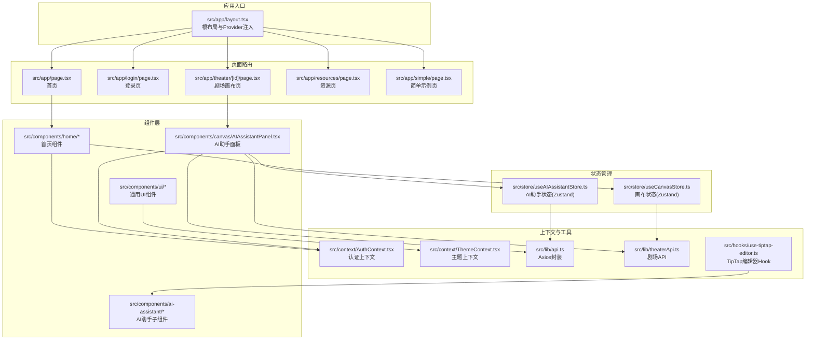
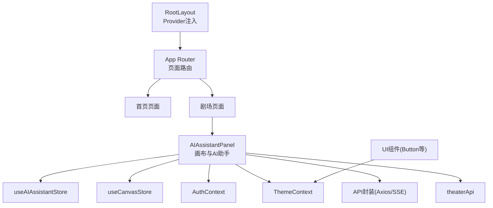
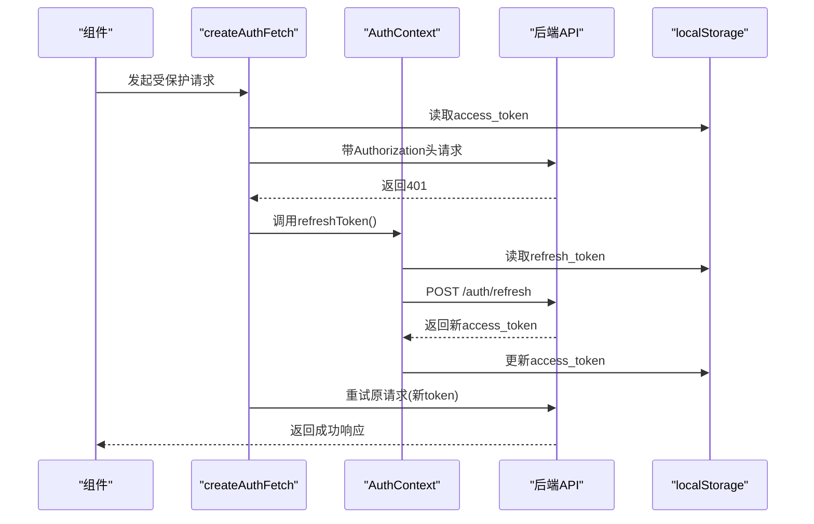
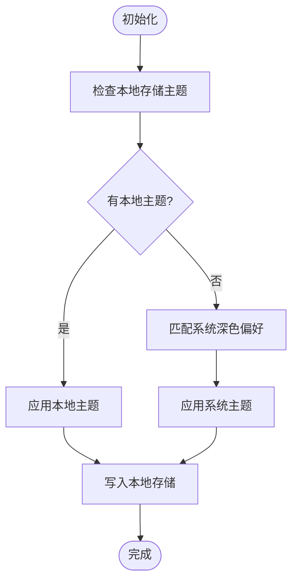
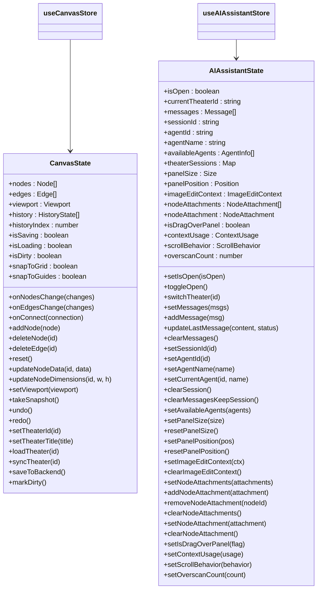
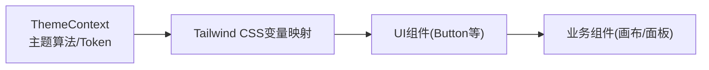
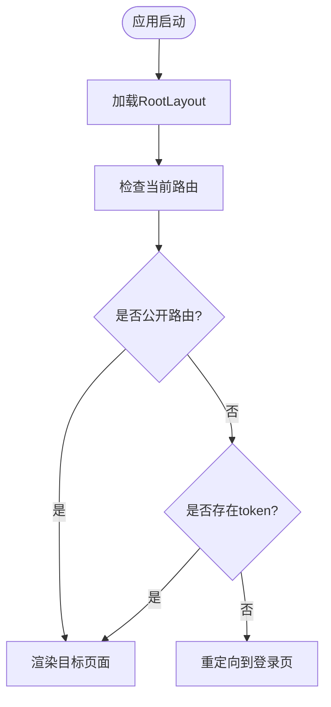
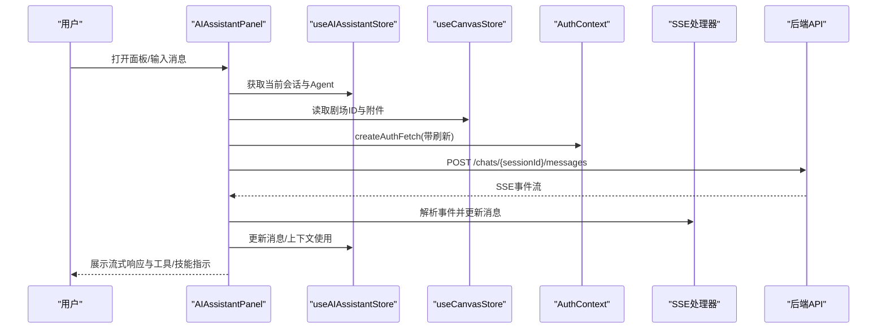
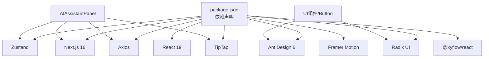

# 前端架构

<cite>
**本文档引用的文件**
- [frontend/package.json](file://frontend/package.json)
- [frontend/next.config.ts](file://frontend/next.config.ts)
- [frontend/tsconfig.json](file://frontend/tsconfig.json)
- [frontend/tailwind.config.ts](file://frontend/tailwind.config.ts)
- [frontend/src/app/layout.tsx](file://frontend/src/app/layout.tsx)
- [frontend/src/context/AuthContext.tsx](file://frontend/src/context/AuthContext.tsx)
- [frontend/src/context/ThemeContext.tsx](file://frontend/src/context/ThemeContext.tsx)
- [frontend/src/store/useCanvasStore.ts](file://frontend/src/store/useCanvasStore.ts)
- [frontend/src/store/useAIAssistantStore.ts](file://frontend/src/store/useAIAssistantStore.ts)
- [frontend/src/lib/api.ts](file://frontend/src/lib/api.ts)
- [frontend/src/lib/theaterApi.ts](file://frontend/src/lib/theaterApi.ts)
- [frontend/src/app/page.tsx](file://frontend/src/app/page.tsx)
- [frontend/src/components/ui/button.tsx](file://frontend/src/components/ui/button.tsx)
- [frontend/src/components/canvas/AIAssistantPanel.tsx](file://frontend/src/components/canvas/AIAssistantPanel.tsx)
- [frontend/src/hooks/use-tiptap-editor.ts](file://frontend/src/hooks/use-tiptap-editor.ts)
</cite>

## 目录
1. [引言](#引言)
2. [项目结构](#项目结构)
3. [核心组件](#核心组件)
4. [架构总览](#架构总览)
5. [详细组件分析](#详细组件分析)
6. [依赖关系分析](#依赖关系分析)
7. [性能考量](#性能考量)
8. [故障排查指南](#故障排查指南)
9. [结论](#结论)
10. [附录](#附录)

## 引言
本文件面向 KunFlix 前端团队与技术读者，系统性梳理基于 Next.js 16 的应用架构，涵盖 App Router 模式、页面路由体系、组件层次结构、状态管理策略（Zustand 与 React Context）、全局状态设计、UI 组件库与主题系统、国际化支持、响应式布局、性能优化与构建配置等。文档旨在帮助开发者快速理解系统设计、高效扩展功能并保障运行质量。

## 项目结构
前端采用 Next.js 16 App Router 结构，根目录为 frontend，核心组织方式如下：
- 应用入口与全局布局：src/app 下的 layout.tsx 提供根布局与全局 Provider 注入（Ant Design Registry、认证与主题 Provider）。
- 页面与路由：src/app 下按路径组织页面，如 /、/login、/resources、/simple、/theater/[id] 等。
- 组件体系：src/components 下按功能域划分，如 canvas（画布与 AI 助手）、home（首页）、ai-assistant（AI 助手子组件）、ui（通用 UI 组件）等。
- 状态管理：src/store 下使用 Zustand 管理画布与 AI 助手状态，并持久化至 localStorage。
- 上下文与工具：src/context 提供认证与主题上下文；src/lib 提供 API 封装与业务接口；src/hooks 提供自定义 Hook。
- 样式与主题：Tailwind 配置通过 CSS 变量桥接 Ant Design 主题；全局样式与变量集中管理。

**图表来源**
- [frontend/src/app/layout.tsx:1-42](file://frontend/src/app/layout.tsx#L1-L42)
- [frontend/src/app/page.tsx:1-19](file://frontend/src/app/page.tsx#L1-L19)
- [frontend/src/components/canvas/AIAssistantPanel.tsx:1-613](file://frontend/src/components/canvas/AIAssistantPanel.tsx#L1-L613)
- [frontend/src/store/useCanvasStore.ts:1-540](file://frontend/src/store/useCanvasStore.ts#L1-L540)
- [frontend/src/store/useAIAssistantStore.ts:1-381](file://frontend/src/store/useAIAssistantStore.ts#L1-L381)
- [frontend/src/context/AuthContext.tsx:1-207](file://frontend/src/context/AuthContext.tsx#L1-L207)
- [frontend/src/context/ThemeContext.tsx:1-75](file://frontend/src/context/ThemeContext.tsx#L1-L75)
- [frontend/src/lib/api.ts:1-84](file://frontend/src/lib/api.ts#L1-L84)
- [frontend/src/lib/theaterApi.ts:1-159](file://frontend/src/lib/theaterApi.ts#L1-L159)
- [frontend/src/hooks/use-tiptap-editor.ts:1-71](file://frontend/src/hooks/use-tiptap-editor.ts#L1-L71)

**章节来源**
- [frontend/src/app/layout.tsx:1-42](file://frontend/src/app/layout.tsx#L1-L42)
- [frontend/src/app/page.tsx:1-19](file://frontend/src/app/page.tsx#L1-L19)

## 核心组件
- 根布局与全局 Provider：在根布局中注入 Ant Design Registry、认证 Provider 与主题 Provider，确保全局样式与主题一致。
- 认证上下文：提供用户状态、登录/登出、令牌刷新与自动重试机制，统一拦截 401 并进行刷新队列处理。
- 主题上下文：支持明暗主题切换、系统偏好检测、Ant Design 主题算法切换与本地存储持久化。
- Zustand 状态管理：
  - 画布状态：管理节点/边/视口、历史快照、脏检查、与后端同步、保存与加载。
  - AI 助手状态：管理消息、会话、Agent 列表、面板尺寸与位置、附件与上下文使用统计。
- UI 组件库：基于 Radix UI 与 class-variance-authority 的 Button 等基础组件，配合 Tailwind 实现主题化样式。
- TipTap 编辑器：提供多页面编辑器状态与命令能力的 Hook，支撑富文本编辑场景。

**章节来源**
- [frontend/src/context/AuthContext.tsx:1-207](file://frontend/src/context/AuthContext.tsx#L1-L207)
- [frontend/src/context/ThemeContext.tsx:1-75](file://frontend/src/context/ThemeContext.tsx#L1-L75)
- [frontend/src/store/useCanvasStore.ts:1-540](file://frontend/src/store/useCanvasStore.ts#L1-L540)
- [frontend/src/store/useAIAssistantStore.ts:1-381](file://frontend/src/store/useAIAssistantStore.ts#L1-L381)
- [frontend/src/components/ui/button.tsx:1-57](file://frontend/src/components/ui/button.tsx#L1-L57)
- [frontend/src/hooks/use-tiptap-editor.ts:1-71](file://frontend/src/hooks/use-tiptap-editor.ts#L1-L71)

## 架构总览
应用采用“布局-页面-组件-状态-上下文-工具”的分层架构：
- 布局层：RootLayout 注入 Provider，统一字体、注册 Ant Design、提供认证与主题环境。
- 页面层：App Router 路由到具体页面，页面组件组合业务组件与状态。
- 组件层：UI 组件库与业务组件（画布、AI 助手、首页等），组件间通过状态与上下文通信。
- 状态层：Zustand Store 管理局部状态与持久化；React Context 管理全局认证与主题。
- 工具层：API 封装、TipTap Hook、工具函数等。

**图表来源**
- [frontend/src/app/layout.tsx:1-42](file://frontend/src/app/layout.tsx#L1-L42)
- [frontend/src/components/canvas/AIAssistantPanel.tsx:1-613](file://frontend/src/components/canvas/AIAssistantPanel.tsx#L1-L613)
- [frontend/src/store/useAIAssistantStore.ts:1-381](file://frontend/src/store/useAIAssistantStore.ts#L1-L381)
- [frontend/src/store/useCanvasStore.ts:1-540](file://frontend/src/store/useCanvasStore.ts#L1-L540)
- [frontend/src/context/AuthContext.tsx:1-207](file://frontend/src/context/AuthContext.tsx#L1-L207)
- [frontend/src/context/ThemeContext.tsx:1-75](file://frontend/src/context/ThemeContext.tsx#L1-L75)
- [frontend/src/lib/api.ts:1-84](file://frontend/src/lib/api.ts#L1-L84)
- [frontend/src/lib/theaterApi.ts:1-159](file://frontend/src/lib/theaterApi.ts#L1-L159)
- [frontend/src/components/ui/button.tsx:1-57](file://frontend/src/components/ui/button.tsx#L1-L57)

## 详细组件分析

### 认证上下文与自动刷新流程
认证上下文负责：
- 用户状态与登录/登出：写入/清除本地存储，更新全局状态并跳转路由。
- 自动刷新：拦截 401，使用刷新令牌请求新访问令牌，支持并发请求排队与重试。
- fetch 包装：提供带授权头的请求函数，内部处理刷新逻辑与队列。

**图表来源**
- [frontend/src/context/AuthContext.tsx:52-114](file://frontend/src/context/AuthContext.tsx#L52-L114)
- [frontend/src/context/AuthContext.tsx:172-199](file://frontend/src/context/AuthContext.tsx#L172-L199)

**章节来源**
- [frontend/src/context/AuthContext.tsx:1-207](file://frontend/src/context/AuthContext.tsx#L1-L207)

### 主题系统与 Ant Design 集成
主题系统：
- 支持明/暗主题切换，优先使用本地存储，其次匹配系统偏好。
- 通过 documentElement 类名与属性设置主题，配合 Ant Design 的算法切换与 token 定制。
- Tailwind 通过 CSS 变量映射主题色值，实现 UI 组件与主题的一致性。

**图表来源**
- [frontend/src/context/ThemeContext.tsx:16-41](file://frontend/src/context/ThemeContext.tsx#L16-L41)

**章节来源**
- [frontend/src/context/ThemeContext.tsx:1-75](file://frontend/src/context/ThemeContext.tsx#L1-L75)
- [frontend/tailwind.config.ts:1-64](file://frontend/tailwind.config.ts#L1-L64)

### Zustand 状态管理：画布与 AI 助手
- useCanvasStore：管理画布节点/边/视口、历史快照、脏检查、与后端同步与保存、网格吸附设置等。通过 persist 中间件将关键状态持久化至 localStorage，并在合并时去重节点。
- useAIAssistantStore：管理消息、会话、Agent 列表、面板尺寸与位置、附件与上下文使用统计。同样使用 persist，持久化所有剧场会话与当前状态。

**图表来源**
- [frontend/src/store/useCanvasStore.ts:67-114](file://frontend/src/store/useCanvasStore.ts#L67-L114)
- [frontend/src/store/useAIAssistantStore.ts:104-200](file://frontend/src/store/useAIAssistantStore.ts#L104-L200)

**章节来源**
- [frontend/src/store/useCanvasStore.ts:1-540](file://frontend/src/store/useCanvasStore.ts#L1-L540)
- [frontend/src/store/useAIAssistantStore.ts:1-381](file://frontend/src/store/useAIAssistantStore.ts#L1-L381)

### UI 组件库与响应式布局
- Button 组件：基于 class-variance-authority 的变体与尺寸系统，结合 Tailwind 类名实现主题化按钮。
- 响应式与主题：通过 Tailwind CSS 变量映射 Ant Design 主题色，配合 darkMode class 控制明暗主题。
- TipTap 集成：use-tiptap-editor Hook 提供多页面编辑器状态与命令能力，便于在画布与富文本场景中复用。

**图表来源**
- [frontend/src/context/ThemeContext.tsx:48-63](file://frontend/src/context/ThemeContext.tsx#L48-L63)
- [frontend/tailwind.config.ts:10-61](file://frontend/tailwind.config.ts#L10-L61)
- [frontend/src/components/ui/button.tsx:1-57](file://frontend/src/components/ui/button.tsx#L1-L57)
- [frontend/src/hooks/use-tiptap-editor.ts:1-71](file://frontend/src/hooks/use-tiptap-editor.ts#L1-L71)

**章节来源**
- [frontend/src/components/ui/button.tsx:1-57](file://frontend/src/components/ui/button.tsx#L1-L57)
- [frontend/src/hooks/use-tiptap-editor.ts:1-71](file://frontend/src/hooks/use-tiptap-editor.ts#L1-L71)

### 页面路由与 App Router 模式
- 根布局：设置语言、字体、全局样式与 Provider 注入。
- 页面组织：按路径组织页面，如首页、登录、剧场画布、资源与简单示例页。
- 路由守卫：认证上下文在初始化时检查路由与登录状态，非公开路由未登录自动跳转。

**图表来源**
- [frontend/src/app/layout.tsx:18-41](file://frontend/src/app/layout.tsx#L18-L41)
- [frontend/src/context/AuthContext.tsx:127-140](file://frontend/src/context/AuthContext.tsx#L127-L140)

**章节来源**
- [frontend/src/app/layout.tsx:1-42](file://frontend/src/app/layout.tsx#L1-L42)
- [frontend/src/context/AuthContext.tsx:1-207](file://frontend/src/context/AuthContext.tsx#L1-L207)

### AI 助手面板与交互流程
AI 助手面板整合了消息列表、输入区、Agent 切换、附件拖拽与上下文构建、SSE 流式响应处理、性能监控与虚拟滚动等能力。其核心交互流程如下：

**图表来源**
- [frontend/src/components/canvas/AIAssistantPanel.tsx:183-293](file://frontend/src/components/canvas/AIAssistantPanel.tsx#L183-L293)
- [frontend/src/store/useAIAssistantStore.ts:148-200](file://frontend/src/store/useAIAssistantStore.ts#L148-L200)
- [frontend/src/store/useCanvasStore.ts:104-107](file://frontend/src/store/useCanvasStore.ts#L104-L107)
- [frontend/src/context/AuthContext.tsx:52-114](file://frontend/src/context/AuthContext.tsx#L52-L114)

**章节来源**
- [frontend/src/components/canvas/AIAssistantPanel.tsx:1-613](file://frontend/src/components/canvas/AIAssistantPanel.tsx#L1-L613)

## 依赖关系分析
- 运行时依赖：Next.js 16、React 19、Ant Design 6、Radix UI、Zustand、Axios、@tiptap、framer-motion、react-window、recharts、socket.io-client 等。
- 构建与开发：TypeScript、Tailwind CSS v4、Jest、ESLint、SWC 等。
- 关键耦合点：
  - 组件与状态：AI 助手面板与画布面板分别消费对应 Zustand Store。
  - 组件与上下文：认证与主题上下文贯穿全局，组件通过 Hook 使用。
  - 组件与工具：API 封装与剧场 API 为组件提供数据通道。
  - UI 与主题：UI 组件依赖主题上下文与 Tailwind 变量映射。

**图表来源**
- [frontend/package.json:1-94](file://frontend/package.json#L1-L94)

**章节来源**
- [frontend/package.json:1-94](file://frontend/package.json#L1-L94)

## 性能考量
- 状态持久化：Zustand 的 persist 中间件仅持久化必要字段，减少存储体积与序列化开销。
- 虚拟滚动：AI 助手消息列表采用 react-window 虚拟化，提升长列表渲染性能。
- 流式渲染：SSE 流式响应逐步更新 UI，避免一次性渲染大量内容。
- 主题与样式：Tailwind CSS 变量映射与 Ant Design 算法切换，减少重复计算。
- 请求拦截与刷新：统一的 Axios 拦截器与刷新队列，避免并发刷新风暴。
- 构建优化：Next.js 16 与 SWC 加速构建，TypeScript 严格模式与增量编译提升开发体验。

[本节为通用性能建议，无需特定文件引用]

## 故障排查指南
- 登录过期与 401 处理：当后端返回 401 且非认证端点时，自动刷新令牌并重试请求；若刷新失败，清空本地存储并跳转登录页。
- 重新登录弹窗：在 AI 助手面板中，遇到 401 且刷新失败时弹出重新登录对话框。
- 本地存储异常：Zustand 的 merge 逻辑会去重节点，若出现状态异常，可清理对应存储键后重试。
- 网络请求失败：检查 API 封装中的拦截器与刷新逻辑，确认刷新令牌是否有效。
- 主题切换无效：确认本地存储与 documentElement 类名是否正确写入，Tailwind CSS 变量映射是否生效。

**章节来源**
- [frontend/src/context/AuthContext.tsx:52-114](file://frontend/src/context/AuthContext.tsx#L52-L114)
- [frontend/src/lib/api.ts:31-81](file://frontend/src/lib/api.ts#L31-L81)
- [frontend/src/components/canvas/AIAssistantPanel.tsx:584-610](file://frontend/src/components/canvas/AIAssistantPanel.tsx#L584-L610)
- [frontend/src/store/useCanvasStore.ts:521-536](file://frontend/src/store/useCanvasStore.ts#L521-L536)

## 结论
KunFlix 前端以 Next.js 16 App Router 为基础，结合 Ant Design 与 Tailwind 实现一致的主题与样式体系；通过 React Context 管理认证与主题，通过 Zustand 管理画布与 AI 助手状态，并以 API 封装与工具函数提供稳定的网络与编辑能力。整体架构清晰、模块职责明确、状态持久化与性能优化策略完善，适合长期演进与团队协作。

## 附录
- 构建配置：next.config.ts 开启大请求体限制与 API 代理，tsconfig.json 配置路径别名与严格模式，tailwind.config.ts 启用暗色模式与动画插件。
- 国际化支持：当前项目使用 Ant Design 的 zh_CN 本地化与 Google Fonts 字体，未见独立 i18n 框架配置；如需国际化可考虑引入 next-i18next 或类似方案。

**章节来源**
- [frontend/next.config.ts:1-21](file://frontend/next.config.ts#L1-L21)
- [frontend/tsconfig.json:1-35](file://frontend/tsconfig.json#L1-L35)
- [frontend/tailwind.config.ts:1-64](file://frontend/tailwind.config.ts#L1-L64)
- [frontend/src/context/ThemeContext.tsx:5-6](file://frontend/src/context/ThemeContext.tsx#L5-L6)