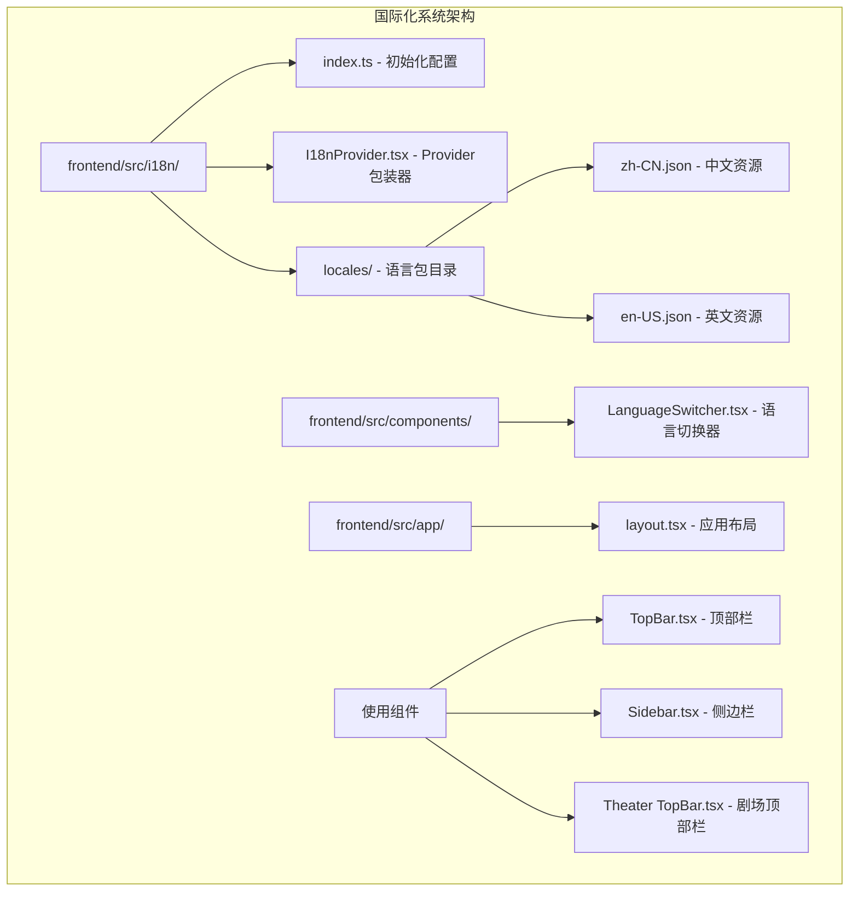
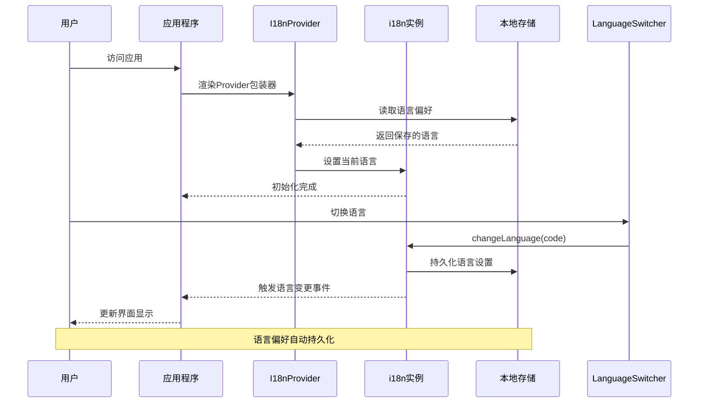
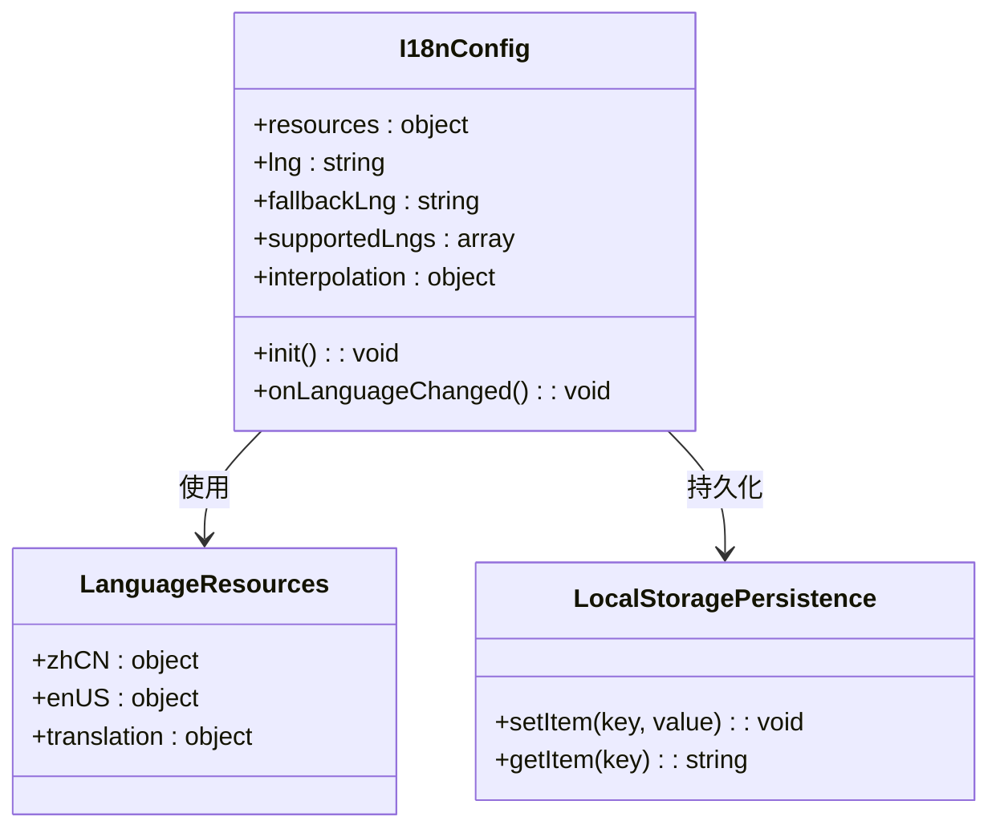
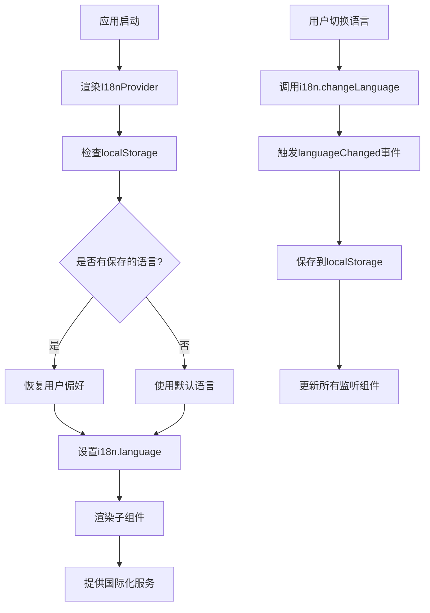
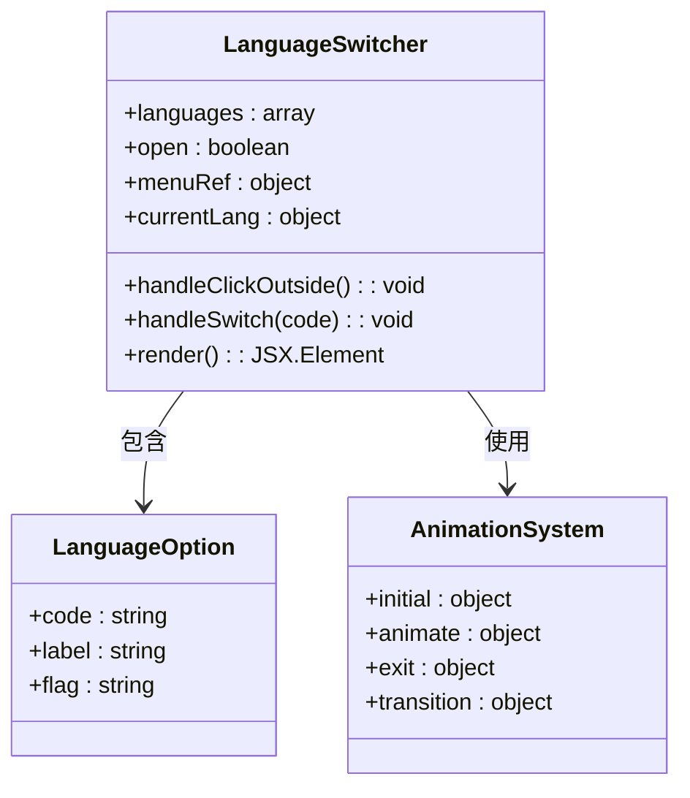
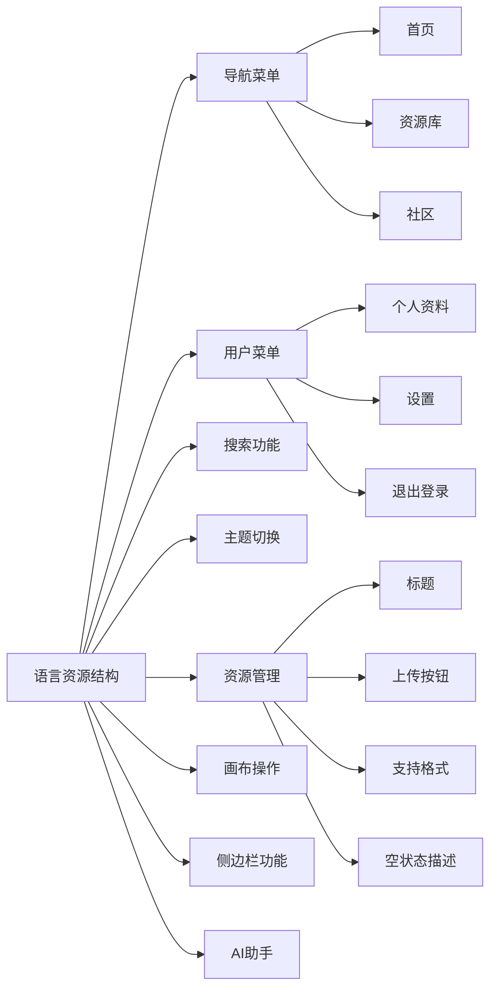
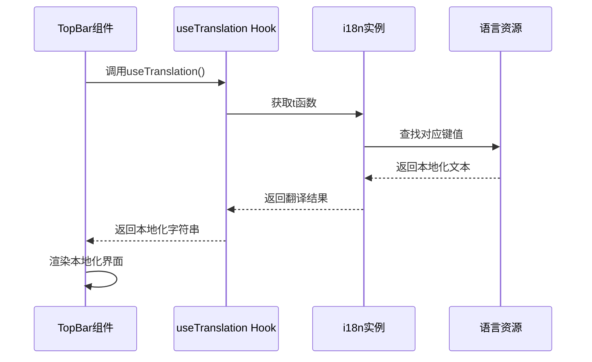
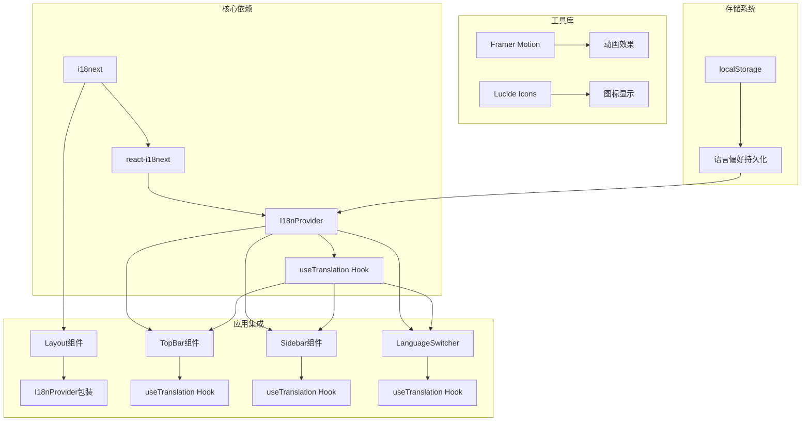

# 国际化系统

<cite>
**本文档引用的文件**
- [frontend/src/i18n/index.ts](file://frontend/src/i18n/index.ts)
- [frontend/src/i18n/I18nProvider.tsx](file://frontend/src/i18n/I18nProvider.tsx)
- [frontend/src/components/LanguageSwitcher.tsx](file://frontend/src/components/LanguageSwitcher.tsx)
- [frontend/src/i18n/locales/zh-CN.json](file://frontend/src/i18n/locales/zh-CN.json)
- [frontend/src/i18n/locales/en-US.json](file://frontend/src/i18n/locales/en-US.json)
- [frontend/src/app/layout.tsx](file://frontend/src/app/layout.tsx)
- [frontend/src/components/home/TopBar.tsx](file://frontend/src/components/home/TopBar.tsx)
- [frontend/src/components/canvas/Sidebar.tsx](file://frontend/src/components/canvas/Sidebar.tsx)
- [frontend/src/app/theater/[id]/components/TopBar.tsx](file://frontend/src/app/theater/[id]/components/TopBar.tsx)
- [frontend/package.json](file://frontend/package.json)
</cite>

## 目录
1. [简介](#简介)
2. [项目结构](#项目结构)
3. [核心组件](#核心组件)
4. [架构概览](#架构概览)
5. [详细组件分析](#详细组件分析)
6. [依赖关系分析](#依赖关系分析)
7. [性能考虑](#性能考虑)
8. [故障排除指南](#故障排除指南)
9. [结论](#结论)

## 简介

国际化系统是现代Web应用中不可或缺的重要组成部分，它为用户提供多语言支持，提升用户体验和应用的全球化能力。本系统基于React和i18next构建，实现了完整的多语言解决方案，包括语言切换、本地化资源管理、SSR兼容性以及用户偏好持久化等功能。

该国际化系统采用模块化设计，通过清晰的文件组织和标准化的接口，为整个应用提供了统一的语言处理机制。系统支持简体中文和英语两种语言，具备良好的扩展性，可以轻松添加更多语言支持。

## 项目结构

国际化系统主要分布在前端项目的以下目录结构中：

**图表来源**
- [frontend/src/i18n/index.ts:1-28](file://frontend/src/i18n/index.ts#L1-L28)
- [frontend/src/i18n/I18nProvider.tsx:1-20](file://frontend/src/i18n/I18nProvider.tsx#L1-L20)
- [frontend/src/components/LanguageSwitcher.tsx:1-79](file://frontend/src/components/LanguageSwitcher.tsx#L1-L79)

**章节来源**
- [frontend/src/i18n/index.ts:1-28](file://frontend/src/i18n/index.ts#L1-L28)
- [frontend/src/i18n/I18nProvider.tsx:1-20](file://frontend/src/i18n/I18nProvider.tsx#L1-L20)
- [frontend/src/components/LanguageSwitcher.tsx:1-79](file://frontend/src/components/LanguageSwitcher.tsx#L1-L79)

## 核心组件

国际化系统由以下几个核心组件构成：

### 1. 国际化初始化配置

系统的核心配置位于`frontend/src/i18n/index.ts`文件中，负责初始化i18next实例并配置基础参数。

### 2. Provider包装器

`frontend/src/i18n/I18nProvider.tsx`文件提供了一个客户端组件，用于包装整个应用，确保国际化功能在整个应用范围内生效。

### 3. 语言切换器

`frontend/src/components/LanguageSwitcher.tsx`是一个交互式组件，允许用户在支持的语言之间进行切换。

### 4. 语言资源文件

系统包含两个主要的语言资源文件：
- `frontend/src/i18n/locales/zh-CN.json` - 简体中文资源
- `frontend/src/i18n/locales/en-US.json` - 英语资源

**章节来源**
- [frontend/src/i18n/index.ts:12-20](file://frontend/src/i18n/index.ts#L12-L20)
- [frontend/src/i18n/I18nProvider.tsx:7-19](file://frontend/src/i18n/I18nProvider.tsx#L7-L19)
- [frontend/src/components/LanguageSwitcher.tsx:13-31](file://frontend/src/components/LanguageSwitcher.tsx#L13-L31)

## 架构概览

国际化系统采用分层架构设计，确保了良好的可维护性和扩展性：

**图表来源**
- [frontend/src/i18n/I18nProvider.tsx:13-16](file://frontend/src/i18n/I18nProvider.tsx#L13-L16)
- [frontend/src/i18n/index.ts:23-25](file://frontend/src/i18n/index.ts#L23-L25)

系统架构特点：

1. **分层设计**：配置层、Provider层、组件层职责分明
2. **事件驱动**：通过i18next事件系统实现语言变更通知
3. **持久化存储**：使用localStorage保存用户语言偏好
4. **SSR兼容**：客户端挂载后恢复语言设置，避免水合不匹配

**章节来源**
- [frontend/src/i18n/index.ts:12-25](file://frontend/src/i18n/index.ts#L12-L25)
- [frontend/src/i18n/I18nProvider.tsx:12-16](file://frontend/src/i18n/I18nProvider.tsx#L12-L16)

## 详细组件分析

### 国际化初始化组件

国际化初始化组件负责配置和启动i18next实例：

**图表来源**
- [frontend/src/i18n/index.ts:7-25](file://frontend/src/i18n/index.ts#L7-L25)

初始化配置的关键特性：

1. **资源配置**：集中管理所有语言资源
2. **默认语言**：设置简体中文为默认语言
3. **回退语言**：定义语言回退策略
4. **支持语言**：明确列出支持的语言列表
5. **插值处理**：配置变量替换机制
6. **持久化监听**：自动保存语言变更

**章节来源**
- [frontend/src/i18n/index.ts:7-25](file://frontend/src/i18n/index.ts#L7-L25)

### Provider包装器组件

I18nProvider组件是整个国际化系统的核心包装器：

**图表来源**
- [frontend/src/i18n/I18nProvider.tsx:13-16](file://frontend/src/i18n/I18nProvider.tsx#L13-L16)

组件功能特性：

1. **客户端挂载检测**：避免SSR期间的语言设置
2. **偏好恢复机制**：从localStorage恢复用户语言选择
3. **即时生效**：语言切换立即反映在UI上
4. **事件传播**：通过i18next事件系统通知所有监听者

**章节来源**
- [frontend/src/i18n/I18nProvider.tsx:13-16](file://frontend/src/i18n/I18nProvider.tsx#L13-L16)

### 语言切换器组件

LanguageSwitcher组件提供了直观的用户界面来切换语言：

**图表来源**
- [frontend/src/components/LanguageSwitcher.tsx:8-31](file://frontend/src/components/LanguageSwitcher.tsx#L8-L31)

组件设计特点：

1. **下拉菜单**：提供简洁的菜单界面
2. **动画效果**：使用Framer Motion实现流畅的展开/收起动画
3. **点击外部关闭**：自动关闭菜单，提升用户体验
4. **状态指示**：高亮显示当前选中的语言
5. **响应式设计**：适配不同屏幕尺寸

**章节来源**
- [frontend/src/components/LanguageSwitcher.tsx:13-79](file://frontend/src/components/LanguageSwitcher.tsx#L13-L79)

### 语言资源文件

系统包含两个主要的语言资源文件，每个文件都遵循相同的结构：

**图表来源**
- [frontend/src/i18n/locales/zh-CN.json:2-207](file://frontend/src/i18n/locales/zh-CN.json#L2-L207)
- [frontend/src/i18n/locales/en-US.json:2-207](file://frontend/src/i18n/locales/en-US.json#L2-L207)

资源文件组织结构：

1. **导航相关**：页面导航、面包屑等
2. **用户界面**：用户菜单、登录状态等
3. **功能描述**：各种操作的提示信息
4. **错误消息**：系统错误和异常处理
5. **占位符**：动态内容的占位符
6. **帮助信息**：用户指导和说明

**章节来源**
- [frontend/src/i18n/locales/zh-CN.json:1-207](file://frontend/src/i18n/locales/zh-CN.json#L1-L207)
- [frontend/src/i18n/locales/en-US.json:1-207](file://frontend/src/i18n/locales/en-US.json#L1-L207)

### 组件集成使用

多个组件集成了国际化功能，展示了系统的广泛适用性：

#### 顶部栏组件集成

顶部栏组件使用国际化资源来显示本地化的界面元素：

**图表来源**
- [frontend/src/components/home/TopBar.tsx:36](file://frontend/src/components/home/TopBar.tsx#L36)
- [frontend/src/components/home/TopBar.tsx:133](file://frontend/src/components/home/TopBar.tsx#L133)

组件使用模式：

1. **导航链接**：使用`nav.home`、`nav.resources`等键值
2. **用户菜单**：使用`userMenu.profile`、`userMenu.settings`等键值
3. **搜索功能**：使用`search.placeholder`、`search.label`等键值
4. **主题切换**：使用`theme.switchToLight`、`theme.switchToDark`等键值
5. **语言切换**：使用`language.label`等键值

**章节来源**
- [frontend/src/components/home/TopBar.tsx:17-27](file://frontend/src/components/home/TopBar.tsx#L17-L27)
- [frontend/src/components/home/TopBar.tsx:36](file://frontend/src/components/home/TopBar.tsx#L36)

#### 侧边栏组件集成

侧边栏组件展示了复杂国际化场景的处理：

侧边栏组件使用多种类型的国际化键值：

1. **节点类型**：`sidebar.textCard`、`sidebar.imageCard`等
2. **描述信息**：`sidebar.textDesc`、`sidebar.imageDesc`等
3. **标签页**：`sidebar.images`、`sidebar.videos`等
4. **空状态**：`sidebar.noImages`、`sidebar.noVideos`等
5. **操作提示**：`sidebar.dropToAdd`、`sidebar.manageResources`等

**章节来源**
- [frontend/src/components/canvas/Sidebar.tsx:10-51](file://frontend/src/components/canvas/Sidebar.tsx#L10-L51)
- [frontend/src/components/canvas/Sidebar.tsx:61-72](file://frontend/src/components/canvas/Sidebar.tsx#L61-L72)

## 依赖关系分析

国际化系统与应用其他部分的依赖关系如下：

**图表来源**
- [frontend/package.json:52-61](file://frontend/package.json#L52-L61)
- [frontend/src/app/layout.tsx:6](file://frontend/src/app/layout.tsx#L6)

依赖关系特点：

1. **核心依赖**：i18next和react-i18next是系统的基础
2. **组件集成**：多个组件共享useTranslation Hook
3. **第三方库**：使用Framer Motion和Lucide Icons增强用户体验
4. **存储集成**：与localStorage无缝集成
5. **SSR兼容**：通过Provider包装器支持服务端渲染

**章节来源**
- [frontend/package.json:52-61](file://frontend/package.json#L52-L61)
- [frontend/src/app/layout.tsx:6](file://frontend/src/app/layout.tsx#L6)

## 性能考虑

国际化系统在设计时充分考虑了性能优化：

### 1. 资源加载优化

- **按需加载**：语言资源在应用启动时一次性加载
- **缓存机制**：i18next内置缓存，避免重复查询
- **键值查找**：O(1)时间复杂度的键值查找

### 2. 组件渲染优化

- **记忆化处理**：使用useMemo避免不必要的重新计算
- **条件渲染**：只在需要时渲染语言切换器
- **事件委托**：减少事件监听器数量

### 3. 存储性能

- **异步存储**：localStorage操作非阻塞
- **批量更新**：语言变更时的事件处理批量化

### 4. 内存管理

- **垃圾回收**：及时清理事件监听器
- **引用管理**：使用ref正确管理DOM引用

## 故障排除指南

### 常见问题及解决方案

#### 1. 语言切换无效

**症状**：切换语言后界面没有变化

**可能原因**：
- i18n实例未正确初始化
- 事件监听器未正确绑定
- localStorage访问权限问题

**解决方法**：
1. 检查i18n初始化配置
2. 验证languageChanged事件监听
3. 确认localStorage可用性

#### 2. SSR水合不匹配

**症状**：服务端和客户端显示不同的语言

**解决方法**：
1. 确保I18nProvider在客户端挂载后才恢复语言偏好
2. 检查html标签的lang属性
3. 验证语言回退机制

#### 3. 资源键值缺失

**症状**：显示原始键值而非翻译文本

**解决方法**：
1. 检查语言资源文件中的键值是否存在
2. 验证JSON格式正确性
3. 确认键值拼写正确

#### 4. 动态内容翻译问题

**症状**：变量替换不生效

**解决方法**：
1. 检查插值语法格式
2. 验证变量传递方式
3. 确认变量类型兼容性

**章节来源**
- [frontend/src/i18n/I18nProvider.tsx:13-16](file://frontend/src/i18n/I18nProvider.tsx#L13-L16)
- [frontend/src/i18n/index.ts:23-25](file://frontend/src/i18n/index.ts#L23-L25)

## 结论

国际化系统为整个应用提供了完整、可靠的多语言支持解决方案。通过精心设计的架构和组件，系统实现了以下目标：

### 主要成就

1. **完整的多语言支持**：支持简体中文和英语，具备良好的扩展性
2. **用户友好体验**：提供直观的语言切换界面和流畅的动画效果
3. **技术先进性**：采用React Hooks和现代前端技术栈
4. **性能优化**：通过缓存和记忆化技术确保高效运行
5. **SSR兼容**：完美支持服务端渲染和客户端渲染

### 技术亮点

- **模块化设计**：清晰的文件组织和职责分离
- **事件驱动架构**：通过i18next事件系统实现松耦合
- **持久化存储**：自动保存用户语言偏好
- **广泛集成**：多个组件共享国际化功能
- **错误处理**：完善的回退机制和错误处理

### 未来发展方向

1. **语言扩展**：支持更多语言和地区变体
2. **动态加载**：实现按需加载语言资源
3. **实时翻译**：集成在线翻译服务
4. **文化适配**：支持日期、数字、货币等本地化格式
5. **性能监控**：添加国际化性能指标和监控

该国际化系统为应用的全球化发展奠定了坚实基础，通过持续的优化和扩展，能够满足不断增长的国际化需求。