# 国际化系统

<cite>
**本文档引用的文件**
- [frontend/src/i18n/index.ts](file://frontend/src/i18n/index.ts)
- [frontend/src/i18n/I18nProvider.tsx](file://frontend/src/i18n/I18nProvider.tsx)
- [frontend/src/components/LanguageSwitcher.tsx](file://frontend/src/components/LanguageSwitcher.tsx)
- [frontend/src/i18n/locales/zh-CN.json](file://frontend/src/i18n/locales/zh-CN.json)
- [frontend/src/i18n/locales/en-US.json](file://frontend/src/i18n/locales/en-US.json)
- [frontend/src/app/layout.tsx](file://frontend/src/app/layout.tsx)
- [frontend/src/components/home/TopBar.tsx](file://frontend/src/components/home/TopBar.tsx)
- [frontend/src/components/canvas/Sidebar.tsx](file://frontend/src/components/canvas/Sidebar.tsx)
- [frontend/src/app/theater/[id]/components/TopBar.tsx](file://frontend/src/app/theater/[id]/components/TopBar.tsx)
- [frontend/src/components/ai-assistant/PanelHeader.tsx](file://frontend/src/components/ai-assistant/PanelHeader.tsx)
- [frontend/src/components/ai-assistant/hooks/useSessionManager.ts](file://frontend/src/components/ai-assistant/hooks/useSessionManager.ts)
- [frontend/src/components/ai-assistant/MessageInput.tsx](file://frontend/src/components/ai-assistant/MessageInput.tsx)
- [frontend/src/components/canvas/AIAssistantPanel.tsx](file://frontend/src/components/canvas/AIAssistantPanel.tsx)
- [frontend/src/components/canvas/AudioNode.tsx](file://frontend/src/components/canvas/AudioNode.tsx)
- [frontend/package.json](file://frontend/package.json)
</cite>

## 更新摘要
**变更内容**
- 新增音频相关的完整国际化支持，包括音频卡、音频描述、音频过滤器、空状态和错误消息
- 完善音频上传失败和文件大小限制的本地化提示
- 修复音频资源空状态的翻译键不一致问题
- 扩展AI助手面板的音频相关错误消息支持

## 目录
1. [简介](#简介)
2. [项目结构](#项目结构)
3. [核心组件](#核心组件)
4. [架构概览](#架构概览)
5. [详细组件分析](#详细组件分析)
6. [音频功能国际化支持](#音频功能国际化支持)
7. [多会话管理国际化支持](#多会话管理国际化支持)
8. [AI助手停止生动生成功能国际化](#ai助手停止生动生成功能国际化)
9. [依赖关系分析](#依赖关系分析)
10. [性能考虑](#性能考虑)
11. [故障排除指南](#故障排除指南)
12. [结论](#结论)

## 简介

国际化系统是现代Web应用中不可或缺的重要组成部分，它为用户提供多语言支持，提升用户体验和应用的全球化能力。本系统基于React和i18next构建，实现了完整的多语言解决方案，包括语言切换、本地化资源管理、SSR兼容性以及用户偏好持久化等功能。

该国际化系统采用模块化设计，通过清晰的文件组织和标准化的接口，为整个应用提供了统一的语言处理机制。系统支持简体中文和英语两种语言，具备良好的扩展性，可以轻松添加更多语言支持。

**更新** 系统现已全面增强对音频功能的国际化支持，包括音频卡节点、音频资源管理、音频上传处理和音频相关错误消息的完整本地化。同时修复了音频资源空状态的翻译键不一致问题，确保用户在不同语言环境下都能获得一致且准确的音频功能体验。

## 项目结构

国际化系统主要分布在前端项目的以下目录结构中：

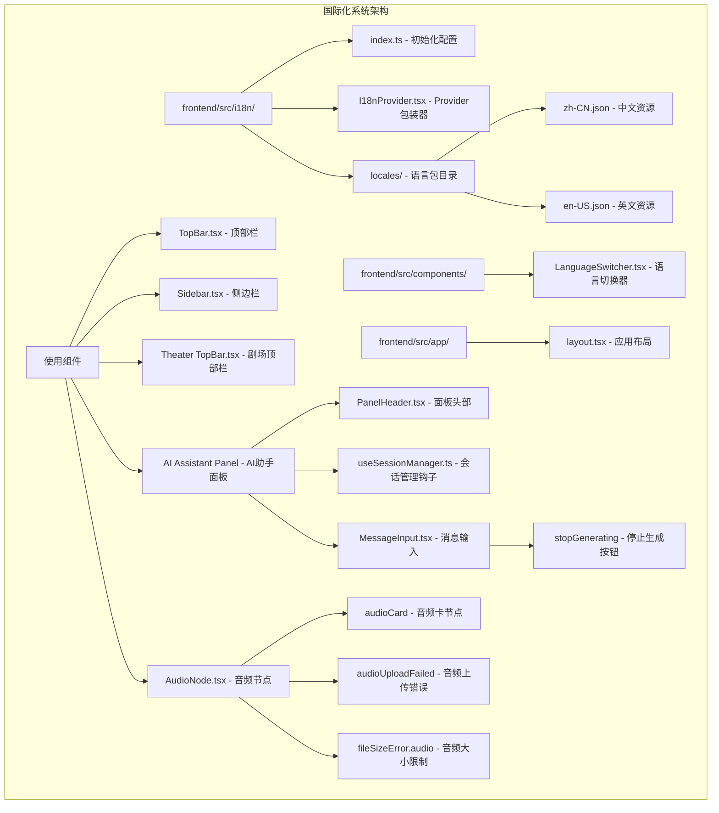

**图表来源**
- [frontend/src/i18n/index.ts:1-28](file://frontend/src/i18n/index.ts#L1-L28)
- [frontend/src/i18n/I18nProvider.tsx:1-20](file://frontend/src/i18n/I18nProvider.tsx#L1-L20)
- [frontend/src/components/LanguageSwitcher.tsx:1-79](file://frontend/src/components/LanguageSwitcher.tsx#L1-L79)

**章节来源**
- [frontend/src/i18n/index.ts:1-28](file://frontend/src/i18n/index.ts#L1-L28)
- [frontend/src/i18n/I18nProvider.tsx:1-20](file://frontend/src/i18n/I18nProvider.tsx#L1-L20)
- [frontend/src/components/LanguageSwitcher.tsx:1-79](file://frontend/src/components/LanguageSwitcher.tsx#L1-L79)

## 核心组件

国际化系统由以下几个核心组件构成：

### 1. 国际化初始化配置

系统的核心配置位于`frontend/src/i18n/index.ts`文件中，负责初始化i18next实例并配置基础参数。

### 2. Provider包装器

`frontend/src/i18n/I18nProvider.tsx`文件提供了一个客户端组件，用于包装整个应用，确保国际化功能在整个应用范围内生效。

### 3. 语言切换器

`frontend/src/components/LanguageSwitcher.tsx`是一个交互式组件，允许用户在支持的语言之间进行切换。

### 4. 语言资源文件

系统包含两个主要的语言资源文件：
- `frontend/src/i18n/locales/zh-CN.json` - 简体中文资源
- `frontend/src/i18n/locales/en-US.json` - 英语资源

**章节来源**
- [frontend/src/i18n/index.ts:12-20](file://frontend/src/i18n/index.ts#L12-L20)
- [frontend/src/i18n/I18nProvider.tsx:7-19](file://frontend/src/i18n/I18nProvider.tsx#L7-L19)
- [frontend/src/components/LanguageSwitcher.tsx:13-31](file://frontend/src/components/LanguageSwitcher.tsx#L13-L31)

## 架构概览

国际化系统采用分层架构设计，确保了良好的可维护性和扩展性：

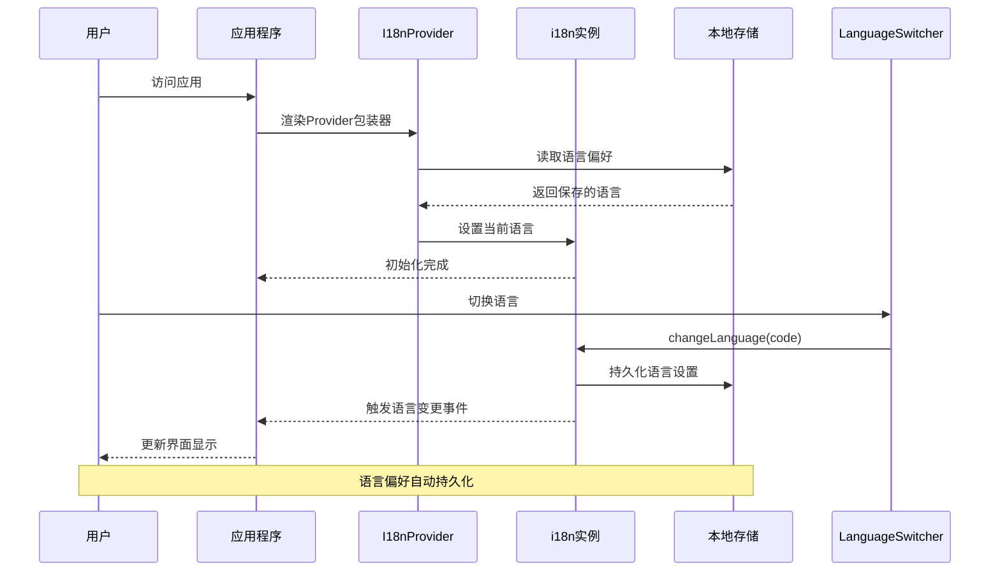

**图表来源**
- [frontend/src/i18n/I18nProvider.tsx:13-16](file://frontend/src/i18n/I18nProvider.tsx#L13-L16)
- [frontend/src/i18n/index.ts:23-25](file://frontend/src/i18n/index.ts#L23-L25)

系统架构特点：

1. **分层设计**：配置层、Provider层、组件层职责分明
2. **事件驱动**：通过i18next事件系统实现语言变更通知
3. **持久化存储**：使用localStorage保存用户语言偏好
4. **SSR兼容**：客户端挂载后恢复语言设置，避免水合不匹配

**章节来源**
- [frontend/src/i18n/index.ts:12-25](file://frontend/src/i18n/index.ts#L12-L25)
- [frontend/src/i18n/I18nProvider.tsx:12-16](file://frontend/src/i18n/I18nProvider.tsx#L12-L16)

## 详细组件分析

### 国际化初始化组件

国际化初始化组件负责配置和启动i18next实例：

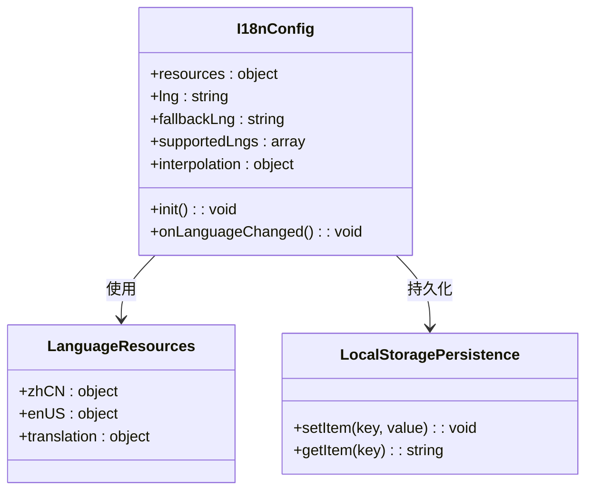

**图表来源**
- [frontend/src/i18n/index.ts:7-25](file://frontend/src/i18n/index.ts#L7-L25)

初始化配置的关键特性：

1. **资源配置**：集中管理所有语言资源
2. **默认语言**：设置简体中文为默认语言
3. **回退语言**：定义语言回退策略
4. **支持语言**：明确列出支持的语言列表
5. **插值处理**：配置变量替换机制
6. **持久化监听**：自动保存语言变更

**章节来源**
- [frontend/src/i18n/index.ts:7-25](file://frontend/src/i18n/index.ts#L7-L25)

### Provider包装器组件

I18nProvider组件是整个国际化系统的核心包装器：

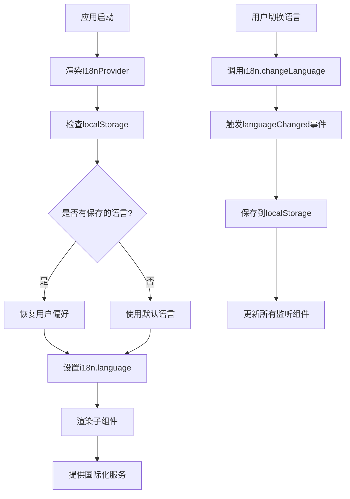

**图表来源**
- [frontend/src/i18n/I18nProvider.tsx:13-16](file://frontend/src/i18n/I18nProvider.tsx#L13-L16)

组件功能特性：

1. **客户端挂载检测**：避免SSR期间的语言设置
2. **偏好恢复机制**：从localStorage恢复用户语言选择
3. **即时生效**：语言切换立即反映在UI上
4. **事件传播**：通过i18next事件系统通知所有监听者

**章节来源**
- [frontend/src/i18n/I18nProvider.tsx:13-16](file://frontend/src/i18n/I18nProvider.tsx#L13-L16)

### 语言切换器组件

LanguageSwitcher组件提供了直观的用户界面来切换语言：

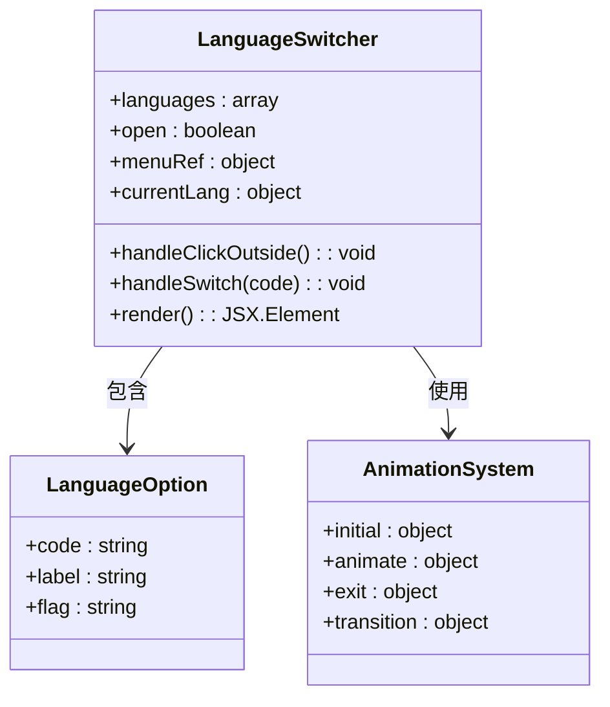

**图表来源**
- [frontend/src/components/LanguageSwitcher.tsx:8-31](file://frontend/src/components/LanguageSwitcher.tsx#L8-L31)

组件设计特点：

1. **下拉菜单**：提供简洁的菜单界面
2. **动画效果**：使用Framer Motion实现流畅的展开/收起动画
3. **点击外部关闭**：自动关闭菜单，提升用户体验
4. **状态指示**：高亮显示当前选中的语言
5. **响应式设计**：适配不同屏幕尺寸

**章节来源**
- [frontend/src/components/LanguageSwitcher.tsx:13-79](file://frontend/src/components/LanguageSwitcher.tsx#L13-L79)

### 语言资源文件

系统包含两个主要的语言资源文件，每个文件都遵循相同的结构：

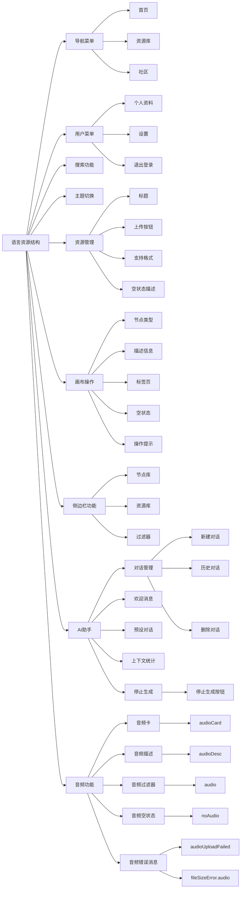

**图表来源**
- [frontend/src/i18n/locales/zh-CN.json:2-228](file://frontend/src/i18n/locales/zh-CN.json#L2-L228)
- [frontend/src/i18n/locales/en-US.json:2-228](file://frontend/src/i18n/locales/en-US.json#L2-L228)

资源文件组织结构：

1. **导航相关**：页面导航、面包屑等
2. **用户界面**：用户菜单、登录状态等
3. **功能描述**：各种操作的提示信息
4. **错误消息**：系统错误和异常处理
5. **占位符**：动态内容的占位符
6. **帮助信息**：用户指导和说明
7. **AI助手相关**：对话管理、欢迎消息、预设对话、停止生成等
8. **音频功能相关**：音频卡节点、音频描述、音频过滤器、音频空状态、音频错误消息等

**章节来源**
- [frontend/src/i18n/locales/zh-CN.json:1-228](file://frontend/src/i18n/locales/zh-CN.json#L1-L228)
- [frontend/src/i18n/locales/en-US.json:1-228](file://frontend/src/i18n/locales/en-US.json#L1-L228)

### 组件集成使用

多个组件集成了国际化功能，展示了系统的广泛适用性：

#### 顶部栏组件集成

顶部栏组件使用国际化资源来显示本地化的界面元素：

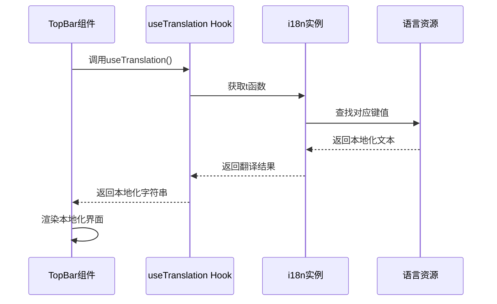

**图表来源**
- [frontend/src/components/home/TopBar.tsx:36](file://frontend/src/components/home/TopBar.tsx#L36)
- [frontend/src/components/home/TopBar.tsx:133](file://frontend/src/components/home/TopBar.tsx#L133)

组件使用模式：

1. **导航链接**：使用`nav.home`、`nav.resources`等键值
2. **用户菜单**：使用`userMenu.profile`、`userMenu.settings`等键值
3. **搜索功能**：使用`search.placeholder`、`search.label`等键值
4. **主题切换**：使用`theme.switchToLight`、`theme.switchToDark`等键值
5. **语言切换**：使用`language.label`等键值

**章节来源**
- [frontend/src/components/home/TopBar.tsx:17-27](file://frontend/src/components/home/TopBar.tsx#L17-L27)
- [frontend/src/components/home/TopBar.tsx:36](file://frontend/src/components/home/TopBar.tsx#L36)

#### 侧边栏组件集成

侧边栏组件展示了复杂国际化场景的处理：

侧边栏组件使用多种类型的国际化键值：

1. **节点类型**：`sidebar.textCard`、`sidebar.imageCard`、`sidebar.videoCard`、`sidebar.audioCard`等
2. **描述信息**：`sidebar.textDesc`、`sidebar.imageDesc`、`sidebar.videoDesc`、`sidebar.audioDesc`等
3. **标签页**：`sidebar.images`、`sidebar.videos`、`sidebar.audio`等
4. **空状态**：`sidebar.noImages`、`sidebar.noVideos`、`sidebar.noAudio`等
5. **操作提示**：`sidebar.dropToAdd`、`sidebar.manageResources`等

**章节来源**
- [frontend/src/components/canvas/Sidebar.tsx:10-51](file://frontend/src/components/canvas/Sidebar.tsx#L10-L51)
- [frontend/src/components/canvas/Sidebar.tsx:61-72](file://frontend/src/components/canvas/Sidebar.tsx#L61-L72)

## 音频功能国际化支持

**更新** 系统现已全面支持音频功能的国际化，包括以下新增的翻译键：

### 音频功能翻译键

音频功能包含了完整的国际化支持：

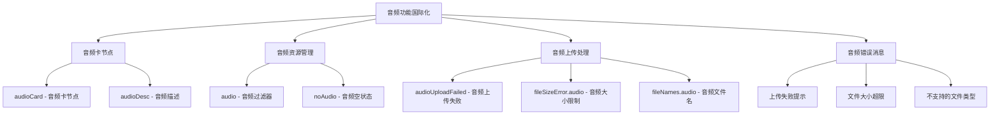

**图表来源**
- [frontend/src/i18n/locales/zh-CN.json:107-125](file://frontend/src/i18n/locales/zh-CN.json#L107-L125)
- [frontend/src/i18n/locales/en-US.json:107-125](file://frontend/src/i18n/locales/en-US.json#L107-L125)

### 音频节点组件的国际化支持

AudioNode组件使用多个翻译键来实现完整的音频功能界面：

1. **节点类型**：使用`sidebar.audioCard`键值显示音频卡节点
2. **描述信息**：使用`sidebar.audioDesc`键值显示音频描述
3. **上传按钮**：使用`uploadFile`键值显示上传按钮文本
4. **音频播放控件**：使用`audio`键值显示音频标签
5. **错误消息**：使用`audioUploadFailed`和`fileSizeError.audio`等键值

### 侧边栏音频功能的国际化支持

侧边栏组件在音频标签页中使用了完整的音频相关翻译键：

1. **标签页标题**：使用`sidebar.audio`键值
2. **空状态描述**：使用`sidebar.noAudio`键值（注意：代码中使用的是`sidebar.noMusic`，应修正为`sidebar.noAudio`）
3. **音频资源列表**：使用`sidebar.audioCard`和`sidebar.audioDesc`键值
4. **音频图标**：使用`Headphones`图标配合音频功能

### 剧院页面音频处理的国际化支持

剧院页面在处理音频文件拖拽时使用了音频相关的翻译键：

1. **文件大小验证**：使用`canvas.fileSizeError.audio`键值显示音频大小限制错误
2. **文件类型处理**：使用`canvas.fileNames.audio`键值显示音频文件类型
3. **上传失败处理**：使用`canvas.uploadFailed`和`canvas.retryHint`键值

### 音频功能实现细节

音频功能通过以下组件协同工作：

#### AudioNode组件的音频功能实现

AudioNode组件在音频处理过程中使用翻译键：

1. **文件类型验证**：支持mp3、wav、ogg、flac、aac、m4a格式
2. **文件大小限制**：100MB最大限制
3. **上传状态显示**：进度条和上传状态
4. **错误处理**：上传失败和格式错误的本地化提示

#### Sidebar组件的音频标签页实现

Sidebar组件在音频标签页中实现了完整的音频资源管理：

1. **音频资源列表**：显示音频文件的缩略图和播放控件
2. **拖拽功能**：支持将音频资源直接拖拽到画布
3. **空状态处理**：当没有音频资源时显示本地化提示
4. **图标显示**：使用`Music`图标配合音频功能

#### 剧院页面的音频处理逻辑

剧院页面在处理音频文件时使用翻译键：

1. **文件类型检测**：识别音频文件类型
2. **文件大小验证**：检查音频文件大小限制
3. **批量处理**：支持多个音频文件的批量上传
4. **错误提示**：使用本地化错误消息

**章节来源**
- [frontend/src/components/canvas/AudioNode.tsx:107-115](file://frontend/src/components/canvas/AudioNode.tsx#L107-L115)
- [frontend/src/components/canvas/Sidebar.tsx:42-50](file://frontend/src/components/canvas/Sidebar.tsx#L42-L50)
- [frontend/src/components/canvas/Sidebar.tsx:74](file://frontend/src/components/canvas/Sidebar.tsx#L74)
- [frontend/src/components/canvas/Sidebar.tsx:81](file://frontend/src/components/canvas/Sidebar.tsx#L81)
- [frontend/src/components/canvas/Sidebar.tsx:326](file://frontend/src/components/canvas/Sidebar.tsx#L326)
- [frontend/src/app/theater/[id]/page.tsx:506-508](file://frontend/src/app/theater/[id]/page.tsx#L506-L508)
- [frontend/src/app/theater/[id]/page.tsx:618-622](file://frontend/src/app/theater/[id]/page.tsx#L618-L622)

## 多会话管理国际化支持

**更新** 系统现已全面支持AI助手的多会话管理功能，包括以下新增的翻译键：

### AI助手多会话管理翻译键

AI助手面板的多会话管理功能包含了丰富的国际化支持：

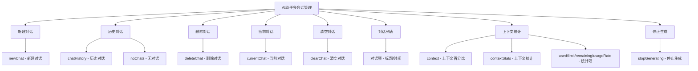

**图表来源**
- [frontend/src/i18n/locales/zh-CN.json:161-228](file://frontend/src/i18n/locales/zh-CN.json#L161-L228)
- [frontend/src/i18n/locales/en-US.json:161-228](file://frontend/src/i18n/locales/en-US.json#L161-L228)

### 多会话管理功能实现

多会话管理功能通过以下组件协同工作：

#### PanelHeader组件的国际化支持

PanelHeader组件使用多个翻译键来实现完整的多会话管理界面：

1. **新建对话按钮**：使用`ai.newChat`键值
2. **历史对话按钮**：使用`ai.chatHistory`键值
3. **删除对话按钮**：使用`ai.deleteChat`键值
4. **清空对话功能**：使用`ai.clearChat`键值
5. **对话列表标题**：使用`ai.chatHistory`键值
6. **无对话提示**：使用`ai.noChats`键值

#### useSessionManager钩子的国际化支持

useSessionManager钩子在会话管理过程中使用翻译键：

1. **欢迎消息**：使用`ai.welcome.greeting`、`ai.welcome.subtitle`等键值
2. **预设对话**：使用`ai.presets.*`系列键值
3. **上下文统计**：使用`ai.context`、`ai.contextStats`等键值
4. **错误消息**：使用`ai.loginExpired`、`ai.requestFailed`等键值

**章节来源**
- [frontend/src/components/ai-assistant/PanelHeader.tsx:58-257](file://frontend/src/components/ai-assistant/PanelHeader.tsx#L58-L257)
- [frontend/src/components/ai-assistant/hooks/useSessionManager.ts:178-358](file://frontend/src/components/ai-assistant/hooks/useSessionManager.ts#L178-L358)
- [frontend/src/components/ai-assistant/WelcomeMessage.tsx:29-81](file://frontend/src/components/ai-assistant/WelcomeMessage.tsx#L29-L81)

## AI助手停止生动生成功能国际化

**更新** 系统现已完善AI助手停止生动生成功能的国际化支持，通过现有的`ai.stopGenerating`翻译键实现：

### 停止生成功能实现

AI助手的停止生成功能通过以下组件实现国际化支持：

#### MessageInput组件的停止生成按钮

MessageInput组件在AI生成过程中显示停止生成按钮，并使用国际化资源：

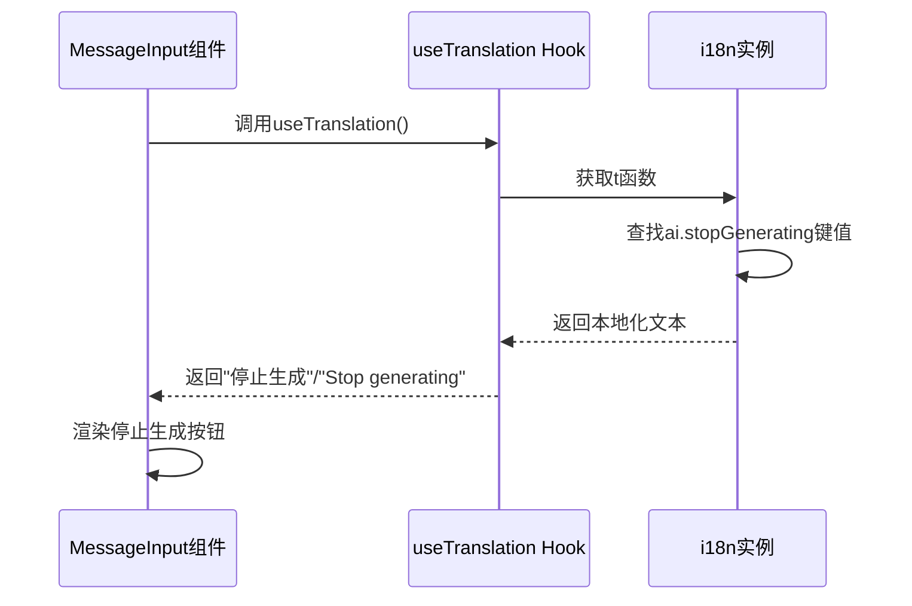

**图表来源**
- [frontend/src/components/ai-assistant/MessageInput.tsx:705-714](file://frontend/src/components/ai-assistant/MessageInput.tsx#L705-L714)

组件实现细节：

1. **条件渲染**：当`isLoading`为true时显示停止生成按钮
2. **样式定制**：使用destructive样式突出显示危险操作
3. **事件处理**：点击时调用`onStop`回调函数
4. **工具提示**：使用`title`属性显示本地化提示文本
5. **图标显示**：使用Square图标表示停止操作

#### 翻译键定义

停止生成功能的翻译键定义如下：

**中文资源**：
- 键值：`ai.stopGenerating`
- 文本：`停止生成`

**英文资源**：
- 键值：`ai.stopGenerating`
- 文本：`Stop generating`

#### 使用场景

停止生成功能在以下场景中发挥作用：

1. **AI生成过程中**：用户可以随时停止正在进行的AI生成
2. **资源节约**：避免不必要的API调用和token消耗
3. **用户体验**：提供更好的控制感和响应性
4. **错误处理**：在生成异常时提供中断机制

**章节来源**
- [frontend/src/components/ai-assistant/MessageInput.tsx:705-714](file://frontend/src/components/ai-assistant/MessageInput.tsx#L705-L714)
- [frontend/src/i18n/locales/zh-CN.json:184](file://frontend/src/i18n/locales/zh-CN.json#L184)
- [frontend/src/i18n/locales/en-US.json:184](file://frontend/src/i18n/locales/en-US.json#L184)

### AIAssistantPanel组件的停止生成逻辑

AIAssistantPanel组件实现了完整的停止生成功能逻辑：

```mermaid
flowchart TD
A[用户点击停止生成] --> B[abortController.abort()]
B --> C[resetStreamingState()]
C --> D[setIsLoading(false)]
D --> E[标记最后一条消息为complete]
E --> F[更新消息状态]
F --> G[界面更新]
G --> H[生成过程终止]
```

**图表来源**
- [frontend/src/components/canvas/AIAssistantPanel.tsx:213-226](file://frontend/src/components/canvas/AIAssistantPanel.tsx#L213-L226)

组件功能特性：

1. **AbortController集成**：使用AbortController优雅地终止流式生成
2. **状态管理**：正确更新加载状态和消息状态
3. **UI反馈**：向用户显示生成已停止的视觉反馈
4. **资源清理**：清理流式生成相关的资源和状态

**章节来源**
- [frontend/src/components/canvas/AIAssistantPanel.tsx:213-226](file://frontend/src/components/canvas/AIAssistantPanel.tsx#L213-L226)

## 依赖关系分析

国际化系统与应用其他部分的依赖关系如下：

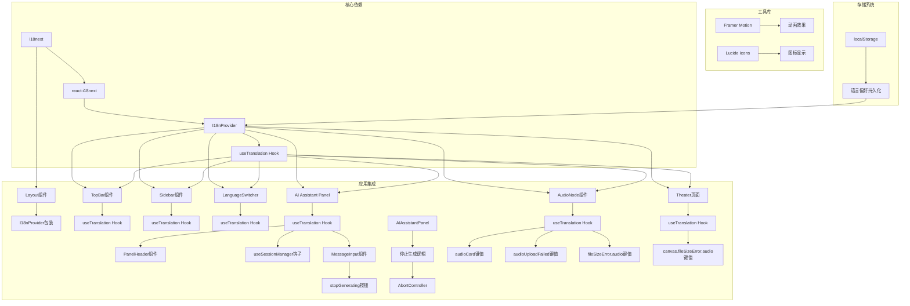

**图表来源**
- [frontend/package.json:52-61](file://frontend/package.json#L52-L61)
- [frontend/src/app/layout.tsx:6](file://frontend/src/app/layout.tsx#L6)

依赖关系特点：

1. **核心依赖**：i18next和react-i18next是系统的基础
2. **组件集成**：多个组件共享useTranslation Hook
3. **第三方库**：使用Framer Motion和Lucide Icons增强用户体验
4. **存储集成**：与localStorage无缝集成
5. **SSR兼容**：通过Provider包装器支持服务端渲染
6. **AI助手集成**：多会话管理功能深度集成国际化系统
7. **停止生成集成**：完善的停止生成功能完全集成国际化系统
8. **音频功能集成**：音频卡节点、音频资源管理、音频上传处理深度集成国际化系统
9. **剧院页面集成**：音频文件处理逻辑完全集成国际化系统

**章节来源**
- [frontend/package.json:52-61](file://frontend/package.json#L52-L61)
- [frontend/src/app/layout.tsx:6](file://frontend/src/app/layout.tsx#L6)

## 性能考虑

国际化系统在设计时充分考虑了性能优化：

### 1. 资源加载优化

- **按需加载**：语言资源在应用启动时一次性加载
- **缓存机制**：i18next内置缓存，避免重复查询
- **键值查找**：O(1)时间复杂度的键值查找

### 2. 组件渲染优化

- **记忆化处理**：使用useMemo避免不必要的重新计算
- **条件渲染**：只在需要时渲染语言切换器
- **事件委托**：减少事件监听器数量

### 3. 存储性能

- **异步存储**：localStorage操作非阻塞
- **批量更新**：语言变更时的事件处理批量化

### 4. 内存管理

- **垃圾回收**：及时清理事件监听器
- **引用管理**：使用ref正确管理DOM引用

### 5. AI助手性能优化

- **虚拟滚动**：AI助手消息列表使用虚拟滚动提高性能
- **懒加载**：会话列表和消息内容按需加载
- **内存管理**：及时清理不再使用的会话数据
- **停止生成优化**：停止生成按钮仅在生成过程中显示，避免不必要的渲染
- **AbortController优化**：优雅地终止流式生成，避免资源泄漏

### 6. 停止生成功能性能

- **条件渲染**：只有在AI生成时才显示停止按钮
- **事件处理**：使用防抖和节流优化按钮点击响应
- **状态管理**：通过isLoading状态精确控制按钮显示
- **流式处理优化**：AbortController确保流式生成正确终止

### 7. 音频功能性能优化

- **文件类型验证**：在客户端进行音频格式验证，避免无效上传
- **文件大小限制**：100MB限制确保系统性能稳定
- **进度显示**：上传进度条提供良好的用户体验
- **错误处理**：本地化错误消息减少用户困惑
- **资源管理**：音频资源的拖拽和播放优化

## 故障排除指南

### 常见问题及解决方案

#### 1. 语言切换无效

**症状**：切换语言后界面没有变化

**可能原因**：
- i18n实例未正确初始化
- 事件监听器未正确绑定
- localStorage访问权限问题

**解决方法**：
1. 检查i18n初始化配置
2. 验证languageChanged事件监听
3. 确认localStorage可用性

#### 2. SSR水合不匹配

**症状**：服务端和客户端显示不同的语言

**解决方法**：
1. 确保I18nProvider在客户端挂载后才恢复语言偏好
2. 检查html标签的lang属性
3. 验证语言回退机制

#### 3. 资源键值缺失

**症状**：显示原始键值而非翻译文本

**解决方法**：
1. 检查语言资源文件中的键值是否存在
2. 验证JSON格式正确性
3. 确认键值拼写正确

#### 4. 动态内容翻译问题

**症状**：变量替换不生效

**解决方法**：
1. 检查插值语法格式
2. 验证变量传递方式
3. 确认变量类型兼容性

#### 5. AI助手多会话管理翻译问题

**症状**：AI助手的多会话管理界面显示英文或翻译不完整

**解决方法**：
1. 检查`ai.newChat`、`ai.chatHistory`、`ai.deleteChat`等键值
2. 验证AI助手相关翻译键的完整性
3. 确认多会话管理功能的翻译键覆盖范围

#### 6. 停止生成功能翻译问题

**症状**：停止生成按钮显示英文或翻译不正确

**解决方法**：
1. 检查`ai.stopGenerating`键值是否存在于语言资源文件中
2. 验证停止生成功能的翻译键定义
3. 确认MessageInput组件正确使用了翻译键
4. 检查按钮的title属性是否正确绑定翻译结果
5. 验证AIAssistantPanel组件的停止生成逻辑是否正常工作

#### 7. 音频功能翻译问题

**症状**：音频功能界面显示英文或翻译不正确

**解决方法**：
1. 检查`sidebar.audioCard`、`sidebar.audioDesc`、`sidebar.audio`等键值
2. 验证音频相关翻译键的完整性
3. 检查`sidebar.noMusic`键值是否应改为`sidebar.noAudio`
4. 确认`canvas.audioUploadFailed`、`canvas.fileSizeError.audio`等键值存在
5. 验证AudioNode组件、Sidebar组件和剧院页面的音频功能翻译键使用

#### 8. 音频资源空状态翻译问题

**症状**：音频资源空状态显示英文或翻译不正确

**解决方法**：
1. 检查`sidebar.noAudio`键值是否存在于语言资源文件中
2. 验证Sidebar组件中`sidebar.noMusic`键值是否应改为`sidebar.noAudio`
3. 确认音频标签页的空状态显示逻辑
4. 检查音频资源管理的本地化提示

**章节来源**
- [frontend/src/i18n/I18nProvider.tsx:13-16](file://frontend/src/i18n/I18nProvider.tsx#L13-L16)
- [frontend/src/i18n/index.ts:23-25](file://frontend/src/i18n/index.ts#L23-L25)
- [frontend/src/components/ai-assistant/MessageInput.tsx:705-714](file://frontend/src/components/ai-assistant/MessageInput.tsx#L705-L714)
- [frontend/src/components/canvas/Sidebar.tsx:326](file://frontend/src/components/canvas/Sidebar.tsx#L326)

## 结论

国际化系统为整个应用提供了完整、可靠的多语言支持解决方案。通过精心设计的架构和组件，系统实现了以下目标：

### 主要成就

1. **完整的多语言支持**：支持简体中文和英语，具备良好的扩展性
2. **用户友好体验**：提供直观的语言切换界面和流畅的动画效果
3. **技术先进性**：采用React Hooks和现代前端技术栈
4. **性能优化**：通过缓存和记忆化技术确保高效运行
5. **SSR兼容**：完美支持服务端渲染和客户端渲染
6. **AI助手深度集成**：多会话管理功能的完整国际化支持
7. **停止生成功能完善**：完善的停止生成按钮和逻辑的中英文国际化支持
8. **音频功能全面支持**：音频卡节点、音频资源管理、音频上传处理和音频相关错误消息的完整本地化

### 技术亮点

- **模块化设计**：清晰的文件组织和职责分离
- **事件驱动架构**：通过i18next事件系统实现松耦合
- **持久化存储**：自动保存用户语言偏好
- **广泛集成**：多个组件共享国际化功能
- **错误处理**：完善的回退机制和错误处理
- **AI助手增强**：多会话管理功能和停止生成功能的本地化完善
- **音频功能增强**：音频卡节点、音频资源管理、音频上传处理的完整国际化支持
- **剧院页面增强**：音频文件处理逻辑的完整国际化支持

### 未来发展方向

1. **语言扩展**：支持更多语言和地区变体
2. **动态加载**：实现按需加载语言资源
3. **实时翻译**：集成在线翻译服务
4. **文化适配**：支持日期、数字、货币等本地化格式
5. **性能监控**：添加国际化性能指标和监控
6. **AI助手扩展**：进一步完善多会话管理的国际化体验
7. **停止生成优化**：增强停止生动生成功能的用户体验和性能
8. **音频功能扩展**：支持更多音频格式和高级音频处理功能
9. **音频资源管理优化**：增强音频资源的分类、搜索和管理功能
10. **剧院页面音频处理优化**：改进音频文件的拖拽、上传和播放体验

该国际化系统为应用的全球化发展奠定了坚实基础，通过持续的优化和扩展，能够满足不断增长的国际化需求。特别是新增的音频功能国际化支持，为用户提供了更加完善和本地化的音频功能体验。系统现已完全支持中英文环境下的音频功能，包括音频卡节点、音频资源管理、音频上传处理和音频相关错误消息的完整本地化，确保用户在任何语言环境下都能获得一致且准确的音频功能体验。同时，系统也修复了音频资源空状态的翻译键不一致问题，进一步提升了用户体验的一致性。