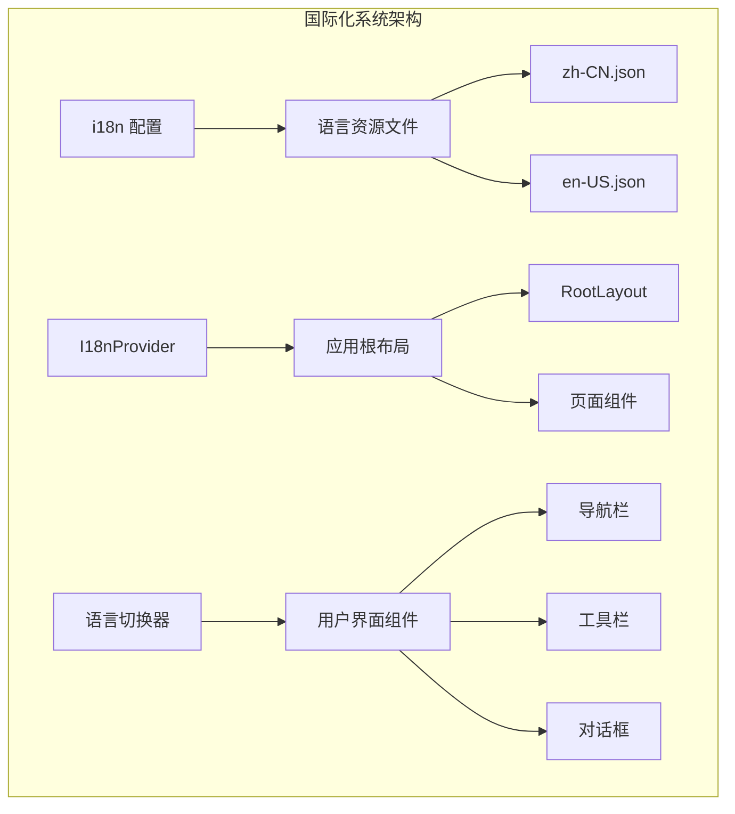
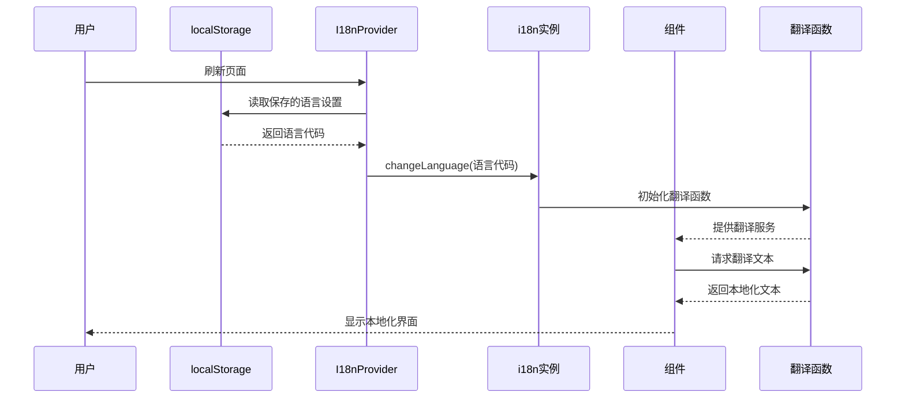
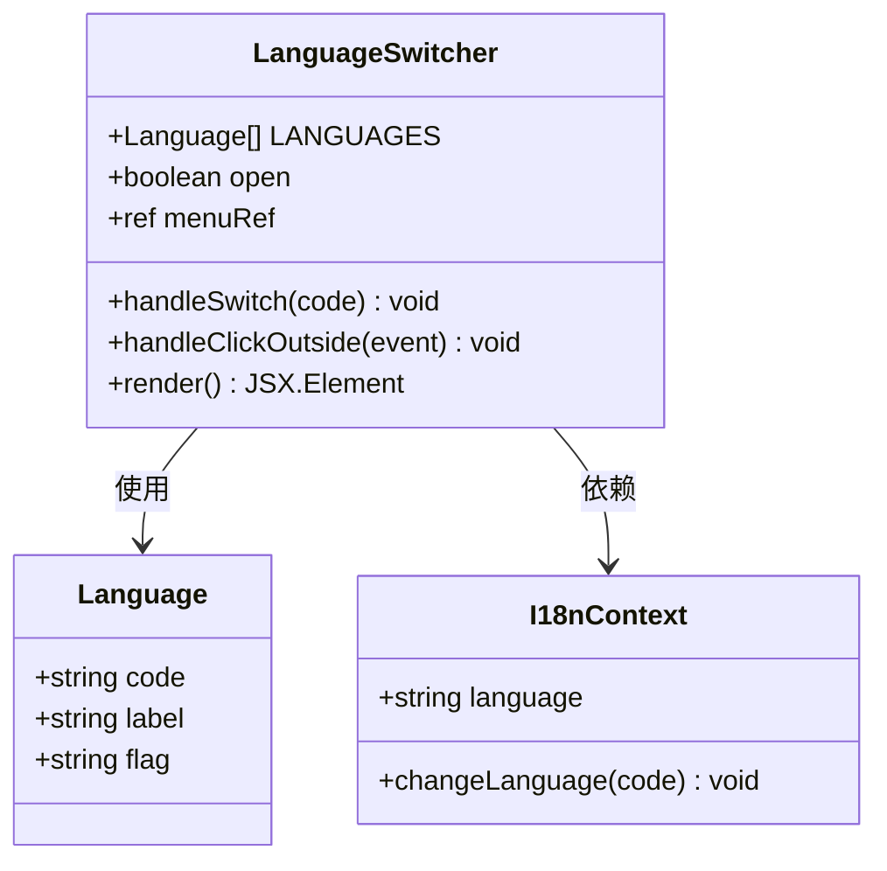
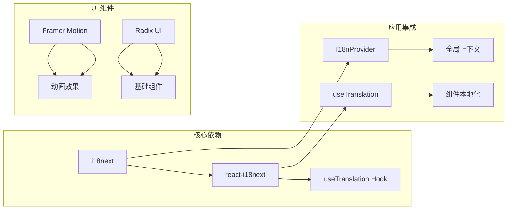

# 国际化系统扩展

<cite>
**本文档引用的文件**
- [frontend/src/i18n/index.ts](file://frontend/src/i18n/index.ts)
- [frontend/src/i18n/I18nProvider.tsx](file://frontend/src/i18n/I18nProvider.tsx)
- [frontend/src/i18n/locales/zh-CN.json](file://frontend/src/i18n/locales/zh-CN.json)
- [frontend/src/i18n/locales/en-US.json](file://frontend/src/i18n/locales/en-US.json)
- [frontend/src/components/LanguageSwitcher.tsx](file://frontend/src/components/LanguageSwitcher.tsx)
- [frontend/src/app/layout.tsx](file://frontend/src/app/layout.tsx)
- [frontend/src/components/home/TheaterCard.tsx](file://frontend/src/components/home/TheaterCard.tsx)
- [frontend/src/components/canvas/AIAssistantPanel.tsx](file://frontend/src/components/canvas/AIAssistantPanel.tsx)
- [frontend/src/app/theater/[id]/components/TopBar.tsx](file://frontend/src/app/theater/[id]/components/TopBar.tsx)
- [frontend/src/components/ai-assistant/WelcomeMessage.tsx](file://frontend/src/components/ai-assistant/WelcomeMessage.tsx)
- [frontend/package.json](file://frontend/package.json)
- [frontend/tsconfig.json](file://frontend/tsconfig.json)
</cite>

## 目录
1. [简介](#简介)
2. [项目结构](#项目结构)
3. [核心组件](#核心组件)
4. [架构概览](#架构概览)
5. [详细组件分析](#详细组件分析)
6. [依赖关系分析](#依赖关系分析)
7. [性能考虑](#性能考虑)
8. [故障排除指南](#故障排除指南)
9. [结论](#结论)

## 简介

本项目是一个基于 Next.js 的无限叙事剧院应用，实现了完整的国际化（i18n）系统扩展。系统支持中英文双语界面，采用 react-i18next 作为核心国际化框架，提供了从基础配置到高级功能的完整国际化解决方案。

国际化系统的核心目标是为用户提供本地化的用户体验，包括界面文本、日期格式、数字格式以及文化相关的交互方式。系统特别针对中文和英文用户的使用习惯进行了优化。

## 项目结构

国际化系统在项目中的组织结构如下：



**图表来源**
- [frontend/src/i18n/index.ts:1-28](file://frontend/src/i18n/index.ts#L1-L28)
- [frontend/src/i18n/I18nProvider.tsx:1-20](file://frontend/src/i18n/I18nProvider.tsx#L1-L20)

**章节来源**
- [frontend/src/i18n/index.ts:1-28](file://frontend/src/i18n/index.ts#L1-L28)
- [frontend/src/i18n/I18nProvider.tsx:1-20](file://frontend/src/i18n/I18nProvider.tsx#L1-L20)
- [frontend/src/app/layout.tsx:1-45](file://frontend/src/app/layout.tsx#L1-L45)

## 核心组件

### i18n 基础配置

国际化系统的基础配置位于 `frontend/src/i18n/index.ts`，该文件负责初始化 i18next 库并配置支持的语言环境。

**主要特性：**
- 支持中文（zh-CN）和英文（en-US）两种语言
- 默认语言设置为中文
- 语言变更时自动持久化到 localStorage
- 配置了适当的转义规则以防止 XSS 攻击

### I18nProvider 组件

`I18nProvider.tsx` 是国际化系统的提供者组件，负责在客户端环境中恢复用户的语言偏好设置。

**关键功能：**
- 从 localStorage 恢复用户语言偏好
- 避免 SSR 和 CSR 之间的水合不匹配问题
- 提供全局的国际化上下文给所有子组件

### 语言资源文件

系统包含两个主要的语言资源文件：

**中文资源文件 (`zh-CN.json`)**：
- 包含完整的中文界面文本
- 支持复杂的占位符替换
- 包含复数形式处理（如中文的量词使用）

**英文资源文件 (`en-US.json`)**：
- 提供对应的英文翻译
- 保持与中文资源相同的键结构
- 支持动态内容格式化

**章节来源**
- [frontend/src/i18n/index.ts:1-28](file://frontend/src/i18n/index.ts#L1-L28)
- [frontend/src/i18n/I18nProvider.tsx:1-20](file://frontend/src/i18n/I18nProvider.tsx#L1-L20)
- [frontend/src/i18n/locales/zh-CN.json:1-219](file://frontend/src/i18n/locales/zh-CN.json#L1-L219)
- [frontend/src/i18n/locales/en-US.json:1-219](file://frontend/src/i18n/locales/en-US.json#L1-L219)

## 架构概览

国际化系统的整体架构采用分层设计，确保了良好的可维护性和扩展性：



**图表来源**
- [frontend/src/i18n/I18nProvider.tsx:12-16](file://frontend/src/i18n/I18nProvider.tsx#L12-L16)
- [frontend/src/i18n/index.ts:22-25](file://frontend/src/i18n/index.ts#L22-L25)

**章节来源**
- [frontend/src/i18n/I18nProvider.tsx:1-20](file://frontend/src/i18n/I18nProvider.tsx#L1-L20)
- [frontend/src/i18n/index.ts:1-28](file://frontend/src/i18n/index.ts#L1-L28)

## 详细组件分析

### LanguageSwitcher 语言切换器

语言切换器是用户界面中最直观的国际化交互组件，位于 `frontend/src/components/LanguageSwitcher.tsx`。



**图表来源**
- [frontend/src/components/LanguageSwitcher.tsx:8-11](file://frontend/src/components/LanguageSwitcher.tsx#L8-L11)
- [frontend/src/components/LanguageSwitcher.tsx:13-31](file://frontend/src/components/LanguageSwitcher.tsx#L13-L31)

**组件特点：**
- 支持下拉菜单形式的语言选择
- 使用 Framer Motion 实现流畅的动画效果
- 自动检测和显示当前语言状态
- 支持点击外部区域关闭菜单

### 应用布局集成

国际化系统与应用布局的集成通过 `RootLayout` 组件实现，确保所有页面都能访问国际化功能。

**集成要点：**
- 在 HTML 标签上设置默认语言属性
- 将 I18nProvider 作为应用的顶层组件
- 保证国际化上下文在整个应用树中可用

### 组件级国际化使用

大多数业务组件都通过 `useTranslation` Hook 来使用国际化功能：

```mermaid
flowchart TD
A[组件初始化] --> B[调用 useTranslation]
B --> C[获取 t 函数]
C --> D[使用 t(key) 获取翻译]
D --> E[处理占位符参数]
E --> F[渲染本地化文本]
G[动态语言切换] --> H[监听语言变更事件]
H --> I[重新渲染组件]
I --> J[使用新语言文本]
```

**图表来源**
- [frontend/src/components/home/TheaterCard.tsx:76-121](file://frontend/src/components/home/TheaterCard.tsx#L76-L121)
- [frontend/src/app/theater/[id]/components/TopBar.tsx](file://frontend/src/app/theater/[id]/components/TopBar.tsx#L9-L13)

**章节来源**
- [frontend/src/components/LanguageSwitcher.tsx:1-79](file://frontend/src/components/LanguageSwitcher.tsx#L1-L79)
- [frontend/src/app/layout.tsx:24-44](file://frontend/src/app/layout.tsx#L24-L44)
- [frontend/src/components/home/TheaterCard.tsx:76-121](file://frontend/src/components/home/TheaterCard.tsx#L76-L121)
- [frontend/src/app/theater/[id]/components/TopBar.tsx](file://frontend/src/app/theater/[id]/components/TopBar.tsx#L8-L13)

## 依赖关系分析

国际化系统的核心依赖关系如下：



**图表来源**
- [frontend/package.json:52-61](file://frontend/package.json#L52-L61)
- [frontend/src/components/LanguageSwitcher.tsx:3-4](file://frontend/src/components/LanguageSwitcher.tsx#L3-L4)

**章节来源**
- [frontend/package.json:13-72](file://frontend/package.json#L13-L72)
- [frontend/tsconfig.json:1-35](file://frontend/tsconfig.json#L1-L35)

### 外部依赖

国际化系统主要依赖以下外部库：

- **i18next**: 核心国际化库，提供语言切换和翻译功能
- **react-i18next**: React 绑定库，提供 useTranslation Hook
- **framer-motion**: 动画库，用于语言切换器的过渡效果
- **@radix-ui/react-dropdown-menu**: 下拉菜单组件

## 性能考虑

国际化系统在性能方面的优化策略：

### 1. 懒加载策略
- 语言资源文件按需加载
- 组件级别的翻译函数缓存
- 避免不必要的重新渲染

### 2. 缓存机制
- localStorage 持久化语言偏好
- 内存中的翻译结果缓存
- 防抖处理语言切换操作

### 3. 渲染优化
- 使用 React.memo 优化组件渲染
- 条件渲染减少 DOM 元素
- 合理的动画性能控制

## 故障排除指南

### 常见问题及解决方案

**问题1：语言切换后页面不更新**
- 检查 I18nProvider 是否正确包裹应用
- 确认 localStorage 中的语言设置
- 验证 useTranslation Hook 的使用

**问题2：翻译文本显示为键名**
- 检查 JSON 文件的语法正确性
- 验证键名的一致性和完整性
- 确认文件编码格式

**问题3：占位符替换异常**
- 检查参数传递的正确性
- 验证占位符语法格式
- 确认数据类型的兼容性

**章节来源**
- [frontend/src/i18n/I18nProvider.tsx:12-16](file://frontend/src/i18n/I18nProvider.tsx#L12-L16)
- [frontend/src/i18n/index.ts:22-25](file://frontend/src/i18n/index.ts#L22-L25)

## 结论

本国际化的扩展系统成功实现了中英文双语支持，具有以下优势：

1. **完整的功能覆盖**：从基础的文本翻译到复杂的动态内容处理
2. **良好的用户体验**：流畅的动画效果和直观的交互设计
3. **可扩展的架构**：易于添加新的语言支持和翻译键值
4. **性能优化**：合理的缓存策略和渲染优化
5. **可靠的稳定性**：完善的错误处理和故障排除机制

系统为未来的国际化扩展奠定了坚实的基础，可以轻松支持更多语言和地区特定的功能需求。通过持续的优化和改进，该系统能够为全球用户提供优质的本地化体验。