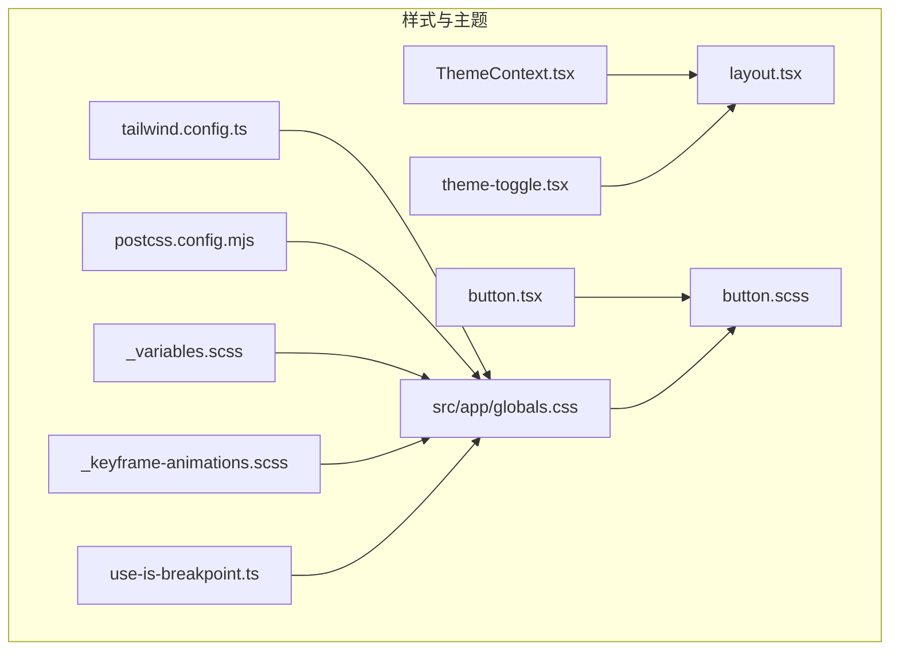
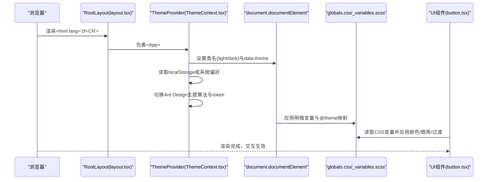
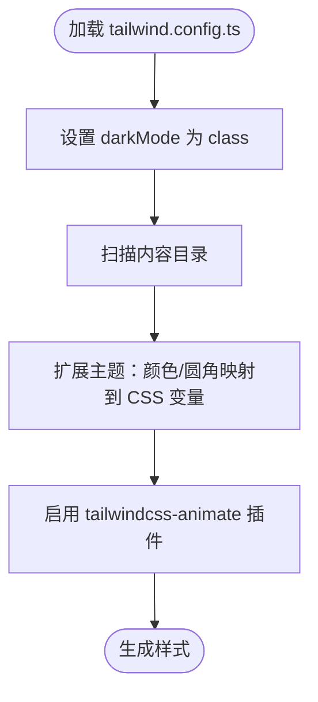
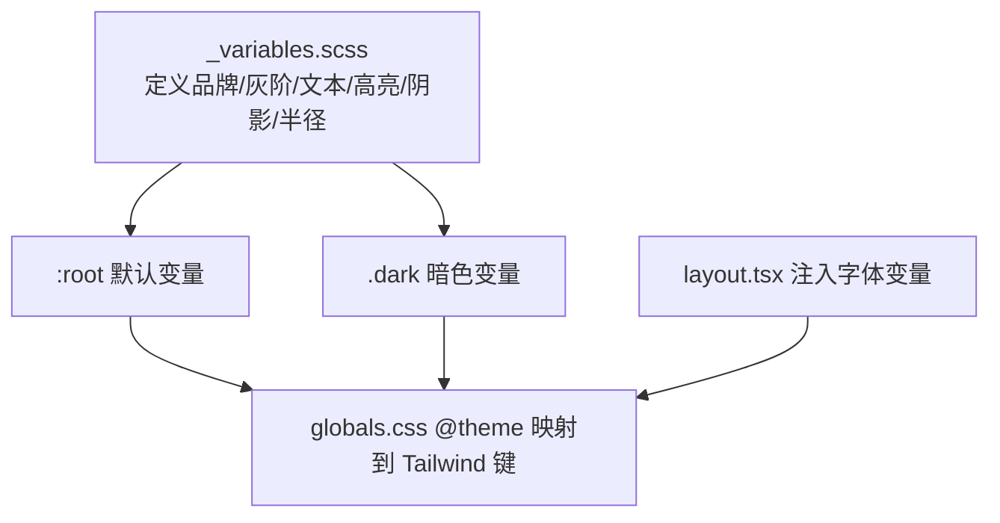
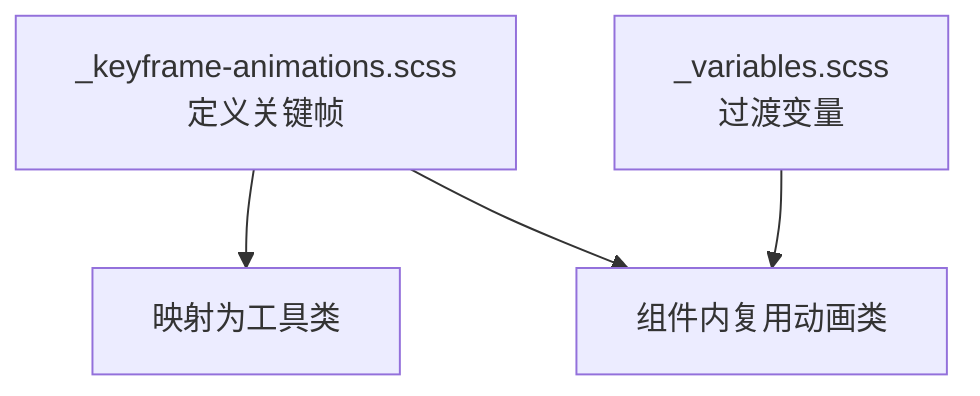
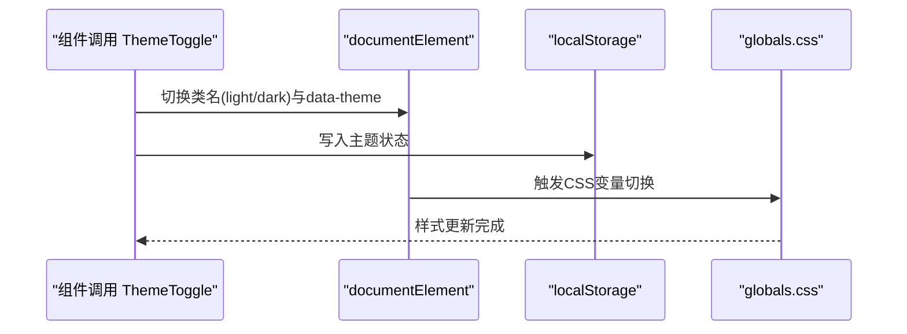
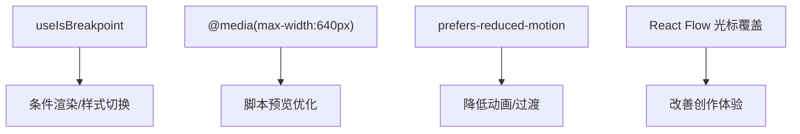
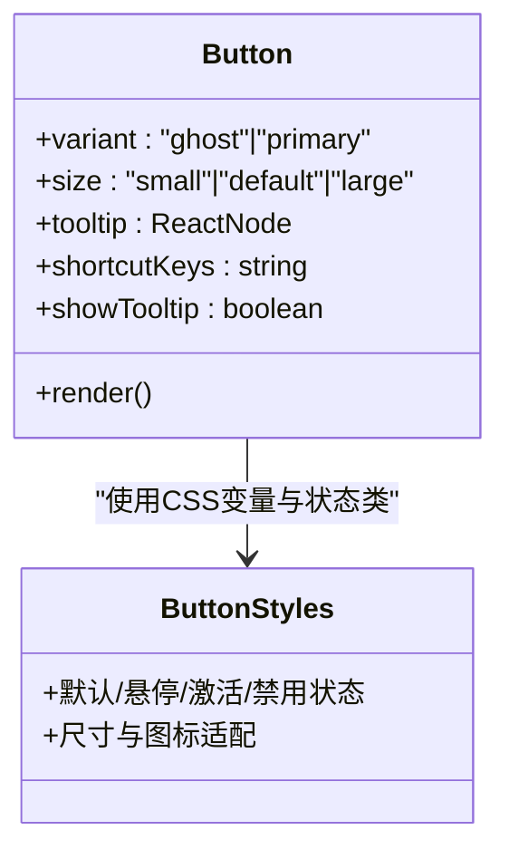
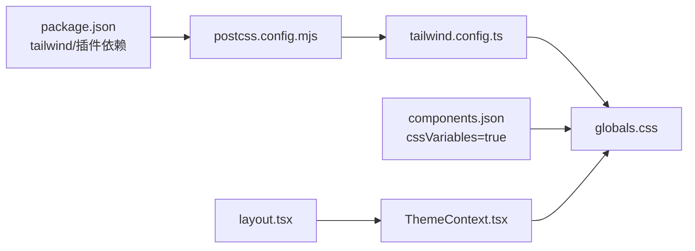

# 样式与主题系统

<cite>
**本文引用的文件**
- [tailwind.config.ts](file://frontend/tailwind.config.ts)
- [postcss.config.mjs](file://frontend/postcss.config.mjs)
- [_variables.scss](file://frontend/src/styles/_variables.scss)
- [_keyframe-animations.scss](file://frontend/src/styles/_keyframe-animations.scss)
- [components.json](file://frontend/components.json)
- [ThemeContext.tsx](file://frontend/src/context/ThemeContext.tsx)
- [layout.tsx](file://frontend/src/app/layout.tsx)
- [globals.css](file://frontend/src/app/globals.css)
- [theme-toggle.tsx](file://frontend/src/components/tiptap-templates/simple/theme-toggle.tsx)
- [button.tsx](file://frontend/src/components/tiptap-ui-primitive/button/button.tsx)
- [button.scss](file://frontend/src/components/tiptap-ui-primitive/button/button.scss)
- [use-is-breakpoint.ts](file://frontend/src/hooks/use-is-breakpoint.ts)
- [package.json](file://frontend/package.json)
- [next.config.ts](file://frontend/next.config.ts)
</cite>

## 目录
1. [简介](#简介)
2. [项目结构](#项目结构)
3. [核心组件](#核心组件)
4. [架构总览](#架构总览)
5. [详细组件分析](#详细组件分析)
6. [依赖关系分析](#依赖关系分析)
7. [性能考量](#性能考量)
8. [故障排查指南](#故障排查指南)
9. [结论](#结论)
10. [附录](#附录)

## 简介
本文件系统化梳理 Infinite Game 前端的样式与主题体系，涵盖 Tailwind CSS 配置与使用模式（自定义断点、颜色系统、字体配置）、主题切换机制（明暗主题、颜色变量管理、CSS 变量绑定）、响应式设计与移动端适配、跨浏览器兼容策略、动画与过渡系统、交互反馈设计，并总结样式组织原则、命名规范与性能优化技巧。同时提供主题定制与样式覆盖的实际示例路径，帮助开发者快速理解并扩展样式体系。

## 项目结构
前端样式相关的关键目录与文件如下：
- Tailwind 配置：tailwind.config.ts
- PostCSS 插件：postcss.config.mjs
- 全局样式入口：src/app/globals.css
- 主题变量与颜色系统：src/styles/_variables.scss
- 动画与关键帧：src/styles/_keyframe-animations.scss
- 主题上下文：src/context/ThemeContext.tsx
- 页面根布局：src/app/layout.tsx
- 组件主题切换按钮：src/components/tiptap-templates/simple/theme-toggle.tsx
- UI 原语按钮组件：src/components/tiptap-ui-primitive/button/button.tsx 与对应样式 button.scss
- 断点检测 Hook：src/hooks/use-is-breakpoint.ts
- 依赖与构建配置：package.json、next.config.ts

**图表来源**
- [tailwind.config.ts:1-64](file://frontend/tailwind.config.ts#L1-L64)
- [postcss.config.mjs:1-8](file://frontend/postcss.config.mjs#L1-L8)
- [globals.css:1-536](file://frontend/src/app/globals.css#L1-L536)
- [_variables.scss:1-297](file://frontend/src/styles/_variables.scss#L1-L297)
- [_keyframe-animations.scss:1-176](file://frontend/src/styles/_keyframe-animations.scss#L1-L176)
- [ThemeContext.tsx:1-75](file://frontend/src/context/ThemeContext.tsx#L1-L75)
- [layout.tsx:1-42](file://frontend/src/app/layout.tsx#L1-L42)
- [button.tsx:1-104](file://frontend/src/components/tiptap-ui-primitive/button/button.tsx#L1-L104)
- [button.scss:1-315](file://frontend/src/components/tiptap-ui-primitive/button/button.scss#L1-L315)
- [theme-toggle.tsx:1-50](file://frontend/src/components/tiptap-templates/simple/theme-toggle.tsx#L1-L50)
- [use-is-breakpoint.ts:1-38](file://frontend/src/hooks/use-is-breakpoint.ts#L1-L38)

**章节来源**
- [tailwind.config.ts:1-64](file://frontend/tailwind.config.ts#L1-L64)
- [postcss.config.mjs:1-8](file://frontend/postcss.config.mjs#L1-L8)
- [globals.css:1-536](file://frontend/src/app/globals.css#L1-L536)
- [_variables.scss:1-297](file://frontend/src/styles/_variables.scss#L1-L297)
- [_keyframe-animations.scss:1-176](file://frontend/src/styles/_keyframe-animations.scss#L1-L176)
- [ThemeContext.tsx:1-75](file://frontend/src/context/ThemeContext.tsx#L1-L75)
- [layout.tsx:1-42](file://frontend/src/app/layout.tsx#L1-L42)
- [button.tsx:1-104](file://frontend/src/components/tiptap-ui-primitive/button/button.tsx#L1-L104)
- [button.scss:1-315](file://frontend/src/components/tiptap-ui-primitive/button/button.scss#L1-L315)
- [theme-toggle.tsx:1-50](file://frontend/src/components/tiptap-templates/simple/theme-toggle.tsx#L1-L50)
- [use-is-breakpoint.ts:1-38](file://frontend/src/hooks/use-is-breakpoint.ts#L1-L38)
- [package.json:1-94](file://frontend/package.json#L1-L94)
- [next.config.ts:1-21](file://frontend/next.config.ts#L1-L21)

## 核心组件
- Tailwind 颜色与圆角映射：通过 CSS 变量将 Tailwind 主题值绑定到全局变量，实现明暗主题与 Ant Design 的统一。
- 全局变量与颜色系统：集中定义品牌色、灰阶、文本色、高亮色、阴影与半径等，支持明暗两套方案。
- 动画与过渡：内置关键帧与工具类，覆盖淡入淡出、缩放、滑动、脉冲、打字机等场景。
- 主题上下文：提供明暗主题切换、本地存储持久化、系统偏好检测与 Ant Design 主题算法切换。
- 页面根布局：在 html 上挂载字体变量与主题类名，确保全局样式生效。
- UI 原语按钮：基于 CSS 变量的颜色状态管理，支持尺寸、强调态、下拉箭头等变体。
- 断点检测 Hook：提供最小/最大断点判断，便于条件渲染与样式切换。
- 构建与插件：PostCSS 集成 Tailwind v4，Tailwind 动画插件启用，Ant Design 注册器保证 SSR 安全。

**章节来源**
- [tailwind.config.ts:10-61](file://frontend/tailwind.config.ts#L10-L61)
- [_variables.scss:1-297](file://frontend/src/styles/_variables.scss#L1-L297)
- [_keyframe-animations.scss:1-176](file://frontend/src/styles/_keyframe-animations.scss#L1-L176)
- [ThemeContext.tsx:16-65](file://frontend/src/context/ThemeContext.tsx#L16-L65)
- [layout.tsx:23-41](file://frontend/src/app/layout.tsx#L23-L41)
- [button.tsx:46-99](file://frontend/src/components/tiptap-ui-primitive/button/button.tsx#L46-L99)
- [button.scss:191-314](file://frontend/src/components/tiptap-ui-primitive/button/button.scss#L191-L314)
- [use-is-breakpoint.ts:13-37](file://frontend/src/hooks/use-is-breakpoint.ts#L13-L37)
- [postcss.config.mjs:1-8](file://frontend/postcss.config.mjs#L1-L8)
- [package.json:73-89](file://frontend/package.json#L73-L89)

## 架构总览
样式与主题系统的运行时控制流如下：

**图表来源**
- [layout.tsx:23-41](file://frontend/src/app/layout.tsx#L23-L41)
- [ThemeContext.tsx:16-65](file://frontend/src/context/ThemeContext.tsx#L16-L65)
- [globals.css:1-247](file://frontend/src/app/globals.css#L1-L247)
- [_variables.scss:174-206](file://frontend/src/styles/_variables.scss#L174-L206)
- [button.tsx:46-99](file://frontend/src/components/tiptap-ui-primitive/button/button.tsx#L46-L99)

## 详细组件分析

### Tailwind 配置与使用模式
- 明暗模式：采用 class 模式，通过在 html 上添加 light/dark 类实现切换。
- 内容扫描：扫描 pages/components/app 下的 TS/JS/TSX/JSX/MDX 文件，确保按需生成样式。
- 主题扩展：
  - 颜色系统：将 Tailwind 主题键映射到 CSS 变量，如 background、foreground、primary、secondary、card、popover、muted、accent、destructive、border、input、ring、chart 等。
  - 圆角系统：将 borderRadius 映射到 --radius 及其派生值 lg/md/sm。
- 插件：启用 tailwindcss-animate，配合动画关键帧与工具类使用。

**图表来源**
- [tailwind.config.ts:3-61](file://frontend/tailwind.config.ts#L3-L61)

**章节来源**
- [tailwind.config.ts:3-61](file://frontend/tailwind.config.ts#L3-L61)

### 全局变量与颜色系统
- 品牌色与灰阶：定义多级透明度与纯色变量，分别提供明/暗两套方案。
- 文本色与高亮色：提供多色彩系的文本与高亮色变量，支持明/暗两套对比。
- 阴影与半径：统一阴影与圆角变量，便于全局一致性。
- 全局颜色绑定：在 :root 与 .dark 中分别定义背景、边框、滚动条、卡片等颜色变量。
- 字体变量：通过 next/font-google 注入 Geist Sans/Mono 变量，供 CSS 使用。

**图表来源**
- [_variables.scss:1-297](file://frontend/src/styles/_variables.scss#L1-L297)
- [globals.css:216-247](file://frontend/src/app/globals.css#L216-L247)
- [layout.tsx:8-16](file://frontend/src/app/layout.tsx#L8-L16)

**章节来源**
- [_variables.scss:1-297](file://frontend/src/styles/_variables.scss#L1-L297)
- [globals.css:1-247](file://frontend/src/app/globals.css#L1-L247)
- [layout.tsx:8-16](file://frontend/src/app/layout.tsx#L8-L16)

### 动画系统与过渡效果
- 关键帧：提供 fadeIn/fadeOut/zoomIn/zoomOut/slideFromTop/Right/Left/Bottom/spin/bounce/cursorBlink/thinkingWave/pulseGlow/typewriterCursor 等。
- 工具类：将关键帧映射为可复用的动画类，如 animate-bounce-dots/animate-cursor-blink/animate-thinking-wave/animate-slide-in-right/animate-pulse-glow。
- 过渡变量：统一过渡时长与缓动曲线，用于全局与组件过渡。

**图表来源**
- [_keyframe-animations.scss:1-176](file://frontend/src/styles/_keyframe-animations.scss#L1-L176)
- [_variables.scss:147-154](file://frontend/src/styles/_variables.scss#L147-L154)

**章节来源**
- [_keyframe-animations.scss:1-176](file://frontend/src/styles/_keyframe-animations.scss#L1-L176)
- [_variables.scss:147-154](file://frontend/src/styles/_variables.scss#L147-L154)

### 主题切换机制
- 初始状态：优先读取 localStorage，其次匹配系统偏好，最后回退到默认暗色。
- DOM 同步：在 html 上添加 light/dark 类并设置 data-theme 属性，同时写入 localStorage。
- Ant Design 集成：根据当前主题选择算法与 token，确保 UI 组件风格一致。
- 组件级切换：提供独立的 ThemeToggle 组件，监听系统配色变化并更新类名与属性。

**图表来源**
- [ThemeContext.tsx:16-65](file://frontend/src/context/ThemeContext.tsx#L16-L65)
- [theme-toggle.tsx:11-49](file://frontend/src/components/tiptap-templates/simple/theme-toggle.tsx#L11-L49)
- [globals.css:64-138](file://frontend/src/app/globals.css#L64-L138)

**章节来源**
- [ThemeContext.tsx:16-65](file://frontend/src/context/ThemeContext.tsx#L16-L65)
- [theme-toggle.tsx:11-49](file://frontend/src/components/tiptap-templates/simple/theme-toggle.tsx#L11-L49)
- [globals.css:64-138](file://frontend/src/app/globals.css#L64-L138)

### 响应式设计与移动端适配
- 断点 Hook：useIsBreakpoint 提供最小/最大断点判断，便于条件渲染与样式切换。
- 全局媒体查询：在脚本编辑器预览区域针对小屏设备调整字号与行高，提升可读性。
- 减少动态效果：当用户偏好减少运动时，自动降低动画与过渡时长，保障可用性。
- React Flow 光标：自定义画布光标样式，覆盖默认样式以满足创作体验。

**图表来源**
- [use-is-breakpoint.ts:13-37](file://frontend/src/hooks/use-is-breakpoint.ts#L13-L37)
- [globals.css:471-502](file://frontend/src/app/globals.css#L471-L502)
- [globals.css:504-536](file://frontend/src/app/globals.css#L504-L536)

**章节来源**
- [use-is-breakpoint.ts:13-37](file://frontend/src/hooks/use-is-breakpoint.ts#L13-L37)
- [globals.css:471-502](file://frontend/src/app/globals.css#L471-L502)
- [globals.css:504-536](file://frontend/src/app/globals.css#L504-L536)

### 交互反馈与 UI 原语
- 按钮组件：支持 ghost/primary、small/default/large 尺寸、强调态与下拉箭头等变体；通过 CSS 变量管理默认/悬停/激活/禁用状态的颜色与图标色。
- Tooltip 与快捷键：按钮可带 Tooltip 与快捷键显示，增强可发现性。
- 样式组织：按钮样式拆分为基础样式与颜色状态样式，便于维护与扩展。

**图表来源**
- [button.tsx:18-27](file://frontend/src/components/tiptap-ui-primitive/button/button.tsx#L18-L27)
- [button.tsx:46-99](file://frontend/src/components/tiptap-ui-primitive/button/button.tsx#L46-L99)
- [button.scss:191-314](file://frontend/src/components/tiptap-ui-primitive/button/button.scss#L191-L314)

**章节来源**
- [button.tsx:18-27](file://frontend/src/components/tiptap-ui-primitive/button/button.tsx#L18-L27)
- [button.tsx:46-99](file://frontend/src/components/tiptap-ui-primitive/button/button.tsx#L46-L99)
- [button.scss:191-314](file://frontend/src/components/tiptap-ui-primitive/button/button.scss#L191-L314)

### 跨浏览器兼容性
- PostCSS 集成 Tailwind v4 插件，确保在不同浏览器中正确解析与生成样式。
- 全局滚动条样式：提供 WebKit 与 Firefox 的滚动条定制，提升一致性。
- 字体变量：通过 next/font-google 注入字体变量，避免 FOIT/FOUT 并保证跨浏览器渲染稳定。

**章节来源**
- [postcss.config.mjs:1-8](file://frontend/postcss.config.mjs#L1-L8)
- [globals.css:277-302](file://frontend/src/app/globals.css#L277-L302)
- [layout.tsx:8-16](file://frontend/src/app/layout.tsx#L8-L16)

### 样式组织原则与命名规范
- 变量命名：采用语义化前缀（如 --tt-）区分主题变量与组件变量，颜色变量按功能域分组。
- 组件样式：原语组件样式与颜色状态分离，通过 data-* 属性驱动状态切换。
- Tailwind 扩展：通过 CSS 变量桥接 Tailwind 与自定义变量，保持原子类与主题变量的一致性。
- 动画类：关键帧与工具类一一对应，便于复用与维护。

**章节来源**
- [_variables.scss:1-297](file://frontend/src/styles/_variables.scss#L1-L297)
- [button.scss:191-314](file://frontend/src/components/tiptap-ui-primitive/button/button.scss#L191-L314)
- [tailwind.config.ts:10-61](file://frontend/tailwind.config.ts#L10-L61)

### 性能优化技巧
- 按需生成：Tailwind 内容扫描仅在指定目录中查找，减少未使用样式的生成。
- CSS 变量：集中管理颜色与过渡，避免重复定义与样式膨胀。
- 动画降级：尊重用户“减少动态效果”偏好，自动缩短动画时长。
- 构建优化：Next.js 实验性配置提升服务端动作与代理客户端体限制，间接优化资源传输效率。

**章节来源**
- [tailwind.config.ts:5-9](file://frontend/tailwind.config.ts#L5-L9)
- [globals.css:496-502](file://frontend/src/app/globals.css#L496-L502)
- [next.config.ts:3-18](file://frontend/next.config.ts#L3-L18)

### 主题定制与样式覆盖示例
- 自定义颜色：在 globals.css 中新增或覆盖 --background/--foreground/--primary 等变量，即可影响 Tailwind 映射与组件外观。
- 新增动画：在 _keyframe-animations.scss 中定义关键帧，并映射为工具类，供组件直接使用。
- 覆盖按钮状态：在 button.scss 中扩展默认/悬停/激活/禁用状态的变量，无需修改组件代码。
- 主题开关：通过 ThemeContext 或 ThemeToggle 控制 html 类名与 data-theme，实现全局主题切换。

**章节来源**
- [globals.css:1-247](file://frontend/src/app/globals.css#L1-L247)
- [_keyframe-animations.scss:1-176](file://frontend/src/styles/_keyframe-animations.scss#L1-L176)
- [button.scss:191-314](file://frontend/src/components/tiptap-ui-primitive/button/button.scss#L191-L314)
- [ThemeContext.tsx:16-65](file://frontend/src/context/ThemeContext.tsx#L16-L65)
- [theme-toggle.tsx:11-49](file://frontend/src/components/tiptap-templates/simple/theme-toggle.tsx#L11-L49)

## 依赖关系分析
- 构建链路：package.json 中 tailwind 依赖与 @tailwindcss/postcss 插件共同作用，postcss.config.mjs 将插件注入构建流程。
- 样式链路：components.json 指定 tailwind 配置与 CSS 变量开关，确保 shadcn/ui 与自定义变量协同工作。
- 主题链路：ThemeContext 与 layout.tsx 协同，将主题状态传递至 Ant Design 与全局 CSS 变量。

**图表来源**
- [package.json:73-89](file://frontend/package.json#L73-L89)
- [postcss.config.mjs:1-8](file://frontend/postcss.config.mjs#L1-L8)
- [tailwind.config.ts:1-64](file://frontend/tailwind.config.ts#L1-L64)
- [components.json:6-12](file://frontend/components.json#L6-L12)
- [layout.tsx:23-41](file://frontend/src/app/layout.tsx#L23-L41)
- [ThemeContext.tsx:16-65](file://frontend/src/context/ThemeContext.tsx#L16-L65)

**章节来源**
- [package.json:73-89](file://frontend/package.json#L73-L89)
- [postcss.config.mjs:1-8](file://frontend/postcss.config.mjs#L1-L8)
- [components.json:6-12](file://frontend/components.json#L6-L12)
- [layout.tsx:23-41](file://frontend/src/app/layout.tsx#L23-L41)
- [ThemeContext.tsx:16-65](file://frontend/src/context/ThemeContext.tsx#L16-L65)

## 性能考量
- 样式体积控制：通过内容扫描与 CSS 变量集中管理，避免无用样式与重复定义。
- 动画与过渡：提供统一的过渡变量，减少复杂动画对低端设备的影响。
- 用户偏好：尊重“减少动态效果”偏好，自动降低动画时长，提升可访问性与性能。
- 构建参数：合理配置 Next.js 实验性参数，平衡功能与性能。

[本节为通用指导，不直接分析具体文件]

## 故障排查指南
- 主题不生效
  - 检查 html 是否存在 light/dark 类与 data-theme 属性。
  - 确认 ThemeContext 初始化逻辑与 localStorage 读取是否正常。
  - 参考：[ThemeContext.tsx:16-65](file://frontend/src/context/ThemeContext.tsx#L16-L65)
- Tailwind 变量未生效
  - 确认 globals.css 中 @theme 块是否正确映射变量。
  - 检查 tailwind.config.ts 中颜色/圆角扩展是否指向 CSS 变量。
  - 参考：[globals.css:216-247](file://frontend/src/app/globals.css#L216-L247)、[tailwind.config.ts:10-61](file://frontend/tailwind.config.ts#L10-L61)
- 动画无效
  - 检查关键帧与工具类是否在 _keyframe-animations.scss 中定义并被引入。
  - 参考：[_keyframe-animations.scss:1-176](file://frontend/src/styles/_keyframe-animations.scss#L1-L176)
- 滚动条样式异常
  - 确认 WebKit 与 Firefox 规则是否正确引入。
  - 参考：[globals.css:277-302](file://frontend/src/app/globals.css#L277-L302)
- 移动端排版问题
  - 检查媒体查询与字体大小调整是否生效。
  - 参考：[globals.css:471-493](file://frontend/src/app/globals.css#L471-L493)

**章节来源**
- [ThemeContext.tsx:16-65](file://frontend/src/context/ThemeContext.tsx#L16-L65)
- [globals.css:216-247](file://frontend/src/app/globals.css#L216-L247)
- [tailwind.config.ts:10-61](file://frontend/tailwind.config.ts#L10-L61)
- [_keyframe-animations.scss:1-176](file://frontend/src/styles/_keyframe-animations.scss#L1-L176)
- [globals.css:277-302](file://frontend/src/app/globals.css#L277-L302)
- [globals.css:471-493](file://frontend/src/app/globals.css#L471-L493)

## 结论
Infinite Game 的样式与主题系统以 CSS 变量为核心，结合 Tailwind v4 与 Ant Design，实现了从全局颜色、字体、动画到组件状态的统一管理。通过明暗主题切换、断点检测与跨浏览器兼容策略，系统在视觉一致性与可用性方面表现良好。建议在后续迭代中持续优化动画性能、完善无障碍支持，并通过组件化与变量化的最佳实践进一步提升可维护性。

[本节为总结性内容，不直接分析具体文件]

## 附录
- 组件别名与 Tailwind 配置：components.json 指定样式风格、Tailwind 配置路径与 CSS 变量开关，确保 UI 组件与自定义变量协同工作。
- 字体与国际化：layout.tsx 引入 Geist 字体变量与 Ant Design 本地化，保障中文字体与组件语言一致性。

**章节来源**
- [components.json:6-12](file://frontend/components.json#L6-L12)
- [layout.tsx:8-16](file://frontend/src/app/layout.tsx#L8-L16)