# AI助手状态管理增强

<cite>
**本文档引用的文件**
- [main.py](file://backend/main.py)
- [useSessionManager.ts](file://frontend/src/components/ai-assistant/hooks/useSessionManager.ts)
- [useAIAssistantStore.ts](file://frontend/src/store/useAIAssistantStore.ts)
- [AIAssistantPanel.tsx](file://frontend/src/components/canvas/AIAssistantPanel.tsx)
- [useSSEHandler.ts](file://frontend/src/components/ai-assistant/hooks/useSSEHandler.ts)
- [usePerformanceMonitor.ts](file://frontend/src/components/ai-assistant/hooks/usePerformanceMonitor.ts)
- [chats.py](file://backend/routers/chats.py)
- [chat_multi_agent.py](file://backend/services/chat_multi_agent.py)
- [chat_generation.py](file://backend/services/chat_generation.py)
- [models.py](file://backend/models.py)
- [api.ts](file://frontend/src/lib/api.ts)
</cite>

## 更新摘要
**变更内容**
- 新增 ChatSessionInfo 接口定义和会话列表管理功能
- 扩展 useAIAssistantStore.ts 状态管理，新增 theaterChatList 和 isLoadingChatList 状态
- 完善 useSessionManager.ts 钩子，实现会话列表的加载、切换、删除等操作
- 增强 AIAssistantPanel.tsx 的会话管理界面集成

## 目录
1. [项目概述](#项目概述)
2. [架构概览](#架构概览)
3. [核心组件分析](#核心组件分析)
4. [状态管理机制](#状态管理机制)
5. [会话管理流程](#会话管理流程)
6. [会话列表管理](#会话列表管理)
7. [SSE事件处理](#sse事件处理)
8. [性能监控体系](#性能监控体系)
9. [数据库模型设计](#数据库模型设计)
10. [错误处理与优化](#错误处理与优化)
11. [总结](#总结)

## 项目概述

本项目是一个基于React和FastAPI构建的AI助手状态管理系统，专注于增强AI助手在多智能体协作场景下的状态管理能力。系统通过前后端分离的架构设计，实现了完整的会话管理、状态持久化、实时通信和性能监控功能。

项目采用现代化的技术栈：
- **前端**：Next.js + React + TypeScript + Zustand状态管理
- **后端**：FastAPI + Python + SQLAlchemy异步ORM
- **实时通信**：Server-Sent Events (SSE) + WebSocket
- **状态持久化**：localStorage + 数据库存储

## 架构概览

```mermaid
graph TB
subgraph "前端层"
UI[AI助手界面]
Store[Zustand状态管理]
Hooks[自定义Hook]
API[API客户端]
end
subgraph "后端层"
FastAPI[FastAPI应用]
Routers[路由处理器]
Services[业务服务层]
DB[(数据库)]
end
subgraph "实时通信"
SSE[SSE流]
WS[WebSocket]
Auth[认证中间件]
end
UI --> Store
Store --> Hooks
Hooks --> API
API --> FastAPI
FastAPI --> Routers
Routers --> Services
Services --> DB
FastAPI <- --> SSE
FastAPI <- --> WS
FastAPI --> Auth
```

**图表来源**
- [main.py:110-180](file://backend/main.py#L110-L180)
- [AIAssistantPanel.tsx:51-633](file://frontend/src/components/canvas/AIAssistantPanel.tsx#L51-L633)

## 核心组件分析

### 前端状态管理核心

系统采用Zustand作为状态管理解决方案，提供了类型安全的状态管理和持久化功能。

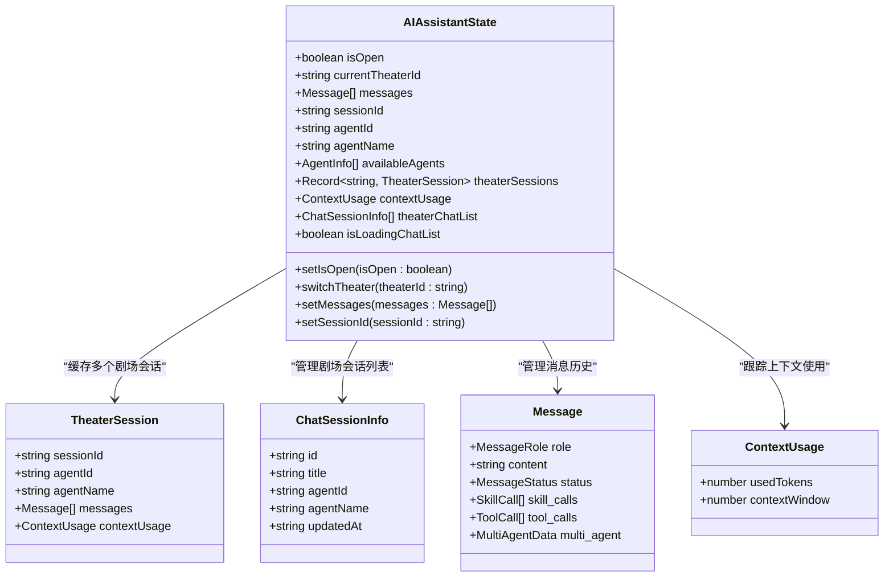

**图表来源**
- [useAIAssistantStore.ts:123-448](file://frontend/src/store/useAIAssistantStore.ts#L123-L448)

### 会话管理机制

会话管理是整个系统的核心功能，负责维护用户与AI助手的交互状态。

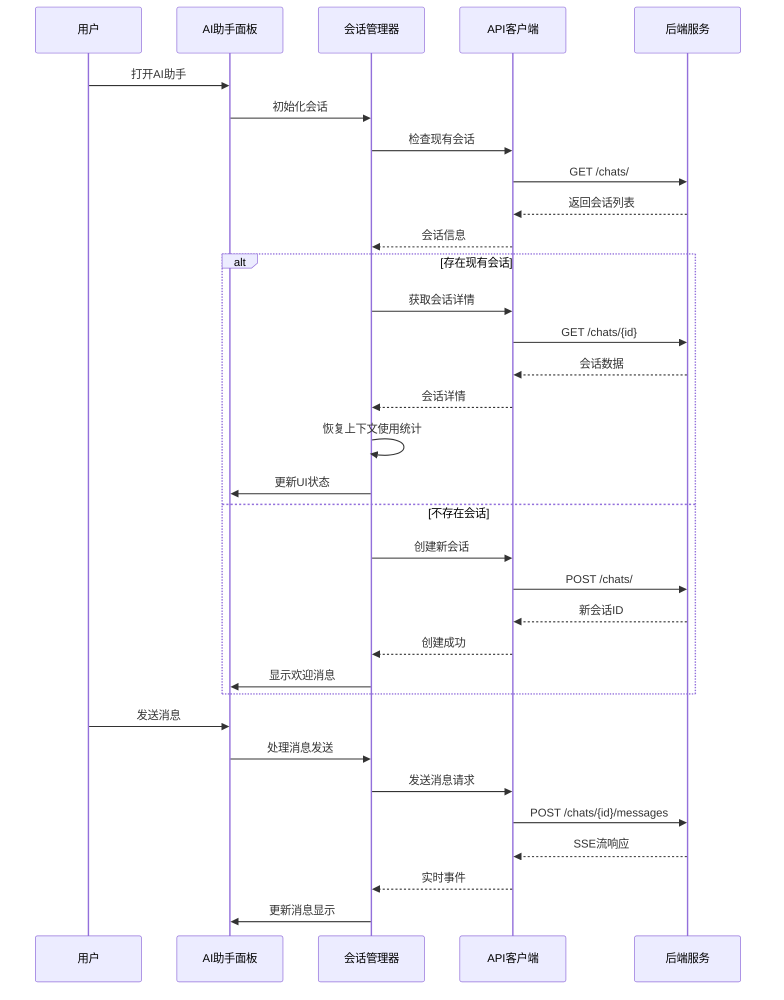

**图表来源**
- [useSessionManager.ts:52-123](file://frontend/src/components/ai-assistant/hooks/useSessionManager.ts#L52-L123)
- [AIAssistantPanel.tsx:209-317](file://frontend/src/components/canvas/AIAssistantPanel.tsx#L209-L317)

**章节来源**
- [useSessionManager.ts:12-226](file://frontend/src/components/ai-assistant/hooks/useSessionManager.ts#L12-L226)
- [useAIAssistantStore.ts:247-448](file://frontend/src/store/useAIAssistantStore.ts#L247-L448)

## 状态管理机制

### 多剧场会话缓存

系统支持在同一浏览器中管理多个剧场的AI助手会话，每个剧场都有独立的状态缓存。

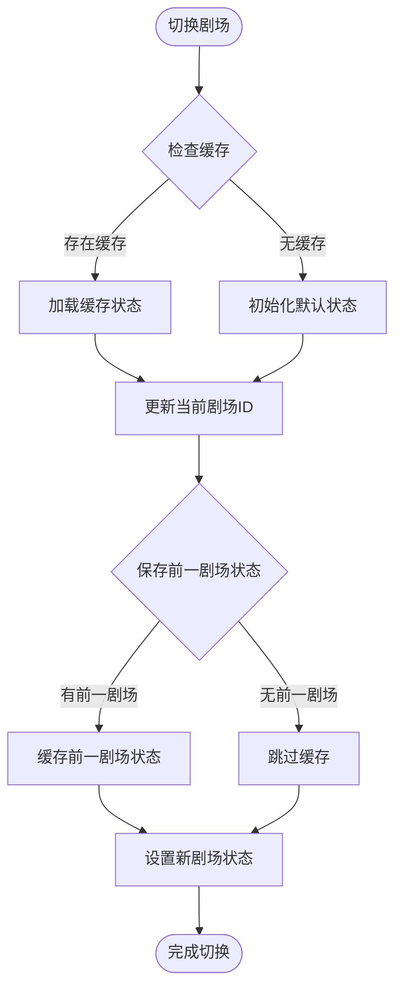

**图表来源**
- [useAIAssistantStore.ts:275-317](file://frontend/src/store/useAIAssistantStore.ts#L275-L317)

### 上下文使用统计

系统实现了智能的上下文使用统计功能，能够跟踪和管理AI助手的上下文窗口使用情况。

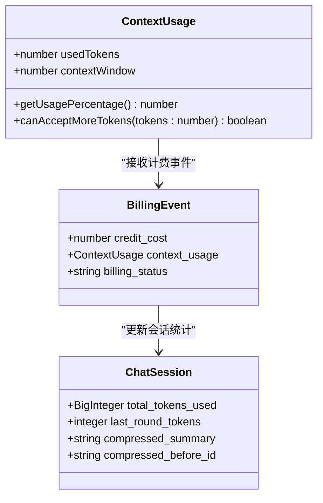

**图表来源**
- [useAIAssistantStore.ts:117-121](file://frontend/src/store/useAIAssistantStore.ts#L117-L121)
- [chat_multi_agent.py:175-189](file://backend/services/chat_multi_agent.py#L175-L189)

**章节来源**
- [useAIAssistantStore.ts:393-394](file://frontend/src/store/useAIAssistantStore.ts#L393-L394)
- [chat_multi_agent.py:63-83](file://backend/services/chat_multi_agent.py#L63-L83)

## 会话管理流程

### 会话生命周期管理

系统实现了完整的会话生命周期管理，包括创建、恢复、切换和清理。

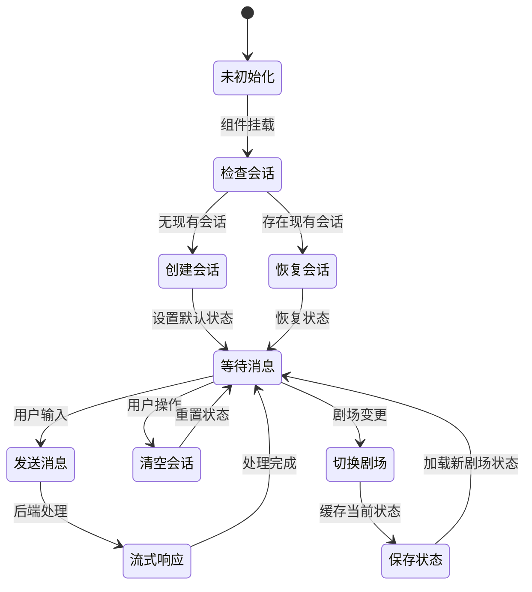

**图表来源**
- [useSessionManager.ts:191-212](file://frontend/src/components/ai-assistant/hooks/useSessionManager.ts#L191-L212)
- [AIAssistantPanel.tsx:188-194](file://frontend/src/components/canvas/AIAssistantPanel.tsx#L188-L194)

### 代理切换机制

系统支持在不同AI代理之间进行无缝切换，同时保持会话状态的连续性。

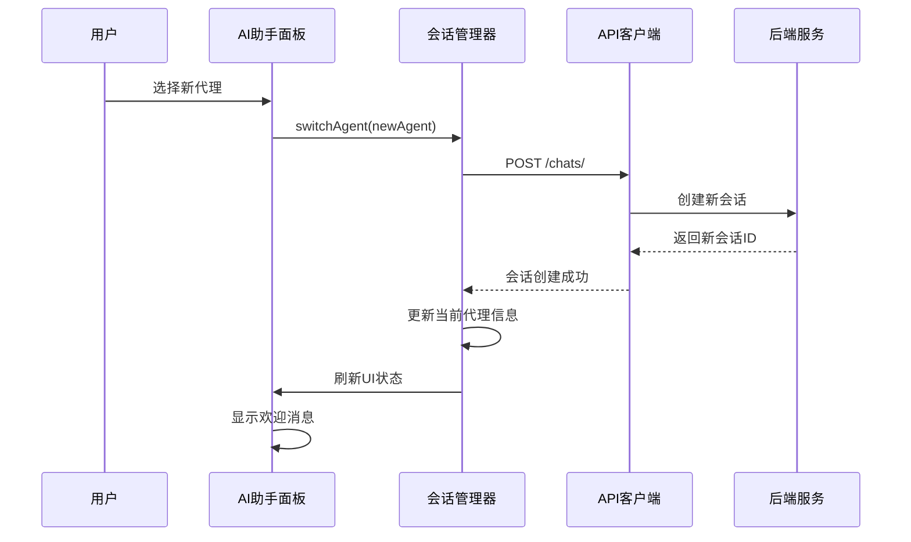

**图表来源**
- [useSessionManager.ts:125-146](file://frontend/src/components/ai-assistant/hooks/useSessionManager.ts#L125-L146)

**章节来源**
- [useSessionManager.ts:36-123](file://frontend/src/components/ai-assistant/hooks/useSessionManager.ts#L36-L123)
- [AIAssistantPanel.tsx:528-556](file://frontend/src/components/canvas/AIAssistantPanel.tsx#L528-L556)

## 会话列表管理

### ChatSessionInfo 接口定义

系统新增了 `ChatSessionInfo` 接口，用于标准化会话列表项的数据结构。

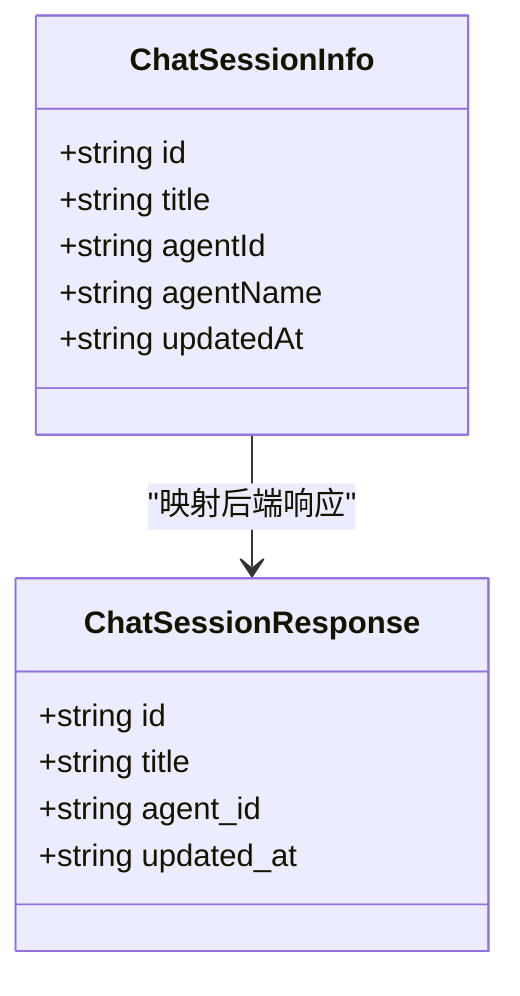

**图表来源**
- [useAIAssistantStore.ts:124-130](file://frontend/src/store/useAIAssistantStore.ts#L124-L130)
- [chats.py:48-68](file://backend/routers/chats.py#L48-L68)

### 会话列表状态管理

系统实现了完整的会话列表状态管理，包括状态跟踪和操作方法。

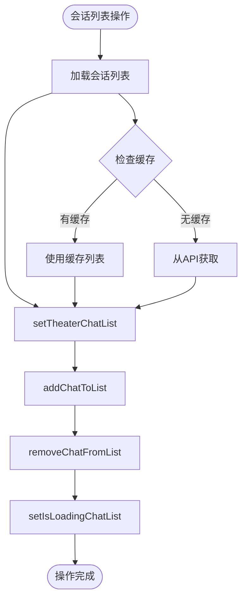

**图表来源**
- [useAIAssistantStore.ts:445-453](file://frontend/src/store/useAIAssistantStore.ts#L445-L453)
- [useSessionManager.ts:58-79](file://frontend/src/components/ai-assistant/hooks/useSessionManager.ts#L58-L79)

### 会话列表加载流程

系统实现了智能的会话列表加载机制，支持按剧场过滤和分页。

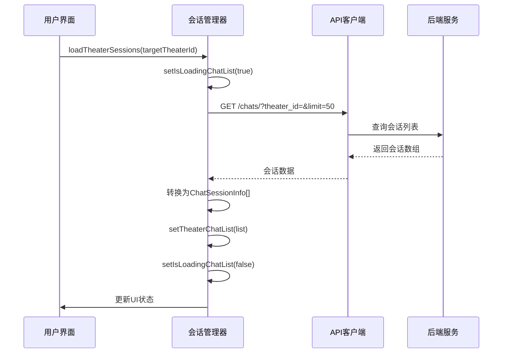

**图表来源**
- [useSessionManager.ts:58-79](file://frontend/src/components/ai-assistant/hooks/useSessionManager.ts#L58-L79)

### 会话列表操作方法

系统提供了完整的会话列表操作方法，支持增删改查等操作。

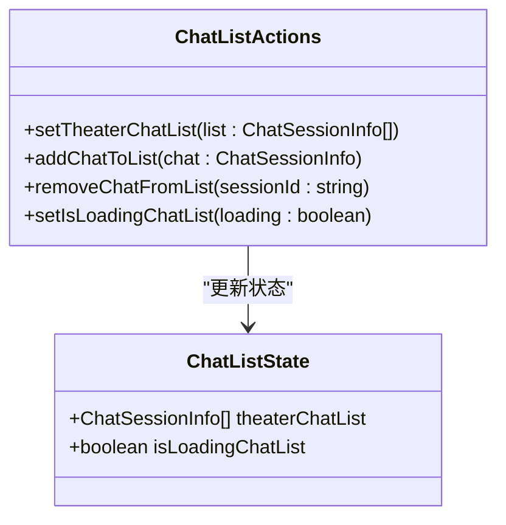

**图表来源**
- [useAIAssistantStore.ts:248-253](file://frontend/src/store/useAIAssistantStore.ts#L248-L253)

**章节来源**
- [useAIAssistantStore.ts:124-130](file://frontend/src/store/useAIAssistantStore.ts#L124-L130)
- [useAIAssistantStore.ts:445-453](file://frontend/src/store/useAIAssistantStore.ts#L445-L453)
- [useSessionManager.ts:58-79](file://frontend/src/components/ai-assistant/hooks/useSessionManager.ts#L58-L79)

## SSE事件处理

### 实时事件流处理

系统使用Server-Sent Events实现高效的实时通信，支持多种事件类型的处理。

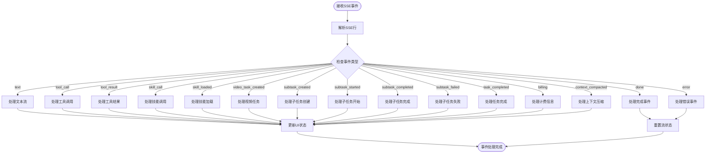

**图表来源**
- [useSSEHandler.ts:67-383](file://frontend/src/components/ai-assistant/hooks/useSSEHandler.ts#L67-L383)

### 多智能体协作事件

系统支持复杂的多智能体协作场景，能够处理子任务的创建、执行和完成状态。

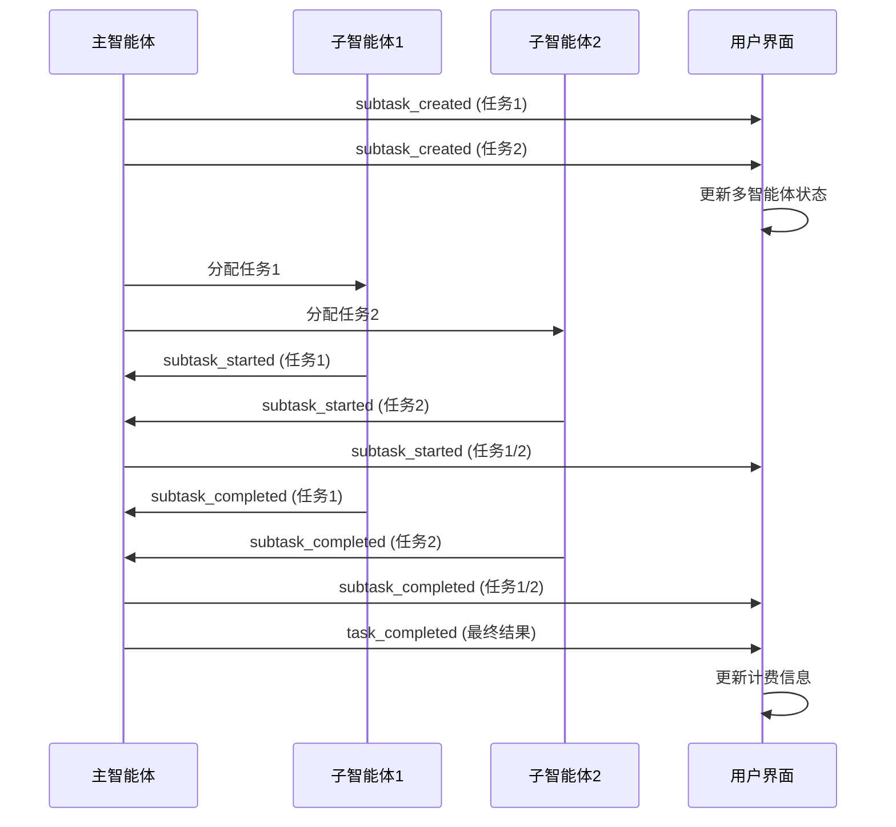

**图表来源**
- [useSSEHandler.ts:184-267](file://frontend/src/components/ai-assistant/hooks/useSSEHandler.ts#L184-L267)
- [chat_multi_agent.py:144-168](file://backend/services/chat_multi_agent.py#L144-L168)

**章节来源**
- [useSSEHandler.ts:25-391](file://frontend/src/components/ai-assistant/hooks/useSSEHandler.ts#L25-L391)
- [chat_multi_agent.py:22-61](file://backend/services/chat_multi_agent.py#L22-L61)

## 性能监控体系

### 前端性能监控

系统实现了全面的前端性能监控，包括长任务检测、FPS监控和关键性能指标追踪。

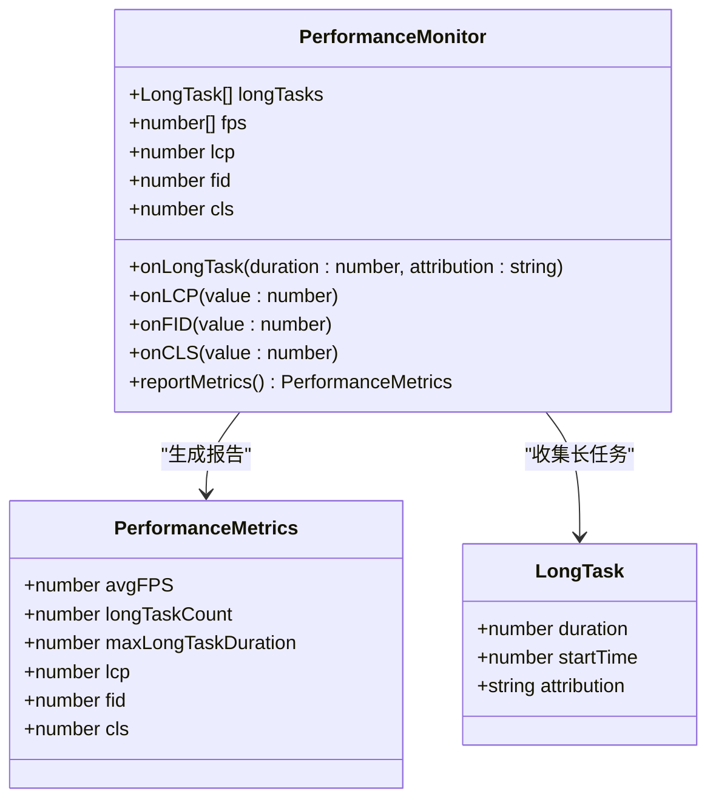

**图表来源**
- [usePerformanceMonitor.ts:5-236](file://frontend/src/components/ai-assistant/hooks/usePerformanceMonitor.ts#L5-L236)

### 性能优化策略

系统采用了多种性能优化策略来确保流畅的用户体验：

1. **虚拟滚动**：使用React Window实现消息列表的虚拟化渲染
2. **状态持久化**：利用localStorage减少页面刷新时的状态丢失
3. **事件节流**：对频繁更新的UI元素进行节流处理
4. **内存管理**：及时清理不再使用的对象引用

**章节来源**
- [usePerformanceMonitor.ts:75-200](file://frontend/src/components/ai-assistant/hooks/usePerformanceMonitor.ts#L75-L200)
- [AIAssistantPanel.tsx:473-495](file://frontend/src/components/canvas/AIAssistantPanel.tsx#L473-L495)

## 数据库模型设计

### 核心数据模型

系统采用关系型数据库设计，支持复杂的AI助手状态管理需求。

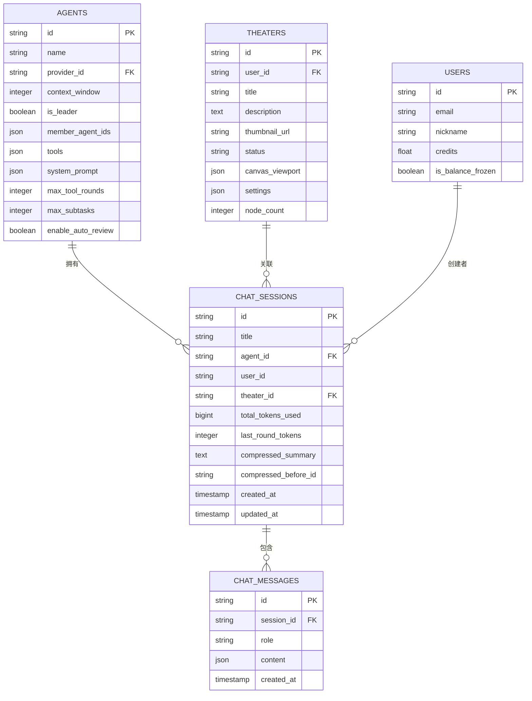

**图表来源**
- [models.py:178-200](file://backend/models.py#L178-L200)
- [models.py:75-150](file://backend/models.py#L75-L150)

### 会话状态持久化

系统实现了多层次的状态持久化机制，确保用户状态在各种场景下的可靠性。

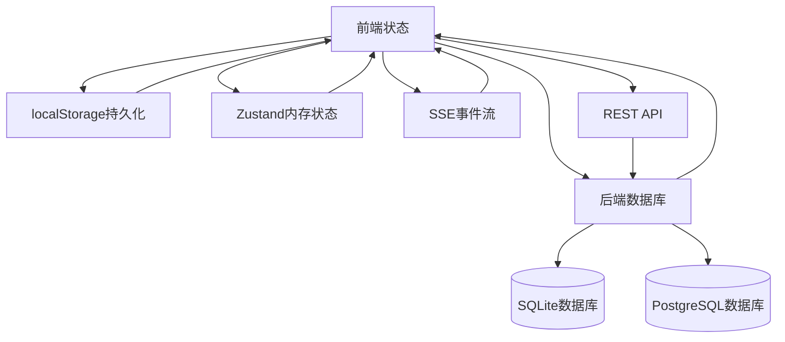

**图表来源**
- [useAIAssistantStore.ts:428-447](file://frontend/src/store/useAIAssistantStore.ts#L428-L447)
- [main.py:49-108](file://backend/main.py#L49-L108)

**章节来源**
- [models.py:178-197](file://backend/models.py#L178-L197)
- [useAIAssistantStore.ts:428-447](file://frontend/src/store/useAIAssistantStore.ts#L428-L447)

## 错误处理与优化

### 错误处理机制

系统实现了完善的错误处理机制，能够优雅地处理各种异常情况。

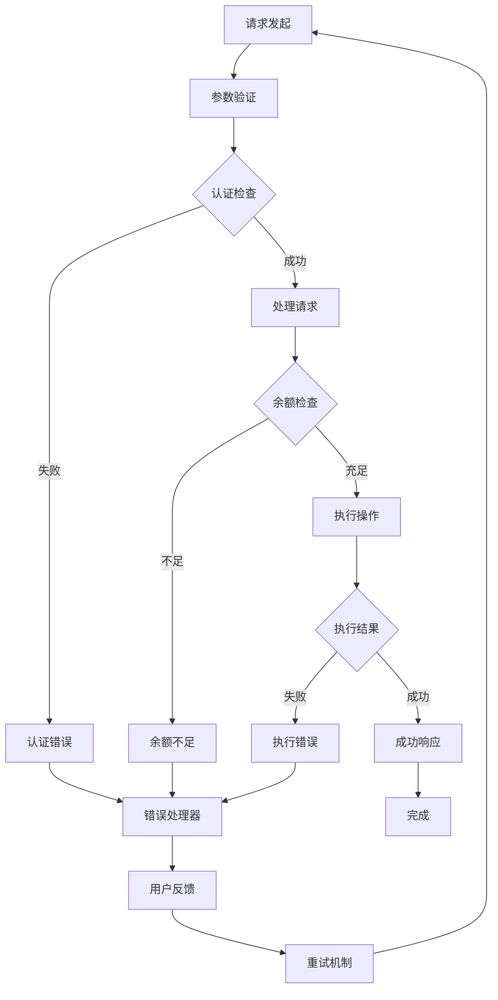

**图表来源**
- [chats.py:161-163](file://backend/routers/chats.py#L161-L163)
- [AIAssistantPanel.tsx:201-207](file://frontend/src/components/canvas/AIAssistantPanel.tsx#L201-L207)

### 优化建议

基于代码分析，提出以下优化建议：

1. **性能优化**
   - 实现消息内容的懒加载，减少初始渲染时间
   - 优化SSE事件的批量处理，减少UI更新频率
   - 添加消息内容的缓存机制，避免重复计算

2. **状态管理优化**
   - 实现状态的增量更新，减少不必要的状态重渲染
   - 添加状态快照功能，支持撤销/重做操作
   - 优化多剧场状态的内存使用

3. **错误处理优化**
   - 添加更详细的错误分类和处理策略
   - 实现自动重试机制，提高系统的容错能力
   - 添加错误上报和监控功能

**章节来源**
- [chats.py:161-183](file://backend/routers/chats.py#L161-L183)
- [AIAssistantPanel.tsx:265-301](file://frontend/src/components/canvas/AIAssistantPanel.tsx#L265-L301)

## 总结

AI助手状态管理增强项目通过精心设计的架构和实现，成功实现了以下核心功能：

### 主要成就

1. **完整的状态管理体系**：实现了多剧场、多会话的状态管理，支持状态的持久化和恢复
2. **会话列表管理功能**：新增ChatSessionInfo接口和完整的会话列表操作方法
3. **实时通信能力**：基于SSE的高效实时通信，支持多智能体协作场景
4. **性能监控体系**：全面的前端性能监控，确保用户体验的流畅性
5. **错误处理机制**：完善的错误处理和恢复机制，提高系统的稳定性

### 技术亮点

- **Zustand状态管理**：轻量级但功能强大的状态管理方案
- **SSE事件处理**：高效的实时通信机制，支持复杂的多智能体协作
- **虚拟滚动技术**：优化大量消息的渲染性能
- **多层持久化**：结合localStorage和数据库的持久化策略
- **类型安全的接口设计**：ChatSessionInfo接口确保数据结构的一致性

### 未来发展方向

1. **移动端适配**：优化移动端的用户体验和性能表现
2. **离线支持**：实现离线状态管理和同步机制
3. **扩展API**：提供更丰富的API接口，支持第三方集成
4. **AI能力增强**：集成更多AI能力，如语音识别、图像理解等

该项目展现了现代Web应用开发的最佳实践，为类似AI助手系统的开发提供了优秀的参考模板。