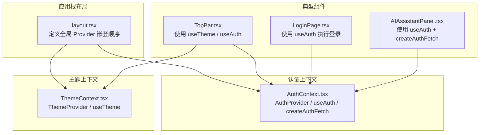
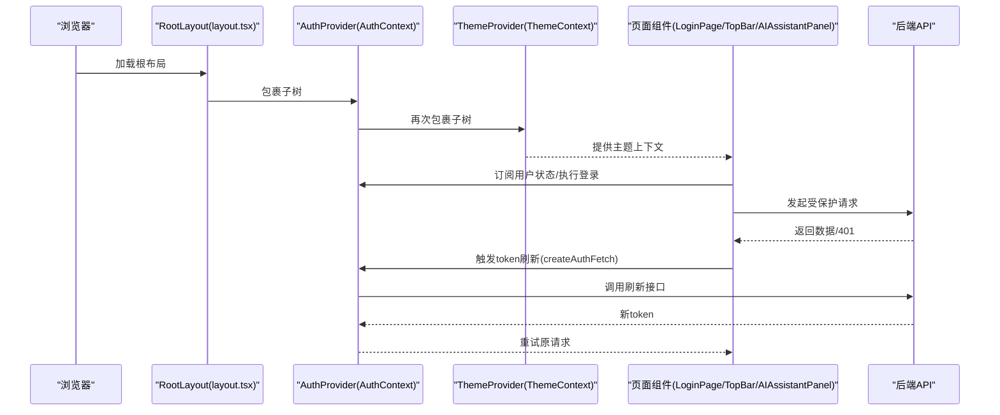
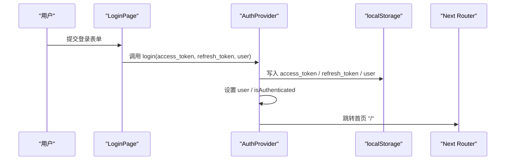
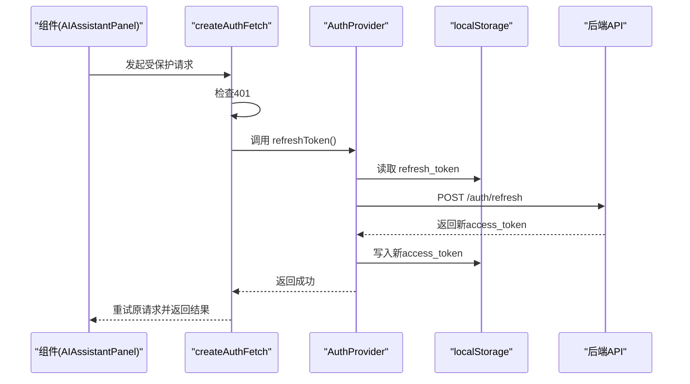
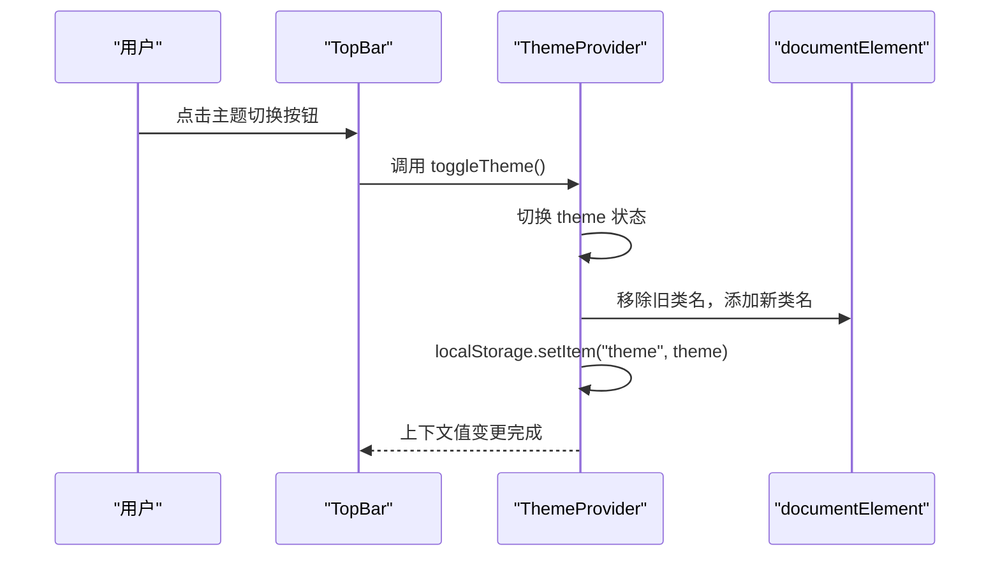
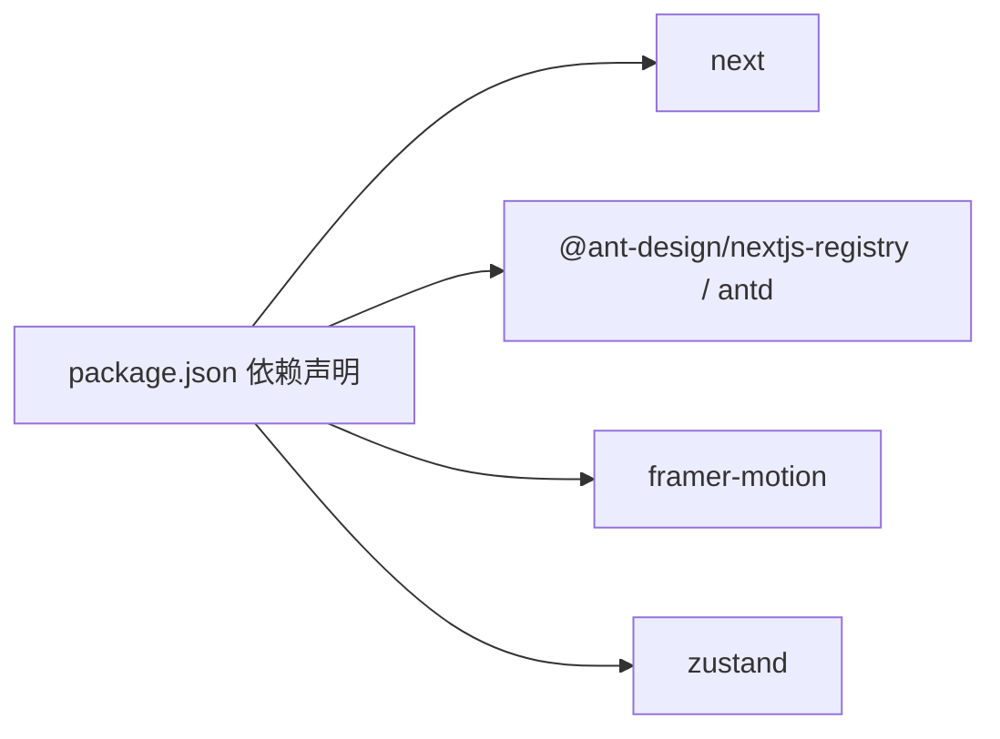

# React Context系统

<cite>
**本文档引用的文件**
- [AuthContext.tsx](file://frontend/src/context/AuthContext.tsx)
- [ThemeContext.tsx](file://frontend/src/context/ThemeContext.tsx)
- [layout.tsx](file://frontend/src/app/layout.tsx)
- [TopBar.tsx](file://frontend/src/components/home/TopBar.tsx)
- [LoginPage.tsx](file://frontend/src/app/login/page.tsx)
- [AIAssistantPanel.tsx](file://frontend/src/components/canvas/AIAssistantPanel.tsx)
- [use-throttled-callback.ts](file://frontend/src/hooks/use-throttled-callback.ts)
- [package.json](file://frontend/package.json)
</cite>

## 目录
1. [简介](#简介)
2. [项目结构](#项目结构)
3. [核心组件](#核心组件)
4. [架构总览](#架构总览)
5. [详细组件分析](#详细组件分析)
6. [依赖关系分析](#依赖关系分析)
7. [性能考量](#性能考量)
8. [故障排查指南](#故障排查指南)
9. [结论](#结论)
10. [附录](#附录)

## 简介
本文件针对 Infinite Game 前端的 React Context 系统进行系统性梳理，重点覆盖以下方面：
- 认证上下文（AuthContext）：用户状态管理、登录/登出流程、token 自动刷新机制与并发请求队列处理
- 主题上下文（ThemeContext）：主题切换、样式管理、响应式设计支持
- Context Provider 的嵌套结构、状态提升策略与性能优化
- 自定义 Hook 的设计模式、状态订阅与副作用处理
- Context 使用最佳实践与性能优化建议

## 项目结构
前端 Context 相关代码主要位于以下路径：
- 上下文定义：frontend/src/context
- 根布局与 Provider 嵌套：frontend/src/app/layout.tsx
- 典型使用示例：frontend/src/components/home/TopBar.tsx、frontend/src/app/login/page.tsx、frontend/src/components/canvas/AIAssistantPanel.tsx
- 自定义 Hook：frontend/src/hooks/use-throttled-callback.ts

图表来源
- [layout.tsx:23-41](file://frontend/src/app/layout.tsx#L23-L41)
- [AuthContext.tsx:119-206](file://frontend/src/context/AuthContext.tsx#L119-L206)
- [ThemeContext.tsx:16-66](file://frontend/src/context/ThemeContext.tsx#L16-L66)
- [TopBar.tsx:11-121](file://frontend/src/components/home/TopBar.tsx#L11-L121)
- [LoginPage.tsx:12-193](file://frontend/src/app/login/page.tsx#L12-L193)
- [AIAssistantPanel.tsx:51-59](file://frontend/src/components/canvas/AIAssistantPanel.tsx#L51-L59)

章节来源
- [layout.tsx:1-42](file://frontend/src/app/layout.tsx#L1-L42)

## 核心组件
本节概述两个核心 Context 的职责与关键能力。

- 认证上下文（AuthContext）
  - 用户状态：用户对象、认证态标识
  - 认证操作：登录、登出、更新积分
  - 安全机制：token 自动刷新、并发请求队列、统一鉴权请求封装
  - 路由守卫：基于路径的公开路由判断与未登录跳转

- 主题上下文（ThemeContext）
  - 主题状态：明/暗主题
  - 主题切换：提供切换函数
  - 样式管理：通过 Ant Design ConfigProvider 与 App 组件注入主题算法与变量
  - 响应式支持：结合系统偏好与本地存储

章节来源
- [AuthContext.tsx:12-47](file://frontend/src/context/AuthContext.tsx#L12-L47)
- [ThemeContext.tsx:7-14](file://frontend/src/context/ThemeContext.tsx#L7-L14)

## 架构总览
下图展示 Context Provider 的嵌套顺序与典型调用链：

图表来源
- [layout.tsx:33-37](file://frontend/src/app/layout.tsx#L33-L37)
- [AuthContext.tsx:201-206](file://frontend/src/context/AuthContext.tsx#L201-L206)
- [ThemeContext.tsx:46-65](file://frontend/src/context/ThemeContext.tsx#L46-L65)
- [LoginPage.tsx:18-29](file://frontend/src/app/login/page.tsx#L18-L29)
- [AIAssistantPanel.tsx:216-237](file://frontend/src/components/canvas/AIAssistantPanel.tsx#L216-L237)

## 详细组件分析

### 认证上下文（AuthContext）深度解析
- 数据模型与上下文类型
  - 用户接口：包含基础身份信息、角色、活跃状态与计费相关字段
  - Token 响应接口：包含访问令牌、刷新令牌、有效期与用户信息
  - 上下文类型：暴露用户、认证态、登录、登出、更新积分、刷新 token 方法

- Provider 实现要点
  - 初始化：从本地存储读取用户与令牌，设置认证态，并根据当前路径进行未登录跳转
  - 登录：持久化令牌与用户信息，更新上下文并跳转首页
  - 登出：移除本地存储中的令牌与用户信息，清空上下文并跳转登录页
  - 更新积分：在内存与本地存储中同步更新用户积分
  - 刷新 token：向后端发起刷新请求，成功后写入新访问令牌；失败则触发登出

- 请求封装与并发控制（createAuthFetch）
  - 自动注入 Authorization 头
  - 非 401 直接返回
  - 对于非认证端点的 401 进行特殊处理
  - 并发刷新：使用 isRefreshing 标志与队列 failedQueue 保证同一时间仅一次刷新，其余请求排队重试
  - 成功后批量重试队列中的请求，失败则拒绝

- 登录/登出流程时序

图表来源
- [LoginPage.tsx:18-29](file://frontend/src/app/login/page.tsx#L18-L29)
- [AuthContext.tsx:142-151](file://frontend/src/context/AuthContext.tsx#L142-L151)

- token 自动刷新流程时序

图表来源
- [AIAssistantPanel.tsx:216-237](file://frontend/src/components/canvas/AIAssistantPanel.tsx#L216-L237)
- [AuthContext.tsx:52-114](file://frontend/src/context/AuthContext.tsx#L52-L114)
- [AuthContext.tsx:171-199](file://frontend/src/context/AuthContext.tsx#L171-L199)

- 关键实现细节与复杂度
  - 状态更新：useState 与 useCallback 保证最小重渲染
  - 并发控制：队列与标志位 O(n) 批量重试
  - 存储一致性：本地存储与内存状态双向同步
  - 路由守卫：基于路径数组判断公开路由，O(1) 查找

章节来源
- [AuthContext.tsx:12-47](file://frontend/src/context/AuthContext.tsx#L12-L47)
- [AuthContext.tsx:119-206](file://frontend/src/context/AuthContext.tsx#L119-L206)
- [AuthContext.tsx:52-114](file://frontend/src/context/AuthContext.tsx#L52-L114)
- [AuthContext.tsx:171-199](file://frontend/src/context/AuthContext.tsx#L171-L199)

### 主题上下文（ThemeContext）深度解析
- 主题状态与切换
  - 初始值：SSR 下默认暗色，挂载后读取本地存储或系统偏好
  - 切换逻辑：在明/暗之间切换
  - DOM 属性：动态添加/移除类名与 data-theme 属性，保证样式系统即时生效
  - 本地存储：每次切换同步到 localStorage

- Ant Design 主题注入
  - ConfigProvider：按主题选择算法（暗/亮），并注入主色、背景、文字等 token
  - App：作为主题包裹容器，确保全局样式正确继承

- 响应式设计支持
  - 系统偏好检测：首次挂载时读取 window.matchMedia 结果
  - 类名切换：通过 documentElement.classList 控制根元素主题类，便于 CSS 响应

- 主题切换流程时序

图表来源
- [TopBar.tsx:70-82](file://frontend/src/components/home/TopBar.tsx#L70-L82)
- [ThemeContext.tsx:39-41](file://frontend/src/context/ThemeContext.tsx#L39-L41)
- [ThemeContext.tsx:31-37](file://frontend/src/context/ThemeContext.tsx#L31-L37)

章节来源
- [ThemeContext.tsx:16-66](file://frontend/src/context/ThemeContext.tsx#L16-L66)
- [TopBar.tsx:11-121](file://frontend/src/components/home/TopBar.tsx#L11-L121)

### Context Provider 嵌套结构与状态提升
- 嵌套顺序
  - 根布局中先包裹 AuthProvider，再包裹 ThemeProvider，确保子树同时具备认证与主题能力
  - Ant Design 的注册与主题注入通过 AntdRegistry 与 ConfigProvider/App 完成

- 状态提升策略
  - 将用户状态与主题状态提升至根布局，使全局组件共享
  - 通过 createAuthFetch 将“刷新 token + 重试请求”的复杂逻辑下沉到上下文层，组件只需专注业务

- 性能优化
  - 使用 useCallback 包装登录、登出、更新积分等方法，减少子组件重渲染
  - 在 AuthProvider 中对路径变化进行路由守卫，避免无效跳转
  - 主题切换仅影响根元素类名与 ConfigProvider 参数，开销极低

章节来源
- [layout.tsx:33-37](file://frontend/src/app/layout.tsx#L33-L37)
- [AuthContext.tsx:142-151](file://frontend/src/context/AuthContext.tsx#L142-L151)
- [AuthContext.tsx:163-169](file://frontend/src/context/AuthContext.tsx#L163-L169)

### 自定义 Hook 设计模式与最佳实践
- useThrottledCallback
  - 设计目标：对回调函数进行节流，避免高频触发导致的性能问题
  - 实现要点：使用 useMemo 缓存节流实例，依赖项可控；在组件卸载时取消节流，防止内存泄漏
  - 适用场景：窗口尺寸监听、滚动事件、输入框实时搜索等

- 在 Context 中的应用
  - 主题切换与窗口尺寸监听可结合节流 Hook，降低重绘频率
  - 在 AI 助手面板中，对滚动、拖拽等高频事件采用节流，提升交互流畅度

章节来源
- [use-throttled-callback.ts:25-46](file://frontend/src/hooks/use-throttled-callback.ts#L25-L46)

### Context 使用最佳实践
- Provider 嵌套顺序
  - 先认证后主题，确保主题切换不影响认证流程
  - 将最稳定的 Provider 放在外层，减少内部组件的无谓重渲染

- 状态订阅与副作用
  - 仅订阅必要的状态片段，避免过度渲染
  - 在组件卸载时清理副作用（如节流实例、定时器、事件监听）

- 错误处理与用户体验
  - 对 401 错误进行统一处理，优先尝试刷新 token，失败则引导用户重新登录
  - 在 UI 中提供明确的提示与回退路径（如重新登录弹窗）

- 性能优化
  - 使用 useCallback 包装上下文方法
  - 合理拆分组件，避免大范围 Provider 变更导致的全树重渲染
  - 对高频事件采用节流/防抖

## 依赖关系分析
- 外部依赖
  - Next.js Navigation：用于路由跳转与路径判断
  - Ant Design：ConfigProvider/App 主题注入，组件库样式
  - Framer Motion：动画与过渡效果
  - Zustand：局部状态管理（如 AI 助手面板内部状态）

- 内部依赖
  - AuthContext 与 ThemeContext 作为全局状态源，被各页面与组件消费
  - createAuthFetch 依赖 AuthContext 的刷新与登出能力

图表来源
- [package.json:13-69](file://frontend/package.json#L13-L69)

章节来源
- [package.json:13-69](file://frontend/package.json#L13-L69)

## 性能考量
- 渲染层面
  - 使用 useCallback 包装上下文方法，减少子组件重渲染
  - 将主题切换与路由守卫等逻辑下沉到 Context，避免重复计算

- 网络层面
  - createAuthFetch 的并发请求队列避免重复刷新与多次网络往返
  - 对 401 错误进行快速分支，减少不必要的重试

- 交互层面
  - 结合节流/防抖 Hook 降低高频事件对主线程的压力
  - 虚拟列表与条件渲染减少 DOM 节点数量

## 故障排查指南
- 登录后仍被重定向到登录页
  - 检查本地存储中是否存在 access_token 与 user
  - 确认当前路径是否属于公开路由（如 /login）

- 主题切换无效
  - 检查 documentElement 是否正确添加/移除类名
  - 确认 ConfigProvider 的 theme 配置是否随主题状态更新

- 请求 401 但未自动刷新
  - 确认 refresh_token 是否存在且有效
  - 检查 createAuthFetch 是否正确注入 Authorization 头
  - 排查队列是否被正确处理（isRefreshing 标志与 failedQueue）

- 重新登录弹窗频繁出现
  - 检查后端刷新接口返回状态与异常处理
  - 确认刷新失败后是否正确触发登出流程

章节来源
- [AuthContext.tsx:127-140](file://frontend/src/context/AuthContext.tsx#L127-L140)
- [ThemeContext.tsx:31-37](file://frontend/src/context/ThemeContext.tsx#L31-L37)
- [AIAssistantPanel.tsx:240-246](file://frontend/src/components/canvas/AIAssistantPanel.tsx#L240-L246)

## 结论
Infinite Game 的 React Context 系统通过清晰的职责划分与合理的 Provider 嵌套，实现了认证与主题两大核心能力的稳定运行。AuthContext 提供了完善的用户状态管理与 token 自动刷新机制，配合 createAuthFetch 的并发控制，有效提升了网络请求的可靠性与性能。ThemeContext 则通过 Ant Design 的主题注入与系统偏好检测，提供了良好的响应式设计支持。结合自定义 Hook 的设计模式与最佳实践，整体系统在可维护性与性能方面均表现良好。

## 附录
- 关键文件路径索引
  - 认证上下文：frontend/src/context/AuthContext.tsx
  - 主题上下文：frontend/src/context/ThemeContext.tsx
  - 根布局与 Provider 嵌套：frontend/src/app/layout.tsx
  - 典型使用示例：frontend/src/components/home/TopBar.tsx、frontend/src/app/login/page.tsx、frontend/src/components/canvas/AIAssistantPanel.tsx
  - 自定义 Hook：frontend/src/hooks/use-throttled-callback.ts
  - 依赖声明：frontend/package.json