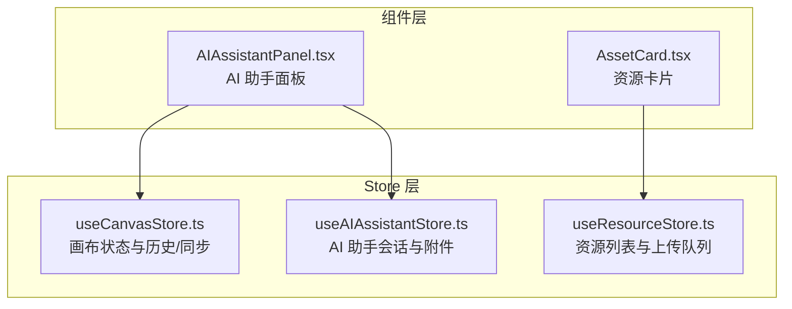
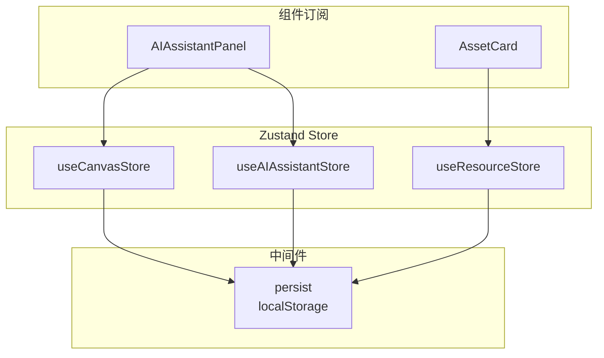
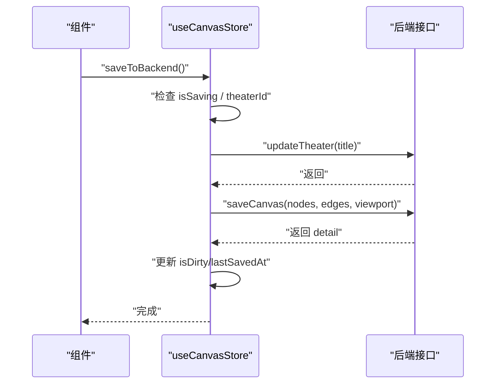
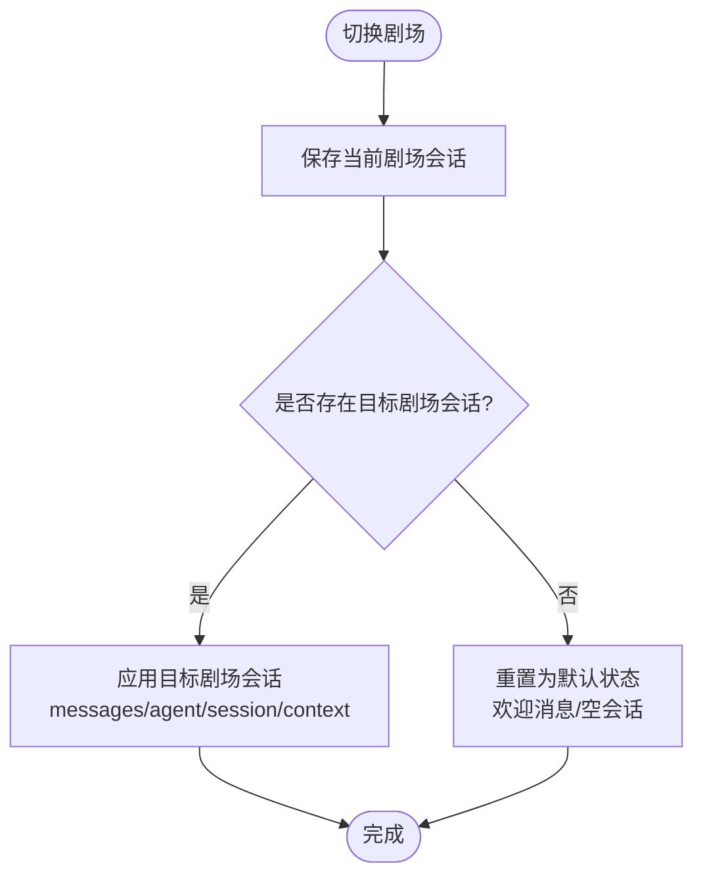
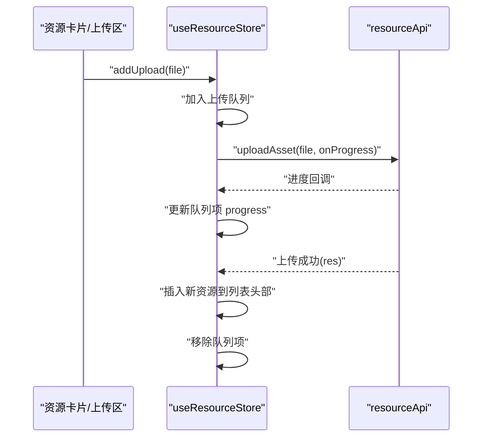
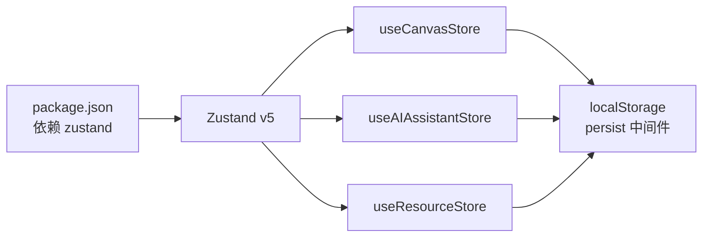

# Zustand Store系统

<cite>
**本文档引用的文件**
- [useCanvasStore.ts](file://frontend/src/store/useCanvasStore.ts)
- [useAIAssistantStore.ts](file://frontend/src/store/useAIAssistantStore.ts)
- [useResourceStore.ts](file://frontend/src/store/useResourceStore.ts)
- [AIAssistantPanel.tsx](file://frontend/src/components/canvas/AIAssistantPanel.tsx)
- [AssetCard.tsx](file://frontend/src/components/resources/AssetCard.tsx)
- [useCanvasStore.test.ts](file://frontend/src/store/__tests__/useCanvasStore.test.ts)
- [package.json](file://frontend/package.json)
</cite>

## 目录
1. [简介](#简介)
2. [项目结构](#项目结构)
3. [核心组件](#核心组件)
4. [架构总览](#架构总览)
5. [详细组件分析](#详细组件分析)
6. [依赖关系分析](#依赖关系分析)
7. [性能考量](#性能考量)
8. [故障排查指南](#故障排查指南)
9. [结论](#结论)
10. [附录](#附录)

## 简介
本文件系统性梳理 KunFlix 前端基于 Zustand 的状态管理方案，重点覆盖以下方面：
- Zustand 使用模式：store 创建、状态定义、动作函数设计
- 三大核心 store 的实现与职责边界：画布状态管理（useCanvasStore）、AI 助手状态管理（useAIAssistantStore）、资源管理（useResourceStore）
- 状态持久化策略、状态订阅机制与性能优化技术
- store 组合模式、中间件使用与调试工具配置
- 最佳实践与常见问题解决方案

## 项目结构
前端 Zustand store 位于 `frontend/src/store/` 目录，分别定义了三个独立的 store，配合组件层进行状态订阅与动作触发。

图表来源
- [useCanvasStore.ts:185-540](file://frontend/src/store/useCanvasStore.ts#L185-L540)
- [useAIAssistantStore.ts:209-381](file://frontend/src/store/useAIAssistantStore.ts#L209-L381)
- [useResourceStore.ts:51-182](file://frontend/src/store/useResourceStore.ts#L51-L182)
- [AIAssistantPanel.tsx:1-200](file://frontend/src/components/canvas/AIAssistantPanel.tsx#L1-L200)
- [AssetCard.tsx:1-132](file://frontend/src/components/resources/AssetCard.tsx#L1-L132)

章节来源
- [useCanvasStore.ts:185-540](file://frontend/src/store/useCanvasStore.ts#L185-L540)
- [useAIAssistantStore.ts:209-381](file://frontend/src/store/useAIAssistantStore.ts#L209-L381)
- [useResourceStore.ts:51-182](file://frontend/src/store/useResourceStore.ts#L51-L182)

## 核心组件
本节概述三大 store 的职责与关键能力：

- useCanvasStore：负责画布节点/边的状态、视口、历史快照、脏标记、与后端剧场数据的双向同步与保存。
- useAIAssistantStore：负责 AI 助手面板的可见性、消息流、会话切换、多智能体协作数据、节点附件（多图支持）、面板尺寸与拖拽等。
- useResourceStore：负责资源资产列表、分页加载、类型筛选、上传队列、重命名/替换/删除与外部上传同步。

章节来源
- [useCanvasStore.ts:67-114](file://frontend/src/store/useCanvasStore.ts#L67-L114)
- [useAIAssistantStore.ts:104-200](file://frontend/src/store/useAIAssistantStore.ts#L104-L200)
- [useResourceStore.ts:18-43](file://frontend/src/store/useResourceStore.ts#L18-L43)

## 架构总览
Zustand 在本项目中的使用遵循“单一职责 + 中间件持久化”的模式，store 之间通过组件层进行组合式订阅，避免跨 store 的直接耦合。

图表来源
- [useCanvasStore.ts:185-540](file://frontend/src/store/useCanvasStore.ts#L185-L540)
- [useAIAssistantStore.ts:209-381](file://frontend/src/store/useAIAssistantStore.ts#L209-L381)
- [useResourceStore.ts:51-182](file://frontend/src/store/useResourceStore.ts#L51-L182)
- [AIAssistantPanel.tsx:1-200](file://frontend/src/components/canvas/AIAssistantPanel.tsx#L1-L200)
- [AssetCard.tsx:1-132](file://frontend/src/components/resources/AssetCard.tsx#L1-L132)

## 详细组件分析

### 画布状态管理 store（useCanvasStore）
- 状态结构
  - 节点/边集合、视口、剧场 ID/标题、保存/加载状态、脏标记
  - 历史栈（快照）与索引，支持撤销/重做
  - Snap-to-grid 与 Guides 设置
- 关键动作
  - 节点/边变更回调：onNodesChange/onEdgesChange，根据变更类型设置脏标记
  - 连接动作：onConnect，防自环与成环检测，新增边后标记脏并快照
  - 节点增删改：addNode/deleteNode/deleteEdge/updateNodeData/updateNodeDimensions/reset
  - 视口设置：setViewport
  - 历史操作：takeSnapshot/undo/redo
  - 后端同步：setTheaterId/setTheaterTitle/loadTheater/syncTheater/saveToBackend/markDirty
- 数据映射
  - nodeToApi/apiToNode、edgeToApi/apiToEdge：前后端节点/边数据转换
  - applyDetail：后端详情应用到前端状态
- 持久化策略
  - persist 中间件 + localStorage，仅持久化部分字段（nodes/edges/viewport/theaterId/theaterTitle），并提供 merge 逻辑去重节点
- 订阅与使用
  - 组件通过选择器订阅状态片段，减少重渲染
  - 与 AI 助手面板联动：通过节点附件触发 AI 编辑流程

图表来源
- [useCanvasStore.ts:478-505](file://frontend/src/store/useCanvasStore.ts#L478-L505)

章节来源
- [useCanvasStore.ts:67-114](file://frontend/src/store/useCanvasStore.ts#L67-L114)
- [useCanvasStore.ts:185-540](file://frontend/src/store/useCanvasStore.ts#L185-L540)

### AI 助手状态管理 store（useAIAssistantStore）
- 状态结构
  - 面板可见性、当前剧场 ID、消息列表、会话信息（sessionId/agentId/agentName）
  - 可用智能体列表、剧场会话缓存（按剧场 ID 分组）
  - 面板尺寸/位置、图像编辑上下文、节点附件（多图支持，最多 5 个）
  - 拖拽进入反馈、上下文使用统计、虚拟滚动参数
- 关键动作
  - 面板控制：setIsOpen/toggleOpen
  - 剧场切换：switchTheater，保存当前剧场会话并加载目标剧场会话
  - 消息管理：setMessages/addMessage/updateLastMessage/clearMessages
  - 会话管理：setSessionId/setAgentId/setAgentName/setCurrentAgent/clearSession/clearMessagesKeepSession
  - 附件管理：setNodeAttachments/addNodeAttachment/removeNodeAttachment/clearNodeAttachments，以及向后兼容的单图 API
  - 图像编辑上下文：setImageEditContext/clearImageEditContext（与附件互斥）
  - 面板尺寸/位置：setPanelSize/resetPanelSize/setPanelPosition/resetPanelPosition
  - 拖拽状态：setIsDragOverPanel
  - 上下文使用：setContextUsage
  - 虚拟滚动：setScrollBehavior/setOverscanCount
- 持久化策略
  - persist 中间件 + localStorage，持久化所有剧场会话与当前状态，便于跨页面保留对话体验

图表来源
- [useAIAssistantStore.ts:235-277](file://frontend/src/store/useAIAssistantStore.ts#L235-L277)

章节来源
- [useAIAssistantStore.ts:104-200](file://frontend/src/store/useAIAssistantStore.ts#L104-L200)
- [useAIAssistantStore.ts:209-381](file://frontend/src/store/useAIAssistantStore.ts#L209-L381)

### 资源管理 store（useResourceStore）
- 状态结构
  - 资源列表、总数、页码、每页数量、类型过滤、是否加载中、是否有更多
  - 上传队列（含进度、状态、错误）
- 关键动作
  - 列表加载：fetchAssets/loadMore，支持分页与类型过滤
  - 类型筛选：setTypeFilter，重置列表并重新拉取
  - 上传队列：addUpload/removeUpload，结合后端上传进度回调更新队列项
  - 资源操作：renameAsset/replaceAssetFile/deleteAsset
  - 外部同步：syncAssetFromUpload，避免重复添加
  - 重置：reset
- 与组件交互
  - 资源卡片组件通过 store 提供的操作进行预览、重命名、替换与删除

图表来源
- [useResourceStore.ts:103-131](file://frontend/src/store/useResourceStore.ts#L103-L131)

章节来源
- [useResourceStore.ts:18-43](file://frontend/src/store/useResourceStore.ts#L18-L43)
- [useResourceStore.ts:51-182](file://frontend/src/store/useResourceStore.ts#L51-L182)

### 组件层订阅与组合模式
- 组合订阅：组件通过选择器订阅所需状态片段，降低不必要的重渲染
  - 示例：AI 助手面板同时订阅 useAIAssistantStore 与 useCanvasStore 的片段状态
- 事件驱动：画布删除边时触发自定义事件，供其他模块监听
- 附件构建：将画布节点作为上下文附加到 AI 消息中，提升 AI 对节点内容的理解

章节来源
- [AIAssistantPanel.tsx:62-107](file://frontend/src/components/canvas/AIAssistantPanel.tsx#L62-L107)
- [useCanvasStore.ts:283-288](file://frontend/src/store/useCanvasStore.ts#L283-L288)

## 依赖关系分析
- Zustand 版本：项目依赖 zustand@^5.0.12
- 中间件：persist 用于本地持久化；createJSONStorage 指定 localStorage
- 组件订阅：React 组件通过 Zustand 提供的选择器订阅模式进行状态读取
- 测试验证：对 useCanvasStore 的自动保存与错误处理进行了单元测试

图表来源
- [package.json:69](file://frontend/package.json#L69)
- [useCanvasStore.ts:511-538](file://frontend/src/store/useCanvasStore.ts#L511-L538)
- [useAIAssistantStore.ts:360-379](file://frontend/src/store/useAIAssistantStore.ts#L360-L379)
- [useResourceStore.ts:51-182](file://frontend/src/store/useResourceStore.ts#L51-L182)

章节来源
- [package.json:69](file://frontend/package.json#L69)

## 性能考量
- 选择器订阅：组件通过选择器订阅状态片段，避免全局状态变化导致的全量重渲染
- 历史快照限制：最大历史长度限制，防止内存膨胀
- 上传队列与进度：异步上传过程中仅更新队列项，不阻塞 UI
- 虚拟滚动：AI 助手消息列表采用虚拟滚动参数，提升长列表性能
- 防抖/节流：建议在高频动作（如视口更新、节点拖拽）上引入节流/防抖策略（当前已有相关工具钩子）

章节来源
- [useCanvasStore.ts:116](file://frontend/src/store/useCanvasStore.ts#L116)
- [useAIAssistantStore.ts:144-146](file://frontend/src/store/useAIAssistantStore.ts#L144-L146)
- [useResourceStore.ts:103-131](file://frontend/src/store/useResourceStore.ts#L103-L131)

## 故障排查指南
- 自动保存失败
  - 现象：保存请求被拒绝，isDirty 仍为 true
  - 排查：确认 isSaving 状态与 theaterId 是否有效；检查后端接口返回
  - 参考测试：断言保存失败时 isDirty 不会被清除
- 节点/边同步异常
  - 现象：后端同步后节点/边未更新
  - 排查：确认合并逻辑是否正确识别“相同”节点/边；避免覆盖 viewport
- 上传队列卡住
  - 现象：进度不更新或状态停留在 uploading
  - 排查：检查上传回调是否触发；确认错误分支是否更新状态与错误信息
- 附件与图像编辑上下文冲突
  - 现象：同时设置附件与图像编辑上下文导致 UI 不一致
  - 排查：确认互斥逻辑（设置任一将清空另一项）

章节来源
- [useCanvasStore.test.ts:85-104](file://frontend/src/store/__tests__/useCanvasStore.test.ts#L85-L104)
- [useAIAssistantStore.ts:326-348](file://frontend/src/store/useAIAssistantStore.ts#L326-L348)
- [useResourceStore.ts:124-130](file://frontend/src/store/useResourceStore.ts#L124-L130)

## 结论
本项目的 Zustand 状态管理以“单一 store 单一职责”为核心，配合 persist 中间件实现关键状态的本地持久化，并通过组件层的选择器订阅与组合模式实现高内聚、低耦合的状态共享。三大 store 分别覆盖画布、AI 助手与资源管理场景，满足复杂创作工作流的需求。建议后续在高频交互场景引入节流/防抖与更完善的调试工具链，持续优化用户体验与开发效率。

## 附录
- 最佳实践
  - 将状态切分为细粒度 store，避免大而全的状态对象
  - 使用选择器订阅，减少不必要的重渲染
  - 对高频动作（拖拽、缩放、输入）采用节流/防抖
  - 对需要跨页面保留的状态使用 persist 中间件
  - 为关键流程编写单元测试，覆盖成功/失败路径
- 常见问题
  - 持久化后数据重复：在 merge 中实现去重逻辑
  - 同步时丢失用户视口：避免覆盖 viewport 字段
  - 上传失败后状态未更新：确保错误分支更新状态与错误信息