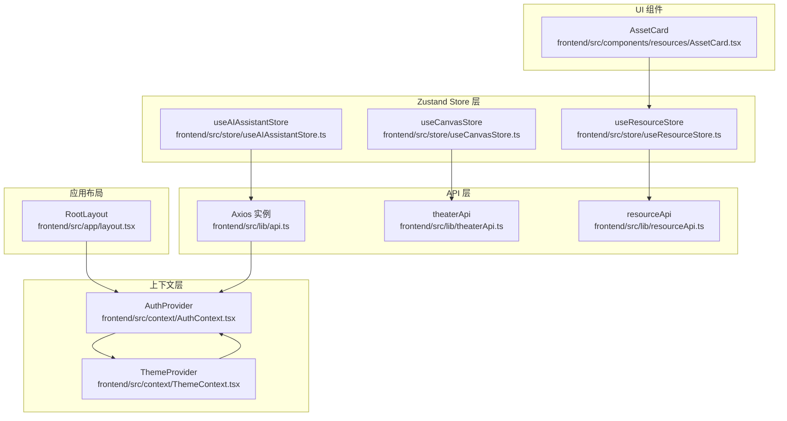
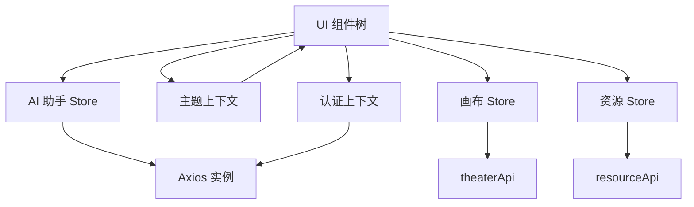
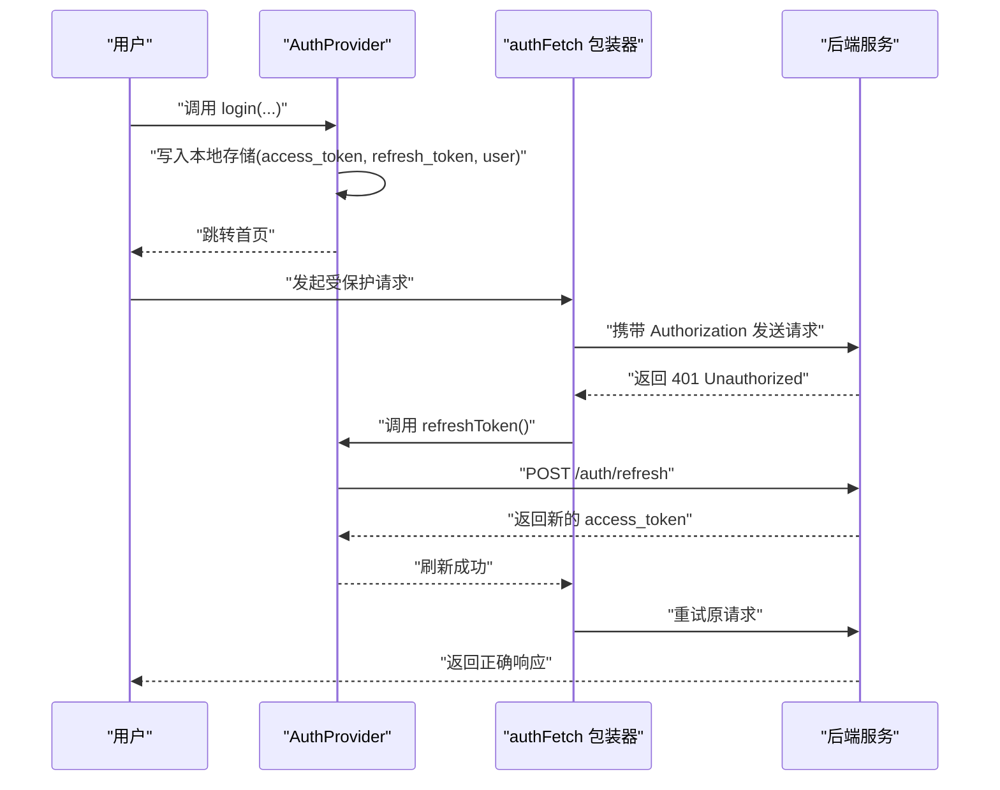
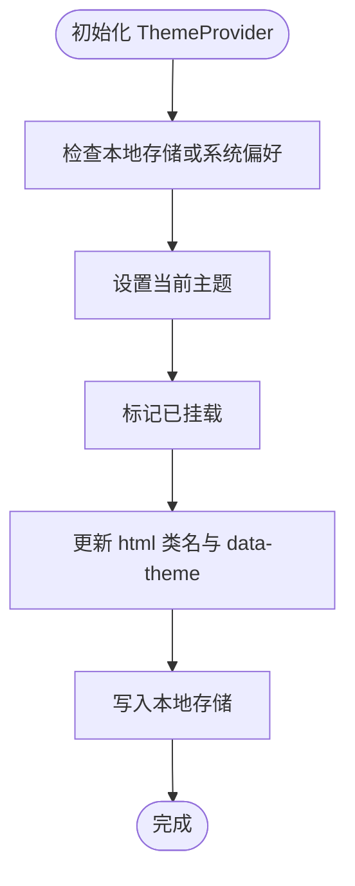
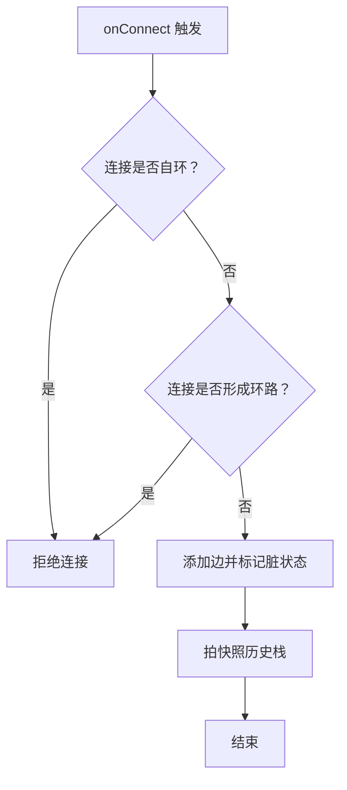
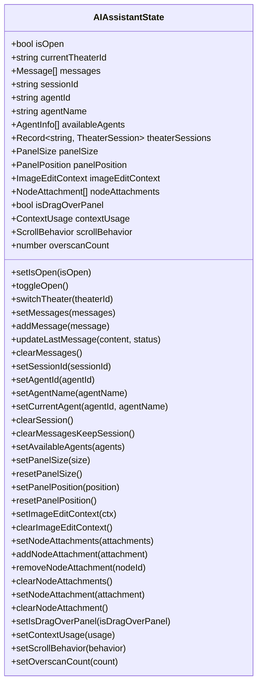
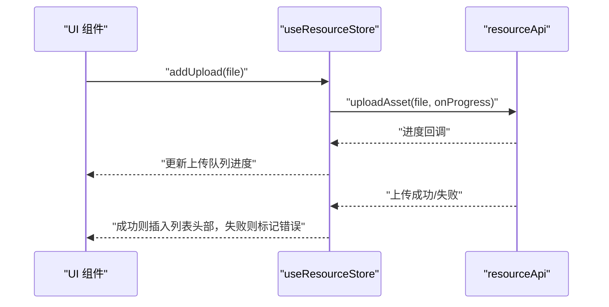
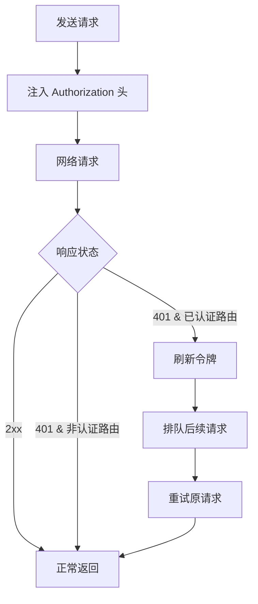
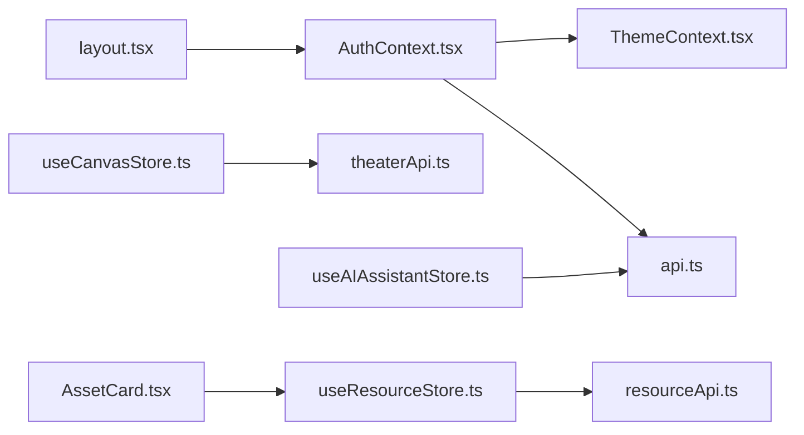

# 状态管理系统

<cite>
**本文引用的文件**
- [AuthContext.tsx](file://frontend/src/context/AuthContext.tsx)
- [ThemeContext.tsx](file://frontend/src/context/ThemeContext.tsx)
- [useCanvasStore.ts](file://frontend/src/store/useCanvasStore.ts)
- [useAIAssistantStore.ts](file://frontend/src/store/useAIAssistantStore.ts)
- [useResourceStore.ts](file://frontend/src/store/useResourceStore.ts)
- [api.ts](file://frontend/src/lib/api.ts)
- [theaterApi.ts](file://frontend/src/lib/theaterApi.ts)
- [resourceApi.ts](file://frontend/src/lib/resourceApi.ts)
- [layout.tsx](file://frontend/src/app/layout.tsx)
- [AssetCard.tsx](file://frontend/src/components/resources/AssetCard.tsx)
</cite>

## 目录
1. [简介](#简介)
2. [项目结构](#项目结构)
3. [核心组件](#核心组件)
4. [架构总览](#架构总览)
5. [详细组件分析](#详细组件分析)
6. [依赖关系分析](#依赖关系分析)
7. [性能考量](#性能考量)
8. [故障排查指南](#故障排查指南)
9. [结论](#结论)
10. [附录](#附录)

## 简介
本文件系统性梳理 Infinite Game 前端的状态管理方案，覆盖以下关键主题：
- Zustand 状态库的使用与最佳实践：包括 store 设计模式、状态持久化、跨组件共享与订阅。
- React Context Provider 体系：认证上下文与主题上下文的实现与交互。
- 全局状态设计原则、状态更新机制与性能优化策略。
- 自定义 Hook 的设计模式、状态订阅与副作用处理。
- 常见问题与解决方案。

## 项目结构
前端状态管理主要分布在以下位置：
- 上下文层：认证与主题上下文，负责应用级状态的提供与消费。
- Zustand Store 层：画布状态、AI 助手状态、资源状态，负责复杂业务状态与持久化。
- API 层：统一的 Axios 实例与业务 API 封装，负责网络请求与鉴权拦截。
- 应用布局：根布局中组合 Provider，确保上下文与状态对全应用可用。

图表来源
- [layout.tsx:23-41](file://frontend/src/app/layout.tsx#L23-L41)
- [AuthContext.tsx:119-206](file://frontend/src/context/AuthContext.tsx#L119-L206)
- [ThemeContext.tsx:16-66](file://frontend/src/context/ThemeContext.tsx#L16-L66)
- [useCanvasStore.ts:185-539](file://frontend/src/store/useCanvasStore.ts#L185-L539)
- [useAIAssistantStore.ts:209-380](file://frontend/src/store/useAIAssistantStore.ts#L209-L380)
- [useResourceStore.ts:51-181](file://frontend/src/store/useResourceStore.ts#L51-L181)
- [api.ts:3-84](file://frontend/src/lib/api.ts#L3-L84)
- [theaterApi.ts:107-158](file://frontend/src/lib/theaterApi.ts#L107-L158)
- [resourceApi.ts:40-108](file://frontend/src/lib/resourceApi.ts#L40-L108)
- [AssetCard.tsx:83-131](file://frontend/src/components/resources/AssetCard.tsx#L83-L131)

章节来源
- [layout.tsx:23-41](file://frontend/src/app/layout.tsx#L23-L41)

## 核心组件
- 认证上下文（AuthProvider）：提供用户登录、登出、令牌刷新、积分更新等能力，并通过本地存储持久化关键信息；同时封装统一的带鉴权的 fetch 包装器，实现 401 自动刷新与请求排队。
- 主题上下文（ThemeProvider）：提供明暗主题切换、系统偏好检测、样式算法与主题色配置，以及本地存储的主题状态。
- 画布状态（useCanvasStore）：管理画布节点、边、视口、历史快照、脏标记、后端同步与保存、网格吸附设置等，采用持久化中间件仅保存必要字段。
- AI 助手状态（useAIAssistantStore）：管理面板可见性、会话、消息、多剧场会话缓存、拖拽附件、上下文用量、虚拟滚动参数等，持久化所有剧场会话以提升体验。
- 资源状态（useResourceStore）：管理媒体资源列表、分页、类型过滤、上传队列与进度、重命名/替换/删除等操作。
- API 层：统一的 Axios 实例与拦截器，负责注入 Authorization 头、处理 401 并自动刷新令牌，以及请求排队；业务 API 封装 theaterApi 与 resourceApi。

章节来源
- [AuthContext.tsx:12-207](file://frontend/src/context/AuthContext.tsx#L12-L207)
- [ThemeContext.tsx:7-75](file://frontend/src/context/ThemeContext.tsx#L7-L75)
- [useCanvasStore.ts:67-539](file://frontend/src/store/useCanvasStore.ts#L67-L539)
- [useAIAssistantStore.ts:104-380](file://frontend/src/store/useAIAssistantStore.ts#L104-L380)
- [useResourceStore.ts:18-181](file://frontend/src/store/useResourceStore.ts#L18-L181)
- [api.ts:3-84](file://frontend/src/lib/api.ts#L3-L84)
- [theaterApi.ts:107-158](file://frontend/src/lib/theaterApi.ts#L107-L158)
- [resourceApi.ts:40-108](file://frontend/src/lib/resourceApi.ts#L40-L108)

## 架构总览
整体架构遵循“上下文提供者 + Zustand 状态库”的分层设计：
- 上下文层负责应用级状态（认证、主题），保证全局可用且易于消费。
- Zustand 层负责业务域状态（画布、AI 助手、资源），通过持久化中间件减少不必要的序列化开销。
- API 层统一处理鉴权与网络请求，屏蔽底层细节，向上提供稳定接口。

图表来源
- [AuthContext.tsx:119-206](file://frontend/src/context/AuthContext.tsx#L119-L206)
- [ThemeContext.tsx:16-66](file://frontend/src/context/ThemeContext.tsx#L16-L66)
- [useCanvasStore.ts:185-539](file://frontend/src/store/useCanvasStore.ts#L185-L539)
- [useAIAssistantStore.ts:209-380](file://frontend/src/store/useAIAssistantStore.ts#L209-L380)
- [useResourceStore.ts:51-181](file://frontend/src/store/useResourceStore.ts#L51-L181)
- [api.ts:3-84](file://frontend/src/lib/api.ts#L3-L84)
- [theaterApi.ts:107-158](file://frontend/src/lib/theaterApi.ts#L107-L158)
- [resourceApi.ts:40-108](file://frontend/src/lib/resourceApi.ts#L40-L108)

## 详细组件分析

### 认证上下文（AuthProvider）
- 设计要点
  - 使用本地存储保存访问令牌、刷新令牌与用户信息，初始化时进行恢复并校验路径权限。
  - 提供登录、登出、更新积分、刷新令牌等动作；刷新令牌通过统一的后端接口完成。
  - 封装带鉴权的 fetch 包装器，自动处理 401 错误、并发刷新队列与重试。
- 关键行为
  - 登录成功写入本地存储并跳转首页；登出清理本地存储并跳转登录页。
  - 非认证路由白名单控制未登录用户访问。
  - 刷新令牌失败时自动登出，保障安全性。
- 与 API 的关系
  - 通过 Axios 实例与业务 API 封装共同实现鉴权与刷新逻辑，避免重复代码。

图表来源
- [AuthContext.tsx:142-206](file://frontend/src/context/AuthContext.tsx#L142-L206)
- [api.ts:31-81](file://frontend/src/lib/api.ts#L31-L81)

章节来源
- [AuthContext.tsx:119-206](file://frontend/src/context/AuthContext.tsx#L119-L206)
- [api.ts:3-84](file://frontend/src/lib/api.ts#L3-L84)

### 主题上下文（ThemeProvider）
- 设计要点
  - 初始化时读取本地存储或系统偏好，设置默认主题；挂载后将主题类名写入 html 元素并持久化。
  - 通过 Ant Design 的 ConfigProvider 注入主题算法与颜色变量，实现全局样式切换。
- 关键行为
  - 切换主题时更新 DOM 属性与本地存储，确保客户端与服务端一致。
  - 提供 useTheme Hook 以简化主题状态的消费。

图表来源
- [ThemeContext.tsx:16-66](file://frontend/src/context/ThemeContext.tsx#L16-L66)

章节来源
- [ThemeContext.tsx:7-75](file://frontend/src/context/ThemeContext.tsx#L7-L75)

### 画布状态（useCanvasStore）
- 设计要点
  - 定义节点、边、视口、剧场同步、历史快照、脏标记与吸附设置等状态。
  - 提供 onNodesChange/onEdgesChange/onConnect 等事件处理器，自动标记脏状态并拍快照。
  - 后端同步与保存：loadTheater/syncTheater/saveToBackend，支持差异合并与视口保留。
  - 持久化策略：仅持久化必要字段，合并时去重节点 ID，避免重复。
- 关键行为
  - 连接前阻止自环与环路，保证图结构合法性。
  - 撤销/重做基于固定长度历史栈，限制内存占用。
  - 保存时先更新标题，再保存画布数据，最后同步服务器返回的节点计数等信息。
- 性能优化
  - 仅在显著变更时标记脏状态，减少不必要的保存。
  - 历史快照上限控制，避免无限增长。
  - 合并策略避免重复节点，降低渲染压力。

图表来源
- [useCanvasStore.ts:238-254](file://frontend/src/store/useCanvasStore.ts#L238-L254)

章节来源
- [useCanvasStore.ts:67-539](file://frontend/src/store/useCanvasStore.ts#L67-L539)
- [theaterApi.ts:107-158](file://frontend/src/lib/theaterApi.ts#L107-L158)

### AI 助手状态（useAIAssistantStore）
- 设计要点
  - 管理面板可见性、当前剧场、消息列表、会话信息、可用智能体、面板尺寸与位置、拖拽附件、上下文用量、虚拟滚动参数等。
  - 支持多剧场会话缓存：switchTheater 在切换前保存当前会话，切换后恢复或初始化。
  - 持久化策略：持久化所有剧场会话与当前状态，提升用户体验。
- 关键行为
  - 添加/更新/清空消息，支持欢迎消息占位。
  - 节点附件支持多图（最多 5 个），与图像编辑上下文互斥。
  - 设置滚动行为与虚拟滚动预加载数量，优化长列表性能。

图表来源
- [useAIAssistantStore.ts:104-200](file://frontend/src/store/useAIAssistantStore.ts#L104-L200)

章节来源
- [useAIAssistantStore.ts:104-380](file://frontend/src/store/useAIAssistantStore.ts#L104-L380)

### 资源状态（useResourceStore）
- 设计要点
  - 管理资源列表、总数、页码、分页大小、类型过滤、加载状态与更多数据标志。
  - 上传队列：支持进度回调、错误处理与成功后同步到列表头部。
  - 提供重命名、替换文件、删除资源与外部上传同步等操作。
- 关键行为
  - 分页加载与追加合并，避免重复加载。
  - 类型过滤变化时重置分页并重新拉取。
  - 上传成功后立即同步新资源，失败时保留队列项并记录错误。

图表来源
- [useResourceStore.ts:103-131](file://frontend/src/store/useResourceStore.ts#L103-L131)
- [resourceApi.ts:54-87](file://frontend/src/lib/resourceApi.ts#L54-L87)

章节来源
- [useResourceStore.ts:18-181](file://frontend/src/store/useResourceStore.ts#L18-L181)
- [resourceApi.ts:40-108](file://frontend/src/lib/resourceApi.ts#L40-L108)

### API 层（Axios 实例与拦截器）
- 设计要点
  - 请求拦截：自动注入 Authorization 头。
  - 响应拦截：处理 401，执行刷新令牌流程，支持并发请求排队与重试。
- 关键行为
  - 刷新令牌失败时清理本地存储并跳转登录页。
  - 非认证路由不参与刷新逻辑，避免循环刷新。

图表来源
- [api.ts:3-84](file://frontend/src/lib/api.ts#L3-L84)

章节来源
- [api.ts:3-84](file://frontend/src/lib/api.ts#L3-L84)

## 依赖关系分析
- Provider 组合顺序：AuthProvider 在外层，ThemeProvider 在内层，确保主题上下文在认证上下文之上生效。
- Store 与 API 的耦合：画布 Store 直接依赖 theaterApi；AI 助手 Store 与资源 Store 依赖统一的 Axios 实例；资源 Store 依赖 resourceApi。
- 组件消费：UI 组件通过自定义 Hook 订阅 Store，例如资源卡片组件消费资源状态并触发相应操作。

图表来源
- [layout.tsx:23-41](file://frontend/src/app/layout.tsx#L23-L41)
- [AuthContext.tsx:119-206](file://frontend/src/context/AuthContext.tsx#L119-L206)
- [ThemeContext.tsx:16-66](file://frontend/src/context/ThemeContext.tsx#L16-L66)
- [useCanvasStore.ts:185-539](file://frontend/src/store/useCanvasStore.ts#L185-L539)
- [useAIAssistantStore.ts:209-380](file://frontend/src/store/useAIAssistantStore.ts#L209-L380)
- [useResourceStore.ts:51-181](file://frontend/src/store/useResourceStore.ts#L51-L181)
- [api.ts:3-84](file://frontend/src/lib/api.ts#L3-L84)
- [theaterApi.ts:107-158](file://frontend/src/lib/theaterApi.ts#L107-L158)
- [resourceApi.ts:40-108](file://frontend/src/lib/resourceApi.ts#L40-L108)
- [AssetCard.tsx:83-131](file://frontend/src/components/resources/AssetCard.tsx#L83-L131)

章节来源
- [layout.tsx:23-41](file://frontend/src/app/layout.tsx#L23-L41)
- [useResourceStore.ts:51-181](file://frontend/src/store/useResourceStore.ts#L51-L181)
- [AssetCard.tsx:83-131](file://frontend/src/components/resources/AssetCard.tsx#L83-L131)

## 性能考量
- 状态粒度与订阅
  - 将大对象拆分为细粒度状态，避免不必要的重渲染；仅在需要的组件中订阅对应状态片段。
- 持久化策略
  - 仅持久化必要字段，减少序列化与反序列化成本；合并策略去重节点，降低存储体积。
- 历史与快照
  - 控制历史快照上限，避免内存膨胀；仅在显著变更时拍快照。
- 虚拟化与滚动
  - AI 助手消息列表使用虚拟滚动与预加载参数，提升长列表性能。
- 网络与鉴权
  - 请求拦截器统一处理 401 与刷新，避免重复逻辑；并发请求排队减少无效重试。

## 故障排查指南
- 登录后仍被重定向到登录页
  - 检查本地存储是否存在 access_token 与 user；确认路径是否在公共路由白名单。
- 401 频繁出现
  - 确认刷新令牌是否有效；检查刷新接口返回与本地存储更新；查看拦截器日志。
- 画布保存失败或丢失节点
  - 检查保存接口返回与 isSaving 标记；确认节点 ID 去重逻辑与合并策略。
- 资源上传进度不更新
  - 确认上传回调是否触发；检查网络错误与后端响应格式。
- 主题切换无效
  - 检查 html 类名与 data-theme 是否更新；确认本地存储与系统偏好逻辑。

章节来源
- [AuthContext.tsx:127-140](file://frontend/src/context/AuthContext.tsx#L127-L140)
- [api.ts:31-81](file://frontend/src/lib/api.ts#L31-L81)
- [useCanvasStore.ts:478-505](file://frontend/src/store/useCanvasStore.ts#L478-L505)
- [useResourceStore.ts:103-131](file://frontend/src/store/useResourceStore.ts#L103-L131)
- [ThemeContext.tsx:31-37](file://frontend/src/context/ThemeContext.tsx#L31-L37)

## 结论
本项目采用“上下文 + Zustand”的混合状态管理模式：
- 上下文负责应用级状态（认证、主题），简单可靠。
- Zustand 负责复杂业务状态（画布、AI 助手、资源），具备持久化与高性能特性。
- API 层统一处理鉴权与网络请求，提供稳定的后端交互。
通过合理的状态设计、持久化策略与性能优化，系统在易用性与可维护性之间取得良好平衡。

## 附录
- 最佳实践建议
  - 明确状态边界：上下文放全局、Zustand 放业务域。
  - 严格类型约束：为 Store 状态与 API 接口定义清晰的 TypeScript 类型。
  - 持久化最小化：仅持久化必要的字段，避免过度序列化。
  - 错误与回退：为关键操作提供错误提示与回退策略。
  - 可观测性：在关键流程埋点日志，便于定位问题。