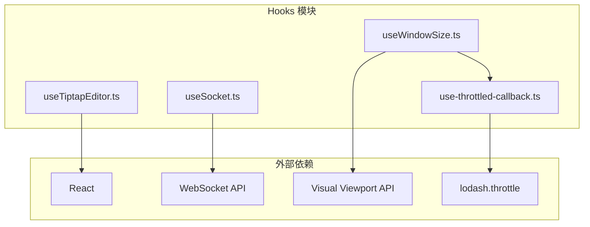
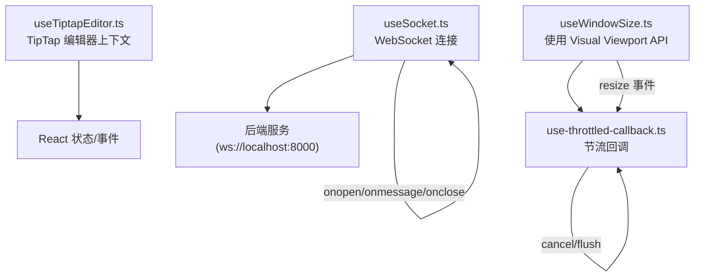
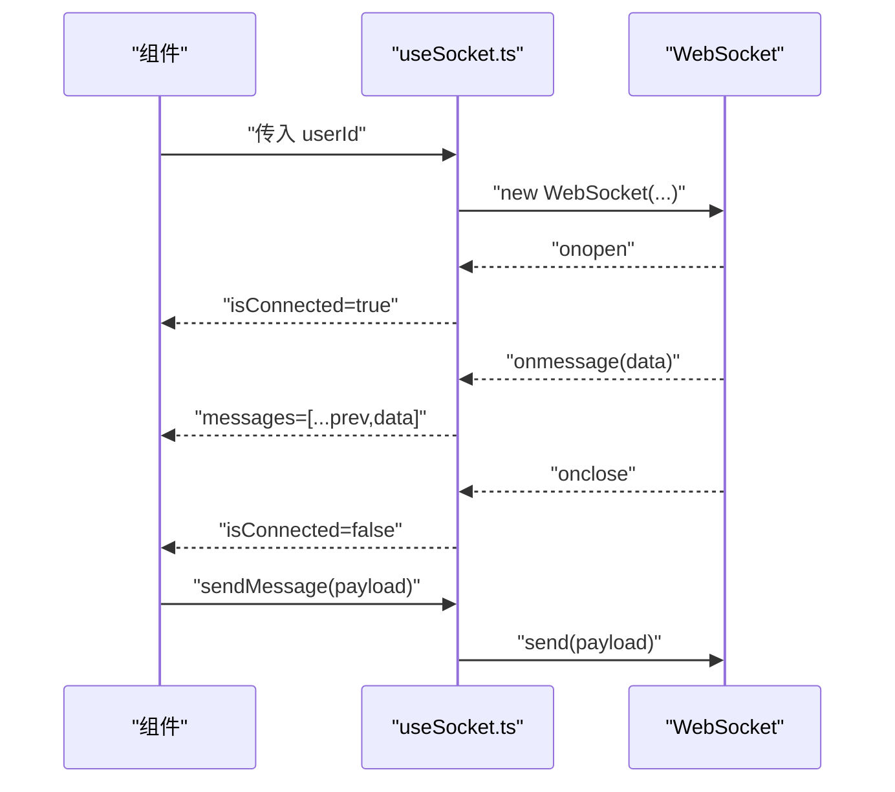
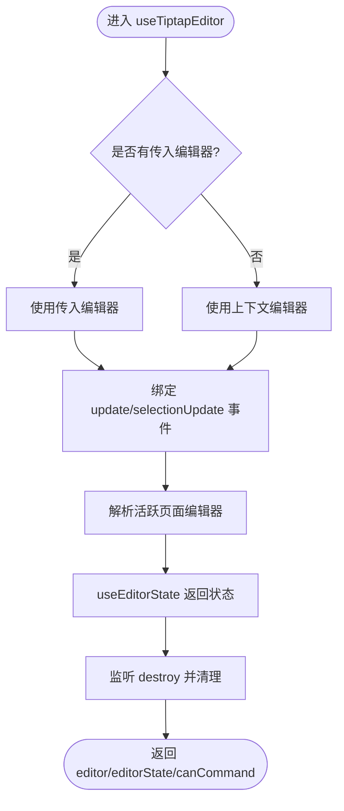
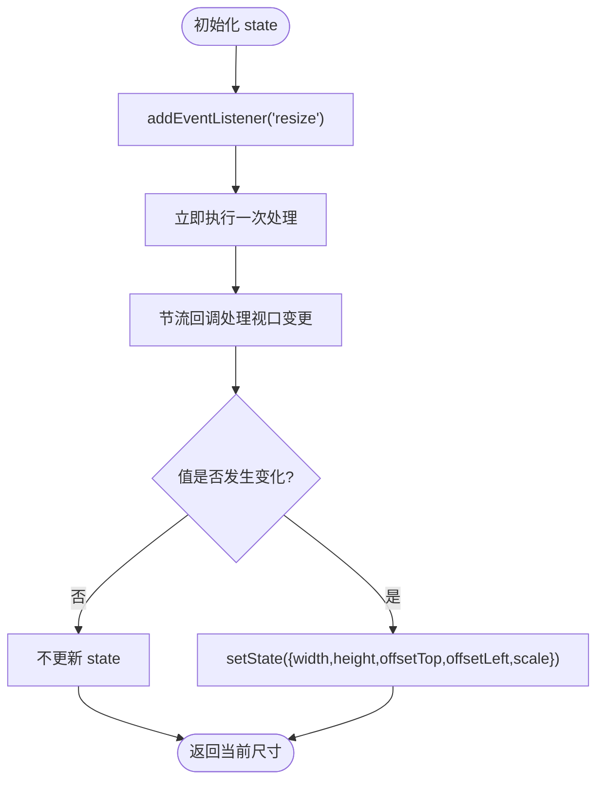
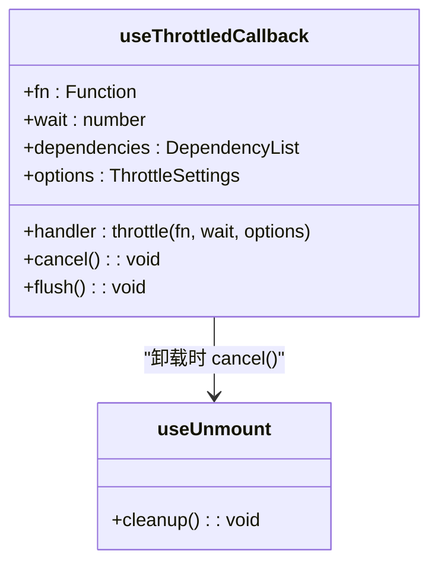
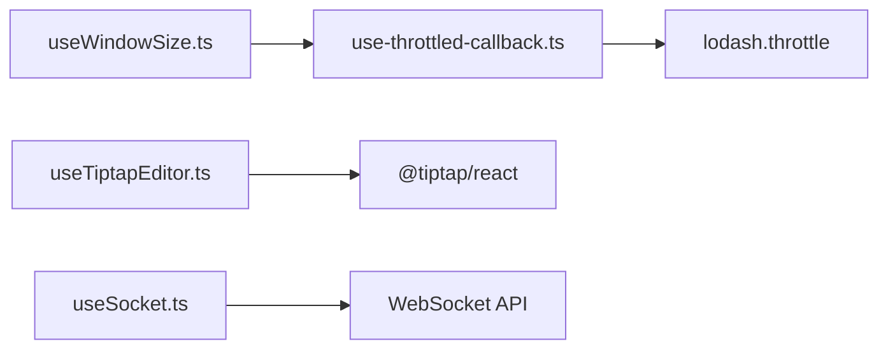

# 自定义Hook系统

<cite>
**本文引用的文件**
- [useSocket.ts](file://frontend/src/hooks/useSocket.ts)
- [useTiptapEditor.ts](file://frontend/src/hooks/useTiptapEditor.ts)
- [useWindowSize.ts](file://frontend/src/hooks/useWindowSize.ts)
- [use-throttled-callback.ts](file://frontend/src/hooks/use-throttled-callback.ts)
</cite>

## 目录
1. [简介](#简介)
2. [项目结构](#项目结构)
3. [核心组件](#核心组件)
4. [架构总览](#架构总览)
5. [详细组件分析](#详细组件分析)
6. [依赖关系分析](#依赖关系分析)
7. [性能考量](#性能考量)
8. [故障排查指南](#故障排查指南)
9. [结论](#结论)
10. [附录](#附录)

## 简介
本文件聚焦于 KunFlix 前端的自定义 Hook 系统，围绕以下关键能力进行深入解析与实践指导：
- 实时通信 Hook（useSocket）：基于浏览器原生 WebSocket 的连接管理、消息处理与生命周期清理。
- 富文本编辑 Hook（useTiptapEditor）：基于 TipTap 的编辑器实例选择、状态同步与命令可用性查询。
- 窗口尺寸 Hook（useWindowSize）：使用 Visual Viewport API 获取精确尺寸与偏移，并通过回调节流优化性能。
- 回调节流 Hook（useThrottledCallback）：对高频事件回调进行节流封装，支持取消与刷新。

同时，文档提供设计模式、复用策略与测试建议，帮助团队在复杂交互场景中稳定、高效地构建前端功能。

## 项目结构
自定义 Hook 集中位于前端工程的 hooks 目录下，采用按职责拆分的方式组织：
- useSocket.ts：WebSocket 连接与消息收发。
- useTiptapEditor.ts：TipTap 编辑器上下文与状态选择。
- useWindowSize.ts：窗口尺寸与视口信息的获取与节流更新。
- use-throttled-callback.ts：通用节流回调封装。

**图表来源**
- [useSocket.ts:1-43](file://frontend/src/hooks/useSocket.ts#L1-L43)
- [useTiptapEditor.ts:1-71](file://frontend/src/hooks/useTiptapEditor.ts#L1-L71)
- [useWindowSize.ts:1-94](file://frontend/src/hooks/useWindowSize.ts#L1-L94)
- [use-throttled-callback.ts:1-49](file://frontend/src/hooks/use-throttled-callback.ts#L1-L49)

**章节来源**
- [useSocket.ts:1-43](file://frontend/src/hooks/useSocket.ts#L1-L43)
- [useTiptapEditor.ts:1-71](file://frontend/src/hooks/useTiptapEditor.ts#L1-L71)
- [useWindowSize.ts:1-94](file://frontend/src/hooks/useWindowSize.ts#L1-L94)
- [use-throttled-callback.ts:1-49](file://frontend/src/hooks/use-throttled-callback.ts#L1-L49)

## 核心组件
本节概览四个核心 Hook 的职责边界与典型用法：
- useSocket：建立与后端的 WebSocket 连接，维护连接状态与消息队列，提供发送消息的能力；在组件卸载时自动关闭连接。
- useTiptapEditor：从 TipTap 上下文中提取当前活跃编辑器实例，监听编辑器更新与选区变化，返回可执行命令与编辑器状态。
- useWindowSize：通过 Visual Viewport API 获取窗口可视区域尺寸、偏移与缩放比例，使用节流回调避免频繁重绘。
- useThrottledCallback：对任意回调函数进行节流包装，暴露 cancel 与 flush 能力，确保在组件卸载时清理定时器。

**章节来源**
- [useSocket.ts:3-42](file://frontend/src/hooks/useSocket.ts#L3-L42)
- [useTiptapEditor.ts:13-70](file://frontend/src/hooks/useTiptapEditor.ts#L13-L70)
- [useWindowSize.ts:41-93](file://frontend/src/hooks/useWindowSize.ts#L41-L93)
- [use-throttled-callback.ts:25-46](file://frontend/src/hooks/use-throttled-callback.ts#L25-L46)

## 架构总览
四个 Hook 在应用中的协作关系如下：
- useWindowSize 依赖 useThrottledCallback 对视口变更事件进行节流处理。
- useTiptapEditor 依赖 TipTap 提供的上下文与事件，向调用方暴露编辑器状态与命令能力。
- useSocket 独立运行，负责 WebSocket 生命周期与消息队列，不直接依赖其他 Hook。
- useThrottledCallback 作为通用工具，被多个场景复用以提升性能稳定性。

**图表来源**
- [useWindowSize.ts:50-90](file://frontend/src/hooks/useWindowSize.ts#L50-L90)
- [use-throttled-callback.ts:35-46](file://frontend/src/hooks/use-throttled-callback.ts#L35-L46)
- [useTiptapEditor.ts:18-67](file://frontend/src/hooks/useTiptapEditor.ts#L18-L67)
- [useSocket.ts:8-33](file://frontend/src/hooks/useSocket.ts#L8-L33)

## 详细组件分析

### 实时通信 Hook：useSocket
- 连接管理
  - 在依赖 userId 变化时创建 WebSocket 连接，连接成功后设置连接状态为已连接。
  - 组件卸载时主动关闭连接，防止资源泄漏。
- 消息处理
  - 监听消息事件，将新消息追加到消息数组，保持历史消息的顺序。
- 错误与异常恢复
  - 通过 onclose 事件更新连接状态；若网络中断或服务端断开，上层可据此触发重连策略（例如指数退避）。
- 发送消息
  - 提供 sendMessage 方法，在连接打开时发送消息；调用方需自行保证消息格式与序列化。

**图表来源**
- [useSocket.ts:8-39](file://frontend/src/hooks/useSocket.ts#L8-L39)

**章节来源**
- [useSocket.ts:3-42](file://frontend/src/hooks/useSocket.ts#L3-L42)

### 富文本编辑 Hook：useTiptapEditor
- 编辑器初始化与选择
  - 优先使用传入的编辑器实例，否则回退到当前上下文中的编辑器。
  - 通过内部逻辑识别“活跃页面编辑器”，并在更新与选区变化时同步该实例。
- 内容同步与状态查询
  - 订阅编辑器的 update 与 selectionUpdate 事件，触发状态更新。
  - 使用 useEditorState 返回 editor、editorState 与 canCommand，便于 UI 快速判断命令可用性。
- 生命周期与清理
  - 监听活跃编辑器的 destroy 事件，及时释放引用，避免内存泄漏。

**图表来源**
- [useTiptapEditor.ts:18-67](file://frontend/src/hooks/useTiptapEditor.ts#L18-L67)

**章节来源**
- [useTiptapEditor.ts:13-70](file://frontend/src/hooks/useTiptapEditor.ts#L13-L70)

### 窗口尺寸 Hook：useWindowSize
- 视口信息获取
  - 使用 window.visualViewport 获取 width、height、offsetTop、offsetLeft、scale 等信息。
- 节流优化
  - 将变更处理函数通过 useThrottledCallback 包装，默认等待 200ms，减少 resize 高频触发导致的重排压力。
- 性能保护
  - 在 setState 前对比新旧值，仅在确有变化时更新，避免不必要的渲染。
- 组件适配
  - 返回的对象字段可用于布局计算、键盘遮挡规避与缩放适配等场景。

**图表来源**
- [useWindowSize.ts:50-77](file://frontend/src/hooks/useWindowSize.ts#L50-L77)
- [useWindowSize.ts:79-90](file://frontend/src/hooks/useWindowSize.ts#L79-L90)

**章节来源**
- [useWindowSize.ts:41-93](file://frontend/src/hooks/useWindowSize.ts#L41-L93)

### 回调节流 Hook：useThrottledCallback
- 功能特性
  - 对传入函数进行节流封装，支持配置 leading/trailing 行为。
  - 返回的函数具备 cancel 与 flush 能力，便于在组件卸载时清理定时器。
- 性能策略
  - 使用 useMemo 缓存节流处理器，避免每次渲染都创建新的节流实例。
  - 结合 useUnmount 在组件卸载时调用 cancel，防止内存泄漏与悬挂回调。
- 复用场景
  - 适用于高频事件（如滚动、拖拽、窗口大小变化）的回调节流，降低主线程压力。

**图表来源**
- [use-throttled-callback.ts:25-46](file://frontend/src/hooks/use-throttled-callback.ts#L25-L46)

**章节来源**
- [use-throttled-callback.ts:25-46](file://frontend/src/hooks/use-throttled-callback.ts#L25-L46)

## 依赖关系分析
- 模块内聚与耦合
  - useSocket 与 useTiptapEditor 与第三方库（WebSocket、TipTap）耦合度较高，但对外暴露的接口简洁，便于上层组合。
  - useWindowSize 与 useThrottledCallback 之间形成弱耦合，通过参数注入实现复用。
- 外部依赖
  - lodash.throttle：提供稳定的节流实现。
  - 浏览器 API：WebSocket 与 Visual Viewport API，需考虑兼容性与降级策略。

**图表来源**
- [useWindowSize.ts:4-4](file://frontend/src/hooks/useWindowSize.ts#L4-L4)
- [use-throttled-callback.ts:1-1](file://frontend/src/hooks/use-throttled-callback.ts#L1-L1)
- [useTiptapEditor.ts:3-4](file://frontend/src/hooks/useTiptapEditor.ts#L3-L4)
- [useSocket.ts:1-1](file://frontend/src/hooks/useSocket.ts#L1-L1)

**章节来源**
- [useWindowSize.ts:4-4](file://frontend/src/hooks/useWindowSize.ts#L4-L4)
- [use-throttled-callback.ts:1-1](file://frontend/src/hooks/use-throttled-callback.ts#L1-L1)
- [useTiptapEditor.ts:3-4](file://frontend/src/hooks/useTiptapEditor.ts#L3-L4)
- [useSocket.ts:1-1](file://frontend/src/hooks/useSocket.ts#L1-L1)

## 性能考量
- 节流与防抖
  - useWindowSize 默认 200ms 节流，适合大多数移动端场景；可根据业务调整 wait 参数。
  - useThrottledCallback 支持 leading/trailing 配置，平衡首尾触发需求。
- 渲染优化
  - useWindowSize 在 setState 前进行值比较，避免无意义的重渲染。
  - useTiptapEditor 仅在 update/selectionUpdate 时更新状态，降低渲染频率。
- 资源清理
  - useSocket 在卸载时关闭连接；useThrottledCallback 在卸载时 cancel 定时器，防止内存泄漏。

[本节为通用性能建议，无需特定文件引用]

## 故障排查指南
- WebSocket 连接问题
  - 确认 userId 非空且后端 WebSocket 地址可达；检查 onerror 与 onclose 分支的错误日志。
  - 若出现频繁断线，可在上层实现指数退避重连策略。
- TipTap 编辑器状态不同步
  - 检查是否正确传入编辑器实例；确认 update/selectionUpdate 事件是否被正常绑定与解绑。
  - 若存在多编辑器实例，需确保活跃编辑器解析逻辑正确。
- 窗口尺寸异常
  - 在不支持 visualViewport 的环境中，需提供降级方案；同时关注移动端键盘弹出导致的尺寸变化。
- 节流回调未释放
  - 确保组件卸载时调用返回的 cancel；必要时在 effect cleanup 中显式调用。

**章节来源**
- [useSocket.ts:8-33](file://frontend/src/hooks/useSocket.ts#L8-L33)
- [useTiptapEditor.ts:23-52](file://frontend/src/hooks/useTiptapEditor.ts#L23-L52)
- [useWindowSize.ts:79-90](file://frontend/src/hooks/useWindowSize.ts#L79-L90)
- [use-throttled-callback.ts:41-43](file://frontend/src/hooks/use-throttled-callback.ts#L41-L43)

## 结论
本自定义 Hook 系统通过模块化设计实现了高内聚、低耦合的复用能力：
- useSocket 提供可靠的实时通信基础；
- useTiptapEditor 为富文本场景提供稳定的上下文与状态；
- useWindowSize 与 useThrottledCallback 共同保障了响应式与性能；
- 设计模式强调“最小暴露面、清晰生命周期、可测试性”，便于在复杂业务中快速迭代与维护。

[本节为总结性内容，无需特定文件引用]

## 附录
- 设计模式与最佳实践
  - 单一职责：每个 Hook 只做一件事，避免过度聚合。
  - 明确生命周期：在 useEffect 的 cleanup 中释放资源。
  - 可测试性：将副作用隔离在 Hook 内部，通过返回值与回调暴露行为。
- 复用策略
  - 将通用逻辑抽象为独立 Hook，如节流、防抖、资源清理等。
  - 通过参数化与可选依赖提升灵活性。
- 测试方法
  - 使用 React Testing Library 或类似框架模拟事件（如 resize、WebSocket 事件）。
  - 对返回值（如 isConnected、messages、editorState）进行断言。
  - 对副作用（如连接创建/销毁、事件监听器注册/移除）进行验证。

[本节为通用指导，无需特定文件引用]