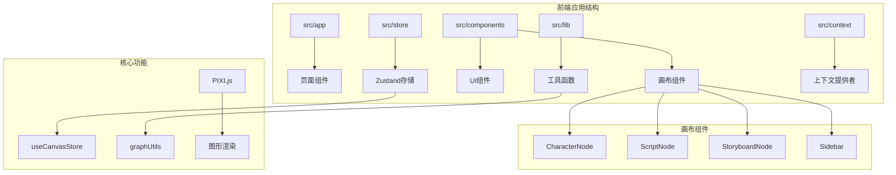
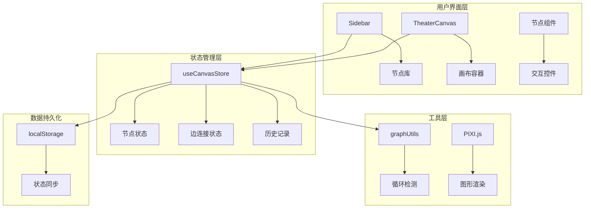
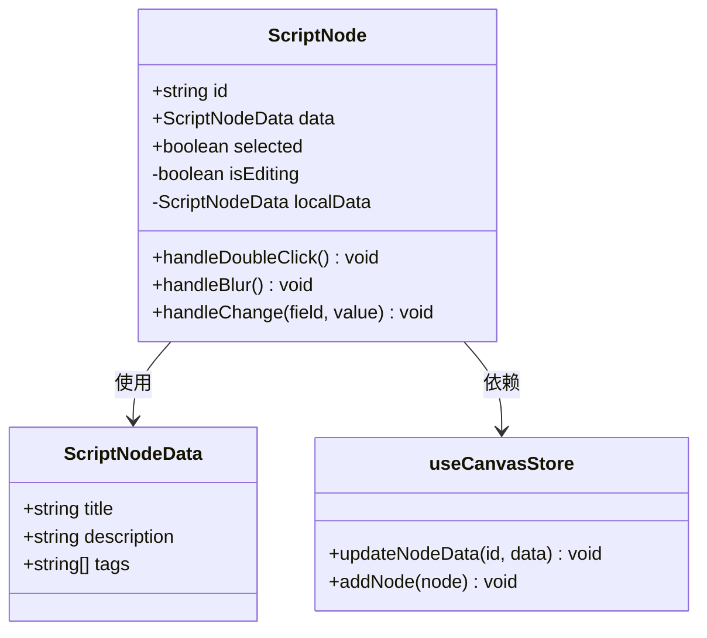
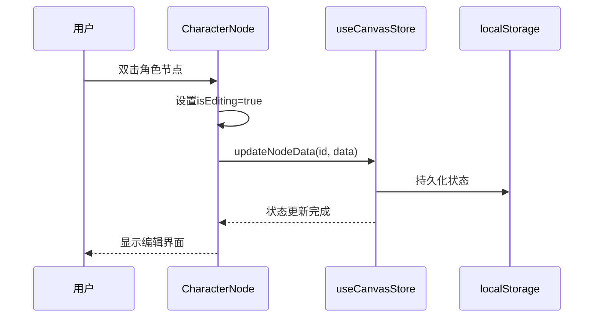
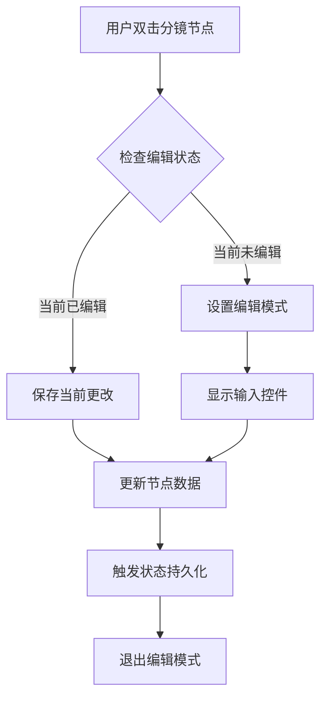
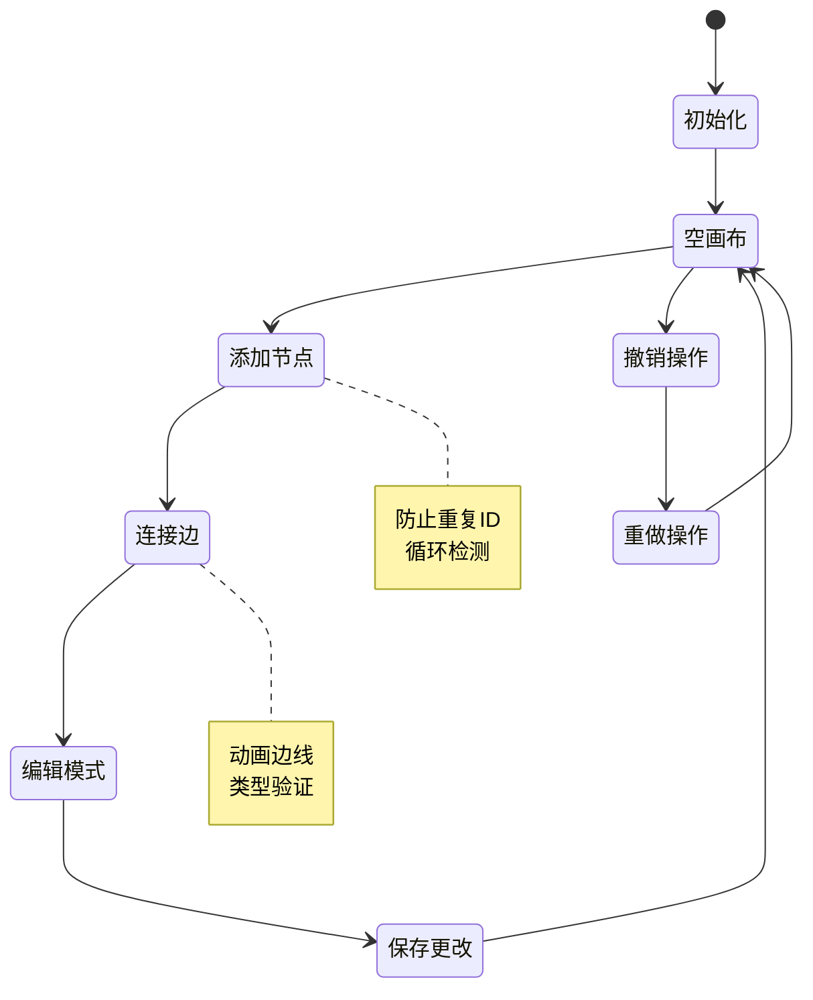
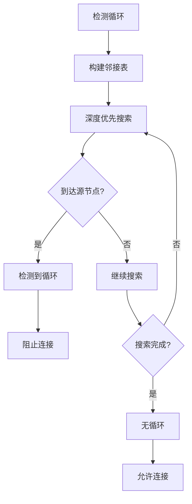

# 画布故事编辑器

<cite>
**本文档引用的文件**
- [CharacterNode.tsx](file://frontend/src/components/canvas/CharacterNode.tsx)
- [ScriptNode.tsx](file://frontend/src/components/canvas/ScriptNode.tsx)
- [StoryboardNode.tsx](file://frontend/src/components/canvas/StoryboardNode.tsx)
- [useCanvasStore.ts](file://frontend/src/store/useCanvasStore.ts)
- [graphUtils.ts](file://frontend/src/lib/graphUtils.ts)
- [Sidebar.tsx](file://frontend/src/components/canvas/Sidebar.tsx)
- [TheaterCanvas.tsx](file://frontend/src/components/TheaterCanvas.tsx)
- [package.json](file://frontend/package.json)
- [layout.tsx](file://frontend/src/app/layout.tsx)
- [page.tsx](file://frontend/src/app/page.tsx)
- [CreateTheaterCard.tsx](file://frontend/src/components/home/CreateTheaterCard.tsx)
</cite>

## 目录
1. [简介](#简介)
2. [项目结构](#项目结构)
3. [核心组件](#核心组件)
4. [架构概览](#架构概览)
5. [详细组件分析](#详细组件分析)
6. [依赖关系分析](#依赖关系分析)
7. [性能考虑](#性能考虑)
8. [故障排除指南](#故障排除指南)
9. [结论](#结论)

## 简介

画布故事编辑器是一个基于React和Next.js构建的AI驱动叙事创作工具，允许用户通过可视化画布界面创建和管理故事内容。该系统提供了三种核心节点类型：剧本节点、角色节点和分镜节点，支持实时协作编辑、撤销重做功能以及循环检测机制。

系统采用现代前端技术栈，包括@xyflow/react用于图形化编辑、Zustand状态管理、Tailwind CSS样式框架，以及PIXI.js用于图形渲染。用户可以通过拖放操作在画布上创建复杂的故事结构，并实时预览效果。

## 项目结构

前端项目采用模块化架构设计，主要包含以下核心目录：



**图表来源**
- [layout.tsx:1-42](file://frontend/src/app/layout.tsx#L1-L42)
- [page.tsx:1-19](file://frontend/src/app/page.tsx#L1-L19)

**章节来源**
- [layout.tsx:1-42](file://frontend/src/app/layout.tsx#L1-L42)
- [page.tsx:1-19](file://frontend/src/app/page.tsx#L1-L19)

## 核心组件

### 节点数据模型

系统定义了三种核心节点类型的数据结构：

| 节点类型 | 数据字段 | 描述 |
|---------|----------|------|
| 剧本节点 | title, description, tags | 存储故事的主要内容和标签信息 |
| 角色节点 | name, description, avatar | 管理角色的基本信息和头像 |
| 分镜节点 | shotNumber, description, duration | 记录镜头编号、视觉描述和持续时间 |

### 状态管理架构

使用Zustand实现集中式状态管理，支持以下核心功能：
- 实时节点和边的状态更新
- 撤销/重做历史记录管理
- 本地存储持久化
- 循环检测防止

**章节来源**
- [useCanvasStore.ts:20-67](file://frontend/src/store/useCanvasStore.ts#L20-L67)
- [useCanvasStore.ts:71-211](file://frontend/src/store/useCanvasStore.ts#L71-L211)

## 架构概览

系统采用分层架构设计，确保各组件职责清晰分离：



**图表来源**
- [Sidebar.tsx:1-52](file://frontend/src/components/canvas/Sidebar.tsx#L1-L52)
- [TheaterCanvas.tsx:1-50](file://frontend/src/components/TheaterCanvas.tsx#L1-L50)
- [useCanvasStore.ts:71-211](file://frontend/src/store/useCanvasStore.ts#L71-L211)

## 详细组件分析

### 剧本节点组件

剧本节点是故事创作的核心组件，提供完整的编辑体验：



**图表来源**
- [ScriptNode.tsx:10-90](file://frontend/src/components/canvas/ScriptNode.tsx#L10-L90)
- [useCanvasStore.ts:21-25](file://frontend/src/store/useCanvasStore.ts#L21-L25)

剧本节点支持双击编辑模式，提供输入框和文本区域进行内容修改，同时保持与全局状态的同步。

**章节来源**
- [ScriptNode.tsx:1-90](file://frontend/src/components/canvas/ScriptNode.tsx#L1-L90)

### 角色节点组件

角色节点专注于角色信息的管理和展示：



**图表来源**
- [CharacterNode.tsx:15-27](file://frontend/src/components/canvas/CharacterNode.tsx#L15-L27)
- [useCanvasStore.ts:124-134](file://frontend/src/store/useCanvasStore.ts#L124-L134)

角色节点提供头像显示、名称编辑和描述管理功能，支持头像图片的自定义。

**章节来源**
- [CharacterNode.tsx:1-76](file://frontend/src/components/canvas/CharacterNode.tsx#L1-L76)

### 分镜节点组件

分镜节点专门处理视觉描述和镜头信息：



**图表来源**
- [StoryboardNode.tsx:16-28](file://frontend/src/components/canvas/StoryboardNode.tsx#L16-L28)
- [useCanvasStore.ts:140-153](file://frontend/src/store/useCanvasStore.ts#L140-L153)

分镜节点包含镜头编号、持续时间和视觉描述功能，支持精确的时间控制。

**章节来源**
- [StoryboardNode.tsx:1-87](file://frontend/src/components/canvas/StoryboardNode.tsx#L1-L87)

### 状态管理组件

画布状态管理器是整个系统的中枢神经：



**图表来源**
- [useCanvasStore.ts:114-134](file://frontend/src/store/useCanvasStore.ts#L114-L134)
- [useCanvasStore.ts:155-179](file://frontend/src/store/useCanvasStore.ts#L155-L179)

**章节来源**
- [useCanvasStore.ts:1-211](file://frontend/src/store/useCanvasStore.ts#L1-L211)

### 图形工具函数

循环检测算法确保画布结构的合理性：



**图表来源**
- [graphUtils.ts:4-38](file://frontend/src/lib/graphUtils.ts#L4-L38)

**章节来源**
- [graphUtils.ts:1-39](file://frontend/src/lib/graphUtils.ts#L1-L39)

## 依赖关系分析

系统依赖关系清晰明确，遵循单一职责原则：

```mermaid
graph LR
subgraph "外部依赖"
A[@xyflow/react] --> B[图形编辑]
C[zustand] --> D[状态管理]
E[tailwindcss] --> F[样式框架]
G[pixi.js] --> H[图形渲染]
I[lucide-react] --> J[图标库]
end
subgraph "内部模块"
K[useCanvasStore] --> L[状态逻辑]
M[graphUtils] --> N[算法工具]
O[节点组件] --> P[UI逻辑]
end
subgraph "应用集成"
Q[layout.tsx] --> R[全局配置]
S[page.tsx] --> T[页面路由]
U[CreateTheaterCard] --> V[用户交互]
end
K --> L
M --> N
O --> P
Q --> R
S --> T
U --> V
```

**图表来源**
- [package.json:11-34](file://frontend/package.json#L11-L34)
- [layout.tsx:23-41](file://frontend/src/app/layout.tsx#L23-L41)

**章节来源**
- [package.json:1-54](file://frontend/package.json#L1-L54)

## 性能考虑

系统在多个层面实现了性能优化策略：

### 状态管理优化
- 使用局部状态缓存减少不必要的全局更新
- 智能的快照机制限制历史记录数量
- 防抖处理避免频繁的状态变更

### 渲染性能
- React.memo包装组件防止不必要重渲染
- 条件渲染优化DOM树结构
- 懒加载PIXI.js确保客户端环境

### 内存管理
- 组件卸载时自动清理PIXI应用实例
- 历史记录存储限制防止内存泄漏
- 唯一性检查避免重复节点

## 故障排除指南

### 常见问题及解决方案

**问题1：节点无法连接**
- 检查是否形成循环依赖
- 确认源节点和目标节点不是同一节点
- 验证连接类型是否正确

**问题2：编辑模式异常**
- 确保双击事件正确触发
- 检查本地状态同步机制
- 验证状态持久化是否正常

**问题3：画布渲染问题**
- 确认PIXI.js动态导入成功
- 检查画布尺寸参数
- 验证客户端环境支持

**章节来源**
- [useCanvasStore.ts:96-112](file://frontend/src/store/useCanvasStore.ts#L96-L112)
- [TheaterCanvas.tsx:14-44](file://frontend/src/components/TheaterCanvas.tsx#L14-L44)

## 结论

画布故事编辑器是一个功能完整、架构清晰的可视化叙事创作平台。通过精心设计的组件结构和状态管理机制，系统为用户提供了流畅的创作体验。

### 主要优势
- **直观的可视化编辑**：拖放操作简化了故事结构创建
- **强大的状态管理**：Zustand提供高效的状态同步机制
- **智能的循环检测**：确保画布结构的合理性
- **响应式的用户界面**：现代化的UI设计提升用户体验

### 技术亮点
- **模块化架构**：清晰的组件分离便于维护和扩展
- **性能优化**：多层优化策略确保系统流畅运行
- **可扩展性**：灵活的设计支持未来功能扩展
- **开发友好**：完善的类型定义和错误处理机制

该系统为AI驱动的叙事创作提供了坚实的技术基础，为用户创造引人入胜的故事体验。