# 画布故事编辑器

<cite>
**本文档引用的文件**
- [AIAssistantPanel.tsx](file://frontend/src/components/canvas/AIAssistantPanel.tsx)
- [CharacterEditModal.tsx](file://frontend/src/components/canvas/CharacterEditModal.tsx)
- [StoryboardEditModal.tsx](file://frontend/src/components/canvas/StoryboardEditModal.tsx)
- [ScriptEditor.tsx](file://frontend/src/components/canvas/ScriptEditor.tsx)
- [ScriptNode.tsx](file://frontend/src/components/canvas/ScriptNode.tsx)
- [CharacterNode.tsx](file://frontend/src/components/canvas/CharacterNode.tsx)
- [StoryboardNode.tsx](file://frontend/src/components/canvas/StoryboardNode.tsx)
- [Sidebar.tsx](file://frontend/src/components/canvas/Sidebar.tsx)
- [ZoomControls.tsx](file://frontend/src/components/canvas/ZoomControls.tsx)
- [TheaterCanvas.tsx](file://frontend/src/components/TheaterCanvas.tsx)
- [useCanvasStore.ts](file://frontend/src/store/useCanvasStore.ts)
- [graphUtils.ts](file://frontend/src/lib/graphUtils.ts)
- [page.tsx](file://frontend/src/app/theater/new/page.tsx)
- [package.json](file://frontend/package.json)
- [layout.tsx](file://frontend/src/app/layout.tsx)
- [page.tsx](file://frontend/src/app/page.tsx)
- [CreateTheaterCard.tsx](file://frontend/src/components/home/CreateTheaterCard.tsx)
- [script-editor.scss](file://frontend/src/components/canvas/script-editor.scss)
</cite>

## 更新摘要
**所做更改**
- 新增ZoomControls缩放控制组件，提供精确的缩放级别调节
- 增强ScriptEditor组件为完整的Tiptap富文本编辑器，支持高级文本格式化
- 新增ScriptNode双击编辑功能，提升编辑体验
- 集成AI助手面板功能，提供实时聊天和创作辅助
- 实现模态框编辑系统，提供角色和分镜的独立编辑界面
- 增强画布状态管理，支持撤销重做和历史记录
- 优化节点编辑体验，支持双击编辑和实时保存

## 目录
1. [简介](#简介)
2. [项目结构](#项目结构)
3. [核心组件](#核心组件)
4. [架构概览](#架构概览)
5. [详细组件分析](#详细组件分析)
6. [新增功能特性](#新增功能特性)
7. [依赖关系分析](#依赖关系分析)
8. [性能考虑](#性能考虑)
9. [故障排除指南](#故障排除指南)
10. [结论](#结论)

## 简介

画布故事编辑器是一个基于React和Next.js构建的AI驱动叙事创作工具，允许用户通过可视化画布界面创建和管理故事内容。该系统提供了三种核心节点类型：剧本节点、角色节点和分镜节点，支持实时协作编辑、撤销重做功能以及循环检测机制。

**更新后的新特性**：
- **ZoomControls缩放控制**：精确的缩放级别调节，支持滑块和按钮控制
- **Tiptap富文本编辑器**：完整的富文本编辑功能，支持多种格式化选项
- **双击编辑功能**：ScriptNode支持双击直接进入编辑模式
- **AI助手面板**：集成智能创作助手，提供实时对话和创意建议
- **模态框编辑系统**：独立的编辑界面，提供更好的用户体验
- **增强状态管理**：完整的撤销重做历史记录系统
- **离线编辑支持**：智能的离线缓存和同步机制

系统采用现代前端技术栈，包括@xyflow/react用于图形化编辑、Zustand状态管理、Tailwind CSS样式框架，以及PIXI.js用于图形渲染。用户可以通过拖放操作在画布上创建复杂的故事结构，并实时预览效果。

## 项目结构

前端项目采用模块化架构设计，主要包含以下核心目录：

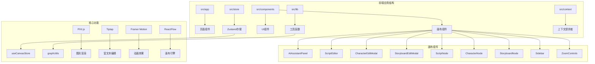

**图表来源**
- [layout.tsx:1-42](file://frontend/src/app/layout.tsx#L1-L42)
- [page.tsx:1-19](file://frontend/src/app/page.tsx#L1-L19)

**章节来源**
- [layout.tsx:1-42](file://frontend/src/app/layout.tsx#L1-L42)
- [page.tsx:1-19](file://frontend/src/app/page.tsx#L1-L19)

## 核心组件

### 节点数据模型

系统定义了三种核心节点类型的数据结构：

| 节点类型 | 数据字段 | 描述 |
|---------|----------|------|
| 剧本节点 | title, description, content, tags, characters, scenes | 存储故事的主要内容、富文本内容和标签信息 |
| 角色节点 | name, description, avatar | 管理角色的基本信息和头像 |
| 分镜节点 | shotNumber, description, duration | 记录镜头编号、视觉描述和持续时间 |

### 状态管理架构

使用Zustand实现集中式状态管理，支持以下核心功能：
- 实时节点和边的状态更新
- 撤销/重做历史记录管理
- 本地存储持久化
- 循环检测防止
- 快照机制支持版本控制

**章节来源**
- [useCanvasStore.ts:20-67](file://frontend/src/store/useCanvasStore.ts#L20-L67)
- [useCanvasStore.ts:71-211](file://frontend/src/store/useCanvasStore.ts#L71-L211)

## 架构概览

系统采用分层架构设计，确保各组件职责清晰分离：

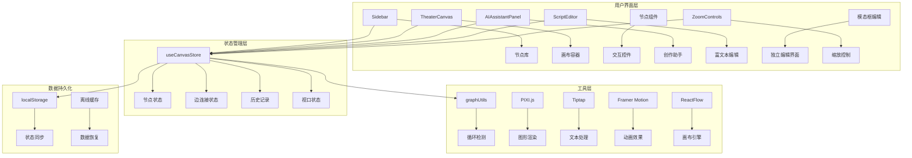

**图表来源**
- [Sidebar.tsx:1-52](file://frontend/src/components/canvas/Sidebar.tsx#L1-L52)
- [TheaterCanvas.tsx:1-50](file://frontend/src/components/TheaterCanvas.tsx#L1-L50)
- [useCanvasStore.ts:71-211](file://frontend/src/store/useCanvasStore.ts#L71-L211)

## 详细组件分析

### 剧本节点组件

剧本节点是故事创作的核心组件，提供完整的编辑体验：

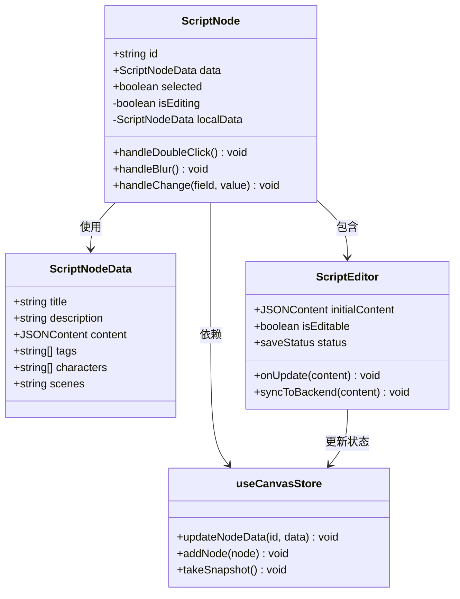

**图表来源**
- [ScriptNode.tsx:10-90](file://frontend/src/components/canvas/ScriptNode.tsx#L10-L90)
- [ScriptEditor.tsx:175-438](file://frontend/src/components/canvas/ScriptEditor.tsx#L175-L438)
- [useCanvasStore.ts:21-25](file://frontend/src/store/useCanvasStore.ts#L21-L25)

剧本节点支持双击编辑模式，集成了富文本编辑器，提供输入框和文本区域进行内容修改，同时保持与全局状态的同步。

**章节来源**
- [ScriptNode.tsx:1-182](file://frontend/src/components/canvas/ScriptNode.tsx#L1-L182)
- [ScriptEditor.tsx:1-236](file://frontend/src/components/canvas/ScriptEditor.tsx#L1-L236)

### 角色节点组件

角色节点专注于角色信息的管理和展示：

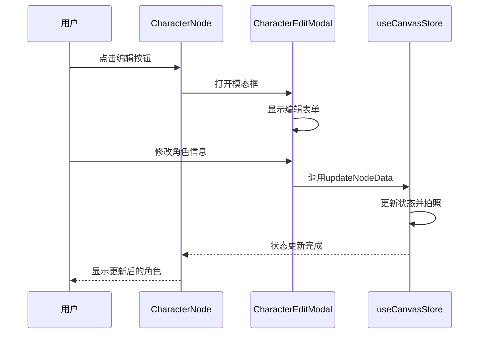

**图表来源**
- [CharacterNode.tsx:15-27](file://frontend/src/components/canvas/CharacterNode.tsx#L15-L27)
- [CharacterEditModal.tsx:15-119](file://frontend/src/components/canvas/CharacterEditModal.tsx#L15-L119)
- [useCanvasStore.ts:124-134](file://frontend/src/store/useCanvasStore.ts#L124-L134)

角色节点提供头像显示、名称编辑和描述管理功能，支持头像图片的自定义，通过模态框提供更丰富的编辑体验。

**章节来源**
- [CharacterNode.tsx:1-77](file://frontend/src/components/canvas/CharacterNode.tsx#L1-L77)
- [CharacterEditModal.tsx:1-119](file://frontend/src/components/canvas/CharacterEditModal.tsx#L1-L119)

### 分镜节点组件

分镜节点专门处理视觉描述和镜头信息：

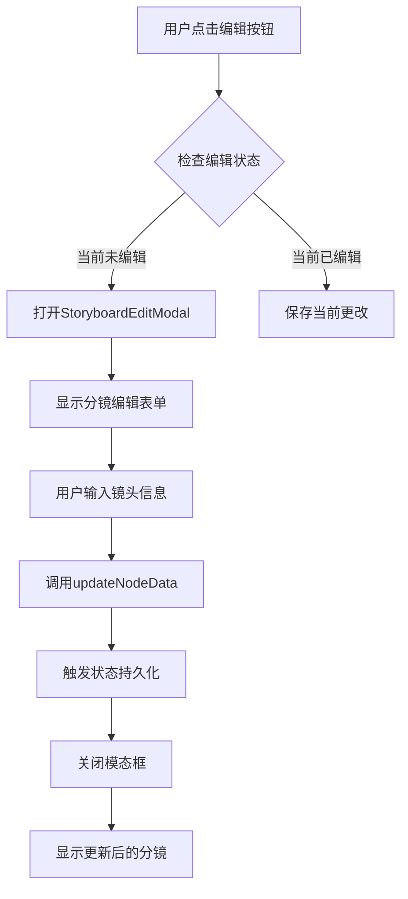

**图表来源**
- [StoryboardNode.tsx:16-28](file://frontend/src/components/canvas/StoryboardNode.tsx#L16-L28)
- [StoryboardEditModal.tsx:15-121](file://frontend/src/components/canvas/StoryboardEditModal.tsx#L15-L121)
- [useCanvasStore.ts:140-153](file://frontend/src/store/useCanvasStore.ts#L140-L153)

分镜节点包含镜头编号、持续时间和视觉描述功能，支持精确的时间控制，通过模态框提供独立的编辑界面。

**章节来源**
- [StoryboardNode.tsx:1-73](file://frontend/src/components/canvas/StoryboardNode.tsx#L1-L73)
- [StoryboardEditModal.tsx:1-121](file://frontend/src/components/canvas/StoryboardEditModal.tsx#L1-L121)

### 状态管理组件

画布状态管理器是整个系统的中枢神经：

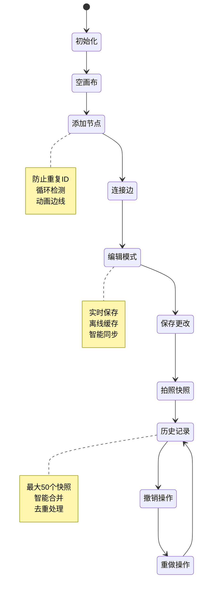

**图表来源**
- [useCanvasStore.ts:114-134](file://frontend/src/store/useCanvasStore.ts#L114-L134)
- [useCanvasStore.ts:155-179](file://frontend/src/store/useCanvasStore.ts#L155-L179)
- [useCanvasStore.ts:171-210](file://frontend/src/store/useCanvasStore.ts#L171-L210)

**章节来源**
- [useCanvasStore.ts:1-242](file://frontend/src/store/useCanvasStore.ts#L1-L242)

### 图形工具函数

循环检测算法确保画布结构的合理性：

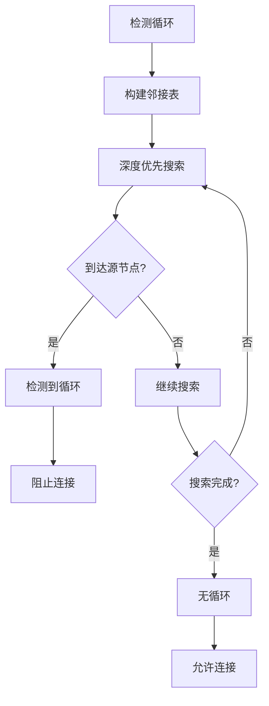

**图表来源**
- [graphUtils.ts:4-38](file://frontend/src/lib/graphUtils.ts#L4-L38)

**章节来源**
- [graphUtils.ts:1-39](file://frontend/src/lib/graphUtils.ts#L1-L39)

## 新增功能特性

### ZoomControls缩放控制

ZoomControls组件提供了精确的画布缩放控制功能：

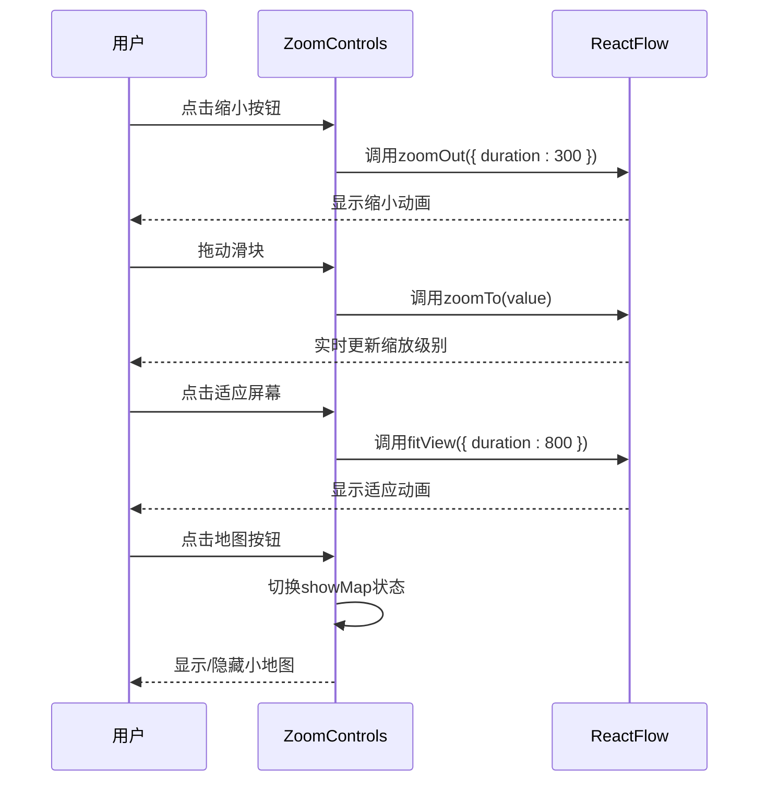

**图表来源**
- [ZoomControls.tsx:7-65](file://frontend/src/components/canvas/ZoomControls.tsx#L7-L65)

**功能特点**：
- 支持精确的缩放级别调节（0.1-4倍）
- 实时滑块控制和按钮控制
- 适应屏幕功能自动调整视图
- 小地图切换功能
- 平滑动画过渡效果

**章节来源**
- [ZoomControls.tsx:1-65](file://frontend/src/components/canvas/ZoomControls.tsx#L1-L65)

### 富文本编辑器

集成了基于Tiptap的富文本编辑功能：

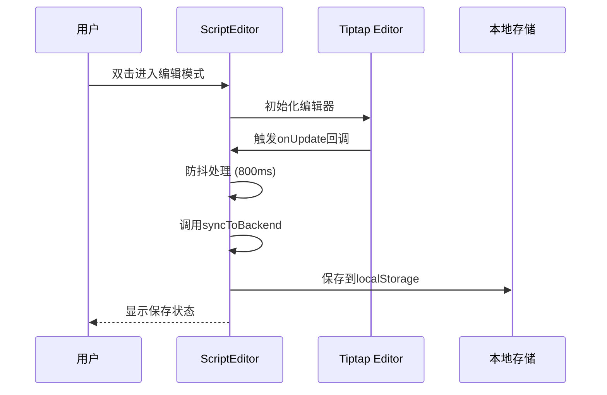

**图表来源**
- [ScriptEditor.tsx:175-438](file://frontend/src/components/canvas/ScriptEditor.tsx#L175-L438)

**功能特点**：
- 支持多种文本格式（加粗、斜体、标题等）
- 实时保存和离线缓存
- 智能防抖处理
- 完整的撤销重做支持
- 字符计数功能
- 占位符提示

**章节来源**
- [ScriptEditor.tsx:1-236](file://frontend/src/components/canvas/ScriptEditor.tsx#L1-L236)

### 双击编辑功能

ScriptNode组件新增了双击编辑功能：

```mermaid
flowchart TD
A[用户双击ScriptNode] --> B{检查编辑状态}
B --> |当前未编辑| C[切换到编辑模式]
B --> |当前已编辑| D[保持当前状态]
C --> E[显示编辑工具栏]
E --> F[激活ScriptEditor]
F --> G[启用富文本编辑]
G --> H[显示保存按钮]
H --> I[用户输入内容]
I --> J[自动保存(800ms防抖)]
J --> K[更新节点数据]
K --> L[退出编辑模式]
```

**图表来源**
- [ScriptNode.tsx:64-86](file://frontend/src/components/canvas/ScriptNode.tsx#L64-L86)

**功能特点**：
- 支持双击直接进入编辑模式
- ESC键快速退出编辑
- 点击空白处自动保存
- 实时字符计数显示
- 完整的编辑工具栏

**章节来源**
- [ScriptNode.tsx:1-182](file://frontend/src/components/canvas/ScriptNode.tsx#L1-L182)

### AI助手面板

AI助手面板提供了智能创作辅助功能：

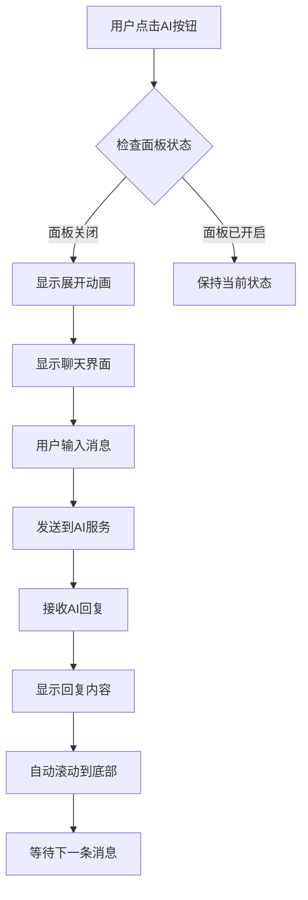

**图表来源**
- [AIAssistantPanel.tsx:7-229](file://frontend/src/components/canvas/AIAssistantPanel.tsx#L7-L229)

**功能特点**：
- 支持拖拽移动和调整大小
- 提供键盘快捷键支持（ESC关闭）
- 实时消息滚动和状态指示
- 模拟AI回复机制

**章节来源**
- [AIAssistantPanel.tsx:1-229](file://frontend/src/components/canvas/AIAssistantPanel.tsx#L1-L229)

### 模态框编辑系统

提供独立的编辑界面：

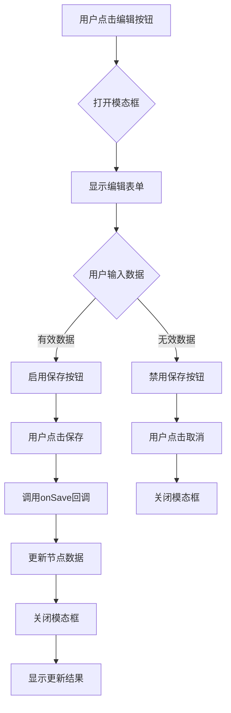

**图表来源**
- [CharacterEditModal.tsx:15-119](file://frontend/src/components/canvas/CharacterEditModal.tsx#L15-L119)
- [StoryboardEditModal.tsx:15-121](file://frontend/src/components/canvas/StoryboardEditModal.tsx#L15-L121)

**功能特点**：
- 独立的编辑界面，不影响主画布
- 自动表单验证和状态管理
- 离开时的更改确认机制
- 完整的键盘导航支持

**章节来源**
- [CharacterEditModal.tsx:1-119](file://frontend/src/components/canvas/CharacterEditModal.tsx#L1-L119)
- [StoryboardEditModal.tsx:1-121](file://frontend/src/components/canvas/StoryboardEditModal.tsx#L1-L121)

## 依赖关系分析

系统依赖关系清晰明确，遵循单一职责原则：

```mermaid
graph LR
subgraph "外部依赖"
A[@xyflow/react] --> B[图形编辑]
C[zustand] --> D[状态管理]
E[tailwindcss] --> F[样式框架]
G[pixi.js] --> H[图形渲染]
I[lucide-react] --> J[图标库]
K[framer-motion] --> L[动画效果]
M[@tiptap/react] --> N[富文本编辑]
O[@tiptap/starter-kit] --> P[编辑器扩展]
Q[@radix-ui/react-dialog] --> R[模态框组件]
S[@tiptap/extension-*] --> T[Tiptap扩展]
U[react-hotkeys-hook] --> V[键盘快捷键]
W[socket.io-client] --> X[实时通信]
end
subgraph "内部模块"
Y[useCanvasStore] --> Z[状态逻辑]
AA[graphUtils] --> BB[算法工具]
CC[节点组件] --> DD[UI逻辑]
EE[编辑器组件] --> FF[文本处理]
GG[工具组件] --> HH[辅助功能]
end
subgraph "应用集成"
II[page.tsx] --> JJ[页面路由]
KK[layout.tsx] --> LL[全局配置]
MM[CreateTheaterCard] --> NN[用户交互]
OO[TheaterCanvas] --> PP[画布渲染]
QQ[ZoomControls] --> RR[缩放控制]
SS[AIAssistantPanel] --> TT[AI助手]
UU[ScriptEditor] --> VV[富文本编辑]
WW[ScriptNode] --> XX[节点编辑]
YY[CharacterNode] --> ZZ[角色管理]
AA[StoryboardNode] --> BB[分镜管理]
CC[CharacterEditModal] --> DD[角色编辑]
EE[StoryboardEditModal] --> FF[分镜编辑]
GG[Sidebar] --> HH[节点库]
end
Y --> Z
AA --> BB
CC --> DD
EE --> FF
GG --> HH
II --> JJ
KK --> LL
MM --> NN
OO --> PP
QQ --> RR
SS --> TT
UU --> VV
WW --> XX
YY --> ZZ
AA --> BB
CC --> DD
EE --> FF
GG --> HH
```

**图表来源**
- [package.json:13-61](file://frontend/package.json#L13-L61)
- [page.tsx:160-214](file://frontend/src/app/theater/new/page.tsx#L160-L214)

**章节来源**
- [package.json:1-86](file://frontend/package.json#L1-L86)

## 性能考虑

系统在多个层面实现了性能优化策略：

### 状态管理优化
- 使用局部状态缓存减少不必要的全局更新
- 智能的快照机制限制历史记录数量（最多50个）
- 防抖处理避免频繁的状态变更（800ms延迟）
- 历史记录去重处理防止重复节点

### 渲染性能
- React.memo包装组件防止不必要重渲染
- 条件渲染优化DOM树结构
- 懒加载PIXI.js确保客户端环境
- 模态框按需渲染减少内存占用
- Tiptap编辑器惰性初始化

### 内存管理
- 组件卸载时自动清理PIXI应用实例
- 历史记录存储限制防止内存泄漏
- 唯一性检查避免重复节点
- 离线缓存智能清理机制

### 网络优化
- 智能离线检测和缓存机制
- 网络状态变化自动重试
- 防抖保存减少网络请求频率
- 错误状态优雅降级

### 缩放性能
- ReactFlow内置的高性能缩放引擎
- 滑块控制避免频繁的缩放计算
- 小地图渲染优化
- 动画帧率优化

## 故障排除指南

### 常见问题及解决方案

**问题1：节点无法连接**
- 检查是否形成循环依赖
- 确认源节点和目标节点不是同一节点
- 验证连接类型是否正确

**问题2：编辑模式异常**
- 确保双击事件正确触发
- 检查本地状态同步机制
- 验证状态持久化是否正常
- 确认Tiptap编辑器正确初始化

**问题3：AI助手面板问题**
- 检查Framer Motion动画库是否正确加载
- 确认模态框约束容器正确设置
- 验证键盘事件监听器是否正常工作

**问题4：模态框编辑问题**
- 检查Radix UI对话框组件是否正确导入
- 确认表单验证逻辑正常执行
- 验证状态更新回调是否正确调用

**问题5：富文本编辑问题**
- 检查Tiptap依赖是否正确安装
- 确认编辑器扩展配置正确
- 验证内容序列化和反序列化

**问题6：缩放控制问题**
- 检查ReactFlow实例是否正确初始化
- 确认zoomIn/zoomOut方法可用
- 验证滑块值范围设置正确
- 验证小地图渲染是否正常

**问题7：双击编辑问题**
- 检查事件冒泡是否被正确阻止
- 确认编辑状态切换逻辑正常
- 验证防抖机制是否正常工作
- 确认保存和取消功能正常

**章节来源**
- [useCanvasStore.ts:96-112](file://frontend/src/store/useCanvasStore.ts#L96-L112)
- [TheaterCanvas.tsx:14-44](file://frontend/src/components/TheaterCanvas.tsx#L14-L44)
- [AIAssistantPanel.tsx:19-28](file://frontend/src/components/canvas/AIAssistantPanel.tsx#L19-L28)
- [ZoomControls.tsx:14-24](file://frontend/src/components/canvas/ZoomControls.tsx#L14-L24)
- [ScriptNode.tsx:64-86](file://frontend/src/components/canvas/ScriptNode.tsx#L64-L86)

## 结论

画布故事编辑器经过重大升级，现已发展为一个功能完整、架构清晰的AI驱动可视化叙事创作平台。通过精心设计的组件结构和状态管理机制，系统为用户提供了前所未有的创作体验。

### 主要优势
- **精确缩放控制**：ZoomControls提供0.1-4倍的精确缩放调节
- **专业级文本编辑**：Tiptap富文本编辑器支持复杂的文本格式
- **智能编辑体验**：ScriptNode双击编辑功能提升工作效率
- **AI创作辅助**：AI助手面板提供实时创意支持
- **直观的模态框编辑**：独立编辑界面提升用户体验
- **强大的状态管理**：Zustand提供高效的状态同步机制
- **智能的循环检测**：确保画布结构的合理性
- **离线编辑支持**：智能缓存和同步机制
- **响应式的用户界面**：现代化的UI设计提升用户体验

### 技术亮点
- **模块化架构**：清晰的组件分离便于维护和扩展
- **性能优化**：多层优化策略确保系统流畅运行
- **可扩展性**：灵活的设计支持未来功能扩展
- **开发友好**：完善的类型定义和错误处理机制
- **AI集成**：先进的AI助手功能
- **富文本处理**：专业的文本编辑能力
- **状态持久化**：完整的撤销重做系统
- **缩放优化**：高性能的缩放控制机制

### 新功能价值
- **ZoomControls缩放控制**：提供精确的画布缩放调节
- **Tiptap富文本编辑器**：支持复杂的文本格式和内容组织
- **双击编辑功能**：显著提升编辑效率和用户体验
- **AI助手面板**：提供实时创作建议和灵感
- **模态框编辑系统**：提供更专业的编辑体验
- **增强状态管理**：完整的版本控制和历史记录
- **离线支持**：确保创作的连续性和可靠性

该系统为AI驱动的叙事创作提供了坚实的技术基础，为用户创造引人入胜的故事体验。通过持续的功能增强和技术优化，画布故事编辑器将继续引领可视化叙事创作的发展方向。