# 画布故事编辑器

<cite>
**本文档引用的文件**
- [AIAssistantPanel.tsx](file://frontend/src/components/canvas/AIAssistantPanel.tsx)
- [CharacterEditModal.tsx](file://frontend/src/components/canvas/CharacterEditModal.tsx)
- [StoryboardEditModal.tsx](file://frontend/src/components/canvas/StoryboardEditModal.tsx)
- [ScriptEditor.tsx](file://frontend/src/components/canvas/ScriptEditor.tsx)
- [ScriptNode.tsx](file://frontend/src/components/canvas/ScriptNode.tsx)
- [CharacterNode.tsx](file://frontend/src/components/canvas/CharacterNode.tsx)
- [StoryboardNode.tsx](file://frontend/src/components/canvas/StoryboardNode.tsx)
- [VideoNode.tsx](file://frontend/src/components/canvas/VideoNode.tsx)
- [Sidebar.tsx](file://frontend/src/components/canvas/Sidebar.tsx)
- [ZoomControls.tsx](file://frontend/src/components/canvas/ZoomControls.tsx)
- [TheaterCanvas.tsx](file://frontend/src/components/TheaterCanvas.tsx)
- [useCanvasStore.ts](file://frontend/src/store/useCanvasStore.ts)
- [graphUtils.ts](file://frontend/src/lib/graphUtils.ts)
- [page.tsx](file://frontend/src/app/theater/[id]/page.tsx)
- [useTheaterLoading.ts](file://frontend/src/app/theater/[id]/hooks/useTheaterLoading.ts)
- [useCanvasShortcuts.ts](file://frontend/src/app/theater/[id]/hooks/useCanvasShortcuts.ts)
- [useCanvasDragDrop.ts](file://frontend/src/app/theater/[id]/hooks/useCanvasDragDrop.ts)
- [package.json](file://frontend/package.json)
- [layout.tsx](file://frontend/src/app/layout.tsx)
- [page.tsx](file://frontend/src/app/page.tsx)
- [CreateTheaterCard.tsx](file://frontend/src/components/home/CreateTheaterCard.tsx)
- [script-editor.scss](file://frontend/src/components/canvas/script-editor.scss)
- [PivotEditor.tsx](file://frontend/src/components/canvas/pivot/PivotEditor.tsx)
- [PivotDropzone.tsx](file://frontend/src/components/canvas/pivot/PivotDropzone.tsx)
- [PivotTable.tsx](file://frontend/src/components/canvas/pivot/PivotTable.tsx)
- [usePivotEngine.ts](file://frontend/src/components/canvas/pivot/usePivotEngine.ts)
- [types.ts](file://frontend/src/components/canvas/pivot/types.ts)
- [README.md](file://frontend/src/components/canvas/pivot/README.md)
</cite>

## 更新摘要
**所做更改**
- 新增模块化钩子架构，包括useTheaterLoading、useCanvasShortcuts、useCanvasDragDrop等专用钩子
- 完全替代原有的故事章节编辑器，采用剧院(canvas)编辑系统
- 增强StoryboardNode节点功能，支持全屏多维表格编辑
- 改进交互体验，新增双击编辑和全屏编辑模式
- 替换旧的模态框编辑系统，采用更直观的编辑器界面
- 新增VideoNode节点类型，支持视频媒体编辑
- 增强节点操作功能，支持复制、删除、尺寸调整等
- 新增剧院加载和保存状态管理

## 目录
1. [简介](#简介)
2. [项目结构](#项目结构)
3. [核心组件](#核心组件)
4. [架构概览](#架构概览)
5. [详细组件分析](#详细组件分析)
6. [新增功能特性](#新增功能特性)
7. [模块化钩子架构](#模块化钩子架构)
8. [依赖关系分析](#依赖关系分析)
9. [性能考虑](#性能考虑)
10. [故障排除指南](#故障排除指南)
11. [结论](#结论)

## 简介

画布故事编辑器是一个基于React和Next.js构建的AI驱动叙事创作工具，现已完全升级为剧院(canvas)编辑系统。该系统采用模块化钩子架构，提供四个核心节点类型：剧本节点、角色节点、分镜节点和多维表格节点，支持实时协作编辑、撤销重做功能以及循环检测机制。

**更新后的新特性**：
- **模块化钩子架构**：全新的useTheaterLoading、useCanvasShortcuts、useCanvasDragDrop等专用钩子
- **剧院(canvas)编辑系统**：完全替代原有的故事章节编辑器
- **增强StoryboardNode**：支持全屏多维表格编辑器，提供专业级数据分析体验
- **改进交互体验**：双击编辑、全屏模式、拖拽操作等增强功能
- **替换模态框系统**：采用更直观的编辑器界面，提升用户体验
- **VideoNode节点**：新增视频媒体节点，支持视频上传和播放
- **增强节点操作**：支持节点复制、删除、尺寸调整等高级功能
- **Web Worker计算**：高性能的后台数据处理，确保界面流畅性
- **虚拟滚动优化**：支持大量数据的高效渲染

系统采用现代前端技术栈，包括@xyflow/react用于图形化编辑、Zustand状态管理、Tailwind CSS样式框架，以及PIXI.js用于图形渲染。用户可以通过拖放操作在画布上创建复杂的故事结构，并实时预览效果。

## 项目结构

前端项目采用模块化架构设计，主要包含以下核心目录：

```mermaid
graph TB
subgraph "前端应用结构"
A[src/app] --> B[页面组件]
C[src/components] --> D[画布组件]
C --> E[UI组件]
F[src/store] --> G[Zustand存储]
H[src/lib] --> I[工具函数]
J[src/context] --> K[上下文提供者]
L[src/app/theater/[id]/hooks] --> M[模块化钩子]
end
subgraph "画布组件"
D --> L[AIAssistantPanel]
D --> M[ScriptEditor]
D --> N[CharacterEditModal]
D --> O[StoryboardEditModal]
D --> P[ScriptNode]
D --> Q[CharacterNode]
D --> R[StoryboardNode]
D --> S[Sidebar]
D --> T[ZoomControls]
D --> U[PivotEditor]
D --> V[VideoNode]
end
subgraph "核心功能"
G --> W[useCanvasStore]
I --> X[graphUtils]
Y[PIXI.js] --> Z[图形渲染]
AA[Tiptap] --> BB[富文本编辑]
CC[Framer Motion] --> DD[动画效果]
EE[ReactFlow] --> FF[画布引擎]
GG[Ant Design] --> HH[UI组件库]
II[Web Worker] --> JJ[高性能计算]
KK[虚拟滚动] --> LL[大数据渲染]
end
subgraph "模块化钩子"
M --> MM[useTheaterLoading]
M --> NN[useCanvasShortcuts]
M --> OO[useCanvasDragDrop]
end
```

**图表来源**
- [layout.tsx:1-42](file://frontend/src/app/layout.tsx#L1-L42)
- [page.tsx:1-19](file://frontend/src/app/page.tsx#L1-L19)
- [useTheaterLoading.ts:1-33](file://frontend/src/app/theater/[id]/hooks/useTheaterLoading.ts#L1-L33)
- [useCanvasShortcuts.ts:1-25](file://frontend/src/app/theater/[id]/hooks/useCanvasShortcuts.ts#L1-L25)
- [useCanvasDragDrop.ts:1-72](file://frontend/src/app/theater/[id]/hooks/useCanvasDragDrop.ts#L1-L72)

**章节来源**
- [layout.tsx:1-42](file://frontend/src/app/layout.tsx#L1-L42)
- [page.tsx:1-19](file://frontend/src/app/page.tsx#L1-L19)

## 核心组件

### 节点数据模型

系统定义了四种核心节点类型的数据结构：

| 节点类型 | 数据字段 | 描述 |
|---------|----------|------|
| 剧本节点 | title, description, content, tags, characters, scenes | 存储故事的主要内容、富文本内容和标签信息 |
| 角色节点 | name, description, avatar | 管理角色的基本信息和头像 |
| 分镜节点 | shotNumber, description, duration | 记录镜头编号、视觉描述和持续时间 |
| 多维表格节点 | pivotConfig, pivotData, rows, cols, values | 支持透视表分析和数据可视化 |
| 视频节点 | name, videoUrl, fitMode, uploading | 管理视频媒体内容和播放设置 |

### 状态管理架构

使用Zustand实现集中式状态管理，支持以下核心功能：
- 实时节点和边的状态更新
- 撤销/重做历史记录管理
- 本地存储持久化
- 循环检测防止
- 快照机制支持版本控制
- 节点数据的实时同步
- 剧院加载和保存状态管理

**章节来源**
- [useCanvasStore.ts:68-107](file://frontend/src/store/useCanvasStore.ts#L68-L107)
- [useCanvasStore.ts:178-421](file://frontend/src/store/useCanvasStore.ts#L178-L421)

## 架构概览

系统采用分层架构设计，确保各组件职责清晰分离：

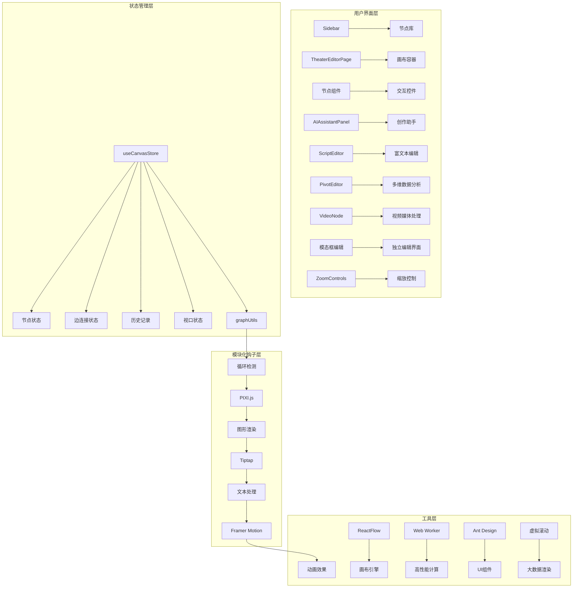

**图表来源**
- [Sidebar.tsx:1-52](file://frontend/src/components/canvas/Sidebar.tsx#L1-L52)
- [page.tsx:52-82](file://frontend/src/app/theater/[id]/page.tsx#L52-L82)
- [useCanvasStore.ts:178-421](file://frontend/src/store/useCanvasStore.ts#L178-L421)
- [useTheaterLoading.ts:6-33](file://frontend/src/app/theater/[id]/hooks/useTheaterLoading.ts#L6-L33)

## 详细组件分析

### 剧本节点组件

剧本节点是故事创作的核心组件，提供完整的编辑体验：

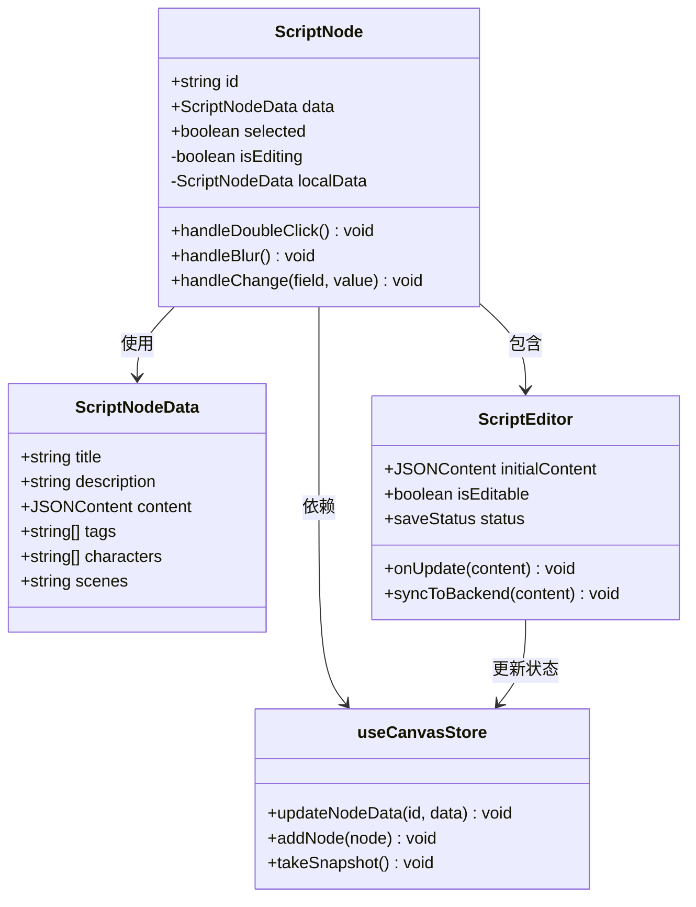

**图表来源**
- [ScriptNode.tsx:10-90](file://frontend/src/components/canvas/ScriptNode.tsx#L10-L90)
- [ScriptEditor.tsx:175-438](file://frontend/src/components/canvas/ScriptEditor.tsx#L175-L438)
- [useCanvasStore.ts:280-288](file://frontend/src/store/useCanvasStore.ts#L280-L288)

剧本节点支持双击编辑模式，集成了富文本编辑器，提供输入框和文本区域进行内容修改，同时保持与全局状态的同步。

**章节来源**
- [ScriptNode.tsx:1-182](file://frontend/src/components/canvas/ScriptNode.tsx#L1-L182)
- [ScriptEditor.tsx:1-236](file://frontend/src/components/canvas/ScriptEditor.tsx#L1-L236)

### 角色节点组件

角色节点专注于角色信息的管理和展示：

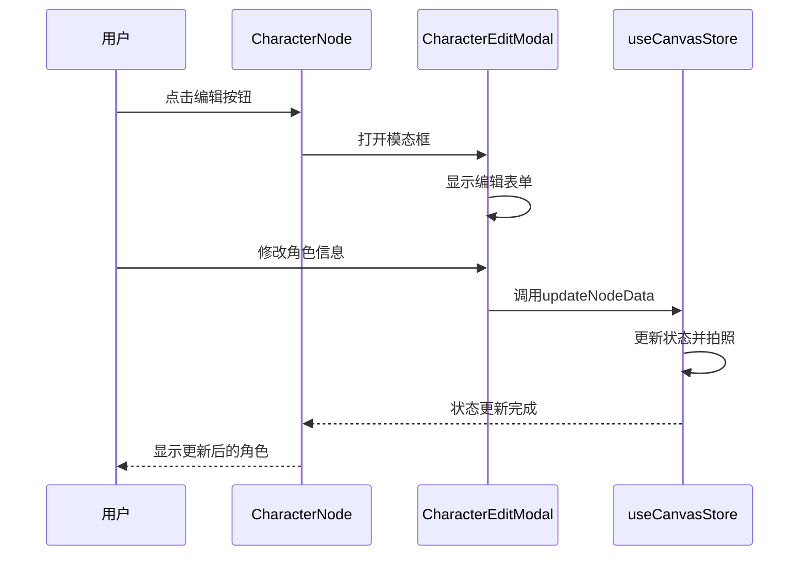

**图表来源**
- [CharacterNode.tsx:15-27](file://frontend/src/components/canvas/CharacterNode.tsx#L15-L27)
- [CharacterEditModal.tsx:15-119](file://frontend/src/components/canvas/CharacterEditModal.tsx#L15-L119)
- [useCanvasStore.ts:337-386](file://frontend/src/store/useCanvasStore.ts#L337-L386)

角色节点提供头像显示、名称编辑和描述管理功能，支持头像图片的自定义，通过模态框提供更丰富的编辑体验。

**章节来源**
- [CharacterNode.tsx:1-77](file://frontend/src/components/canvas/CharacterNode.tsx#L1-L77)
- [CharacterEditModal.tsx:1-119](file://frontend/src/components/canvas/CharacterEditModal.tsx#L1-L119)

### 分镜节点组件

分镜节点专门处理视觉描述和镜头信息：

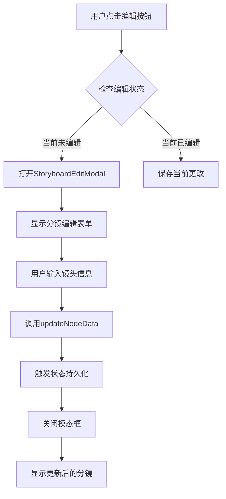

**图表来源**
- [StoryboardNode.tsx:16-28](file://frontend/src/components/canvas/StoryboardNode.tsx#L16-L28)
- [StoryboardEditModal.tsx:15-121](file://frontend/src/components/canvas/StoryboardEditModal.tsx#L15-L121)
- [useCanvasStore.ts:337-386](file://frontend/src/store/useCanvasStore.ts#L337-L386)

分镜节点包含镜头编号、持续时间和视觉描述功能，支持精确的时间控制，通过模态框提供独立的编辑界面。

**章节来源**
- [StoryboardNode.tsx:1-73](file://frontend/src/components/canvas/StoryboardNode.tsx#L1-L73)
- [StoryboardEditModal.tsx:1-121](file://frontend/src/components/canvas/StoryboardEditModal.tsx#L1-L121)

### 多维表格节点组件

多维表格节点是本次更新的核心新功能，提供强大的数据分析能力：

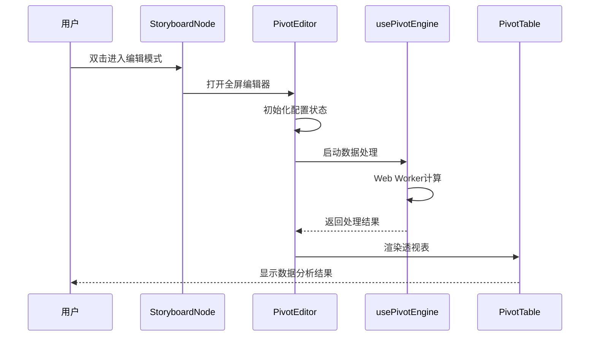

**图表来源**
- [StoryboardNode.tsx:280-307](file://frontend/src/components/canvas/StoryboardNode.tsx#L280-L307)
- [PivotEditor.tsx:22-56](file://frontend/src/components/canvas/pivot/PivotEditor.tsx#L22-L56)
- [usePivotEngine.ts:3-187](file://frontend/src/components/canvas/pivot/usePivotEngine.ts#L3-L187)

多维表格节点支持行、列、值的拖拽配置，提供多种聚合方式（求和、计数、平均值、最大值、最小值），并通过Web Worker实现高性能计算。

**章节来源**
- [StoryboardNode.tsx:1-308](file://frontend/src/components/canvas/StoryboardNode.tsx#L1-L308)
- [PivotEditor.tsx:1-229](file://frontend/src/components/canvas/pivot/PivotEditor.tsx#L1-L229)

### 视频节点组件

视频节点提供媒体内容管理功能：

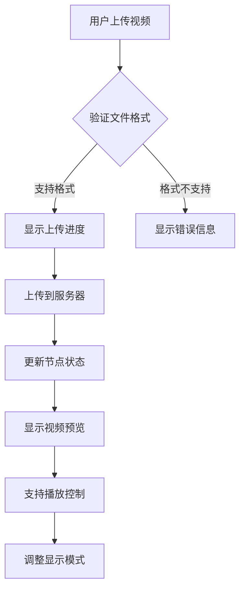

**图表来源**
- [VideoNode.tsx:107-176](file://frontend/src/components/canvas/VideoNode.tsx#L107-L176)
- [VideoNode.tsx:200-277](file://frontend/src/components/canvas/VideoNode.tsx#L200-L277)

视频节点支持MP4、WebM、OGG格式，提供50MB大小限制，支持上传进度显示、错误处理和播放控制功能。

**章节来源**
- [VideoNode.tsx:1-476](file://frontend/src/components/canvas/VideoNode.tsx#L1-L476)

### 状态管理组件

画布状态管理器是整个系统的中枢神经：

```mermaid
stateDiagram-v2
[*] --> 初始化
初始化 --> 空画布
空画布 --> 添加节点
添加节点 --> 连接边
连接边 --> 编辑模式
编辑模式 --> 保存更改
保存更改 --> 拍照快照
拍照快照 --> 历史记录
历史记录 --> 撤销操作
撤销操作 --> 重做操作
重做操作 --> 历史记录
note right of 添加节点
防止重复ID
循环检测
动画边线
节点类型管理
end note
note right of 编辑模式
实时保存
离线缓存
智能同步
节点操作
end note
note right of 历史记录
最大50个快照
智能合并
去重处理
节点状态持久化
end note
note right of 剧院状态
剧院ID管理
剧院标题
加载状态
保存状态
脏标记
end note
```

**图表来源**
- [useCanvasStore.ts:294-335](file://frontend/src/store/useCanvasStore.ts#L294-L335)
- [useCanvasStore.ts:337-386](file://frontend/src/store/useCanvasStore.ts#L337-L386)
- [useCanvasStore.ts:388-390](file://frontend/src/store/useCanvasStore.ts#L388-L390)

**章节来源**
- [useCanvasStore.ts:1-421](file://frontend/src/store/useCanvasStore.ts#L1-L421)

### 图形工具函数

循环检测算法确保画布结构的合理性：

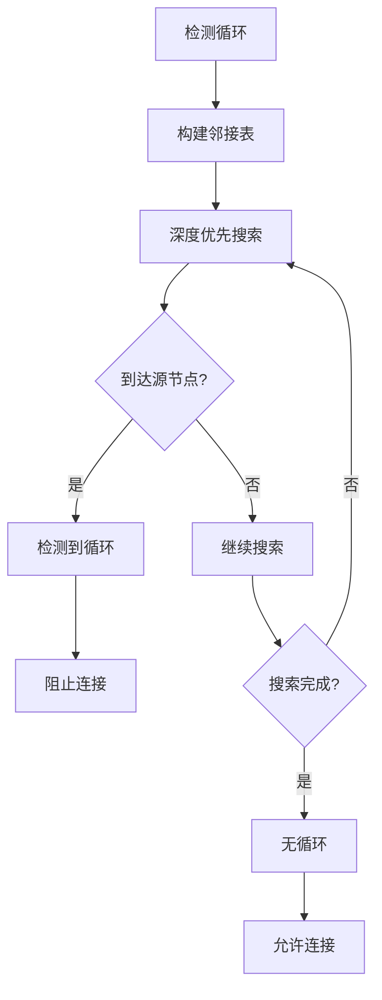

**图表来源**
- [graphUtils.ts:4-38](file://frontend/src/lib/graphUtils.ts#L4-L38)

**章节来源**
- [graphUtils.ts:1-39](file://frontend/src/lib/graphUtils.ts#L1-L39)

## 新增功能特性

### Pivot表编辑器系统

Pivot表编辑器是本次更新的核心新功能，提供专业的数据分析能力：

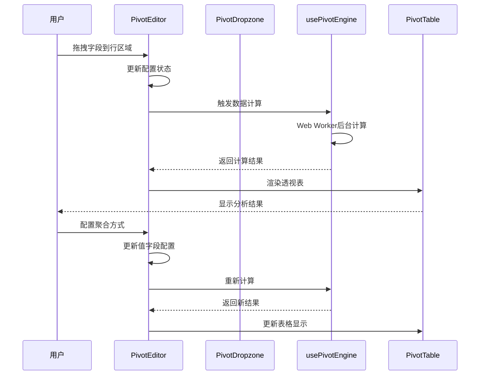

**图表来源**
- [PivotEditor.tsx:58-88](file://frontend/src/components/canvas/pivot/PivotEditor.tsx#L58-L88)
- [usePivotEngine.ts:179-184](file://frontend/src/components/canvas/pivot/usePivotEngine.ts#L179-L184)
- [PivotTable.tsx:10-46](file://frontend/src/components/canvas/pivot/PivotTable.tsx#L10-L46)

**功能特点**：
- 支持行、列、值的拖拽配置
- 多种聚合方式（求和、计数、平均值、最大值、最小值）
- Web Worker后台计算，确保界面流畅
- Ant Design虚拟滚动，支持大数据量渲染
- 全屏编辑模式，提供专业级分析体验
- 实时配置和预览功能

**章节来源**
- [PivotEditor.tsx:1-229](file://frontend/src/components/canvas/pivot/PivotEditor.tsx#L1-L229)
- [PivotDropzone.tsx:1-57](file://frontend/src/components/canvas/pivot/PivotDropzone.tsx#L1-L57)
- [PivotTable.tsx:1-63](file://frontend/src/components/canvas/pivot/PivotTable.tsx#L1-L63)
- [usePivotEngine.ts:1-188](file://frontend/src/components/canvas/pivot/usePivotEngine.ts#L1-L188)

### 增强StoryboardNode节点

StoryboardNode节点现在支持全屏多维表格编辑器：

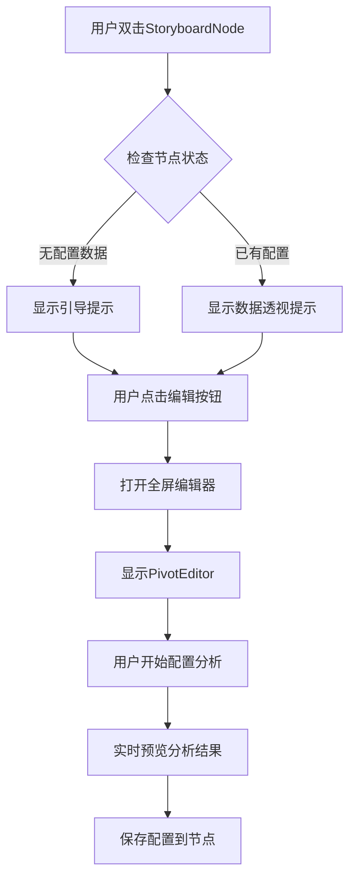

**图表来源**
- [StoryboardNode.tsx:66-69](file://frontend/src/components/canvas/StoryboardNode.tsx#L66-L69)
- [StoryboardNode.tsx:280-302](file://frontend/src/components/canvas/StoryboardNode.tsx#L280-L302)

**功能特点**：
- 支持双击直接进入编辑模式
- 全屏编辑器提供更好的用户体验
- 实时数据透视分析结果预览
- 节点操作按钮（复制、删除、全屏）
- 悬浮操作面板，提升交互便利性

**章节来源**
- [StoryboardNode.tsx:1-308](file://frontend/src/components/canvas/StoryboardNode.tsx#L1-L308)

### 改进交互体验

系统在多个方面提升了用户交互体验：

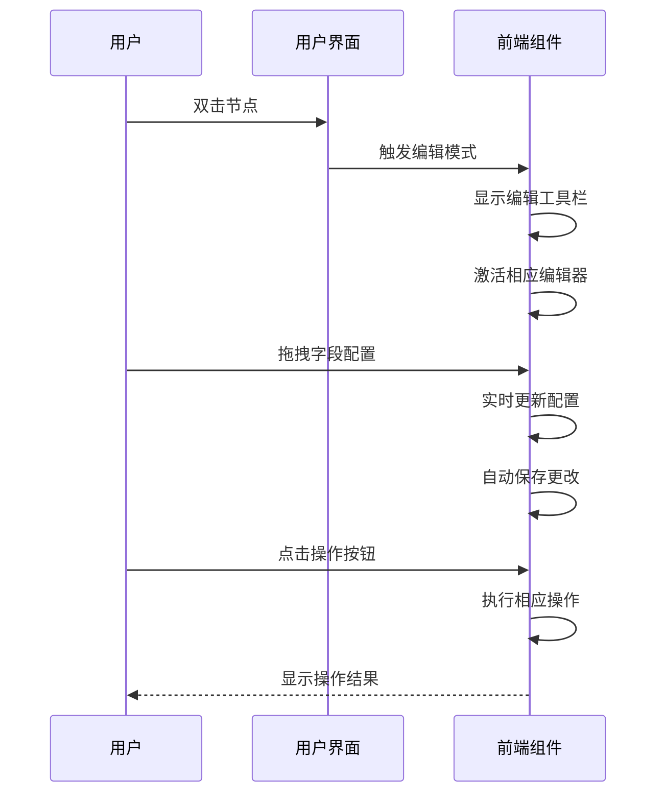

**图表来源**
- [StoryboardNode.tsx:148-176](file://frontend/src/components/canvas/StoryboardNode.tsx#L148-L176)
- [PivotEditor.tsx:160-167](file://frontend/src/components/canvas/pivot/PivotEditor.tsx#L160-L167)

**功能特点**：
- 双击编辑模式，提升编辑效率
- 全屏编辑器，提供专业级分析体验
- 实时配置和预览功能
- 悬浮操作面板，增强交互便利性
- 智能保存机制，避免数据丢失

**章节来源**
- [StoryboardNode.tsx:1-308](file://frontend/src/components/canvas/StoryboardNode.tsx#L1-L308)
- [PivotEditor.tsx:1-229](file://frontend/src/components/canvas/pivot/PivotEditor.tsx#L1-L229)

### 替换模态框编辑系统

系统采用更直观的编辑器界面替代传统的模态框编辑：

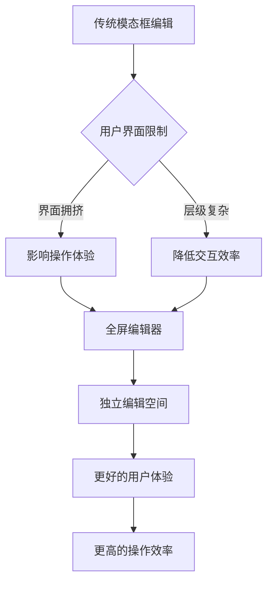

**图表来源**
- [PivotEditor.tsx:298](file://frontend/src/components/canvas/StoryboardNode.tsx#L298)

**功能特点**：
- 全屏编辑器提供更大的编辑空间
- 独立的编辑界面，不受主画布干扰
- 更好的数据分析体验
- 提升用户操作效率
- 改善视觉层次结构

**章节来源**
- [PivotEditor.tsx:1-229](file://frontend/src/components/canvas/pivot/PivotEditor.tsx#L1-L229)
- [StoryboardNode.tsx:280-307](file://frontend/src/components/canvas/StoryboardNode.tsx#L280-L307)

### 新增VideoNode节点类型

VideoNode节点提供视频媒体内容管理功能：

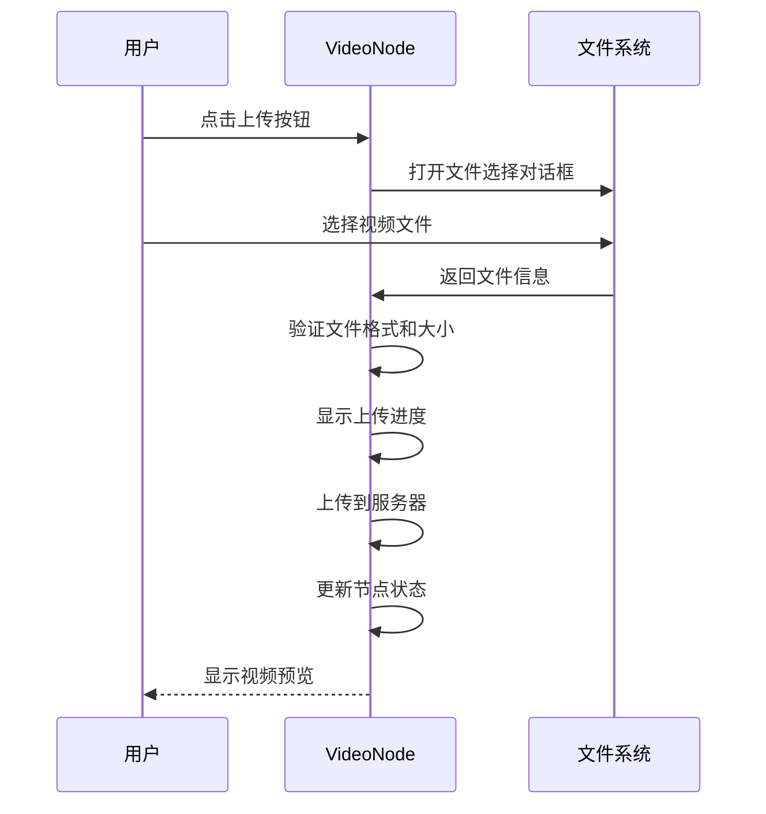

**图表来源**
- [VideoNode.tsx:102-176](file://frontend/src/components/canvas/VideoNode.tsx#L102-L176)
- [VideoNode.tsx:254-277](file://frontend/src/components/canvas/VideoNode.tsx#L254-L277)

**功能特点**：
- 支持MP4、WebM、OGG格式
- 50MB大小限制
- 上传进度显示
- 错误处理和状态反馈
- 视频播放控制
- 显示模式调整（覆盖/包含）

**章节来源**
- [VideoNode.tsx:1-476](file://frontend/src/components/canvas/VideoNode.tsx#L1-L476)

## 模块化钩子架构

系统引入了全新的模块化钩子架构，提供更清晰的职责分离和更好的可维护性：

### useTheaterLoading钩子

负责剧院的加载和状态管理：

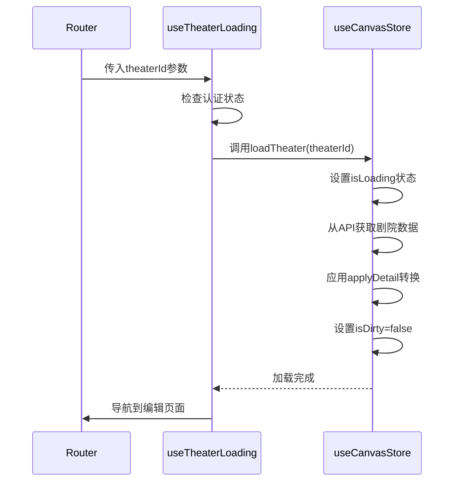

**图表来源**
- [useTheaterLoading.ts:6-33](file://frontend/src/app/theater/[id]/hooks/useTheaterLoading.ts#L6-L33)

### useCanvasShortcuts钩子

提供键盘快捷键支持：

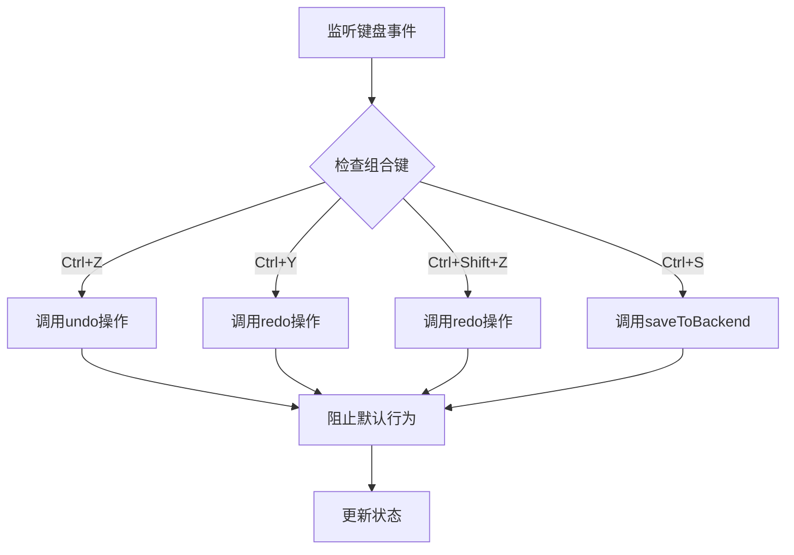

**图表来源**
- [useCanvasShortcuts.ts:4-25](file://frontend/src/app/theater/[id]/hooks/useCanvasShortcuts.ts#L4-L25)

### useCanvasDragDrop钩子

处理画布拖拽操作：

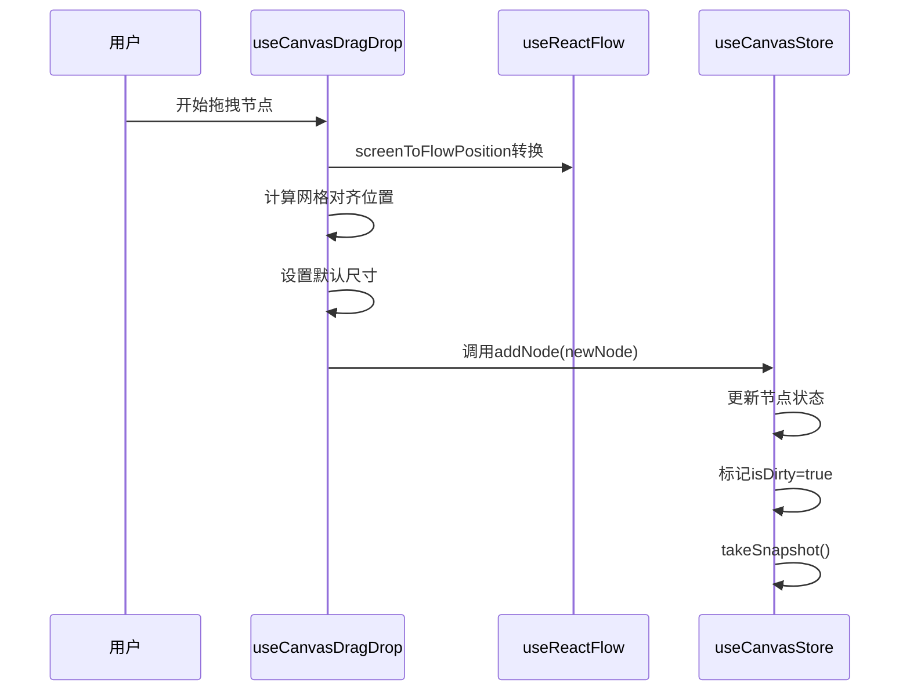

**图表来源**
- [useCanvasDragDrop.ts:6-72](file://frontend/src/app/theater/[id]/hooks/useCanvasDragDrop.ts#L6-L72)

**章节来源**
- [useTheaterLoading.ts:1-33](file://frontend/src/app/theater/[id]/hooks/useTheaterLoading.ts#L1-L33)
- [useCanvasShortcuts.ts:1-25](file://frontend/src/app/theater/[id]/hooks/useCanvasShortcuts.ts#L1-L25)
- [useCanvasDragDrop.ts:1-72](file://frontend/src/app/theater/[id]/hooks/useCanvasDragDrop.ts#L1-L72)

## 依赖关系分析

系统依赖关系清晰明确，遵循单一职责原则：

```mermaid
graph LR
subgraph "外部依赖"
A[@xyflow/react] --> B[图形编辑]
C[zustand] --> D[状态管理]
E[tailwindcss] --> F[样式框架]
G[pixi.js] --> H[图形渲染]
I[lucide-react] --> J[图标库]
K[framer-motion] --> L[动画效果]
M[@tiptap/react] --> N[富文本编辑]
O[@tiptap/starter-kit] --> P[编辑器扩展]
Q[@radix-ui/react-dialog] --> R[模态框组件]
S[antd] --> T[UI组件库]
U[socket.io-client] --> V[实时通信]
W[uuid] --> X[唯一标识符]
Y[react-hotkeys-hook] --> Z[键盘快捷键]
end
subgraph "内部模块"
AA[useCanvasStore] --> BB[状态逻辑]
CC[graphUtils] --> DD[算法工具]
EE[节点组件] --> FF[UI逻辑]
GG[编辑器组件] --> HH[文本处理]
II[工具组件] --> JJ[辅助功能]
KK[Pivot系统] --> LL[数据分析]
MM[VideoNode] --> NN[媒体处理]
OO[Web Worker] --> PP[高性能计算]
QQ[虚拟滚动] --> RR[大数据渲染]
SS[模块化钩子] --> TT[功能分离]
end
subgraph "应用集成"
UU[page.tsx] --> VV[页面路由]
WW[layout.tsx] --> XX[全局配置]
YY[CreateTheaterCard] --> ZZ[用户交互]
AA[TheaterEditorPage] --> BB[画布渲染]
CC[useTheaterLoading] --> DD[剧院加载]
EE[useCanvasShortcuts] --> FF[快捷键处理]
GG[useCanvasDragDrop] --> HH[拖拽操作]
II[AIAssistantPanel] --> JJ[AI助手]
KK[ScriptEditor] --> LL[富文本编辑]
MM[ScriptNode] --> NN[节点编辑]
OO[CharacterNode] --> PP[角色管理]
QQ[StoryboardNode] --> RR[分镜管理]
SS[CharacterEditModal] --> TT[角色编辑]
UU[StoryboardEditModal] --> VV[分镜编辑]
WW[Sidebar] --> XX[节点库]
YY[PivotEditor] --> ZZ[数据分析]
AA[VideoNode] --> BB[媒体管理]
CC[usePivotEngine] --> DD[计算引擎]
EE[PivotTable] --> FF[数据展示]
GG[PivotDropzone] --> HH[拖拽区域]
```

**图表来源**
- [package.json:13-61](file://frontend/package.json#L13-L61)
- [page.tsx:160-214](file://frontend/src/app/theater/new/page.tsx#L160-L214)

**章节来源**
- [package.json:1-86](file://frontend/package.json#L1-L86)

## 性能考虑

系统在多个层面实现了性能优化策略：

### 状态管理优化
- 使用局部状态缓存减少不必要的全局更新
- 智能的快照机制限制历史记录数量（最多50个）
- 防抖处理避免频繁的状态变更（800ms延迟）
- 历史记录去重处理防止重复节点

### 渲染性能
- React.memo包装组件防止不必要重渲染
- 条件渲染优化DOM树结构
- 懒加载PIXI.js确保客户端环境
- 模态框按需渲染减少内存占用
- Tiptap编辑器惰性初始化
- PivotTable虚拟滚动优化大数据渲染

### 内存管理
- 组件卸载时自动清理PIXI应用实例
- 历史记录存储限制防止内存泄漏
- 唯一性检查避免重复节点
- 离线缓存智能清理机制
- Web Worker自动清理资源

### 网络优化
- 智能离线检测和缓存机制
- 网络状态变化自动重试
- 防抖保存减少网络请求频率
- 错误状态优雅降级
- 视频上传进度反馈

### 缩放性能
- ReactFlow内置的高性能缩放引擎
- 滑块控制避免频繁的缩放计算
- 小地图渲染优化
- 动画帧率优化

### 数据分析性能
- Web Worker后台计算，避免阻塞主线程
- 虚拟滚动支持大量数据高效渲染
- 智能缓存机制避免重复计算
- 异步数据处理确保界面流畅

### 模块化钩子性能
- 钩子函数按需加载，避免不必要的计算
- 事件监听器在组件卸载时自动清理
- 防抖和节流机制优化用户交互响应
- 本地状态缓存减少重复计算

## 故障排除指南

### 常见问题及解决方案

**问题1：节点无法连接**
- 检查是否形成循环依赖
- 确认源节点和目标节点不是同一节点
- 验证连接类型是否正确

**问题2：编辑模式异常**
- 确保双击事件正确触发
- 检查本地状态同步机制
- 验证状态持久化是否正常
- 确认Tiptap编辑器正确初始化

**问题3：AI助手面板问题**
- 检查Framer Motion动画库是否正确加载
- 确认模态框约束容器正确设置
- 验证键盘事件监听器是否正常工作

**问题4：模态框编辑问题**
- 检查Radix UI对话框组件是否正确导入
- 确认表单验证逻辑正常执行
- 验证状态更新回调是否正确调用

**问题5：富文本编辑问题**
- 检查Tiptap依赖是否正确安装
- 确认编辑器扩展配置正确
- 验证内容序列化和反序列化

**问题6：缩放控制问题**
- 检查ReactFlow实例是否正确初始化
- 确认zoomIn/zoomOut方法可用
- 验证滑块值范围设置正确
- 验证小地图渲染是否正常

**问题7：双击编辑问题**
- 检查事件冒泡是否被正确阻止
- 确认编辑状态切换逻辑正常
- 验证防抖机制是否正常工作
- 确认保存和取消功能正常

**问题8：Pivot表编辑器问题**
- 检查Web Worker是否正确初始化
- 确认数据格式符合预期
- 验证聚合计算逻辑
- 检查虚拟滚动配置

**问题9：VideoNode上传问题**
- 检查文件格式是否受支持
- 确认文件大小是否超过限制
- 验证网络连接状态
- 检查服务器响应

**问题10：全屏编辑器问题**
- 检查CSS样式是否正确加载
- 确认z-index层级设置
- 验证键盘事件处理
- 检查响应式布局适配

**问题11：剧院加载问题**
- 检查认证状态是否正确
- 确认theaterId参数传递正确
- 验证API响应格式
- 检查网络连接状态

**问题12：快捷键响应问题**
- 检查事件监听器是否正确绑定
- 确认组合键识别逻辑
- 验证preventDefault调用
- 检查状态更新是否触发

**问题13：拖拽操作问题**
- 检查dragover事件处理
- 确认drop事件数据提取
- 验证坐标转换准确性
- 检查网格对齐逻辑

**章节来源**
- [useCanvasStore.ts:96-112](file://frontend/src/store/useCanvasStore.ts#L96-L112)
- [TheaterCanvas.tsx:14-44](file://frontend/src/components/TheaterCanvas.tsx#L14-L44)
- [AIAssistantPanel.tsx:19-28](file://frontend/src/components/canvas/AIAssistantPanel.tsx#L19-L28)
- [ZoomControls.tsx:14-24](file://frontend/src/components/canvas/ZoomControls.tsx#L14-L24)
- [ScriptNode.tsx:64-86](file://frontend/src/components/canvas/ScriptNode.tsx#L64-L86)
- [PivotEditor.tsx:170-225](file://frontend/src/components/canvas/pivot/PivotEditor.tsx#L170-L225)
- [VideoNode.tsx:111-120](file://frontend/src/components/canvas/VideoNode.tsx#L111-L120)
- [useTheaterLoading.ts:12-18](file://frontend/src/app/theater/[id]/hooks/useTheaterLoading.ts#L12-L18)
- [useCanvasShortcuts.ts:7-24](file://frontend/src/app/theater/[id]/hooks/useCanvasShortcuts.ts#L7-L24)
- [useCanvasDragDrop.ts:10-68](file://frontend/src/app/theater/[id]/hooks/useCanvasDragDrop.ts#L10-L68)

## 结论

画布故事编辑器经过重大升级，现已发展为一个功能完整、架构清晰的AI驱动可视化叙事创作平台。通过精心设计的组件结构和状态管理机制，系统为用户提供了前所未有的创作体验。

### 主要优势
- **模块化钩子架构**：全新的useTheaterLoading、useCanvasShortcuts、useCanvasDragDrop等专用钩子，提供更好的代码组织和可维护性
- **剧院(canvas)编辑系统**：完全替代原有的故事章节编辑器，提供更强大的画布编辑功能
- **Pivot表编辑器系统**：全新的多维数据分析能力，支持专业级数据可视化
- **增强StoryboardNode**：全屏编辑模式提供更好的用户体验
- **改进交互体验**：双击编辑、全屏模式、拖拽操作等增强功能
- **替换模态框系统**：采用更直观的编辑器界面
- **新增VideoNode节点**：支持视频媒体内容管理
- **增强节点操作**：支持复制、删除、尺寸调整等高级功能
- **Web Worker计算**：高性能的后台数据处理
- **虚拟滚动优化**：支持大量数据的高效渲染

### 技术亮点
- **模块化架构**：清晰的组件分离便于维护和扩展
- **性能优化**：多层优化策略确保系统流畅运行
- **可扩展性**：灵活的设计支持未来功能扩展
- **开发友好**：完善的类型定义和错误处理机制
- **AI集成**：先进的AI助手功能
- **富文本处理**：专业的文本编辑能力
- **状态持久化**：完整的撤销重做系统
- **缩放优化**：高性能的缩放控制机制
- **数据分析**：专业的多维表分析能力
- **模块化钩子**：提供更好的代码组织和复用

### 新功能价值
- **模块化钩子架构**：提供更好的代码组织、可维护性和复用性
- **剧院(canvas)编辑系统**：提供更强大的画布编辑能力和更好的用户体验
- **Pivot表编辑器系统**：提供专业的数据分析和可视化功能
- **增强StoryboardNode**：支持全屏多维表格编辑器
- **改进交互体验**：显著提升编辑效率和用户体验
- **替换模态框系统**：提供更专业的编辑体验
- **新增VideoNode节点**：扩展媒体内容管理能力
- **增强节点操作**：提供更丰富的节点管理功能
- **Web Worker优化**：确保界面流畅的高性能计算
- **虚拟滚动优化**：支持大数据量的高效渲染

该系统为AI驱动的叙事创作提供了坚实的技术基础，为用户创造引人入胜的故事体验。通过持续的功能增强和技术优化，画布故事编辑器将继续引领可视化叙事创作的发展方向。