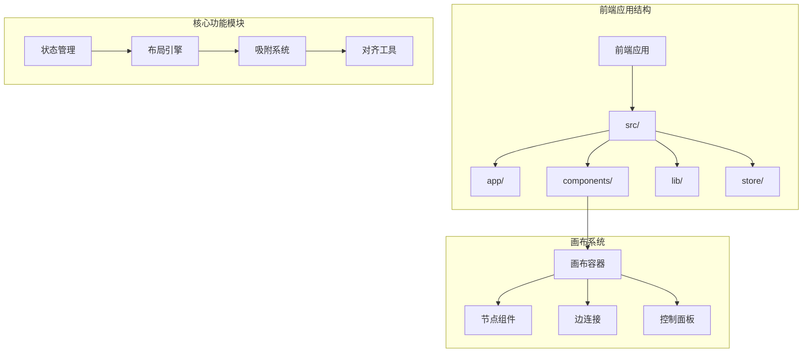
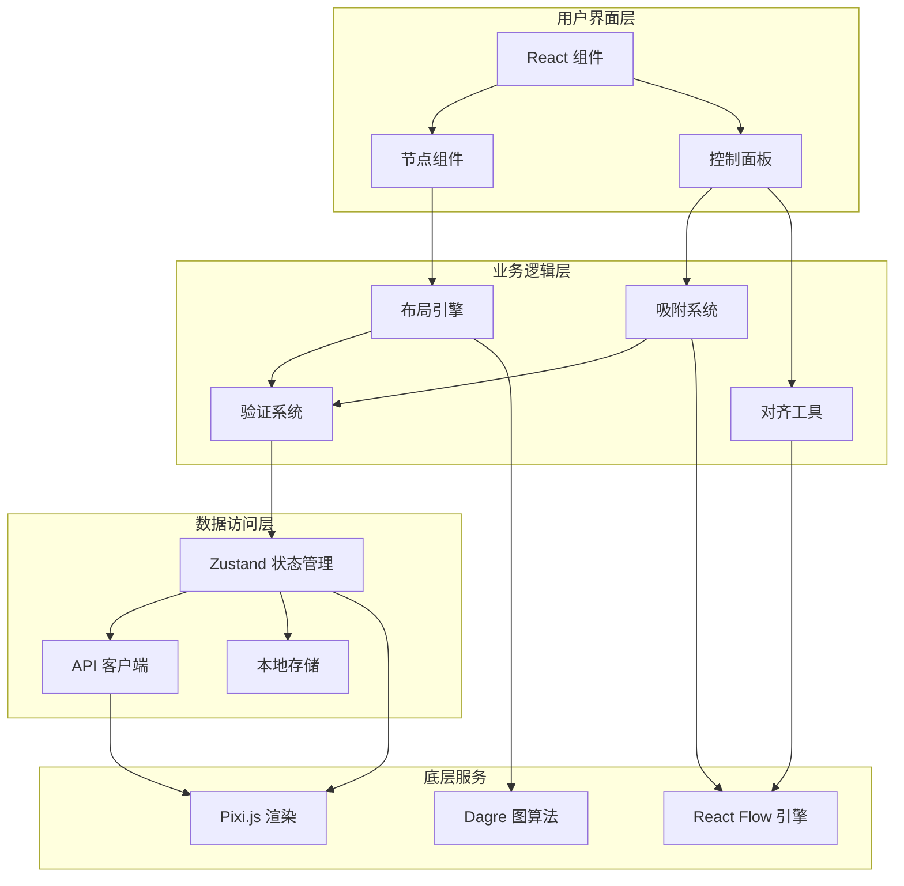
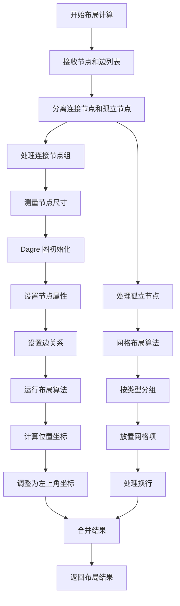
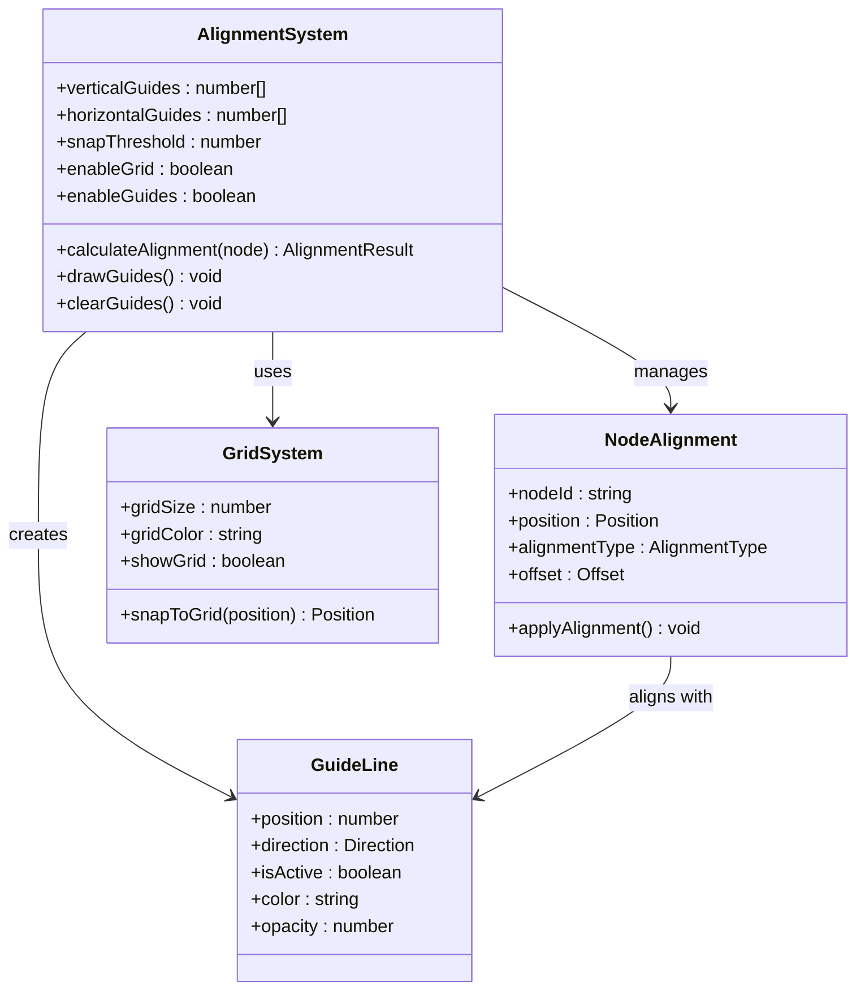
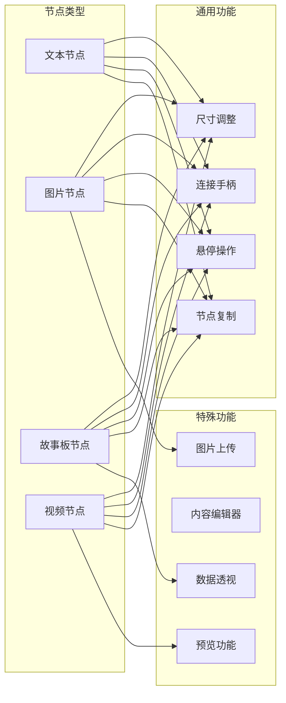
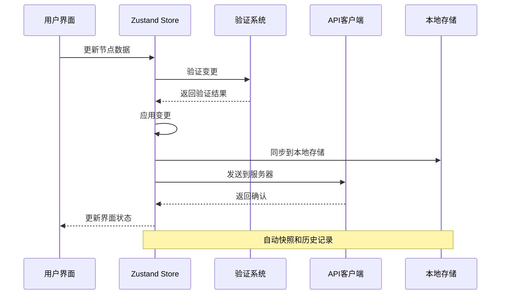

# 画布节点对齐增强

<cite>
**本文档引用的文件**
- [TheaterCanvas.tsx](file://frontend/src/components/TheaterCanvas.tsx)
- [layoutUtils.ts](file://frontend/src/lib/layoutUtils.ts)
- [useCanvasStore.ts](file://frontend/src/store/useCanvasStore.ts)
- [page.tsx](file://frontend/src/app/theater/[id]/page.tsx)
- [graphUtils.ts](file://frontend/src/lib/graphUtils.ts)
- [CharacterNode.tsx](file://frontend/src/components/canvas/CharacterNode.tsx)
- [ScriptNode.tsx](file://frontend/src/components/canvas/ScriptNode.tsx)
- [StoryboardNode.tsx](file://frontend/src/components/canvas/StoryboardNode.tsx)
</cite>

## 目录
1. [简介](#简介)
2. [项目结构](#项目结构)
3. [核心组件](#核心组件)
4. [架构概览](#架构概览)
5. [详细组件分析](#详细组件分析)
6. [依赖关系分析](#依赖关系分析)
7. [性能考虑](#性能考虑)
8. [故障排除指南](#故障排除指南)
9. [结论](#结论)

## 简介

本文档深入分析了 Infinite Game 项目中的画布节点对齐增强功能。该项目是一个基于 React 和 TypeScript 的叙事剧场创作平台，提供了强大的可视化编辑能力。画布节点对齐增强功能是该系统的核心特性之一，它通过智能的节点布局算法和对齐机制，显著提升了用户的创作体验。

该功能集成了多种先进的技术：使用 Dagre 图算法进行自动布局、实现智能网格吸附、提供视觉对齐辅助线、支持节点分组对齐等。这些特性共同构成了一个完整的节点对齐生态系统，使用户能够轻松创建专业级的叙事结构图。

## 项目结构

项目采用现代化的前端架构设计，主要分为以下几个核心部分：



**图表来源**
- [TheaterCanvas.tsx:1-50](file://frontend/src/components/TheaterCanvas.tsx#L1-L50)
- [page.tsx:1-484](file://frontend/src/app/theater/[id]/page.tsx#L1-L484)

**章节来源**
- [TheaterCanvas.tsx:1-50](file://frontend/src/components/TheaterCanvas.tsx#L1-L50)
- [page.tsx:1-484](file://frontend/src/app/theater/[id]/page.tsx#L1-L484)

## 核心组件

### 画布容器组件

画布容器是整个系统的基础设施，负责初始化和管理画布环境。它使用 Pixi.js 提供高性能的图形渲染能力，并集成了 React Flow 的交互功能。

### 布局计算引擎

布局引擎是系统的核心算法组件，基于 Dagre 图算法实现智能的节点自动布局。它能够处理复杂的节点关系网络，自动生成最优的布局方案。

### 节点类型系统

系统支持四种主要的节点类型，每种都有独特的功能和用途：
- **文本节点**：用于创建和编辑故事内容
- **角色节点**：用于管理角色信息和图像
- **故事板节点**：用于创建多维表格和数据透视
- **视频节点**：用于集成多媒体内容

### 状态管理系统

使用 Zustand 实现的状态管理，提供了高效的数据持久化和历史记录功能，确保用户的工作不会丢失。

**章节来源**
- [useCanvasStore.ts:1-540](file://frontend/src/store/useCanvasStore.ts#L1-L540)
- [layoutUtils.ts:1-127](file://frontend/src/lib/layoutUtils.ts#L1-L127)

## 架构概览

系统采用分层架构设计，各组件之间通过清晰的接口进行通信：



**图表来源**
- [page.tsx:54-484](file://frontend/src/app/theater/[id]/page.tsx#L54-L484)
- [useCanvasStore.ts:185-540](file://frontend/src/store/useCanvasStore.ts#L185-L540)

## 详细组件分析

### 布局计算系统

布局计算系统是画布对齐功能的核心，它实现了智能的节点自动排列算法：



**图表来源**
- [layoutUtils.ts:16-127](file://frontend/src/lib/layoutUtils.ts#L16-L127)

#### 关键算法特性

1. **智能节点分离**：自动识别连接节点和孤立节点，分别处理以获得最佳视觉效果
2. **Dagre 图算法**：使用成熟的图布局算法确保节点间的合理间距
3. **网格布局**：为孤立节点提供有序的网格排列
4. **类型分组**：按节点类型组织，提升视觉层次感

**章节来源**
- [layoutUtils.ts:16-127](file://frontend/src/lib/layoutUtils.ts#L16-L127)

### 节点对齐增强系统

节点对齐增强系统提供了多种对齐方式和视觉辅助工具：



**图表来源**
- [page.tsx:362-381](file://frontend/src/app/theater/[id]/page.tsx#L362-L381)
- [useCanvasStore.ts:204-207](file://frontend/src/store/useCanvasStore.ts#L204-L207)

#### 对齐功能特性

1. **智能吸附**：节点拖拽时自动吸附到网格和对齐线
2. **视觉辅助**：实时显示对齐参考线，提供视觉反馈
3. **多级对齐**：支持边缘对齐、中心对齐等多种对齐方式
4. **阈值控制**：可配置的吸附阈值，避免过度敏感

**章节来源**
- [page.tsx:362-381](file://frontend/src/app/theater/[id]/page.tsx#L362-L381)
- [useCanvasStore.ts:204-207](file://frontend/src/store/useCanvasStore.ts#L204-L207)

### 节点类型系统

系统支持四种不同类型的节点，每种都有特定的功能和对齐特性：



**图表来源**
- [ScriptNode.tsx:11-351](file://frontend/src/components/canvas/ScriptNode.tsx#L11-L351)
- [CharacterNode.tsx:12-670](file://frontend/src/components/canvas/CharacterNode.tsx#L12-L670)
- [StoryboardNode.tsx:11-318](file://frontend/src/components/canvas/StoryboardNode.tsx#L11-L318)

#### 节点特性对比

| 特性 | 文本节点 | 图片节点 | 故事板节点 | 视频节点 |
|------|----------|----------|------------|----------|
| 默认尺寸 | 300×200 | 512×384 | 398×256 | 512×384 |
| 主要功能 | 内容编辑 | 图片管理 | 数据透视 | 多媒体播放 |
| 特殊能力 | AI助手 | 图片上传 | 编辑器 | 预览功能 |
| 连接方式 | 左右手柄 | 左右手柄 | 左右手柄 | 左右手柄 |

**章节来源**
- [ScriptNode.tsx:11-351](file://frontend/src/components/canvas/ScriptNode.tsx#L11-L351)
- [CharacterNode.tsx:12-670](file://frontend/src/components/canvas/CharacterNode.tsx#L12-L670)
- [StoryboardNode.tsx:11-318](file://frontend/src/components/canvas/StoryboardNode.tsx#L11-L318)

### 状态管理架构

状态管理系统采用现代的前端状态管理模式，提供了完整的数据流控制：



**图表来源**
- [useCanvasStore.ts:335-348](file://frontend/src/store/useCanvasStore.ts#L335-L348)
- [useCanvasStore.ts:478-505](file://frontend/src/store/useCanvasStore.ts#L478-L505)

#### 状态管理特性

1. **自动快照**：每次重要变更都会创建快照，支持撤销重做
2. **数据持久化**：使用 localStorage 保持用户会话状态
3. **冲突解决**：智能合并来自服务器和本地的变更
4. **性能优化**：使用浅比较减少不必要的重渲染

**章节来源**
- [useCanvasStore.ts:335-348](file://frontend/src/store/useCanvasStore.ts#L335-L348)
- [useCanvasStore.ts:478-505](file://frontend/src/store/useCanvasStore.ts#L478-L505)

## 依赖关系分析

系统依赖关系清晰明确，各模块职责分明：

```mermaid
graph TB
subgraph "外部依赖"
REACT[React 18+]
XYFLOW[@xyflow/react]
DAGRE[dagre]
ZUSTAND[zustand]
UUID[uuid]
end
subgraph "内部模块"
PAGE[页面组件]
STORE[状态管理]
LAYOUT[布局工具]
GRAPH[图算法]
NODES[节点组件]
end
subgraph "UI组件"
BUTTON[按钮组件]
CARD[卡片组件]
INPUT[输入组件]
DIALOG[对话框组件]
end
PAGE --> STORE
PAGE --> NODES
PAGE --> LAYOUT
STORE --> XYFLOW
STORE --> ZUSTAND
STORE --> UUID
LAYOUT --> DAGRE
LAYOUT --> GRAPH
NODES --> REACT
NODES --> XYFLOW
BUTTON --> REACT
CARD --> REACT
INPUT --> REACT
DIALOG --> REACT
```

**图表来源**
- [page.tsx:18-34](file://frontend/src/app/theater/[id]/page.tsx#L18-L34)
- [useCanvasStore.ts:2-24](file://frontend/src/store/useCanvasStore.ts#L2-L24)

### 核心依赖特性

1. **React 生态系统**：完全基于 React 18 的最新特性
2. **类型安全**：使用 TypeScript 确保类型安全
3. **模块化设计**：清晰的模块边界和依赖关系
4. **性能优化**：使用 React.memo 和 useMemo 优化渲染

**章节来源**
- [page.tsx:18-34](file://frontend/src/app/theater/[id]/page.tsx#L18-L34)
- [useCanvasStore.ts:2-24](file://frontend/src/store/useCanvasStore.ts#L2-L24)

## 性能考虑

系统在设计时充分考虑了性能优化，采用了多种策略来确保流畅的用户体验：

### 渲染优化策略

1. **虚拟化渲染**：大量节点时使用虚拟化技术
2. **增量更新**：只更新发生变化的部分
3. **防抖处理**：对频繁操作进行防抖
4. **懒加载**：按需加载非关键资源

### 内存管理

1. **对象池**：复用节点和边对象
2. **垃圾回收**：及时清理不再使用的资源
3. **内存监控**：监控内存使用情况
4. **分页加载**：大数据集时分页处理

### 网络优化

1. **缓存策略**：智能缓存 API 响应
2. **批量操作**：合并多个小操作
3. **压缩传输**：使用 gzip 压缩数据
4. **离线支持**：支持离线工作模式

## 故障排除指南

### 常见问题及解决方案

#### 节点无法对齐

**问题描述**：节点拖拽时无法正确对齐到网格

**可能原因**：
1. 网格吸附功能未启用
2. 节点尺寸计算错误
3. 视口缩放比例异常

**解决方案**：
1. 检查 `snapToGrid` 设置
2. 验证节点尺寸属性
3. 重置视口缩放

#### 布局计算异常

**问题描述**：自动布局功能失效或产生错误结果

**可能原因**：
1. 节点数据格式不正确
2. 边连接关系冲突
3. 布局算法参数配置错误

**解决方案**：
1. 验证节点数据结构
2. 检查边连接的有效性
3. 调整布局参数

#### 性能问题

**问题描述**：大量节点时界面响应缓慢

**可能原因**：
1. 渲染节点过多
2. 重渲染频率过高
3. 内存泄漏

**解决方案**：
1. 实施虚拟化渲染
2. 优化状态更新逻辑
3. 检查内存使用情况

**章节来源**
- [graphUtils.ts:4-38](file://frontend/src/lib/graphUtils.ts#L4-L38)
- [useCanvasStore.ts:209-254](file://frontend/src/store/useCanvasStore.ts#L209-L254)

## 结论

画布节点对齐增强功能是 Infinite Game 项目的重要创新，它通过智能化的布局算法和直观的用户界面，显著提升了叙事创作的效率和质量。该系统的设计体现了现代前端开发的最佳实践，包括：

1. **技术先进性**：采用最新的 React 18 特性和成熟的第三方库
2. **用户体验**：提供流畅、直观的交互体验
3. **扩展性**：模块化设计便于功能扩展
4. **性能优化**：全面的性能考虑确保系统稳定运行

该功能不仅满足了当前的创作需求，还为未来的功能扩展奠定了坚实的基础。通过持续的优化和改进，相信这个系统能够成为叙事创作领域的标杆产品。