# AI助手组件

<cite>
**本文档引用的文件**
- [AIAssistantPanel.tsx](file://frontend/src/components/canvas/AIAssistantPanel.tsx)
- [index.ts](file://frontend/src/components/ai-assistant/index.ts)
- [useAIAssistantStore.ts](file://frontend/src/store/useAIAssistantStore.ts)
- [ChatMessage.tsx](file://frontend/src/components/ai-assistant/ChatMessage.tsx)
- [useSSEHandler.ts](file://frontend/src/components/ai-assistant/hooks/useSSEHandler.ts)
- [useSessionManager.ts](file://frontend/src/components/ai-assistant/hooks/useSessionManager.ts)
- [LazyCodeBlock.tsx](file://frontend/src/components/ai-assistant/LazyCodeBlock.tsx)
- [LazyImage.tsx](file://frontend/src/components/ai-assistant/LazyImage.tsx)
- [ThinkPanel.tsx](file://frontend/src/components/ai-assistant/ThinkPanel.tsx)
- [ToolCallIndicator.tsx](file://frontend/src/components/ai-assistant/ToolCallIndicator.tsx)
- [SkillCallIndicator.tsx](file://frontend/src/components/ai-assistant/SkillCallIndicator.tsx)
- [VirtualMessageList.tsx](file://frontend/src/components/ai-assistant/VirtualMessageList.tsx)
</cite>

## 目录
1. [简介](#简介)
2. [项目结构](#项目结构)
3. [核心组件](#核心组件)
4. [架构总览](#架构总览)
5. [详细组件分析](#详细组件分析)
6. [依赖关系分析](#依赖关系分析)
7. [性能考量](#性能考量)
8. [故障排查指南](#故障排查指南)
9. [结论](#结论)
10. [附录](#附录)

## 简介
本文件面向Infinite Game的AI助手组件，系统性梳理其架构设计与实现细节，重点覆盖以下方面：
- 面板整体架构与交互流程
- 聊天消息组件、思考过程显示与工具调用指示器的实现
- 实时消息流处理、SSE事件处理与会话管理机制
- 状态管理、性能监控与错误处理策略
- 使用示例、自定义消息格式与交互模式
- 消息渲染优化、代码块高亮与图片懒加载等用户体验改进

## 项目结构
AI助手相关代码主要位于前端工程的以下路径：
- 面板入口与组合：frontend/src/components/canvas/AIAssistantPanel.tsx
- 组件导出聚合：frontend/src/components/ai-assistant/index.ts
- 状态存储：frontend/src/store/useAIAssistantStore.ts
- 子组件与Hooks：frontend/src/components/ai-assistant/* 与 frontend/src/components/ai-assistant/hooks/*

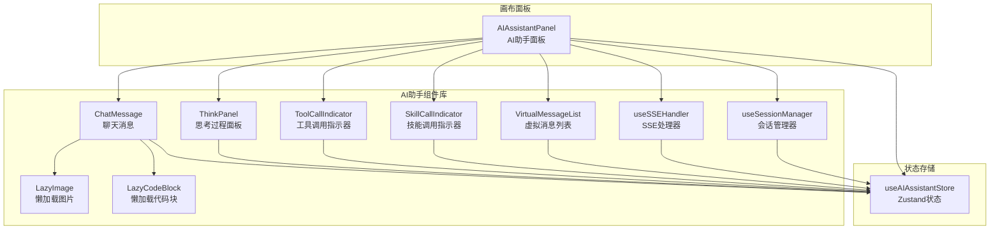

图表来源
- [AIAssistantPanel.tsx:1-613](file://frontend/src/components/canvas/AIAssistantPanel.tsx#L1-L613)
- [index.ts:1-38](file://frontend/src/components/ai-assistant/index.ts#L1-L38)
- [useAIAssistantStore.ts:1-381](file://frontend/src/store/useAIAssistantStore.ts#L1-L381)

章节来源
- [AIAssistantPanel.tsx:1-613](file://frontend/src/components/canvas/AIAssistantPanel.tsx#L1-L613)
- [index.ts:1-38](file://frontend/src/components/ai-assistant/index.ts#L1-L38)

## 核心组件
- 面板入口：AIAssistantPanel负责面板生命周期、拖拽/缩放、会话初始化、SSE事件处理与消息发送。
- 聊天消息：ChatMessage负责消息解析（含思考标记<think>、视频任务标记、附件元数据）、Markdown渲染、代码块高亮、图片懒加载、分块渲染与多智能体/工具/技能状态展示。
- 思考过程：ThinkPanel展示单/多智能体思考状态、步骤进度、耗时与展开详情。
- 工具/技能指示器：ToolCallIndicator与SkillCallIndicator分别展示工具执行状态与技能加载状态。
- 虚拟列表：VirtualMessageList基于react-window实现高性能滚动与自动滚动。
- 懒加载组件：LazyImage与LazyCodeBlock通过IntersectionObserver与动态导入优化首屏与滚动性能。
- SSE处理器：useSSEHandler统一解析SSE事件，维护流式状态并更新消息与指标。
- 会话管理：useSessionManager负责Agent列表加载、会话创建/切换/清空与上下文使用统计恢复。

章节来源
- [AIAssistantPanel.tsx:51-613](file://frontend/src/components/canvas/AIAssistantPanel.tsx#L51-L613)
- [ChatMessage.tsx:253-421](file://frontend/src/components/ai-assistant/ChatMessage.tsx#L253-L421)
- [ThinkPanel.tsx:39-290](file://frontend/src/components/ai-assistant/ThinkPanel.tsx#L39-L290)
- [ToolCallIndicator.tsx:36-164](file://frontend/src/components/ai-assistant/ToolCallIndicator.tsx#L36-L164)
- [SkillCallIndicator.tsx:18-55](file://frontend/src/components/ai-assistant/SkillCallIndicator.tsx#L18-L55)
- [VirtualMessageList.tsx:43-293](file://frontend/src/components/ai-assistant/VirtualMessageList.tsx#L43-L293)
- [LazyImage.tsx:15-111](file://frontend/src/components/ai-assistant/LazyImage.tsx#L15-L111)
- [LazyCodeBlock.tsx:50-166](file://frontend/src/components/ai-assistant/LazyCodeBlock.tsx#L50-L166)
- [useSSEHandler.ts:25-391](file://frontend/src/components/ai-assistant/hooks/useSSEHandler.ts#L25-L391)
- [useSessionManager.ts:12-226](file://frontend/src/components/ai-assistant/hooks/useSessionManager.ts#L12-L226)

## 架构总览
AI助手采用“面板容器 + 子组件 + 状态存储 + Hooks”的分层架构：
- 面板容器负责UI交互、拖拽约束、面板尺寸与位置管理、会话初始化与SSE事件接入。
- 子组件聚焦单一职责：消息渲染、思考过程、工具/技能状态、虚拟滚动、懒加载。
- 状态存储统一管理消息、会话、面板尺寸、上下文使用统计与附件等。
- Hooks封装跨组件共享的业务逻辑：SSE事件解析、会话生命周期管理与性能监控。

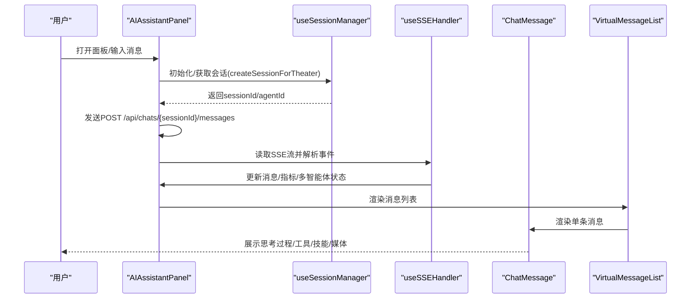

图表来源
- [AIAssistantPanel.tsx:182-293](file://frontend/src/components/canvas/AIAssistantPanel.tsx#L182-L293)
- [useSessionManager.ts:52-123](file://frontend/src/components/ai-assistant/hooks/useSessionManager.ts#L52-L123)
- [useSSEHandler.ts:67-391](file://frontend/src/components/ai-assistant/hooks/useSSEHandler.ts#L67-L391)
- [VirtualMessageList.tsx:43-293](file://frontend/src/components/ai-assistant/VirtualMessageList.tsx#L43-L293)
- [ChatMessage.tsx:253-421](file://frontend/src/components/ai-assistant/ChatMessage.tsx#L253-L421)

## 详细组件分析

### 面板容器：AIAssistantPanel
- 职责
  - 面板可见性、尺寸与位置管理，拖拽与吸附动画，ESC最小化。
  - 会话管理：加载Agent列表、创建/切换/清空会话，恢复上下文使用统计。
  - 实时消息：构建带附件上下文的消息，发起POST请求，解析SSE事件，处理HTTP错误与中断。
  - 附件与图像编辑上下文：支持多图拖拽、缩略图预览与编辑目标节点绑定。
  - 性能监控：长任务告警与FPS监控。
- 关键流程
  - 发送消息：校验/创建会话 → 构建附件上下文 → 发起请求 → 逐行解析SSE → 更新状态 → 清理附件与编辑上下文。
  - 会话初始化：面板打开时检查sessionId/agentId，若缺失则按当前theaterId创建或恢复。

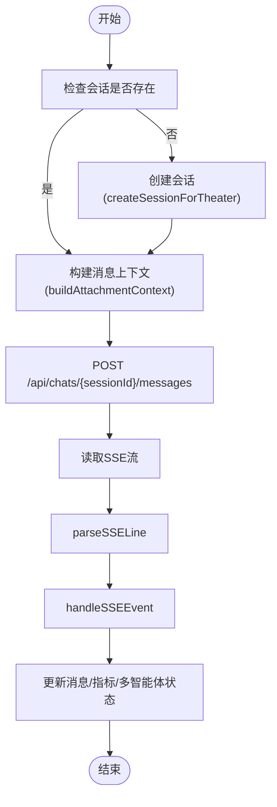

图表来源
- [AIAssistantPanel.tsx:182-293](file://frontend/src/components/canvas/AIAssistantPanel.tsx#L182-L293)
- [useSSEHandler.ts:56-391](file://frontend/src/components/ai-assistant/hooks/useSSEHandler.ts#L56-L391)
- [useSessionManager.ts:52-123](file://frontend/src/components/ai-assistant/hooks/useSessionManager.ts#L52-L123)

章节来源
- [AIAssistantPanel.tsx:51-613](file://frontend/src/components/canvas/AIAssistantPanel.tsx#L51-L613)

### 聊天消息：ChatMessage
- 职责
  - 解析<think>标记，区分思考内容与正式回复。
  - 解析视频任务标记与完成标记，合并SSE事件中的视频任务。
  - 解析用户侧附件元数据，渲染附件预览。
  - Markdown渲染：流式渲染与非流式渲染差异；代码块懒加载；图片懒加载。
  - 分块渲染：超大文本分块显示，提升首屏性能。
  - 展示多智能体协作、工具/技能调用状态。
- 关键机制
  - 附件解析：通过隐藏元数据块与消息起始标记分离附件与正文。
  - 思考解析：识别<think>与</think>，判断思考是否完成。
  - 视频任务：内联标记与完成标记双通道解析。
  - 渲染策略：流式使用打字机效果，非流式使用懒加载组件与分块渲染。

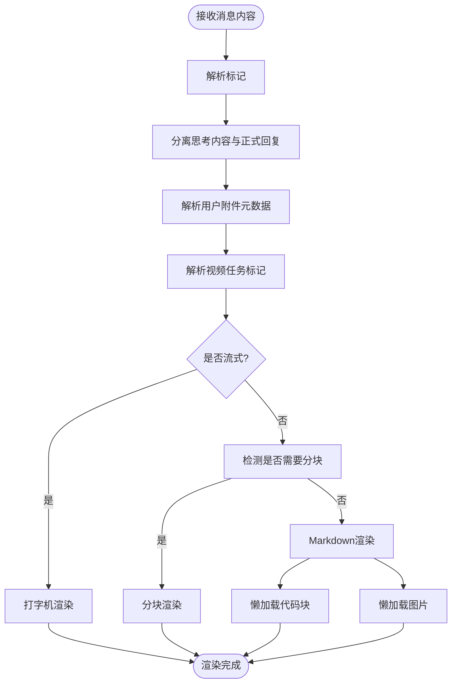

图表来源
- [ChatMessage.tsx:64-127](file://frontend/src/components/ai-assistant/ChatMessage.tsx#L64-L127)
- [ChatMessage.tsx:128-182](file://frontend/src/components/ai-assistant/ChatMessage.tsx#L128-L182)
- [ChatMessage.tsx:253-421](file://frontend/src/components/ai-assistant/ChatMessage.tsx#L253-L421)

章节来源
- [ChatMessage.tsx:253-421](file://frontend/src/components/ai-assistant/ChatMessage.tsx#L253-L421)

### 思考过程：ThinkPanel
- 职责
  - 单智能体：显示思考状态、计时器与思考内容。
  - 多智能体：展示步骤列表、进度条、当前执行步骤与详情展开。
  - 自动展开/折叠：检测到思考开始自动展开，结束后延迟折叠。
- 关键机制
  - 进度计算：完成/失败/运行中计数与百分比。
  - 当前步骤定位：首个运行中步骤作为当前步骤。
  - 自动折叠：仅在用户未手动展开时生效。

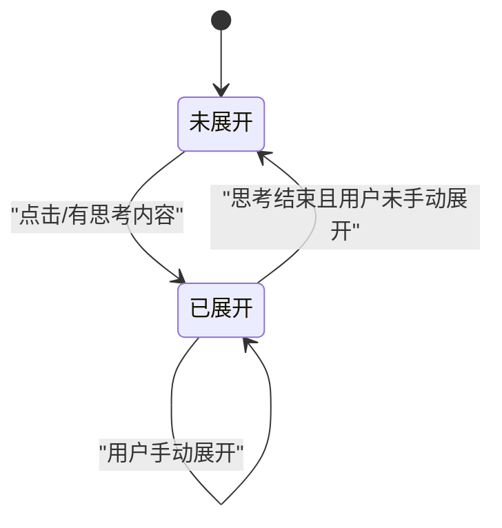

图表来源
- [ThinkPanel.tsx:39-290](file://frontend/src/components/ai-assistant/ThinkPanel.tsx#L39-L290)

章节来源
- [ThinkPanel.tsx:39-290](file://frontend/src/components/ai-assistant/ThinkPanel.tsx#L39-L290)

### 工具调用指示器：ToolCallIndicator
- 职责
  - 展示工具执行状态（执行中/已完成），错误检测与摘要。
  - 参数与结果展开查看，执行耗时展示。
- 关键机制
  - 错误格式识别：支持JSON与文本两种错误格式。
  - 状态样式：执行中/成功/失败三色区分。

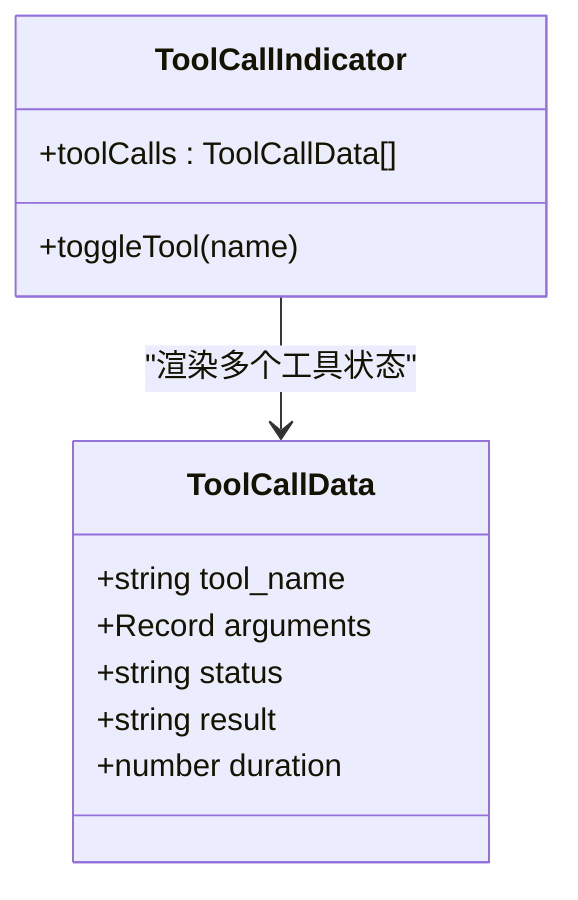

图表来源
- [ToolCallIndicator.tsx:36-164](file://frontend/src/components/ai-assistant/ToolCallIndicator.tsx#L36-L164)
- [ToolCallIndicator.tsx:7-13](file://frontend/src/components/ai-assistant/ToolCallIndicator.tsx#L7-L13)

章节来源
- [ToolCallIndicator.tsx:36-164](file://frontend/src/components/ai-assistant/ToolCallIndicator.tsx#L36-L164)

### 技能调用指示器：SkillCallIndicator
- 职责
  - 展示技能加载状态（加载中/已加载）。
- 关键机制
  - 状态样式：加载中使用警告色，已加载使用成功色。

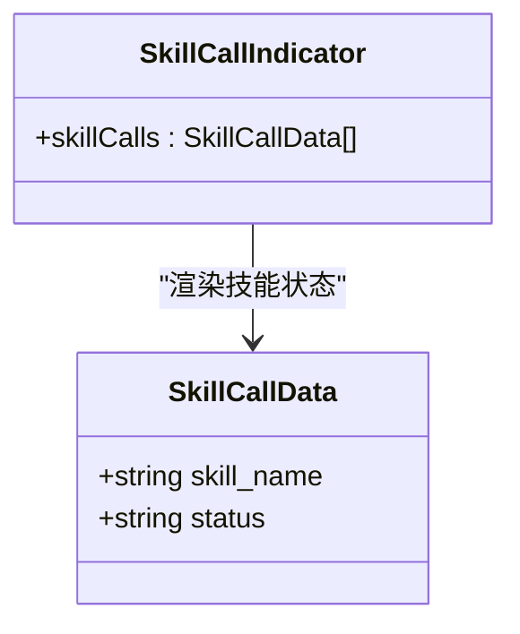

图表来源
- [SkillCallIndicator.tsx:18-55](file://frontend/src/components/ai-assistant/SkillCallIndicator.tsx#L18-L55)
- [SkillCallIndicator.tsx:7-11](file://frontend/src/components/ai-assistant/SkillCallIndicator.tsx#L7-L11)

章节来源
- [SkillCallIndicator.tsx:18-55](file://frontend/src/components/ai-assistant/SkillCallIndicator.tsx#L18-L55)

### 虚拟消息列表：VirtualMessageList
- 职责
  - 基于react-window实现高性能消息列表，支持动态行高、overscan与自动滚动。
  - 检测滚动位置，提供回到最新按钮与等待动画。
- 关键机制
  - 动态行高：useDynamicRowHeight缓存行高，避免消息数量变化导致重置。
  - 自动滚动：用户消息发送后强制滚动到底部；AI回复时仅在未手动向上滚动时滚动。
  - 等待动画：在用户发送消息后、AI开始回复前显示三点加载动画。

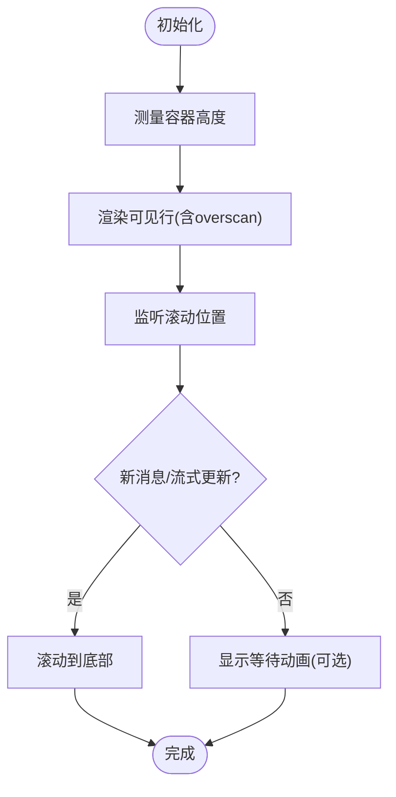

图表来源
- [VirtualMessageList.tsx:43-293](file://frontend/src/components/ai-assistant/VirtualMessageList.tsx#L43-L293)

章节来源
- [VirtualMessageList.tsx:43-293](file://frontend/src/components/ai-assistant/VirtualMessageList.tsx#L43-L293)

### 懒加载组件：LazyImage 与 LazyCodeBlock
- LazyImage
  - 通过IntersectionObserver检测进入视口再加载，支持占位符与错误状态。
- LazyCodeBlock
  - 动态导入语法高亮器与语言模块，支持行号、展开更多与按需加载。

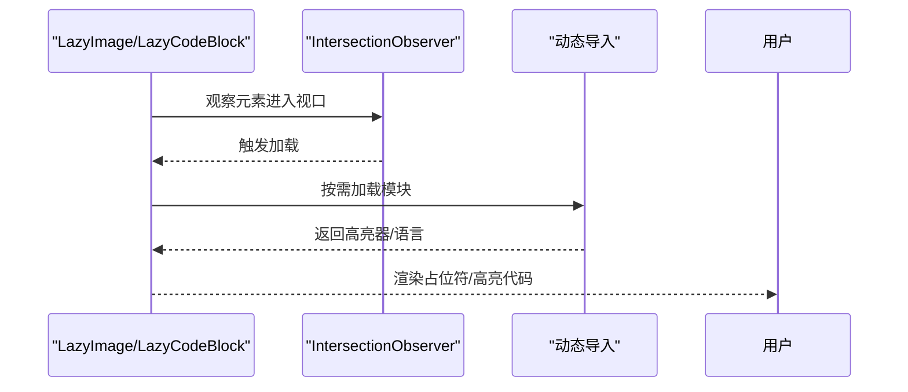

图表来源
- [LazyImage.tsx:15-111](file://frontend/src/components/ai-assistant/LazyImage.tsx#L15-L111)
- [LazyCodeBlock.tsx:50-166](file://frontend/src/components/ai-assistant/LazyCodeBlock.tsx#L50-L166)

章节来源
- [LazyImage.tsx:15-111](file://frontend/src/components/ai-assistant/LazyImage.tsx#L15-L111)
- [LazyCodeBlock.tsx:50-166](file://frontend/src/components/ai-assistant/LazyCodeBlock.tsx#L50-L166)

### SSE处理器：useSSEHandler
- 职责
  - 解析SSE行，分发到对应事件处理器，维护流式状态（技能/工具/视频/多智能体/回合切换）。
  - 更新消息、上下文使用统计、积分余额与多智能体最终结果。
- 关键事件
  - text：流式文本增量。
  - skill_call/skill_loaded：技能调用与加载完成。
  - tool_call/tool_result：工具调用与结果。
  - video_task_created：视频任务创建。
  - subtask_*：多智能体子任务生命周期。
  - billing/context_compacted/done/error：计费、上下文压缩、完成与错误。

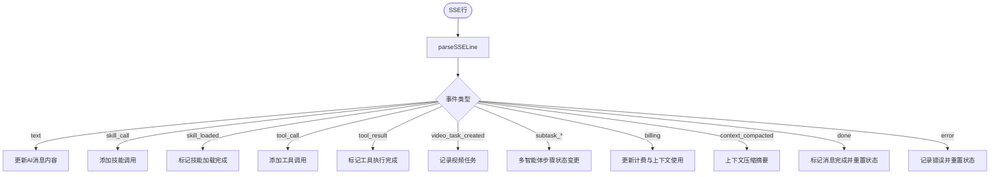

图表来源
- [useSSEHandler.ts:56-391](file://frontend/src/components/ai-assistant/hooks/useSSEHandler.ts#L56-L391)

章节来源
- [useSSEHandler.ts:25-391](file://frontend/src/components/ai-assistant/hooks/useSSEHandler.ts#L25-L391)

### 会话管理：useSessionManager
- 职责
  - Agent列表加载、会话创建/切换/清空。
  - 从后端恢复上下文使用统计与消息历史。
  - 处理画布剧场切换与页面刷新恢复。
- 关键流程
  - createSessionForTheater：优先查找现有会话，否则创建新会话并加载Agent。
  - restoreContextUsage：根据sessionId从后端恢复tokens与上下文窗口。

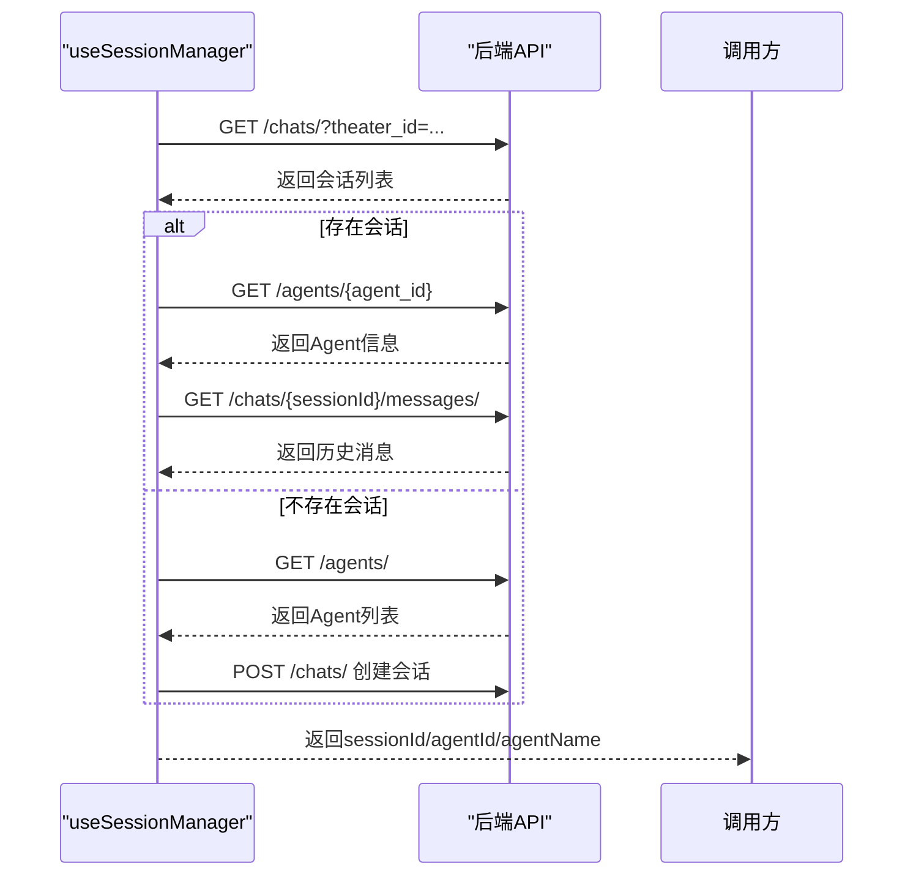

图表来源
- [useSessionManager.ts:52-123](file://frontend/src/components/ai-assistant/hooks/useSessionManager.ts#L52-L123)
- [useSessionManager.ts:165-189](file://frontend/src/components/ai-assistant/hooks/useSessionManager.ts#L165-L189)

章节来源
- [useSessionManager.ts:12-226](file://frontend/src/components/ai-assistant/hooks/useSessionManager.ts#L12-L226)

## 依赖关系分析
- 组件耦合
  - AIAssistantPanel依赖useSSEHandler与useSessionManager进行事件与会话处理。
  - ChatMessage依赖ThinkPanel、ToolCallIndicator、SkillCallIndicator、LazyImage、LazyCodeBlock等子组件。
  - VirtualMessageList被AIAssistantPanel与ChatMessage共同使用。
- 状态依赖
  - 所有组件通过useAIAssistantStore共享状态，包括消息、会话、面板尺寸、上下文使用统计与附件。
- 外部依赖
  - react-markdown、remark-gfm用于Markdown渲染。
  - react-window用于虚拟滚动。
  - react-syntax-highlighter用于代码高亮（动态导入）。
  - IntersectionObserver用于懒加载。

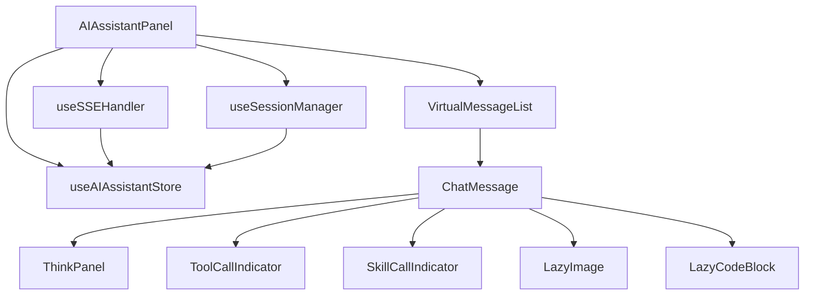

图表来源
- [AIAssistantPanel.tsx:18-25](file://frontend/src/components/canvas/AIAssistantPanel.tsx#L18-L25)
- [ChatMessage.tsx:1-20](file://frontend/src/components/ai-assistant/ChatMessage.tsx#L1-L20)
- [VirtualMessageList.tsx:1-7](file://frontend/src/components/ai-assistant/VirtualMessageList.tsx#L1-L7)

章节来源
- [AIAssistantPanel.tsx:18-25](file://frontend/src/components/canvas/AIAssistantPanel.tsx#L18-L25)
- [ChatMessage.tsx:1-20](file://frontend/src/components/ai-assistant/ChatMessage.tsx#L1-L20)
- [VirtualMessageList.tsx:1-7](file://frontend/src/components/ai-assistant/VirtualMessageList.tsx#L1-L7)

## 性能考量
- 虚拟滚动：react-window动态行高+overscan，避免大量DOM节点带来的重排与重绘。
- 懒加载：图片与代码块按需加载，IntersectionObserver提前触发加载，减少首屏压力。
- 分块渲染：超大文本分块显示，降低单次渲染成本。
- 流式渲染：打字机效果与增量更新，提升交互流畅度。
- 长任务监控：面板级性能监控，对长时间任务发出告警。
- 自动滚动策略：仅在用户未手动向上滚动时自动滚动，避免打断用户阅读。

## 故障排查指南
- 登录过期
  - 现象：401错误触发重新登录弹窗。
  - 处理：调用logout并引导重新登录。
- 请求失败
  - 现象：HTTP错误码映射为友好提示。
  - 处理：检查网络与后端服务状态。
- 工具/技能错误
  - 现象：ToolCallIndicator显示错误状态与摘要。
  - 处理：展开查看详情，核对参数与返回结果。
- 多智能体协作异常
  - 现象：subtask_failed事件导致步骤失败。
  - 处理：查看具体错误信息与tokens消耗。
- 上下文使用统计异常
  - 现象：context_compacted事件或restore失败。
  - 处理：确认后端会话信息与Agent上下文窗口配置。

章节来源
- [AIAssistantPanel.tsx:240-252](file://frontend/src/components/canvas/AIAssistantPanel.tsx#L240-L252)
- [useSSEHandler.ts:375-380](file://frontend/src/components/ai-assistant/hooks/useSSEHandler.ts#L375-L380)
- [useSSEHandler.ts:255-267](file://frontend/src/components/ai-assistant/hooks/useSSEHandler.ts#L255-L267)
- [useSSEHandler.ts:351-363](file://frontend/src/components/ai-assistant/hooks/useSSEHandler.ts#L351-L363)
- [useSessionManager.ts:165-189](file://frontend/src/components/ai-assistant/hooks/useSessionManager.ts#L165-L189)

## 结论
AI助手组件通过清晰的分层架构与完善的Hooks抽象，实现了高性能、可观测与可扩展的聊天体验。其核心优势包括：
- 流式SSE事件驱动的实时交互与多智能体协作可视化。
- 基于虚拟滚动与懒加载的渲染优化，保障大规模消息场景下的流畅性。
- 完整的工具/技能状态展示与错误处理，提升调试与运维效率。
- 会话与上下文使用统计的持久化与恢复，增强用户体验连续性。

## 附录

### 使用示例与交互模式
- 基本对话
  - 打开面板 → 输入消息 → 查看AI回复与思考过程 → 工具/技能状态指示器 → 图片/代码块懒加载。
- 多智能体协作
  - 发送任务 → 观察子任务创建/执行/完成 → 查看步骤详情与tokens消耗。
- 附件与图像编辑
  - 从画布拖拽节点到面板 → 预览缩略图 → 发送消息时自动拼接上下文 → 图像编辑上下文横幅提示。
- 会话管理
  - Agent切换 → 清空会话 → 上下文使用统计恢复。

章节来源
- [AIAssistantPanel.tsx:182-293](file://frontend/src/components/canvas/AIAssistantPanel.tsx#L182-L293)
- [useSessionManager.ts:125-146](file://frontend/src/components/ai-assistant/hooks/useSessionManager.ts#L125-L146)
- [ChatMessage.tsx:215-251](file://frontend/src/components/ai-assistant/ChatMessage.tsx#L215-L251)

### 自定义消息格式
- 思考标记
  - 使用<think>...</think>包裹思考内容，支持流式与非流式场景。
- 视频任务标记
  - 内容中插入任务标记，完成后显示视频卡片；或通过SSE事件推送。
- 附件元数据
  - 用户消息中嵌入隐藏元数据块与消息起始标记，用于AI感知节点内容。

章节来源
- [ChatMessage.tsx:24-28](file://frontend/src/components/ai-assistant/ChatMessage.tsx#L24-L28)
- [ChatMessage.tsx:36-51](file://frontend/src/components/ai-assistant/ChatMessage.tsx#L36-L51)
- [ChatMessage.tsx:102-126](file://frontend/src/components/ai-assistant/ChatMessage.tsx#L102-L126)
- [AIAssistantPanel.tsx:36-49](file://frontend/src/components/canvas/AIAssistantPanel.tsx#L36-L49)