# AI助手组件

<cite>
**本文档引用的文件**
- [AIAssistantPanel.tsx](file://frontend/src/components/canvas/AIAssistantPanel.tsx)
- [index.ts](file://frontend/src/components/ai-assistant/index.ts)
- [useAIAssistantStore.ts](file://frontend/src/store/useAIAssistantStore.ts)
- [ChatMessage.tsx](file://frontend/src/components/ai-assistant/ChatMessage.tsx)
- [useSSEHandler.ts](file://frontend/src/components/ai-assistant/hooks/useSSEHandler.ts)
- [useSessionManager.ts](file://frontend/src/components/ai-assistant/hooks/useSessionManager.ts)
- [LazyCodeBlock.tsx](file://frontend/src/components/ai-assistant/LazyCodeBlock.tsx)
- [LazyImage.tsx](file://frontend/src/components/ai-assistant/LazyImage.tsx)
- [ThinkPanel.tsx](file://frontend/src/components/ai-assistant/ThinkPanel.tsx)
- [ToolCallIndicator.tsx](file://frontend/src/components/ai-assistant/ToolCallIndicator.tsx)
- [SkillCallIndicator.tsx](file://frontend/src/components/ai-assistant/SkillCallIndicator.tsx)
- [CallTimelinePanel.tsx](file://frontend/src/components/ai-assistant/CallTimelinePanel.tsx)
- [VirtualMessageList.tsx](file://frontend/src/components/ai-assistant/VirtualMessageList.tsx)
- [MessageInput.tsx](file://frontend/src/components/ai-assistant/MessageInput.tsx)
- [PanelHeader.tsx](file://frontend/src/components/ai-assistant/PanelHeader.tsx)
- [WelcomeMessage.tsx](file://frontend/src/components/ai-assistant/WelcomeMessage.tsx)
- [TypewriterText.tsx](file://frontend/src/components/ai-assistant/TypewriterText.tsx)
- [text-effect.tsx](file://frontend/src/components/ui/text-effect.tsx)
- [I18nProvider.tsx](file://frontend/src/i18n/I18nProvider.tsx)
- [index.ts](file://frontend/src/i18n/index.ts)
- [en-US.json](file://frontend/src/i18n/locales/en-US.json)
- [zh-CN.json](file://frontend/src/i18n/locales/zh-CN.json)
</cite>

## 更新摘要
**变更内容**
- 新增CallTimelinePanel组件，替代原有的SkillCallIndicator和ToolCallIndicator，提供统一的时间线可视化功能
- CallTimelinePanel整合技能调用和工具调用状态展示，支持统一的时间轴布局和展开详情
- 更新ChatMessage组件以使用新的CallTimelinePanel进行调用状态展示
- 保持向后兼容的ToolCallIndicator和SkillCallIndicator组件，但推荐使用新的CallTimelinePanel
- 更新组件导出索引，移除对旧组件的直接导出

## 目录
1. [简介](#简介)
2. [项目结构](#项目结构)
3. [核心组件](#核心组件)
4. [架构总览](#架构总览)
5. [详细组件分析](#详细组件分析)
6. [国际化支持](#国际化支持)
7. [依赖关系分析](#依赖关系分析)
8. [性能考量](#性能考量)
9. [故障排查指南](#故障排查指南)
10. [结论](#结论)
11. [附录](#附录)

## 简介
本文件面向Infinite Game的AI助手组件，系统性梳理其架构设计与实现细节，重点覆盖以下方面：
- 面板整体架构与交互流程
- 聊天消息组件、思考过程显示与统一调用时间线面板的实现
- 实时消息流处理、SSE事件处理与会话管理机制
- 状态管理、性能监控与错误处理策略
- 国际化支持，包括错误消息、提示文本、Agent选择器等所有用户界面元素
- 使用示例、自定义消息格式与交互模式
- 消息渲染优化、代码块高亮与图片懒加载等用户体验改进
- **新增** 统一调用时间线面板，提供更好的可视化体验

## 项目结构
AI助手相关代码主要位于前端工程的以下路径：
- 面板入口与组合：frontend/src/components/canvas/AIAssistantPanel.tsx
- 组件导出聚合：frontend/src/components/ai-assistant/index.ts
- 状态存储：frontend/src/store/useAIAssistantStore.ts
- 子组件与Hooks：frontend/src/components/ai-assistant/* 与 frontend/src/components/ai-assistant/hooks/*
- **新增** 统一调用时间线面板：frontend/src/components/ai-assistant/CallTimelinePanel.tsx
- 国际化配置：frontend/src/i18n/*

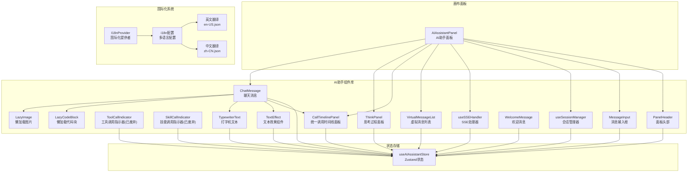

**图表来源**
- [AIAssistantPanel.tsx:1-633](file://frontend/src/components/canvas/AIAssistantPanel.tsx#L1-L633)
- [index.ts:1-38](file://frontend/src/components/ai-assistant/index.ts#L1-L38)
- [useAIAssistantStore.ts:1-449](file://frontend/src/store/useAIAssistantStore.ts#L1-L449)
- [CallTimelinePanel.tsx:1-367](file://frontend/src/components/ai-assistant/CallTimelinePanel.tsx#L1-L367)
- [text-effect.tsx:1-225](file://frontend/src/components/ui/text-effect.tsx#L1-L225)
- [TypewriterText.tsx:1-128](file://frontend/src/components/ai-assistant/TypewriterText.tsx#L1-L128)
- [I18nProvider.tsx:1-20](file://frontend/src/i18n/I18nProvider.tsx#L1-L20)
- [index.ts:1-28](file://frontend/src/i18n/index.ts#L1-L28)

**章节来源**
- [AIAssistantPanel.tsx:1-633](file://frontend/src/components/canvas/AIAssistantPanel.tsx#L1-L633)
- [index.ts:1-38](file://frontend/src/components/ai-assistant/index.ts#L1-L38)

## 核心组件
- 面板入口：AIAssistantPanel负责面板生命周期、拖拽/缩放、会话初始化、SSE事件处理与消息发送。
- 聊天消息：ChatMessage负责消息解析（含思考标记<think>、视频任务标记、附件元数据）、Markdown渲染、代码块高亮、图片懒加载、分块渲染与多智能体/统一调用时间线状态展示。
- 思考过程：ThinkPanel展示单/多智能体思考状态、步骤进度、耗时与展开详情。
- **新增** 统一调用时间线：CallTimelinePanel整合技能调用和工具调用状态，提供统一的时间轴可视化，支持展开查看详情、错误摘要和参数展示。
- **已废弃** 工具/技能指示器：ToolCallIndicator与SkillCallIndicator分别展示工具执行状态与技能加载状态，现已被CallTimelinePanel替代。
- 虚拟列表：VirtualMessageList基于react-window实现高性能滚动与自动滚动。
- 懒加载组件：LazyImage与LazyCodeBlock通过IntersectionObserver与动态导入优化首屏与滚动性能。
- SSE处理器：useSSEHandler统一解析SSE事件，维护流式状态并更新消息与指标。
- 会话管理：useSessionManager负责Agent列表加载、会话创建/切换/清空与上下文使用统计恢复。
- 消息输入：MessageInput提供Agent选择器、占位符文本和发送按钮的国际化支持。
- 面板头部：PanelHeader显示上下文使用统计和操作按钮，支持国际化标题和提示。
- 欢迎消息：WelcomeMessage展示预设对话和欢迎文案，支持多语言配置。

**章节来源**
- [AIAssistantPanel.tsx:51-633](file://frontend/src/components/canvas/AIAssistantPanel.tsx#L51-L633)
- [ChatMessage.tsx:278-471](file://frontend/src/components/ai-assistant/ChatMessage.tsx#L278-L471)
- [ThinkPanel.tsx:39-290](file://frontend/src/components/ai-assistant/ThinkPanel.tsx#L39-L290)
- [CallTimelinePanel.tsx:173-367](file://frontend/src/components/ai-assistant/CallTimelinePanel.tsx#L173-L367)
- [ToolCallIndicator.tsx:36-164](file://frontend/src/components/ai-assistant/ToolCallIndicator.tsx#L36-L164)
- [SkillCallIndicator.tsx:18-55](file://frontend/src/components/ai-assistant/SkillCallIndicator.tsx#L18-L55)
- [VirtualMessageList.tsx:43-293](file://frontend/src/components/ai-assistant/VirtualMessageList.tsx#L43-L293)
- [LazyImage.tsx:15-111](file://frontend/src/components/ai-assistant/LazyImage.tsx#L15-L111)
- [LazyCodeBlock.tsx:50-166](file://frontend/src/components/ai-assistant/LazyCodeBlock.tsx#L50-L166)
- [useSSEHandler.ts:25-391](file://frontend/src/components/ai-assistant/hooks/useSSEHandler.ts#L25-L391)
- [useSessionManager.ts:12-226](file://frontend/src/components/ai-assistant/hooks/useSessionManager.ts#L12-L226)
- [MessageInput.tsx:30-186](file://frontend/src/components/ai-assistant/MessageInput.tsx#L30-L186)
- [PanelHeader.tsx:20-200](file://frontend/src/components/ai-assistant/PanelHeader.tsx#L20-L200)
- [WelcomeMessage.tsx:29-81](file://frontend/src/components/ai-assistant/WelcomeMessage.tsx#L29-L81)

## 架构总览
AI助手采用"面板容器 + 子组件 + 状态存储 + Hooks + 国际化"的分层架构：
- 面板容器负责UI交互、拖拽约束、面板尺寸与位置管理、会话初始化与SSE事件接入。
- 子组件聚焦单一职责：消息渲染、思考过程、统一调用状态、虚拟滚动、懒加载。
- 状态存储统一管理消息、会话、面板尺寸、上下文使用统计与附件等。
- Hooks封装跨组件共享的业务逻辑：SSE事件解析、会话生命周期管理与性能监控。
- 国际化系统提供多语言支持，覆盖所有用户界面元素。

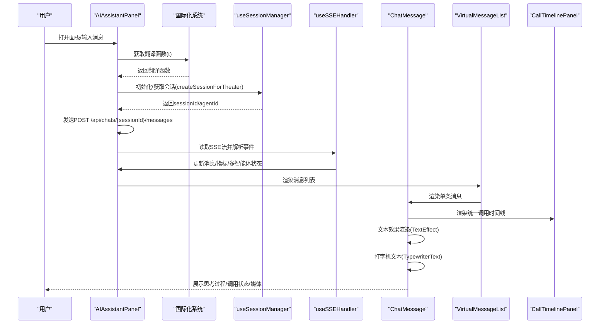

**图表来源**
- [AIAssistantPanel.tsx:182-313](file://frontend/src/components/canvas/AIAssistantPanel.tsx#L182-L313)
- [useSessionManager.ts:52-123](file://frontend/src/components/ai-assistant/hooks/useSessionManager.ts#L52-L123)
- [useSSEHandler.ts:67-391](file://frontend/src/components/ai-assistant/hooks/useSSEHandler.ts#L67-L391)
- [VirtualMessageList.tsx:43-293](file://frontend/src/components/ai-assistant/VirtualMessageList.tsx#L43-L293)
- [ChatMessage.tsx:278-471](file://frontend/src/components/ai-assistant/ChatMessage.tsx#L278-L471)
- [CallTimelinePanel.tsx:173-367](file://frontend/src/components/ai-assistant/CallTimelinePanel.tsx#L173-L367)
- [TypewriterText.tsx:45-128](file://frontend/src/components/ai-assistant/TypewriterText.tsx#L45-L128)
- [text-effect.tsx:152-225](file://frontend/src/components/ui/text-effect.tsx#L152-L225)
- [I18nProvider.tsx:1-20](file://frontend/src/i18n/I18nProvider.tsx#L1-L20)

## 详细组件分析

### 面板容器：AIAssistantPanel
- 职责
  - 面板可见性、尺寸与位置管理，拖拽与吸附动画，ESC最小化。
  - 会话管理：加载Agent列表、创建/切换/清空会话，恢复上下文使用统计。
  - 实时消息：构建带附件上下文的消息，发起POST请求，解析SSE事件，处理HTTP错误与中断。
  - 附件与图像编辑上下文：支持多图拖拽、缩略图预览与编辑目标节点绑定。
  - 性能监控：长任务告警与FPS监控。
  - 国际化支持：使用useTranslation Hook获取翻译函数，处理错误消息和用户提示。
- 关键流程
  - 发送消息：校验/创建会话 → 构建附件上下文 → 发起请求 → 逐行解析SSE → 更新状态 → 清理附件与编辑上下文。
  - 会话初始化：面板打开时检查sessionId/agentId，若缺失则按当前theaterId创建或恢复。
  - 错误处理：通过ERROR_KEY_MAP映射HTTP状态码到国际化键，使用t()函数获取本地化错误消息。

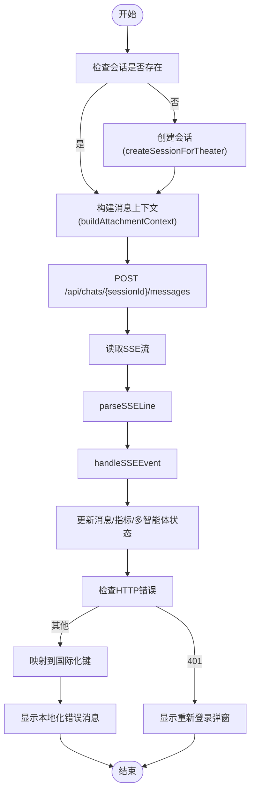

**图表来源**
- [AIAssistantPanel.tsx:182-313](file://frontend/src/components/canvas/AIAssistantPanel.tsx#L182-L313)
- [useSSEHandler.ts:56-391](file://frontend/src/components/ai-assistant/hooks/useSSEHandler.ts#L56-L391)
- [useSessionManager.ts:52-123](file://frontend/src/components/ai-assistant/hooks/useSessionManager.ts#L52-L123)

**章节来源**
- [AIAssistantPanel.tsx:51-633](file://frontend/src/components/canvas/AIAssistantPanel.tsx#L51-L633)

### 聊天消息：ChatMessage
- 职责
  - 解析<think>标记，区分思考内容与正式回复。
  - 解析视频任务标记与完成标记，合并SSE事件中的视频任务。
  - 解析用户侧附件元数据，渲染附件预览。
  - Markdown渲染：流式渲染与非流式渲染差异；代码块懒加载；图片懒加载。
  - 分块渲染：超大文本分块显示，提升首屏性能。
  - 展示多智能体协作、统一调用时间线状态。
  - **更新** 统一调用状态：使用CallTimelinePanel替代原有的ToolCallIndicator和SkillCallIndicator。
- 关键机制
  - 附件解析：通过隐藏元数据块与消息起始标记分离附件与正文。
  - 思考解析：识别<think>与</think>，判断思考是否完成。
  - 视频任务：内联标记与完成标记双通道解析。
  - 渲染策略：流式使用打字机效果，非流式使用懒加载组件与分块渲染。

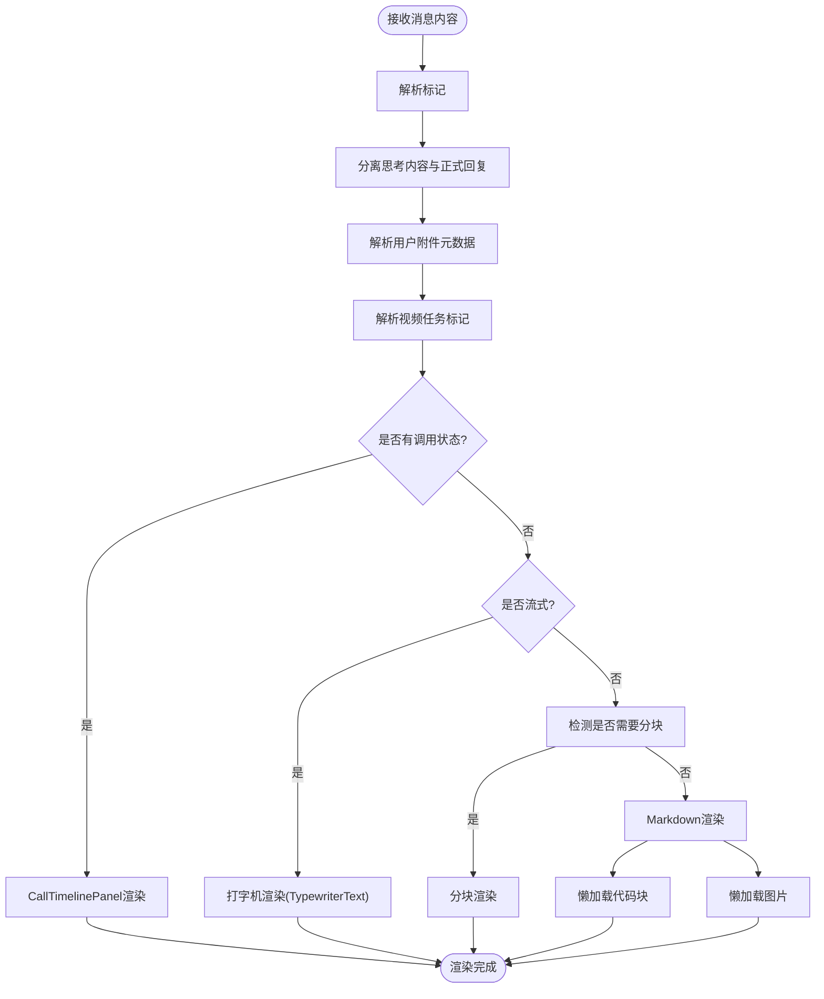

**图表来源**
- [ChatMessage.tsx:64-127](file://frontend/src/components/ai-assistant/ChatMessage.tsx#L64-L127)
- [ChatMessage.tsx:128-182](file://frontend/src/components/ai-assistant/ChatMessage.tsx#L128-L182)
- [ChatMessage.tsx:278-471](file://frontend/src/components/ai-assistant/ChatMessage.tsx#L278-L471)
- [CallTimelinePanel.tsx:173-367](file://frontend/src/components/ai-assistant/CallTimelinePanel.tsx#L173-L367)
- [TypewriterText.tsx:45-128](file://frontend/src/components/ai-assistant/TypewriterText.tsx#L45-L128)
- [text-effect.tsx:152-225](file://frontend/src/components/ui/text-effect.tsx#L152-L225)

**章节来源**
- [ChatMessage.tsx:278-471](file://frontend/src/components/ai-assistant/ChatMessage.tsx#L278-L471)

### 思考过程：ThinkPanel
- 职责
  - 单智能体：显示思考状态、计时器与思考内容。
  - 多智能体：展示步骤列表、进度条、当前执行步骤与详情展开。
  - 自动展开/折叠：检测到思考开始自动展开，结束后延迟折叠。
- 关键机制
  - 进度计算：完成/失败/运行中计数与百分比。
  - 当前步骤定位：首个运行中步骤作为当前步骤。
  - 自动折叠：仅在用户未手动展开时生效。

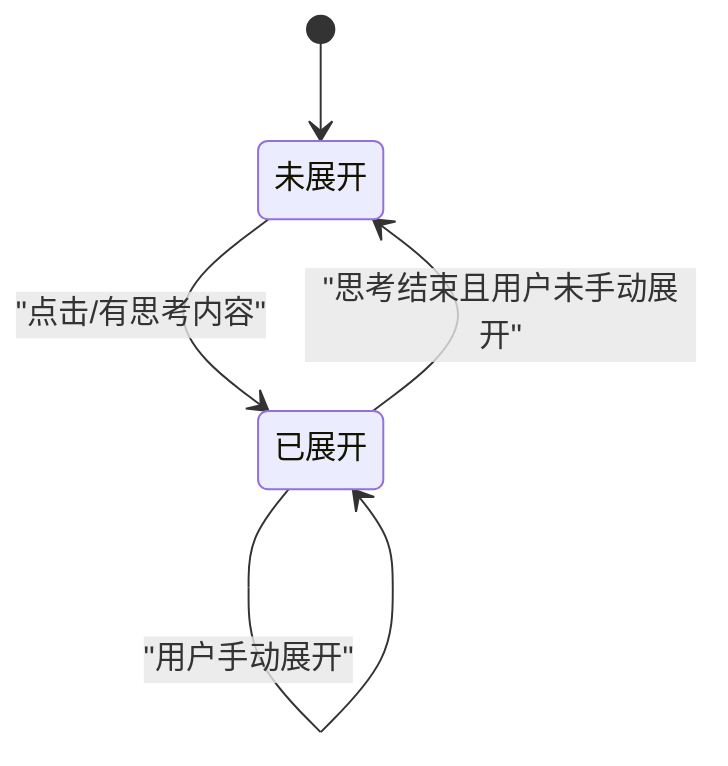

**图表来源**
- [ThinkPanel.tsx:39-290](file://frontend/src/components/ai-assistant/ThinkPanel.tsx#L39-L290)

**章节来源**
- [ThinkPanel.tsx:39-290](file://frontend/src/components/ai-assistant/ThinkPanel.tsx#L39-L290)

### **新增** 统一调用时间线：CallTimelinePanel
- 职责
  - 整合技能调用和工具调用状态，提供统一的时间轴可视化。
  - 支持展开/折叠详情，显示参数、结果和错误摘要。
  - 提供整体状态概览（执行中/成功/失败/待定）。
  - 支持垂直时间轴布局和状态图标。
- 关键机制
  - 时间轴合并：将技能调用和工具调用按时间顺序合并为统一时间轴。
  - 状态解析：统一解析技能和工具调用状态，映射为激活/成功/错误/待定。
  - 展开详情：支持参数、结果和错误详情的展开查看。
  - 统一样式：使用统一的颜色方案和图标表示不同状态。

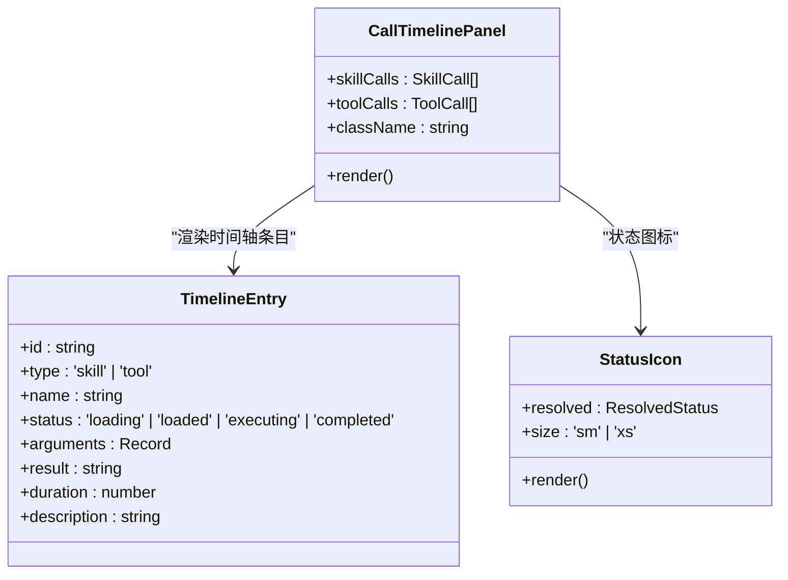

**图表来源**
- [CallTimelinePanel.tsx:42-46](file://frontend/src/components/ai-assistant/CallTimelinePanel.tsx#L42-L46)
- [CallTimelinePanel.tsx:31-40](file://frontend/src/components/ai-assistant/CallTimelinePanel.tsx#L31-L40)
- [CallTimelinePanel.tsx:127-137](file://frontend/src/components/ai-assistant/CallTimelinePanel.tsx#L127-L137)

**章节来源**
- [CallTimelinePanel.tsx:173-367](file://frontend/src/components/ai-assistant/CallTimelinePanel.tsx#L173-L367)

### **已废弃** 工具调用指示器：ToolCallIndicator
- 职责
  - 展示工具执行状态（执行中/已完成），错误检测与摘要。
  - 参数与结果展开查看，执行耗时展示。
- 关键机制
  - 错误格式识别：支持JSON与文本两种错误格式。
  - 状态样式：执行中/成功/失败三色区分。
- **注意**：此组件已被CallTimelinePanel替代，建议迁移到新的统一时间线面板。

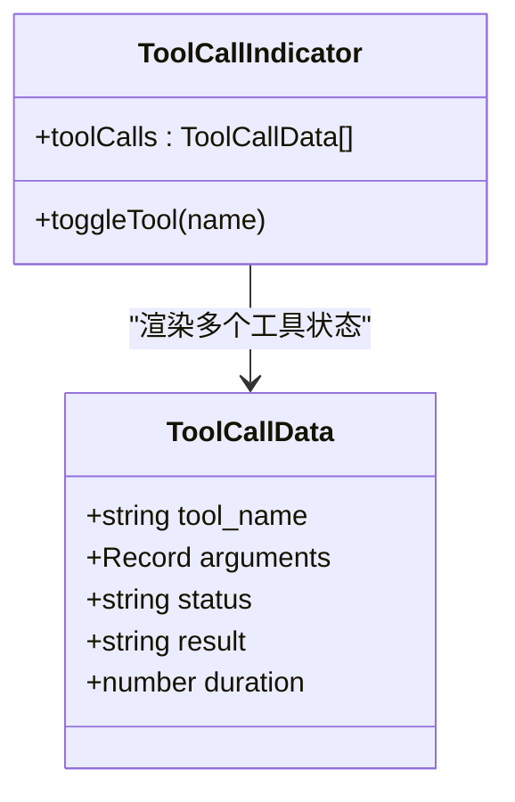

**图表来源**
- [ToolCallIndicator.tsx:36-164](file://frontend/src/components/ai-assistant/ToolCallIndicator.tsx#L36-L164)
- [ToolCallIndicator.tsx:7-13](file://frontend/src/components/ai-assistant/ToolCallIndicator.tsx#L7-L13)

**章节来源**
- [ToolCallIndicator.tsx:36-164](file://frontend/src/components/ai-assistant/ToolCallIndicator.tsx#L36-L164)

### **已废弃** 技能调用指示器：SkillCallIndicator
- 职责
  - 展示技能加载状态（加载中/已加载）。
- 关键机制
  - 状态样式：加载中使用警告色，已加载使用成功色。
- **注意**：此组件已被CallTimelinePanel替代，建议迁移到新的统一时间线面板。

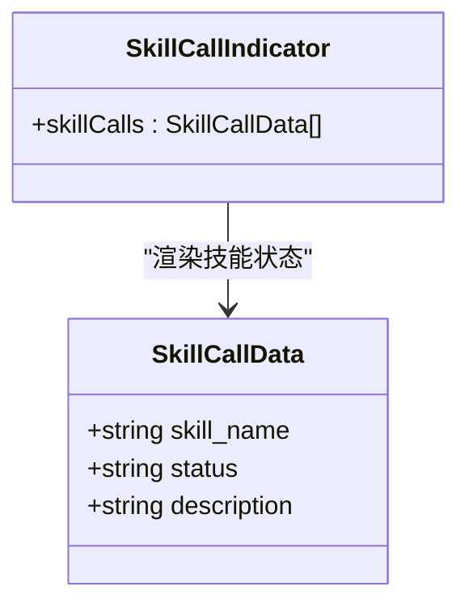

**图表来源**
- [SkillCallIndicator.tsx:18-55](file://frontend/src/components/ai-assistant/SkillCallIndicator.tsx#L18-L55)
- [SkillCallIndicator.tsx:7-11](file://frontend/src/components/ai-assistant/SkillCallIndicator.tsx#L7-L11)

**章节来源**
- [SkillCallIndicator.tsx:18-55](file://frontend/src/components/ai-assistant/SkillCallIndicator.tsx#L18-L55)

### 虚拟消息列表：VirtualMessageList
- 职责
  - 基于react-window实现高性能消息列表，支持动态行高、overscan与自动滚动。
  - 检测滚动位置，提供回到最新按钮与等待动画。
- 关键机制
  - 动态行高：useDynamicRowHeight缓存行高，避免消息数量变化导致重置。
  - 自动滚动：用户消息发送后强制滚动到底部；AI回复时仅在未手动向上滚动时滚动。
  - 等待动画：在用户发送消息后、AI开始回复前显示三点加载动画。

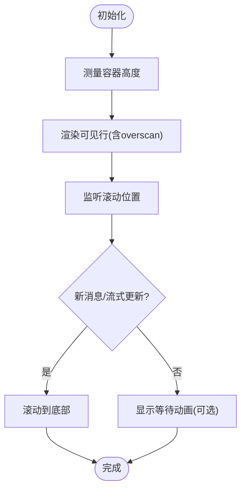

**图表来源**
- [VirtualMessageList.tsx:43-293](file://frontend/src/components/ai-assistant/VirtualMessageList.tsx#L43-L293)

**章节来源**
- [VirtualMessageList.tsx:43-293](file://frontend/src/components/ai-assistant/VirtualMessageList.tsx#L43-L293)

### 懒加载组件：LazyImage 与 LazyCodeBlock
- LazyImage
  - 通过IntersectionObserver检测进入视口再加载，支持占位符与错误状态。
- LazyCodeBlock
  - 动态导入语法高亮器与语言模块，支持行号、展开更多与按需加载。

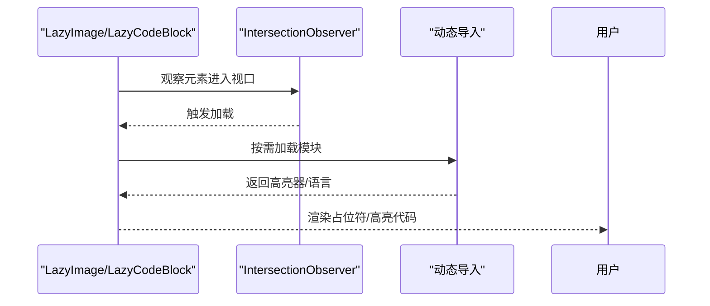

**图表来源**
- [LazyImage.tsx:15-111](file://frontend/src/components/ai-assistant/LazyImage.tsx#L15-L111)
- [LazyCodeBlock.tsx:50-166](file://frontend/src/components/ai-assistant/LazyCodeBlock.tsx#L50-L166)

**章节来源**
- [LazyImage.tsx:15-111](file://frontend/src/components/ai-assistant/LazyImage.tsx#L15-L111)
- [LazyCodeBlock.tsx:50-166](file://frontend/src/components/ai-assistant/LazyCodeBlock.tsx#L50-L166)

### **新增** 文本效果组件：TextEffect
- 职责
  - 提供多种预设动画效果：模糊(blur)、抖动(shake)、缩放(scale)、淡入(fade)、滑动(slide)。
  - 支持按词(word)、字符(char)或行(line)分割渲染。
  - 支持自定义变体和延迟触发。
- 关键机制
  - 分段渲染：将文本按指定单位分割，逐段渲染产生动画效果。
  - 预设变体：内置五种预设动画，可直接使用或自定义。
  - 动画控制：支持触发开关、延迟时间、动画完成回调。
  - ARIA支持：为无障碍访问提供适当的标签和描述。

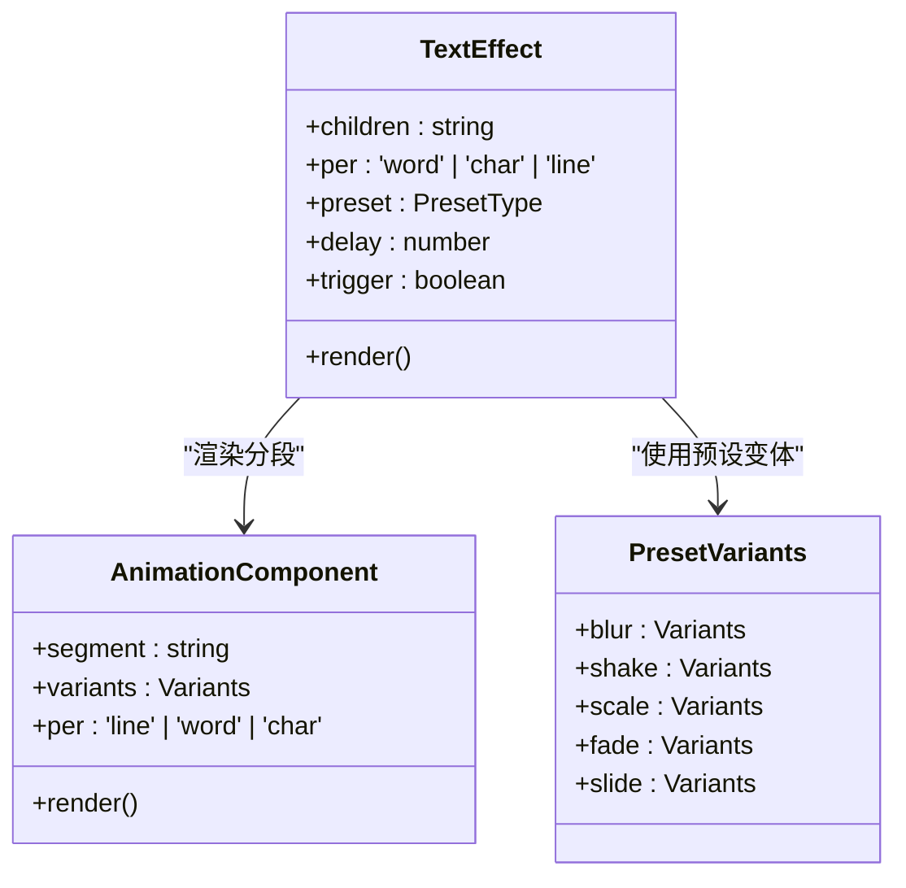

**图表来源**
- [text-effect.tsx:14-28](file://frontend/src/components/ui/text-effect.tsx#L14-L28)
- [text-effect.tsx:103-148](file://frontend/src/components/ui/text-effect.tsx#L103-L148)
- [text-effect.tsx:57-101](file://frontend/src/components/ui/text-effect.tsx#L57-L101)

**章节来源**
- [text-effect.tsx:152-225](file://frontend/src/components/ui/text-effect.tsx#L152-L225)

### **增强** 打字机文本：TypewriterText
- 职责
  - 提供流式文本渲染，模拟打字机效果。
  - 支持自适应字符添加速度，根据剩余字符数量动态调整。
  - 与ReactMarkdown集成，支持代码块和图片懒加载。
- 关键机制
  - 动画循环：使用requestAnimationFrame实现平滑动画。
  - 自适应速度：剩余字符越多，每次添加的字符数越多。
  - 状态管理：通过ref管理可变状态，避免不必要的重渲染。
  - 清理机制：组件卸载时自动清理动画循环。

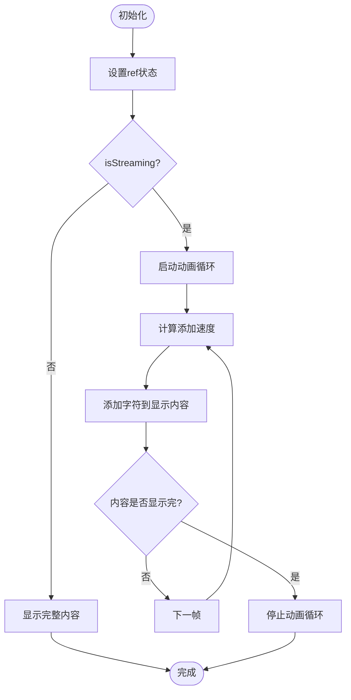

**图表来源**
- [TypewriterText.tsx:45-101](file://frontend/src/components/ai-assistant/TypewriterText.tsx#L45-L101)

**章节来源**
- [TypewriterText.tsx:45-128](file://frontend/src/components/ai-assistant/TypewriterText.tsx#L45-L128)

### SSE处理器：useSSEHandler
- 职责
  - 解析SSE行，分发到对应事件处理器，维护流式状态（技能/工具/视频/多智能体/回合切换）。
  - 更新消息、上下文使用统计、积分余额与多智能体最终结果。
- 关键事件
  - text：流式文本增量。
  - skill_call/skill_loaded：技能调用与加载完成。
  - tool_call/tool_result：工具调用与结果。
  - video_task_created：视频任务创建。
  - subtask_*：多智能体子任务生命周期。
  - billing/context_compacted/done/error：计费、上下文压缩、完成与错误。

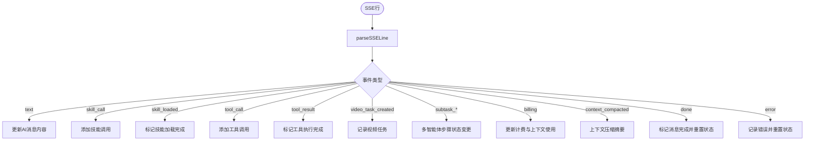

**图表来源**
- [useSSEHandler.ts:56-391](file://frontend/src/components/ai-assistant/hooks/useSSEHandler.ts#L56-L391)

**章节来源**
- [useSSEHandler.ts:25-391](file://frontend/src/components/ai-assistant/hooks/useSSEHandler.ts#L25-L391)

### 会话管理：useSessionManager
- 职责
  - Agent列表加载、会话创建/切换/清空。
  - 从后端恢复上下文使用统计与消息历史。
  - 处理画布剧场切换与页面刷新恢复。
- 关键流程
  - createSessionForTheater：优先查找现有会话，否则创建新会话并加载Agent。
  - restoreContextUsage：根据sessionId从后端恢复tokens与上下文窗口。

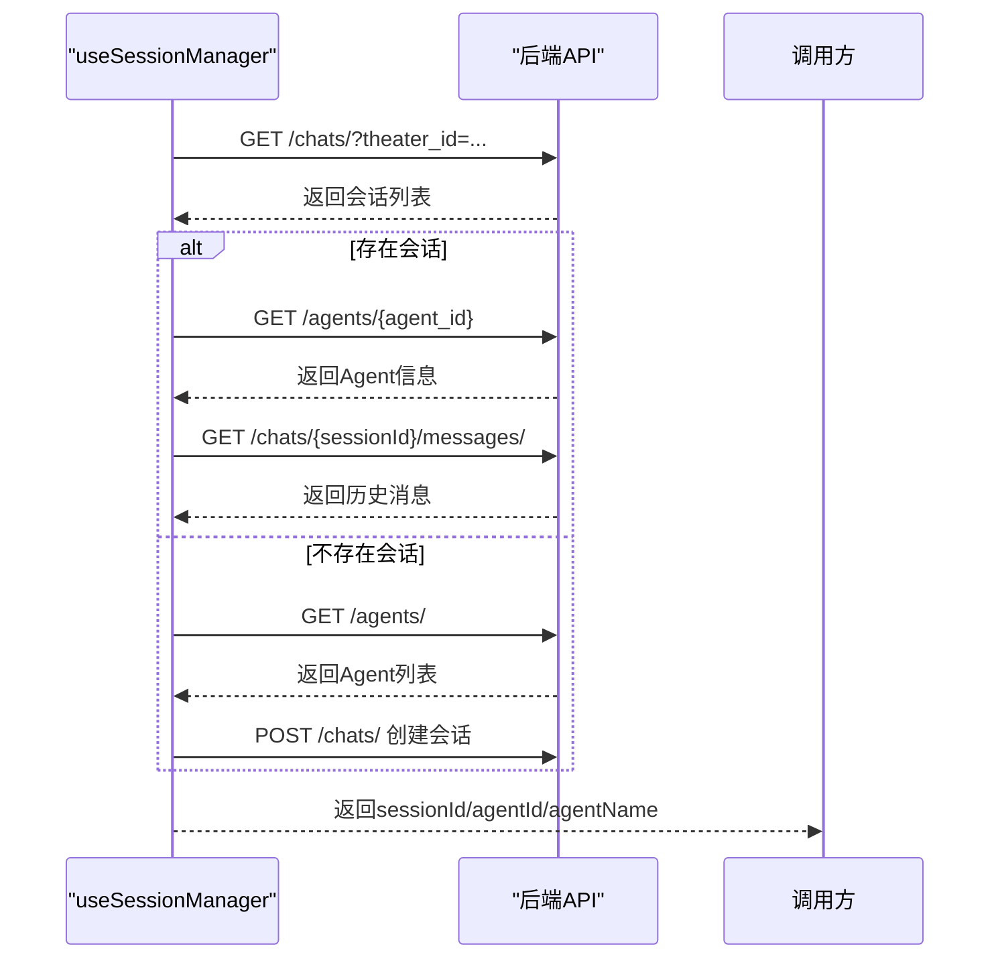

**图表来源**
- [useSessionManager.ts:52-123](file://frontend/src/components/ai-assistant/hooks/useSessionManager.ts#L52-L123)
- [useSessionManager.ts:165-189](file://frontend/src/components/ai-assistant/hooks/useSessionManager.ts#L165-L189)

**章节来源**
- [useSessionManager.ts:12-226](file://frontend/src/components/ai-assistant/hooks/useSessionManager.ts#L12-L226)

### 消息输入：MessageInput
- 职责
  - 提供用户输入区域，支持多行文本和自动高度调整。
  - Agent选择器：下拉菜单展示可用Agent及其描述和支持的节点类型。
  - 国际化支持：占位符文本、Agent名称、发送按钮标题均来自翻译键。
- 关键机制
  - 占位符解析：优先使用传入的placeholder，否则使用t('ai.inputPlaceholder')。
  - Agent显示：resolvedAgentName用于显示当前Agent名称或默认标题。
  - Agent切换：通过onSwitchAgent回调处理Agent选择。

**章节来源**
- [MessageInput.tsx:30-186](file://frontend/src/components/ai-assistant/MessageInput.tsx#L30-L186)

### 面板头部：PanelHeader
- 职责
  - 显示面板操作区域：清空会话、关闭面板。
  - 上下文使用统计：电池图标显示token使用率，悬停显示详细信息。
  - 国际化支持：清空按钮标题、上下文百分比显示等。
- 关键机制
  - 电池图标：根据使用率动态选择不同图标和颜色。
  - 悬停面板：显示详细的使用统计信息，包括已用、上限、剩余和使用率。

**章节来源**
- [PanelHeader.tsx:20-200](file://frontend/src/components/ai-assistant/PanelHeader.tsx#L20-L200)

### 欢迎消息：WelcomeMessage
- 职责
  - 面板空状态下的欢迎文案和预设对话入口。
  - 国际化支持：用户名显示、欢迎语、标语和预设对话标签。
- 关键机制
  - 预设对话：通过PRESET_PROMPTS数组定义图标、标签键和消息键。
  - 用户名处理：从认证上下文中获取昵称，不存在时使用默认用户键。

**章节来源**
- [WelcomeMessage.tsx:29-81](file://frontend/src/components/ai-assistant/WelcomeMessage.tsx#L29-L81)

## 国际化支持
Infinite Game的AI助手组件已全面集成国际化支持，覆盖所有用户界面元素：

### 国际化系统架构
- **i18n配置**：frontend/src/i18n/index.ts配置多语言资源，支持中文(zh-CN)和英文(en-US)。
- **国际化提供者**：I18nProvider.tsx在客户端挂载时从localStorage恢复用户语言偏好。
- **翻译键结构**：所有AI助手相关的文本都通过统一的"ai"命名空间管理。

### 支持的国际化键
- **基础功能**：标题、打开按钮、清空对话、输入占位符等
- **Agent管理**：Agent选择器、支持类型显示、无Agent提示等
- **上下文统计**：上下文使用百分比、统计标题、使用状态等
- **错误处理**：登录过期、请求失败、积分不足、访问拒绝、频率限制等
- **欢迎消息**：用户名显示、欢迎语、标语、预设对话等
- **预设对话**：科幻剧本、角色设计、分镜脚本、文案润色等
- **文本效果**：文本效果预设、动画类型、分段渲染等
- **调用时间线**：调用状态描述、展开/折叠控制等

### 国际化实现方式
- **Hook使用**：所有组件通过useTranslation Hook获取t函数。
- **动态翻译**：错误消息通过ERROR_KEY_MAP映射HTTP状态码到翻译键。
- **参数化文本**：支持占位符替换，如上下文百分比、节点数量等。
- **复数形式**：中文环境支持复数标记(单数/复数)。

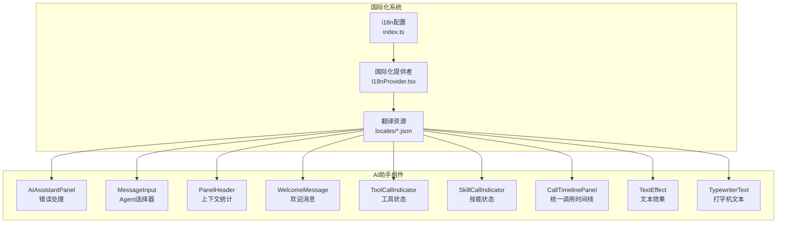

**图表来源**
- [I18nProvider.tsx:1-20](file://frontend/src/i18n/I18nProvider.tsx#L1-20)
- [index.ts:1-28](file://frontend/src/i18n/index.ts#L1-28)
- [en-US.json:161-205](file://frontend/src/i18n/locales/en-US.json#L161-L205)
- [zh-CN.json:161-205](file://frontend/src/i18n/locales/zh-CN.json#L161-L205)

**章节来源**
- [I18nProvider.tsx:1-20](file://frontend/src/i18n/I18nProvider.tsx#L1-20)
- [index.ts:1-28](file://frontend/src/i18n/index.ts#L1-28)
- [en-US.json:161-205](file://frontend/src/i18n/locales/en-US.json#L161-L205)
- [zh-CN.json:161-205](file://frontend/src/i18n/locales/zh-CN.json#L161-L205)

## 依赖关系分析
- 组件耦合
  - AIAssistantPanel依赖useSSEHandler与useSessionManager进行事件与会话处理。
  - ChatMessage依赖ThinkPanel、CallTimelinePanel、LazyImage、LazyCodeBlock、TypewriterText、TextEffect等子组件。
  - VirtualMessageList被AIAssistantPanel与ChatMessage共同使用。
  - 所有UI组件依赖国际化系统提供翻译函数。
- 状态依赖
  - 所有组件通过useAIAssistantStore共享状态，包括消息、会话、面板尺寸、上下文使用统计与附件。
- 外部依赖
  - react-markdown、remark-gfm用于Markdown渲染。
  - react-window用于虚拟滚动。
  - react-syntax-highlighter用于代码高亮（动态导入）。
  - IntersectionObserver用于懒加载。
  - react-i18next用于国际化支持。
  - **新增** framer-motion用于动画效果。
  - **新增** lucide-react用于图标组件。

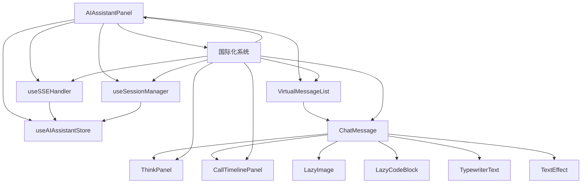

**图表来源**
- [AIAssistantPanel.tsx:18-25](file://frontend/src/components/canvas/AIAssistantPanel.tsx#L18-L25)
- [ChatMessage.tsx:1-20](file://frontend/src/components/ai-assistant/ChatMessage.tsx#L1-L20)
- [VirtualMessageList.tsx:1-7](file://frontend/src/components/ai-assistant/VirtualMessageList.tsx#L1-L7)
- [TypewriterText.tsx:1-7](file://frontend/src/components/ai-assistant/TypewriterText.tsx#L1-L7)
- [CallTimelinePanel.tsx:1-16](file://frontend/src/components/ai-assistant/CallTimelinePanel.tsx#L1-L16)
- [text-effect.tsx:1-10](file://frontend/src/components/ui/text-effect.tsx#L1-L10)
- [I18nProvider.tsx:1-20](file://frontend/src/i18n/I18nProvider.tsx#L1-L20)

**章节来源**
- [AIAssistantPanel.tsx:18-25](file://frontend/src/components/canvas/AIAssistantPanel.tsx#L18-L25)
- [ChatMessage.tsx:1-20](file://frontend/src/components/ai-assistant/ChatMessage.tsx#L1-L20)
- [VirtualMessageList.tsx:1-7](file://frontend/src/components/ai-assistant/VirtualMessageList.tsx#L1-L7)
- [TypewriterText.tsx:1-7](file://frontend/src/components/ai-assistant/TypewriterText.tsx#L1-L7)
- [CallTimelinePanel.tsx:1-16](file://frontend/src/components/ai-assistant/CallTimelinePanel.tsx#L1-L16)
- [text-effect.tsx:1-10](file://frontend/src/components/ui/text-effect.tsx#L1-L10)

## 性能考量
- 虚拟滚动：react-window动态行高+overscan，避免大量DOM节点带来的重排与重绘。
- 懒加载：图片与代码块按需加载，IntersectionObserver提前触发加载，减少首屏压力。
- 分块渲染：超大文本分块显示，降低单次渲染成本。
- **增强** 流式渲染：打字机效果与增量更新，支持自适应字符添加速度，提升交互流畅度。
- **新增** 统一时间线：CallTimelinePanel使用memo优化时间轴条目渲染，避免重复计算。
- **新增** 动画优化：使用framer-motion进行流畅的展开/折叠动画。
- 长任务监控：面板级性能监控，对长时间任务发出告警。
- 自动滚动策略：仅在用户未手动向上滚动时自动滚动，避免打断用户阅读。
- 国际化优化：翻译函数缓存，避免重复翻译调用。

## 故障排查指南
- 登录过期
  - 现象：401错误触发重新登录弹窗。
  - 处理：调用logout并引导重新登录。
- 请求失败
  - 现象：HTTP错误码映射为友好提示。
  - 处理：检查网络与后端服务状态。
- **新增** 调用时间线问题
  - 现象：CallTimelinePanel不显示或显示异常。
  - 处理：检查skillCalls和toolCalls数据格式，确认状态值正确。
- **新增** 统一时间线动画问题
  - 现象：展开/折叠动画不流畅或卡顿。
  - 处理：检查framer-motion版本兼容性，确认动画配置正确。
- 工具/技能错误
  - 现象：ToolCallIndicator显示错误状态与摘要。
  - 处理：展开查看详情，核对参数与返回结果。
- 多智能体协作异常
  - 现象：subtask_failed事件导致步骤失败。
  - 处理：查看具体错误信息与tokens消耗。
- 上下文使用统计异常
  - 现象：context_compacted事件或restore失败。
  - 处理：确认后端会话信息与Agent上下文窗口配置。
- **新增** 文本效果问题
  - 现象：TextEffect动画不生效或渲染异常。
  - 处理：检查preset参数、per属性设置，确认framer-motion版本兼容性。
- **新增** 打字机文本问题
  - 现象：TypewriterText动画卡顿或字符添加速度异常。
  - 处理：检查isStreaming状态传递，确认requestAnimationFrame兼容性。
- 国际化问题
  - 现象：文本显示为键名而非翻译内容。
  - 处理：检查翻译键是否存在、语言包加载是否正确、localStorage语言偏好设置。

**章节来源**
- [AIAssistantPanel.tsx:240-252](file://frontend/src/components/canvas/AIAssistantPanel.tsx#L240-L252)
- [useSSEHandler.ts:375-380](file://frontend/src/components/ai-assistant/hooks/useSSEHandler.ts#L375-L380)
- [useSSEHandler.ts:255-267](file://frontend/src/components/ai-assistant/hooks/useSSEHandler.ts#L255-L267)
- [useSSEHandler.ts:351-363](file://frontend/src/components/ai-assistant/hooks/useSSEHandler.ts#L351-L363)
- [useSessionManager.ts:165-189](file://frontend/src/components/ai-assistant/hooks/useSessionManager.ts#L165-L189)

## 结论
AI助手组件通过清晰的分层架构与完善的Hooks抽象，实现了高性能、可观测与可扩展的聊天体验。其核心优势包括：
- 流式SSE事件驱动的实时交互与多智能体协作可视化。
- 基于虚拟滚动与懒加载的渲染优化，保障大规模消息场景下的流畅性。
- **新增** 统一调用时间线面板，提供更好的可视化体验和用户体验。
- 完整的工具/技能状态展示与错误处理，提升调试与运维效率。
- 会话与上下文使用统计的持久化与恢复，增强用户体验连续性。
- 全面的国际化支持，覆盖所有用户界面元素，提供多语言本地化体验。
- **新增** 文本效果组件提供丰富的视觉动画，增强用户交互体验。
- **增强** 打字机文本渲染优化了流式传输的性能和用户体验。

## 附录

### 使用示例与交互模式
- 基本对话
  - 打开面板 → 输入消息 → 查看AI回复与思考过程 → 统一调用时间线状态指示 → 图片/代码块懒加载。
- 多智能体协作
  - 发送任务 → 观察子任务创建/执行/完成 → 查看步骤详情与tokens消耗。
- 附件与图像编辑
  - 从画布拖拽节点到面板 → 预览缩略图 → 发送消息时自动拼接上下文 → 图像编辑上下文横幅提示。
- 会话管理
  - Agent切换 → 清空会话 → 上下文使用统计恢复。
- 国际化切换
  - 通过语言切换器在中文和英文之间切换 → 所有界面元素自动更新为对应语言。
- **新增** 统一调用时间线应用
  - 在需要展示技能和工具调用状态时使用CallTimelinePanel。
  - 支持展开/折叠查看详情，查看参数、结果和错误摘要。
  - 适用于复杂的多步骤工作流和工具链调用场景。

**章节来源**
- [AIAssistantPanel.tsx:182-313](file://frontend/src/components/canvas/AIAssistantPanel.tsx#L182-L313)
- [useSessionManager.ts:125-146](file://frontend/src/components/ai-assistant/hooks/useSessionManager.ts#L125-146)
- [ChatMessage.tsx:215-251](file://frontend/src/components/ai-assistant/ChatMessage.tsx#L215-L251)
- [CallTimelinePanel.tsx:173-367](file://frontend/src/components/ai-assistant/CallTimelinePanel.tsx#L173-L367)

### 自定义消息格式
- 思考标记
  - 使用<think>...</think>包裹思考内容，支持流式与非流式场景。
- 视频任务标记
  - 内容中插入任务标记，完成后显示视频卡片；或通过SSE事件推送。
- 附件元数据
  - 用户消息中嵌入隐藏元数据块与消息起始标记，用于AI感知节点内容。
- **新增** 统一调用状态
  - 使用message.skill_calls和message.tool_calls字段，由ChatMessage自动渲染为CallTimelinePanel。
  - 支持技能调用（loading/loaded状态）和工具调用（executing/completed状态）。

**章节来源**
- [ChatMessage.tsx:24-28](file://frontend/src/components/ai-assistant/ChatMessage.tsx#L24-L28)
- [ChatMessage.tsx:36-51](file://frontend/src/components/ai-assistant/ChatMessage.tsx#L36-L51)
- [ChatMessage.tsx:102-126](file://frontend/src/components/ai-assistant/ChatMessage.tsx#L102-L126)
- [AIAssistantPanel.tsx:36-49](file://frontend/src/components/canvas/AIAssistantPanel.tsx#L36-L49)
- [useAIAssistantStore.ts:50-63](file://frontend/src/store/useAIAssistantStore.ts#L50-L63)

### 国际化键参考
- **基础AI功能**：ai.title, ai.openButton, ai.clearChat, ai.inputPlaceholder, ai.send, ai.sending
- **Agent管理**：ai.selectAgent, ai.supports, ai.noAgents
- **上下文统计**：ai.context, ai.contextStats, ai.used, ai.limit, ai.remaining, ai.usageRate
- **错误处理**：ai.loginExpired, ai.loginExpiredDesc, ai.cancel, ai.relogin, ai.requestFailed
- **预设对话**：ai.presets.scifiScript, ai.presets.designCharacter, ai.presets.storyboard, ai.presets.polishStory
- **欢迎消息**：ai.welcome.greeting, ai.welcome.subtitle, ai.welcome.defaultUser
- **文本效果**：ai.textEffect.presetBlur, ai.textEffect.presetShake, ai.textEffect.presetScale, ai.textEffect.presetFade, ai.textEffect.presetSlide
- **调用时间线**：ai.callTimeline.header, ai.callTimeline.expanded, ai.callTimeline.collapsed, ai.callTimeline.executing, ai.callTimeline.completed, ai.callTimeline.failed

**章节来源**
- [en-US.json:161-205](file://frontend/src/i18n/locales/en-US.json#L161-L205)
- [zh-CN.json:161-205](file://frontend/src/i18n/locales/zh-CN.json#L161-L205)

### **新增** 统一调用时间线组件API
- **CallTimelinePanelProps**
  - skillCalls: SkillCall[] - 技能调用数组，包含技能名称和状态
  - toolCalls: ToolCall[] - 工具调用数组，包含工具名称、参数和状态
  - className: string - 自定义CSS类名

- **TimelineEntry接口**
  - id: string - 条目唯一标识
  - type: 'skill' | 'tool' - 条目类型
  - name: string - 名称
  - status: 'loading' | 'loaded' | 'executing' | 'completed' - 状态
  - arguments: Record<string, unknown> - 参数对象
  - result: string - 结果或错误信息
  - duration: number - 执行耗时（毫秒）
  - description: string - 描述信息

- **状态解析规则**
  - active: loading/executing 状态
  - success: loaded/completed 状态（无错误）
  - error: completed 状态且包含错误
  - pending: 其他状态

**章节来源**
- [CallTimelinePanel.tsx:42-46](file://frontend/src/components/ai-assistant/CallTimelinePanel.tsx#L42-L46)
- [CallTimelinePanel.tsx:31-40](file://frontend/src/components/ai-assistant/CallTimelinePanel.tsx#L31-L40)
- [CallTimelinePanel.tsx:99-106](file://frontend/src/components/ai-assistant/CallTimelinePanel.tsx#L99-L106)

### **新增** 统一调用时间线组件使用示例
- 在ChatMessage中自动使用
  ```typescript
  // ChatMessage内部自动渲染
  {((message.skill_calls && message.skill_calls.length > 0) ||
    (message.tool_calls && message.tool_calls.length > 0)) && (
    <CallTimelinePanel
      skillCalls={message.skill_calls}
      toolCalls={message.tool_calls}
    />
  )}
  ```

- 手动使用示例
  ```typescript
  import { CallTimelinePanel } from '@/components/ai-assistant/CallTimelinePanel';

  // 技能调用示例
  const skillCalls = [
    { skill_name: '图像生成', status: 'loading' },
    { skill_name: '文本润色', status: 'loaded' }
  ];

  // 工具调用示例
  const toolCalls = [
    { 
      tool_name: 'image_gen', 
      status: 'executing',
      arguments: { prompt: '美丽的风景' }
    },
    { 
      tool_name: 'text_editor', 
      status: 'completed',
      result: '润色后的文本内容',
      duration: 150
    }
  ];

  // 渲染统一时间线
  <CallTimelinePanel 
    skillCalls={skillCalls} 
    toolCalls={toolCalls} 
  />
  ```

**章节来源**
- [ChatMessage.tsx:444-450](file://frontend/src/components/ai-assistant/ChatMessage.tsx#L444-L450)
- [CallTimelinePanel.tsx:173-367](file://frontend/src/components/ai-assistant/CallTimelinePanel.tsx#L173-L367)

### **新增** 组件迁移指南
由于CallTimelinePanel替代了原有的ToolCallIndicator和SkillCallIndicator，建议进行以下迁移：

- **迁移前**（使用旧组件）
  ```typescript
  // 旧方式：分别导入两个组件
  import { ToolCallIndicator } from '@/components/ai-assistant/ToolCallIndicator';
  import { SkillCallIndicator } from '@/components/ai-assistant/SkillCallIndicator';
  ```

- **迁移后**（使用统一组件）
  ```typescript
  // 新方式：导入统一时间线组件
  import { CallTimelinePanel } from '@/components/ai-assistant/CallTimelinePanel';
  ```

- **状态数据保持兼容**
  - ToolCallIndicator使用ToolCall接口：{ tool_name, arguments, status, result, duration }
  - SkillCallIndicator使用SkillCall接口：{ skill_name, status }
  - CallTimelinePanel兼容这两种数据格式，无需修改状态结构

- **样式和交互差异**
  - CallTimelinePanel提供统一的垂直时间轴布局
  - 支持展开/折叠查看详情
  - 更丰富的状态图标和颜色方案
  - 支持错误摘要的自动检测

**章节来源**
- [CallTimelinePanel.tsx:52-61](file://frontend/src/components/ai-assistant/CallTimelinePanel.tsx#L52-L61)
- [useAIAssistantStore.ts:8-19](file://frontend/src/store/useAIAssistantStore.ts#L8-L19)