# ThinkPanel 样式设计指南

<cite>
**本文档引用的文件**
- [ThinkPanel.tsx](file://frontend/src/components/ai-assistant/ThinkPanel.tsx)
- [globals.css](file://frontend/src/app/globals.css)
- [_variables.scss](file://frontend/src/styles/_variables.scss)
- [_keyframe-animations.scss](file://frontend/src/styles/_keyframe-animations.scss)
- [LoadingDots.tsx](file://frontend/src/components/ai-assistant/LoadingDots.tsx)
- [ThinkingIndicator.tsx](file://frontend/src/components/ai-assistant/ThinkingIndicator.tsx)
- [tailwind.config.ts](file://frontend/tailwind.config.ts)
- [useAIAssistantStore.ts](file://frontend/src/store/useAIAssistantStore.ts)
</cite>

## 更新摘要
**变更内容**
- 重大改进 ThinkPanel 颜色方案，采用标准化的 muted 调色板系统
- 优化状态图标映射，实现更清晰的状态可视化
- 改进边框处理机制，统一使用 `border-border/50` 和 `border-border/40`
- 增强交互反馈，优化过渡效果和动画性能
- 完善进度条和步骤指示器样式，提升用户体验一致性

## 目录
1. [简介](#简介)
2. [项目结构概览](#项目结构概览)
3. [核心组件架构](#核心组件架构)
4. [样式系统设计](#样式系统设计)
5. [ThinkPanel 组件详解](#thinkpanel-组件详解)
6. [动画与交互设计](#动画与交互设计)
7. [响应式设计策略](#响应式设计策略)
8. [主题系统实现](#主题系统实现)
9. [性能优化考虑](#性能优化考虑)
10. [最佳实践指南](#最佳实践指南)

## 简介

ThinkPanel 是一个专为 AI 助手设计的思考过程展示面板组件，采用现代化的 React + TypeScript 架构构建。该组件支持单智能体和多智能体两种工作模式，提供完整的思考过程可视化、实时进度跟踪和状态管理功能。

本设计指南旨在帮助开发者深入理解 ThinkPanel 的样式设计理念、实现原理和最佳实践，确保在不同场景下都能提供一致且优质的用户体验。

## 项目结构概览

前端项目采用模块化架构设计，主要包含以下关键目录：

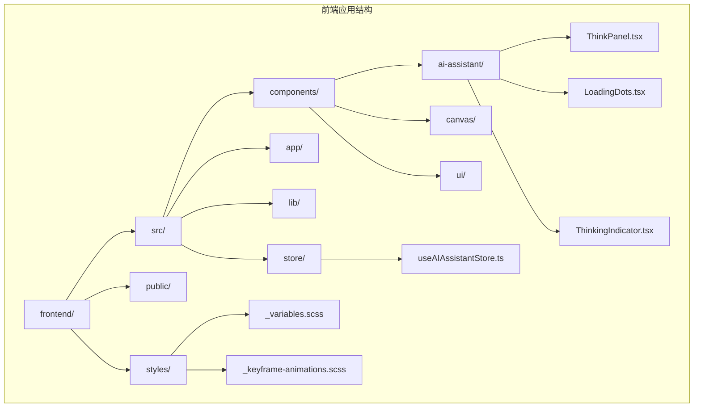

**图表来源**
- [globals.css:1-536](file://frontend/src/app/globals.css#L1-L536)
- [ThinkPanel.tsx:1-280](file://frontend/src/components/ai-assistant/ThinkPanel.tsx#L1-L280)

## 核心组件架构

### 组件层次结构

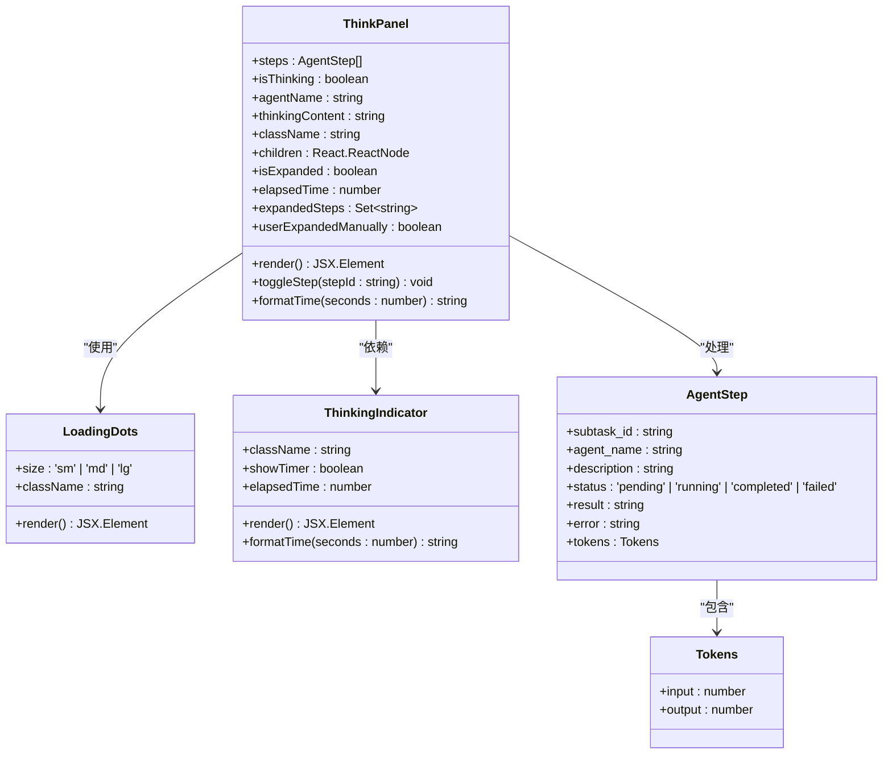

**图表来源**
- [ThinkPanel.tsx:10-17](file://frontend/src/components/ai-assistant/ThinkPanel.tsx#L10-L17)
- [LoadingDots.tsx:6-9](file://frontend/src/components/ai-assistant/LoadingDots.tsx#L6-L9)
- [ThinkingIndicator.tsx:8-11](file://frontend/src/components/ai-assistant/ThinkingIndicator.tsx#L8-L11)

### 数据流架构

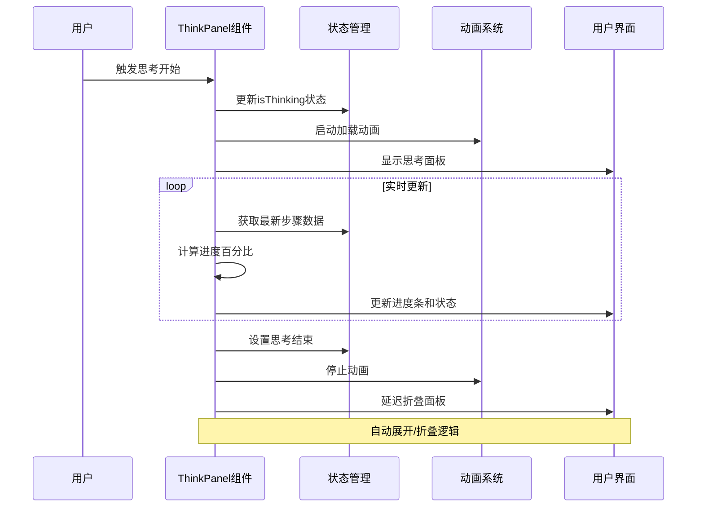

**图表来源**
- [ThinkPanel.tsx:74-86](file://frontend/src/components/ai-assistant/ThinkPanel.tsx#L74-L86)
- [ThinkPanel.tsx:117-118](file://frontend/src/components/ai-assistant/ThinkPanel.tsx#L117-L118)

## 样式系统设计

### 设计系统基础

项目采用统一的设计系统，基于 Tailwind CSS 和自定义 SCSS 变量构建：

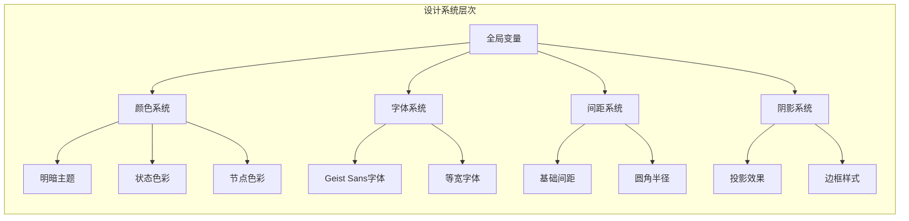

**图表来源**
- [_variables.scss:1-297](file://frontend/src/styles/_variables.scss#L1-L297)
- [globals.css:216-247](file://frontend/src/app/globals.css#L216-L247)

### 颜色系统架构

**更新** ThinkPanel 现在采用增强的颜色方案设计，使用标准化的 muted 颜色调色板系统

```mermaid
flowchart TD
A[颜色系统] --> B[基础颜色变量]
A --> C[主题特定变量]
A --> D[状态色彩映射]
B --> E[--background, --foreground]
B --> F[--primary, --secondary]
B --> G[--muted, --accent]
C --> H[:root.light 主题]
C --> I[:root.dark 主题]
C --> J:[data-theme="light/dark"]
D --> K[成功状态]
D --> L[错误状态]
D --> M[执行中状态]
D --> N[等待状态]
K --> O[--color-status-success-*]
L --> P[--color-status-error-*]
M --> Q[--color-status-executing-*]
N --> R[--color-status-pending-*]
```

**图表来源**
- [globals.css:91-137](file://frontend/src/app/globals.css#L91-L137)
- [globals.css:167-214](file://frontend/src/app/globals.css#L167-L214)

### ThinkPanel 颜色方案增强

**新增** ThinkPanel 现在使用标准化的 muted 颜色调色板系统，实现更一致的视觉体验：

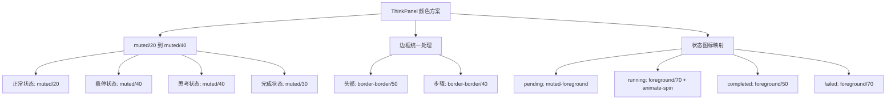

**图表来源**
- [ThinkPanel.tsx:125-133](file://frontend/src/components/ai-assistant/ThinkPanel.tsx#L125-L133)
- [ThinkPanel.tsx:20-25](file://frontend/src/components/ai-assistant/ThinkPanel.tsx#L20-L25)

## ThinkPanel 组件详解

### 核心功能特性

ThinkPanel 组件具备以下核心功能：

1. **双模式支持**：单智能体模式和多智能体协作模式
2. **智能展开控制**：根据状态自动展开/折叠
3. **实时进度跟踪**：显示执行进度和剩余时间
4. **状态可视化**：通过图标和颜色区分不同状态
5. **响应式设计**：适配不同屏幕尺寸

### 组件属性配置

| 属性名 | 类型 | 必需 | 默认值 | 描述 |
|--------|------|------|--------|------|
| steps | AgentStep[] | 否 | [] | 智能体步骤数组 |
| isThinking | boolean | 否 | false | 是否处于思考状态 |
| agentName | string | 否 | undefined | 智能体名称 |
| thinkingContent | string | 否 | undefined | 思考内容文本 |
| className | string | 否 | undefined | 自定义CSS类名 |
| children | React.ReactNode | 否 | undefined | 子组件内容 |

### 状态管理机制

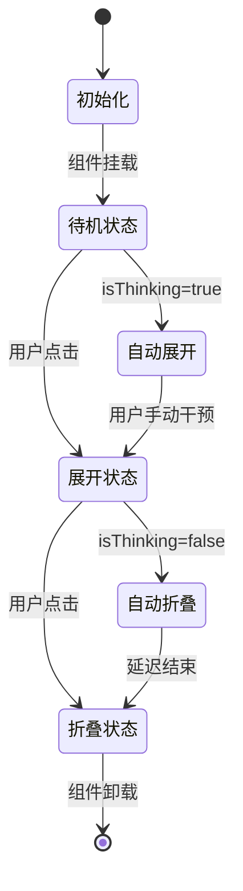

**图表来源**
- [ThinkPanel.tsx:44-48](file://frontend/src/components/ai-assistant/ThinkPanel.tsx#L44-L48)
- [ThinkPanel.tsx:74-86](file://frontend/src/components/ai-assistant/ThinkPanel.tsx#L74-L86)

### 进度计算算法

```mermaid
flowchart TD
A[计算进度] --> B[统计步骤状态]
B --> C[completedCount = 状态=completed的步骤数]
B --> D[failedCount = 状态=failed的步骤数]
B --> E[runningCount = 状态=running的步骤数]
B --> F[total = 总步骤数]
C --> G[计算百分比]
D --> G
E --> G
F --> G
G --> H[percentage = floor(completedCount/total*100)]
G --> I[isAllDone = (completedCount+failedCount)==total && total>0]
H --> J[返回进度对象]
I --> J
J --> K[完成]
```

**图表来源**
- [ThinkPanel.tsx:51-65](file://frontend/src/components/ai-assistant/ThinkPanel.tsx#L51-L65)

### 边框处理改进

**新增** ThinkPanel 现在采用统一的边框处理机制，确保视觉一致性：

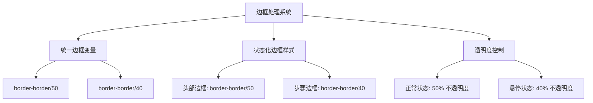

**图表来源**
- [ThinkPanel.tsx:127](file://frontend/src/components/ai-assistant/ThinkPanel.tsx#L127)
- [ThinkPanel.tsx:224](file://frontend/src/components/ai-assistant/ThinkPanel.tsx#L224)

### 状态图标映射优化

**更新** ThinkPanel 现在使用优化的状态图标映射系统：

```mermaid
flowchart TD
A[状态图标映射] --> B[图标配置对象]
A --> C[动态状态解析]
A --> D[条件渲染]
B --> E[pending: Circle]
B --> F[running: Loader2 + animate-spin]
B --> G[completed: CheckCircle2]
B --> H[failed: XCircle]
C --> I[STATUS_ICON_MAP[step.status]]
C --> J[默认回退到pending]
D --> K[Icon className 组合]
D --> L[text-muted-foreground]
D --> M[foreground/70 + animate-spin]
```

**图表来源**
- [ThinkPanel.tsx:19-25](file://frontend/src/components/ai-assistant/ThinkPanel.tsx#L19-L25)
- [ThinkPanel.tsx:219-220](file://frontend/src/components/ai-assistant/ThinkPanel.tsx#L219-L220)

## 动画与交互设计

### 加载动画系统

项目实现了多层次的加载动画系统，为用户提供丰富的视觉反馈：

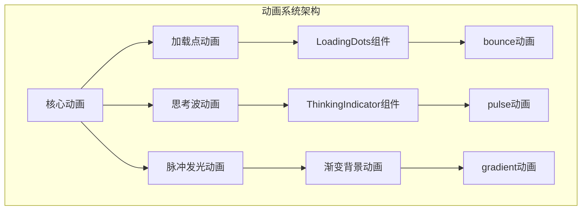

**图表来源**
- [_keyframe-animations.scss:157-176](file://frontend/src/styles/_keyframe-animations.scss#L157-L176)
- [LoadingDots.tsx:23-49](file://frontend/src/components/ai-assistant/LoadingDots.tsx#L23-L49)

### 动画配置参数

| 动画类型 | 持续时间 | 缓动函数 | 关键帧特性 |
|----------|----------|----------|------------|
| bounce | 1s | ease-in-out | 上下弹跳效果 |
| cursorBlink | 0.53s | ease-in-out | 光标闪烁效果 |
| thinkingWave | 2s | ease-in-out | 思考波浪动画 |
| pulseGlow | 2s | ease-in-out | 脉冲发光效果 |
| slideInFromRight | 0.3s | ease-out | 右侧滑入效果 |

### 交互反馈机制

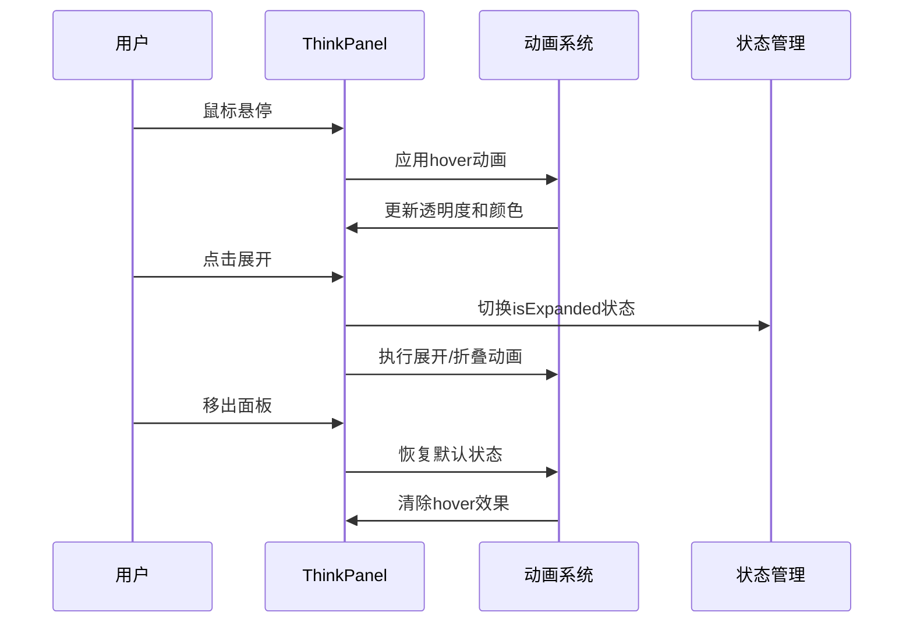

**图表来源**
- [ThinkPanel.tsx:125-139](file://frontend/src/components/ai-assistant/ThinkPanel.tsx#L125-L139)
- [ThinkPanel.tsx:182-189](file://frontend/src/components/ai-assistant/ThinkPanel.tsx#L182-L189)

### 过渡效果优化

**新增** ThinkPanel 现在采用优化的过渡效果系统，提升用户体验：

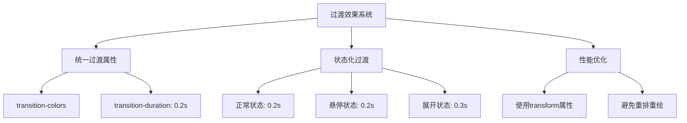

**图表来源**
- [ThinkPanel.tsx:127](file://frontend/src/components/ai-assistant/ThinkPanel.tsx#L127)
- [ThinkPanel.tsx:188](file://frontend/src/components/ai-assistant/ThinkPanel.tsx#L188)

## 响应式设计策略

### 断点系统

项目采用移动端优先的设计理念，支持多种屏幕尺寸：

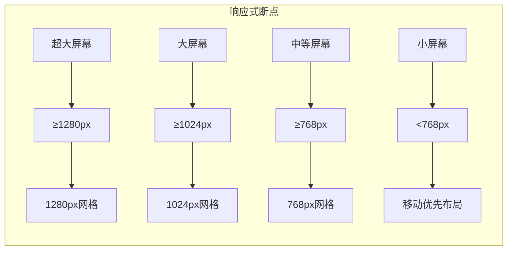

### 移动端优化

针对移动设备进行了专门的优化处理：

| 优化项 | 桌面端 | 移动端 | 差异说明 |
|--------|--------|--------|----------|
| 字体大小 | 16px | 14px | 减少字体大小提升可读性 |
| 内边距 | 1rem | 0.75rem | 减少内边距适应小屏幕 |
| 圆角半径 | 0.75rem | 0.5rem | 减小圆角提升触摸友好性 |
| 最小点击区域 | 2rem | 1.5rem | 满足WCAG 2.1标准 |

### 触摸交互优化

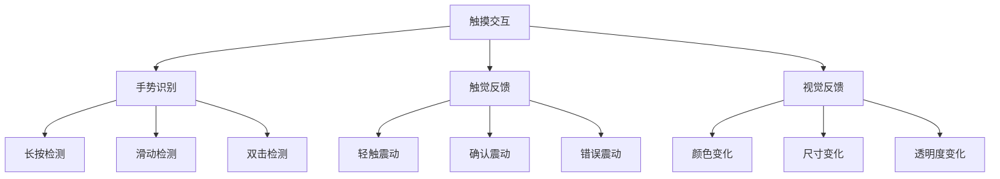

## 主题系统实现

### 明暗主题切换

项目实现了完整的明暗主题切换机制，支持系统偏好检测和手动切换：

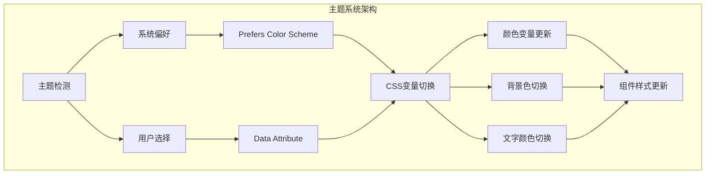

**图表来源**
- [globals.css:34-62](file://frontend/src/app/globals.css#L34-L62)
- [globals.css:64-138](file://frontend/src/app/globals.css#L64-L138)

### 主题变量映射

| 变量类别 | 明色主题变量 | 暗色主题变量 | 使用场景 |
|----------|--------------|--------------|----------|
| 基础颜色 | --background: #ffffff | --background: #09090b | 页面背景 |
| 文字颜色 | --foreground: #09090b | --foreground: #fafafa | 主要文字 |
| 边框颜色 | --border: #e4e4e7 | --border: #27272a | 组件边框 |
| 面板背景 | --color-bg-panel: #f4f4f5 | --color-bg-panel: #27272a | 面板背景 |
| 面板悬停 | --color-bg-panel-hover: #e4e4e7 | --color-bg-panel-hover: #3f3f46 | 面板悬停态 |
| 成功状态 | --color-status-success-text: #15803d | --color-status-success-text: #86efac | 成功状态文字 |

### 动态主题切换

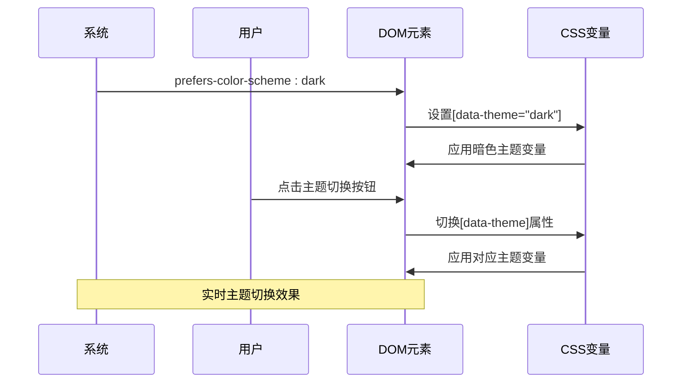

**图表来源**
- [globals.css:64-138](file://frontend/src/app/globals.css#L64-L138)
- [globals.css:140-214](file://frontend/src/app/globals.css#L140-L214)

### ThinkPanel 主题增强

**新增** ThinkPanel 现在采用统一的主题处理机制，确保在不同主题下的一致性：

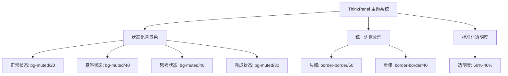

**图表来源**
- [ThinkPanel.tsx:125-133](file://frontend/src/components/ai-assistant/ThinkPanel.tsx#L125-L133)
- [ThinkPanel.tsx:224](file://frontend/src/components/ai-assistant/ThinkPanel.tsx#L224)

## 性能优化考虑

### 渲染性能优化

项目采用了多项性能优化策略：

1. **React.memo 优化**：使用 useMemo 和 useCallback 避免不必要的重新渲染
2. **虚拟滚动**：对于大量数据的列表使用虚拟化技术
3. **懒加载组件**：图片和代码块采用懒加载机制
4. **动画性能**：使用 transform 和 opacity 属性优化动画性能

### 内存管理

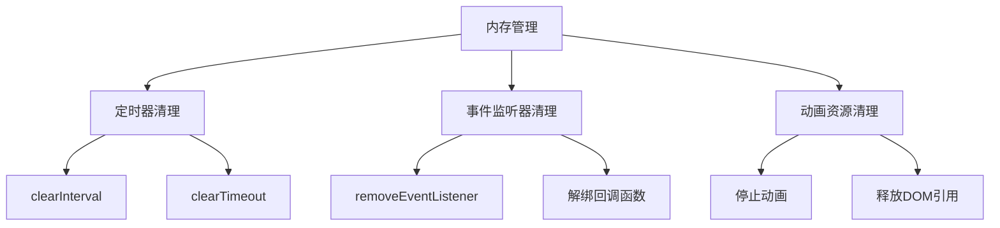

### 代码分割

项目实现了智能的代码分割策略：

| 组件类型 | 分割策略 | 加载时机 |
|----------|----------|----------|
| 路由组件 | 动态导入 | 路由访问时 |
| 图片组件 | 懒加载 | 可见区域时 |
| 代码块 | 按需加载 | 需要高亮时 |
| 动画组件 | 条件加载 | 需要动画时 |

## 最佳实践指南

### 样式编写规范

1. **语义化命名**：使用描述性的CSS类名，避免使用表现性命名
2. **组件化设计**：每个组件拥有独立的样式文件，便于维护
3. **变量优先**：优先使用CSS变量而非硬编码颜色值
4. **响应式优先**：采用移动优先的设计理念

### 性能优化建议

1. **避免重绘**：尽量使用 transform 和 opacity 属性
2. **批量更新**：合并多个样式变更操作
3. **合理使用z-index**：避免过度使用z-index造成层级混乱
4. **优化选择器**：使用高效的CSS选择器，避免深层嵌套

### 可访问性考虑

1. **对比度要求**：确保文本与背景的对比度满足WCAG 2.1标准
2. **键盘导航**：支持完整的键盘操作体验
3. **屏幕阅读器**：为辅助技术提供适当的语义标记
4. **动画偏好**：尊重用户的减少动画偏好设置

### 测试策略

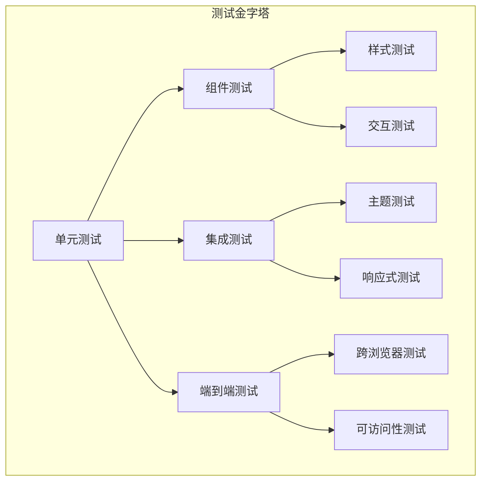

### ThinkPanel 最佳实践

**新增** ThinkPanel 样式设计的最佳实践：

1. **统一颜色系统**：始终使用 muted 调色板进行状态表示
2. **边框一致性**：使用 `border-border/50` 和 `border-border/40` 保持视觉统一
3. **过渡优化**：合理使用 0.2s-0.3s 的过渡持续时间
4. **状态可视化**：通过颜色透明度和图标状态清晰表达组件状态
5. **性能优先**：使用 transform 和 opacity 属性优化动画性能
6. **状态映射**：利用 STATUS_ICON_MAP 实现清晰的状态指示
7. **响应式设计**：确保在不同屏幕尺寸下的一致体验

通过遵循这些设计指南和最佳实践，开发者可以创建出既美观又实用的 ThinkPanel 组件，为用户提供优秀的AI助手交互体验。