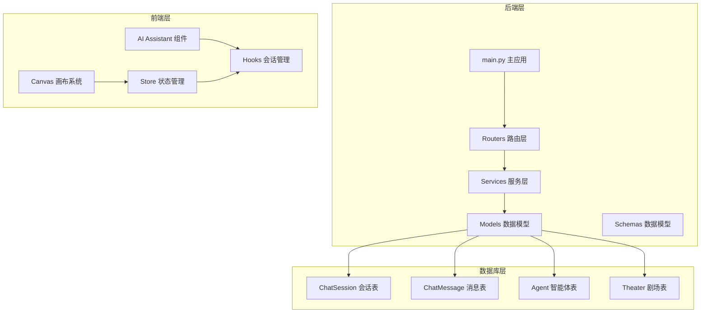
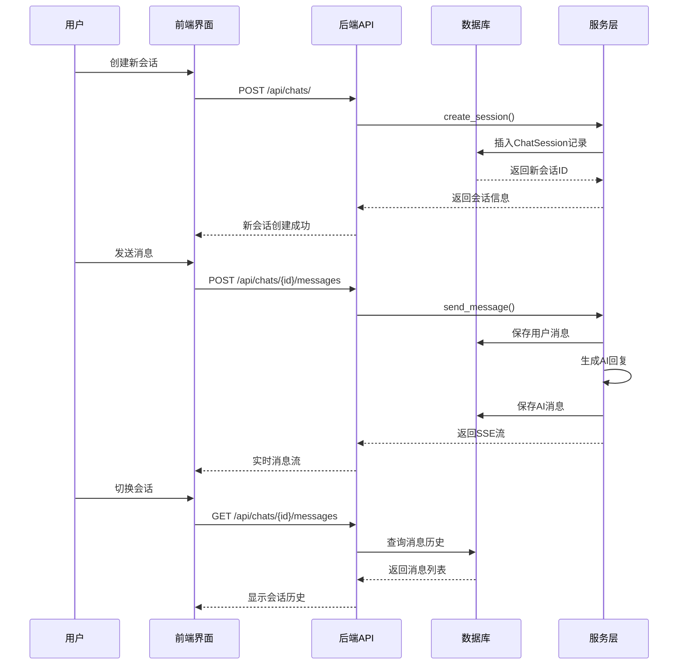
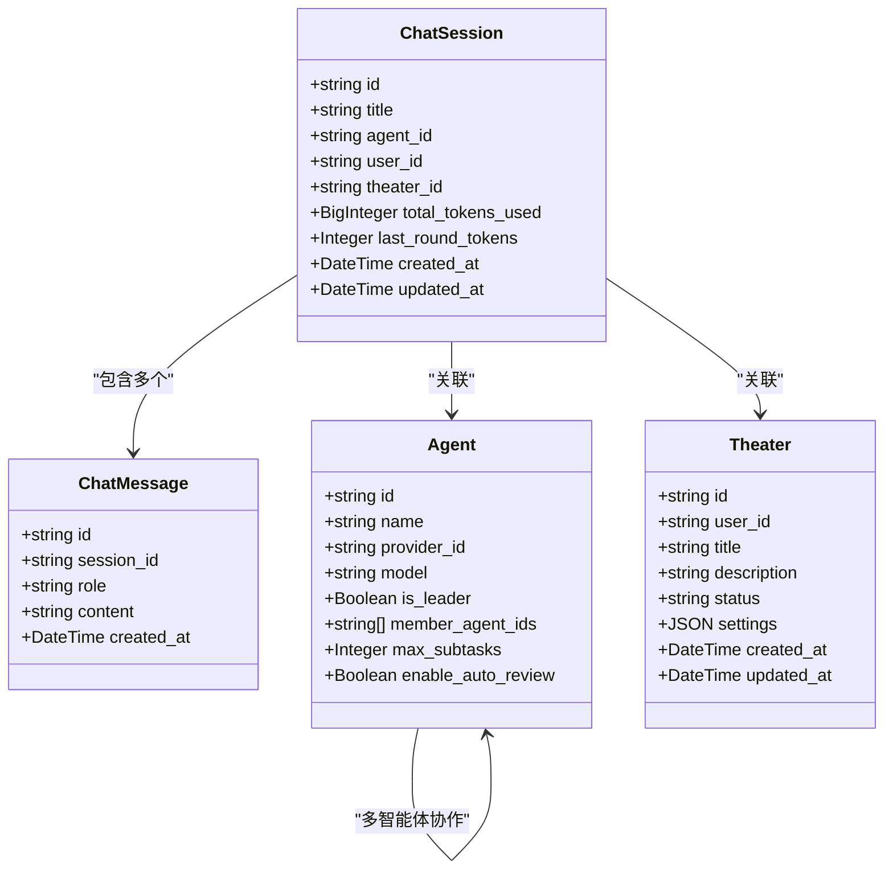
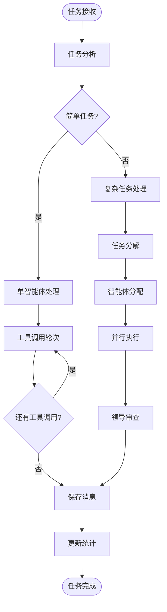
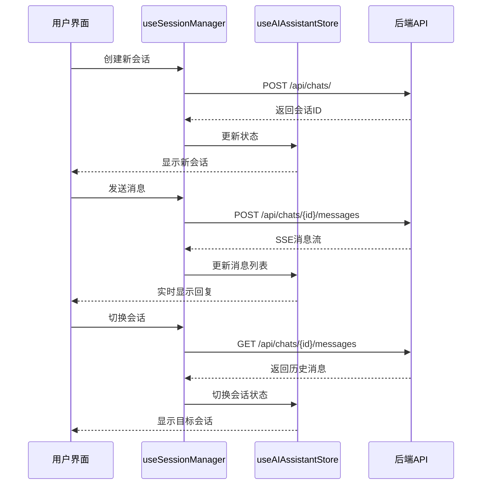
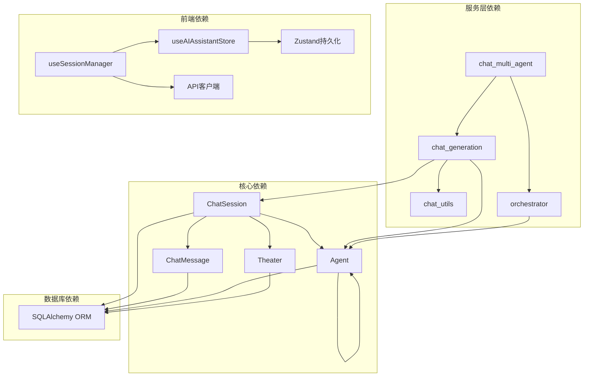

# 多会话管理功能

<cite>
**本文档引用的文件**
- [main.py](file://backend/main.py)
- [chats.py](file://backend/routers/chats.py)
- [models.py](file://backend/models.py)
- [chat_generation.py](file://backend/services/chat_generation.py)
- [chat_multi_agent.py](file://backend/services/chat_multi_agent.py)
- [orchestrator.py](file://backend/services/orchestrator.py)
- [chat_utils.py](file://backend/services/chat_utils.py)
- [schemas.py](file://backend/schemas.py)
- [useSessionManager.ts](file://frontend/src/components/ai-assistant/hooks/useSessionManager.ts)
- [useAIAssistantStore.ts](file://frontend/src/store/useAIAssistantStore.ts)
- [page.tsx](file://frontend/src/app/theater/[id]/page.tsx)
</cite>

## 目录
1. [简介](#简介)
2. [项目结构](#项目结构)
3. [核心组件](#核心组件)
4. [架构概览](#架构概览)
5. [详细组件分析](#详细组件分析)
6. [依赖关系分析](#依赖关系分析)
7. [性能考虑](#性能考虑)
8. [故障排除指南](#故障排除指南)
9. [结论](#结论)

## 简介

多会话管理功能是本项目的核心特性之一，它允许用户在不同的剧场（Theater）环境中创建、管理和切换多个独立的AI对话会话。该功能实现了完整的会话生命周期管理，包括会话创建、消息管理、上下文跟踪、多智能体协作等功能。

系统采用前后端分离架构，后端基于FastAPI构建RESTful API，前端使用Next.js和React实现响应式的用户界面。多会话管理功能通过会话ID进行标识和管理，每个会话都与特定的剧场关联，支持在同一剧场内进行多轮对话。

## 项目结构

项目采用模块化的组织方式，主要分为以下层次：

**图表来源**
- [main.py:110-180](file://backend/main.py#L110-L180)
- [models.py:178-209](file://backend/models.py#L178-L209)

**章节来源**
- [main.py:1-180](file://backend/main.py#L1-180)
- [models.py:1-506](file://backend/models.py#L1-L506)

## 核心组件

多会话管理功能由多个核心组件协同工作：

### 1. 会话模型层
- **ChatSession**: 管理会话的基本信息、关联的智能体和剧场
- **ChatMessage**: 存储对话消息内容和元数据
- **Agent**: 定义智能体配置和能力
- **Theater**: 表示用户创建的创意项目环境

### 2. 服务层组件
- **chat_generation**: 单智能体对话生成服务
- **chat_multi_agent**: 多智能体协作服务
- **orchestrator**: 动态多智能体编排引擎
- **chat_utils**: 通用聊天工具函数

### 3. 前端组件
- **useSessionManager**: 会话管理Hook
- **useAIAssistantStore**: Zustand状态管理
- **AI Assistant Panel**: AI助手界面组件

**章节来源**
- [models.py:178-276](file://backend/models.py#L178-L276)
- [chat_generation.py:30-487](file://backend/services/chat_generation.py#L30-L487)
- [useSessionManager.ts:12-358](file://frontend/src/components/ai-assistant/hooks/useSessionManager.ts#L12-L358)

## 架构概览

多会话管理功能采用分层架构设计，实现了清晰的关注点分离：

**图表来源**
- [chats.py:25-260](file://backend/routers/chats.py#L25-L260)
- [chat_generation.py:155-212](file://backend/services/chat_generation.py#L155-L212)

系统架构特点：
- **RESTful API设计**: 使用标准HTTP方法管理会话资源
- **Server-Sent Events**: 实现实时消息流传输
- **异步处理**: 支持长时间运行的AI生成任务
- **多智能体支持**: 集成动态编排引擎处理复杂任务

## 详细组件分析

### 会话管理服务

会话管理服务是多会话功能的核心，负责处理所有会话相关的操作：

**图表来源**
- [models.py:178-276](file://backend/models.py#L178-L276)

#### 会话生命周期管理

会话管理服务实现了完整的生命周期管理：

1. **创建阶段**: 验证智能体存在性，建立会话关联
2. **活跃阶段**: 处理消息发送、接收和实时更新
3. **维护阶段**: 管理上下文压缩和统计信息
4. **销毁阶段**: 清理消息历史和会话数据

**章节来源**
- [chats.py:25-111](file://backend/routers/chats.py#L25-L111)
- [chat_generation.py:30-487](file://backend/services/chat_generation.py#L30-L487)

### 多智能体协作机制

系统支持复杂的多智能体协作模式：

**图表来源**
- [orchestrator.py:418-596](file://backend/services/orchestrator.py#L418-L596)
- [chat_multi_agent.py:22-190](file://backend/services/chat_multi_agent.py#L22-L190)

#### 动态编排策略

系统采用统一的编排策略，支持多种协作模式：

- **简单任务**: 直接由领导智能体处理
- **复杂任务**: 自动分解为子任务并分配给成员智能体
- **依赖关系**: 支持任务间的依赖关系管理
- **并行执行**: 同级任务可并行处理提高效率

**章节来源**
- [orchestrator.py:231-367](file://backend/services/orchestrator.py#L231-L367)
- [chat_multi_agent.py:85-190](file://backend/services/chat_multi_agent.py#L85-L190)

### 前端会话管理

前端实现了完整的会话管理界面：

**图表来源**
- [useSessionManager.ts:124-175](file://frontend/src/components/ai-assistant/hooks/useSessionManager.ts#L124-L175)
- [useAIAssistantStore.ts:296-338](file://frontend/src/store/useAIAssistantStore.ts#L296-L338)

#### 状态持久化机制

前端使用Zustand实现状态持久化：

- **localStorage存储**: 会话状态在浏览器中持久化
- **多剧场支持**: 支持同时管理多个剧场的会话
- **自动恢复**: 页面刷新后自动恢复会话状态
- **内存优化**: 只存储必要的会话信息

**章节来源**
- [useSessionManager.ts:58-79](file://frontend/src/components/ai-assistant/hooks/useSessionManager.ts#L58-L79)
- [useAIAssistantStore.ts:459-479](file://frontend/src/store/useAIAssistantStore.ts#L459-L479)

## 依赖关系分析

多会话管理功能涉及复杂的依赖关系：

**图表来源**
- [models.py:178-276](file://backend/models.py#L178-L276)
- [chat_generation.py:11-26](file://backend/services/chat_generation.py#L11-L26)

### 数据流依赖

系统中的数据流向呈现层次化特征：

1. **前端到后端**: 用户操作通过API路由层传递
2. **后端到服务层**: 业务逻辑在服务层处理
3. **服务层到数据库**: 数据持久化操作
4. **数据库到服务层**: 数据查询和检索
5. **服务层到前端**: 结果通过SSE实时传输

**章节来源**
- [chats.py:1-260](file://backend/routers/chats.py#L1-L260)
- [chat_utils.py:16-33](file://backend/services/chat_utils.py#L16-L33)

## 性能考虑

多会话管理功能在设计时充分考虑了性能优化：

### 1. 上下文压缩机制
- **智能摘要**: 对历史消息进行摘要处理
- **令牌限制**: 控制上下文窗口大小
- **延迟压缩**: 在AI生成完成后进行压缩

### 2. 异步处理优化
- **非阻塞I/O**: 使用异步数据库操作
- **流式传输**: SSE实现实时消息传输
- **并发控制**: 限制同时运行的任务数量

### 3. 缓存策略
- **状态缓存**: 前端状态持久化
- **会话缓存**: 最近会话快速访问
- **配置缓存**: 智能体配置缓存

## 故障排除指南

### 常见问题及解决方案

#### 1. 会话创建失败
**症状**: 创建会话时报错
**可能原因**:
- 智能体不存在
- 数据库连接异常
- 权限不足

**解决方法**:
- 验证智能体ID有效性
- 检查数据库连接状态
- 确认用户权限

#### 2. 消息发送超时
**症状**: 发送消息后无响应
**可能原因**:
- AI服务不可用
- 网络连接中断
- 令牌不足

**解决方法**:
- 检查AI服务状态
- 验证网络连接
- 充值积分余额

#### 3. 会话切换异常
**症状**: 切换会话后显示错误内容
**可能原因**:
- 状态同步问题
- 缓存数据过期
- 并发访问冲突

**解决方法**:
- 强制刷新页面
- 清除浏览器缓存
- 检查并发访问

**章节来源**
- [chats.py:33-45](file://backend/routers/chats.py#L33-L45)
- [chat_generation.py:52-56](file://backend/services/chat_generation.py#L52-L56)

## 结论

多会话管理功能通过精心设计的架构和实现，为用户提供了强大而灵活的对话管理能力。系统的主要优势包括：

1. **完整的会话生命周期管理**: 从创建到销毁的全流程支持
2. **多智能体协作**: 支持复杂的多智能体任务编排
3. **实时交互体验**: 基于SSE的实时消息传输
4. **状态持久化**: 前后端双重状态管理
5. **性能优化**: 上下文压缩和异步处理机制

该功能为用户在不同剧场环境中进行多轮对话提供了坚实的技术基础，支持从简单的问答到复杂的多智能体协作等各种应用场景。通过模块化的架构设计，系统具有良好的可扩展性和维护性，能够适应未来功能扩展和技术演进的需求。